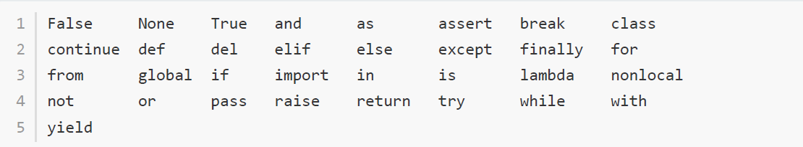
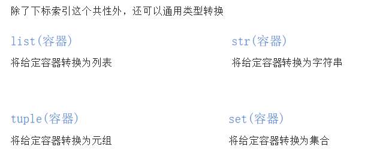
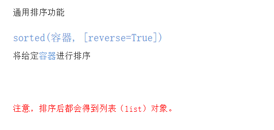

# 1、基本语法

## 1.1、注释

注释分为两类：单行注释 和多行注释

- 单行注释：只能注释一行内容

```python
# 注释内容     # 后面要加空格
```

- 多行注释：可以注释多行内容

```python
"""
     第一行注释
     第二行注释
     第三行注释
"""


'''
     注释1
     注释2
     注释3
'''
```


## 1.2、变量

变量名自定义，要满足==标识符==命名规则

```python
my_name = 'TOM';
print(my_name)

schoolName = '林小秦';
print(schoolName)
```

### 1.2.1、标识符

1. 由数字，字母，下划线开头

2. 不能数字开头

3. 不能使用**内置关键字(如图)**



4. 严格区分大小写

### 1.2.2、命名习惯

- 大驼峰：即每个单词首字母都大写，例如：`MyName`
- 小驼峰：第二个(含) 以后的单词首字母都大写，例如：`myName`
- 下划线：例如：`my_name`


### 1.2.3、变量作用域

变量作用域指的是变量的作用范围（变量在哪里可用，在哪里不可用）

- 局部变量：**定义在函数体内部的变量，即只在函数体内部生效**

  - 局部变量的作用：在函数体内部，临时保存数据，即当函数调用完成后，则销毁局部变量

    ```python
    def testA():
        num = 100
        print(num)
        
    testA() # 100
    print(num) # 报错
    ```

- 全局变量：**在函数体内、外都能生效的变量**

  - 思考：如果有一个数据，在函数A和函数B中都要使用，该怎么办？将这个数据存储在一个全局变量里面

    ```python
    # 定义全局变量
    num = 100
    
    def testA():
        # 访问全局变量num
        print(num)
        
    
    def testB():
        # 访问全局变量num
        print(num)
    # 100
    testA()
    # 100
    testB()
    ```

  

### 1.2.4、global关键字

使用 `global`关键字 可以**在函数内部声明变量为全局变量**,

```python
num = 100

def testA():
    print(num)
    
def testB():
    # global 关键字声明a是全局变量
    global num
    num = 200
    print(num)

# 100    
testA()
# 200
testB()
print(f"全局变量的值num= {num}") # 200
```


## 1.3、数据类型

| 数据类型 | 说明                    |                                                  |
| -------- | ----------------------- | ------------------------------------------------ |
| int      | 整型                    |                                                  |
| float    | 浮点型                  |                                                  |
| bool     | 布尔型                  |                                                  |
| str      | 字符串                  | 程序中需要加上**双引号**来表示字符串             |
| list     | 列表(有序的可变序列)    | Python中使用最频繁的数据类型，可有序记录一堆数据 |
| tuple    | 元组(有序的不可变序列)  | 可有序记录一堆不可变的Python数据集合             |
| set      | 集合(无序不重复集合)    | 可无序记录一堆不重复的Python数据集合             |
| dict     | 字典(无序Key-Value集合) | 可无序记录一堆Key-Value型的Python数据集合        |

检测数据类型的方法：`type()`

```python
a = 1
print(type(a)) # <class 'int'> -- 整型

b = 1.1
print(type(b)) # <class 'float'> -- 浮点型

c = True
print(type(c)) # <class 'bool'> -- 布尔型

d = '12345'
print(type(d)) # <class 'str'> -- 字符串

e = [10, 20, 30]
print(type(e)) # <class 'list'> -- 列表

f = (10, 20, 30)
print(type(f)) # <class 'tuple'> -- 元组

h = {10, 20, 30}
print(type(h)) # <class 'set'> -- 集合

g = {'name': 'TOM', 'age': 20}
print(type(g)) # <class 'dict'> -- 字典
```


## 1.4、输出

### 1.4.1、格式化输出

| 格式符号 | 转换                   |
| :------: | ---------------------- |
|   %d🔥    | 有符号的十进制整数     |
|   %f🔥    | 浮点数                 |
|   %s🔥    | 字符串                 |
|    %c    | 字符                   |
|    %u    | 无符号十进制数         |
|    %o    | 八进制整数             |
|    %x    | 十六进制整数（小写ox） |
|    %X    | 十六进制整数（大写OX） |
|    %e    | 科学计数法（小写'e'）  |
|    %E    | 科学计数法（大写'E'）  |
|    %g    | %f和%e的简写           |
|    %G    | %f和%E的简写           |

### 1.4.2、技巧

1. `%06d`，表示输出的整数显示位数，不足以0补全

2. `%.2f`，表示小数点后显示的小数位数

### 1.4.3、体验

- 格式化字符串除了 `%s`,还可以写为 `f'{表达式}'` ,写起来简单

```python
age = 18
name = 'TOM'
weight = 75.5
student_id = 1
# 我的名字是TOM
print('我的名字是%s' % name)

# 我的学号是0001
print('我的学号是%4d' % student_id)

# 我的体重是75.50公⽄斤
print('我的体重是%.2f公⽄斤' % weight)

# 我的名字是TOM，今年年18岁了了
print('我的名字是%s，今年年%d岁了了' % (name, age))

# 我的名字是TOM，明年19岁了了
print('我的名字是%s，明年%d岁了了' % (name, age + 1))

# 我的名字是TOM，明年19岁了了
print(f'我的名字是{name}, 明年{age + 1}岁了了')
```

### 1.4.4、转义字符

- `\n` ： 换行
- `\t` ： 制表符，一个 tab 键(4个空格) 的距离

### 1.4.5、结束符

在 python 中，`print()` 默认自带`end='\n'` 这个换行结束符，所以导致每两个 `print` 会直接换行展示

```python
print('输出的内容',end='\n')
print('123') 	# 默认自带end='\n'
```

## 1.5、输入

- **语法**：`input("提示信息")`

- 在 python 中，input 会把接收到数据都当作==字符串==处理

```python
password = input('请输⼊入您的密码：')
print(f'您输入的密码是{password}')

# <class 'str'>
print(type(password))
```


## 1.6、转换数据类型函数

| 函数                 | 说明                                                   |
| -------------------- | ------------------------------------------------------ |
| int(x,[base])🔥       | 将 x 转换为一个整数                                    |
| float(x)🔥            | 将 x 转换为一个浮点数                                  |
| complex(real,[imag]) | 创建一个复数，real 为实部，imag为虚部                  |
| str(x)🔥              | 将对象 x 转换为字符串                                  |
| repr(x)              | 将对象 x 转换为表达式字符串                            |
| eval(str)🔥           | 用来计算在字符串中的有效 python 表达式，并返回一个对象 |
| tuple(s)🔥            | 将序列 s 转换为一个元组                                |
| list(s)🔥             | 将序列 s 转换为一个列表                                |
| chr(x)               | 将一个整数转换为 Unicode 字符                          |
| ord(x)               | 将一个字符转换为它的 ASCII 整数值                      |
| hex(x)               | 将一个整数转换为一个十六进制字符串                     |
| oct(x)               | 将一个整数转换为一个八进制字符串                       |
| bin(x)               | 将一个整数转换为一个二进制字符串                       |

需求：input接收用户输入，用户输入“1”，将这个数据1转换成整型。

```python
# 1. 接收⽤用户输⼊入
num = input('请输入您的幸运数字：')

# 2. 打印结果
print(f"您的幸运数字是{num}")

# 3. 检测接收到的⽤用户输⼊入的数据类型 -- str类型
print(type(num))

# 4. 转换数据类型为整型 -- int类型
print(type(int(num)))
```

> [!NOTE]
>
> - 任何类型，都可以通过`str()`，转换成字符串
> - 字符串内必须真的是数字，才可以将字符串转换为数字

### 1.6.1、练习

```python
# 1. float() -- 转换成浮点型
num1 = 1
print(float(num1))          # 1.0
print(type(float(num1)))    # <class 'float'>

# 2. str() -- 转换成字符串类型
num2 = 10
print(type(str(num2)))      # <class 'str'>

# 3. tuple() -- 将⼀一个序列转换成元组
list1 = [10, 20, 30]
print(tuple(list1))             # (10, 20, 30)
print(type(tuple(list1)))       # <class 'tuple'>

# 4. list() -- 将⼀一个序列转换成列表
t1 = (100, 200, 300)
print(list(t1))                     # [100, 200, 300]
print(type(list(t1)))               # <class 'list'>

# 5. eval() -- 将字符串中的数据转换成Python表达式原本类型
str1 = '10'
str2 = '[1, 2, 3]'
str3 = '(1000, 2000, 3000)'
print(type(eval(str1)))         # <class 'int'>
print(type(eval(str2)))         # <class 'list'>
print(type(eval(str3)))         # <class 'tuple'>
```

## 1.7、运算符

- 算数运算符
- 赋值运算符
- 复合赋值运算符
- 比较运算符
- 逻辑运算符

### 1.7.1、算数运算符

| 运算符 | 描述 | 实例               |
| :----: | :--: | ------------------ |
|   +    |  加  | 1 + 1 = 2          |
|   -    |  减  | 1 - 1 = 0          |
|   *    |  乘  | 2 * 2 =4           |
|   /    |  除  | 10 / 2 = 5         |
|   //   | 整除 | 9 // 4 =2          |
|   %    | 取余 | 9 % 4 = 1          |
|   **   | 指数 | 2 ** 4 = 16        |
|   ()   | 括号 | 用来提高运算优先级 |

混合运算优先级顺序：`()` 高于 `**` 高于 `* ` `/`  `//` ` %`  高于  `+` `-`

### 1.7.2、赋值运算符

| 运算符 | 描述 | 实例                                  |
| ------ | ---- | ------------------------------------- |
| =      | 赋值 | 将 `=` 右侧的结果赋值给等号左侧的变量 |

- 单个变量赋值

```python
num = 1
print(num)
```

- 多个变量赋值

```python
num1, float1, str1 = 10, 0.5, 'hello world!'
print(num1)			# 10	
print(float1)		# 0.5
print(str1)			# hello world!
```

- 多个变量赋相同的值

```python
a = b = 10
print(a)	# 10
print(b)	# 10
```

### 1.7.3、复合赋值运算符

| 运算符 | 描述           | 实例                      |
| ------ | -------------- | ------------------------- |
| +=     | 加法赋值运算符 | c +=a 等价于 c = c + a    |
| -=     | 减法赋值运算符 | c -=a 等价于 c = c - a    |
| *=     | 乘法赋值运算符 | c *=a 等价于 c = c * a    |
| /=     | 除法赋值运算符 | c /=a 等价于 c = c / a    |
| //=    | 整除赋值运算符 | c //=a 等价于 c = c // a  |
| %=     | 取余赋值运算符 | c %=a 等价于 c = c % a    |
| **=    | 幂赋值运算符   | c ** =a 等价于 c = c ** a |

```python
a = 100
a += 1
# 输出101 a = a + 1,最终a = 100 + 1
print(a)


b = 2
b *= 3
# 输出6 b = b * 3,最终b = 2 * 3
print(b)

c = 10
c += 1 + 2
# 输出13, 先算运算符右侧1 + 2 = 3， c += 3 , 推导出c = 10 + 3
print(c)
```

### 1.7.4、比较运算符

比较运算符也叫关系运算符，通常用来判断

| 运算符 | 描述                                                         | 实例                                                         |
| ------ | ------------------------------------------------------------ | ------------------------------------------------------------ |
| ==     | 判断相等，如果两个操作数的结果相等，则条件结果为<br/>真True，否则条件结果为假False | 如a=3，b=3，则(a == b) 为True                                |
| !=     | 不不等于 。如果两个操作数的结果不不相等，则条件为<br/>真(True)，否则条件结果为假(False) | 如a=3,b=3，则（a == b) 为 True如<br/>a=1,b=3，则(a != b) 为 True |
| >      | 运算符左侧操作数结果是否⼤大于右侧操作数结果，<br/>如果大于，则条件为真，否则为假 | 如a=7,b=3，则(a > b) 为 True                                 |
| <      | 运算符左侧操作数结果是否⼩小于右侧操作数结果，<br/>如果小于，则条件为真，否则为假 | 如a=7,b=3，则(a < b) 为 False                                |
| >=     | 运算符左侧操作数结果是否⼤大于等于右侧操作数结<br/>果，如果大于，则条件为真，否则为假 | 如a=7,b=3，则(a < b) 为 False如<br/>a=3,b=3，则(a >= b) 为 True |
| <=     | 运算符左侧操作数结果是否⼩小于等于右侧操作数结<br/>果，如果小于，则条件为真，否则为假 | 如a=3,b=3，则(a <= b) 为 True                                |

```python
a = 7
b = 5
print(a == b) # False
print(a != b) # True
print(a < b) # False
print(a > b) # True
print(a <= b) # False
print(a >= b) # True
```


### 1.7.5、逻辑运算符

| 运算符 | 逻辑表达式 | 描述                                                         | 实例                                         |
| ------ | ---------- | ------------------------------------------------------------ | -------------------------------------------- |
| and    | x and y    | 布尔"与"：如果 x 为 False，x and y 返回<br/>False，否则它返回 y 的值。 | True and False， 返回<br/>False。            |
| or     | x or y     | 布尔"或"：如果 x 是 True，它返回 True，否则<br/>它返回 y 的值。 | False or True， 返回<br/>True。              |
| not    | not        | 布尔"非"：如果 x 为 True，返回 False 。如果 x<br/>为 False，它返回 True。 | not True 返回 False, not<br/>False 返回 True |

```python
a = 1
b = 2
c = 3
print((a < b) and (b < c)) # True
print((a > b) and (b < c)) # False
print((a > b) or (b < c)) # True
print(not (a > b)) # True
```

### 1.7.6、数字之间的逻辑运算

```python
a = 0
b = 1
c = 2

# and运算符，只要有一个值为0，则结果为0，否则结果为最后一个非0数字
print(a and b) # 0
print(b and a) # 0
print(a and c) # 0
print(c and a) # 0
print(b and c) # 2
print(c and b) # 1

# or运算符，只有所有值为0结果才为0，否则结果为第一个非0数字
print(a or b) # 1
print(a or c) # 2
print(b or c) # 1
```


## 1.8、IF

### 1.8.1、if...else...

1. 如果用户年龄大于等于18岁，即成年，输出"已经成年，可以上网"

```python
# input接收的是字符串，需要转换为整型
age = int(input("请输入您的年龄："))
if age >= 18:
    print(f"您的年龄为{age},成年可以上网")
else:
    print(f"您的年龄为{age},未成年无法上网")
```

> 注意：与 java 语言不同的是， if、else、while、for 后面都需要加 冒号`:`

### 1.8.1、if...elif...

2. 中国合法工作年龄为18-60岁，如果年龄小于18的情况为童工，不合法；如果年龄在18*-60岁之间，则为合法工龄；大于60岁为法定退休年龄

```python
# input接收的是字符串，需要转换为整型
age = int(input("请输入您的年龄："))
if age < 18:
    print(f"您的年龄小于18,不能进行工作，属于童工")
elif 18 <= age <= 60:
    # age >= 18 and age <= 60
    print(f"您的年龄为合法年龄，可以工作")
elif age > 60:
    print(f"您的年龄不属于合法工作年龄")
```

### 1.8.2、IF嵌套

3. 坐公交：如果有钱可以上车，没钱不能上车，上车后如果有空座，可以坐下，如果没空座，则要站着，怎么书写程序。

```python
money = 1
seat = 0
if money == 1:
    print("有钱，请上车")
    if seat == 1:
        print("有座位，请坐")
    else:
        print("没座位，不能坐")
else:
    print("没钱，不能上车")

```

4. 猜拳游戏

玩家手动出拳，电脑随机出拳

导入random模块

```python
import 模块名
```

使用random模块中的随机整数功能

```python
random.randint(开始，结束)
# random.randint(0,2)
```


```python
"""
提示：0-石头，1-剪刀，2-布
1.出拳
玩家输入出拳
电脑随机出拳

2.判断输赢
玩家获胜
平局
电脑获胜
"""

# 导入random模块
import random

# 计算电脑出拳的随机数字
computer = random.randint(0, 2)

# 玩家出拳
player = int(input("请玩家出拳：  0--石头，1--剪刀，2--布"))

# 玩家胜利  p0,c1  p1,c2 p2,c0
if((player==0) and (computer==1) or ((player==1) and (computer==2)) or ((player==2) and (computer==0))):
    print(f"玩家出拳是{player}")
    print(f"电脑出拳是{computer}")
    print("玩家获胜")
elif player==computer:
    print(f"玩家出拳是{player}")
    print(f"电脑出拳是{computer}")
    print("平局")
else:
    print(f"玩家出拳是{player}")
    print(f"电脑出拳是{computer}")
    print("电脑获胜")
```


### 1.8.3、三目运算符

```python
a = 1
b = 2
c = a if a>b else b
print(c)
# 条件成立执行的表达式 if 条件 else 条件不成立执行的表达式
```

## 1.9、循环

### 1.9.1、while

1. 计算1-100的累加和

```python
i = 1
sum = 0
while i <= 100:
    sum += i
    i += 1

print(sum)
```

2. 计算1-100的偶数累加和

①：可以加入判断是否为偶数，对2取余

```python
# 方法一：条件判断和对2取余数为0则累加计算
i = 1
sum = 0
while i <= 100:
    if i %2 ==0:
        sum += i
    i += 1

print(sum)
```

```python
# 方法二：计数器控制增量为2
i = 0
sum = 0
while i <= 100:
    sum += i
    i += 2

print(sum)
```

### 1.9.2、break

- 作用：终止此循环

```python
i = 1
while i <= 5:
    if i ==4:
        print(f'吃饱了不吃了')
        break
    print(f'吃了第{i}个苹果')
    i +=1
```


### 1.9.3、continue

- 作用：退出当前一次循环继而执行下一次循环代码

```python
i = 1
while i <= 5:
    if i == 3:
        print(f'大虫子,第{i}个不吃了')
        # 在 continue 之前一定要修改计数器，否则会陷入死循环
        i += 1
        continue  # continue 退出此次循环,后面的代码就不会执行,i就不会+1
    print(f'吃了第{i}个苹果')
    i +=1
```


### 1.9.4、while 循环嵌套

1. 打印星号（正方形）

分析：一行输出5个星号，重复打印5行

```python
"""
1.打印一个星星*
2.一行5个  循环 --- 打印一个星星的代码 ,不换行
3.打印5行  循环--一行五个的代码
"""
j = 0
while j < 5:
    # 一行星星开始
    i = 0
    while i< 5:
        print("*" , end=" ")
        i += 1
    #一行星星结束：换行显示下一行
    #这里借助空的print，利用print默认结束符换行
    print()
    j += 1
```

2. 打印星号(三角形)

分析：==一行输出星星的个数和行数是相等的==，每行：重复打印行号数字个星号，将打印行星号的命令重复执行5次实现打印5行

```python
# 重复打印5行星星
# j表示行号
j = 0
while j <=4:
    # 一行星星的打印、
    i = 0
    # i 表示每行里面星星的个数，这个数字要和行号相等所以 i要和j联动
    while i<=j:
        print('*',end='')
        i +=1
    print()
    j +=1
```

3. 打印99乘法表

```python
# 重复打印9行表达式
j = 1
while j <= 9:
    # 打印一行里面的表达式 a * b = a *b
    i = 1
    while i <= j:
        print(f'{i}*{j}={j*i}',end='\t')
        i +=1
    print()
    j +=1

```


### 1.9.5、for循环

```
for 临时变量 in 序列
    重复执行的代码1
    重复执行的代码2
    .........
```

```python
str1 = 'itheima'
for i in str1:
    print(i)
    #i
    #t
    #h
    #e
    #i
    #m
    #a
```

> for循环的注意点：
>
> - 无法定义循环条件，只能被动取出数据处理
> - 要注意，循环内的语句，需要有空格缩进

#### 1、range语句

```bash
for 临时变量 in 待处理数据集(可迭代对象): 
        循环满足条件时执行的代码
```

待处理数据集，严格来说，称之为：可迭代类型，可迭代类型指，其内容可以一个个依次取出的一种类型，包括：

- 字符串
- 列表
- 元组

语法：

- `range(num)` ：获取一个从0开始，到num结束的数字序列（不含num本身）
- `range(num1,num2)` ：获得一个从num1开始，到num2结束的数字序列（不含num2本身）
- `range(num1,num2,step)` ：获得一个从num1开始，到num2结束的数字序列（不含num2本身），数字之间的步长，以step为准（step默认为1）

```python
range(5)
# 获取一个从0开始，到num结束的数字序列（不含num本身）
# [0, 1, 2, 3, 4]

range(5, 10, 2)
# 取得的数据是：[5, 7, 9]
```


### 1.9.6、while...else...

循环可以和else配合使用，else下方缩进的代码指的是==当循环正常结束之后要执行的代码==。

```
while  条件:
        条件成立重复执行的代码
else:
      循环正常结束之后执行的代码
```

```python
i = 1
while i <= 5:
   print("老师，我错了！")
   i +=1
else:
   print("我何错之有？")
```

> 所谓 else 指的是循环正常结束之后要执行的代码，即如果是 break 终止循环的情况，else 下方缩进的代码将不执行。

### 1.9.7、for...else..

```python
for 临时变量 in 序列:
    重复执行的代码
    ...
else:
    循环正常结束后要执行的代码
```

> 所谓 else 指的是循环正常结束之后要执行的代码，即如果是 break 终止循环的情况，else 下方缩进的代码将不执行。

### 1.9.8、总结：

1. break退出整个循环

2. continue退出本次循环，继续执行下一次重复执行的代码

3. while 和 for 都可以配合else使用

4. else  下方缩进的代码含义：当循环正常结束后执行的代码

5. **break终止循环不会执行else下方缩进的代码**

6. **continue 退出循环的方式执行else下方缩进的代码**

# 2、字符串

- 双引号，单引号均可修饰字符串

```python
a = "TOM"
b = 'tom'
```

- 三引号字符串

```python
e='''i 
am TOM '''
# 三引号形式的字符串支持换行
```

- 创建字符串：I'm Tom

```python
c = "I'm Tom"
d = 'I\'m Tom'
```

- 字符串输出

```python
print('hello world')

name = 'Tom'
print('我的名字是%s' % name)
print(f'我的名字是{name}')
```


## 2.1、下标

- 字符串`name="abcdef"` ，取到不同下标对应的数据

```python
name = "abcdef"

print(name[1])  	# b
print(name[0])		# a
print(name[2])		# c
# 下标从 0 开始
```

## 2.2、切片

作用：对操作对象截取其一部分的操作，**字符串，列表，元组**都支持切片操作

语法：

```
序列[开始位置下标:结束位置下标:步长]
```

1. 不包含结束位置下标对应的数据，正负整数均可（即截取部分为**左闭右开**）

2. 步长是选取间隔，正负整数均可，默认步长为1

```python
name = "abcdefg"

print(name[2:5:1]) #cde
print(name[2:5])   #cde
print(name[:5])    #abcde
print(name[1:])    #abcdefg
print(name[:])     #abcdefg
print(name[::2])   #aceg
print(name[:-1])   #abcdef  -1表示倒数第一个数据
print(name[-4:-1]) #def
print(name[::-1])  #gfedcba
```

- `s[n: m]` : 表示从字符串s中取索引号从n到m-1的字符子串
- `s[n: ]`:省略结束索引号，表示切取索引号从n到最后一个字符的子串
- `s[: m]`:省略开始索引号，表示切取索引号从0到索引号为m-1的子串
- `s[-n: -m]` ： 表示从字符串s中切取索引号从倒数n到倒数m-1的字符子串
- `s[: :]`:省略开始和结束索引号，表示切取整个字符串。
- `s[: : -1]` ：获得整个字符串的逆序

## 2.3、字符串查找

字符串的常用操作方法有查找、修改和判断三大类

所谓字符串查找方法即是==查找子串在字符串中的位置或出现的次数==

### 2.3.1、find()

find()：检测某个字串是否包含在这个字符串中，如果在，返回这个字串**开始的位置下标**，否则返回-1

```
字符串序列.find(子串,开始位置下标,结束位置下标)
```

- 注意：**开始和结束位置下标可以省略，表示在整个字符串序列中查找**

```python
mystr ="hello world and itcast and itheima and python"

print(mystr.find('and'))    #返回12，helloworld为9，两个空格为2
print(mystr.find('and',15,30))  #返回23，找到第二个'and'
print(mystr.find('ands'))   #返回-1，没有这个子串
```

### 2.3.2、index()

index():检测某个字串是否包含在这个字符串中，如果在返回这个字串开始的位置下标，否则报异常

```
字符串序列.index(子串,开始位置下标,结束位置下标)
```

- 注意：**开始和结束位置下标可以省略，表示在整个字符串序列中查找**

```python
mystr ="hello world and itcast and itheima and python"

print(mystr.index('and'))   #12
print(mystr.find('and',15,30))  #返回23，找到第二个'and'
print(mystr.find('ands'))   #没有这个子串,报错
```

- rfind():和find()功能相同，但查找方向从**右侧**开始

- rindex():和index()功能相同，但查找方向从**右侧**开始

### 2.3.3、count()

count():返回某个子串在字符串中出现的次数

```
字符串序列.count(子串，开始位置下标，结束位置下标)
```

- 注意：开始位置和结束位置下标省略，表示在整个字符串中查找

```python
mystr ="hello world and itcast and itheima and python"

print(mystr.count('and'))  #3
print(mystr.count('ands'))  #0
print(mystr.count('and'),0,20)  #1
```

## 2.4、字符串修改

所谓修改字符串，指的是通过函数的形式修改字符串中的数据

### 2.4.1、replace()  替换

```
字符串序列.replace(旧子串,新子串,替换次数)
```

1. 如果替换次数不写，默认替换整个字符串

2. replace函数有返回值，返回值是修改后的字符串

3. 调用replace函数，原有字符串数据并没有修改，修改后的数据是replace函数的返回值

4. 字符串属于**不可变类型**
5. 替换次数如果超出子串出现次数，则替换次数为该子串出现次数

```python
mystr ="hello world and itcast and itheima and python"

# 将 and 替换为 he
new_str=mystr.replace('and','he')
print(new_str)
# 结果：hello world he itcast he itheima he Python

print(mystr.replace('and', 'he', 1))
# 结果：hello world he itcast and itheima and python
```

> 注意：数据按照是否能直接修改分为==可变类型==和==不可变类型==。字符串类型的数据修改的时候不能改变原有字符串，属于不能直接修改数据的类型即是不可变类型。

### 2.4.2、split() 分割

按照指定字符分割字符串

```
字符串序列.split(分割字符,num)
```

> num表示的是分割字符出现的次数，即将来返回数据个数为 num+1 个。

```python
mystr ="hello world and itcast and itheima and python"

list1 = mystr.split('and')
print(list)
#结果：['hello world ', ' itcast ', ' itheima ', ' Python']

list2 = mystr.split('and',2)
print(list2)
# 结果：['hello world ', ' itcast ', ' itheima and Python']

print(mystr.split(' '))
# 结果：['hello', 'world', 'and', 'itcast', 'and', 'itheima', 'and', 'Python']

print(mystr.split(' ', 2))
# 结果：['hello', 'world', 'and itcast and itheima and Python']
```

**注意：**如果分割字符是原有字符串中的子串，分割后则丢失该子串

### 2.4.3、join()  合并

join()：⽤⼀个字符或子串合并字符串，即是将多个字符串合并为⼀个新的字符串。

```
字符或子串.join(多字符串组成的序列)
```

```python
list1 = ['chuan', 'zhi', 'bo', 'ke']
print('_'.join(list1))
# 结果：chuan_zhi_bo_ke


t1 = ('aa', 'b', 'cc', 'ddd')
print('...'.join(t1))
# 结果：aa...b...cc...ddd
```

### 2.4.4、capitalize()

capitalize()：将字符串第⼀个字符转换成⼤写。

```python
mystr = "hello world and itcast and itheima and Python"
print(mystr.capitalize())
# 结果：Hello world and itcast and itheima and python
```

注意：capitalize()函数转换后，只字符串第⼀个字符⼤写，其他的字符全都小写

### 2.4.5、title()

title()：将字符串每个单词首字母转换成大写。

```python
mystr = "hello world and itcast and itheima and Python"
print(mystr.title())
# 结果：Hello World And Itcast And Itheima And Python
```

### 2.4.6、lower()

lower()：将字符串中大写转小写。

```python
mystr = "hello world and itcast and itheima and Python"

print(mystr.lower())
# 结果：hello world and itcast and itheima and python
```

### 2.4.7、upper()

upper()：将字符串中小写转大写。

```python
mystr = "hello world and itcast and itheima and Python"
print(mystr.upper())
# HELLO WORLD AND ITCAST AND ITHEIMA AND PYTHON
```


### 2.4.8、lstrip()

lstrip():  删除字符串左侧空白字符

```python
mystr = "    hello world and itcast and itheima and Python"
print(mystr.lstrip())
#结果：hello world and itcast and itheima and python
```

### 2.4.9、rstrip()

rstrip()：  删除字符串右侧空白字符

### 2.4.10、strip()

strip():  删除字符串两侧空白字符

```python
mystr = "    hello world and itcast and itheima and Python        "
print(mystr.strip())
#结果：hello world and itcast and itheima and Python
```


### 2.4.11、ljust()

ljust()：返回一个原字符串左对齐，并使用指定字符（默认空格）填充至对应长度的新字符串

```
字符串序列.ljust(长度，填充字符)
```

```python
mystr = 'hello'
print(mystr.ljust(10))
# hello     
print(mystr.ljust(10,'.'))
# hello.....
```

- rjust(): 返回一个原字符串右对齐，并使用指定字符（默认空格）填充至对应长度的新字符串

- center()：返回一个原字符串剧中对齐，并使用指定字符（默认空格）填充至对应长度的新字符串

## 2.5、字符串判断

所谓判断即是判断真假，返回的结果是布尔型数据类型：True 或 False

### 2.5.1、startswith()

startswith()： 检查字符串是否是以指定子串开头，是则返回True，否则返回False。如果设置开始和结束位置下标，则在指定范围内检查

```
字符串序列.startswith(子串，开始位置的下标，结束位置的下标)
```

```python
mystr = "hello world and itcast and itheima and Python "

print(mystr.startswith('hello'))
#结果为：True
print(mystr.startswith('hello', 5, 20))
#结果为：False
```

### 2.5.2、endswith()

endswith()：检查字符串是否是以指定子串结尾，是则返回True，否则返回False。如果设置开始和结束位置下标，则在指定范围内检查。

```python
mystr = "hello world and itcast and itheima and Python"

# 结果：True
print(mystr.endswith('Python'))

# 结果：False
print(mystr.endswith('python'))

# 结果：False
print(mystr.endswith('Python', 2, 20))
```


### 2.5.3、isalpha()

isalpha()：如果字符串⾄少有⼀个字符并且所有字符都是字母则返回 True, 否则返回 False

```python
mystr1 = 'hello'
mystr2 = 'hello12345'

# 结果：True
print(mystr1.isalpha())

# 结果：False
print(mystr2.isalpha())
```

### 2.5.4、isdigit()

isdigit():如果字符串只包含数字则返回True否则返回False

```python
mystr1 = 'aaa12345'
mystr2 = '12345'

# 结果： False
print(mystr1.isdigit())

# 结果：False
print(mystr2.isdigit())
```


### 2.5.5、isalnum()

isalnum():如果字符串至少有一个字符并且所有字符都是字母或数字则返回True，否则返回False

```python
mystr1 = '1 2 3 4 5'
mystr2 = ' '

# 结果：False
print(mystr1.isspace())

# 结果：True
print(mystr2.isspace())
```


## 2.6、字符串拼接

使用`+`加号拼接，

```python
name = "张三"
address = "北京"
print("我的名字是:" + name + "地址是:" + address)
```

> 注意：**字符串只能和字符串拼接，无法和非字符串类型进行拼接**

```python
name = "张三"
year = 2002
print(name + year); # 报错
```


## 2.7、字符串格式化

- `%`表示我要占位，`s`表示将变量变成字符串放入占位的地方
- 也可以`f'{变量}'`的方式占位

```python
age = 18
name = 'TOM'
# 我的名字是TOM
print('我的名字是%s' % name)


# 我的名字是TOM，今年年18岁了了
print('我的名字是%s，今年年%d岁了了' % (name, age))

# 我的名字是TOM，明年19岁了了
print(f'我的名字是{name}, 明年{age + 1}岁了了')
```

数字类型，也太没有地位了吧，竟然要被转成字符串拼接，有没有体面一点的方式，让数字以其原本的面貌拼接进去呢

| 格式 | 转化                             |
| ---- | -------------------------------- |
| %s   | 将内容转换成字符串，放入占位位置 |
| %d   | 将内容转换成整数，放入占位位置   |
| %f   | 将内容转换成浮点型，放入占位位置 |


# 3、列表

**格式：**

```python
[数据1,数据2,数据3,数据4....]
```

- 以 `[ ]` 作为标识
- 列表内每一个元素之间用, 逗号隔开
- **列表可以一次存储多个数据，且可以为不同的数据类型，支持嵌套**

列表可以一次性存储多个数据，且可以为**不同数据类型**，我们可以对这些数据进行的操作有：增、删、改、查

## 3.1、查找

### 3.1.1、通过下标

```python
name_list = ['Tom','Lily','Rose']

print(name_list[0])   #Tom
print(name_list[1])   #Lily
print(name_list[2])   #Rose
```

### 3.1.2、通过函数

1. **index()**：返回指定数据所在位置的下标 。

```python
列表序列.index(数据，开始位置下标，结束位置下标)
```

```python
name_list = ['Tom','Lily','Rose']
print(name_list.index('Lily',0,2))    #1
print(name_list.index('Lily')    #1
```

- 注意：如果查找的数据不存在则报错

2. **count()**:   统计指定数据在当前列表中出现的次数

```python
name_list = ['Tom','Lily','Rose']

print(name_list.count('Lily'))  #1
```

3. **len()**:  访问列表长度，即列表中数据的个数

```python
name_list = ['Tom','Lily','Rose']
print(len(name_list))   #3
```

### 3.1.3、判断是否存在

**in:**  判断指定数据在某个列表序列，如果在返回True，否则返回False

```python
name_list = ['Tom','Lily','Rose']

print('Lily' in name_list)
#结果： True

print('Lilys' in name_list)
#结果： False
```

**not in：**判断指定数据不在某个列表序列，如果不在返回True，否则返回False

需求：查找用户输入的名字是否已经存在

```python
name_list = ['TOM','Lily','Rose']

name = input('请输入您要搜索的名字：')

if name in name_list:
    print(f'您输入的名字是{name},名字已经存在')
else:
    print(f'您输入的名字是{name},名字不存在')
```

## 3.2、增加

### 3.2.1、append()

append（）: 列表结尾追加数据

```python
列表序列.append(数据)
```

```python
name_list = ['Ton','Lily','Rose']

name_list.append('xiaoming')

print(name_list)
# 结果：['Tom', 'Lily', 'Rose', 'xiaoming']
```

> 列表追加数据的时候，直接在原列表里面追加了指定数据，即修改了原列表，故列表为可变类型数据

```python
name_list = ['Ton','Lily','Rose']

name_list.append(['xiaoming', 'xiaohong'])
# 结果：['Tom', 'Lily', 'Rose', ['xi74ming', 'xiaohong']]
name_list.append('xiaoming', 'xiaohong') # 报错

print(name_list)
# 结果：['Tom', 'Lily', 'Rose', ['xiaoming', 'xiaohong']]


```

- 注意：如果append()追加的数据是一个序列，则追加整个序列到列表

### 3.2.2、extend()

extend():  列表结尾追加数据,如果数据是一个序列，则将这个序列的数据逐一添加到列表。

1. 单个数据

```python
name_list = ['Ton','Lily','Rose']

name_list.extend('xiaoming')

print(name_list)
# 结果：['Tom', 'Lily', 'Rose', 'x', 'i', 'a', 'o', 'm', 'i', 'n', 'g']
```

2. 序列数据

```python
name_list = ['Tom', 'Lily', 'Rose']

name_list.extend(['xiaoming', 'xiaohong'])
print(name_list)
# 结果：['Tom', 'Lily', 'Rose', 'xiaoming', 'xiaohong']
```

### 3.2.3、insert()

insert() : 指定位置新增数据

```python
列表序列.insert(位置下标，数据)
```

```python
name_list = ['Tom', 'Lily', 'Rose']

name_list.insert(1.'xiaoming')

print(name_list)
# 结果：['Tom', 'xiaoming', 'Lily', 'Rose']
```

## 3.3、删除

#### 3.3.1、del

```python
del  目标
```

1. 删除列表

```python
name_list = ['Tom', 'Lily', 'Rose']
del name_list
print(name_list)
# 已经删除，打印会报错
```

2. 删除指定数据

```python
name_list = ['Tom', 'Lily', 'Rose']
del name_list[0]
print(name_list)
# 结果：['Lily', 'Rose']
```

#### 3.3.2、pop()

pop():  删除指定下标的数据（默认为最后一个），并返回该数据

```python
列表序列.pop(下标)
```

```python
name_list = ['Tom', 'Lily','Rose']
del_name = name_list.pop(1)

print(del_name)
# Lily

print(name_list)
#['Tom','Rose']
```

1. 如果不指定下标，默认删除最后一个数据

2. 无论是按照下标，还是删除最后一个，Pop函数都会返回这个被删除的数据，需要进行接收

#### 3.3.3、remove()

remove(): 移除列表中某个数据的第一个匹配项。

```python
列表序列.remove(数据)
```

```python
name_list = ['Tom', 'Lily','Rose']
name_list.remove('Rose')

print(name_list)
# 结果： ['Tom','Lily']
```

#### 3.3.4、clear()

clear():清空列表

```python
name_list = ['Tom','Lily','Rose']

name_list.claer()
print(name_list)
#  结果： []
```

## 3.4、修改

修改指定的下标数据

```python
name_list = ['Tom','Lily','Rose']

name_list[0] = 'aaa'

print(name_list)
# 结果：['aaa','Lily','Rose']
```

### 3.4.1、reverse()

reverse():逆置

```python
name_list = [1,5,2,3,6,8]
num_list.reverse()

print(num_list)
# 结果：[8,6,3,2,5,1]
```

### 3.4.2、sort()

sort(): 排序

```python
列表序列.sort( key = None,reverse = False)
```

- 注意：reverse表示排序规则，reverse = True 降序，reverse = False 升序（默认）

```python
name_list = [1,5,2,3,6,8]

num_list.sort()

print(num_list)
#  结果： [1,2,3,5,6,8]
```


## 3.5、复制

### 3.5.1、copy()

```python
name_list = ['Tom','Lily','Rose']

name_li2 = name_list.copy()

print(name_li2)
#结果：['Tom','Lily','Rose']
```

## 3.6、列表的循环遍历

### 3.6.1、while

```python
name_list = ['Tom','Lily','Rose']

i = 0
while i< len(name_list):
    print(name_list[i])
    i +=1
    
    '''
    Tom
    Lily
    Rose
    '''
```

### 3.6.2、for

```python
name_list = ['Tom','Lily','Rose']

for i in name_list:
    print(i)
    
    '''
    Tom
    Lily
    Rose
    '''
```

## 3.7、列表的嵌套

所谓列表嵌套指的是一个列表里面包含了其他的子列表

应用场景：要存储班级⼀、⼆、三个班级学⽣生姓名，且每个班级的学⽣生姓名在一个列表。

```python
name_list = [['小明', '小红', '小绿'], ['Tom', 'Lily', 'Rose'], ['张三', '李四', '王五']]


#如何找到'李四'
# 第⼀步：按下标查找到李四所在的列表
print(name_list[2])     # ['张三', '李四', '王五']

# 第⼆步：从李四所在的列表⾥⾯，再按下标找到数据李四
print(name_list[2][1])      # 李四
```

# 4、元组

思考：如果想要存储多个数据，但是这些数据是不能修改的数据，怎么做？

答：列表？列表可以一次性存储多个数据，但是列表中的数据允许更改。需要使用元组。   

```python
num_list = [10, 20, 30]
num_list[0] = 100
# [100, 20, 30] 列表可以修改数据
print(num_list)
```

==一个元组可以存储多个数据，元组内的数据是不能修改的==

## 4.1、定义元组  

元组特点： 定义元组使用**小括号**，且**逗号**隔开各个数据，数据可以是不同的数据类型。

```python
# 多个数据元组
t1 = (10,20,30)

# 单个数据元组
t2 = (10,)
```

> 注意：如果定义的元组只有⼀个数据，那么这个数据后面也要添加逗号，否则数据类型为唯⼀的这个数据的数据类型

```python
t2 = (10,)
print(type(t2)) # tuple


t3 = (20)
print(type(t3)) # int

t4 = ('hello')
print(type(t4)) # str
```

## 4.2、查找

元组数据不支持修改，只支持查找，具体如下

### 4.2.1、按下标查找数据

```python
tuple1 = ('aa','bb','cc','dd')
print(tuple[0])
# aa
```

### 4.2.2、index()

index()：查找某个数据，如果数据存在返回对应的下标，否则报错，语法和列表、字符串的 index 方法相同

```python
tuple1 = ('aa','bb','cc','dd')
print(tuple.index('aa'))
# 0
```

### 4.2.3、count()

count()：统计某个数据在当前元组出现的次数

```python
tuple1 = ('aa','bb','cc','bb')
print(tuple.count('bb'))
# 2
```

### 4.2.4、len()

len()：统计元组中数据的个数

```python
tuple1 = ('aa','bb','cc','dd')
print(len(tuple))
#  4
```

> 注意：元组内的**直接数据如果修改**则立即报错

```python
tuple1 = ('aa','bb','cc','dd')
tuple1[0] = 'aaa'
# 这种情况下直接报错
```

> 但是如果元组里面有列表，修改列表里面的数据则是支持的

```python
tuple2 = (10, 20, ['aa', 'bb', 'cc'], 50, 30)

print(tuple2[2]) # 访问到列表        ['aa', 'bb', 'cc']
tuple2[2][0] = 'aaaaaa'
print(tuple2)
# 结果：(10, 20, ['aaaaa', 'bb', 'cc'], 50, 30)
```

# 5、集合

## 5.1、创建集合

创建集合使用   `{}`   或  `set()`  ,但是如果创建空集合只能使用`set()`,因为 `{}` 用来创建空字典   

1. 创建有数据集合

```python
s1 = {数据1，数据2，.....}
```

2.  创建无数据集合

```
s1 = set()
```


```python
s1 = {10, 20, 30, 40, 50}
print(s1)       # {40, 10, 50, 20, 30}

s2 = {10, 30, 20, 10, 30, 40, 30, 50}
print(s2)      # {40, 10, 50, 20, 30}

s3 = set('abcdefg')
print(s3)      # {'d', 'b', 'a', 'f', 'g', 'e', 'c'}

s4 = set()
print(type(s4)) # <class 'set'>

s5 = {}
print(type(s5)) # <class 'dict'>
```

特点：

1. **集合输出可以去掉重复数据**

2. **集合数据是无序的，故不支持下标**

## 5.2、增加数据

### 5.2.1、add()

```python
s1 = {10,20}
s1.add(100)
s1.add(10)
print(s1)
#  {100,10,20}
```

> 因为集合有去重功能，所以，当向集合内追加的数据是已知当前集合已有的数据的话，则不进行任何操作

### 5.2.2、updata()

update():   追加的数据是序列

```python
s1 = {10,20}
# s1.uppdate(100) # 报错
s1.update([100,200])
s1.update('abc')
print(s1)       # {100, 'b', 200, 10, 'c', 20, 'a'}
```

## 5.3、删除

### 5.3.1、remove()

remove(): 删除集合中指定数据，如果数据不存则报错

```python
s1 = {10,20}

s1.remove(10)
print(s1)
# {20}

s1.remove(10)
print(s1)
# 报错
```

### 5.3.2、discard()

discard():删除集合中的指定数据，如果数据不存在也不会报错

```python
s1 = {10, 20}

s1.discard(10)
print(s1)       # {20}

s1.discard(10)
print(s1)       # {20}
```


### 5.3.3、pop()

pop(): 随机删除集合中的某个数据，并返回这个数据

```python
s1 = {10,20,30,40,50}

del_num = s1.pop()
print(del_num)  # 40
print(s1)       # {10, 50, 20, 30}
```

## 5.4、查找

### 5.4.1、in

in: 判断数据在集合序列

not in : 判断数据不在集合序列

```python
s1 = {10,20,30,40,50}

print(10 in s1)
#  true
print(10 not in s1)
#  false
```

# 6、字典

字典里面的数据是以键值对形式出现，字典数据和数据顺序没有关系，即字典不支持下标，后期无论数据如何变化，只需要按照对应的键的名字查找数据即可。

## 6.1、创建字典

字典特点：

①：符号为**大括号**

②：数据为**键值对**形式出现

③：各个键值对之间用**逗号**隔开

```python
#  有数据字典
dict1 = {'name':'Tom','age':20}
# 空字典
dict2 = {}
dict3 = dict()
```

> 一般称冒号前面的为键(Key),简称K；冒号后面的为值(value),简称V

## 6.2、增加

写法：`字典序列[Key] = 值`

> 注意：如果 key 存在则修改这个 key 对应的值，如果 key 不存在则新增此键值对

```python
dict1 = {'name':'Tom','age':20,'gender':'男'}

dict1['name'] = 'Rose'
print(dict1)
# 结果： {'name';'Rose','age':20,'gender':'男'}

dict1['id'] = 110
print(dict1)
# 结果：# {'name': 'Rose', 'age': 20, 'gender': '男', 'id': 110}
```

> 注意：字典为可变类型

## 6.3、删除

#### 6.3.1、del()/del

del()/del: 删除字典或删除字典中指定键值对

```python
dict1 = {'name':'Tom','age':20,'gender':'男'}

del dict['gender']
print(dict1)
 # 结果：{'name': 'Tom', 'age': 20}
```

#### 6.3.2、celar()

celar():清空字典

```python
dict1 ={'name':'Tom','age':20,'gender':'男'}

dict1.clear()
print(dict1)
# {}
```

## 6.4、改

写法：`字典序列[Key] = 值`

> 注意：如果key存在则修改这个key对应的值，如果key不存在则新增此键值对。

## 6.5、查

```python
dict1 ={'name':'Tom','age':20,'gender':'男'}
print(dict1['name'])
#  Tom

print(dict1['id'])
#  报错
```

> 如果当前查找的key存在，则返回对应的值；否则报错

### 6.5.1、get()

```python
字典序列.get(key,默认值)
```

> 注意：如果当前查找的key不存在则返回第二个参数（默认值），如果省略第二个参数，则返回None

```python
dict1 ={'name':'Tom','age':20,'gender':'男'}
print(dict1.get('name'))
#  Tom

print(dict1.get('id',100))
#  100

print(dict1.get('id'))
#  None
```

### 6.5.2、keys()

取出字典中所有的key

```python
dict1 = {'name':Tom,'age':20,'gender':'男'}
print(dict1.keys())
# dict_keys(['name','age','gender'])
```

### 6.5.3、values()

取出字典中所有的value

```python
dict1 = {'name':Tom,'age':20,'gender':'男'}
print(dict1.values())
# dict_value(['Tom',20,'男'])
```

### 6.5.4、items()

以列表返回可遍历的(键、值)元组数组。

```python
dict1 = {'name':'Tom','age':20,'gender':'男'}
print(dict1.items())
#dict_items([('name','Tom'),('age',20),('gender','男')])
```

## 6.6、字典的循环遍历

### 6.6.1、遍历字典的key

```python
dict1 = {'name':'Tom','age':20,'gender':'男'}
for key in dict1.keys():
    print(key)

'''    
name
age
gender
'''
```

### 6.6.2、遍历字典的value

```python
dict1 ={'name':'Tom','age':20,'gender':'男'}
for value in dict1.values():
    print(value)

    '''
    Tom
    20
    男
    '''
```

### 6.6.3、遍历字典的元素

```python
dict1 = {'name':'Tom','age':20,'gender':'男'}
for item in dict1.items():
    print(item)
    
    '''
    ('name','Tom')
    ('age',20)
    ('gender','男')
    '''
```

### 6.6.4、遍历字典的键值对

```python
dict1 ={'name':'Tom','age':20,'gender':'男'}
for key,value in dict1.items():
    print(f'{key} = {value}')
    
    '''
    name = Tom
    age = 20
    gender = 男
    '''
```

# 7、通用操作

5类数据容器都支持for循环遍历，列表、元组、字符串支持while循环，集合、字典不支持（无法下标索引）








