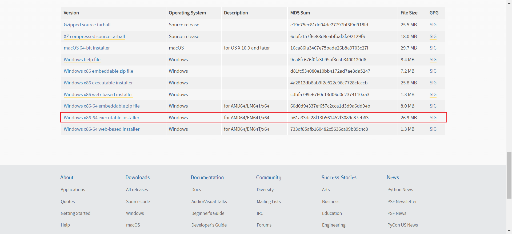
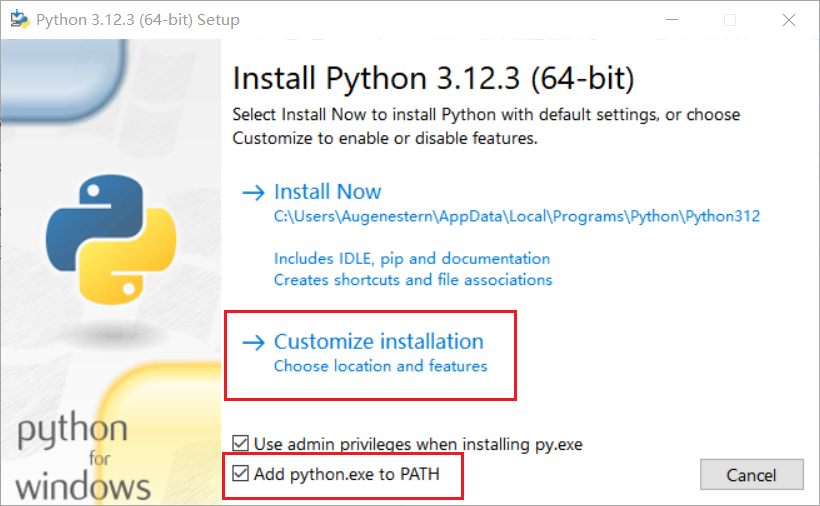
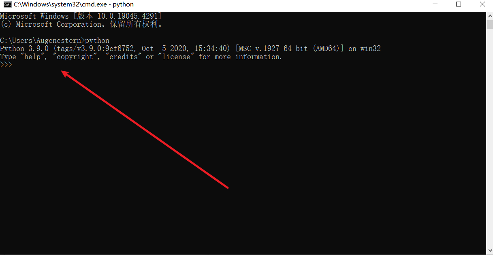
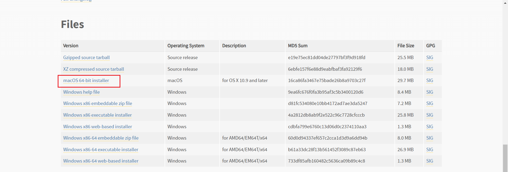
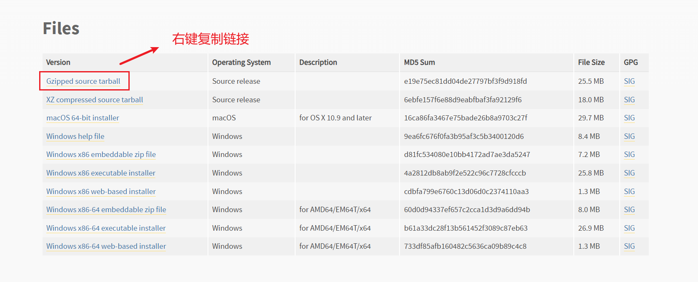
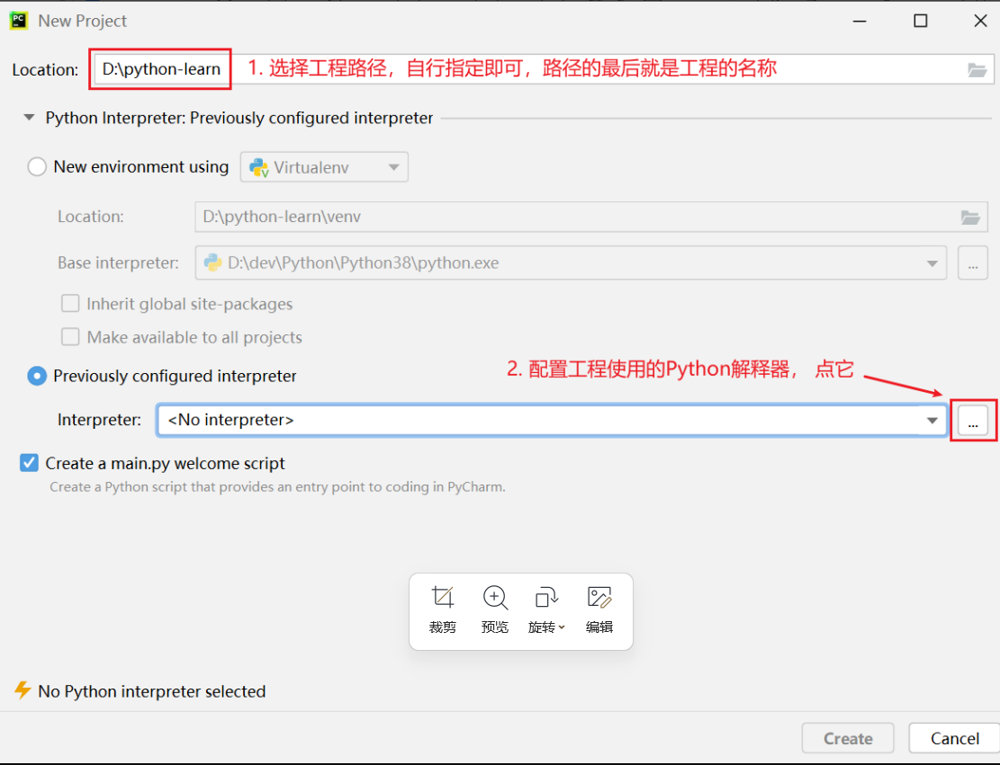
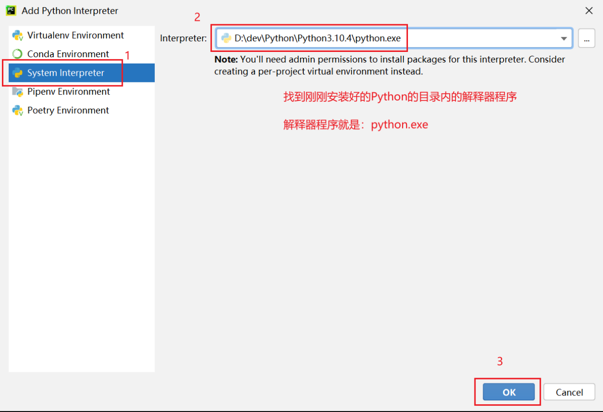

# 1、Python安装

## 1.1、Windows

1. 我这里推荐下载3.9版本，地址：https://www.python.org/downloads/release/python-390/




以下图为例，勾选`Add python.exe to PATH`




2. cmd 输入`python`




## 1.2、MacOS




下载安装，之后在终端输入`python3`验证


## 1.3、Linux（Centos）


在Linux上安装Python需要先安装前置依赖程序。登陆到Linux中，使用yum程序进行依赖程序安装，执行如下命令：·

```bash
yum install wget zlib-devel bzip2-devel openssl-devel ncurses-devel sqlite-devel readline-devel tk-devel gcc make zlib zlib-devel libffi-devel -y
```




```bash
cd ~


# 安装
wget https://www.python.org/ftp/python/3.10.4/Python-3.10.4.tgz

# 解压
tar -xvf Python-3.10.4.tgz

cd Python-3.10.4

# 配置
./configure --prefix=/usr/local/python3.10.4

# 编译
make && make install
```

编译完成后，可以配置软链接，方便快速使用python：

```bash
# 删除系统自带的老版本(python2)的软链接
rm -f /usr/bin/python

# 创建软链接
ln -s /usr/local/python3.10.4/bin/python3.10.4 /usr/bin/python
```

创建软链接后，会破坏yum程序的正常使用（只能使用系统自带的python2）

修改如下2个文件

```bash
/usr/bin/yum
/usr/libexec/urlgrabber-ext-down
```

使用vi编辑器，将这2个文件的第一行，从

```bash
#!/usr/bin/python
```

修改为

```bash
#!/usr/bin/python2
```

在Linux系统命令行窗口内，直接执行：`python` 并回车可验证是否成功


# 2、PyCharm

## 2.1、Python解释器

Python解释器，是一个计算机程序，用来翻译Python代码，并提交给计算机执行。所以，它的功能很简单，就2点：

1. 翻译代码
2. 提交给计算机运行

解释器存放在：`<Python安装目录>/python.exe`

我们在CMD（命令提示符）程序内，执行的python，就是上图的python.exe程序哦

1. 打开PyCharm







## 2.2、常用快捷键

- `ctrl + alt + s` : 打开软件设置
- `ctrl + d` ：复制当前行代码
- `shift + alt + 上\下` ： 将当前行代码上移或下移
- `crtl + shift + f10` : 运行当前代码文件
- `shift + f6` ：重命名文件
- `ctrl + a` : 全选
- `ctrl + c\v\x` : 复制、粘贴、剪切
- `ctrl + f` : 搜索


## 2.3、升级pip

> 注意：别挂VPN

```bash
# 升级pip
python -m pip install --upgrade pip
# 查看版本
pip -V

# 安装pyecharts
pip install pyecharts -i https://pypi.tuna.tsinghua.edu.cn/simple
# 查看版本
pip show pyecharts

# 安装Diango
pip install Django -i https://pypi.tuna.tsinghua.edu.cn/simple
# 查看版本
python -m django --version

# 安装pymysql
pip install pymysql -i https://pypi.tuna.tsinghua.edu.cn/simple
# 查看版本
pip show PyMySQL

# 安装mysqlclient
pip install mysqlclient -i https://pypi.tuna.tsinghua.edu.cn/simple

# 安装PyQt6
pip install PyQt6 -i https://pypi.tuna.tsinghua.edu.cn/simple


# 安装PyQt6-tools
pip install pyqt6-tools -i https://pypi.tuna.tsinghua.edu.cn/simple

# 安装Jinja3
pip install Jinja2 -i https://pypi.tuna.tsinghua.edu.cn/simple

# 安装requests网络请求模块
pip install requests -i https://pypi.tuna.tsinghua.edu.cn/simple
```


