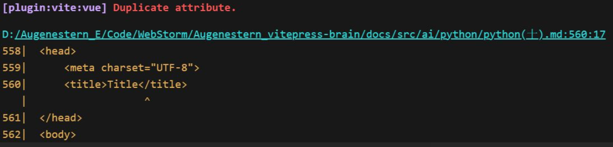
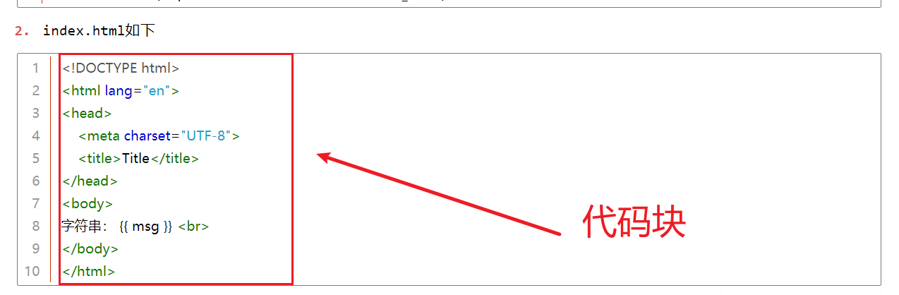
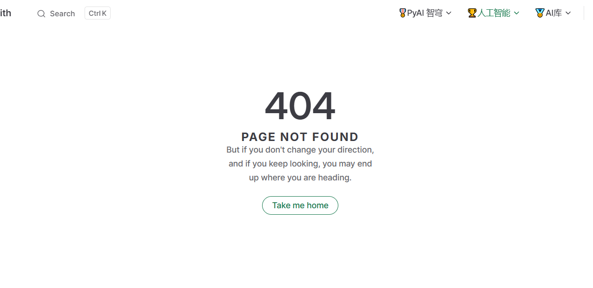
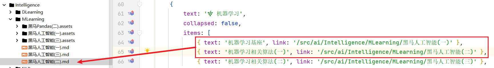
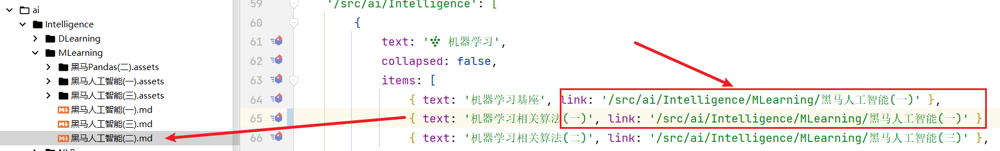
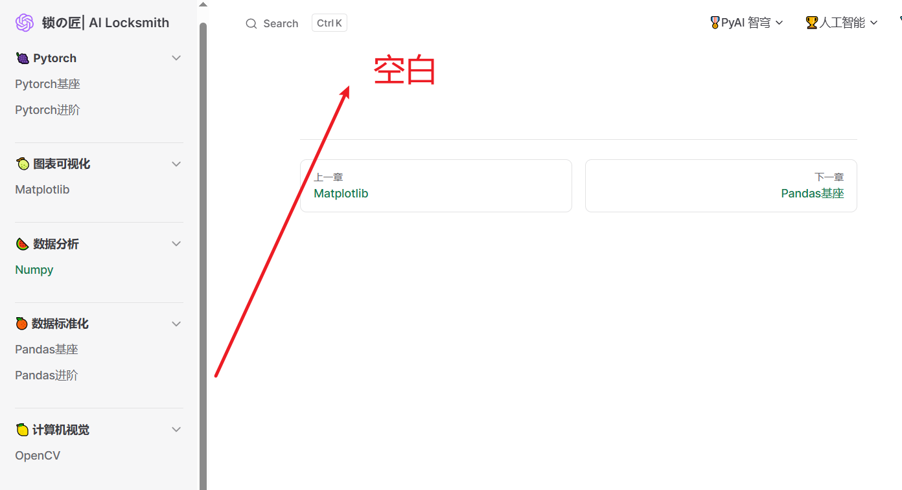
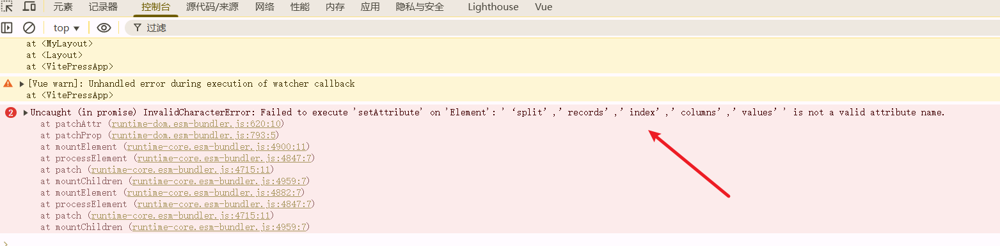

# 1、踩坑记录

> [!Tip]
>
> 若您对跳转到此处有疑问，请您接着向下阅读！

vitepress在将markdown转换为html的过程中，会出现莫名其妙的bug问题，我本地采用Typora + 本地图片目录的方式书写MD文件，在vitepress进行渲染过程中可能会出现莫名bug，时间关系，暂作相关记录。

- 另外之前想将另一个站点搬迁至Vitepress，目前由于下述问题，暂不做搬迁准备。
- `栈の阁|StackVault`：**前后端开发及云计算、运维等相关知识仓库**
- `锁の匠|AI Locksmith`： **AI 与安全、渗透等相关知识仓库**

<Linkcard url="https://linxiaoqin.netlify.app" title="栈の阁|StackVault" description="https://linxiaoqin.netlify.app" logo="/logo.jpg"/>

<Linkcard url="https://qinxiaolin.netlify.app" title="锁の匠|AI Locksmith" description="https://qinxiaolin.netlify.app" logo="/avatar.png"/>

## 1.1、duplicate attribute

- Duplicate attribute（重复属性），错误指向文件路径：D:/Augenstern_E/Code/WebStorm/Augenstern_vitepress-brain/docs/src/ai/python/python(上).md，行号560，位于`<title>`标签处。

- 我是用Typora写的代码块，这块在这行代码中并没有看到重复的属性，因为`<title>`标签本身没有任何属性。具体未作深度排查，如有建议，请联系。

## 1.2、404

- 看起来很像路由没写对是吧，我仔细排查了下自己写的Link，没发现什么错误

- 我直接将前两个Link写成一样的，就可以渲染出来了

依然怀疑是第二个md文件的事情，可是没有太多有效信息，所以我直接将404的页面链接到此页面，希望你能理解。

## 1.3、渲染空白

- md文件是有内容的，但是渲染不出来，且控制台报错：未对元素设置setAttribute？

- 依然是md渲染到html出现的问题，罢了，暂作记录！

