# 1、Docker


- 官方文档地址:https://www.docker.com/get-started 
- 中文参考手册：http://www.dockerinfo.net/document

- docker将程序以及程序所有的依赖都打包到docker container，这样你的程序可以在任何环境都会有一致的表现
- `build once, run everywhere`,无论运行在什么环境下程序的行为都是一致的

## 1.1、Docker解决依赖兼容问题

我们来回顾一下应用部署的环境问题：

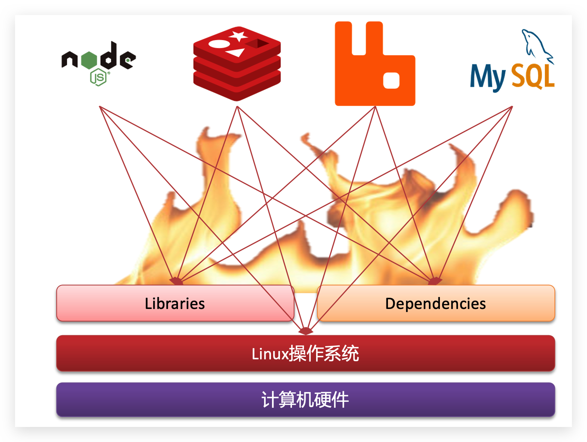

例如一个项目中，部署时需要依赖于node.js、Redis、RabbitMQ、MySQL等，这些服务部署时所需要的函数库、依赖项各不相同，甚至会有冲突。给部署带来了极大的困难。而Docker确巧妙的解决了这些问题，Docker为了解决依赖的兼容问题的，采用了两个手段：

- 将应用的Libs（函数库）、Deps（依赖）、配置与应用一起打包
- 将每个应用放到一个隔离**容器**去运行，避免互相干扰


这样打包好的应用包中，既包含应用本身，也保护应用所需要的Libs、Deps，无需再操作系统上安装这些，自然就不存在不同应用之间的兼容问题了。虽然解决了不同应用的兼容问题，但是开发、测试等环境会存在差异，操作系统版本也会有差异，怎么解决这些问题呢？


## 1.2、Docker解决操作系统环境差异

要解决不同操作系统环境差异问题，必须先了解操作系统结构。以一个Ubuntu操作系统为例，结构如下：


Ubuntu和CentO都是基于Linux内核，无非是系统应用不同，提供的函数库有差异：

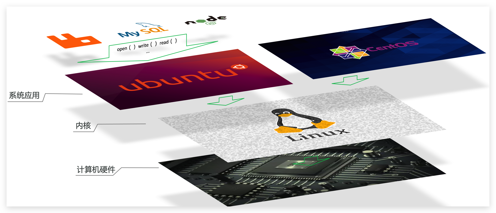


此时，如果将一个Ubuntu版本的MySQL应用安装到CentOS系统，MySQL在调用Ubuntu函数库时，会发现找不到或者不匹配，就会报错了，Docker如何解决不同系统环境的问题？

- Docker将用户程序与所需要调用的系统(比如Ubuntu)函数库一起打包
- Docker运行到不同操作系统时，直接基于打包的函数库，借助于操作系统的Linux内核来运行


## 1.3、Docker的优势

- **环境一致、高效迁移**: 如：我们一个java Web应用程序涉及很多东西，比如jdk、tomcat、mysql等软件环境。当这些其中某一项版本不一致的时候，可能就会导致应用程序跑不起来这种情况。Docker则将程序以及使用软件环境直接绑定在一起，无论在那个机器上保证了环境一致。
- **进程级隔离、容器独立**:如：服务器自己的程序挂了，结果发现是别人程序出了问题把内存吃完了，自己程序因为内存不够就挂了这种也是一种比较常见的情况，如果你的程序重要性不是特别高的话，公司基本上不可能让你的程序独享一台服务器的，这时候你的服务器就会跟公司其他人的程序共享一台服务器，所以不可避免地就会受到其他程序的干扰，导致自己的程序出现问题。Dock就很好解决了环境隔离的问题，别人程序不会影响到自己的程序。
- **镜像机制、便于部署**：公司要弄一个活动，可能会有大量的流量进来，公司需要再多部署几十台服务器。在没有Docker的情况下，要在几天内部署几十台服务器，这对运维来说是一件非常折磨人的事，而且每台服务器的环境还不一定一样，就会出现各种问题，最后部署的头皮发麻。用Dock的话，我只需要将程序打包到镜像，你要多少台服务，我就给跑多少容器，极大地提高了部署效率。


## 1.4、Docker和虚拟机区别

- **虚拟机**（virtual machine）是在操作系统中**模拟**硬件设备，然后运行另一个操作系统，比如在 Windows 系统里面运行 Ubuntu 系统，这样就可以运行任意的Ubuntu应用了。。
- **Docker**仅仅是封装函数库，并没有模拟完整的操作系统，如图：

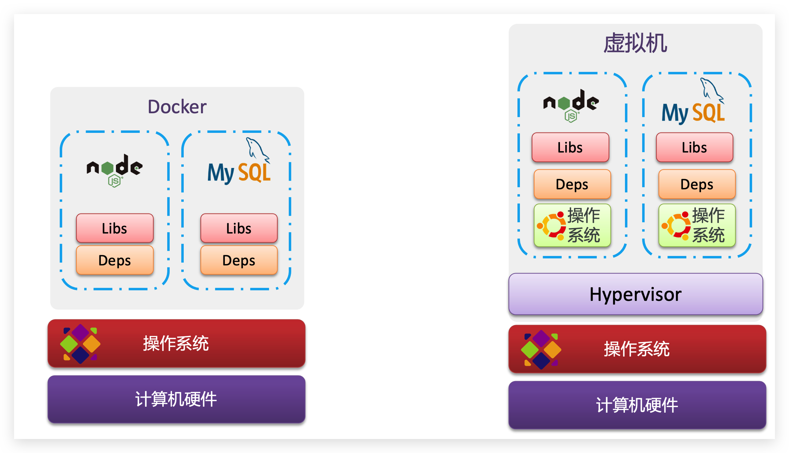


|             | 传统虚拟机                           | Docker容器                            |
| ----------- | ------------------------------------ | ------------------------------------- |
| 磁盘占用    | 几个GB - 几十个GB                    | 几十MB - 几百MB                       |
| CPU内存占用 | 虚拟操作系统非常占用CPU和内存        | Docker引擎占用极低                    |
| 启动速度    | 从开机到启动项目几分钟               | 从开启容器到运行项目几秒              |
| 安装管理    | 需要专门的运维技术                   | 安装、管理方便                        |
| 应用部署    | 每次部署都费时费力                   | 从第二次部署开始轻松简捷              |
| 耦合性      | 多个应用服务安装到一起，容易互相影响 | 每个应用一个容器，达成隔离            |
| 系统依赖    | 无                                   | 需求相同或相似的内核，目前推荐是Linux |


## 1.5、总结

Docker如何解决大型项目依赖关系复杂，不同组件依赖的兼容性问题？

- Docker允许开发中将应用、依赖、函数库、配置一起**打包**，形成可移植镜像
- Docker应用运行在容器中，使用沙箱机制，相互**隔离**

Docker如何解决开发、测试、生产环境有差异的问题？

- Docker镜像中包含完整运行环境，包括系统函数库，仅依赖系统的Linux内核，因此可以在任意Linux操作系统上运行


## 1.6、DockerHub

开源应用程序非常多，打包这些应用往往是重复的劳动。为了避免这些重复劳动，人们就会将自己打包的应用镜像，例如Redis、MySQL镜像放到网络上，共享使用，就像GitHub的代码共享一样。

- DockerHub：DockerHub是一个官方的Docker镜像的托管平台。这样的平台称为Docker Registry。
- 国内也有类似于DockerHub 的公开服务，比如 [网易云镜像服务](https://c.163yun.com/hub)、[阿里云镜像库](https://cr.console.aliyun.com/)等。

我们一方面可以将自己的镜像共享到DockerHub，另一方面也可以从DockerHub拉取镜像：

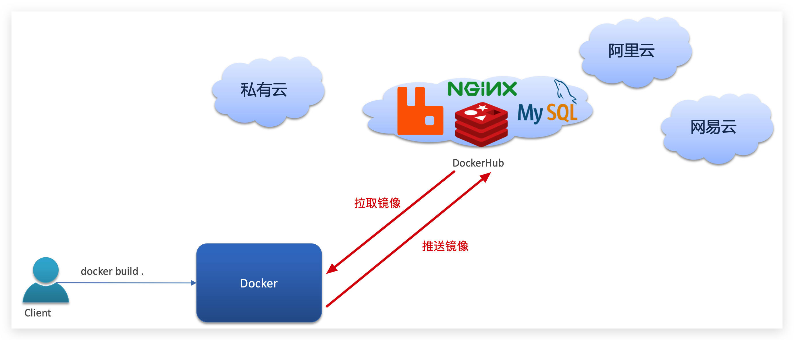


## 1.7、Docker架构

Docker是一个CS架构的程序，由两部分组成：

- **服务端(server)**：Docker守护进程，负责处理Docker指令，管理镜像、容器等
- **客户端(client)**：通过命令或RestAPI向Docker服务端发送指令。可以在本地或远程向服务端发送指令。

如图：


# 2、Docker的安装 - Centos


1. 如果系统中已经存在旧的Docker，则先卸载：

```bash
yum remove docker \
    docker-client \
    docker-client-latest \
    docker-common \
    docker-latest \
    docker-latest-logrotate \
    docker-logrotate \
    docker-engine
```

2. 配置Docker的yum库

```bash
# 安装yum
yum install -y yum-utils
# 配置Docker的yum源
yum-config-manager --add-repo https://download.docker.com/linux/centos/docker-ce.repo

# 2024/8/23注意：dockerhub已经不能访问了，使用原先的方式安装docker，服务器上也总是连接不上，所以得使用国内源安装
# 阿里源
yum-config-manager --add-repo http://mirrors.aliyun.com/docker-ce/linux/centos/docker-ce.repo
# or
# 清华源
yum-config-manager  --add-repo  https://mirrors.tuna.tsinghua.edu.cn/docker-ce/linux/centos/docker-ce.repo
```

3. 安装Docker

```bash
yum install -y docker-ce docker-ce-cli containerd.io docker-buildx-plugin docker-compose-plugin
```

4. 启动和校验

```bash
# 启动Docker
systemctl start docker

# 停止Docker
systemctl stop docker

# 重启
systemctl restart docker

# 设置开机自启
systemctl enable docker

# 执行docker ps命令，如果不报错，说明安装启动成功
docker ps
```

> docker -v 查看版本
>
> docker images 若出现:`Cannot connect to the Docker daemon at unix:///var/run/docker.sock. Is the docker daemon running?`
>
> 说明 docker 没有启动,我们启动docker并设置开机自启:
>
> ```bash
> # 启动Docker
> systemctl start docker
> 
> # 设置开机自启
> systemctl enable docker
> ```
>

## 2.1、镜像加速

由于默认的镜像仓库在国外，所以我们的访问速度非常慢，但是我们可以配镜像加速让我们能更好的拉取镜像。访问阿里云 - 搜索容器镜像服务 - 管理控制台 -  镜像工具 - 镜像加速器 = 按照操作文档的要求配置。

- https://cr.console.aliyun.com/cn-hangzhou/instances/mirrors

```bash
# 创建目录
sudo mkdir -p /etc/docker
# 复制内容，注意把其中的镜像加速地址改成你自己的
sudo tee /etc/docker/daemon.json <<-'EOF'
{
  "registry-mirrors": ["https://h1n33f8q.mirror.aliyuncs.com"]
}
EOF

# 重新加载配置
sudo systemctl daemon-reload

# 重启Docker
sudo systemctl restart docker
```

> 当前仅支持阿里云用户使用具备公网访问能力的阿里云产品进行镜像加速，且仅限于特定范围内的容器镜像。详情请见[公告](https://help.aliyun.com/zh/acr/product-overview/product-change-acr-mirror-accelerator-function-adjustment-announcement)。
>
> 所以阿里云镜像加速对于我这种使用vm开启的虚拟机而言，是没法加速的了...

> - 2024/12/24更新：
>   - 目前可用的镜像源如下：
>     - https://www.xuxlc.cn/article/details-40.html

> Docker 的默认安装位置在 `var/lib/docker` 下,可以使用 `docker -v` 查看版本

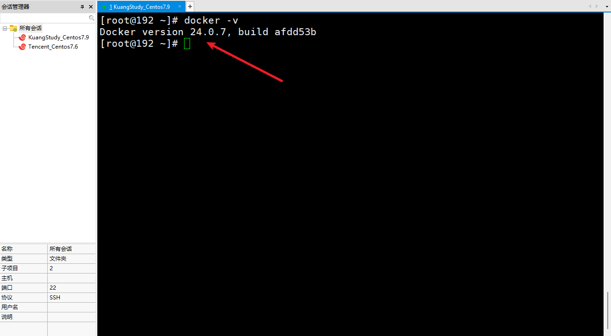


## 2.2、Docker中的核心概念

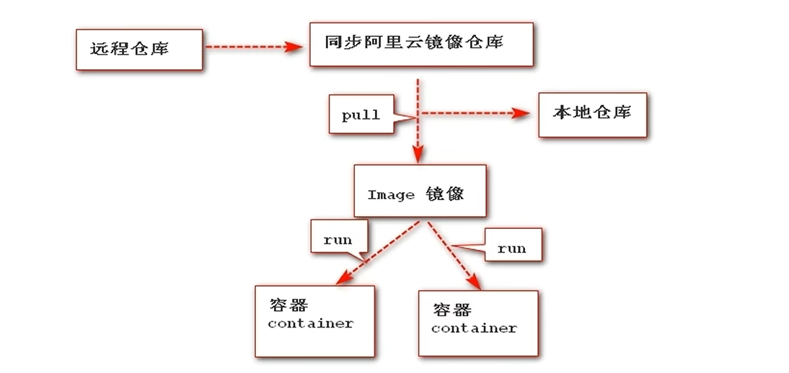


> Docker 容器引擎从远程仓库 Docker Hub 拉取镜像到本地仓库, 使用`run`命令将镜像运行，从而产生对应的容器。`run`两次就会生成两个容器。

1. **镜像Image**: 一个镜像就代表一个软件，例如 MySQL 镜像、redis 镜像 、 mq 镜像。Docker将应用程序及其所需的依赖、函数库、环境、配置等文件打包在一起，称为镜像。

2. **容器 Container**： 一个镜像运行一次就会生成一个容器，容器就是一个运行的软件服务。我们运行两次 Tomcat 镜像，就会生成两个 Tomcat 容器。镜像中的应用程序运行后形成的进程就是**容器**，只是Docker会给容器进程做隔离，对外不可见。
3. **远程仓库 Respostory** : 仓库是用来存储所有软件的镜像位置。例如仓库的web界面 `Docker Hub`，理解为 `Maven Respostory`
4. **本地仓库**: 用来存储在使用 Docker 过程中的相关镜像。可以理解为本地的 `Maven Repo`,一般在 `/var/lib/docker`

5. `dockerFile` : docker 生成镜像配置文件，用来书写自定义镜像的一些配置
6. `tar` ： 一个对镜像打包的文件，日后可以还原成镜像

一切应用最终都是代码组成，都是硬盘中的一个个的字节形成的**文件**。只有运行时，才会加载到内存，形成进程。

- 而**镜像**，就是把一个应用在硬盘上的文件、及其运行环境、部分系统函数库文件一起打包形成的文件包。这个文件包是只读的。
- **容器**呢，就是将这些文件中编写的程序、函数加载到内存中运行，形成进程，只不过要隔离起来。因此一个镜像可以启动多次，形成多个容器进程。

例如你下载了一个QQ，如果我们将QQ在磁盘上的运行**文件**及其运行的操作系统依赖打包，形成QQ镜像。然后你可以启动多次，双开、甚至三开QQ，跟多个妹子聊天。


## 2.3、Hello World

Docker 第一个应用程序是 Hello World

```bash
sudo docker run hello-world                                       
```

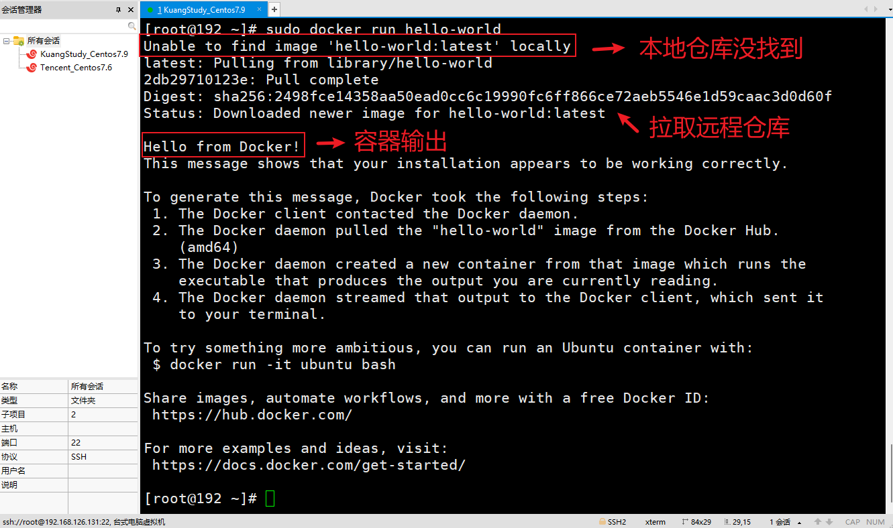

Docker 容器引擎先去找本地仓库是否有 hello-world 镜像的容器，没找到则去远程仓库拉取 hello-world 的镜像，然后执行`run`命令运行，容器输出`Hello from Docker`


# 3、Docker命令

比较常见的命令有：

| **命令**       | **说明**                       | **文档地址**                                                 |
| :------------- | :----------------------------- | :----------------------------------------------------------- |
| docker pull    | 拉取镜像                       | [docker pull](https://docs.docker.com/engine/reference/commandline/pull/) |
| docker push    | 推送镜像到DockerRegistry       | [docker push](https://docs.docker.com/engine/reference/commandline/push/) |
| docker images  | 查看本地镜像                   | [docker images](https://docs.docker.com/engine/reference/commandline/images/) |
| docker rmi     | 删除本地镜像                   | [docker rmi](https://docs.docker.com/engine/reference/commandline/rmi/) |
| docker run     | 创建并运行容器（不能重复创建） | [docker run](https://docs.docker.com/engine/reference/commandline/run/) |
| docker stop    | 停止指定容器                   | [docker stop](https://docs.docker.com/engine/reference/commandline/stop/) |
| docker start   | 启动指定容器                   | [docker start](https://docs.docker.com/engine/reference/commandline/start/) |
| docker restart | 重新启动容器                   | [docker restart](https://docs.docker.com/engine/reference/commandline/restart/) |
| docker rm      | 删除指定容器                   | [docs.docker.com](https://docs.docker.com/engine/reference/commandline/rm/) |
| docker ps      | 查看容器                       | [docker ps](https://docs.docker.com/engine/reference/commandline/ps/) |
| docker logs    | 查看容器运行日志               | [docker logs](https://docs.docker.com/engine/reference/commandline/logs/) |
| docker exec    | 进入容器                       | [docker exec](https://docs.docker.com/engine/reference/commandline/exec/) |
| docker save    | 保存镜像到本地压缩文件         | [docker save](https://docs.docker.com/engine/reference/commandline/save/) |
| docker load    | 加载本地压缩文件到镜像         | [docker load](https://docs.docker.com/engine/reference/commandline/load/) |
| docker inspect | 查看容器详细信息               | [docker inspect](https://docs.docker.com/engine/reference/commandline/inspect/) |

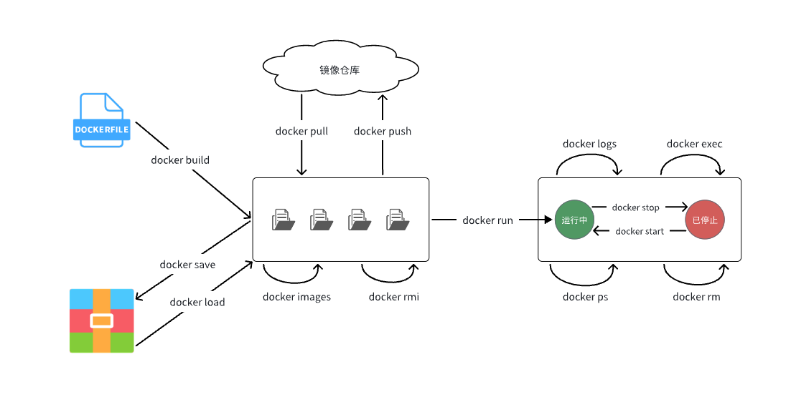

使用`docker pull` 将镜像从远程镜像仓库拉取到本地镜像仓库，使用`docker images` 查看本地镜像仓库的镜像,使用 `docker rmi` 删除本地镜像仓库的镜像，我们自己也可以自己构建镜像，使用 `docker build` 自定义镜像，我们可以使用 `docker save` 将自定义镜像保存成压缩文件，然后别人可以通过`docker load`将自定义镜像加载到他的本地镜像仓库中，或者将自定义镜像`docker push` 推送到远程镜像仓库。

`docker run` 创建并运行容器，`docker stop` 可以停止容器内的进程(例如 mysql 进程),`docker start` 又可以重新启动容器内的进程(例如 mysql 进程),`docker ps` 查看当前容器运行状态,`docker rm` 删除当前容器, `docker logs` 查看容器的日志,`docker exec` 可以进入容器从而对容器作一定的处理。


## 3.0、镜像操作

常见的镜像操作命令如图：

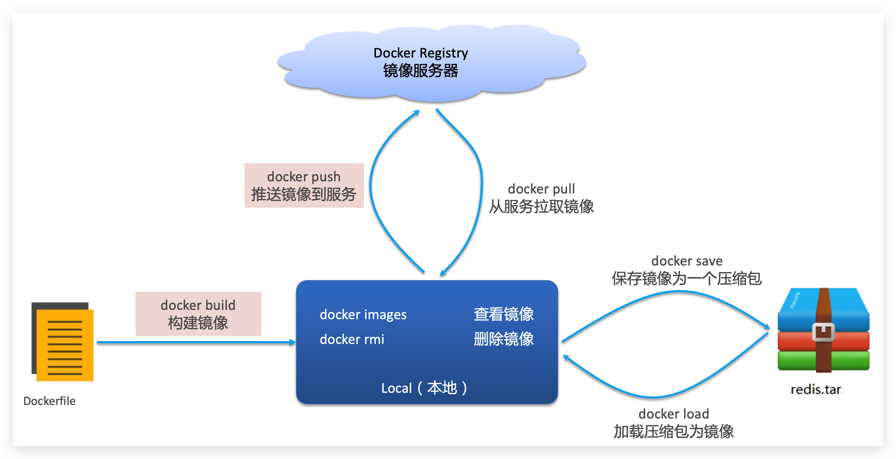


1. 下载镜像: `docker pull [镜像仓库地址/]镜像名[:标签]`

   - 镜像仓库地址和标签是可选的可加可不加。 如果没有指定镜像仓库地址Docker会自动从默认的镜像仓库中下载镜像。 **如果没有指定标签，默认是下载的latest标签的镜像**。


```bash
# 下载mysql镜像latest标签的镜像
docker pull mysql:latest

# 下载nginx镜像,不加标签则默认下载 latest 标签的镜像
docker pull nginx

# 下载mysql镜像5.7标签的镜像
docker pull mysql:5.7
```


2. 列出镜像信息：`docker images [选项]`
   - REPOSITORY 镜像名
   - TAG 镜像标签 
   - IMAGE ID 镜像ID(镜像的唯一标识) 
   - CREATED 镜像创建时间
   - SIZE 镜像大小

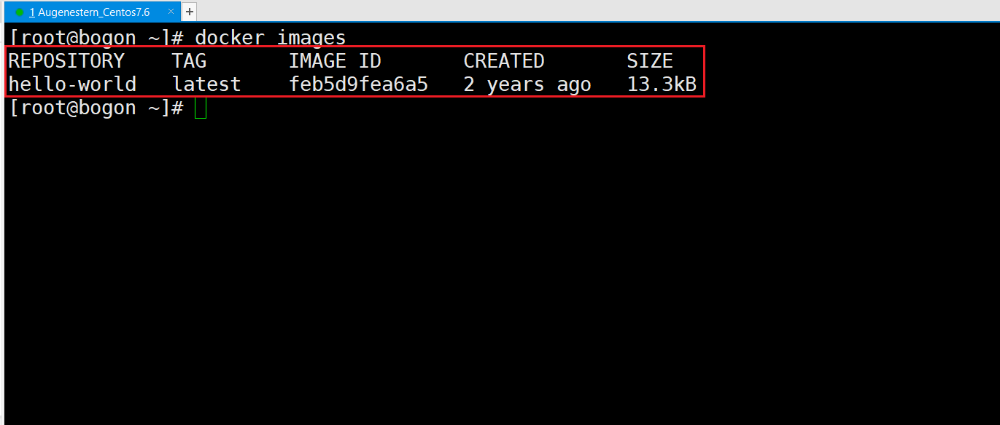

```bash
# 列出镜像的镜像id
docker images -q

# 列出所有镜像的的镜像id
docker images -aq

# 列出所有镜像名为mysql的镜像id
docker images -aq --filter=reference=mysql
```

## 3.1、容器操作

容器操作的命令如图：


容器保护三个状态：

- 运行：进程正常运行
- 暂停：进程暂停，CPU不再运行，并不释放内存
- 停止：进程终止，回收进程占用的内存、CPU等资源

其中：

- docker run：创建并运行一个容器，处于运行状态
- docker pause：让一个运行的容器暂停
- docker unpause：让一个容器从暂停状态恢复运行
- docker stop：停止一个运行的容器
- docker start：让一个停止的容器再次运行
- docker rm：删除一个容器

练习：

3. 列出容器信息：`docker ps [选项]` ，默认显示正在运行的容器信息

```bash
# 列出当前正在运行的容器
docker ps

# 列出所有容器，无论是否在运行
docker ps -a

# 列出所有退出状态的容器
docker ps -f status=exited
```

4. 创建并运行容器：`docker run [options] image [command] [arg...]`
   - options：选项，需重点关注 -d、-p、-v、-e、--restart 这几个选项
   - image：镜像信息，推荐使用 `镜像名：TAG` 的写法,如果只写镜像名，则相当于 TAG 是 latest
   - command：创建容器后要执行的命令
   - arg...：commadn命令的参数

例如：

```bash
# 创建nginx容器并显示所有文件及目录
docker run -d nginx:latest ls -a

docker run --name containerName -p 80:80 -d nginx
```

命令解读：

- `docker run` ：创建并运行一个容器
- `--name` : 给容器起一个名字，比如叫做containerName
- `-p` ：将宿主机端口与容器端口映射，**冒号左侧是宿主机端口，右侧是容器端口**
  - 发布多个端口：`docker run -p 宿主机端口1:容器端口1 -p 宿主机端口2:容器端口2 镜像名`
- `-d`：后台运行容器
  - `-it`：交互式运行
- `nginx`：镜像名称，例如nginx

这里的`-p`参数，是将**容器端口映射到宿主机端口**。**默认情况下，容器是隔离环境，我们直接访问宿主机的80端口，肯定访问不到容器中的nginx**。现在，将容器的80与宿主机的80关联起来，当我们访问宿主机的80端口时，就会被映射到容器的80，这样就能访问到nginx了：

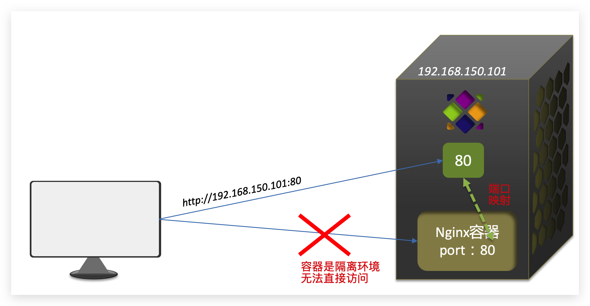


> 小贴士：
>
> - `lsof -i:端口号` ： 可以查看端口占用情况
> - `kill -9 进程ID号` ： 可以杀死进程

5. 删除容器：`docker rm [选项] [容器ID]`

例如：

```bash
docker rm 容器1
docker rm 容器1 容器2

# 删除hello-world的容器
docker rm 容器ID
# 尝试删除所有容器
docker rm -f $(docker ps -aq)

# 尝试删除所有非运行状态的容器
docker ps -f status=exited -q #查询退出状态的容器
docker rm $(docker ps -f status=exited -q) #删除退出状态的容器
```


6. 进入容器执行命令: `docker exec [选项] 容器ID或容器名 命令 [参数...]`

例如：

```bash
docker exec 容器id ls
```

- 进入Nginx容器，修改HTML文件内容，添加"生命是有光的！"

```bash
# 1.进入容器
docker exec -it 容器id bash

# 2.进入nginx的HTML所在目录 /usr/share/nginx/html
cd /usr/share/nginx/html

# 3.查看目录下文件
ls -l

# 4.修改index.html的内容,容器内没有vi命令，无法直接修改，我们用下面的命令来修改
sed -i -e 's#Welcome to nginx#生命是有光的！#g' -e 's#<head>#<head><meta charset="utf-8">#g' index.html

# 5.访问http://虚拟机地址:81
```

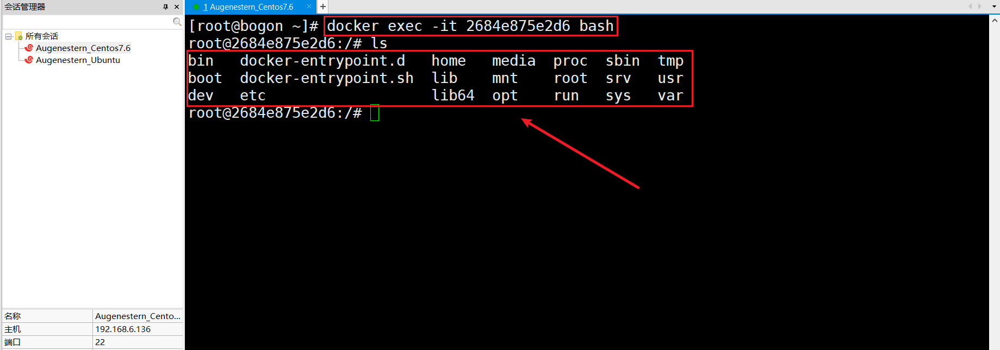

如上图，容器内部会模拟一个独立的Linux文件系统，看起来如同一个linux服务器一样，nginx的环境、配置、运行文件全部都在这个文件系统中，包括我们要修改的html文件。

- 查看 DockerHub 网站中的 nginx 页面，可以知道 nginx 的 html 目录位置在`/usr/share/nginx/html`，我们进入该目录进行修改

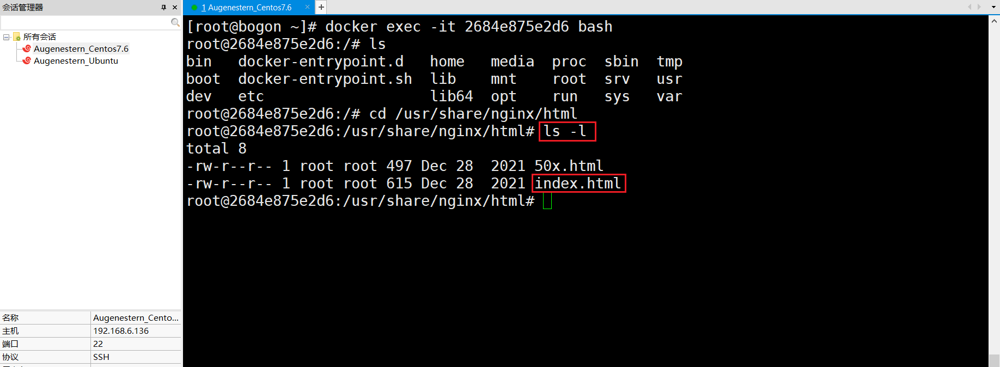

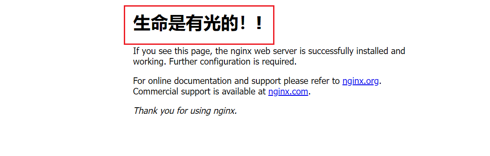

7. 查看容器日志:`docker logs [选项] 容器ID或容器名`

```bash
# 查看nginx容器的日志，要求需要持续显示新的日志
docker logs -f 容器id

# 查看nginx容器的最近20条日志
docker logs -n 20 容器id
```

8. 容器文件拷贝:我们可以使用 docker cp 命令来实现容器和宿主机之间文件和目录的相互拷贝

   - 把容器中的文件拷贝到宿主机中:

   `docker cp [OPTIONS] 容器名:源路径 目的路径`

   - 把宿主机的文件拷贝到容器中

   `docker cp [OPTIONS] 源路径 容器:目的路径`

- 拷贝任意一个文件到nginx容器中

```bash
docker cp /home/cp_test nginx:/home/cp_test
```

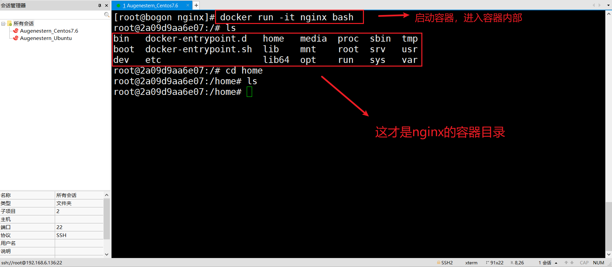

- 把nginx容器中的任意一个文件拷贝到宿主机中

```bash
docker cp nginx:/usr/share/nginx/html/index.html /home/index.html
```


9. 停止容器：`docker stop [选项] [容器ID或容器名...]`

```bash
# 停止一个后台运行的nginx容器
docker stop 容器id
```

10. 运行容器：`docker start [选项] 容器ID或容器名`

```bash
# 运行一个被停止的nginx容器
docker start 容器id
```

11. 设置环境变量
    - 为什么要用：容器中某些变量不能直接写死，需要让使用者在创建容器的时候指定，这种情况镜像中一般是定义环境变量来使用。例如 mysql 容器的 root 密码。遇到这种镜像创建的容器就可以使用 -e 来设置环境变量的值
    - 用法：`docker run -e 变量名=变量值 镜像名`

练习：后台运行一个mysql5.7的容器，要求容器中的mysql可以被外部连接，mysql容器的数据需要持久化存储，不能因为容器被删除而丢失。mysql的root用户的密码设置为 sangeng

```bash
# -d 以后台方式运行
# -p 端口映射
# -v 宿主机:容器目录
# -e 设置环境变量
docker run -d -p 3306:3306 -v /home/datadir:/var/lib/mysql -e MYSQL_ROOT_PASSWORD=sangeng mysql:5.7
```


## 3.2、Docker命令起别名

给常用Docker命令起别名，方便我们访问：

1. 修改/root/.bashrc文件

```bash
# 修改/root/.bashrc文件
vi /root/.bashrc
```

2. 修改为如下代码:

```bash
.bashrc

# User specific aliases and functions

alias rm='rm -i'
alias cp='cp -i'
alias mv='mv -i'
alias dps='docker ps --format "table {{.ID}}\t{{.Image}}\t{{.Ports}}\t{{.Status}}\t{{.Names}}"'
alias dis='docker images'

# Source global definitions
if [ -f /etc/bashrc ]; then
        . /etc/bashrc
fi
```

3. 保存后执行命令使别名生效

```bash
source /root/.bashrc
```


4. 使用别名

```bash
# 查看运行中容器
dps

# 查看本地镜像
dis
```


## 3.3、示例:部署MySQL

1. 在XShell命令行输入:

```bash
docker run -d \
  --name mysql \
  -p 3306:3306 \
  -e TZ=Asia/Shanghai \
  -e MYSQL_ROOT_PASSWORD=123 \
  mysql
```

- `docker run -d` ：创建并运行一个容器，`-d`则是让容器以后台进程运行
- `--name mysql ` : 给容器起个名字叫`mysql`，你可以叫别的
- `-p 3306:3306` : 设置端口映射。
  - **容器是隔离环境**，外界不可访问。但是可以将**宿主机端口映射容器内到端口**，当访问宿主机指定端口时，就是在访问容器内的端口了。
  - 容器内端口往往是由容器内的进程决定，例如MySQL进程默认端口是3306，因此容器内端口一定是3306；而宿主机端口则可以任意指定，一般与容器内保持一致。
  - 格式： `-p 宿主机端口:容器内端口`，示例中就是将宿主机的3306映射到容器内的3306端口
- `-e TZ=Asia/Shanghai` : 配置容器内进程运行时的一些参数
  - 格式：`-e KEY=VALUE`，KEY和VALUE都由容器内进程决定
  - 案例中，`TZ=Asia/Shanghai`是设置时区；`MYSQL_ROOT_PASSWORD=123`是设置MySQL默认密码
- `mysql` : 设置**镜像**名称，Docker会根据这个名字搜索并下载镜像
  - 格式：`REPOSITORY:TAG`，例如`mysql:8.0`，其中`REPOSITORY`可以理解为镜像名，`TAG`是版本号
  - 在未指定`TAG`的情况下，默认是最新版本，也就是`mysql:latest`

# 4、数据卷

容器是隔离环境，容器内程序的文件、配置、运行时产生的容器都在容器内部，我们要读写容器内的文件非常不方便。大家思考几个问题：

- 如果要升级MySQL版本，需要销毁旧容器，那么数据岂不是跟着被销毁了？
- MySQL、Nginx容器运行后，如果我要修改其中的某些配置该怎么办？
- 我想要让Nginx代理我的静态资源怎么办？

因此，容器提供程序的运行环境，但是**程序运行产生的数据、程序运行依赖的配置都应该与容器解耦**。


## 4.0、什么是数据卷

**数据卷（volume）**是一个虚拟目录，是**容器内目录**与**宿主机目录**之间映射的桥梁。

1. 为什么要用：在之前的nginx案例中，修改nginx的html页面时，需要进入nginx内部。并且因为没有编辑器，修改文件也很麻烦。这就是因为容器与数据（容器内文件）耦合带来的后果。要解决这个问题，必须将数据与容器解耦，这就要用到数据卷了。
2. 概念理解：**将宿主机目录或文件挂载到容器中，实现宿主机和容器之间的数据共享和持久化**

**数据卷（volume）**是一个虚拟目录，指向宿主机文件系统中的某个目录。**一旦完成数据卷挂载，对容器的一切操作都会作用在数据卷对应的宿主机目录了。**


这样，我们操作宿主机的`/var/lib/docker/volumes/html`目录，就等于操作容器内的`/usr/share/nginx/html`目录了


## 4.1、数据卷命令

数据卷的相关命令有：

| **命令**              | **说明**             | **文档地址**                                                 |
| :-------------------- | :------------------- | :----------------------------------------------------------- |
| docker volume create  | 创建数据卷           | [docker volume create](https://docs.docker.com/engine/reference/commandline/volume_create/) |
| docker volume ls      | 查看所有数据卷       | [docs.docker.com](https://docs.docker.com/engine/reference/commandline/volume_ls/) |
| docker volume rm      | 删除指定数据卷       | [docs.docker.com](https://docs.docker.com/engine/reference/commandline/volume_prune/) |
| docker volume inspect | 查看某个数据卷的详情 | [docs.docker.com](https://docs.docker.com/engine/reference/commandline/volume_inspect/) |
| docker volume prune   | 清除数据卷           | [docker volume prune](https://docs.docker.com/engine/reference/commandline/volume_prune/) |


> **注意**：容器与数据卷的挂载要在创建容器时配置，对于创建好的容器，是不能设置数据卷的。而且**创建容器的过程中，数据卷会自动创建**。
>
> 思考：如果需要删除一个正在被使用的数据卷应该怎么办呢？ 删除容器后再去删除数据卷

### 4.1.1、设置数据卷

我们之前是采用宿主机目录的绝对路径，事实上我们可以直接使用数据卷的别名来作为宿主机的目录来使用。如果这个别名的数据卷还不存在的话，Docker会自动帮我们创建对应的数据卷。

- 绝对路径用法：`docker run -v 宿主机目录:容器目录[:读写权限] 镜像名 别名`
  - 读写权限：在使用 `-v` 选项时，可以添加 `:ro` 或者 `:rw` 来指定容器对宿主机(挂载的目录)是只读 read-only 还是可读写 read-write。默认是 rw

- 别名用法：`docker run -v 数据卷别名:容器目录[:读写权限] 镜像名`

例如：

```bash
docker run -d -p 80:80 -v nginx_html:/usr/share/nginx/html nginx
```


## 4.2、给Nginx挂载数据卷

1. 在执行`docker run` 命令时,使用 `-v 数据卷:容器内目录` 可以完成数据卷挂载。当创建容器时，如果挂载了数据卷且数据卷不存在，会自动创建数据卷。

```bash
# 1.首先创建容器并指定数据卷，注意通过 -v 参数来指定数据卷,将数据卷html挂载到 /usr/share/nginx/html
docker run -d -p 81:80 -v html:/user/share/nginx/html nginx
```

2. 查看数据卷

```bash
docker volume ls

# 查看html数据卷的位置
docker volume inspect html
```

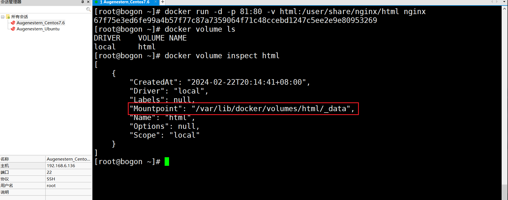

- 可以看到，我们创建的html这个数据卷关联的宿主机目录为`/var/lib/docker/volumes/html/_data`目录。

3. 进入该目录，并随意修改index.html内容

```bash
# 进入该目录
cd /var/lib/docker/volumes/html/_data
# x
vi index.html
```

5. 打开页面，查看效果: http://虚拟机地址


## 4.3、挂载本地目录或文件

可以发现，数据卷的目录结构较深，如果我们去操作数据卷目录会不太方便。在很多情况下，我们会直接将**容器目录与宿主机指定目录挂载**。关联关系区别如下：

- 带数据卷模式：宿主机目录 --> 数据卷 ---> 容器内目录
- **直接挂载模式**：宿主机目录 ---> 容器内目录

挂载语法与数据卷类似：

```bash
# 挂载本地目录
-v 本地目录:容器内目录
# 挂载本地文件
-v 本地文件:容器内文件
```

> **注意**：本地目录或文件必须以 `/` 或 `./`开头，如果直接以名字开头，会被识别为数据卷名而非本地目录名。

```bash
-v mysql:/var/lib/mysql # 会被识别为一个数据卷叫mysql，运行时会自动创建这个数据卷

-v ./mysql:/var/lib/mysql # 会被识别为当前目录下的mysql目录，运行时如果不存在会创建目录
```


示例:删除并重新创建mysql容器，并完成本地目录挂载,要求如下

- 挂载宿主机的`/root/mysql/data`到容器内的`/var/lib/mysql`目录
- 挂载宿主机的`/root/mysql/init`到容器内的`/docker-entrypoint-initdb.d`目录（初始化的SQL脚本目录）
- 挂载宿主机的`/root/mysql/conf`到容器内的`/etc/mysql/conf.d`目录（这个是MySQL配置文件目录）

接下来，我们演示本地目录挂载：

1. 删除原来的MySQL容器

```bash
docker rm -f mysql
```

2. 进入root目录

```bash
cd ~
```

3. 创建并运行新mysql容器，挂载本地目录

```bash
docker run -d \
  --name mysql \
  -p 3306:3306 \
  -e TZ=Asia/Shanghai \
  -e MYSQL_ROOT_PASSWORD=123 \
  -v ./mysql/data:/var/lib/mysql \
  -v ./mysql/conf:/etc/mysql/conf.d \
  -v ./mysql/init:/docker-entrypoint-initdb.d \
  mysql
```

5. 查看root目录，可以发现`~/mysql/data` 、 `~/mysql/conf` 、 `~/mysql/init`目录已经自动创建好了

```bash
ls -l mysql
```


我们可以在宿主机本地目录下进行代码配置,就相当于直接在容器中进行代码配置了。


# 5、Docker inspect

Docker inspect 命令返回的结果是一个 JSON 对象，包含容器的详细信息。以下是一些重要的字段和它们的含义：

```bash
docker inspect 容器名
```

`Config` 字段包含了容器的配置信息，包括：

- `Hostname`：容器的主机名。
- `Domainname`：容器的主域名。
- `User`：运行容器的用户。
- `AttachStdin`：是否绑定标准输入。
- `AttachStdout`：是否绑定标准输出。
- `AttachStderr`：是否绑定标准错误输出。
- `Tty`：是否分配一个伪终端。
- `OpenStdin`：是否打开标准输入。
- `StdinOnce`：是否只允许一次输入。
- `Env`：环境变量。
- `Cmd`：启动容器时运行的命令。
- `Healthcheck`：健康检查配置。
- `Entrypoint`：容器的入口点。

`HostConfig` 字段包含了容器的运行配置，包括：

- `Binds`：绑定宿主机目录到容器目录。
- `ContainerIDFile`：容器 ID 文件。
- `LogConfig`：日志配置。
- `NetworkMode`：网络模式。
- `PortBindings`：端口绑定。
- `RestartPolicy`：重启策略。
- `VolumeDriver`：卷驱动。
- `WorkingDir`：工作目录。

`State` 字段包含了容器的当前状态，包括：

- `StartedAt`：容器启动时间。
- `FinishedAt`：容器停止时间。
- `HealthStatus`：健康检查状态。
- `Pid`：进程 ID。
- `ExitCode`：退出代码。


