# 1、项目部署案例

项目是一个前后端分离的博客系统，完整的项目包含了前台和后台的前后端服务。本案例中主要需要部署前台的前后端系统

- 其中后端服务运行需要依赖MySQL做为数据库，redis来缓存数据。
- 前端服务部署在Nginx上，后端服务是一个SpringBoot服务，需要java环境运行。

## 1.1、mysql容器准备

要求：

- 版本5.7：mysql:5.7
- 后台运行：-d
- 容器命名为blog_mysql: --name blog_mysql
- 数据需要持久化存储：-v
- 开放3306端口：-p
- 设置root密码：-e
- 停止后自动重启：--restart

命令：

```bash
# -d 后台启动
# -v mysql_data:/var/lib/mysql  数据卷别名data，容器目录为 /var/lib/mysql
# -p 3306:3306 宿主机端口3306:容器端口3306
# -e MYSQL_ROOT_PASSWORD=root 容器 mysql 的密码是root
# --restart alwarys 容器停止后自动重启
docker run 
--name blog_mysql
-d 
-v mysql_data:/var/lib/mysql
-p 3306:3306
-e MYSQL_ROOT_PASSWORD=root
--restart always
mysql:5.7
```


将资料的sql文件执行。

> 注意：我们容器开放的是宿主机的3306端口，所以在连接MySQL的时候，连接的ip是宿主机的IP

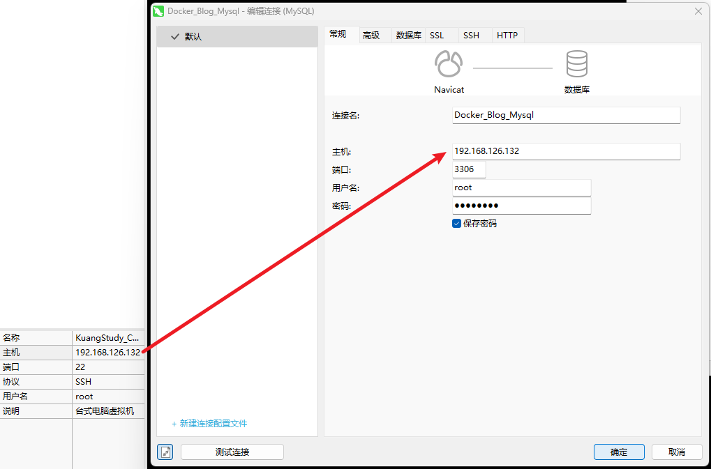


## 1.2、redis容器准备

要求：

- 版本7：redis:7.0
- 后台运行：-d
- 容器命名为blog_redis: --name redis
- 数据需要持久化存储：-v
- 开放6379端口：-p
- 停止后自动重启：--restart

- 开启redis的AOF持久化机制： redis-server --appendonly yes

命令：

```bash
docker run 
-d
--name blog_redis
-v redis_data:/data
-p 6379:6379
--restart always
redis:7.0 redis-server --appendonly yes
```


## 1.3、后端服务器部署

将`jar`包上传至`/usr/blog`

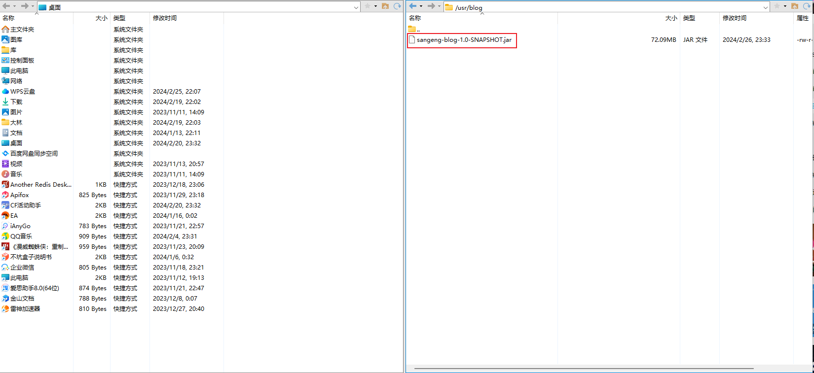

要求：

- 使用 openjdk 8u111版本，去运行springboot服务
- 开放端口7777：-p
- 后台运行：-d
- 容器命名：--name sg_blog
- jar包放数据卷：-v
- 停止后自动重启：--restart

命令：

```bash
docker run
-p 7777:7777
-d
--name sg_blog
-v /usr/blog:/usr/blog
--restart always
java:openjdk-8u111 
java -jar /usr/blog/sangeng-blog-1.0-SNAPSHOT.jar
```

## 1.4、网络配置

### 1.4.1、容器ip通信

1. 查看容器

```bash
docker ps
```

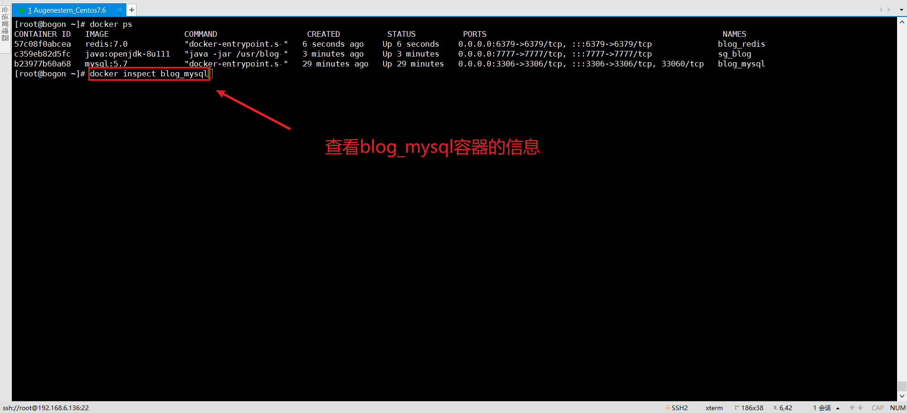


2. 查看`blog_mysql`容器的详细信息，可以看到其ip为 172.17.0.2

```bash
docker inspect blog_mysql
```

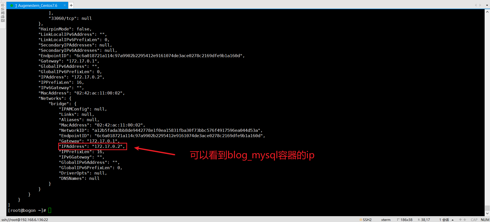


3. 我们进入任意一个容器的 bash，ping命令我们的 blog_mysql 容器的ip

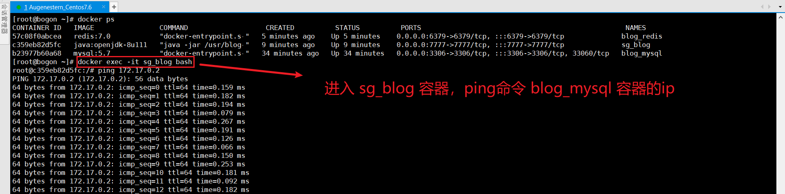


这就说明容器和容器可以通过ip地址进行设置的，但是这个ip地址是Docker随机分配的，使用起来是很不方便的，所以我们需要使用Docker的网络命令将各个容器放在同一个网络内，**这样各个容器可以直接通过容器名就可以通信了。**


### 1.4.1、容器名通信

1. 创建网络`blog_net`

```bash
docker network create blog_net
```

2. 列出网络

```bash
docker network ls
```

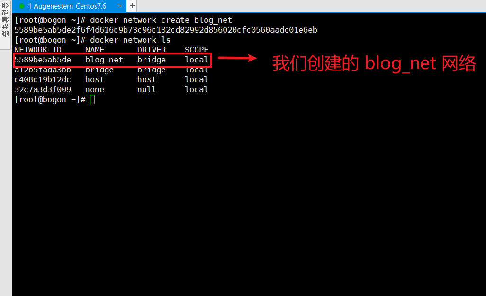

3. 将 sg_blog 容器和 blog_mysql 容器加入进 `blog_net`网络

```bash
docker network connect blog_net sg_blog

docker network connect blog_net blog_mysql
```

4. 查看网络详情

```bash
docker network inspect blog_net
```


5. 进入sg_blog 容器，这次直接 ping 容器名

```bash
docker exec -it sg_blog bash

ping blog_mysql
```

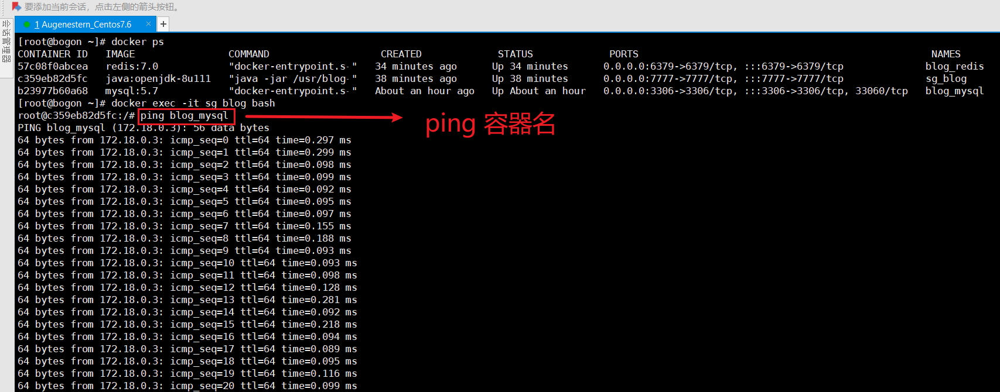


成功，这就是为什么，在一个项目的`application.properties`中发现数据库配置的url如下：

```properties
# 很懵逼吧,这个url的ip部分写成了mysql
# 我们通常是写的是localhost,或者一个ip
url:mysql://mysql:3306/sg_blog?characterEncoding=utf-8&serverTimezone=Asia/Shanghai
```

很懵逼吧，这个url的ip部分写成了mysql，我们通常是写的是localhost，或者一个ip。而这里写的是docker的容器名，但是依然可以进行通信连接。


6. 最后把`blog_redis`也加入`blog_net`网络

```bash
docker network connect blog_net blog_redis
```


## 1.5、重新部署后端服务器

我们在创建后端容器时，需要通过配置来更换`application.properties`的一些配置。

```bash
# -- network blog_net 创建容器时就加入 blog_net 网络
# 配置数据库链接url、用户名username、密码password
# 配置redis的host
docker run
-p 7777:7777
-d
-- network blog_net
--name sg_blog
-v /usr/blog:/usr/blog
--restart always
java:openjdk-8u111 
java -jar /usr/blog/sangeng-blog-1.0-SNAPSHOT.jar
"--spring.datasource.url=jdbc:mysql://mysql:3306/sg_blog?characterEncoding=utf-8&serverTimezone=Asia/Shanghai"
"--spring.datasource.username=root"
"--spring.datasource.password=root"
"--spring.datasource.host=blog_redis"
```


## 1.6、前端服务器部署

将前端静态资源上传到宿主机`/usr/blog`

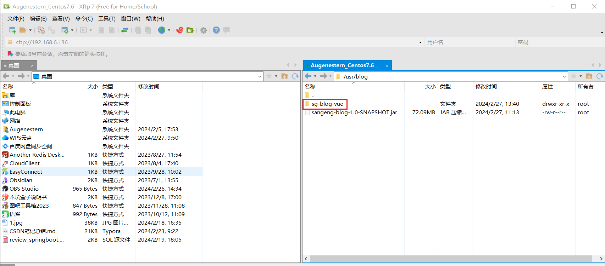

同时修改一下静态资源的app.js中的请求ip为我们的宿主机ip

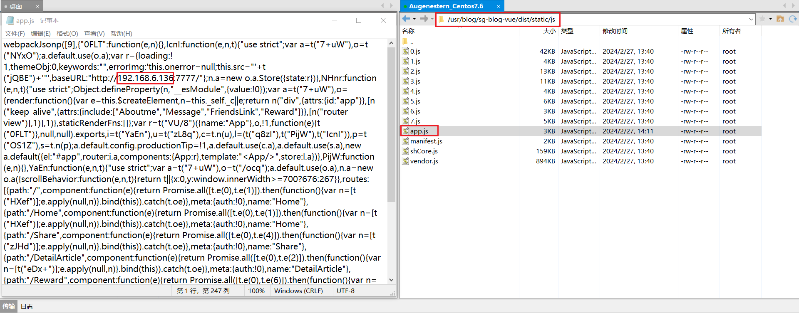

要求：

- 镜像：nginx:1.21.5
- 开放端口：80
- 数据卷的方式同步静态资源： -v
- 停止后自动重启：--restart
- 后台运行： -d

命令：

```bash
docker run
-p 80:80
-v /usr/blog/sg-blog-vue/dist:/usr/share/nginx/html
-- restart always
-d
--name sg_blog_vue
nginx:1.21.5
```


## 1.7、部署测试

接下来访问`宿主机ip:80`即可


> Tips：实际生产中mysql、redis一般不会用容器去运行，而是自己作为一个单独的服务器。


# 2、部署优化

- 后端：希望后端的镜像当中就包含了后端的jar包，不用我们手动上传到宿主机，再通过数据卷映射，并且还希望镜像启动的时候默认就会启动该jar包
- 前端：希望前端的镜像当中就包含了前端的包，不用我们手动上传到宿主机，再通过数据卷映射

## 2.1、后端应用优化

1. 后端优化DockerFile

```bash
FROM java:openjdk-8u111
# 指定工作目录
WORKDIR /app
# 添加jar包到镜像中
ADD sangeng-blog-1.0-SNAPSHOT.jar .
# 声明开放端口
EXPOSE 7777
# 指定容器运行命令
CMD ["java","-jar","sangeng-blog-1.0-SNAPSHOT.jar","--spring.datasource.url=jdbc:mysql://mysql:3306/sg_blog?characterEncoding=utf-8&serverTimezone=Asia/Shanghai","--spring.datasource.username=root","--spring.datasource.password=root","--spring.datasource.host=blog_redis"]
```

2. 构建镜像

```bash
docker build -t sg_blog:1.0 -f sg_blog_dockerfile .
```

3. 运行容器

```bash
docker run
-p 7777:7777
-d
--name sg_blog
--restart always
sg_blog:1.0
```


## 2.2、前端应用优化

1. 前端优化DockerFile

```bash
FROM nginx:1.21.5
WORKDIR  /app
ADD sg-blog-vue .
RUN cp -r sg-blog-vue/dist/* /usr/share/nginx/html
EXPOSE 80
CMD ["nginx","-g","daemon off;"]
```

2. 构建镜像

```bash
docker build -t sg_blog_vue:1.0 -f sg_blog_vue_dockerfile .
```

3. 运行容器

```bash
docker run 
-p 80:80
--restart always
-d
--name sg_blog_vue
sg_blog_vue:1.0
```


# 3、实际公司开发打包流程

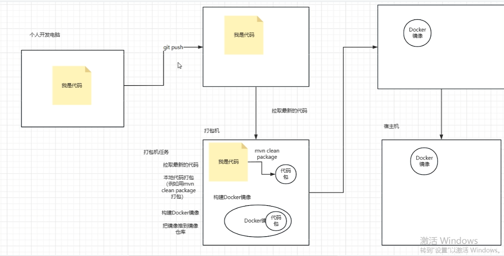


1. 在个人开发的电脑上进行代码开发，然后通过 git 推送到远程代码仓库 gitlab
2. 打包机从远程代码仓库gitlab拉取最新的代码，一般代码里面也会写好DockerFile文件，这样打包机就可以根据DockerFile和代码jar包构建 Docker 镜像，并将镜像推送到 Docker 镜像仓库
3. 宿主机从 Docker 镜像仓库里面拉取我们的镜像去进行部署


> 这样流程就不需要我们自己把代码jar包上传了


# 4、推送镜像到镜像仓库


1. 注册Docker Hub 账号：https://hub.docker.com/，我这里使用GitHub账号登录，用户名AugenesternDocker

2. 登录镜像仓库：`docker login` ，然后输入用户名和密码

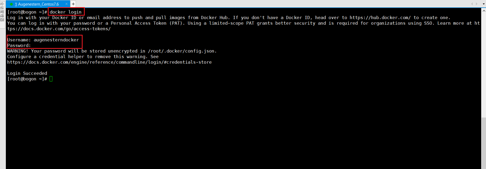


3. 构建镜像：`docker build -t username/镜像名:tag -f DockerFile .`
   - username 是 DockerHub 的用户名

```bash
# -t 指定镜像名和标签
# -f 指定基于哪个DockerFile文件去构建镜像
# .表示在当前目录下查找对应的DockerFile来构建镜像
docker build -t augenesterndocker/sg_blog:1.0 -f sg_blog_dockerfile .
```

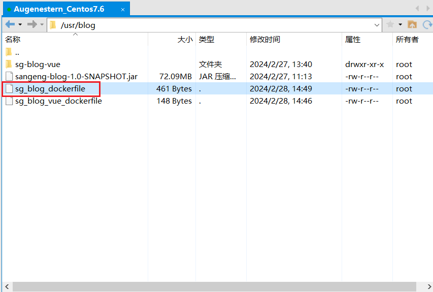


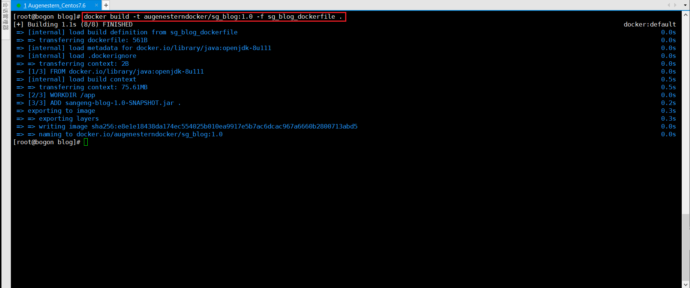


4. 给镜像打标签，以便将其与 Docker Hub 上的仓库关联
   - `docker tag username/镜像名:tag username/镜像名:tag`
   - username为DockerHub的用户名

```bash
docker tag augenesterndocker/sg_blog:1.0 augenesterndocker/sg_blog:1.0
```

5. 推送镜像：`docker push username/镜像名:tag`

```bash
docker push augenesterndocker/sg_blog:1.0
```

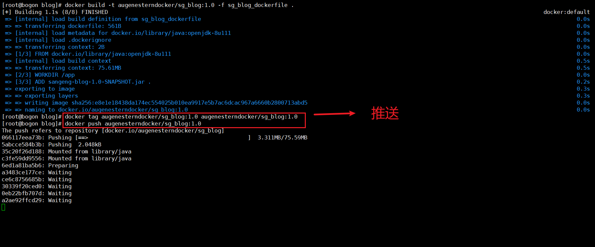


等待推送完成，在自己的DockerHub账号下即可看到镜像：

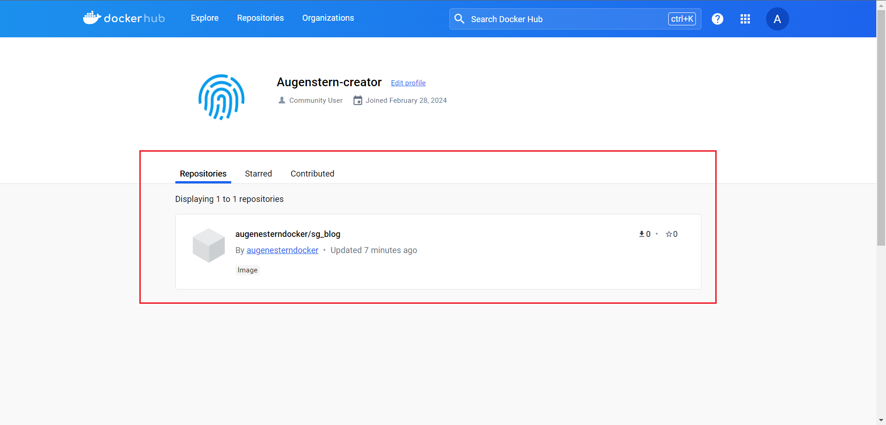

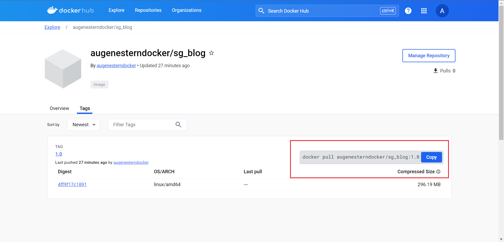

# 5、DockerCompose部署

1. 创建docker-compose.yaml

```yaml
services:
 # mysql服务名称
 blog_mysql:
  image: mysql:5.7
  # 数据卷
  volumes:
   - mysql_data:/var/lib/mysql
  # 端口
  ports:
   - 3306:3306
  # 环境变量
  environment:
   MYSQL_ROOT_PASSWORD: root
  # 重启
  restart: always
  # 加入网络
  networks:
   - blog_net

 # redis
 blog_redis:
  image: redis:7.0
  volumes:
   - redis_data:/data
  #重启
  restart: always
  #端口
  ports:
   - 6379:6379
  #覆盖容器启动后的默认指令
  command: ['redis-server','--appendonly','yes']
  # 加入网络
  networks:
   - blog_net

 # 后端服务
 sg_blog:
  image: sg_blog:1.0
  ports:
   - 7777:7777
  networks:
   - blog_net
  restart: always


 # 前端服务
 sg_blog_vue:
  image: sg_blog_vue:1.0
  ports:
   - 80:80
  restart: always


# 数据卷别名
volumes:
 mysql_data:
  external: true
 redis_data:
  external: true
# 网络定义
networks:
 blog_net:
```

2. 运行：`docker compose up -d`


链接：https://www.bilibili.com/video/BV1FC4y157gK?p=47&spm_id_from=pageDriver&vd_source=babf50e72d3d368d0c44319dbbe2fdd0


