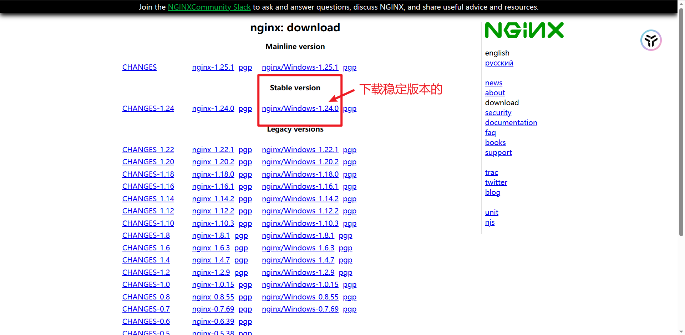
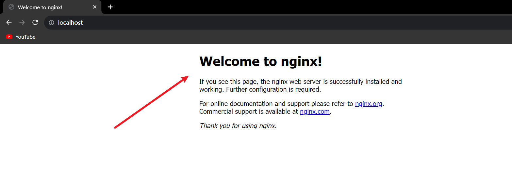
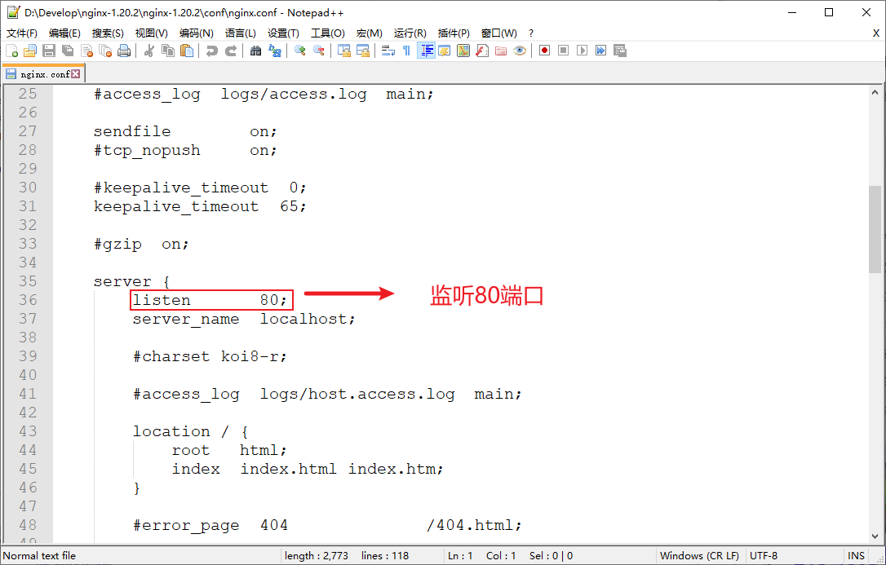
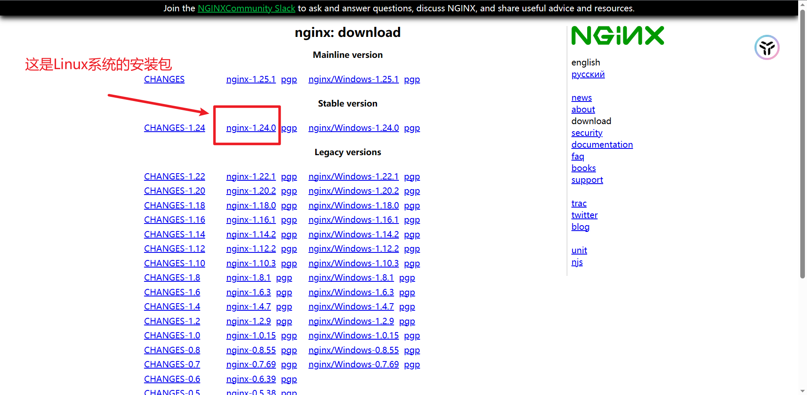
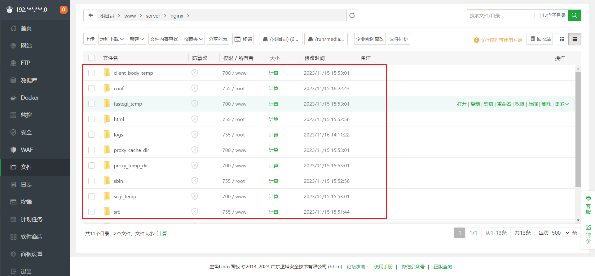
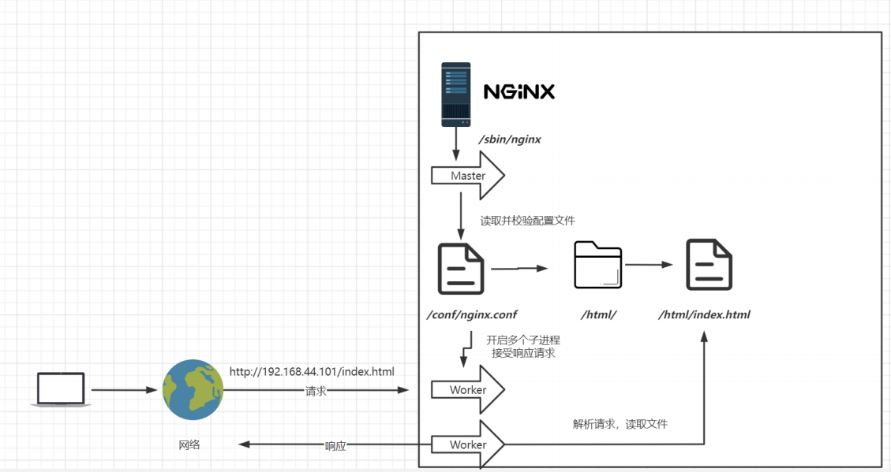
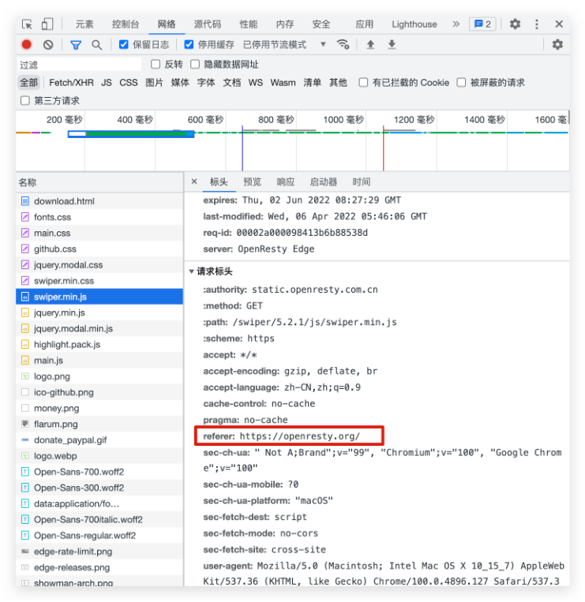
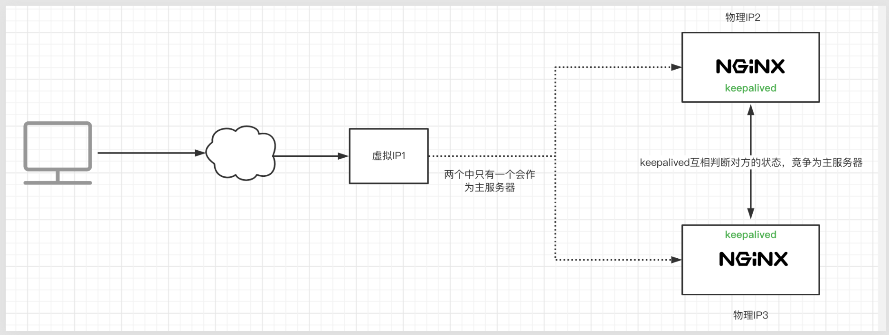
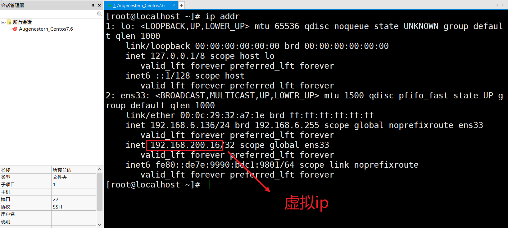

# 1、Nginx

## 1.1、什么是Nginx

Nginx是一款高性能的http服务器/反向代理服务器及电子邮件(IMAP/POP~3~)**代理服务器**。官方测试nginx能够支撑5万并发链接，并且cpu、内存等资源消耗却非常低，运行非常稳定。


## 1.2、Nignx的应用场景

1. **http服务器**。Nginx是一个http服务可以独立提供 http 服务。可以做**网页静态服务器**。
2. **虚拟主机**。可以实现在一台服务器虚拟出多个网站，例如个人网站使用的虚拟主机。
3. **反向代理，负载均衡**。当网站的访问量达到一定程度后，单台服务器不能满足用户的请求时，需要用多台服务器集群可以使用nginx做反向代理。并且多台服务器可以平均分担负载，不会因为某台服务器负载高宕机而某台服务器闲置的情况。


## 1.3、Nginx安装-Windows

1. 进入 Nginx 官网： [Nginx 官网]([nginx: download](http://nginx.org/en/download.html))
   - Mainline 是 Nginx 目前主力在做的版本，可以说是开发版
   - Stable version：最新稳定版，生产环境上建议使用的版本
   - Legacy versions：遗留的老版本的稳定版



2. 等待下载完成后解压，注意解压目录不要有中文，在解压目录处打开 `cmd` 窗口，启动nginx


3. 在浏览器输入 ：`localhost:80` ，看到如下页面即表示启动成功




> 注意：
>
> - 如果使用cmd命令窗口启动nginx， 关闭cmd窗口是不能结束nginx进程的。
> - 下述命令请在解压目录路径下进入 cmd 命令行执行

```bash
nginx -v  # 查看nginx的版本号

nginx -s stop # 快速停止或关闭nginx

nginx -s quit # 正常停止或关闭nginx

nginx -s reload # 配置文件nginx.conf修改重载命令
```

> nginx的配置文件是conf目录下的`nginx.conf`，默认配置的nginx监听的端口为80，如果80端口被占用可以修改为未被占用的端口即可。




当我们修改了nginx的配置文件nginx.conf 时，不需要关闭nginx后重新启动nginx，只需要执行命令 `nginx -s reload` 即可让改动生效。


## 1.4、Nginx安装-Linux

在Linux下安装Nginx，需要先安装4个依赖环境，分别是 gcc、pcre、zlib、openssl

1. 安装gcc环境

```bash
yum -y install gcc-c++ 
```

2. 安装PCRE(PCRE是一个Perl库，包括perl兼容的正则表达式库。nginx的http模块使用pcre来解析正则表达式，所以需要在linux上安装pcre库)

```bash
yum install -y pcre pcre-devel
```

3. 安装zlib(zlib库提供了很多种压缩和解压缩方式，nginx使用zlib对http包的内容进行gzip，所以需要在Linux上安装zlib库)

```bash
yum install -y zlib zlib-devel
```

4. 安装OpenSSL(OpenSSL 是一个强大的安全套接字层密码库，囊括主要的密码算法、常用的密钥和证书封装管理功能及 SSL 协议，并提供丰富的应用程序供测试或其它目的使用。nginx 不仅支持 http 协议，还支持 https（即在ssl协议上传输http），所以需要在 Centos 安装 OpenSSL 库。)

```bash
yum install -y openssl openssl-devel
```


5. 进入 Nginx 官网： [Nginx 官网]([nginx: download](http://nginx.org/en/download.html))，手动下载 `.tar.gz`安装包




6. 下载完毕上传到服务器上 `/root`，解压

```bash
# 1.解压nginx安装包
tar -zxvf nginx-1.24.0.tar.gz
```

7. 配置configure

```bash
# 2.配置configure
./configure --prefix=/usr/local/nginx  # --prefix=/usr/local/nginx 指安装路径
```

8. 执行make

```bash
# 3.执行make
make 

# 4.执行 make install
make install
```

9. 查找安装路径

```bash
# 5. 找nginx目录
whereis nginx
```

10. 进入nginx 目录，启动nginx

```bash
./nginx # 启动nginx

./nginx -s stop # 停止nginx

./nginx -s quit # 安全退出

./nginx -s reload # 重新加载配置文件

ps aux|grep nginx # 查看nginx进程
```

> 若 yum 下载太慢，可以尝试换源：https://blog.csdn.net/qq_45773650/article/details/108326429
>
> - wget:无法解析主机地址：https://blog.csdn.net/weixin_45359497/article/details/119104646

- 我这里直接使用宝塔面板进行一键安装，所以不用上述那么多步骤，默认软件安装目录均在：`根目录/www/server` 里面

查看nginx进程：

```bash
ps aux|grep nginx
```

---

宝塔安装的 nginx 是开机自启的，我们只需要在 `www/server/nginx/conf/nginx.conf` 里面写入：

```nginx
server {
    listen 80;
    # 
    server_name 192.168.6.136;
    
    location / {
        root html;
        index index.html index.htm;
       # 万一访问404,则添加下面代码
       # try_files  $uri $uri/ /index.html;
    }
}
```

更新nginx配置：`./nginx -s reload` , 之后访问：`http://192.168.6.136` 


> 如果加了上述代码后仍然访问404，可以去看一下 `html/index.html` 的代码，不知道为何我的代码就是404代码，所以显示404，搞得我排查了好久，天杀的！
>
> - 扩展：检查 nginx 的配置文件是否正确 `nginx -t`


# 2、Nginx基础使用

## 2.1、目录结构

进入Nginx的主目录我们可以看到这些文件夹：

```bash
# 用来存放配置的文件相关
conf 

# 用来存放静态文件的默认目录 html、css等
html

# 日志 
logs 

# nginx 的主程序
sbin 

# 使进程在后台运行，并将日志打到指定的日志文件或者udp服务器
uwsgi_temp

# 以下几个文件夹在刚安装后是没有的，主要用来存放运行过程中的临时文件
client_body_temp 

fastcgi_temp

proxy_temp

scgi_temp
```



```bash
[root@localhost ~]# tree /usr/local/nginx
/usr/local/nginx
├── client_body_temp                 # POST 大文件暂存目录
├── conf                             # Nginx所有配置文件的目录
│   ├── fastcgi.conf                 # fastcgi相关参数的配置文件
│   ├── fastcgi.conf.default         # fastcgi.conf的原始备份文件
│   ├── fastcgi_params               # fastcgi的参数文件
│   ├── fastcgi_params.default       
│   ├── koi-utf
│   ├── koi-win
│   ├── mime.types                   # 媒体类型
│   ├── mime.types.default
│   ├── nginx.conf                   #这是Nginx默认的主配置文件，日常使用和修改的文件
│   ├── nginx.conf.default
│   ├── scgi_params                  # scgi相关参数文件
│   ├── scgi_params.default  
│   ├── uwsgi_params                 # uwsgi相关参数文件
│   ├── uwsgi_params.default
│   └── win-utf
├── fastcgi_temp                     # fastcgi临时数据目录
├── html                             # Nginx默认站点目录
│   ├── 50x.html                     # 错误页面优雅替代显示文件，例如出现502错误时会调用此页面
│   └── index.html                   # 默认的首页文件
├── logs                             # Nginx日志目录
│   ├── access.log                   # 访问日志文件
│   ├── error.log                    # 错误日志文件
│   └── nginx.pid                    # pid文件，Nginx进程启动后，会把所有进程的ID号写到此文件
├── proxy_temp                       # 临时目录
├── sbin                             # Nginx 可执行文件目录
│   └── nginx                        # Nginx 二进制可执行程序
├── scgi_temp                        # 临时目录
└── uwsgi_temp                       # 临时目录
```


## 2.2、基本运行原理

终端PC机在发起请求`http://192.168.44.101/index.html` 时，Nginx是怎么处理的呢？



Nginx 首先运行`/sbin/nginx` 可执行文件，开启 Master 进程进行读取并检验配置文件 `/conf/nginx.conf` ，如果没有错误则会开启一个子进程`Worker`进行响应请求。 


## 2.3、Nginx配置文件

- nginx的配置文件是conf目录下的 `nginx.conf`，我们可以直接使用Xftp的右键`用记事本打开`，也可以下载到本地用编辑器打开


配置文件分为**三个大模块**：

- 全局配置
- 事件
- HTTP配置


```nginx
# 全局配置

# 设置worker进程的用户,默认为 nobody
user  nobody;

# worker进程工作数设置,一般来说CPU有几个,就设置几个,或者设置为N-1也行,默认为1
worker_processes  1;


# nginx 日志级别: debug | info | notice | warn | error | crit | alert | emerg
error_log  logs/error.log;
error_log  logs/error.log  notice;
error_log  logs/error.log  info;

# 设置 nginx 进程pid
pid        logs/nginx.pid;


# 事件:包括最大连接数、线程数等等
events {
    # 默认使用epoll
    use epoll;
    # 每个worker允许连接的客户端最大连接数
    worker_connections  1024;
}


# http配置
http {
	# http的全局配置
	# include 引入外部配置，提高可读性，避免单个配置文件过大
    include       mime.types;
    default_type  application/octet-stream;

	# 设定日志格式，main为定义的格式名称，如此 access_log 就可以直接使用这个变量了
	# $remote_addr:客户端ip   $remote_user:远程客户端用户名
	# $time_local:时间和时区  $request:请求的url以及method
    # $status:响应状态码     $body_bytes_sent:响应客户端内容字节数
    # $http_referer:记录用户从哪个链接跳转过来的
    # $http_user_agent:用户所使用的代理，一般来时都是浏览器
    # $http_x_forwarded_for:通过代理服务器来记录客户端的ip
    log_format  main  '$remote_addr - $remote_user [$time_local] "$request" '
                      '$status $body_bytes_sent "$http_referer" '
                      '"$http_user_agent" "$http_x_forwarded_for"';

    access_log  logs/access.log  main;


	# sendfile使用高效文件传输，提升传输性能。
	# 启用后才能使用tcp_nopush，是指当数据表累积一定大小后才发送，提高了效率
    # 对于普通应用，必须设为on.如果用来进行下载等应用磁盘IO重负载应用，可设置为off，以平衡磁盘与网络IO处理速度。 
    sendfile        on;
    tcp_nopush     on;

	# keepalive_timeout设置客户端与服务端请求的超时时间，保证客户端多次请求的时候不会重复建立新的连接，节约资源损耗。
    keepalive_timeout  65;

	# gzip启用压缩，html/js/css压缩后传输会更快
    gzip  on;

	# 服务配置
    server {
        # listen 监听端口
        listen       80;
        # 服务器名称,默认为localhost
        server_name  localhost;


	#访问地址 / 表示根目录
        location / {
            # root 表示访问的文件夹,其中默认是html文件夹,可以修改成自己的文件夹
            root   html;
            # index 访问页面,默认访问页面
            index  index.html index.htm;
        }

        
        # 错误页面的配置
        error_page   500 502 503 504  /50x.html;
        location = /50x.html {
            root   html;
        }
    }


}
```


## 2.4、服务配置

```nginx
# 服务配置(虚拟主机配置)
server {
    # listen 监听端口
    listen       80;
    # 服务器名称,默认为localhost
    server_name  localhost;


    #访问地址 / 表示根目录
    location / {
        # root 表示访问的文件夹,其中默认是html文件夹,可以修改成自己的文件夹
        root   html;
        # index 访问页面,默认访问页面
        index  index.html index.htm;
    }


    # 错误页面的配置
    error_page   500 502 503 504  /50x.html;
    location = /50x.html {
        root   html;
    }
}
```

- **虚拟主机**：原本一台服务器只能对应一个站点，通过虚拟主机技术可以虚拟化成多个站点同时对外提供服务

> 举个例子来说，一台服务器ip地址为192.168.6.136，有两个域名和对应的空间在这台服务器上，使用的都是192.168.6.136的80端口来提供服务。如果只是简单的将两个域名A和B的域名记录解析到这个ip地址，那么web服务器在收到任何请求时反馈的都会是同一个网站的信息，这显然达不到要求。
>
> 接下来我们使用主机头绑定域名A和B到他们对应的空间文件夹C和D。当含有域名A的web请求信息到达192.168.6.136时，web服务器将执行它对应的空间C中的首页文件，并返回给客户端，含有域名B的web请求信息同理，web服务器将执行它对应的空间D中的首页文件，并返回给客户端

- `server_name` 匹配规则：需要注意的是`server_name` 匹配分先后顺序，写在前面的匹配上就不会继续往下匹配了。

  - 完整匹配：我们可以在同一servername中匹配多个域名

    ```nginx
    server_name www.qindalin.com nav.qindalin.com;
    ```

  - 通配符匹配：**精确匹配的优先级大于通配符匹配和正则匹配**

    ```nginx
    server_name *.qindalin.com
    ```

  - 通配符结束匹配

    ```nginx
    server_name www.qindalin.*
    ```

  - 正则匹配

    ```nginx
    server_name ~^[0-9]+\.qindalin\.com$;
    ```

> - 正则匹配格式，必须以`~`开头，比如 `server_name  ~^www\d+\.example\.net$;`
> - 如果开头没有`~`，则nginx认为是精确匹配

特殊匹配格式：

```nginx
server_name ""; # 匹配Host请求头不存在的情况。
```

匹配顺序：

1. 精确的名字
2. 以`*`号开头的最长通配符名称，例如 `*.example.org`
3. 以`*`号结尾的最长通配符名称，例如 `mail.*`
4. 第一个匹配的正则表达式（在配置文件中出现的顺序）


示例：

1. 在`nginx.conf`加入如下配置

```nginx
# 虚拟主机的配置
server {
    listen 81;
    server_name kuang.study.cn;
    
    location / {
        root /www/kuang/study81;
        index index.html;
    }
}

server {
    listen 82;
    server_name kuang.study.cn;
    
    location / {
        root /www/kuang/study82;
        index index.html;
    }
}
```

2. 开放防火墙81、82端口：

```bash
firewall-cmd --add-port=81/tcp --permanent

firewall-cmd --add-port=82/tcp --permanent
```

3. 在`www/kuang/` 创建 `study81、study82` 文件夹并分别创建 `index.html`

```html
<!DOCTYPE html>
<html>
<head>
<meta charset="UTF-8">
<title>Welcome to nginx!</title>
<style>
</style>
</head>
<body>
<h1>这是 Study81 页面！</h1>

</body>
</html>
```

```html
<!DOCTYPE html>
<html>
<head>
<meta charset="UTF-8">
<title>Welcome to nginx!</title>
<style>
</style>
</head>
<body>
<h1>这是 Study82 页面！</h1>

</body>
</html>
```

4. 在XShell中刷新配置：`systemctl reload nginx`

5. 在`C:\Windows\System32\drivers\etc` 修改 hosts 文件做单机域名

```bash
# 测试nginx
# kuang.study.cn 域名是不存在的，映射到 192.168.6.136 处
192.168.6.136 kuang.study.cn
```

6. 访问：`http://kuang.study.cn`  (相当于访问`http://192.168.6.136:80`)


接着可继续访问: `http://kuang.study.cn:81 、 http://kuang.study.cn:82`


## 2.5、泛域名解析

所谓的泛域名解析是指:利用通配符 * 星号来做次级域名以实现所有的次级域名均指向同一IP地址。

好处:

- 可以让域名支持无限的子域名(这也是泛域名解析最大的用途)

- 防止用户错误输入导致的网站不能访问的问题

- 可以让直接输入网址登陆网站的用户输入简洁的网址即可访问网站

  


# 3、代理

1. 什么是代理？

代理就相当于中间商,本来A和B是可以直接连接的,但是此时添加了一个C在中间,A跟B不直接连接,而是通过C作为中介进行连接。

例子:最常见的例子就是二手房东,其实很多我们租房子时签约的人不是房子的真正房东,而是房东委托的中介,房东不想管事或者房子太多,只靠自己无法进行管理,所以才会通过中介(代理)进行处理

> TIps: 一个完整的请求是由: client(客户端) -> proxy(代理) -> server(服务端) 组成。

2. 什么是正向代理？

- 正向代理: 顺着请求的方向进行的代理，即代理服务器它是由你配置为你服务，去请求目标服务器地址。

- 例子:假如我们现在想要访问谷歌,但是由于某些原因,无法直接访问到谷歌,我们可以通过连接一台代理服务器,代理服务将我们的请求提交到谷歌,然后再将谷歌的响应反馈给我们,对于谷歌而言,它只知道有一个请求过来,但是它并不会知道我们是无法直接访问它的。

- 作用:
  - 访问原来无法访问的资源，如Google
  - 可以做缓存，加速访问资源
  - 对客户端访问授权，上网进行认证
  - 代理可以记录用户访问记录（上网行为管理），对外隐藏用户信息

3. 什么是反向代理？

- 反向代理: 跟正向代理相反,它是为目标服务器进行服务的,但是请求的流程还是 client(客户端) -> proxy(代理) -> server(服务端) 
- 例子: 比如我们访问百度网站，百度的代理服务器对外的域名为 www.baidu.com ，具体内部的服务器节点我们不知道。现实中我们通过访问百度的代理服务器后，代理服务器给我们转发请求到他们N多的服务器节点中的一个给我们进行搜索后将结果返回,此时,代理服务器对我们客户端来说就充当了提供响应的服务器
- 作用:
  - 保证内网的安全，阻止web攻击，大型网站，通常将反向代理作为公网访问地址。
  - 负载均衡，通过反向代理服务器来优化网站的负载


用户通过互联网访问 www.baidu.com ，首先进入机房的网关路由上，网关路由会把请求转发到Nginx服务器上，Nginx 服务器再将所有的请求转发到应用服务器，应用服务器应答返回给 Nginx 服务器， Nginx 服务器再将响应返回给用户。 注: **因为网关路由和应用服务器是不通的，所以需要Nginx服务器做代理。**


4. 正向代理和反向代理的区别？

- 正向代理即是客户端代理, 代理客户端, 服务端不知道实际发起请求的客户端.
- 反向代理即是服务端代理, 代理服务端, 客户端不知道实际提供服务的服务端.

事实上,正向代理和反向代理的作用都是进行请求和转发,但是为了区别正向代理,所以后出现的就成为反向代理。生活中最常见的例子:

1、正向代理: 卖票的黄牛

2、反向代理: 出租房的二手东

## 3.1、具体配置

**nginx.conf配置文件**: 启用proxy_pass,root和index字段就会失效,所以二者不能同时出现

- `proxy_pass http://baidu.com`
- proxy_pass后的地址必须写完整 `http://xxx`，不支持https

```nginx
server {
    listen 83;
    server_name localhost;
    
    location / {
        proxy_pass http://baidu.com
        # root /www/kuang/study82;
        #  index index.html;       
    }	
}
```

- 开放防火墙83端口

```bash
firewall-cmd --add-port=83/tcp --permanent
```

- 进入`http://192.168.6.136:81` ,会跳转至哔哩哔哩


## 3.2、基于反向代理的负载均衡

- 使用`upstream`定义一组地址:访问localhost，访问都会代理到`192.168.174.133:80`和`192.168.174.134:80`这两个地址之一，每次访问这两个地址轮着切换，因为默认权重相等

```nginx
http{
	upstream httpds{
            server 192.168.174.133:80; #如果是80端口，可以省略不写
            server 192.168.174.134:80;
	}
	server {
            listen       80;
            server_name  localhost;

            location / { 
                    proxy_pass http://httpds;
            }

            error_page   500 502 503 504  /50x.html;
            location = /50x.html {
                root   html;
            }
	}
}
```


# 4、负载均衡策略

先假设一个场景:

1. 公司项目刚刚上线的时候，并发量小，用户使用的少，所以在低并发的情况下，一个jar包启动应用就够了，然后内部tomcat返回内容给用户


2. 但是慢慢的，随着平台的用户越来越多了，并发量慢慢增大了，这时候一台服务器满足不了我们的需求了。


3. 于是我们横向扩展，又增加了服务器。这个时候几个项目启动在不同的服务器上，用户要访问，就需要增加一个代理服务器了，通过代理服务器来帮我们转发和处理请求。


我们希望这个代理服务器可以帮助我们接收用户的请求，然后将用户的请求按照规则帮我们转发到不同的服务器节点之上。这个过程用户是无感知的，用户并不知道是哪个服务器返回的结果，我们还希望他可以按照服务器的性能提供不同的权重选择。保证最佳体验！所以我们使用了Nginx。

引出负载均衡:**把请求，按照一定算法规则，分配给多台业务服务器（即使其中一个坏了/维护升级，还有其他服务器可以继续提供服务）**


## 4.1、轮询

默认情况下使用轮询方式，逐一转发，这种方式适用于无状态请求。

- `weight` 权重：指定轮询几率，`weight` 和访问比率成正比，用于后端服务器性能不均的情况。

设置权重:

```nginx
upstream httpds {
    server 127.0.0.1:8050  weight=10 ;
    # weight 默认为1,weight越大,负载的权重就越大
    server 127.0.0.1:8060  weight=1 ;
}
```


关闭: `down`

```nginx
upstream httpds {
    # down 表示当前的 server 暂时不参与负载
    server 127.0.0.1:8050  weight=10 down;
}
```

备用机:如果`192.168.174.133:80`出现故障，无法提供服务，就使用backup的这个机器

```nginx
upstream httpds{
    server 192.168.174.133:80 weight=10;
    server 192.168.174.134:80 weight=80 backup;
}
```


其他负载均衡策略(不常用):

- `ip_hash` ：根据客户端的 ip 地址转发同一台服务器，可以保持会话
  - 但是很少用这种方式去保持会话，例如我们当前正在使用wifi访问，当切换成手机信号访问时，会话就不保持了。

- `least_conn`： 最少连接访问
  - 最少连接访问，优先访问连接最少的那一台服务器，这种方式也很少使用，因为连接少，可能是由于该服务器配置较低，刚开始赋予的权重较低。

- `url_hash` ：根据用户访问的 url 定向转发请求
  - 需要第三方插件,

- `fair`：根据后端服务器响应时间转发请求
  - 需要第三方插件


## 4.2、动静分离

**动静分离**:为了提高网站的响应速度，减轻程序服务器Tomcat的负载,对于静态资源，如图片、js、css等文件，可以在反向代理服务器中进行缓存，这样浏览器在请求一个静态资源时，代理服务器就可以直接处理，而不用将请求转发给后端服务器。对于用户请求的动态文件，如servlet、jsp，则转发给Tomcat服务器处理，这就是动静分离。即动态文件与静态文件的分离。

> 当用户请求时，动态请求分配到Tomcat业务服务器，静态资源请求放在Nginx服务器中

例子:

- 如果请求的资源地址是`location/`，`/`的优先级比较低，如果下面的location没匹配到，就会走http://xxx这个地址的机器
- 如果请求的资源地址是`location/css/*`，就会被匹配到nginx的html目录下的css文件夹中（我们把css静态资源放在这个位置）

```nginx
server {
        listen       80;
        server_name  localhost;
				
        # /的优先级比较低，如果下面的location没匹配到，就会走http://xxx这个地址的机器
        location / { 
        	proxy_pass http://xxx;
        }
        
        # root指的是html文件夹，location/css指的是root下的css，所以地址就是html/css文件夹
        location /css {  
            root html;		
            index  index.html index.htm;
        }

        error_page   500 502 503 504  /50x.html;
        location = /50x.html {
            root   html;
        }
}
```

- 使用正则

```nginx
location ~*/(js|css|img){
  root html;
  index  index.html index.htm;
}
```

`location` 正则:

- 精准匹配：`location = /{}`
- 一般匹配：`location /{}`
- 正则匹配：`location ~/{}`

```nginx
#1、 匹配任何以 /images/ 开头的地址，匹配符合以后，停止往下搜索正则，采用这一条
location ^~ /images/ {}

# 2、匹配所有以 gif、jpg或jpeg 结尾的请求
# 然而，所有请求 /images/ 下的图片会被 location ^~ /images/ 处理，因为 ^~ 的优先级更高，所以到达不了这一条正则
location ~* \.(gif|jpg|jpeg)$ {}

# 3、最长字符匹配到 /images/abc，优先级最低，继续往下搜索其它 location，会发现 ^~ 和 ~ 存在
location /images/abc {}

# 4、匹配以/images/abc 开头的，优先级次之，只有去掉 location ^~ /images/ 才会采用这一条
location ~ /images/abc {}

# 5、匹配/images/abc/1.html 文件，如果和正则 ~ /images/abc/1.html 相比，正则优先级更高
location /images/abc/1.html {}
```

优先级总结:

- (location =) > (location 完整路径) > (location ^~ 路径) > (location ~,~* 正则顺序) > (location 部分起始路径) > (location /)

实际网站使用中,至少有三个匹配规则定义:

1. 第一个必选规则:直接匹配网站根，通过域名访问网站首页比较频繁，使用这个会加速处理，比如说官网。这里是直接转发给后端应用服务器了，也可以是一个静态首页

```nginx
location = / {
    proxy_pass http://127.0.0.1:8080/; 
}
```

2. 第二个必选规则:处理静态文件请求，这是nginx作为http服务器的强项,有两种配置模式，目录匹配或后缀匹配,任选其一或搭配使用

```nginx
location ^~ /static/ {
    root kuang/webroot/static/;
}

location ~* \.(html|gif|jpg|jpeg|png|css|js|ico)$ {
    root kuang/webroot/res/;
}
```

3.第三个规则:通用规则，用来转发动态请求到后端应用服务器

```nginx
location /api/ {
    proxy_pass http://127.0.0.1:3000/api/
}
```


## 4.3、URLRewrite

rewrite是实现URL重写的关键指令，根据正则表达式部分内容，重定向到repacement，结尾是flag标记。

格式:

```nginx
#关键字     正则          替代内容        flag标记
  rewrite <regex> <replacement> [flag];
```

- 替代内容: 将正则匹配的内容替换成 replacement
- flag 标记: rewrite 支持的 flag 标记
  - last : 本条规则匹配完成后，继续向下匹配新的 location uri 规则
  - break: 本条规则匹配完成即终止，不再匹配后面的任何规则
  - redirect : 返回302临时重定向，浏览器地址会显示跳转后的url地址
  - permanent: 返回301永久重定向，浏览器地址会显示跳转后的url地址

> rewrite 参数的标签段位置: server、location、if

URLRewrite的优缺点:

- 优点:掩藏真实的url以及url中可能暴露的参数，以及隐藏web使用的编程语言，提高安全性便于搜索引擎收录
- 缺点:降低效率，影响性能。如果项目是内网使用，比如公司内部软件，则没有必要配置。

示例：

```nginx
server {
        listen       80;
        server_name  localhost;
				
        location / { 
            rewrite ^/([0-9]+).html$ /index.jsp?pageNum=$1  break;
            proxy_pass http://xxx;
        }
      

        error_page   500 502 503 504  /50x.html;
        location = /50x.html {
            root   html;
        }
}
```


浏览器地址栏访问 `xxx/123.html`实际上是访问`xxx/index.jsp?pageNum=123`


# 5、防盗链

当我们请求到一个页面后，这个页面一般会再去请求其中的静态资源，这时候请求头中，会有一个refer字段，表示当前这个请求的来源，我们可以限制指定来源的请求才返回，否则就不返回，这样可以防止别人利用我们的资源。



配置格式: 

```nginx
valid_referers  none|server_name
```

参数值,设置有效的refer值:**可以同时携带多个参数，表示多个 referer 头部都生效**

- none: 允许没有 referer 信息的请求访问，即直接通过url访问。
- blocked：通俗点说就是允许`http://`或`https：//`以外的请求
- server_name：检测主机地址，refer显示是从这个地址来的，则有效（server_name必须是完整的`http://xxxx`）
- 其他字符串类型：检测referer与字符串是否匹配，如果匹配则允许访问，可以采用通配符`*`
- 正则表达式：若 referer 的值匹配上了正则，就允许访问

`invalid_referer` 变量：

- 允许访问时变量值为空
- 不允许访问时变量值为1

示例:这里设置nginx服务器中的img目录下的图片必须refer为`http:192.168.174/133`才能访问

```nginx
server {
        listen       80;
        server_name  localhost;
				
        location / { 
        	proxy_pass http://xxx;
        }
      
        location /img{
        	#如果引用这张图片的页面且refer并没有被设置，图片就无法加载出来。
            valid_referers http:192.168.174/133;
            #if 后面有个空格,不写就会报错 
            if ($invalid_referer){#无效的
                    return 403;#返回状态码403
            }
            root html;
            index  index.html index.htm;
        }
        
        error_page   500 502 503 504  /50x.html;
        location = /50x.html {
            root   html;
        }
}
```

示例：

```nginx
# none：表示没有 referer 的可以访问
# server_names：表示本机 server_name 也就是 referer.test.com 可以访问
# *.test.com：匹配上了正则的可以访问
# www.test.org.cn/nginx/：该页面发起的请求可以访问

server {
    server_name referer.test.com;
    listen 80;

    error_log logs/myerror.log debug;
    root html;
    location / {
        valid_referers none server_names
                       *.test.com www.test.org.cn/nginx/;
        if ($invalid_referer) {
                return 403; # 返回错误码
        }
        return 200 'valid\n';
    }
}
```


## 5.1、防盗链照片

将提示图片放在html/img/x.png，访问设置防盗链图片时，就返回这x.png张图

```nginx
location /img{
        valid_referers http:192.168.174/133;
        if ($invalid_referer){#无效的
             rewrite ^/  /img/x.png break;
        }
        root html;
        index  index.html index.htm;
}
```

## 5.2、使用curl测试

我们使用浏览器进行访问测试，浏览器会有缓存，导致测试不准，可以借助 curl 工具

1. 安装curl

```bash
yum install -y curl
```

2. 测试示例

   ```bash
   curl -I http://192.168.44.101/img/logo.png
   ```

   带引用测试

   ```bash
   curl -e "http://baidu.com" -I http://192.168.44.101/img/logo.png
   ```

   带引用测试需要我们在 valid_referers中添加 `baidu.com`

   ```nginx
   location /img{
           valid_referers http://192.168.44.101 baidu.com;
           if ($invalid_referer){#无效的
                rewrite ^/  /img/x.png break;
           }
           root html;
           index  index.html index.htm;
   }
   ```

   


# 6、高可用



- 用户访问时，访问的是一个虚拟IP，keepalived会选定一个主服务器使用这个虚拟IP

- 每台机器上的keepalived会相互通信，根据其他机器上的keepalived进程是否存在，判断服务器状态，如果默认的Master停止了，就会在剩下的Backup机器中，竞选出一台Nginx服务器作为Master

开始使用：

1. 安装 keepalived

```bash
 yum install -y keepalived
```

2. 修改 keepalived 配置
   - 配置文件在`/etc/keepalived/keepalived.conf`
   - `vrrp_instance`、`authentication`、`virtual_router_id`、`virtual_ipaddress`这几个一样的机器，才算是同一个组里。这个组才会选出一个作为Master机器
   - 下载好的 conf 文件东西很多，我们只需保留下面这些即可

第一台机器配置：

```bash
! Configuration File for keepalived

global_defs {
   router_id lb1 # 名字与其他配置了keepalive的机器不重复就行
}

vrrp_instance Augenestern {#vrrp实例名可以随意取
    state MASTER #只能有一个默认的Master，其他写BACKUP
    interface ens33 # ip addr查看下网卡名,默认是ens33
    virtual_router_id 51
    priority 100 # 竞争的优先级
    advert_int 1 #通信时间
    authentication {#分组
        auth_type PASS
        auth_pass 1111
    }
    virtual_ipaddress {
        192.168.200.16 #虚拟的IP
    }
}
```

第二台机器配置：

```bash
! Configuration File for keepalived

global_defs {
   router_id lb2 # 名字与其他配置了keepalive的机器不重复就行
}

vrrp_instance Augenestern {#vrrp实例名可以随意取
    state BACKUP #只能有一个默认的Master，其他写BACKUP
    interface ens33 # ip addr查看下网卡名,默认是ens33
    virtual_router_id 51
    priority 50 # 竞争的优先级
    advert_int 1  #通信时间
    authentication {#分组
        auth_type PASS
        auth_pass 1111
    }
    virtual_ipaddress {
        192.168.200.16 #虚拟IP
    }
}
```

3. 启动

```bash
systemctl start keepalived
```

4. 第一台查看ip

```bash
ip addr
```





> 这样当第一台机器宕机之后，第二台机器会继续接收虚拟此ip地址，从而继续对外提供服务。


