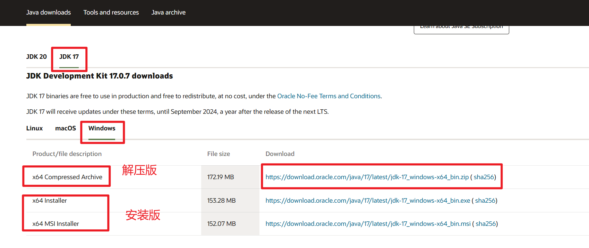
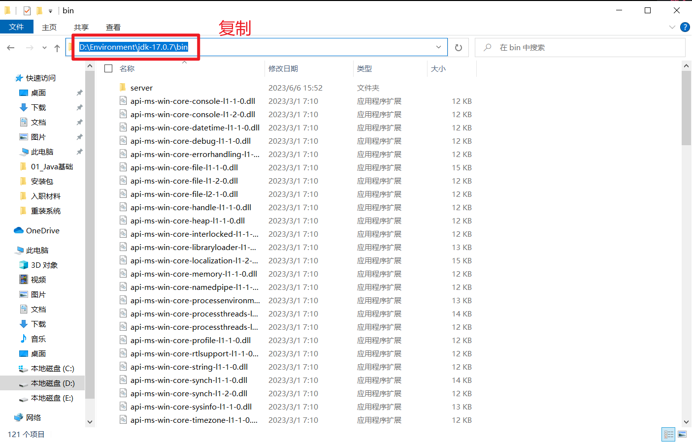
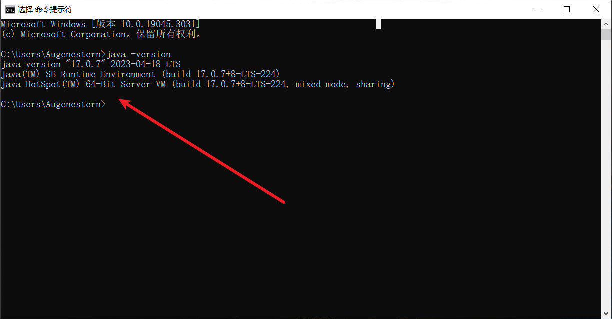
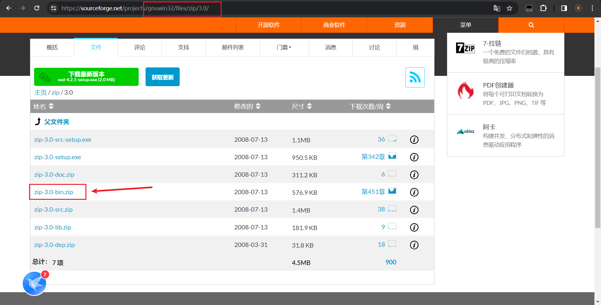
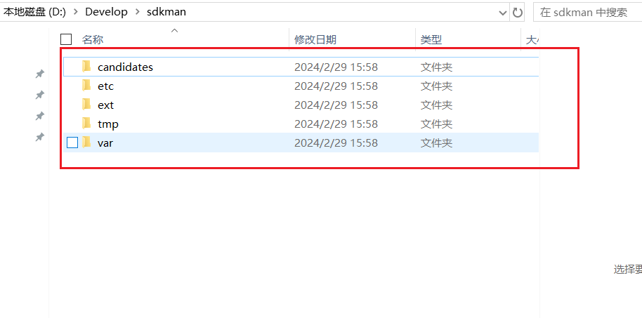

# 1、JDK17的下载与安装

1. 首先访问Oracle官网：www.oracle.com，选择`Products` ，点击 `Java`


2. 下滑找到`Download Java now`，选择`JDK17`， 选择平台，我这里安装选择解压版本



3. 右击`此电脑`，选择`属性` ，选择`高级系统设置`，选择 `环境变量` ,找到系统变量下的 `Path` ，双击


4. 解压第二步下载的压缩包，进入`bin` 目录，将其之前的目录一块复制



5. 返回刚才的环境变量，点击新建，将复制的目录粘贴，依次点击确定


6. `win+r` 输入`cmd`，输入`java -version` ，出现如下版本号则环境搭建成功




# 2、JDK8的下载与安装

> Tips：Oracle 官网是没有 JDK8 版本的解压版的，所以使用解压版的可以使用如下方法

- [JDK64位解压版版本共享（包含1.6、1.7、1.8、10、11.0.1等）_jdk1.7解压版_Irvin-bin的博客-CSDN博客](https://blog.csdn.net/bin470398393/article/details/87931302)

> jdk  配置了环境变量，jre就不需要配置了


# 3、Sdkman

> 官网：https://sdkman.io/

## 3.1、Linux系统安装

1. 只需启动一个新终端并输入

```bash
# 安装sdkman
curl -s "https://get.sdkman.io" | bash
```

2. 运行如下命令

```bash
source "$HOME/.sdkman/bin/sdkman-init.sh"
```

3. 运行以下代码片段来确认安装是否成功

```bash
sdk version
```

## 3.2、Windows系统安装

Windows系统的安装较为复杂，我这里以 Git Bash 为安装方式，因为一般开发已经使用了Git作为版本管理工具，相信各位电脑里面都会有 Git 工具。

1. 要sdkman能正常安装，需要安装一些其他工具，看信息提示主要有curl，unzip，zip和sed，目前看curl，uzip，sed已经安装上了

```bash
curl -V

unzip -V

sed --version
```

2. 缺少zip，进入这个地址：[https://sourceforge.net/projects/gnuwin32/files/](https://links.jianshu.com/go?to=https%3A%2F%2Fsourceforge.net%2Fprojects%2Fgnuwin32%2Ffiles%2F)

   这里面搜索 zip 即可




下载完zip-3.0-bin.zip之后，把里面的zip.exe复制到 Git Bash 下mingw\bin目录下（根据自己的安装目录如：`D:\Develop\git2.41.0\Git\mingw64\bin`）

3. 工具安装完成之后，可以开始安装SDKMAN了

```bash
# 默认位置 C/User/Augenestern/.sdkman
curl -s "https://get.sdkman.io" | bash
```




4. 执行

```bash
# 默认安装位置
source "$HOME/.sdkman/bin/sdkman-init.sh"
```


4. 运行以下代码片段来确认安装是否成功

```bash
sdk version
```


## 卸载sdkman

1. 执行如下代码

```bash
rm -rf ~/.sdkman
```

2. 执行如下代码

```bash
[[ -s "/home/dudette/.sdkman/bin/sdkman-init.sh" ]] && source "/home/dudette/.sdkman/bin/sdkman-init.sh"
```

删除后，您就成功卸载了SDKMAN


