# 1、SSM整合

## 1.1、步骤分析

我们先来分析下如何把Spring,SpringMVC,Mybatis整合到一起。

### 1.1.1、步骤

①Spring整合上Mybatis

​	通过Service层Dao层都注入Spring容器中

②引入配置SpringMVC

​	把Controller层注入SpringMVC容器中

③让web项目启动时自动读取Spring配置文件来创建Spring容器

​	可以使用ContextLoaderListener来实现Spring容器的创建。

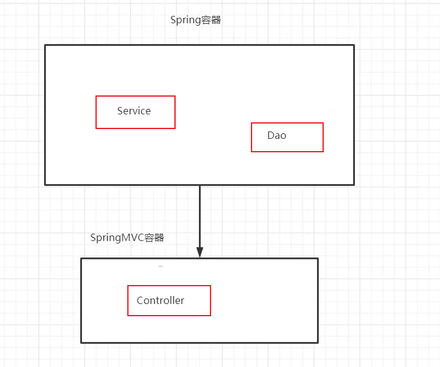


### 1.1.2、常见疑惑

- 为什么要用两个容器？

  因为Controller如果不放在MVC容器中会没有效果，无法处理请求。而Service如果不放在Spring容器中，声明式事务也无法使用。

  

- SpringMVC容器中的Controller需要依赖Service，能从Spring容器中获取到所依赖的Service对象嘛？

  Spring容器相当于是父容器，MVC容器相当于是子容器。子容器除了可以使用自己容器中的对象外还可以使用父容器中的对象。

  

- 是什么时候让两个容器产生这种父子容器的关系的？

  在ContextLoaderListener中，会在创建好容器后把容器存入servletContext域。这样在DispatcherServlet启动时，创建完SpringMVC容器后会从servletContext域中获取到Spring容器对象，设置为其父容器,这样子容器就能获取到父容器中的bean了。详情请见源码解析视频。

  

SpringMVC容器中的Controller需要依赖Service，能从Spring容器中获取到所依赖的Service对象嘛？

是如何实现这样父子容器的关系的？

## 1.2、准备工作

1. 创建一个普通 maven 项目
2. File -> Project Structure -> modules，添加 web 应用

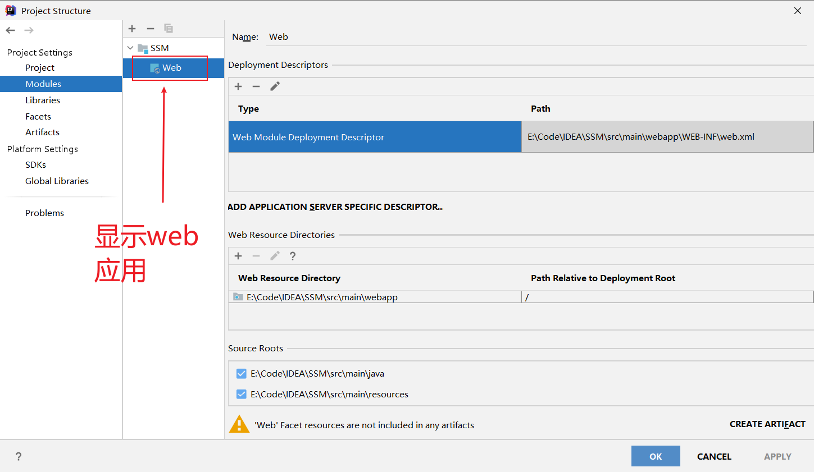

3. 将 web 移动到 main 目录下，并将其改名为 webapp，同时在 pom.xml 中添加打成 war 包的代码

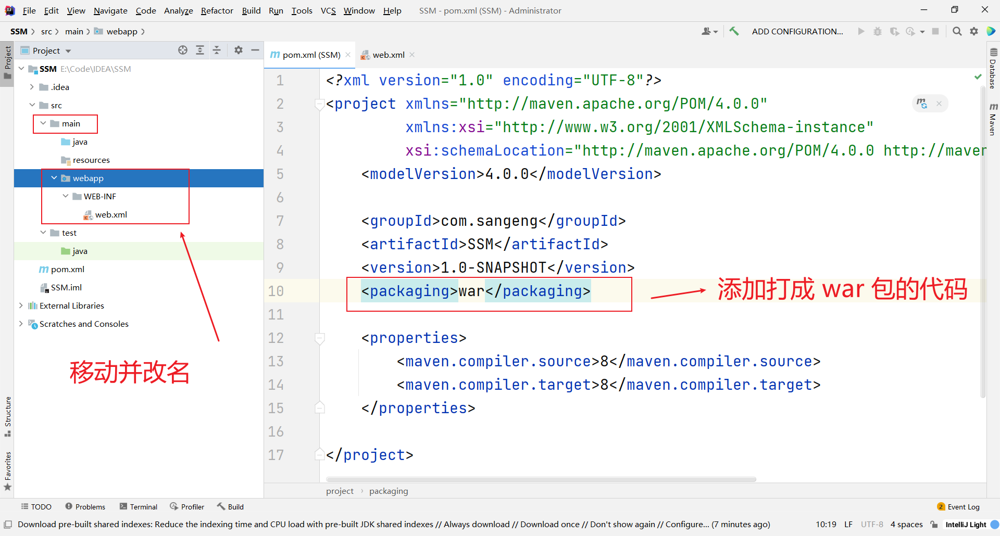

4. File -> Project Structure -> modules，查看路径是否爆红

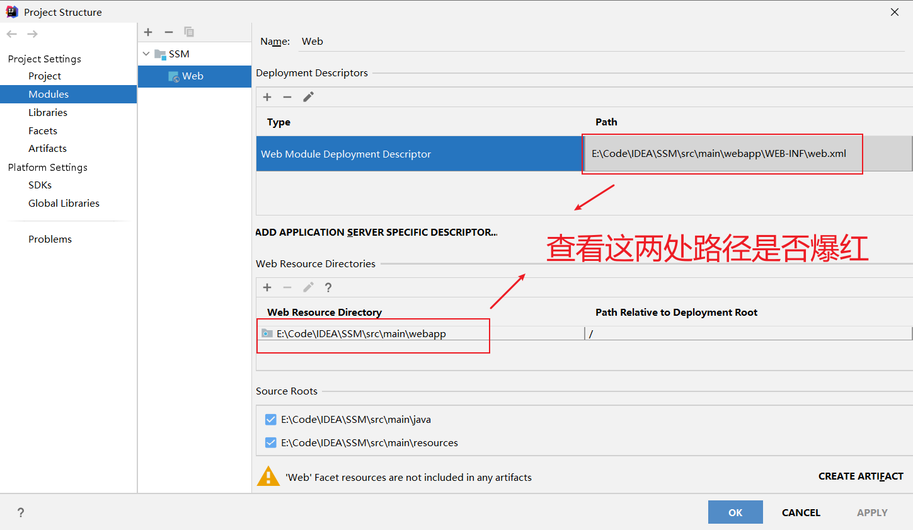

5. 不爆红则 OK


### 1.2.1、导入依赖

引入所有依赖

~~~~xml
 <!--Spring-context Spring容器的依赖-->
        <dependency>
            <groupId>org.springframework</groupId>
            <artifactId>spring-context</artifactId>
            <version>5.1.9.RELEASE</version>
        </dependency>
        <!--AOP相关依赖-->
        <dependency>
            <groupId>org.aspectj</groupId>
            <artifactId>aspectjweaver</artifactId>
            <version>1.8.13</version>
        </dependency>
        <!-- spring-jdbc -->
        <dependency>
            <groupId>org.springframework</groupId>
            <artifactId>spring-jdbc</artifactId>
            <version>5.1.9.RELEASE</version>
        </dependency>
        <!-- mybatis整合到Spring的整合包 -->
        <dependency>
            <groupId>org.mybatis</groupId>
            <artifactId>mybatis-spring</artifactId>
            <version>2.0.4</version>
        </dependency>
        <!--mybatis依赖-->
        <dependency>
            <groupId>org.mybatis</groupId>
            <artifactId>mybatis</artifactId>
            <version>3.5.4</version>
        </dependency>
        <!--log4j依赖，打印mybatis日志-->
        <dependency>
            <groupId>log4j</groupId>
            <artifactId>log4j</artifactId>
            <version>1.2.17</version>
        </dependency>
        <!--分页查询，pagehelper-->
        <dependency>
            <groupId>com.github.pagehelper</groupId>
            <artifactId>pagehelper</artifactId>
            <version>4.0.0</version>
        </dependency>

        <!--mysql驱动-->
        <dependency>
            <groupId>mysql</groupId>
            <artifactId>mysql-connector-java</artifactId>
            <version>5.1.47</version>
        </dependency>
        <!-- druid数据源 -->
        <dependency>
            <groupId>com.alibaba</groupId>
            <artifactId>druid</artifactId>
            <version>1.1.16</version>
        </dependency>

        <!-- junit -->
        <dependency>
            <groupId>junit</groupId>
            <artifactId>junit</artifactId>
            <version>4.12</version>
        </dependency>
        <!-- spring整合junit的依赖 -->
        <dependency>
            <groupId>org.springframework</groupId>
            <artifactId>spring-test</artifactId>
            <version>5.1.9.RELEASE</version>
        </dependency>
		 <!-- Lombok插件-->
        <dependency>
            <groupId>org.projectlombok</groupId>
            <artifactId>lombok</artifactId>
            <version>1.18.16</version>
            <scope>provided</scope>
        </dependency>


        <!-- servlet依赖 -->
        <dependency>
            <groupId>javax.servlet</groupId>
            <artifactId>javax.servlet-api</artifactId>
            <version>3.1.0</version>
            <scope>provided</scope>
        </dependency>
        <!--jsp依赖 -->
        <dependency>
            <groupId>javax.servlet.jsp</groupId>
            <artifactId>jsp-api</artifactId>
            <version>2.1</version>
            <scope>provided</scope>
        </dependency>
        <!--springmvc的依赖-->
        <dependency>
            <groupId>org.springframework</groupId>
            <artifactId>spring-webmvc</artifactId>
            <version>5.1.9.RELEASE</version>
        </dependency>

        <!-- jackson，帮助进行json转换-->
        <dependency>
            <groupId>com.fasterxml.jackson.core</groupId>
            <artifactId>jackson-databind</artifactId>
            <version>2.9.0</version>
        </dependency>

        <!--commons文件上传，如果需要文件上传功能，需要添加本依赖-->
        <dependency>
            <groupId>commons-fileupload</groupId>
            <artifactId>commons-fileupload</artifactId>
            <version>1.4</version>
        </dependency>

~~~~

### 1.2.2、数据库初始化

数据库初始化语句

~~~~mysql
CREATE DATABASE /*!32312 IF NOT EXISTS*/`mybatis_db` /*!40100 DEFAULT CHARACTER SET utf8 */;
USE `mybatis_db`;
DROP TABLE IF EXISTS `user`;
CREATE TABLE `user` (
  `id` int(11) NOT NULL AUTO_INCREMENT,
  `username` varchar(50) DEFAULT NULL,
  `age` int(11) DEFAULT NULL,
  `address` varchar(50) DEFAULT NULL,
  PRIMARY KEY (`id`)
) ENGINE=InnoDB AUTO_INCREMENT=3 DEFAULT CHARSET=utf8;
insert  into `user`(`id`,`username`,`age`,`address`) values 
(1,'UZI',19,'上海'),
(2,'PDD',25,'上海');
~~~~


## 1.3、相关配置

### ①整合Spring和Mybatis

1. 在resources目录下创建Spring核心配置文件： **applicationContext.xml** 内容如下

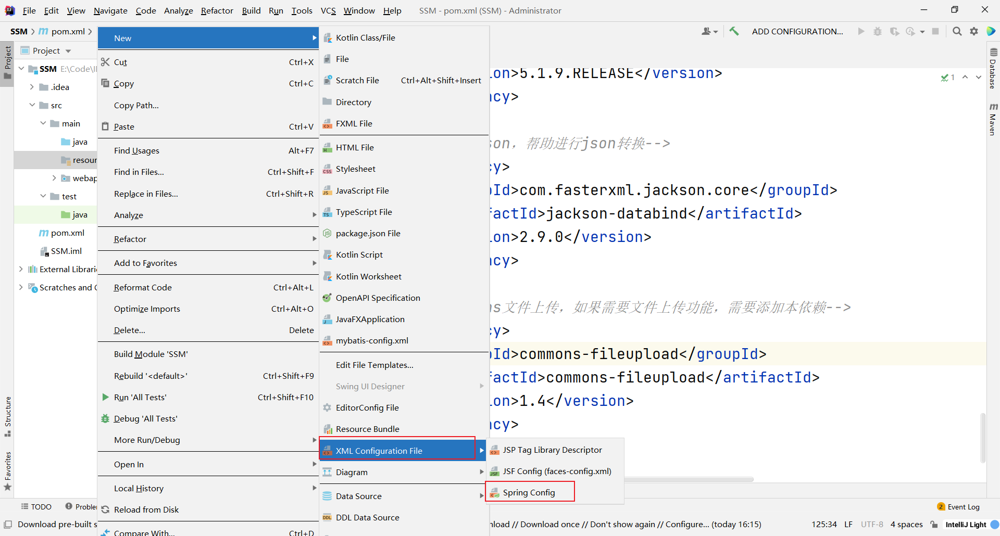

~~~~xml
<?xml version="1.0" encoding="UTF-8"?>
<beans xmlns="http://www.springframework.org/schema/beans"
       xmlns:xsi="http://www.w3.org/2001/XMLSchema-instance"
       xmlns:context="http://www.springframework.org/schema/context" xmlns:tx="http://www.springframework.org/schema/tx"
       xmlns:aop="http://www.springframework.org/schema/aop"
       xsi:schemaLocation="http://www.springframework.org/schema/beans http://www.springframework.org/schema/beans/spring-beans.xsd http://www.springframework.org/schema/context https://www.springframework.org/schema/context/spring-context.xsd http://www.springframework.org/schema/tx http://www.springframework.org/schema/tx/spring-tx.xsd http://www.springframework.org/schema/aop https://www.springframework.org/schema/aop/spring-aop.xsd">

    <!--组件扫描，排除controller-->
    <context:component-scan base-package="com.sangeng">
        <context:exclude-filter type="annotation" expression="org.springframework.stereotype.Controller"></context:exclude-filter>
    </context:component-scan>

    <!--读取properties文件-->
    <context:property-placeholder location="classpath:jdbc.properties"></context:property-placeholder>
    <!--创建连接池注入容器-->
    <bean class="com.alibaba.druid.pool.DruidDataSource" id="dataSource">
        <property name="url" value="${jdbc.url}"></property>
        <property name="username" value="${jdbc.username}"></property>
        <property name="password" value="${jdbc.password}"></property>
        <property name="driverClassName" value="${jdbc.driver}"></property>
    </bean>
    <!--spring整合mybatis后控制的创建获取SqlSessionFactory的对象-->
    <bean class="org.mybatis.spring.SqlSessionFactoryBean" id="sessionFactory">
        <!--配置连接池-->
        <property name="dataSource" ref="dataSource"></property>
        <!--配置mybatis配置文件的路径-->
        <property name="configLocation" value="classpath:mybatis-config.xml"></property>
    </bean>

    <!--mapper扫描配置，扫描到的mapper对象会被注入Spring容器中-->
    <bean class="org.mybatis.spring.mapper.MapperScannerConfigurer" id="mapperScannerConfigurer">
        <property name="basePackage" value="com.sangeng.dao"></property>
    </bean>

    <!--开启aop注解支持-->
    <aop:aspectj-autoproxy></aop:aspectj-autoproxy>

    <!--声明式事务相关配置-->
    <bean class="org.springframework.jdbc.datasource.DataSourceTransactionManager" id="transactionManager">
        <property name="dataSource" ref="dataSource"></property>
    </bean>
    <tx:annotation-driven transaction-manager="transactionManager"></tx:annotation-driven>

</beans>
~~~~

- 这里 mapper 扫描配置的是扫描 com.sangeng.dao 这个包，所以我们新建 dao 包

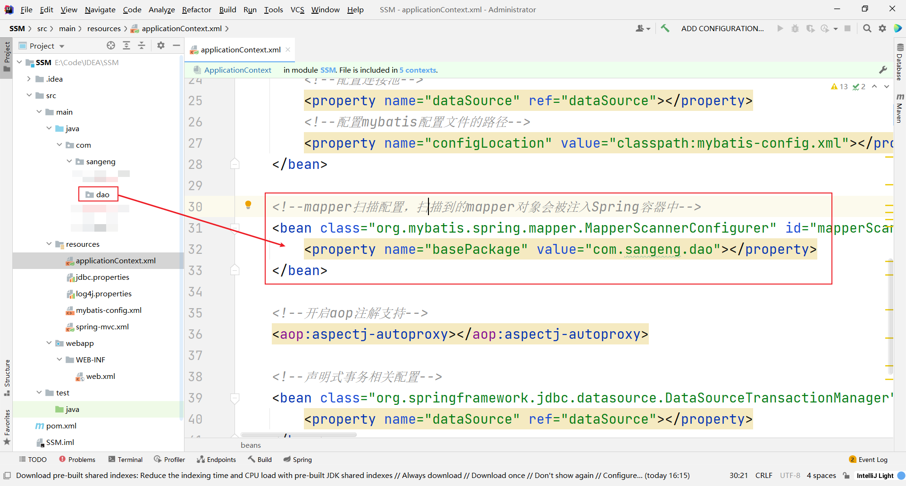


2. 在resources目录下创建**jdbc.properties** 文件，内容如下：

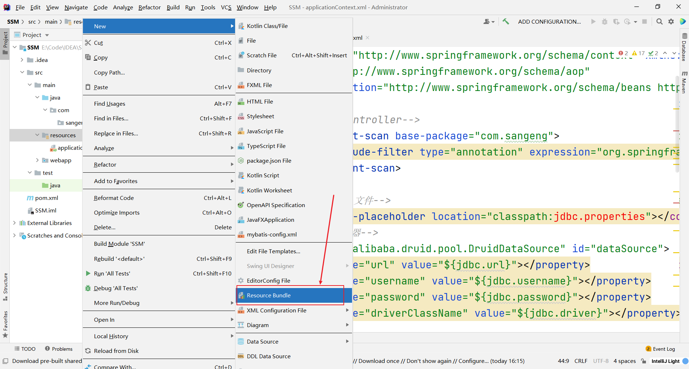

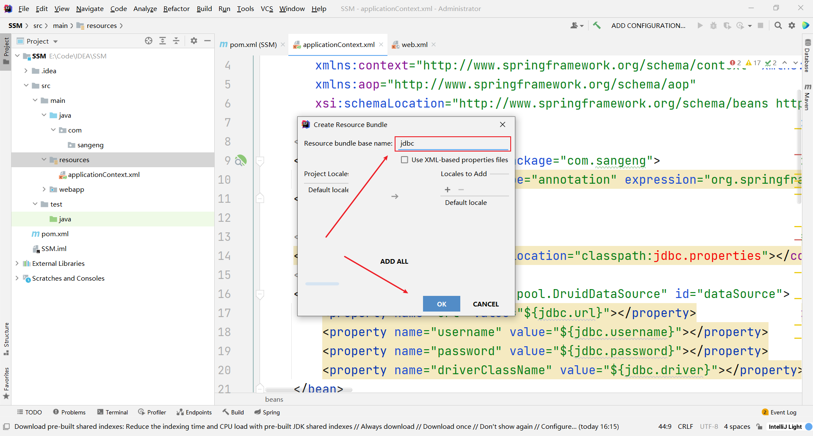


~~~~properties
jdbc.url=jdbc:mysql://localhost:3306/mybatis_db?useUnicode=true&characterEncoding=UTF-8&serverTimezone=UTC
jdbc.driver=com.mysql.jdbc.Driver
jdbc.username=root
jdbc.password=123456
~~~~


3. 在resources目录下创建**mybatis-config.xml** ，内容如下：

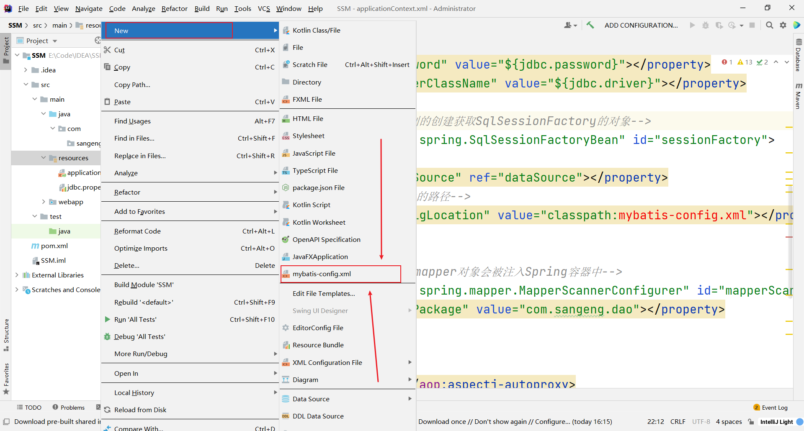

~~~~xml
<?xml version="1.0" encoding="UTF-8" ?>
<!DOCTYPE configuration
        PUBLIC "-//mybatis.org//DTD Config 3.0//EN"
        "http://mybatis.org/dtd/mybatis-3-config.dtd">
<configuration>
    <settings>
        <!--指定使用log4j打印Mybatis日志-->
        <setting name="logImpl" value="LOG4J"/>
    </settings>
    <!--配置别名包-->
    <typeAliases>
        <package name="com.sangeng.domain"></package>
    </typeAliases>
    <plugins>
        <!-- 注意：分页助手的插件，配置在通用mapper之前 -->
        <plugin interceptor="com.github.pagehelper.PageHelper">
            <!-- 指定方言 -->
            <property name="dialect" value="mysql"/>
        </plugin>
    </plugins>
</configuration>
~~~~

- 配置里面为 com.sangeng.domain 包配置了别名，所以我们在 com.sangeng 下建一个 domain 包

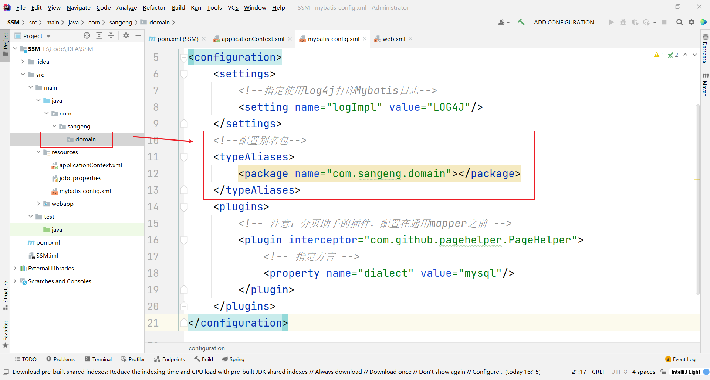

4. 在resources目录下创建**log4j.properties** ，内容如下：

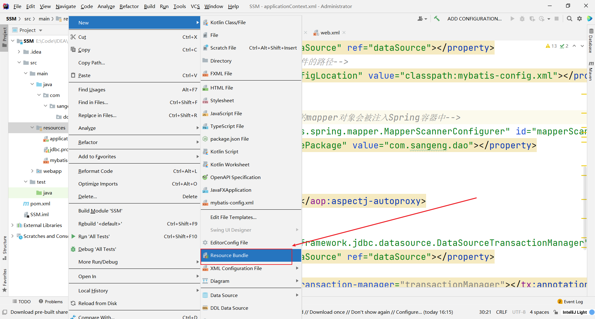


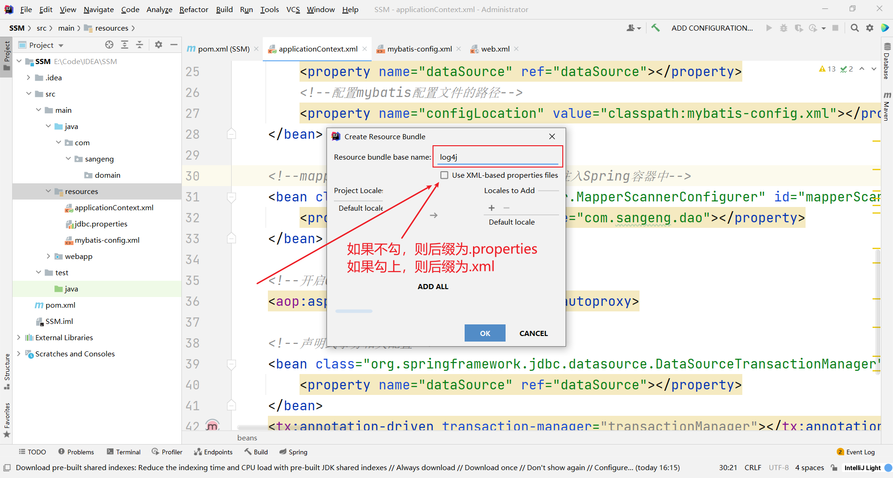


~~~~properties
#将等级为DEBUG的日志信息输出到stdout,stdout定义在下面的代码
log4j.rootLogger=debug, stdout

#控制台输出的相关设置
log4j.appender.stdout=org.apache.log4j.ConsoleAppender
log4j.appender.stdout.Target=System.out
log4j.appender.stdout.layout=org.apache.log4j.PatternLayout
log4j.appender.stdout.layout.ConversionPattern=%d{ABSOLUTE} %5p %c{1}:%L - %m%n

#文件输出的相关设置
log4j.appender.file=org.apache.log4j.FileAppender
log4j.appender.file.File=./log/mylog.log
log4j.appender.file.layout=org.apache.log4j.PatternLayout
log4j.appender.file.layout.ConversionPattern=%d{ABSOLUTE} %5p %c{1}:%L - %m%n
~~~~

### ②SpringMVC引入

5. 在resources目录下创建**spring-mvc.xml** ，内容如下：

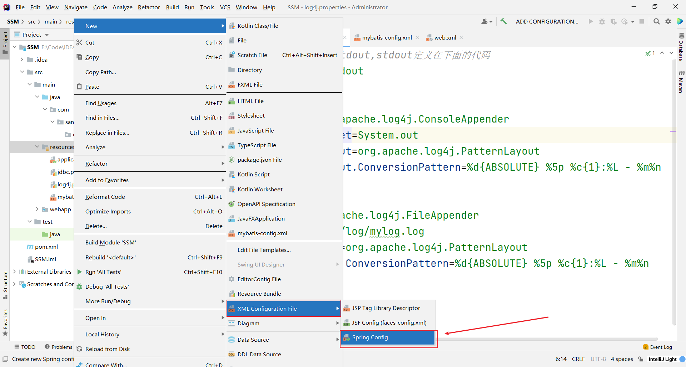


~~~~xml
<?xml version="1.0" encoding="UTF-8"?>
<beans xmlns="http://www.springframework.org/schema/beans"
       xmlns:xsi="http://www.w3.org/2001/XMLSchema-instance"
       xmlns:context="http://www.springframework.org/schema/context"
       xmlns:mvc="http://www.springframework.org/schema/mvc"
       xsi:schemaLocation="http://www.springframework.org/schema/beans http://www.springframework.org/schema/beans/spring-beans.xsd http://www.springframework.org/schema/context https://www.springframework.org/schema/context/spring-context.xsd http://www.springframework.org/schema/mvc https://www.springframework.org/schema/mvc/spring-mvc.xsd">
    <!--
         SpringMVC只扫描controller包即可
     -->
    <context:component-scan base-package="com.sangeng.controller"/>
    <!-- 解决静态资源访问问题，如果不加mvc:annotation-driven会导致无法访问handler-->
    <mvc:default-servlet-handler/>
    <!--解决响应乱码-->
    <mvc:annotation-driven>
        <mvc:message-converters>
            <bean class="org.springframework.http.converter.StringHttpMessageConverter">
                <constructor-arg value="utf-8"/>
            </bean>
        </mvc:message-converters>
    </mvc:annotation-driven>


    <!--配置视图解析器  前后端不分离项目使用-->
<!--    <bean class="org.springframework.web.servlet.view.InternalResourceViewResolver" id="viewResolver">
        &lt;!&ndash;要求拼接的前缀&ndash;&gt;
        <property name="prefix" value="/WEB-INF/page/"></property>
        &lt;!&ndash;要拼接的后缀&ndash;&gt;
        <property name="suffix" value=".jsp"></property>
    </bean>-->

    <!--配置拦截器-->
<!--    <mvc:interceptors>

        <mvc:interceptor>
            &lt;!&ndash;
            &ndash;&gt;
            <mvc:mapping path="/**"/>
            &lt;!&ndash;配置排除拦截的路径&ndash;&gt;
            <mvc:exclude-mapping path="/"/>
            &lt;!&ndash;配置拦截器对象注入容器&ndash;&gt;
            <bean class=""></bean>
        </mvc:interceptor>
    </mvc:interceptors>-->

    <!--
          文件上传解析器
          注意：id 必须为 multipartResolver
          如果需要上传文件时可以放开相应配置
      -->
    <!--<bean id="multipartResolver" class="org.springframework.web.multipart.commons.CommonsMultipartResolver">-->
        <!--&lt;!&ndash; 设置默认字符编码 &ndash;&gt;-->
        <!--<property name="defaultEncoding" value="utf-8"/>-->
        <!--&lt;!&ndash; 一次请求上传的文件的总大小的最大值，单位是字节&ndash;&gt;-->
        <!--<property name="maxUploadSize" value="#{1024*1024*100}"/>-->
        <!--&lt;!&ndash; 每个上传文件大小的最大值，单位是字节&ndash;&gt;-->
        <!--<property name="maxUploadSizePerFile" value="#{1024*1024*50}"/>-->
    <!--</bean>-->
</beans>
~~~~

- 上方配置了 SpringMVC 扫描 controller包 ，所以我们要在 sangeng 下新建包 controller


6. 最后修改web.xml文件

```xml
<?xml version="1.0" encoding="UTF-8"?>
<web-app xmlns="http://xmlns.jcp.org/xml/ns/javaee"
         xmlns:xsi="http://www.w3.org/2001/XMLSchema-instance"
         xsi:schemaLocation="http://xmlns.jcp.org/xml/ns/javaee http://xmlns.jcp.org/xml/ns/javaee/web-app_4_0.xsd"
         version="4.0">

    <servlet>
        <servlet-name>DispatcherServlet</servlet-name>
        <servlet-class>org.springframework.web.servlet.DispatcherServlet</servlet-class>
        <!--
            为DispatcherServlet提供初始化参数的
            设置springmvc配置文件的路径
                name是固定的，必须是contextConfigLocation
                value指的是SpringMVC配置文件的位置
         -->
        <init-param>
            <param-name>contextConfigLocation</param-name>
            <param-value>classpath:spring-mvc.xml</param-value>
        </init-param>
        <!--
            指定项目启动就初始化DispatcherServlet
         -->
        <load-on-startup>1</load-on-startup>
    </servlet>
    <servlet-mapping>
        <servlet-name>DispatcherServlet</servlet-name>
        <!--
             /           表示当前servlet映射除jsp之外的所有请求（包含静态资源）
             *.do        表示.do结尾的请求路径才能被SpringMVC处理(老项目会出现)
             /*          表示当前servlet映射所有请求（包含静态资源,jsp），不应该使用其配置DispatcherServlet
         -->
        <url-pattern>/</url-pattern>
    </servlet-mapping>


    <!--乱码处理过滤器，由SpringMVC提供-->
    <!-- 处理post请求乱码 -->
    <filter>
        <filter-name>CharacterEncodingFilter</filter-name>
        <filter-class>org.springframework.web.filter.CharacterEncodingFilter</filter-class>
        <init-param>
            <!-- name固定不变，value值根据需要设置 -->
            <param-name>encoding</param-name>
            <param-value>UTF-8</param-value>
        </init-param>
    </filter>
    <filter-mapping>
        <filter-name>CharacterEncodingFilter</filter-name>
        <!-- 所有请求都设置utf-8的编码 -->
        <url-pattern>/*</url-pattern>
    </filter-mapping>
</web-app>
```

### ③Spring整合入web项目

让web项目启动的时候就能够创建Spring容器。可以使用Spring提供的监听器ContextLoaderListener，所以我们需要再 web.xml 中配置这个监听器,并且配置上Spring配置文件的路径。

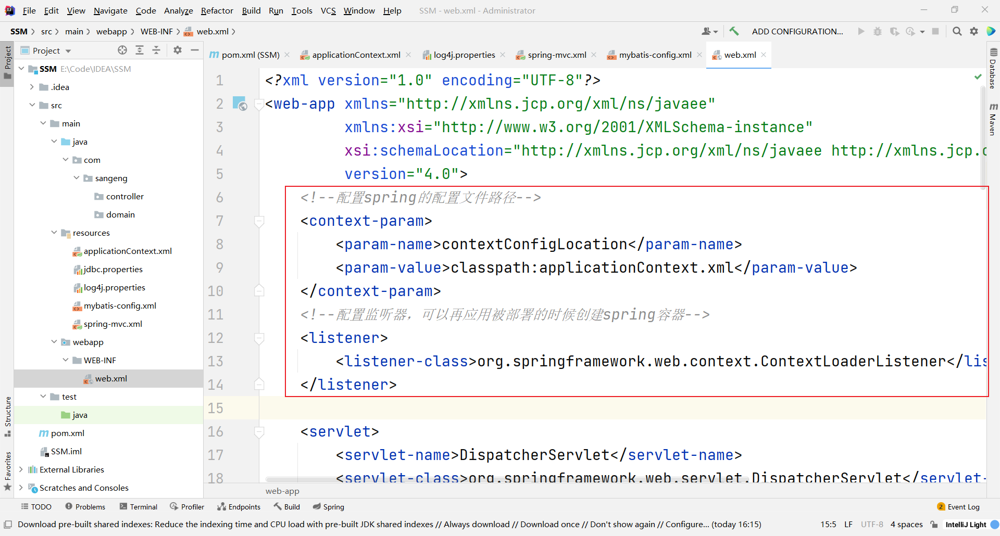

~~~~xml
    <!--配置spring的配置文件路径-->
    <context-param>
        <param-name>contextConfigLocation</param-name>
        <param-value>classpath:applicationContext.xml</param-value>
    </context-param>
    <!--配置监听器，可以再应用被部署的时候创建spring容器-->
    <listener>
        <listener-class>org.springframework.web.context.ContextLoaderListener</listener-class>
    </listener>
~~~~

这样我们的SSM整合配置层面就已经完成了，接下来我们编写测试

## 1.4、编写Controller,Service，Dao

我们来编写==根据id查询用户的接口来进行测试==

先有 Controller，请求过来被 Controller 里面的 Handler 所处理，在 Handler中 通过 Service 处理，Service 内部又会依赖 dao 去进行数据库的查询，dao 是使用 Mybatis 的写法

所以我们先写 Controller, 再写Service接口，实现Service接口中的方法，并且在Service实现类中注入dao，再去写dao，再去写对应的xml映射文件

### 1.4.1、编写实体类domain

- com.sangeng.domain.User.java  代码如下

```java
@Data
@NoArgsConstructor
@AllArgsConstructor
public class User {
    // 这里的属性和我们数据库的属性是一一对应的
    private Integer id;
    private String username;
    private Integer age;
    private String address;
}
```


### 1.4.2、编写Service

- com.sangeng.service.UserService 接口 ，代码如下

~~~~java
public interface UserService {
    User findById(Integer id);
}
~~~~

- com.sangeng.service.impl.UserServiceImpl  实现类代码如下

```java
@Service
public class UserServiceImpl implements UserService {
    @Autowired
    private UserDao userDao;

    public User findById(Integer id) {
        return userDao.findById(id);
    }
}
```

- `@Service` 注解使用在Service层类上用于实例化Bean，设置该类为spring管理的bean
- `@Autowired` 注解使用在字段上上用于根据类型依赖注入，为了从Spring容器中获得此对象

### 1.4.3、编写dao

- com.sangeng.dao.UserDao接口，代码如下

~~~~java
public interface UserDao {
    /**
     * 根据id查询用户
     * @param id
     * @return
     */
    User findById(Integer id);
}
~~~~

- 针对接口生成对应的 mapper 映射文件，resources -> 右键 -> new Directory 生成对应的 mapper 目录

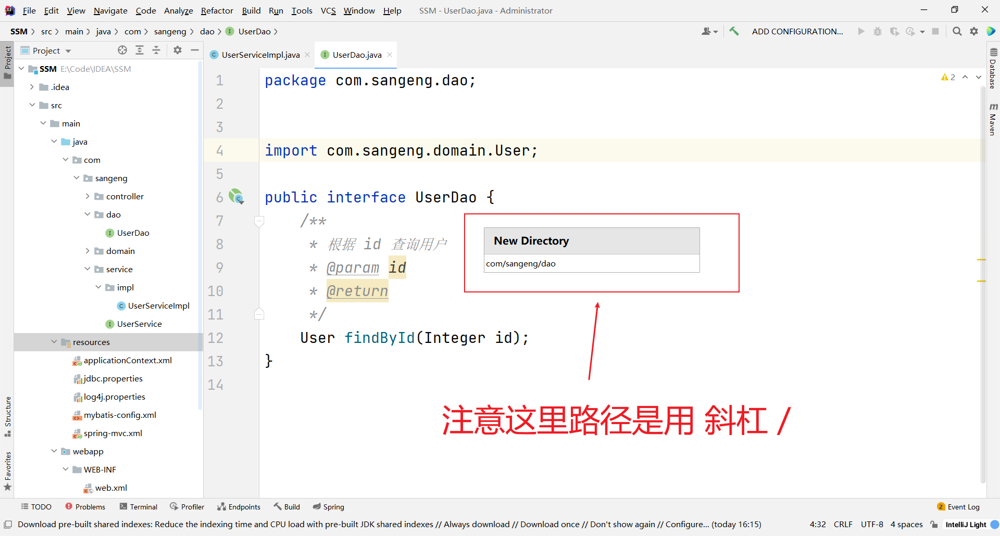

- 插件的存在可以帮我们一键生成 mapper.xml 映射文件，alt+回车 ，选择插件

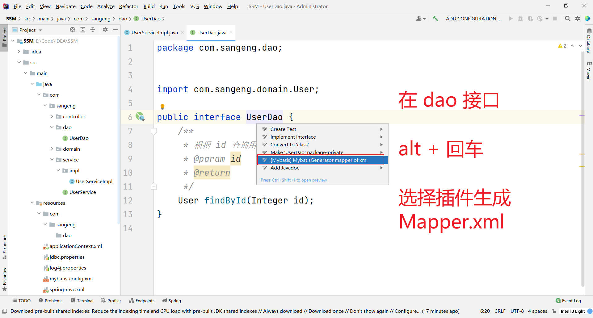

- 选择 mapper.xml 生成的位置

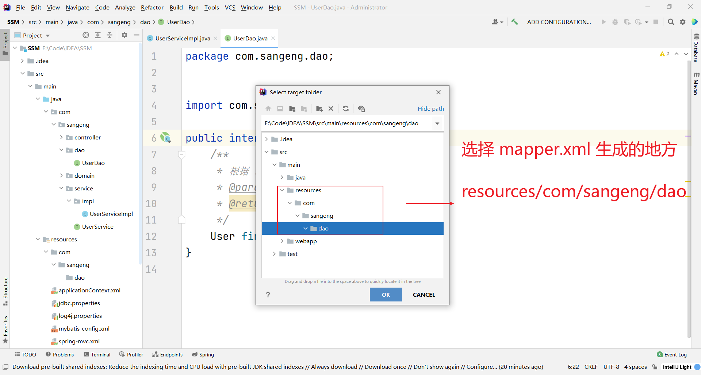

- 之后继续在方法上 alt + 回车

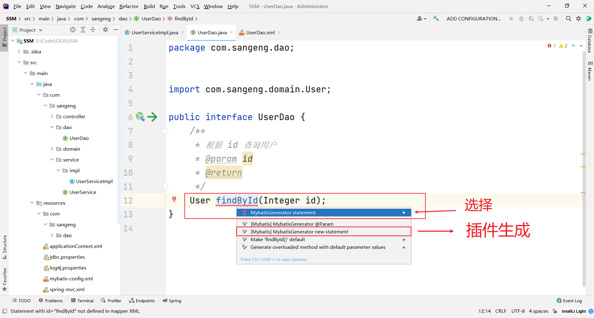

- 这样我们只需要在生成的 mapper.xml 中写 sql 语句即可

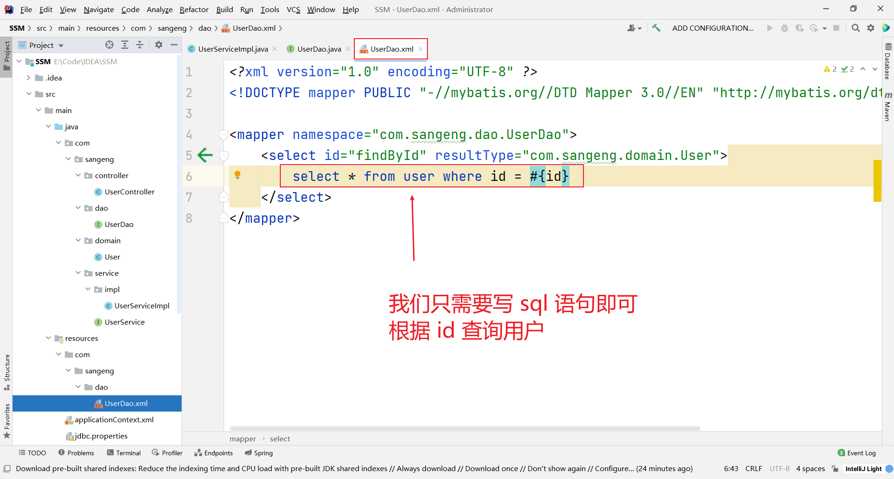

- 所以 resources/com/sangeng/dao/UserDao.xml  代码如下：

```xml
<?xml version="1.0" encoding="UTF-8" ?>
<!DOCTYPE mapper PUBLIC "-//mybatis.org//DTD Mapper 3.0//EN" "http://mybatis.org/dtd/mybatis-3-mapper.dtd" >
<mapper namespace="com.sangeng.dao.UserDao">


    <select id="findById" resultType="com.sangeng.domain.User">
        select * from user where id = #{id}
    </select>
</mapper>
```


### 1.4.4、1.4.4、编写Controller

需求：根据 id 去查询用户

- **Controller 是没法查询数据库的，需要依赖 service，所以需要先创建 service接口和实现类**

- **service 实现类需要依赖 dao 层去查询数据库**

- **dao 是用 mybatis 来查询数据库的操作**

---

- 所以 com.sangeng.controller.UserController  ，代码如下：

~~~~java
// @Controller + @ResponseBody = @RestController
@RestController
public class UserController {

    @Autowired
    private UserService userService;

    @GetMapping("/user/{id}")
    public User findById(@PathVariable Integer id){
        User user = userService.findById(id);
        return user;
    }
}
~~~~

- 加`@Controller` 注解使用在web层类上用于实例化Bean，设置该类为springMVC管理的bean

- 加`@ResponseBody` 注解把返回值转换成 Json 格式放到响应体中。
  - `@Controller` + `@ResponseBody` = `@RestController`

- 加`@RequestMapping` 注解是为了设置请求路径

- 加`@Autowired` 注解使用在字段上上用于根据类型依赖注入，为了从Spring容器中获得此对象

- 加`@PathVariable` 注解是获取==请求路径==的参数

- 最后我们在 pom.xml 中配置一下 tomcat插件

```xml
    <!--构建-->
    <build>
        <!--设置插件-->
        <plugins>
            <plugin>
                <!--具体的插件配置-->
                <groupId>org.apache.tomcat.maven</groupId>
                <artifactId>tomcat7-maven-plugin</artifactId>
                <version>2.1</version>
                <!--配置端口-->
                <configuration>
                    <port>80</port>
                    <!--虚拟路径-->
                    <path>/</path>
                    <!--解决get请求中文乱码-->
                    <uriEncoding>utf-8</uriEncoding>
                </configuration>
            </plugin>
        </plugins>
    </build>
```

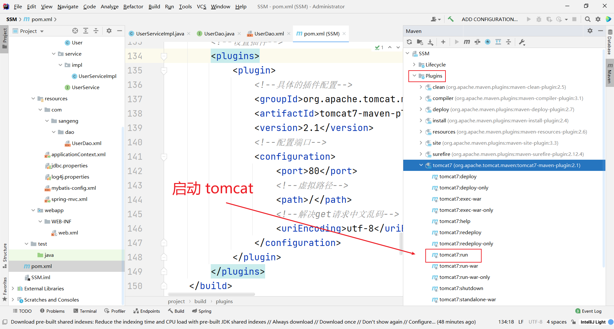

访问测试：


当然我们也可以不配置 tomcat 插件，而是将 tomcat 集成到 IDEA 中启动

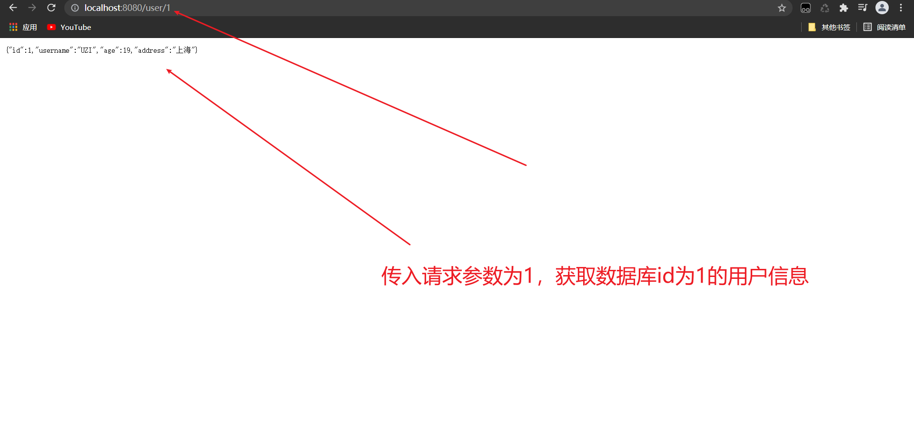


# 2、案例

## 2.1、响应格式统一

我们要保证一个项目中==所有接口返回的数据格式的统一==。这样无论是前端还是移动端开发获取到我们的数据后都能更方便的进行统一处理。我们这里是将所有的数据格式统一为 json 格式。

所以我们定义一下结果封装类 ResponseResult，由于格式统一是公用的，所以我们可以在 com.sangeng 下创建一个公共 common 包，在包下创建结果封装类 ResponseResult 

- `@JsonInclude(JsonInclude.Include.NON_NULL)` 注解表示如果某个属性的值不为NULL,才会将其转化为Json格式

~~~~java
// 加上此注解,如果某个属性的值不为NULL,才会将其转化为Json格式
@JsonInclude(JsonInclude.Include.NON_NULL)
public class ResponseResult<T> {
    /**
     * 状态码
     */
    private Integer code;
    /**
     * 提示信息，如果有错误时，前端可以获取该字段进行提示
     */
    private String msg;
    /**
     * 查询到的结果数据(不同接口查询的类型不一样,所以我们可以设为泛型)
     */
    private T data;

    // 三个参数的有参构造(查询操作需要返回查询的数据data)
    public ResponseResult(Integer code, String msg, T data) {
        this.code = code;
        this.msg = msg;
        this.data = data;
    }
    // 两个参数的有参构造(状态码和提示信息)
    public ResponseResult(Integer code, String msg) {
        this.code = code;
        this.msg = msg;
    }

    // 两个参数的有参构造(状态码和数据)
    public ResponseResult(Integer code, T data) {
        this.code = code;
        this.data = data;
    }

    public Integer getCode() {
        return code;
    }

    public void setCode(Integer code) {
        this.code = code;
    }

    public String getMsg() {
        return msg;
    }

    public void setMsg(String msg) {
        this.msg = msg;
    }

    public T getData() {
        return data;
    }

    public void setData(T data) {
        this.data = data;
    }


}
~~~~

所以我们将之前的 controller 查询 id 为1返回的查询数据进行封装，修改代码如下 ：

- **返回类型为我们封装的结果集 ResponseResult 类型**

~~~~java
@RestController
public class UserController {

    @Autowired
    private UserService userService;

    @GetMapping("/user/{id}")
    public ResponseResult findById(@PathVariable("id") Integer id){
        User user = userService.findById(id);
        if(user==null){
            //说明没有对应的用户
            return new ResponseResult(500,"没有该用户");
        }
        return new ResponseResult(200,"操作成功",user);
    }
}

~~~~

访问测试：

- tomcat 插件启动展示：


- IDEA 集成 tomcat 展示：

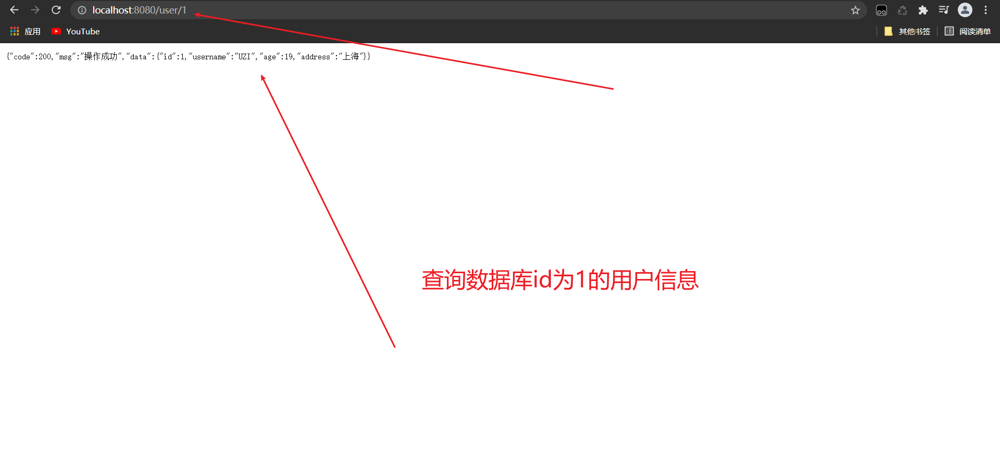

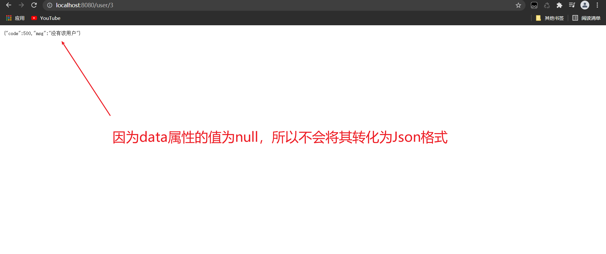


## 2.2、查询所有用户

- 在Controller层调用Service中的方法

~~~~java
@RestController
public class UserController {
    @Autowired
    private UserService userService;

    // 查询所有用户
    @GetMapping("/user")
    public ResponseResult findAll(){
        List<User> list = userService.findAll();
        return new ResponseResult(200,"操作成功",list);
    }

}
~~~~

- Service接口如下

~~~~java
public interface UserService {
    // 根据 id 查询用户
    User findById(Integer id);
    // 查询所有用户
    List<User> findAll();
}
~~~~

- 在Service实现类中调用dao中的方法

~~~~java
@Service
public class UserServiceImpl implements UserService {
    @Autowired
    private UserDao userDao;
	//省略其他无关代码

    public List<User> findAll() {
        return userDao.findAll();
    }
}
~~~~

- dao层接口如下：

~~~~java
public interface UserDao {

    // 查询所有用户
    List<User> findAll();
}
~~~~

- dao层利用插件生成 mapper.xml 文件如下

~~~~xml
<?xml version="1.0" encoding="UTF-8" ?>
<!DOCTYPE mapper PUBLIC "-//mybatis.org//DTD Mapper 3.0//EN" "http://mybatis.org/dtd/mybatis-3-mapper.dtd" >
<mapper namespace="com.sangeng.dao.UserDao">
    <select id="findAll" resultType="com.sangeng.domain.User">
        select * from user
    </select>
</mapper>
~~~~


tomcat 插件启动展示：

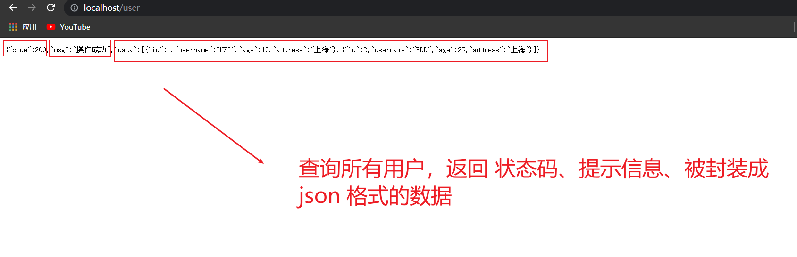


IDEA 集成 tomcat 展示：

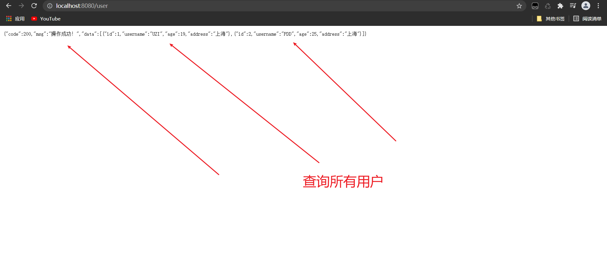


## 2.3、分页查询用户

分页查询的结果除了要包含查到的用户数据外还要有当前页数，每页条数，总记录数这些分页数据。

所以我们在 common 包下新建**分页封装类** PageResult，代码如下：


~~~~java
public class PageResult<T> {
	// 当前页数
    private Integer currentPage;
	// 每页条数
    private Integer pageSize;
	// 总记录数
    private Integer total;
    // 分页数据
    private List<T> data;

    public PageResult(Integer currentPage, Integer pageSize, Integer total, List<T> data) {
        this.currentPage = currentPage;
        this.pageSize = pageSize;
        this.total = total;
        this.data = data;
    }

    public Integer getCurrentPage() {
        return currentPage;
    }

    public void setCurrentPage(Integer currentPage) {
        this.currentPage = currentPage;
    }

    public Integer getPageSize() {
        return pageSize;
    }

    public void setPageSize(Integer pageSize) {
        this.pageSize = pageSize;
    }

    public Integer getTotal() {
        return total;
    }

    public void setTotal(Integer total) {
        this.total = total;
    }

    public List<T> getData() {
        return data;
    }

    public void setData(List<T> data) {
        this.data = data;
    }
}
~~~~

- 编写Controller类，调用Service层的方法

~~~~java
@RestController
public class UserController {

    @Autowired
    private UserService userService;

    @GetMapping("/user/{pageSize}/{pageNum}")
    public ResponseResult findByPage(@PathVariable("pageSize") Integer pageSize,@PathVariable("pageNum") Integer pageNum){
        
        PageResult pageResult =  userService.findByPage(pageSize,pageNum);
        return new ResponseResult(200,"操作成功",pageResult);
    }

}
~~~~

- 编写Service实现类，调用Dao层的方法

~~~~java
@Service
public class UserServiceImpl implements UserService {
    @Autowired
    private UserDao userDao;


    public PageResult findByPage(Integer pageSize, Integer pageNum) {
        PageHelper.startPage(pageNum,pageSize);
        List<User> list = userDao.findAll();
        PageInfo pageInfo = new PageInfo(list);
        PageResult pageResult = new PageResult(pageInfo.getPageNum(),pageInfo.getPageSize(), (int) pageInfo.getTotal(),list);
        return pageResult;
    }
}
~~~~


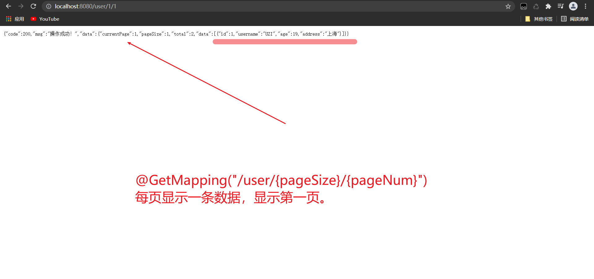


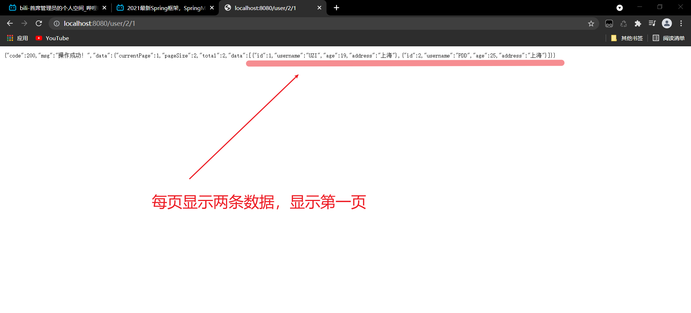

## 2.4、插入用户

①编写 Controller 层，调用 service 层方法

- 我们是在请求体中传入Json格式的数据，`@RequestBody` 注解可以获取请求体中的数据

~~~~java
// 插入用Post请求
@PostMapping("/user")
public ResponseResult insertUser(@RequestBody User user){
    userService.insertUser(user);

    return new ResponseResult(200,"操作成功");
}
~~~~

②编写 Service 层，在 service 实现类中调用 dao 方法

- 在Service接口中增加方法定义

~~~~java
void insertUser(User user);
~~~~

- 实现类中实现该方法:

~~~~java
public void insertUser(User user) {
    userDao.insertUser(user);
}
~~~~

③编写 Dao 层，使用插件生成 mapper.xml 映射文件

- 在接口中定义方法

~~~~java
void insertUser(User user);
~~~~

- 在mapper映射文件中

~~~~xml
<insert id="insertUser">
    <!--id是自增的,我们传入null即可-->
    insert into user values(null,#{username},#{age},#{address})
</insert>
~~~~

④测试：我们向请求体当中传入Json数据

~~~~json
{"username":"三更草堂","age":15,"address":"请问"}
~~~~

我们是把传入请求体的Json数据封装成User对象，在PostMan软件里演示，因为浏览器只方便演示GET请求

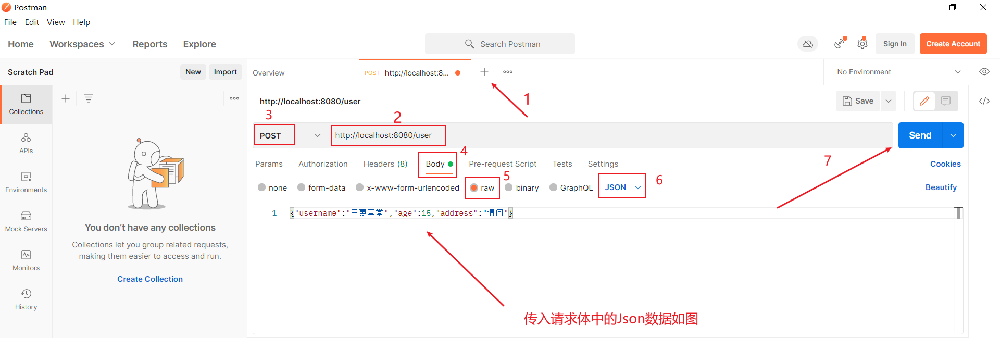


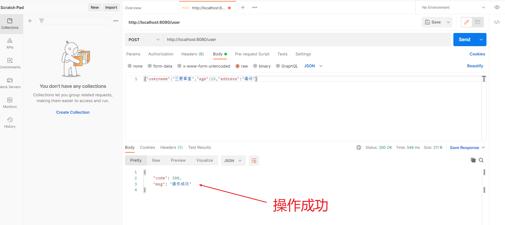


## 2.5、删除用户

①编写 Controller 层，调用 service 层方法

~~~~java
//根据id删除用户
//删除用 delete 请求
@DeleteMapping("/user/{id}")
public ResponseResult deleteUser(@PathVariable("id") Integer id){
    userService.deleteUser(id);
    return new ResponseResult(200,"操作成功");
}
~~~~

②编写 Service 层，在 service 实现类中调用 dao 方法

- 在Service接口中增加方法定义

~~~~java
void deleteUser(Integer id);
~~~~

- 实现类中实现该方法:

~~~~java
public void deleteUser(Integer id) {
    userDao.deleteUser(id);
}
~~~~

③编写 Dao 层，使用插件生成 mapper.xml 映射文件

- 在接口中定义方法

~~~~java
void deleteUser(Integer id);
~~~~

- 在mapper映射文件中

~~~~xml
<delete id="deleteUser">
    delete from user where id = #{id}
</delete>
~~~~

在PostMan里面进行演示，删除id为3的用户

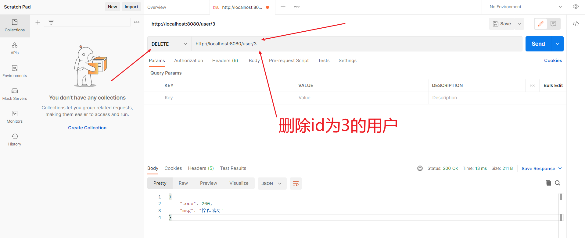

## 2.6、更新用户

①编写 Controller 层，调用 service 层方法

~~~~java
// 更新用户
// 更新操作用put请求
@PutMapping("/user")
public ResponseResult updateUser(@RequestBody User user){
    userService.updateUser(user);
    return new ResponseResult(200,"操作成功");
}
~~~~

②编写 Service 层，在 service 实现类中调用 dao 方法

- 在Service接口中增加方法定义

~~~~java
void updateUser(User user);
~~~~

- 实现类中实现该方法:

~~~~java
public void updateUser(User user) {
    userDao.updateUser(user);
}
~~~~

③编写 Dao 层，使用插件生成 mapper.xml 映射文件

- 在接口中定义方法

~~~~java
    void updateUser(User user);
~~~~

- 在mapper映射文件中

~~~~xml
<update id="updateUser">
    update user set username = #{username},age = #{age},address = #{address} where id = #{id}
</update>
~~~~

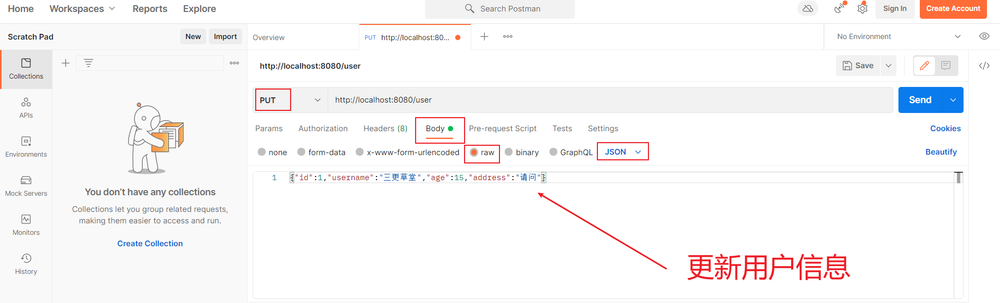


# 3、异常统一处理

我们可以使用`@ControllerAdvice`实现对异常的统一处理。让异常出现时也能返回响应一个JSON。

我们在 com.sangeng 下创建包 exception，里面存放我们的异常统一处理类 SGControllerAdvice

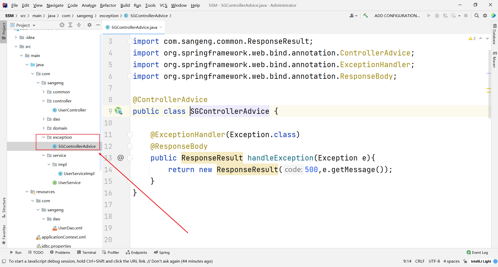

代码如下：

- `@ControllerAdvice` 注解设置当前类为异常处理器类
- `@ExceptionHandler` 注解设置指定异常的处理方式
- `@ResponseBody` 注解是将返回的Json数据放入响应体中

~~~~java
@ControllerAdvice
public class SGControllerAdvice {

    @ExceptionHandler(Exception.class)
    @ResponseBody
    public ResponseResult handleException(Exception e){
        return new ResponseResult(500,e.getMessage());
    }
}
~~~~

我们在Controller层查找用户方法中手动制造错误

```java
@GetMapping("/user")
public ResponseResult findAll(){
    System.out.println(1/0);//手动制造错误
    List<User> list = userService.findAll();
    return new ResponseResult(200,"操作成功！",list);
}
```

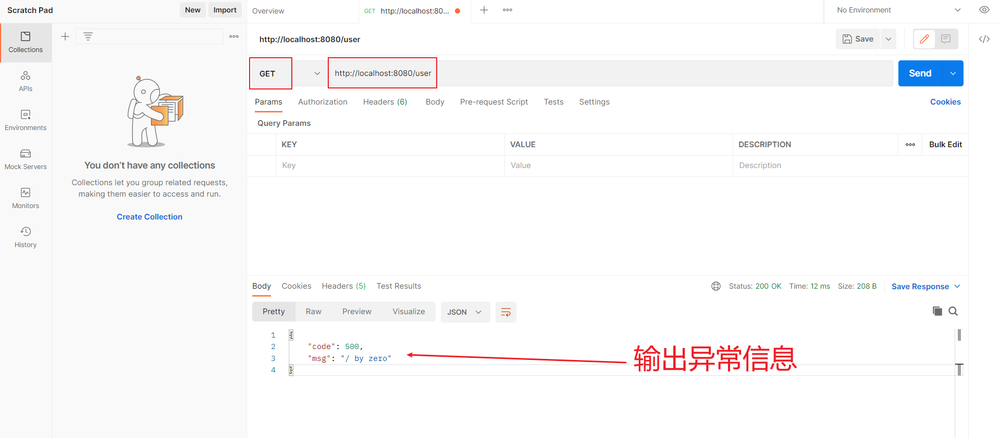


# 4、拦截器

在 com.sangeng 下创建包 interceotor，在包里新建拦截器 SGHandlerInterceptor 类

 创建拦截器的类

~~~~java
public class SGHandlerInterceptor implements HandlerInterceptor {

    public boolean preHandle(HttpServletRequest request, HttpServletResponse response, Object handler) throws Exception {
        System.out.println("preHandle");
        return true;
    }

    public void postHandle(HttpServletRequest request, HttpServletResponse response, Object handler, ModelAndView modelAndView) throws Exception {
        System.out.println("postHandle");
    }

    public void afterCompletion(HttpServletRequest request, HttpServletResponse response, Object handler, Exception ex) throws Exception {
        System.out.println("afterCompletion");
    }
}
~~~~

- 在 Spring-MVC.xml 中配置拦截器

~~~~xml
    <!--配置拦截器-->
        <mvc:interceptors>

            <mvc:interceptor>
                <!--
                -->
                <mvc:mapping path="/**"/>
                <!--配置排除拦截的路径-->
                <!--<mvc:exclude-mapping path="/"/>-->
                <!--配置拦截器对象注入容器-->
                <bean class="com.sangeng.interceptor.SGHandlerInterceptor"></bean>
            </mvc:interceptor>
        </mvc:interceptors>
~~~~

测试


在IDEA控制台也输出了 preHandle、postHandle、afterCompletion


# 5、声明式事务

①编写 Controller 层，调用 service 层方法

```java
// 测试声明式事务
@RequestMapping("/user/test")
public ResponseResult test(){
    userService.test();
    return new ResponseResult(200,"操作成功");
}
```

②编写 Service 层

- 在Service接口中增加方法定义

```java
// 测试声明式事务
void test();
```

- 实现类中实现该方法
  - 已经做好了相应的配置，只要在service方法上加上注解即可

```java
// 测试声明式事务
@Override
@Transactional
public void test() {
    userDao.insertUser(new User(null,"test1",11,"cc"));
    System.out.println(1/0);		//手动制造错误
    userDao.insertUser(new User(null,"test2",12,"cc2"));
}
```

③测试

插入用户失败，因为有错误，会回滚事务。

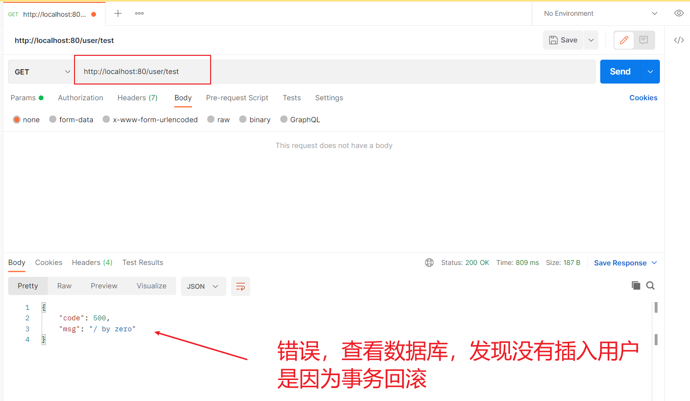


# 6、AOP

注意，自己去使用AOP进行增强时，应该是对Service进行增强。不能对Controller进行增强，因为切面类会被放入父容器，而我们的Controller是在子容器中的。父容器不能访问子容器，子容器可以访问父容器

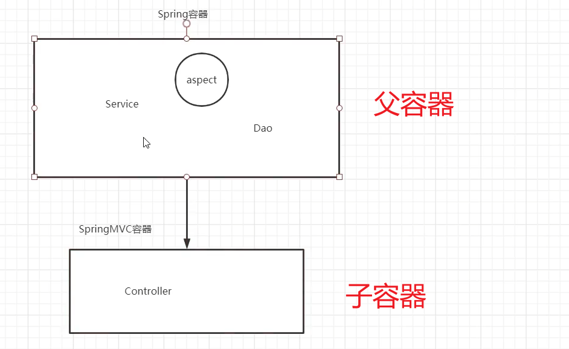

com.sangeng.aspect.SGAspect 代码如下：

~~~~java
@Aspect
@Component
public class SGAspect {

    //定义切点
    @Pointcut("execution(* com.sangeng.service..*.*(..))")
    public void pt(){

    }

    //进行增强
    @Before("pt()")
    public void before(){
        System.out.println("before");
    }
}

~~~~

启动测试发现AOP增强成功

> - 如果需要对Controller进行增强，使用拦截器
> - 如果需要对Service进行增强，使用AOP自己实现


