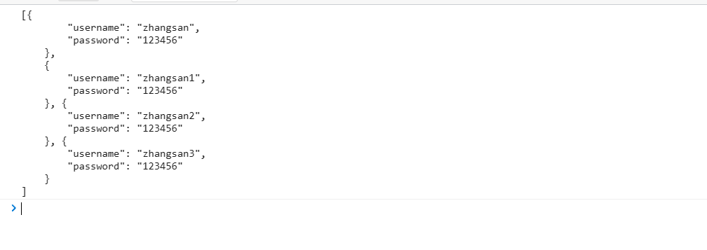
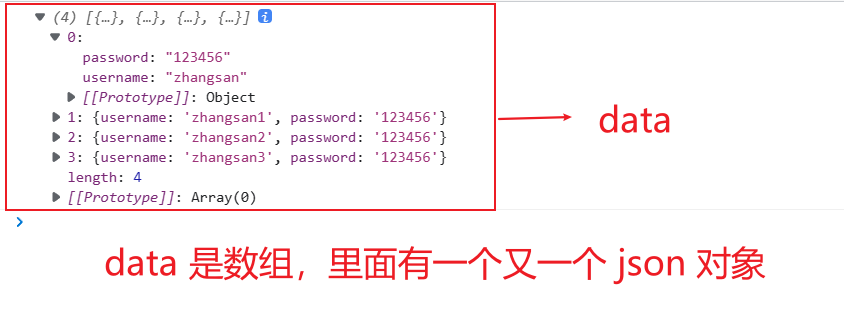
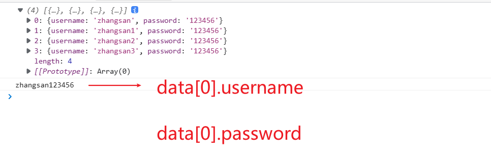

# 1、jQuery.ajax

- 纯JS原生实现Ajax我们不去讲解这里，直接使用jquery提供的，方便学习和使用，避免重复造轮子。

## 1.1、$.ajax

jquery 调用 ajax 方法：

- 格式如下：

```js
$.ajax({
    type: 请求方式 GET/POST
    url: 请求地址
    async: 是否异步,默认是true表示异步
    data: 发送到服务器的数据
    dataType: 预期服务器返回的数据类型
    contentType: 设置请求头
    success: 请求成功时调用此函数
    error: 请求失败时调用此函数
})
```

例如：我们请求我们的本地文件 data.txt

```js
<script src="jquery.js"></script>
<script>
    $.ajax({
        type: "get", //请求方式
        url: 'data.txt', // 请求地址
        data: {
            // 请求数据,json 数据
            uname: "zhangsan"			// 如果没有参数,则不需要设置
        },
        // 请求成功时调用的函数
        success: function(data) {
            // data 是形参名,代表的是返回的数据
            console.log(data);
        }
    })
</script>
```

其中 data.txt 内容如下：

```json
[
    {
        "username": "zhangsan",
        "password": "123456"
    },
    {
        "username": "zhangsan1",
        "password": "123456"
    }, {
        "username": "zhangsan2",
        "password": "123456"
    }, {
        "username": "zhangsan3",
        "password": "123456"
    }
]
```

这样就请求到了我们的 data.txt 里面的数据




一般我们会让服务器返回的数据为 json 格式，但前提是返回的数据必须符合 json 格式的写法

- `dataType: "json"`

```js
<script src="jquery.js"></script>
<script>
    $.ajax({
        type: "get", //请求方式
        url: 'data.txt', // 请求地址
        data: {
            
        },
    	dataType: "json",	// 预期返回的数据类型,在接收到返回值时会自动封装成 json 格式
        // 请求成功时调用的函数
        success: function(data) {
            // data 是形参名,代表的是返回的数据
            console.log(data);
        },
    })
</script>
```



我们可以使用下标来访问

```js
<script src="jquery.js"></script>
<script>
    $.ajax({
        type: "get", //请求方式
        url: 'data.txt', // 请求地址
        data: {
            
        },
    	dataType: "json",	// 预期返回的数据类型,在接收到返回值时会自动封装成 json 格式
        // 请求成功时调用的函数
        success: function(data) {
            // data 是形参名,代表的是返回的数据
            console.log(data);
            console.log(data[0].username + data[0].password);
        },
    })
</script>
```




## 1.2、$.get

这是一个简单的 GET 请求功能以取代复杂的 `$.ajax`

请求成功时可调用回调函数，如果需要在出错时执行函数，请执行 `$.ajax`

```js
// 1.请求json文件,忽略返回值
$.get('data.json');
```

```js
// 2.请求json文件,传递参数,忽略返回值
$.get('data.json',{name: "tom",age:100})
```

```js
// 3.请求json文件,拿到返回值,请求成功后可拿到返回值
$.get('data.json',function(data){
    console.log(data);
})
```

```js
// 4.请求json文件,传递参数,拿到返回值
$.get('data.json',{name:"tom",age:100},function(data){
    console.log(data);
})
```


## 1.3、$.post

`

```js
// 1.请求json文件,忽略返回值
$.post('data.json');
```

```js
// 2.请求json文件,传递参数,忽略返回值
$.post('data.json',{name: "tom",age:100})
```

```js
// 3.请求json文件,拿到返回值,请求成功后可拿到返回值
$.post('data.json',function(data){
    console.log(data);
})
```

```js
// 4.请求json文件,传递参数,拿到返回值
$.post('data.json',{name:"tom",age:100},function(data){
    console.log(data);
})
```


## 1.4、$.getJSON

表示请求返回的数据类型是 JSON 格式的 ajax 请求

```js
$.getJSON('data.txt',{name:"tom",age:100},function(data){
    console.log(data);				// 要求返回的数据格式是 JSON 格式
})
```


