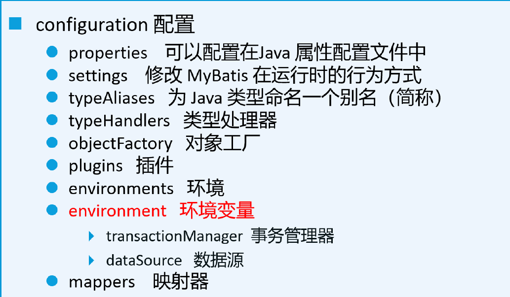
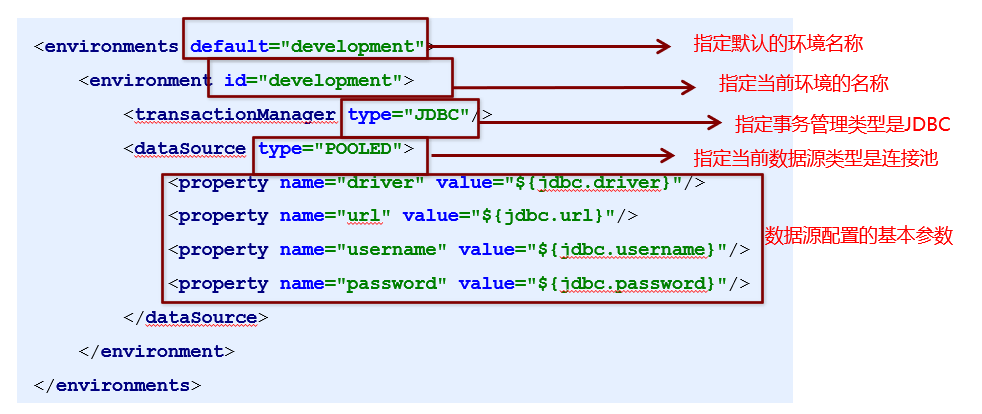
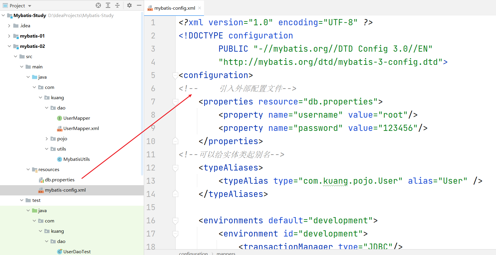
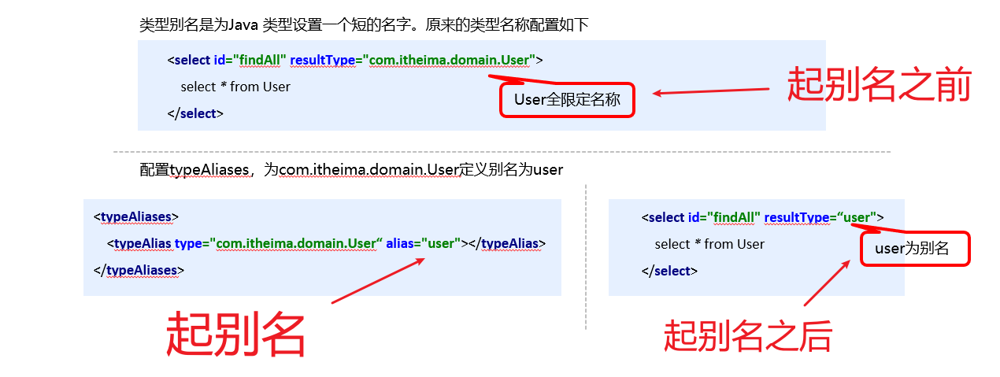
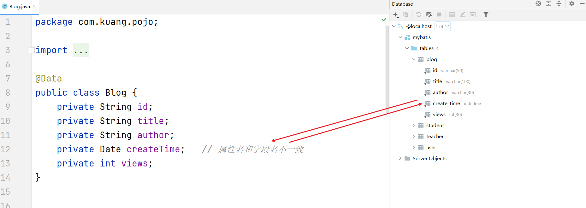
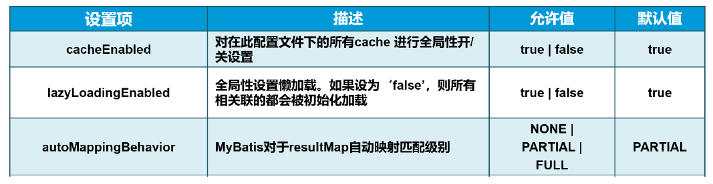
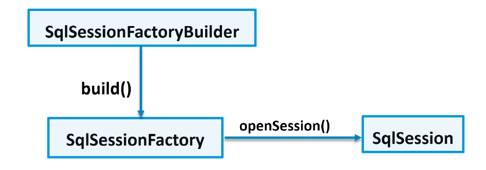
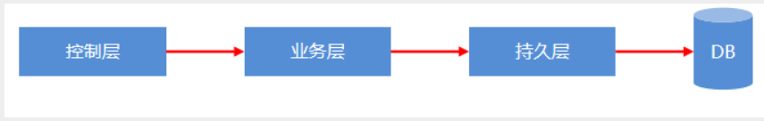
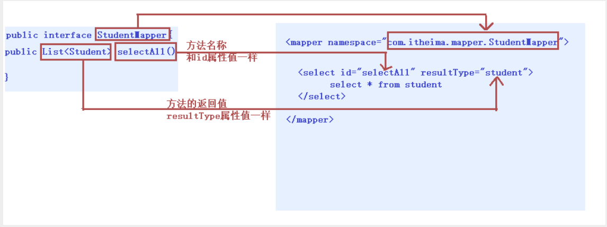

# 🔥Mybatis

## 🔥Mybatis框架简介

- Mybatis 是一个优秀的开源的数据持久层框架，在实体类和SQL语句之间建立映射关系，是一个半自动化的ORM(对象关系映射)框架。
- Mybatis 内部封装了JDBC访问数据库的操作，支持普通的 SQL 查询，存储过程和高级映射，几乎消除了所有的JDBC代码和参数的手工设置以及结果集的检索
- Mybatis作为持久层框架，其主要思想是将程序中的大量SQL语句分离出来，配置在配置文件中，实现SQL的灵活配置，将SQL语句与程序代码分离，可以在不修改程序代码的情况下，直接在配置文件中修改SQL语句。
- MyBatis的前身是iBatis，是Apache的一个开源项目，2010年这个项目由Apache Software Foundation迁移到了Google Code，并更名为MyBatis。2013年又迁移到GitHub。

## 🔥MyBatis的优缺点

优点：

- 性能优越，并且小巧灵活，简单易学。
- 解除sql与程序代码的耦合。
- 提供映射标签，支持对象与数据库的orm字段关系映射
- 提供对象关系映射标签，支持对象关系组建维护
- 提供xml标签，支持编写动态sql。

缺点：

- 编写SQL语句时工作量很大，尤其是字段多、关联表多时，更是如此。
- SQL语句依赖于数据库，导致数据库移植性差，不能更换数据库。

# 0、Mybatis快速入门

1. 下载MyBatis需要的jar文件或添加相关maven依赖
2. 创建MyBatis核心配置文件(mybatis-config.xml)
3. 创建持久化类和SQL映射文件
4. 创建测试类

---


1. **数据库搭建准备**

```sql
CREATE DATABASEmybatis_db` 
USE `mybatis_db`;
DROP TABLE IF EXISTS `user`;
CREATE TABLE `user` (
  `id` int(11) NOT NULL AUTO_INCREMENT,
  `username` varchar(50) DEFAULT NULL,
  `age` int(11) DEFAULT NULL,
  `address` varchar(50) DEFAULT NULL,
  PRIMARY KEY (`id`)
) ENGINE=InnoDB AUTO_INCREMENT=3 DEFAULT CHARSET=utf8;

insert  into `user`(`id`,`username`,`age`,`address`) values (1,'UZI',19,'上海'),
(2,'PDD',25,'上海');
```

2. **新建普通maven项目,导入依赖**

```xml
<!--mybatis依赖-->
<dependency>
    <groupId>org.mybatis</groupId>
    <artifactId>mybatis</artifactId>
    <version>3.4.6</version>
</dependency>
<!--mysql驱动-->
<dependency>
    <groupId>mysql</groupId>
    <artifactId>mysql-connector-java</artifactId>
    <version>5.1.47</version>
</dependency>
<!--junit测试类-->
<dependency>
    <groupId>junit</groupId>
    <artifactId>junit</artifactId>
    <version>4.11</version>
    <scope>test</scope>
</dependency>
```

3. **编写mybatis核心配置**
   - 在资源目录下创建：mybatis-config.xml 
   - MyBatis 核心配置文件==主要用于配置数据库连接和MyBatis运行时所需的各种特性==，包含了设置和影响MyBatis行为的属性。为了方便管理框架所需要的配置文件，一般在 resources 目录下创建 MyBatis 配置文件，配置文件名称自定义，此处命名为 `mybatis-config.xml`，配置文件代码如下：

```xml
<?xml version="1.0" encoding="UTF-8" ?>
<!DOCTYPE configuration
        PUBLIC "-//mybatis.org//DTD Config 3.0//EN"
        "http://mybatis.org/dtd/mybatis-3-config.dtd">
<configuration>
    <!--配置数据库环境-->
    <!--该default属性必填,指定的值是必须存在的-->
    <environments default="development">
        <!--environment标签:用于配置数据库环境-->
        <!--id属性:在整个应用环境中必须唯一-->
        <environment id="development">
            <!--事务管理器:JDBC、Manage-->
            <transactionManager type="JDBC"/>
            <!--数据源:POOLED,JNDI,UNPOOLED-->
            <dataSource type="POOLED">
                <!--数据库驱动-->
                <property name="driver" value="com.mysql.jdbc.Driver"/>
                <!--数据库用户名-->
                <property name="url" value="jdbc:mysql://localhost:3306/mybatis_db?useSSL=true&amp;useUnicode=true&amp;characterEncoding=UTF-8"/>
                <!--数据库用户名-->
                <property name="username" value="root"/>
                <!--数据库密码-->
                <property name="password" value="123456"/>
            </dataSource>
        </environment>
    </environments>
    
    <!-- 加载映射文件 -->
    <mappers>
        <!-- 加载映射文件 -->
        <mapper resource="com/sangeng/dao/UserDaoMapper.xml"/>
    </mappers>
</configuration>
```

4. 定义接口及对应的xml映射文件
   - 在java下新建包`com.sangeng.dao.UserDao`
   - 在resources资源目录下新建：`com/sangeng/dao/UserDaoMapper.xml` ，SQL映射文件，一般以==实体类+Mapper命名==
   - 在MyBatis中，实体类名称不需要与数据库表名一致，因为MyBatis是POJO与SQL语句之间的映射机制，一般情况下，保证POJO实体类的属性名称与数据库表的字段名一致即可。**实体类属性名不一定与数据库表中的字段名一致，只是建议一致。**

```java
public interface UserDao {
    List<User> findAll();
}
```

```xml
<?xml version="1.0" encoding="UTF-8" ?>
<!DOCTYPE mapper
        PUBLIC "-//mybatis.org//DTD Mapper 3.0//EN"
        "http://mybatis.org/dtd/mybatis-3-mapper.dtd">
<!-- mapper标签：执行增删改查 -->
<!-- namespace属性：映射文件的命名空间，在整个应用中必须唯一,属性值任意填写（如果使用接口编程，命名空间必须是接口的全限定类） -->
<mapper namespace="com.sangeng.dao.UserDao">
	<!-- id属性：必填且唯一，建议与接口的方法名称同名 -->
    <!-- resultType属性：返回值类型，该属性必填,要求：实体类的属性名必须与表中的列名或别名一致 -->
    <select id="findAll" resultType="com.sangeng.pojo.User">
      select * from user
    </select>
</mapper>
```

5. 编写测试类

获取SqlSession,通过SqlSession获取UserDao调用对应的方法

```java
@Test
public void findAll() throws IOException {
   //定义mybatis配置文件的路径
   String resource = "mybatis-config.xml";
   // 读取mybatis配置文件
   InputStream inputStream = Resources.getResourceAsStream(resource);
   // 创建会话工厂对象 
   SqlSessionFactory sqlSessionFactory = new SqlSessionFactoryBuilder().build(inputStream);

   //获取Sqlsession对象
   SqlSession sqlSession = sqlSessionFactory.openSession();
   //获取UserDao实现类对象
   UserDao userDao = sqlSession.getMapper(UserDaoMapper.class);
   //调用方法测试
   List<User> userList = userDao.findAll();
   System.out.println(userList);
   //释放资源
   sqlSession.close();
}
```

# 1、Mybatis映射配置文件


- 映射配置文件包含了数据和对象之间的映射关系以及要执行的SQL语句。
- `<mapper>` ：核心根标签，执行增删改查
  
  - `namespace` 属性：名称空间，在整个应用中必须唯一，如果使用接口编程，命名空间必须是接口的全限定类
- `<select>`：查询功能标签
- `<insert>`：新增功能标签
- `<update>`：修改功能标签
- `<delete>`：删除功能标签
  
  - `id` ：唯一标识，配合名称空间使用
  - `parameterType` 属性：指定参数映射的对象类型，可以是全类名或者别名，可以省略不写
  - `resultType` 属性：指定结果映射的对象类型，使用 resultType 属性配置返回值类型要求：**实体类属性名称必须与表中的列名或别名一致**
- SQL获取参数
  - `#{占位符名称} ` 占位符名称可以自定义

    - 方法中只有1个参数且是简单数据类型(基本数据类型、String)
    - 方法参数是类类型，占位符名称必须是实体类的属性名且严格区分大小写
    - 方法参数2个或2个以上，必须使用 `@Param` 注解

  - `${占位符名称}`

    - 如果参数是简单数据类型(基本数据类型,String)，占位符名称只能填写成 value

    

    

    

    


## 1.1、查询功能

* `<select>` 查询功能标签

* 属性        

  id：就是对应的namespace中的方法名    

  parameterType：传入SQL语句的参数类型       

  resultType：指定结果映射的对象类型。

* SQL 获取参数:        #{属性名}

- 示例

```xml
<select id="selectById" parameterType="java.lang.Integer" resultType="com.itheima.bean.Student">
    SELECT * FROM student WHERE id = #{id}
</select>
```


## 1.2、新增功能

- `<insert>`：新增功能标签。

- 属性        

  id：就是对应的namespace中的方法名    

  parameterType：传入SQL语句的参数类型       

  resultType：指定结果映射的对象类型。

- SQL 获取参数:        #{属性名}

- 示例

```xml
<insert id="insert" parameterType="com.itheima.bean.Student">
    INSERT INTO student VALUES (#{id},#{name},#{age})
</insert>
```


## 1.3、修改功能

- `<update>`：修改功能标签。

- 属性        

  id：就是对应的namespace中的方法名    

  parameterType：传入SQL语句的参数类型       

  resultType：指定结果映射的对象类型。

- SQL 获取参数:        #{属性名}

- 示例

```xml
<update id="update" parameterType="com.itheima.bean.Student">
    UPDATE student SET name = #{name},age = #{age} WHERE id = #{id}
</update>
```


## 1.4、删除功能

- `<delete>`：查询功能标签。

- 属性        

  id：就是对应的namespace中的方法名    

  parameterType：传入SQL语句的参数类型       

  resultType：指定结果映射的对象类型。

- SQL 获取参数:        #{属性名}

- 示例

```xml
<delete id="delete" parameterType="com.itheima.bean.Student">
    DELETE FROM student WHERE id = #{id}
</delete>
```

## 1.5、总结

#### 1.5.1、resultType

- 在映射文件中通过resultType指定输出结果的类型（返回值类型）
- 使用resultType属性配置返回值类型要求：**实体类属性名称必须与表中的列名或别名一致**

### 1.5.2、#{}和${}

`#{}`

-  `#{}` 表示一个占位符号，`#{}` 接收输入参数，类型可以是简单类型(基本类型),pojo(实体类),hashmap。
- 如果接收简单类型，`#{}` 中的占位符可以自定义
- `#{}` 接收 pojo 对象值，通过OGNL读取对象中的属性值，通过属性.属性.属性...的方式获取对象属性值。

`${}`

- `${}` 表示一个拼接符号，会引发sql注入，所以不建议使用 `${}`
- `${}`接收输入参数，类型可以是简单类型，pojo、hashmap。
- 如果接收简单类型，${}中只能写成value。

# 2、Mybatis核心配置文件

核心配置文件包含了 MyBatis 最核心的设置和属性信息。如数据库的连接、事务、连接池信息等。

```xml
<?xml version="1.0" encoding="UTF-8" ?>
<!--MyBatis的DTD约束-->
<!DOCTYPE configuration PUBLIC "-//mybatis.org//DTD Config 3.0//EN" "http://mybatis.org/dtd/mybatis-3-config.dtd">

<!--configuration 核心根标签-->
<configuration>

    <!--environments配置数据库环境，环境可以有多个。default属性指定使用的是哪个-->
    <environments default="mysql">
        <!--environment配置数据库环境  id属性唯一标识-->
        <environment id="mysql">
            <!-- transactionManager事务管理。  type属性，采用JDBC默认的事务-->
            <transactionManager type="JDBC"></transactionManager>
            <!-- dataSource数据源信息   type属性 连接池-->
            <dataSource type="POOLED">
                <!-- property获取数据库连接的配置信息 -->
                <property name="driver" value="com.mysql.jdbc.Driver" />
                <property name="url" value="jdbc:mysql:///db1" />
                <property name="username" value="root" />
                <property name="password" value="root" />
            </dataSource>
        </environment>
    </environments>

    <!-- mappers引入映射配置文件 -->
    <mappers>
        <!-- mapper 引入指定的映射配置文件   resource属性指定映射配置文件的名称 -->
        <mapper resource="StudentMapper.xml"/>
    </mappers>
</configuration>
```

Mybatis 核心配置文件的元素节点(标签)是有先后顺序的，其文件架构如下图所示：




## 2.1、environments标签

- `environments`标签：数据库环境的配置，支持多环境配置
- MyBatis可以配置多套运行环境，如开发环境，测试环境，生产环境等。可以灵活选择不同的配置，从而将SQL映射到不同的数据库环境上。不同的运行环境可以通过 environments 元素来配置，但是不管增加几套运行环境，都必须明确选择出当前唯一一个运行环境。




1. environments：表示配置MyBatis的多套运行环境，将SQL映射到多个不同的数据库中，该元素节点下可以配置多个 environment 子元素节点，但是必须指定其中一个为默认的运行环境。
2. 默认的运行环境ID：通过default属性指定当前的运行环境ID，对于运行环境ID的命名必须确保唯一。
3. transactionManager事务管理器：MyBatis有两种事务管理器，分别是JDBC、MANAGED。
4. dataSource数据源类型：MyBatis 指定了3种数据源类型，分别：POOLED、JNDI、UNPOOLED。

### 2.1.1、事务管理器

其中，事务管理器(`transactionManager`)类型有两种：

- **JDBC** ：这个配置就是直接使用了JDBC的提交和回滚设置，它依赖于从数据源得到的连接来管理事务作用域
- **MANAGER**

### 2.1.2、数据源

数据源(`dataSource`)类型有三种：

- **UNPOOLED**：这个数据源的实现只是每次请求时打开和关闭连接
- **POOLED**：这种数据源的实现利用 "池"的概念将JDBC连接对象组织起来。
- **JNDI**
- UNPOOLED


## 2.2、properties标签

实际开发中，习惯将数据源的配置新信息单独抽取成一个properties文件，该标签可以加载额外配置的properties文件



我们可以在`db.properties`中配置信息，例如：

```properties
driver=com.mysql.jdbc.Driver
url=jdbc:mysql://localhost:3306/mybatis?useSSL=true&useUnicode=true&characterEncoding=UTF-8
username=root
password=123456
```

我们也可以在`properties`标签中配置信息，例如：

```xml
<!--    引入外部配置文件-->
<properties resource="db.properties">
    <property name="username" value="root"/>
    <property name="password" value="123456"/>
</properties>
```

- 这个例子中的 username 和 password 将会由 properties 元素中设置的相应值来替换。 
- driver 和 url 属性将会由 mybatis-config.properties 文件中对应的值来替换。这样就为配置提供了诸多灵活选择。

## 2.3、typeAliases标签

可以用来设置给全类名设置别名，简化书写

* `<typeAliases>`：为全类名起别名的父标签。

* `<typeAlias>`：为全类名起别名的子标签。

* 属性      

  type：指定全类名      

  alias：指定别名

* `<package>`：为指定包下所有类起别名的子标签。(别名就是类名)

- 例如为`com.itheima.domain.User`定义别名为`user`，之后在 mapper 映射文件中可以使用定义好的别名，比如在 parameterType 属性、resultType 属性上使用别名。单个设置别名的方式弊端在于，如果项目中有多个实体类(POJO),需要对每一个实体类进行设置。

```xml
<!-- 设置别名 -->
<typeAliases>
    <!-- 单个设置别名 -->
	<!-- type属性：类的全限定名(路径) -->
	<!-- alias属性：别名（自定义） -->
    <typeAlias type="com.kuang.pojo.User" alias="user"></typeAlias>
</typeAliases>    
```



- **一般设置一个包下的实体类全部具有默认别名**

  也就是批量设置别名，就是通过`<package>` 元素的 name 属性直接指定报名，Mybatis 会自动扫描指定包下的 JavaBean，并设置一个别名，默认的别名名称就是实体类的类名(不区分大小写)。

```xml
<!-- 设置别名 -->
<typeAliases>
    <!-- 批量设置别名 -->
	<!-- 以类名作为别名，不区分大小写 -->
    <package name="com.sangeng.dao"></package>
</typeAliases>
```

这样`com.sangeng.dao`包下的实体类全部具有默认别名

- 默认别名是类名首字母小写
- 例如com.sangeng.pojo.User别名为user

### 2.3.1、Mybatis内置别名

下面是一些为常见的 Java 类型内建的类型别名。它们都是不区分大小写的，注意，为了应对原始类型的命名重复，采取了特殊的命名风格。

| 别名 | 映射的类型 |
| ---- | ---------- |
|      |            |
|      |            |
|      |            |
|      |            |
|      |            |
|      |            |
|      |            |
|      |            |
|      |            |


## 2.4、settings标签

### 2.4.1、日志工厂

Mybatis内置的日志工厂提供日志功能，具体的日志实现有以下几种工具：

- SLF4J
- Apache Commons Logging
- Log4j 2
- **Log4j[掌握]**
- JDK logging
- **STDOUT_LOGGING[掌握]**


#### 2.4.1.1、标准日志实现

指定 MyBatis 应该使用哪个日志记录实现，如果此设置不存在，则会自动发现日志记录实现

在`mybatis-config.xml`核心配置文件配置

```xml
<settings>
	<setting name="logImpl" value="STDOUT_LOGGING"/>
</settings>
```

#### 2.4.1.2、Log4j日志实现

使用步骤：

1. **导入Log4j的包**

```xml
<!-- https://mvnrepository.com/artifact/log4j/log4j -->
<dependency>
    <groupId>log4j</groupId>
    <artifactId>log4j</artifactId>
    <version>1.2.17</version>
</dependency>
```

2. **Log4j配置文件编写**
   - 在resources目录下新建`log4j.properties`

```properties
#将等级为DEBUG的日志信息输出到console和file这两个目的地，console和file的定义在下面的代码
log4j.rootLogger=DEBUG,console,file

#控制台输出的相关设置
log4j.appender.console = org.apache.log4j.ConsoleAppender
log4j.appender.console.Target = System.out
log4j.appender.console.Threshold=DEBUG
log4j.appender.console.layout = org.apache.log4j.PatternLayout
log4j.appender.console.layout.ConversionPattern=[%c]-%m%n

#文件输出的相关设置
log4j.appender.file = org.apache.log4j.RollingFileAppender
log4j.appender.file.File=./log/kuang.log
log4j.appender.file.MaxFileSize=10mb
log4j.appender.file.Threshold=DEBUG
log4j.appender.file.layout=org.apache.log4j.PatternLayout
log4j.appender.file.layout.ConversionPattern=[%p][%d{yy-MM-dd}][%c]%m%n

#日志输出级别
log4j.logger.org.mybatis=DEBUG
log4j.logger.java.sql=DEBUG
log4j.logger.java.sql.Statement=DEBUG
log4j.logger.java.sql.ResultSet=DEBUG
log4j.logger.java.sql.PreparedStatement=DEBUG
```

3. **在mybatis核心配置文件中实现**

```xml
<settings>
	<setting name="logImpl" value="LOG4J"/>
</settings>
```

4. **测试类中测试**

```java
//注意导包：org.apache.log4j.Logger
static Logger logger = Logger.getLogger(MyTest.class);

@Test
public void textLog4j(){
    logger.info("info:进入了selectUser方法");
    logger.debug("debug:进入了selectUser方法");
    logger.error("error:进入了selectUser方法");
}
```

5. **可以看到生成的日志文件**


### 2.4.2、开启驼峰命名法



使用步骤：

- 在mybatis核心配置文件中设置下划线驼峰自动转换

```xml
<settings>
	<!-- 开启驼峰命名转化-->
    <setting name="mapUnderscoreToCamelCase" value="true"/>
</settings>
```

### 2.4.3、setting元素

Setting 元素的作用是设置一些非重要的选项，用于设置和改变 MyBatis 运行中的行为。常用的配置如下所示：



其他属性配置请参考：[属性设置](https://mybatis.org/mybatis-3/zh/configuration.html#settings)


## 1.6、mappers标签

该标签的作用是加载映射的，加载方式有如下几种(**主要使用第三种**)：

- 使用**相对类路径的资源引用xml文件**，注意路径是用`/`而不是用点

```xml
<mappers>
    <!-- 加载映射文件 -->
    <mapper resource="com/kuang/dao/UserMapper.xml"></mapper>
</mappers>
```

- 使用映射器接口实现类的完全限定类名，**引用的是接口**

```xml
<mappers>
    <mapper class="com.kuang.dao.TeacherMapper" />
    <mapper class="com.kuang.dao.StudentMapper" />
</mappers>
```

> 注意：class属性获取资源是基于注解实现MyBatis

- **使用扫描包进行注册绑定**

```xml
<!-- 定义dao接口所在的包。要求xml文件存放的路径和dao接口的包名要对应 -->
<mappers>
    <!-- 批量加载 -->
    <package name="com.kuang.dao" />
</mappers>
```

批量加载映射文件需要遵循以下要求：

1. 映射文件名称必须与接口名称同名
2. 映射文件名称必须与接口在相同目录下

# 3、Mybatis相应API

## 3.1、Resources

加载资源的工具类：

| 返回值      | 方法名                               | 说明                                 |
| ----------- | ------------------------------------ | ------------------------------------ |
| InputStream | getResourceAsStream(String fileName) | 通过类加载器返回指定资源的字节输入流 |

```java
//1.加载核心配置文件
InputStream inputStream = Resources.getResourceAsStream("mybatis-config.xml");
// 我们也可以自己加载
InputStream inputStream = 类名.class.getClassLoader().getResourceAsStream("mybatis-config.xml");
```

## 3.2、SqlSessionFactoryBuilder

SqlSessionFactoryBuilder工厂构建器：

- `SqlSessionFactory.build(InputStream inputStream)`
- 通过加载mybatis的核心文件的输入流的形式构建一个SqlSessionFactory对象

```java
String resource = "org/mybatis/example/mybatis-config.xml";
InputStream inputStream = Resources.getResourceAsStream(resource);
SqlSessionFactory sqlSessionFactory = new SqlSessionFactoryBuilder().build(inputStream);
```


## 3.3、SqlSessionFactory

SqlSessionFactory有多个方法创建SqlSession实例，常用的有如下两个：

- `SqlSessionFactory.openSession` :会默认开启一个事务，但事务不会自动提交，也就意味着需要手动提交该事务，更新操作数据才会持久化到数据库中
- `SqlSessionFactory.openSession(boolean autoCommit)` : 参数为是否自动提交，如果设置为true，那么不需要手动提交事务

| 返回值     | 方法名                          | 说明                                                         |
| ---------- | ------------------------------- | ------------------------------------------------------------ |
| SqlSession | openSession()                   | 通过SqlSession构建者对象，并开启手动提交事务                 |
| SqlSession | openSession(boolean autoCommit) | 通过SqlSession构建者对象，如果参数为true，则开启自动提交事务 |


## 3.4、SqlSession

SqlSession 提供了在数据库执行 SQL 命令所需的所有方法 。它还提供了事务的相关操作。

成员方法如下：

- `sqlSession.commit()`：提交事务
- `sqlSession.rollback()`：回滚事务
- `sqlSession.close()`：释放资源

## 3.5、mybatis工具类

我们通常将mybatis获取SqlSession实例封装成一个工具类

```java
public class MybatisUtils {
    private static SqlSessionFactory sqlSessionFactory;
    static{
        try {
            // 使用Mybatis
            // 第一步: 获取sqlSessionFactory对象
            String resource = "mybatis-config.xml";
            InputStream inputStream = Resources.getResourceAsStream(resource);
            sqlSessionFactory = new SqlSessionFactoryBuilder().build(inputStream);
        } catch (IOException e) {
            e.printStackTrace();
        }
    }

    //既然有了SqlSessionFactory，顾名思义，我们可以从中获得 SqlSession 的实例。
    public static SqlSession getSqlSession(){
//        SqlSession sqlSession = sqlSessionFactory.openSession();
//        return sqlSession;
        return sqlSessionFactory.openSession();
    }
}
```


## 3.6、Mybatis核心对象

Mybatis 的核心接口和类主要有 3 个，分别是 `SqlSessionFactoryBuilder`、`SqlSessionFactory`、`SqlSession`。Mybatis核心接口和类的结构图如下所示



1. 每个MyBatis的应用程序都以一个`SqlSessionFactory` 对象的实例为核心
2. 可以根据XML配置文件或Configuration类的实例创建SqlSessionFactoryBuilder对象
3. 通过SqlSessionFactoryBuilder对象获取SqlSessionFactory会话工厂对象
4. 通过SQLSessionFactory对象获取SqlSession实例，在SqlSession对象中包含了所有执行数据库操作的方法。


### 3.6.1、SqlSessionFactoryBuilder

- 通过`SqlSessionFactoryBuilder` 创建会话工厂`SqlSessionFactory`将`SqlSessionFactoryBuilder` 当成一个工具类使用即可，不需要使用单例管理`SqlSessionFactoryBuilder`
- 在需要创建`SqlSessionFactory` 时候，只需要new一次SqlSessionFactoryBuilder 即可,`SqlSessionFactoryBuilder` 最大的特点是用过即丢。一旦创建了SqlSessionFactory 对象，这个类就不需要了。因此SqlSessionFactoryBuilder 的最佳使用范围就是存在于方法体内，也就是局部变量

### 3.6.2、SqlSessionFactory

- 通过SqlSessionFactory 创建SqlSession ，使用单例模式管理sqlSessionFactory （工厂一旦创建，使用一个实例）
- 所有MyBatis应用都是以SqlSessionFactory 实例为中心，该对象一旦创建，就会在整个应用运行
  过程中始终存在。没有理由去销毁或再创建它，并且在应用运行中也不建议多次创建SqlSessionFactory，因此最佳作用域是Application，也就是全局变量。

### 3.6.3、SqlSession

- SqlSession适用于执行持久化操作的对象
- SqlSession对应着一次数据库会话，由于数据库会话不是永久的，因此SqlSession最佳应用场合在方法体内，定义成局部变量使用。
- 若SqlSession被关闭，则需要重新创建SqlSession对象
- 使用SqlSession的方式有两种，分别是：
  - 基于SqlSession实例直接执行映射文件的SQL语句。
  - 基于Mapper接口方式操作数据(==官方推荐==)。

注意：每个线程都有自己的SqlSession实例，SqlSession实例不能被共享，也不是线程安全的。因此最佳的作用域范围是request作用域或者方法体作用域。

| 对象                     | 作用                          | 生命周期           |
| ------------------------ | ----------------------------- | ------------------ |
| SqlSessionFactoryBuilder | 用于创建SqlSessionFactory对象 | 方法体内(局部变量) |
| SqlSessionFactory        | 用于创建SqlSession对象        | 应用程序(成员变量) |
| SqlSession               | 执行增删改查                  | 方法体内(局部变量) |


# 4、Mybatis开发方式

## 4.0、Mybatis传统方式开发

## 4.0、Dao 层传统实现方式

- 分层思想：控制层(controller)、业务层(service)、持久层(dao)。

- 调用流程



## 4.1、Dao层代理开发方式

- Mapper 接口开发方法只需要程序员编写Mapper 接口（相当于Dao 接口）
- **我们之前的开发规范是编写Dao接口，之后再编写实现类DaoImpl**
- **代理开发规范是编写Dao接口，之后再编写xml配置文件**
- 基于Mapper接口方式是Mybatis官方推荐使用的，该方式的表达方式页更加直白，代码更加清晰，类型更加安全，无需担心易错的字符串字面值及强制类型转换等。基于Mapper接口实现功能开发，dao数据访问层的接口不需要实现类，使用接口+Mapper映射文件实现功能开发即可，但是必须遵守如下规则：

Mapper 接口开发需要遵循以下规范：

1. Mapper.xml文件中的namespace与mapper接口的全限定名相同
2. Mapper接口方法名和Mapper.xml中定义的每个statement的id相同
3. Mapper接口方法的输入参数类型和mapper.xml中定义的每个sql的parameterType的类型相同
4. Mapper接口方法的输出参数类型和mapper.xml中定义的每个sql的resultType的类型相同




## 4.2、参数的获取

​	Mybatis 的真正强大在于它的语句映射，这是它的魔力所在。由于它的异常强大，映射器的XML文件就显得相对简单，如果拿它跟具有相同功能的JDBC代码进行对比，你会立即发现省掉了将近 95% 的代码。MyBatis 致力于减少使用成本，让用户能更专注于SQL代码。

SQL映射文件只有很少的几个顶级元素(按照应被定义的顺序列出)：

- `mapper` 映射文件的根元素节点，只有一个属性 namespace 命名空间，其作用如下：
  - 用于区分不同的 mapper，全局唯一
  - 保定 dao 接口，即面向接口编程。当 namespace 绑定某一接口之后，可以不用写该接口的实现类，MyBatis 会通过接口的完整限定名查找对应的 mapper 配置来执行SQL语句。因此 namespace 的命名必须跟接口同名。
- `cache` - 该命名空间的缓存配置
- `cache-ref` - 引用其他命名空间的缓存配置
- `resultMap` - 描述如何从数据库结果集中加载对象,是最复杂也是最强大的元素。
- ~~`parameterMap`- 老式风格的参数映射。此元素已被废弃，并可能在将来被移除！~~
- `sql` - 可被其他语句引用的的可重用语句块。
- `insert` - 映射插入语句
- `update` - 映射更新语句
- `delete` - 映射删除语句
- `select` - 映射查询语句


### 4.2.1、一个参数

#### 4.2.1.1、基本参数

我们可以使用`#{}`直接来取值，写任意名字都可以获取到参数。但是一般用方法的参数名来取。

例如：

- 接口中方法定义如下

```java
public interface UserDao {
    
    User findUser(Integer id);
    
}
```

- xml中的内容如下

```xml
<select id="findUser" parameterType="int" resultType="com.sangeng.pojo.User">
    select * from user where id = #{id}
</select>
```

- 测试

```java
@Test
public void findUser() throws IOException {
   //定义mybatis配置文件的路径
   String resource = "mybatis-config.xml";
   InputStream inputStream = Resources.getResourceAsStream(resource);
   SqlSessionFactory sqlSessionFactory = new SqlSessionFactoryBuilder().build(inputStream);

   //获取Sqlsession对象
   SqlSession sqlSession = sqlSessionFactory.openSession();
   //获取UserDao实现类对象
   UserDao userDao = sqlSession.getMapper(UserDao.class);
   //调用方法测试
   User user = userDao.findUser(2);
   System.out.println(user);
   //释放资源
   sqlSession.close();
}
```

#### 4.2.1.2、POJO

我们可以使用POJO中的属性名来获取对应的值。

例如：

- 接口中方法定义如下

```java
public interface UserDao {
    
    User findByUser(User user);
    
}
```

- xml中的内容如下

```xml
<select id="findByUser" resultType="com.sangeng.pojo.User">
    select * from user where id = #{id} and username = #{username} and age = #{age} and address = #{address}
</select>
```

- 测试

```java
@Test
public void findByUser() throws IOException {
    //定义mybatis配置文件的路径
    String resource = "mybatis-config.xml";
    InputStream inputStream = Resources.getResourceAsStream(resource);
    SqlSessionFactory sqlSessionFactory = new SqlSessionFactoryBuilder().build(inputStream);

    //获取Sqlsession对象
    SqlSession sqlSession = sqlSessionFactory.openSession();
    //获取UserDao实现类对象
    UserDao userDao = sqlSession.getMapper(UserDao.class);
    //调用方法测试
    User byUser = userDao.findByUser(new User(2, "PDD", 25, "上海"));
    System.out.println(byUser);
    //释放资源
    sqlSession.close();
}
```


#### 4.2.1.3、Map

我们可以使用map中的key来获取对应的值。

例如：

- 接口中方法定义如下

```java
public interface UserDao {
    
    User findByMap(Map map);
    
}
```

- xml中内容如下

```xml
<select id="findByMap" resultType="com.sangeng.pojo.User">
    select * from user where id = #{id} and username = #{username} and age = #{age} and address = #{address}
</select>
```

- 测试

```java
@Test
public void findByMap() throws IOException {
    //定义mybatis配置文件的路径
    String resource = "mybatis-config.xml";
    InputStream inputStream = Resources.getResourceAsStream(resource);
    SqlSessionFactory sqlSessionFactory = new SqlSessionFactoryBuilder().build(inputStream);

    //获取Sqlsession对象
    SqlSession sqlSession = sqlSessionFactory.openSession();
    //获取UserDao实现类对象
    UserDao userDao = sqlSession.getMapper(UserDao.class);
    //调用方法测试
    Map map = new HashMap();
    map.put("id",2);
    map.put("username","PDD");
    map.put("age",25);
    map.put("address","上海");
    User byMap = userDao.findByMap(map);
    System.out.println(byMap);
    //释放资源
    sqlSession.close();
}
```


### 4.2.2、多个参数

在 MyBatis 中，多个参数入参是不允许的，也就是说方法中只能传入一个参数，在实际应用中，方法的参数(参数个数、参数数据类型)会有各式各样的选择，根据不同的业务需要选择相应的入参方法。

实现多参数入参常用方式有3种，分别是： `@Param注解入参`、`类对象入参`、`map集合入参`

#### 4.2.2.1、@Param注解入参

例如：

- 接口中方法定义如下
  - **我们一般在方法参数前使用@Param来设置参数名。**

```java
public interface UserDao {
    // 方法中的参数一旦加入@Param注解,映射文件中的占位符必须与@Param注解的名称一致
    User findByCondition(@Param("tid") Integer id,@Param("username")String username);
    
}
```

- xml中内容如下
  - 注意：多参数入参，使用`@Param` 注解，映射文件中的占位符必须是`@Param` 注解中的名称，且名称严格区分大小写

```xml
<select id="findByCondition" resultType="com.sangeng.pojo.User">
    <!-- 多参数入参，使用@Param注解，映射文件中的占位符必须是@Param注解中的名称，且名称严格区分大小写 -->
     select * from user where id = #{tid} and username = #{username}
</select>
```

- 测试

```java
@Test
public void findByCondition() throws IOException {
    //定义mybatis配置文件的路径
    String resource = "mybatis-config.xml";
    InputStream inputStream = Resources.getResourceAsStream(resource);
    SqlSessionFactory sqlSessionFactory = new SqlSessionFactoryBuilder().build(inputStream);

    //获取Sqlsession对象
    SqlSession sqlSession = sqlSessionFactory.openSession();
    //获取UserDao实现类对象
    UserDao userDao = sqlSession.getMapper(UserDao.class);
    //调用方法测试
    User pdd = userDao.findByCondition(2, "PDD");
    System.out.println(pdd);
    //释放资源
    sqlSession.close();
}
```

> 小结

- **多参数入参，使用@Param注解，映射文件中的占位符必须是@Param注解中的名称，且名称严格区分大小写。**
- **多参数入参，接口中的方法参数必须加入@Param注解。**

#### 4.2.2.2、类对象入参

1. 定义VO类

```java
/**
* 自定义条件类
*/
public class UserVo extends User {
    
}
```

2. Mapper接口

```java
/**
* 根据用户编码和性别查询用户信息
* @param userVo
* @return
*/

//方法中的参数使用类类型，映射文件中的占位必须是实体类的属性名
List<User> findUserListByUserVo(UserVo userVo);
```

3. Mapper映射文件

```xml
<!-- 方法参数如果是类类型，映射文件中的占位符必须是实体类的属性名（严格区分大小写） -->
<select id="findUserListByUserVo" resultType="com.bdqn.entity.User">
    select * from smbms_user where userCode like concat('%',#{userCode},'%')
    and gender = #{gender}
</select>
```

#### 4.2.2.3、Map集合入参

1. Mapper接口

```java
/**
* 根据用户编码和性别查询用户信息
* @param map
* @return
*/

//方法参数使用Map集合入参，映射文件中的占位符必须与Map集合的key一致
List<User> findUserListByMap(Map<String,Object> map);
```

2. Mappery映射文件

```xml
<!-- 方法参数使用Map集合入参，映射文件中的占位符必须与Map集合的key一致 -->
<select id="findUserListByMap" resultType="com.bdqn.entity.User">
    select * from smbms_user where userCode like concat('%',#{userCode},'%')
    and gender = #{gender}
</select>

```

> 小结:==方法参数使用Map集合入参，映射文件中的占位符必须与Map集合的key一致==

### 4.2.3、总结

- 建议如果只有一个参数的时候不用做什么特殊处理。
- **如果是有多个参数的情况下一定要加上@Param来设置参数名。**


### 4.2.4、获取参数时 #{}和${}的区别

- 如果使用#{}.他是预编译的sql可以防止SQL注入攻击
- 如果使用${}他是直接把参数值拿来进行拼接，这样会有SQL注入的危险


# 5、CRUD操作

## 5.1、select

select 语句有很多属性可以详细配置每一条SQL语句

- `id`: 就是对应的namespace中的方法名
- `resultType`: Sql语句执行的返回值【完整的类名或者别名】
- `parameterType`:传入SQL语句的参数类型

**示例**：

1. 在UserMapper中添加对应方法

```java
public interface UserMapper {
    // 查询全部用户
    List<User> getUserList();
}    
```

2. 在UserMapper.xml中添加Select语句

```xml
<mapper namespace="com.kuang.dao.UserMapper">
    <select id="getUserList" resultType="com.kuang.pojo.User">
        select * from mybatis.user;
    </select>
</mapper>
```

3. 在测试类中测试

```java
public void test(){
   //第一步:获得SqlSession对象
   SqlSession sqlSession = MybatisUtils.getSqlSession();
	//方式一:执行SQL
    UserMapper userDao = sqlSession.getMapper(UserMapper.class);
    
    List<User> userList = userDao.getUserList();
    for (User user : userList) {
            System.out.println(user);
        }
        // 关闭SqlSession
        sqlSession.close();    
}
```

**示例2**：根据id查询用户

1. 在UserMapper中添加对应方法

```java
public interface UserMapper {
    // 根据ID查询用户
    User getUserById(int id);
}  
```

2. 在UserMapper.xml中添加Select语句

```xml
<select id="getUserById" parameterType="int" resultType="com.kuang.pojo.User">
    select * from mybatis.user where id = #{id}
</select>
```

3. 在测试类中测试

```java
@Test
public void getUserById(){
    SqlSession sqlSession = MybatisUtils.getSqlSession();
    UserMapper mapper = sqlSession.getMapper(UserMapper.class);
    
    
    User user = mapper.getUserById(1);
    System.out.println(user);

    sqlSession.close();
}
```


## 5.2、insert

**需求：给数据库增加一个用户**

1. 在UserMapper接口中添加对应的方法

```java
public interface UserMapper{
    // insert
    int addUser(User user);
}
```

2. 在UserMapper.xml中添加insert语句

```xml
<insert id="addUser" parameterType="com.kuang.pojo.User">
        insert into mybatis.user(id, name, pwd) VALUES (#{id},#{name},#{pwd})
</insert>
```

3. 在测试类中测试

```java
// 增删改需要提交事务
@Test
public void addUser(){
    SqlSession sqlSession = MybatisUtils.getSqlSession();
    UserMapper mapper = sqlSession.getMapper(UserMapper.class);

    int res = mapper.addUser(new User(5, "哈哈2", "1234"));
    if(res > 0) {
        System.out.println("插入成功");
    }
    // 提交事务
    sqlSession.commit();
    sqlSession.close();
}
```

- 在插入操作中，使用`parameterType`属性指定要插入的数据类型
- Sql语句中使用`#{实体属性名}`方式引用实体中的属性值
- 增、删、改操作涉及数据库数据变化，所以要使用`sqlSession`对象显式的提交事务，即`sqlSession.commit()`


## 5.3、update

**需求：修改用户的信息**

1. 在UserMapper接口中添加对应的方法

```java
public interface UserMapper{
    // 修改用户
    int updateUser(User user);
}
```

2. 在UserMapper.xml中添加update语句

```xml
<update id="updateUser" parameterType="com.kuang.pojo.User">
        update mybatis.user set name=#{name},pwd=#{pwd} where id = #{id};
</update>
```

3. 在测试类中测试

```java
@Test
    public void updateUser(){
        SqlSession sqlSession = MybatisUtils.getSqlSession();
        UserMapper mapper = sqlSession.getMapper(UserMapper.class);
        
        
        int res = mapper.updateUser(new User(4, "呵呵", "123123"));
        if(res > 0){
            System.out.println("修改成功");
        }

        sqlSession.commit();
        sqlSession.close();
    }
```

## 5.4、delete

**需求：根据id删除一个用户**

1. 在UserMapper接口中添加对应的方法

```java
public interface UserMapper{
    // 删除一个用户
    int deleteUser(int id);
}
```

2. 在UserMapper.xml中添加update语句

```xml
<delete id="deleteUser" parameterType="int">
        delete from mybatis.user where id = #{id}
</delete>
```

3. 在测试类中测试

```java
@Test
public void deleteUser(){
    SqlSession sqlSession = MybatisUtils.getSqlSession();
    UserMapper mapper = sqlSession.getMapper(UserMapper.class);
    int res = mapper.deleteUser(4);
    if(res > 0){
        System.out.println("删除成功");
    }

    sqlSession.commit();
    sqlSession.close();
}
```


## 5.5、万能Map

假设我们的实体类，或者数据库中的表，字段或者参数过多，我们应当考虑使用Map！


### 5.5.1、select

1. 在UserMapper中添加对应方法

```java
public interface UserMapper{
    // 万能的map
    User getUserById2(Map<String,Object> map);
}
```

2. 在UserMapper.xml中添加insert语句

```xml
<select id="getUserById2" parameterType="map" resultType="com.kuang.pojo.User">
        select * from mybatis.user where id = #{helloid} and name = #{name};
</select>
```

3. 在测试类中测试

```java
@Test
public void getUserById2(){
    SqlSession sqlSession = MybatisUtils.getSqlSession();
    UserMapper mapper = sqlSession.getMapper(UserMapper.class);
    
    Map<String, Object> map = new HashMap<>();
    map.put("helloId",1);
    sqlSession.close();
}
```

- Map传递参数，直接在sql中取出key即可！


### 5.5.2、insert

1. 在UserMapper中添加对应方法

```java
public interface UserMapper{
    // 万能的map
    int addUser2(Map<String, Object> map);
}
```

2. 在UserMapper.xml中添加insert语句

```xml
<insert id="addUser2" parameterType="map">
        insert into mybatis.user(id, name, pwd) VALUES (#{id},#{name},#{pwd})
</insert>
```

3. 在测试类中测试

```java
// 传递map的key
@Test
public void addUser2(){
    SqlSession sqlSession = MybatisUtils.getSqlSession();
    UserMapper mapper = sqlSession.getMapper(UserMapper.class);
    
    HashMap<String, Object> map = new HashMap<>();
    map.put("id",5);
    map.put("name","啦啦啦");
    map.put("pwd","123456");
    
    sqlSession.close();
}
```

- 对象传递参数，直接在sql中取对象的属性即可！

# 6、动态SQL

在实际开发中的SQL语句没有之前的这么简单，很多时候需要根据传入的参数情况动态的生成SQL语句。Mybatis提供了动态SQL相关的标签让我们使用。动态SQL语句是MyBatis的一个强大特性，当业务逻辑较为复杂时，我们的SQL是动态变化的，如果查询条件特别多时，拼接SQL语句是一件非常麻烦的事情，并且很容易忽略空格或者字段后面忽略了逗号。


## 6.1、if标签

可以使用if标签进行条件判断，条件成立才会把if标签中的内容拼接进sql语句中。

例如：

```xml
<select id="findByCondition" resultType="com.sangeng.pojo.User">
     select * from user 
     where  id = #{id}
    <if test="username!=null">
       and username = #{username}
    </if>
</select>
```

- 如果参数username为null则执行的sql为：**select * from user where id = ?** 
- 如果参数username不为null则执行的sql为：**select * from user where id = ? and username = ?** 

- **注意：在test属性中表示参数的时候不需要写#{}，写了会出问题。**

## 6.2、trim标签

可以使用该标签动态的添加前缀或后缀，也可以使用该标签动态的消除前缀。

注意：==trim标签其实在真正开发中不会太用到，主要是为了理解后面的where标签，所以这里理解即可==

### 6.2.1、prefixOverridess属性

用来设置需要被清除的前缀,多个值可以用|分隔，注意|前后不要有空格。例如： and|or

例如：

```xml
<select id="findByCondition" resultType="com.sangeng.pojo.User">
    select * from user
    <trim prefixOverrides="and|or" >
        and
    </trim>
</select>
```

最终执行的sql为： select * from user


### 6.2.2、suffixOverrides属性

用来设置需要被清除的后缀,多个值可以用|分隔，注意|前后不要有空格。例如： and|or

```xml
<select id="findByCondition" resultType="com.sangeng.pojo.User">
    select * from user
    <trim suffixOverrides="like|and" >
        where 1=1 like
    </trim>
</select>
```

最终执行的sql为： select * from user  去掉了后缀like


### 6.2.3、prefix属性

用来设置动态添加的前缀，如果标签中有内容就会添加上设置的前缀

```xml
<select id="findByCondition" resultType="com.sangeng.pojo.User">
    select * from user
    <trim prefix="where" >
       1=1
    </trim>
</select>
```

最终执行的sql为：select * from user where 1=1   动态增加了前缀where


#### 6.2.4、 suffix属性

​	用来设置动态添加的后缀，如果标签中有内容就会添加上设置的后缀

~~~~xml
<select id="findByCondition" resultType="com.sangeng.pojo.User">
    select * from user
    <trim suffix="1=1" >
       where
    </trim>
</select>
~~~~

最终执行的sql为：select * from user where 1=1   动态增加了后缀1=1


### 6.2.5、trim综合使用

动态添加前缀where 并且消除前缀and或者or

```xml
<select id="findByCondition" resultType="com.sangeng.pojo.User">
    select * from user
    <trim prefix="where" prefixOverrides="and|or" >
        <if test="id!=null">
            id = #{id}
        </if>
        <if test="username!=null">
            and username = #{username}
        </if>
    </trim>
</select>
```

- 调用方法时如果传入的id和username为null则执行的SQL为：select * from user
- 调用方法时如果传入的id为null，username不为null，则执行的SQL为：select * from user where username = ?

## 6.3、where

where标签等价于：动态添加前缀where 并且消除前缀and或者or

```xml
<trim prefix="where" prefixOverrides="and|or" ></trim>
```

**可以使用where标签动态的拼接where并且去除前缀的and或者or。**

例如：

```xml
<select id="findByCondition" resultType="com.sangeng.pojo.User">
    select * from user
    <where>
        <if test="id!=null">
            id = #{id}
        </if>
        <if test="username!=null">
            and username = #{username}
        </if>
    </where>
</select>
```

- 如果id和username都为null，则执行的sql为：**select * from user **

- 如果id为null，username不为null，则执行的sql为：**select * from user  where username = ? **

  


## 6.4、set

set标签等价于：动态添加前缀set 并且清除后缀逗号

```xml
<trim prefix="set" suffixOverrides="," ></trim>
```

可以使用set标签动态的拼接set并且去除后缀的逗号。

例如：

```xml
<update id="updateUser">
    UPDATE USER
    <set>
        <if test="username!=null">
            username = #{username},
        </if>
        <if test="age!=null">
            age = #{age},
        </if>
        <if test="address!=null">
            address = #{address},
        </if>
    </set>
    where id = #{id}
</update>
```

如果调用方法时传入的User对象的id为2，username不为null，其他属性都为null则最终执行的sql为：UPDATE USER SET username = ? where id = ? 


## 6.5、foreach

可以使用foreach标签遍历集合或者数组类型的参数，获取其中的元素拿来动态的拼接SQL语句。

### 6.5.1、List集合入参

例如：

- mapper

```java
/**
* 根据角色ID列表查询该角色下的用户信息
* @param roleIds
* @return
*/
List<User> findUserListByUserRole_Array(Integer [] roleIds);
```


- mapper.xml

```xml
<select id="findByIds" resultType="com.sangeng.pojo.User">
    select * from smbms_user where userRole in
        <!-- foreach标签：用于循环数组或集合 -->
        <!--
        	collection属性：
                参数是数组，填写array
                参数是list集合，填写list
                参数是map集合，填写map集合中的key
        item属性：填写占位符中内容
        -->
        <foreach collection="array" item="roleIds" open="(" separator="," close=")">
			#{roleIds}
		</foreach>
</select>
```

**collection：表示要遍历的参数。**

- 参数是数组，填写 array
- 参数是list集合，填写list
- 参数是map集合，填写map集合中的key

**open:表示遍历开始时拼接的语句**

**item：表示给当前遍历到的元素的取的名字**

**separator：表示每遍历完一次拼接的分隔符**

**close：表示最后一次遍历完拼接的语句**

**注意：如果方法参数是数组类型，默认的参数名是array，如果方法参数是list集合默认的参数名是list。建议遇到数组或者集合类型的参数统一使用@Param注解进行命名。**


### 6.5.2、List集合入参

- mapper

```java
/**
* 根据角色ID列表查询该角色下的用户信息
* @param roleIds
* @return
*/
List<User> findUserListByUserRole_List(List<Integer> roleIds);
```

- mapper.xml

```xml
<select id="findUserListByUserRole_List" resultType="com.bdqn.entity.User">
	select * from smbms_user where userRole in
    <!-- foreach标签：用于循环数组或集合 -->
    <!--
    	collection属性：
            参数是数组，填写array
            参数是list集合，填写list
            参数是map集合，填写map集合中的key
    	item属性：填写占位符中内容
    -->
    <foreach collection="list" item="roleIds" open="(" separator="," close=")">
    		#{roleIds}
    </foreach>
</select>
```

### 6.5.3、Map集合入参

- mapper

```java
/**
* 根据角色ID列表查询该角色下的用户信息
* @param map
* @return
*/
List<User> findUserListByUserRole_Map(Map<String,Object> map);
```

- mapper.xml

```xml
<select id="findUserListByUserRole_List" resultType="com.bdqn.entity.User">
	select * from smbms_user where userRole in
    <!-- foreach标签：用于循环数组或集合 -->
    <!--
    	collection属性：
            参数是数组，填写array
            参数是list集合，填写list
            参数是map集合，填写map集合中的key
    	item属性：填写占位符中内容
    -->
    <foreach collection="roleIdMa" item="roleIds" open="(" separator="," close=")">
    		#{roleIds}
    </foreach>
</select>
```


## 6.6、choose、when、otherwise

当我们不想使用所有的条件，而只是想从多个条件中选择一个使用时。可以使用choose系列标签。类似于java中的switch。

例如:

1. 接口中方法定义如下

```java
public interface UserDao{
    
    List<User> selectChose(User user);
    
}
```

期望：

​		如果user对象的id不为空时就通过id查询。

​		如果id为null,username不为null就通过username查询。

​		如果id和username都会null就查询id为3的用户

2. xml映射文件如下

```xml
<select id="selectChose" resultType="com.sangeng.pojo.User">
    select * from user
    <where>
        <choose>
            <when test="id!=null">
                id = #{id}
            </when>
            <when test="username!=null">
                username = #{username}
            </when>
            <otherwise>
                id = 3
            </otherwise>
        </choose>
    </where>
</select>
```

- **choose类似于java中的switch**

- **when类似于java中的case**

- **otherwise类似于java中的dufault**

## 6.7、SQL片段抽取

我们在xml映射文件中编写SQL语句的时候可能会遇到重复的SQL片段。这种SQL片段我们可以使用sql标签来进行抽取。然后在需要使用的时候使用include标签进行使用。

例如：

```xml
<sql id="baseSelect" >id,username,age,address</sql>
<select id="findAll" resultType="com.sangeng.pojo.User">
    select <include refid="baseSelect"/>  from user
</select>
```

最终执行的sql为： **select id,username,age,address from user** 


