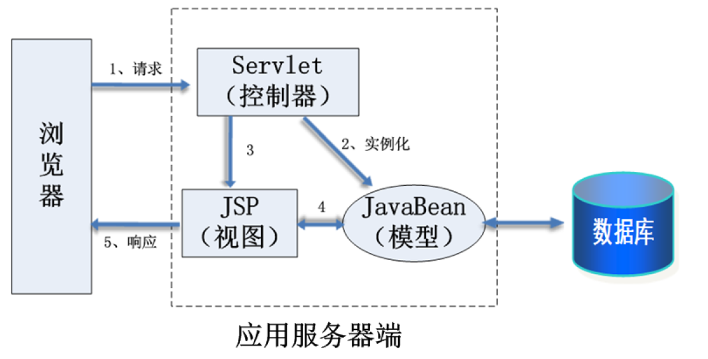
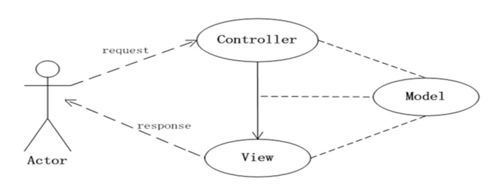
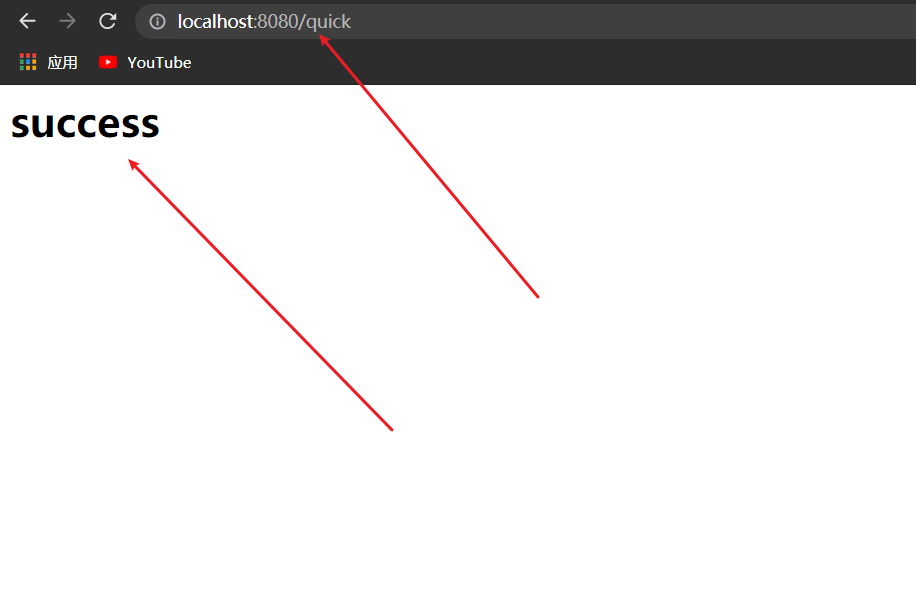
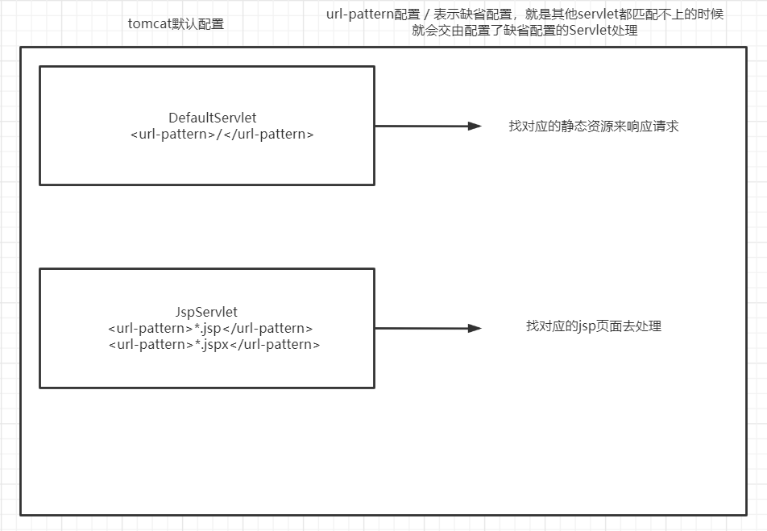
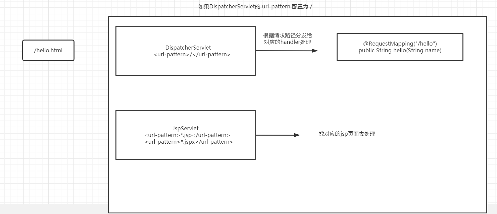
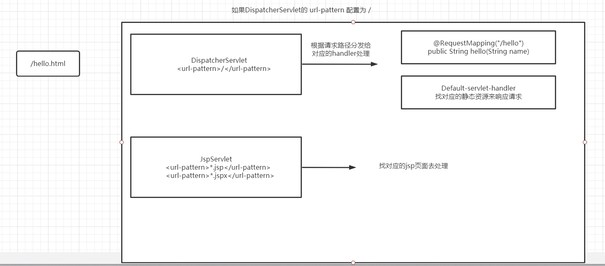
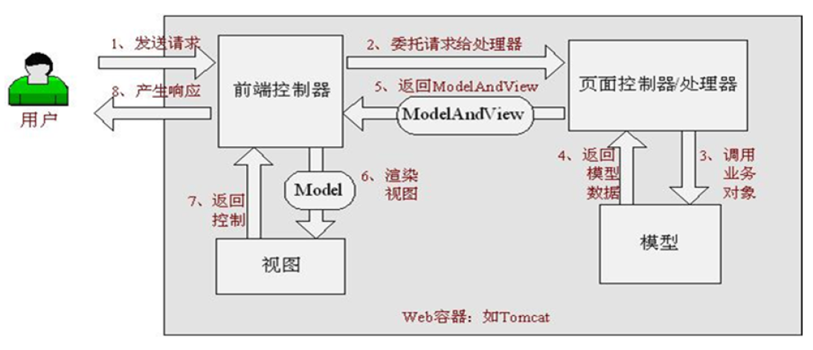

# 1、SpringMVC

## 1.1、三层架构和MVC设计模式

我们的开发架构一般都是基于两种形式，一种是 `C/S` 架构，也就是客户端/服务器，另一种是 `B/S` 架构，也就是浏览器服务器。在 `javaEE` 开发中，几乎全都是基于 `B/S` 架构的开发。那么在 `B/S` 架构中，系统标准的三层架构包括：表现层、业务层、持久层。

### 1.1.1、表现层web

- 负责接收客户端请求，向客户端响应结果，通常客户端使用 `http` 协议请求 `web` 层，`web` 需要接收 `http` 请求，完成 `http` 响应
- 表现层包括展示层和控制层：控制层负责接收请求，展示层负责结果的展示。
- 表现层依赖业务层，接收到客户端请求一般会调用业务层进行业务处理，并将处理结果响应给客户端
- 表现层的设计一般都使用 `MVC` 模型(`MVC`是表现层的设计模型，和其他层没有关系)


### 1.1.2、业务层service

- 负责业务逻辑处理，和我们开发项目的需求息息相关。`web` 层依赖业务层，但是业务层不依赖 `web` 层
- 业务层在业务处理上可能会依赖持久层，如果要对数据持久化需要保证事务一致性

### 1.1.3、持久层dao

- 负责数据持久层，包括数据库和数据访问层，数据库是对数据进行持久化的载体。
- 数据访问层是业务层和持久层交互的接口，业务层需要通过数据访问层将数据持久化到数据库中
- 持久层就是和数据库交互，对数据库表进行增删改查的


## 1.2、MVC设计模式

### 1.2.1、MVC概述

`MVC` 设计不仅限于`Java WEB` 应用，还包括很多应用，之所以那么做的根本原因在于解耦各个模块。

MVC 是 Model、View 和 Controller 的缩写，分别代表 Web 应用程序中的 3 种职责。

- 模型：用于存储数据以及处理用户请求的业务逻辑。
- 视图：向控制器提交数据，显示模型中的数据。
- 控制器：根据视图提出的请求判断将请求和数据交给哪个模型处理，将处理后的有关结果交给哪个视图更新显示。

基于 Servlet 的 MVC 模式的具体实现如下：

- 模型：一个或多个 JavaBean 对象，用于存储数据（实体模型，由 JavaBean 类创建）和处理业务逻辑（业务模型，由一般的 Java 类创建）。
- 视图：一个或多个 JSP 页面，向控制器提交数据和为模型提供数据显示， JSP 页面主要使用HTML 标记和 JavaBean 标记来显示数据。
- 控制器：一个或多个 Servlet 对象，根据视图提交的请求进行控制，即将请求转发给处理业务逻辑的 JavaBean ，并将处理结果存放到实体模型 JavaBean 中，输出给视图显示。



### 1.2.2、JSP Model I

当业务流程比较简单的时候，可以把控制器的功能交给视图来实现，这种模式成为JSP Model I 。该模式只有视图和模型，没有控制器(即JSP + JavaBean) ，如下图所示：


### 1.2.3、JSP Model II

相比Model I ，当业务流程较为复杂的时候，就需要将业务流程控制交给控制器来实现， JSP 专注于视图层的展示即可。这种模式就是JSP Model II(即JSP+Servlet+JavaBean) ，如下图所示：


### 1.2.4、MVC的优缺点

优点：

1. 多视图共享一个模型，大大提高了代码的可重用性。
2. MVC 三个模块相互独立、松耦合架构。
3. 控制器提高了应用程序的灵活性和可配置性。
4. 有利于软件工程化管理。
5. 通过MVC 的设计模式，可以打造出一个松耦合+高重用性+高可适用性的完美架构。

缺点：

1. 原理复杂，增加了系统结构和实现的复杂性。
2. 视图对模型数据的低效率访问。
3. 对于MVC 来说，它并不适合小型甚至中型规模的项目。


## 1.3、SpringMVC框架介绍

- `Spring MVC` 是`Spring` 框架中用于`Web` 应用开发的一个模块，是Spring 提供的一个基于MVC 设计模式的优秀Web 开发框架，它本质上相当于Servlet
- 在MVC 设计模式中， `Spring MVC` 作为控制器(Controller) 来建立模型与视图的数据交互，是结构最清晰的MVC Model II 实现，可以称为一个典型的MVC 框架。



- 在 `SpringMVC` 框架中，`Controller` 替换 `Servlet` 来担负控制器的职责，`Controller` 接收请求，调用响应的 `model` 进行处理，处理器完成业务处理后返回处理结果，`Controller` 调用相应的 `view` 并对处理结果进行视图渲染，最终客户端得到相应信息。

# 2、SpringMVC的简介

## 2.1、SpringMVC概述

SpringMVC 是一种基于 Java 的实现 ==MVC 设计模型==的请求驱动类型的轻量级 ==Web 框架==，属于SpringFrameWork 的后续产品，已经融合在 Spring Web Flow 中。

SpringMVC 已经成为目前最主流的MVC框架之一，并且随着Spring3.0 的发布，全面超越 Struts2，成为最优秀的 MVC 框架。它通过一套注解，让一个简单的 Java 类成为处理请求的控制器，而无须实现任何接口。同时它还支持 ==RESTful== 编程风格的请求。

## 2.2、SpringMVC快速入门

需求：客户端发起请求，服务器端接收请求，执行逻辑并进行视图跳转。

**开发步骤**

1. 导入SpringMVC相关坐标
2. 配置SpringMVC核心控制器DispathcerServlet

3. 创建Controller类和视图页面

4. 使用注解配置Controller类中业务方法的映射地址

5. 配置SpringMVC核心文件 spring-mvc.xml

6. 客户端发起请求测试

**代码实现**

①导入Spring和SpringMVC的坐标、导入Servlet和Jsp的坐标

```xml
 <!--Spring坐标-->
 <dependency>
     <groupId>org.springframework</groupId>
     <artifactId>spring-context</artifactId>
     <version>5.0.5.RELEASE</version>
 </dependency>
 <!--SpringMVC坐标-->
 <dependency>
     <groupId>org.springframework</groupId>
     <artifactId>spring-webmvc</artifactId>
     <version>5.0.5.RELEASE</version>
 </dependency>
 <!--Springweb坐标-->
<dependency>
    <groupId>org.springframework</groupId>
    <artifactId>spring-web</artifactId>
    <version>5.0.5.RELEASE</version>
</dependency>
<!--Servlet坐标-->
<dependency>
    <groupId>javax.servlet</groupId>
    <artifactId>servlet-api</artifactId>
    <version>2.5</version>
</dependency>
<!--Jsp坐标-->
<dependency>
    <groupId>javax.servlet.jsp</groupId>
    <artifactId>jsp-api</artifactId>
    <version>2.0</version>
</dependency>
```

②在web.xml配置SpringMVC的核心控制器

```xml
<servlet>
    <!-- 配置SpringMVC核心控制器 -->
    <servlet-name>DispatcherServlet</servlet-name>
    <servlet-class>org.springframework.web.servlet.DispatcherServlet</servlet-class>  
    <!--
            为DispatcherServlet提供初始化参数的
            设置springmvc配置文件的路径
                name是固定的，必须是contextConfigLocation
                value指的是SpringMVC配置文件的位置
    -->
    <!-- 配置Servlet初始化参数,读取springmvc的配置文件,创建Spring容器 -->
    <init-param>
        <param-name>contextConfigLocation</param-name>
        <param-value>classpath:spring-mvc.xml</param-value>
    </init-param>
    <!--
            指定项目启动就初始化DispatcherServlet
     -->
	<load-on-startup>1</load-on-startup>
</servlet>
<servlet-mapping>   
    <servlet-name>DispatcherServlet</servlet-name>
     <!--
             /           表示当前servlet映射除jsp之外的所有请求（包含静态资源）
             *.do        表示.do结尾的请求路径才能被SpringMVC处理(老项目会出现)
             /*          表示当前servlet映射所有请求（包含静态资源,jsp），不应该使用其配置DispatcherServlet
         -->
    <!--所有请求都需要经过该核心控制器-->
    <url-pattern>/</url-pattern>
</servlet-mapping>
```

③创建Controller和业务方法

```java
public class UserController {
    public String save(){
        System.out.println("Controller save running..");
        return "/success.jsp";
    }
}
```

③创建视图页面success.jsp

```jsp
<%@ page contentType="text/html;charset=UTF-8" language="java" %>
<html>
<head>
    <title>Title</title>
</head>
<body>
<h1>success</h1>
</body>
</html>
```

④配置注解

```java
@Controller // 标记该类是一个控制器
public class UserController {
    // 该注解用于配置访问路径
    @RequestMapping("/quick")//指定请求路径是/quick的才能被该方法处理
    public String save(){
        System.out.println("Controller save running..");
        return "/success.jsp";//跳转到success.jsp
    }
}

```

⑤创建spring-mvc.xml

```xml
<beans xmlns="http://www.springframework.org/schema/beans"  
    xmlns:mvc="http://www.springframework.org/schema/mvc"
    xmlns:context="http://www.springframework.org/schema/context" 
    xmlns:xsi="http://www.w3.org/2001/XMLSchema-instance"
    xsi:schemaLocation="http://www.springframework.org/schema/beans 
    http://www.springframework.org/schema/beans/spring-beans.xsd 
    http://www.springframework.org/schema/mvc   
    http://www.springframework.org/schema/mvc/spring-mvc.xsd  
    http://www.springframework.org/schema/context   
    http://www.springframework.org/schema/context/spring-context.xsd">
    <!--Controller的组件扫描-->
    <context:component-scan base-package="com.itheima.controller"/>
</beans>
```

⑥访问测试地址

```xml
http://localhost:8080/quick 
```




## 2.3、web.xml配置详解🔥

```xml
<servlet>
    <servlet-name>DispatcherServlet</servlet-name>
    <servlet-class>org.springframework.web.servlet.DispatcherServlet</servlet-class>
    <!--
        为DispatcherServlet提供初始化参数的
        设置springmvc配置文件的路径
            name是固定的，必须是contextConfigLocation
            value指的是SpringMVC配置文件的位置
	-->
    <init-param>
        <param-name>contextConfigLocation</param-name>
        <param-value>classpath:spring-mvc.xml</param-value>
    </init-param>
    <!--
        指定项目启动就初始化DispatcherServlet
     -->
    <load-on-startup>1</load-on-startup>
</servlet>
```

- SpringMVC的核心控制器 DispatcherServlet，官方自己写的Servlet
- `<init-param>` 标签是为 DispatcherServlet 提供初始化参数
  - name属性是固定的，必须是`contextConfigLocation`
  - value属性指的是 SpringMVC 配置文件的位置
- `<load-on-startup>` 标签标记容器是否应该在web应用程序启动的时候就加载这个 servlet(实例化并调用其`init()`方法)
  - 它的值必须是一个整数，表示 servlet 被加载的先后顺序
  - 如果值为正整数或者0时，表示容器在应用启动时就加载并初始化这个 servlet ，值越小，servlet 的优先级越高，就越先被加载。
  - 如果该元素的值为负数或者没有设置，则容器会当 servlet 被请求时再加载。

```xml
<servlet-mapping>
    <servlet-name>DispatcherServlet</servlet-name>
    <!--
         /           表示当前servlet映射除jsp之外的所有请求（包含静态资源）
         *.do        表示.do结尾的请求路径才能被SpringMVC处理(老项目会出现)
         /*          表示当前servlet映射所有请求（包含静态资源,jsp），不应该使用其配置DispatcherServlet
    -->
    <url-pattern>/</url-pattern>
</servlet-mapping>
```

- 我们在 tomcat 中 web.xml 文件可以发现如下代码

```xml
<!-- The mapping for the default servlet -->
<servlet-mapping>
    <servlet-name>default</servlet-name>
    <url-pattern>/</url-pattern>
</servlet-mapping>

<!-- The mappings for the JSP servlet -->
<servlet-mapping>
    <servlet-name>jsp</servlet-name>
    <url-pattern>*.jsp</url-pattern>
    <url-pattern>*.jspx</url-pattern>
</servlet-mapping>
```



- 我们的 DispatcherServlet url-pattern 配置为 / ，相当于覆盖掉默认的 DefaultServlet



- 此时如果请求路径为 `/hello.html` ，则会走我们的 DispatcherServlet ，会匹配是否有此路径的方法，根据图示，此时有对应此路径的方法。
- 但是如果请求路径为`/hello1.html`，匹配发现没有此路径的方法，那么会显示404找不到网页

解决方案：

- 在resources目录下创建mvc的配置文件spring-mvc.xml

```xml
<!--
    SpringMVC只扫描controller包即可
-->
<context:component-scan base-package="com.sangeng.controller"/>

<!-- 解决静态资源访问问题，如果不加mvc:annotation-driven会导致无法访问handler-->
<mvc:default-servlet-handler/>

<!--解决响应乱码-->
<mvc:annotation-driven>
    <mvc:message-converters>
        <bean class="org.springframework.http.converter.StringHttpMessageConverter">
            <constructor-arg value="utf-8"/>
        </bean>
    </mvc:message-converters>
</mvc:annotation-driven>
```



此时请求路径`/hello1.html` 会交给 Defalut-servlet-handler 来处理，此时就会找对应的静态资源响应请求

## 2.4、加载静态资源

在 SpringMVC 中，当web.xml 配置文件的 DispatcherServlet 前端控制器请求映射为 `/` 时，SpringMVC 会捕获 web 容器所有的请求，包括静态资源的请求。Spring MVC 会将它们当成一个普通请求处理，但是由于找不到对应的处理器，所以按照常规的方式引用静态文件将无法正常访问。

可以采用 `<mvc:resources/>`标签即可解决静态资源无法访问问题，为了方便配置管理，建议将项目中所有的静态资源文件(js,css,images) 统一放到一个目录下 (如 `webapp/statics`)

- 在 springmvc.xml 配置文件中添加如下配置

```xml
<!-- 加载静态资源 -->
<!-- mapping属性：将静态资源映射到指定的路径下 -->
<!-- location属性：本地静态资源文件所在的目录 -->
<mvc:resources mapping="/statics/**" location="/statics/"/>
```

## 2.5、中文乱码处理

在 SpringMVC 中，默认是不支持中文编码的，也就是说中文会出现乱码情况，为了解决中文乱码问题，需要在 web.xml 配置文件中配置编码过滤器，关键代码如下：

```xml
<!--配置解决中文乱码的过滤器-->
<filter>
    <filter-name>characterEncodingFilter</filter-name>
    <filter-class>org.springframework.web.filter.CharacterEncodingFilter</filter-class>
    <init-param>
        <param-name>encoding</param-name>
        <param-value>UTF-8</param-value>
	</init-param>
</filter>
<filter-mapping>
    <filter-name>characterEncodingFilter</filter-name>
    <url-pattern>/*</url-pattern>
</filter-mapping>
```


# 3、SpringMVC转发与重定向🔥

​	在SpringMVC中我们可以非常轻松的实现页面跳转，只需要把方法的返回值写成要跳转页面的路径即可。

​	重定向是将用户从当前处理请求定向到另一个视图(例如JSP)或处理请求，以前的请求(request)中存放的信息全部失效，并进入一个新的 request 作用域，转发是将用户对当前处理的请求转发给另一个视图或处理请求，以前的 request 中存放的信息不会失效。

​	转发是服务器行为，且转发后浏览器地址栏不会发生变化；重定向是客户端行为，且重定向后浏览器地址栏会改变成重定向后的地址。

例如：

```java
@Controller
public class PageJumpController {
    @RequestMapping("/testJump")
    public String testJump(){
        return "/success.jsp";
    }
}
```

- 默认的跳转其实是转发的方式跳转的。
- 我们也可以选择加上标识，在要跳转的路径前加上`forward:` 这样SpringMVC也会帮我们进行请求转发。

```java
@Controller
public class PageJumpController {
    @RequestMapping("/testJump")
    public String testJump(){
        return "forward:/success.jsp";
    }
}
```

- 如果想实现重定向跳转则可以在跳转路径前加上`redirect:` 进行标识。
- 这样SpringMVC就会帮我们进行重定向跳转。

```java
@Controller
public class PageJumpController {
    @RequestMapping("/testJump")
    public String testJump(){
        return "redirect:/success.jsp";
    }
}
```


# 3、SpringMVC第一个程序

## 1、导入相关依赖

```xml
<dependencies>
    <!-- servlet依赖 -->
    <dependency>
        <groupId>javax.servlet</groupId>
        <artifactId>javax.servlet-api</artifactId>
        <version>3.1.0</version>
        <scope>provided</scope>
    </dependency>
    <!--jsp依赖 -->
    <dependency>
        <groupId>javax.servlet.jsp</groupId>
        <artifactId>jsp-api</artifactId>
        <version>2.1</version>
        <scope>provided</scope>
    </dependency>
    <!--springmvc的依赖-->
    <dependency>
        <groupId>org.springframework</groupId>
        <artifactId>spring-webmvc</artifactId>
        <version>5.1.9.RELEASE</version>
    </dependency>

    <!-- jackson，帮助进行json转换-->
    <dependency>
        <groupId>com.fasterxml.jackson.core</groupId>
        <artifactId>jackson-databind</artifactId>
        <version>2.9.0</version>
    </dependency>
</dependencies>
<!--tomcat插件-->
<build>
    <plugins>
        <plugin>
            <groupId>org.apache.tomcat.maven</groupId>
            <artifactId>tomcat7-maven-plugin</artifactId>
            <version>2.2</version>
            <configuration>
                <!--端口-->
                <port>81</port>
                <!--项目路径-->
                <path>/</path>
                <!--解决get请求中文乱码-->
                <uriEncoding>utf-8</uriEncoding>
            </configuration>
        </plugin>
    </plugins>
</build>
```


## 2、配置web.xml

```xml
<servlet>
    <servlet-name>DispatcherServlet</servlet-name>
    <servlet-class>org.springframework.web.servlet.DispatcherServlet</servlet-class>
    <!--
        为DispatcherServlet提供初始化参数的
        设置springmvc配置文件的路径
            name是固定的，必须是contextConfigLocation
            value指的是SpringMVC配置文件的位置
     -->
    <init-param>
        <param-name>contextConfigLocation</param-name>
        <param-value>classpath:spring-mvc.xml</param-value>
    </init-param>
    <!--
        指定项目启动就初始化DispatcherServlet
     -->
    <load-on-startup>1</load-on-startup>
</servlet>
<servlet-mapping>
    <servlet-name>DispatcherServlet</servlet-name>
    <!--
         /           表示当前servlet映射除jsp之外的所有请求（包含静态资源）
         *.do        表示.do结尾的请求路径才能被SpringMVC处理(老项目会出现)
         /*          表示当前servlet映射所有请求（包含静态资源,jsp），不应该使用其配置DispatcherServlet
     -->
    <url-pattern>/</url-pattern>
</servlet-mapping>


<!--乱码处理过滤器，由SpringMVC提供-->
<!-- 处理post请求乱码 -->
<filter>
    <filter-name>CharacterEncodingFilter</filter-name>
    <filter-class>org.springframework.web.filter.CharacterEncodingFilter</filter-class>
    <init-param>
        <!-- name固定不变，value值根据需要设置 -->
        <param-name>encoding</param-name>
        <param-value>UTF-8</param-value>
    </init-param>
</filter>
<filter-mapping>
    <filter-name>CharacterEncodingFilter</filter-name>
    <!-- 所有请求都设置utf-8的编码 -->
    <url-pattern>/*</url-pattern>
</filter-mapping>
```

## 3、配置SpringMVC

在resources目录下创建mvc的配置文件spring-mvc.xml

```xml
<!--
    SpringMVC只扫描controller包即可
-->
<context:component-scan base-package="com.sangeng.controller"/>
<!-- 解决静态资源访问问题，如果不加mvc:annotation-driven会导致无法访问handler-->
<mvc:default-servlet-handler/>
<!--解决响应乱码-->
<mvc:annotation-driven>
    <mvc:message-converters>
        <bean class="org.springframework.http.converter.StringHttpMessageConverter">
            <constructor-arg value="utf-8"/>
        </bean>
    </mvc:message-converters>
</mvc:annotation-driven>
```


## 4、创建测试用的jsp页面

在webapp下创建success.jsp

```java
<%@ page contentType="text/html;charset=UTF-8" language="java" %>
<html>
<head>
    <title>Title</title>
</head>
<body>
    成功
</body>
</html>
```


## 5、编写Controller

定义一个类，在类上加上@Controller注解，声明其是一个Controller。

主要要创建在之前注解扫描所配置的包下。

然后定义一个方法，在方法上加上@RequestMapping来指定哪些请求会被该方法所处理

```java
@Controller
public class TestController {

    @RequestMapping("/hello")//指定请求路径是/hello的才能被该方法处理
    public String hello(){
        System.out.println("hello");
        return "/success.jsp";//跳转到success.jsp
    }
}
```

## 6、测试访问

访问路径为：

```
http://localhost/81/hello
```


# 4、SpringMVC流程分析

Spring MVC 框架主要由 `DispatcherServlet` 、处理器映射、控制器、视图解析器、视图组成，其工作原理如下图所示：



从上图可总结出 Spring MVC 的工作流程如下：

1. 客户端请求提交到 DispatcherServlet
2. 由 DispatcherServlet 控制器寻找一个或多个 HandlerMapping，找到处理请求的 Controller。
3. DispatcherServlet 将请求提交到 Controller。
4. Controller 调用业务逻辑处理后返回 ModelAndView
5. DispatcherServlet 寻找一个或多个 ViewResolver 视图解析器，找到 ModelAndView 指定的视图。
6. 视图负责将结果显示到客户端。


# 5、 SpringMVC的组件解析🔥

## 5.1、SpringMVC组件解析🔥

1. **前端控制器：DispatcherServlet**

​    用户请求到达前端控制器，它就相当于 MVC 模式中的 C，DispatcherServlet 是整个流程控制的中心，由它调用其它组件处理用户的请求，DispatcherServlet 的存在降低了组件之间的耦合性。

2. **处理器映射器：HandlerMapping**

​    HandlerMapping 负责根据用户请求找到 Handler 即处理器，SpringMVC 提供了不同的映射器实现不同的映射方式，例如：配置文件方式，实现接口方式，注解方式等。

3. **处理器适配器：HandlerAdapter**

​    通过 HandlerAdapter 对处理器进行执行，这是适配器模式的应用，通过扩展适配器可以对更多类型的处理器进行执行。

4. **处理器：Handler**

​    它就是我们开发中要编写的具体业务控制器。由 DispatcherServlet 把用户请求转发到 Handler。由

Handler 对具体的用户请求进行处理。

5. **视图解析器：View Resolver**

​    View Resolver 负责将处理结果生成 View 视图，View Resolver 首先根据逻辑视图名解析成物理视图名，即具体的页面地址，再生成 View 视图对象，最后对 View 进行渲染将处理结果通过页面展示给用户。

6. **视图：View**

​    视图，最终产出结果， 常用视图如jsp、 html  


# 6、SpringMVC注解解析🔥

## 6.1、@RequestMapping🔥

设置请求映射规则`@RequestMapping`

作用：用于建立请求 URL 和处理请求方法之间的对应关系，我们可以用其来设定所能匹配请求的要求。只有符合了设置的要求，请求才能被加了该注解的方法或类处理。

### 6.1.1、指定请求路径🔥

path或者value属性都可以用来指定请求路径，都是用于指定请求的URL。

位置：`@RequestMapping`注解可以加到方法上或者是类上

- 类上，请求URL 的第一级访问目录。此处不写的话，就相当于应用的根目录

- 方法上，请求 URL 的第二级访问目录，与类上的使用@ReqquestMapping标注的一级目录一起组成访问虚拟路径

```java
@Controller
public class UserController {
    
    // 当只有一个value属性时,可以省略value
    @RequestMapping(value="/quick")
    public String save(){
        System.out.println("Controller save running..");
        return "/success.jsp";
    }
}
```

此时注解在方法上，则请求地址为：http://localhost:8080/quick

```java
@Controller
@RequestMapping(value="/user")
public class UserController {
    @RequestMapping(value="/quick")
    public String save(){
        System.out.println("Controller save running..");
        return "/success.jsp";
    }
}
```

此时注解在方法和类上都有，则请求地址为：http://localhost:8080/user/quick

### 6.1.2、指定请求方式🔥

- method 属性可以用来指定可处理的请求方式。

```java
@Controller
@RequestMapping(value="/user")
public class UserController {
    @RequestMapping(value="/quick",method = RequestMethod.POST)
    public String save(){
        System.out.println("Controller save running..");
        return "/success.jsp";
    }
}
```

注意：我们可以也可以运用如下注解来进行替换

- ​    @PostMapping    等价于   @RequestMapping(method = RequestMethod.POST) 

- ​	@GetMapping    等价于   @RequestMapping(method = RequestMethod.GET) 
- ​	@PutMapping    等价于   @RequestMapping(method = RequestMethod.PUT) 
- ​	@DeleteMapping    等价于   @RequestMapping(method = RequestMethod.DELETE) 

例如：

​	上面的需求我们可以使用下面的写法实现

```java
@Controller
@RequestMapping("/user")
public class UserController {
    @PostMapping(value="/quick")
    public String save(){
        System.out.println("Controller save running..");
        return "/success.jsp";
    }
}
```

### 6.1.3、指定请求参数

我们可以使用`params`属性来对请求参数进行一些限制。可以要求必须具有某些参数，或者是某些参数必须是某个值，或者是某些参数必须不是某个值。

例如：

- `params = {"username"}`，表示请求参数必须有username 

- `params = {"moeny!100"}`，表示请求参数中money不能是100

需求：我们期望让请求的资源路径为**/user/quick**的**GET**请求,并且请求参数中**具有username参数**的请求能够被testParams方法处理。则可以写如下代码

```java
@Controller
@RequestMapping(value="/user")
public class UserController {
    @RequestMapping(value="/quick",method = RequestMethod.GET,params={"username"})
    public String save(){
        System.out.println("Controller save running..");
        return "/success.jsp";
    }
}
```

这样我们访问的请求路径为：http://localhost:8080/user/quick?username=xxx

如果是要求**不能有username**这个参数可以把改成如下形式

```java
@Controller
@RequestMapping(value="/user")
public class UserController {
    @RequestMapping(value="/quick",method = RequestMethod.GET,params={"!username"})
    public String save(){
        System.out.println("Controller save running..");
        return "/success.jsp";
    }
}
```

如果要求有username这参数，并且这参数值必须**是某个值**可以改成如下形式

```java
@Controller
@RequestMapping(value="/user")
public class UserController {
    @RequestMapping(value="/quick",method = RequestMethod.GET,params={"username=xxx"})
    public String save(){
        System.out.println("Controller save running..");
        return "/success.jsp";
    }
}
```

如果要求有username这参数，并且这参数值必须**不是某个值**可以改成如下形式

```java
@Controller
@RequestMapping(value="/user")
public class UserController {
    @RequestMapping(value="/quick",method = RequestMethod.GET,params={"username!=xxx"})
    public String save(){
        System.out.println("Controller save running..");
        return "/success.jsp";
    }
}
```


### 6.1.4、指定请求头🔥

[具体视频讲解](https://www.bilibili.com/video/BV1AK4y1o74Y?p=12)

我们可以使用**headers**属性来对请求头进行一些限制。

例如：

​	我们期望让请求的资源路径为**/test/testHeaders的**GET**请求,并且请求头中**具有**deviceType**的请求能够被testHeaders方法处理。则可以写如下代码

```java
@Controller
@RequestMapping("/test")
public class TestController {
    
    @RequestMapping(value = "/testHeaders",method = RequestMethod.GET,headers = "deviceType")
    public String testHeaders(){
        System.out.println("testHeaders处理了请求");
        return "/success.jsp";
    }
}
```

如果是要求不能有**deviceType**这个请求头可以把改成如下形式

```java
@Controller
@RequestMapping("/test")
public class TestController {
    
    @RequestMapping(value = "/testHeaders",method = RequestMethod.GET,headers = "!deviceType")
    public String testHeaders(){
        System.out.println("testHeaders处理了请求");
        return "/success.jsp";
    }
}
```

如果要求有deviceType这个请求头，并且其值必须**是某个值**可以改成如下形式

```java
@Controller
@RequestMapping("/test")
public class TestController {
    
    @RequestMapping(value = "/testHeaders",method = RequestMethod.GET,headers = "deviceType=ios")
    public String testHeaders(){
        System.out.println("testHeaders处理了请求");
        return "/success.jsp";
    }
}
```

如果要求有deviceType这个请求头，并且其值必须**不是某个值**可以改成如下形式

```java
@Controller
@RequestMapping("/test")
public class TestController {
    
    @RequestMapping(value = "/testHeaders",method = RequestMethod.GET,headers = "deviceType!=ios")
    public String testHeaders(){
        System.out.println("testHeaders处理了请求");
        return "/success.jsp";
    }
}
```


### 6.1.5、指定请求头Content-Type🔥

我们可以使用**consumes**属性来对**Content-Type**这个请求头进行一些限制。

- 范例一

我们期望让请求的资源路径为**/test/testConsumes**的POST请求,并且请求头中的Content-Type头必须为 **multipart/from-data** 的请求能够被testConsumes方法处理。则可以写如下代码

```java
@RequestMapping(value = "/testConsumes",method = RequestMethod.POST,consumes = "multipart/from-data")
public String testConsumes(){
    System.out.println("testConsumes处理了请求");
    return "/success.jsp";
}
```

- 范例二

```java
@RequestMapping(value = "/testConsumes",method = RequestMethod.POST,consumes = "!multipart/from-data")
public String testConsumes(){
    System.out.println("testConsumes处理了请求");
    return "/success.jsp";
}
```


## 6.2、SpringMVC组件扫描🔥

SpringMVC基于Spring容器，所以在进行SpringMVC操作时，需要将Controller存储到Spring容器中，如果使用@Controller注解标注的话，就需要使用`<context:component-scan base-package=“com.itheima.controller"/>`进行组件扫描。

- SpringMVC扫描的是web层(Controller层)

- Spring扫描的是其他层，例如Dao层、Service层，两者各自扫描各自的注解

1.mvc命名空间引入

```dtd
命名空间：xmlns:context="http://www.springframework.org/schema/context"
        xmlns:mvc="http://www.springframework.org/schema/mvc"
约束地址：http://www.springframework.org/schema/context
        http://www.springframework.org/schema/context/spring-context.xsd
        http://www.springframework.org/schema/mvc 
        http://www.springframework.org/schema/mvc/spring-mvc.xsd
```

2. 组件扫描

```xml
<!--Controller的组件扫描-->
<context:component-scan base-package="com.itheima.controller"/>
```

组件扫描也可以写为如下：表示扫描 com.itheima包下的Controller下注解

```xml
<!--Controller的组件扫描-->
<context:component-scan base-package="com.itheima">
    <context:include-filter type="annotation"expression="org.springframework.stereotype.Controller"/>
</context:component-scan>
```

组件扫描也可以写为如下：表示扫描不包括com.itheima包下的Controller下的注解

```xml
<!--Controller的组件扫描-->
<context:component-scan base-package="com.itheima">
    <context:exclude-filter type="annotation"expression="org.springframework.stereotype.Controller"/>
</context:component-scan>
```


