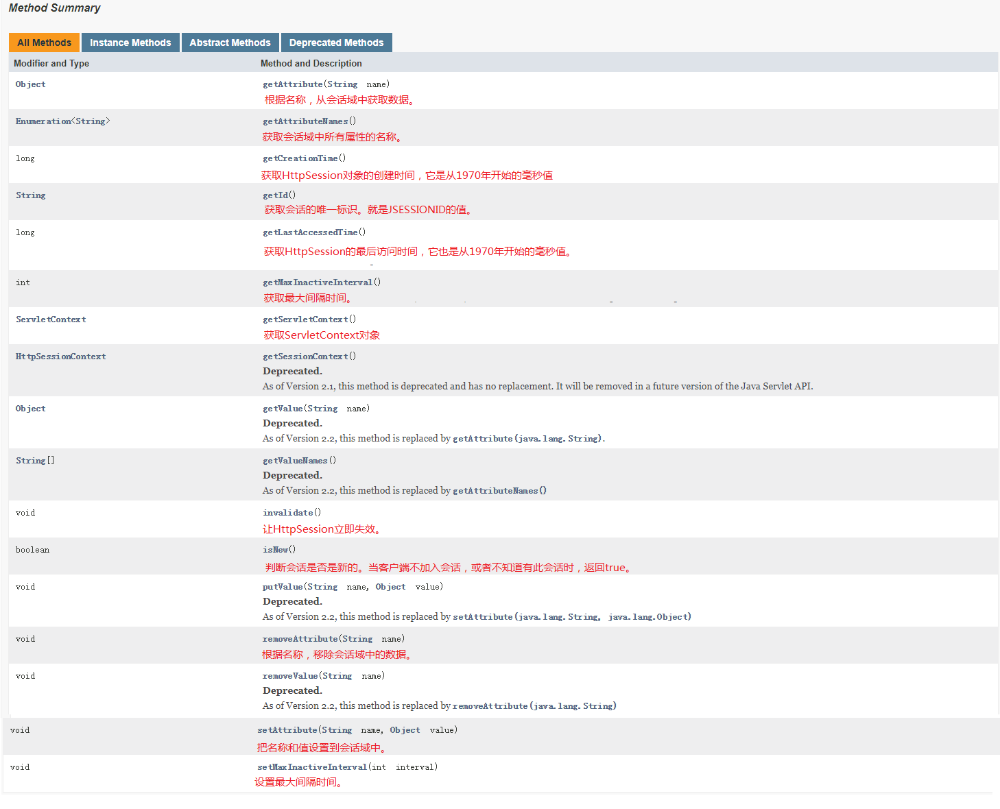
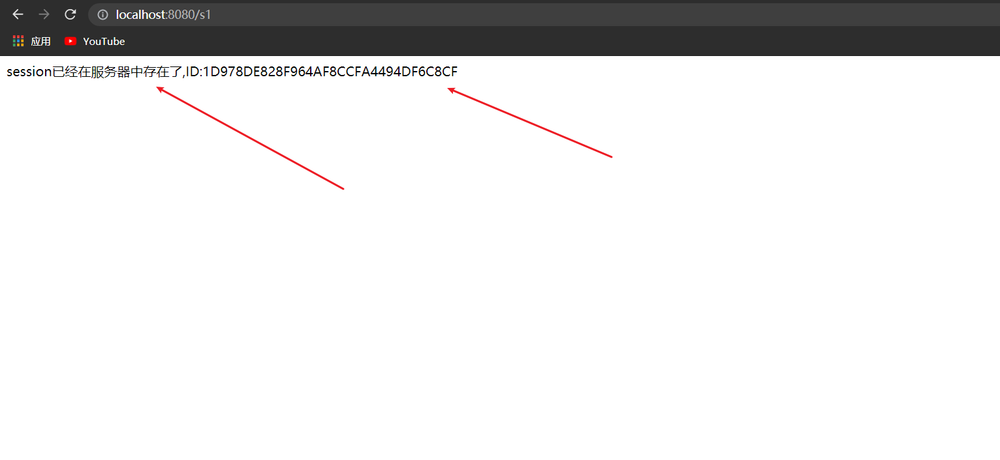
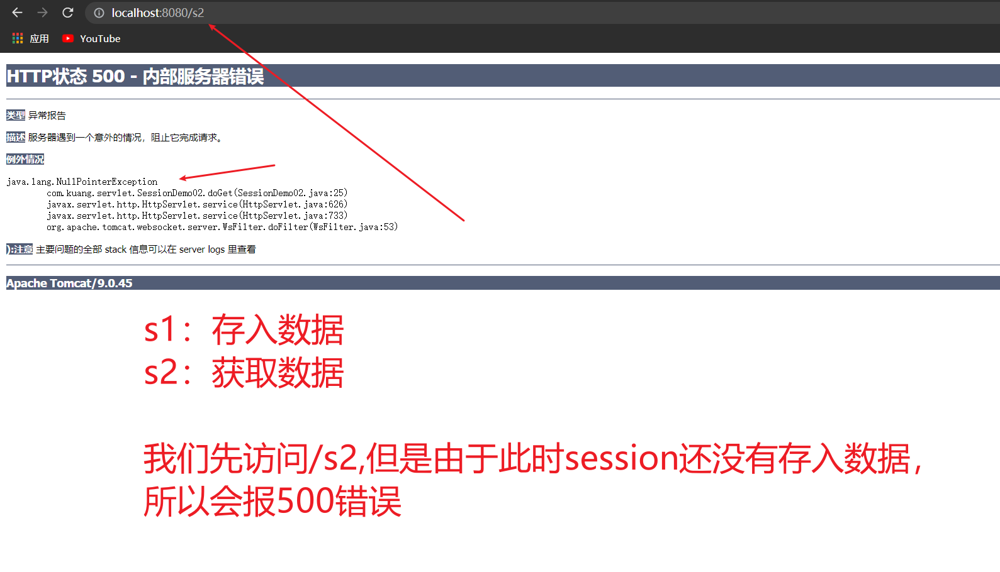
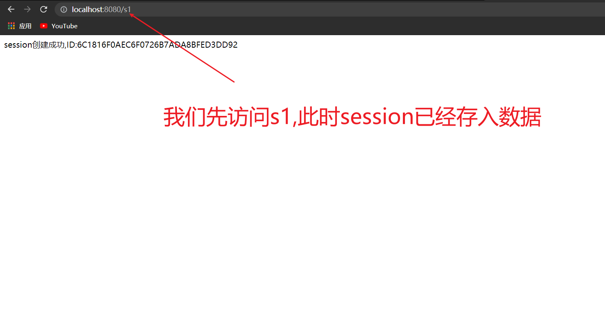
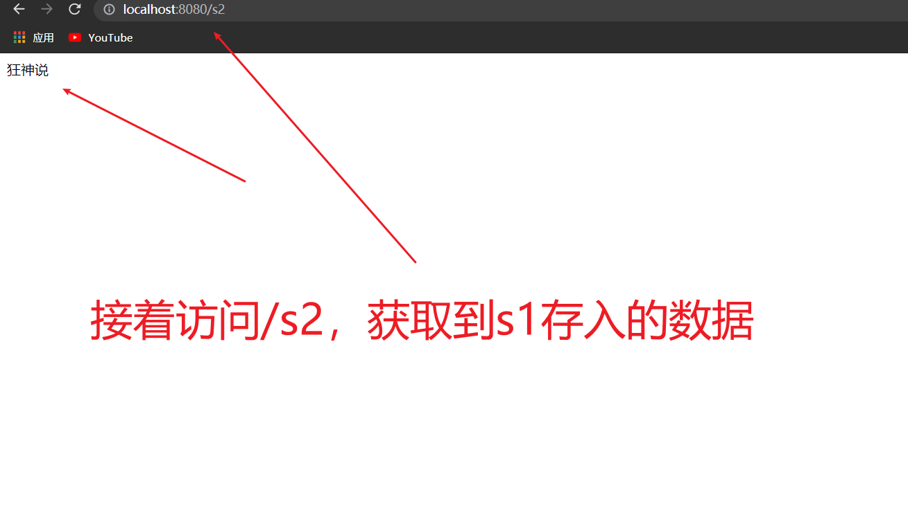
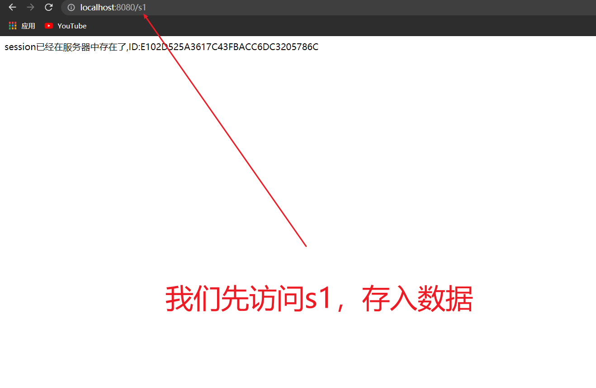
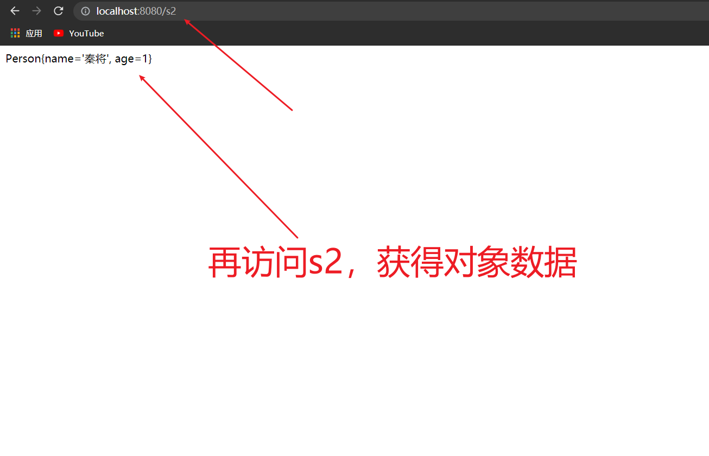

# 0、会话技术

1. 新建一个`mavenweb`工程
2. 在main目录下新建java、resources包
3. 更新web.xml
4. 在pom.xml中可以删除packaging标签下方所有

5. 在pom.xml中导入依赖
   - servlet-api
   - jsp-api

```xml
<dependencies>
<dependency>
  <groupId>javax.servlet</groupId>
  <artifactId>servlet-api</artifactId>
  <version>2.5</version>
</dependency>
<dependency>
  <groupId>javax.servlet.jsp</groupId>
  <artifactId>jsp-api</artifactId>
  <version>2.1</version>
</dependency>
</dependencies>
```

# 1、会话技术

## 1.1、什么是会话

这里的会话，指的是web开发中的一次通话过程，当打开浏览器，访问网站地址后，会话开始，当关闭浏览器（或者到了过期时间），会话结束。

举个例子：

​	例如，你在给家人打电话，这时突然有送快递的配送员敲门，你放下电话去开门，收完快递回来后，通话还在保持中，继续说话就行了。

## 1.2、会话管理作用

什么时候会用到会话管理呢？最常见的就是购物车，当我们登录成功后，把商品加入到购物车之中，此时我们无论再浏览什么商品，当点击购物车时，那些加入的商品都仍在购物车中。

在我们的实际开发中，还有很多地方都离不开会话管理技术。比如，我们在论坛发帖，没有登录的游客身份是不允许发帖的。所以当我们登录成功后，无论我们进入哪个版块发帖，只要权限允许的情况下，服务器都会认识我们，从而让我们发帖，因为登录成功的信息一直保留在服务器端的会话中。

通过上面的两个例子，我们可以看出，它是为我们共享数据用的，并且是在不同请求间实现数据共享。也就是说，如果我们需要在多次请求间实现数据共享，就可以考虑使用会话管理技术了。


## 1.3、会话管理分类

在JavaEE的项目中，会话管理分为两类。分别是：客户端会话管理技术和服务端会话管理技术。

**客户端会话管理技术**

​		它是把要共享的数据保存到了客户端（也就是浏览器端）。每次请求时，把会话信息带到服务器，从而实现多次请求的数据共享。

**服务端会话管理技术**

​		它本质仍是采用客户端会话管理技术，只不过保存到客户端的是一个特殊的标识，并且把要共享的数据保存到了服务端的内存对象中。每次请求时，把这个标识带到服务器端，然后使用这个标识，找到对应的内存空间，从而实现数据共享。


## 1.4、保存会话的两种技术

**cookie**

- 客户端技术   （响应，请求）

**session**

- 服务器技术，利用这个技术，可以保存用户的会话信息？ 我们可以把信息或者数据放在Session中！

常见场景：网站登录之后，你下次不用再登录了，第二次访问直接就上去了！

# 2、客户端会话管理

## 2.1、Cookie

- 概述：Cookie是客户端**浏览器**的缓存文件，里面记录了客户浏览器访问网站的一些内容。同时，也是HTTP协议请求和响应消息头的一部分。

- 作用：Cookie可以保存客户浏览器访问网站的相关内容（需要客户端不禁用Cookie）。从而在每次访问需要同一个内容时，先从本地缓存获取，使资源共享，提高效率。

## 2.2、Cookie的属性

| 属性名称 | 属性作用                 | 是否重要 |
| -------- | ------------------------ | -------- |
| name     | cookie的名称             | 必要属性 |
| value    | cookie的值（不能是中文） | 必要属性 |
| path     | cookie的路径             | 重要     |
| domain   | cookie的域名             | 重要     |
| maxAge   | cookie的生存时间。       | 重要     |
| version  | cookie的版本号。         | 不重要   |
| comment  | cookie的说明。           | 不重要   |


## 2.3、Cookie细节

Cookie有大小，个数限制。每个网站最多只能存20个cookie，且大小不能超过4kb。同时，所有网站的cookie总数不超过300个。

当删除Cookie时，设置maxAge值为0。当不设置maxAge时，使用的是浏览器的内存，当关闭浏览器之后，cookie将丢失。设置了此值，就会保存成缓存文件（值必须是大于0的,以秒为单位）。


## 2.4、Cookie常用API

### 2.4.1、cookie的创建和发送

使用步骤：

1. 创建Cookie对象

   - `new Cookie(String name,String value)`

2. 将 cookie 添加到 response 对象中

   - `resp.addCookie(cookie)`

   - 此时该 cookie对象则随着响应发送至了客户端，在浏览器上可以看见

```java
// 创建Cookie对象
Cookie cookie = new Cookie("uname","zhangsan");
// 发送Cookie对象
response.addCookie(cookie);
```


### 2.4.2、cookie的获取

​		在服务器端只提供了一个 `getCookies()` 的方法用来获取客户端回传的所有 cookie 组成的一个数组，如果需要获取单个 cookie ，则需要通过遍历，`getName()` 获取 Cookie 的名称，`getValue()` 获取Cookie 的值

- 获取cookie的名称：`cookie.getName()`
- 获取cookie的值：`cookie.getValue()`
- 获取cookie数组：`req.getCookies()`

```java
// 获取 Cookie 数组
Cookie[] cookies = request.getCookies();
// 判断数组是否为空
if(cookies != null && cookies.length >0){
    // 遍历Cookie数组:方式一
    for(Cookie cookie : cookies){
        System.out.println(cookie.getName());
        System.out.println(cookie.getValue());
    }
}
```

### 2.4.3、cookie设置到期时间

- 除了 Cookie 的名称和内容外，我们还需要关心一个信息，**到期时间**。
- 到期时间：到期时间用来指定该 cookie 何时失效，默认为当前浏览器关闭即失效
- 我们可以手动设定 cookie 的有效时间(通过到期时间计算)
- 通过 `setMaxAge(int time)` 方法设定 cookie 的最大有效时间，以秒为单位。

### 2.4.4、到期时间的取值

- ==负整数==

  **若为负数，表示不存储该 cookie**

  cookie 的 maxAge 属性的默认值就是 -1 ，表示只在浏览器内存中存活，一旦关闭浏览器窗口，那么 cookie 就会消失

- ==正整数==

  **若大于0的整数，表示存储的秒数**

  表示 cookie 对象可存货指定的秒数。当生命大于 0 时，浏览器会把 Cookie 保存到硬盘上，就算关闭浏览器，就算重启客户端电脑，cookie 也会存活相应的时间

- ==零==

  **若为0，表示删除该 cookie**

  也就是说，如果原来的浏览器已经保存了这个 Cookie，那么可以通过 Cookie 的 setMaxAge(0) 来删除这个Cookie

```java
Cookie cookie = new Cookie("uname","zhangsan");
cookie.setMaxAge(30);  //表示存活30s
resp.addCookie(cookie);
```


### 2.4.5、cookie编码

1. **Cookie保存在当前浏览器中**

   在一般的站点中常常有记住用户名这样一个操作，该操作只是将信息保存在本机上，换电脑以后这些信息就失效了，而且 cookie 还不能跨浏览器

2. **Cookie 存中文问题**

   Cookie 中不能出现中文，如果有中文通过`URLEncoder.encode() `来编码，获取时通过`URLDecoder.decode()` 来进行解码

```java
String name = "姓名";
String value = "张三";
// 通过 URLEncoder.encode() 来进行编码
name = URLEncoder.encode(name);
value = URLEncoder.encode(value);
// 创建 Cookie 对象
cookie cookie = new Cookie(name,value);
// 发送 Cookie 对象
resp.addCookie(cookie);


// 获取时通过URLDecoder.decode()来进行解码
URLDecoder.decode(cookie.getName());
URLDecoder.decode(cookie.getValue());
```

3. **同名Cookie问题**

   如果服务器端发送重复的Cookie，那么会覆盖原有的Cookie

4. **浏览器存放Cookie的数量**

   - 一个Cookie只能保存一个信息

   - 一个web站点可以给浏览器发送多个cookie，最多存放20个cookie

   - Cookie大小有限制4kb


# 3、服务器端会话管理

## 3.1、Httpsession

1. **什么是Httpsession？**
   - 服务器会给每一个用户(浏览器)创建一个Httpsession对象
   - 一个Seesion独占一个浏览器，只要浏览器没有关闭，这个Session就存在
   - 服务器端会话技术，在一次会话的多次请求间共享数据，将数据保存在服务器端的对象中


## 3.2、HttpSession常用API




## 3.3、Httpsession的获取

1. **获取HttpSession对象**
   - `req.getSession()` 获取Session对象
2. **使用HttpSession对象**
   - `session.setAttribute(String name,object)` 设置session域对象
   - `session.removeAttribute(String name)` 移除指定名称的session域对象

## 3.4、session域对象

​		Session 用来表示一次会话，在一次会话中数据是可以共享的，这时 session 作为域对象存在，可以通过`setAttribute(name,value)` 方法向域对象中添加数据，通过`getAttribute(name)`从域对象中获取数据，通过`removeAttribute(name)`从域对象中移除数据

- `session.getId()` 获取session的ID
- `session.isNew()` 判断是否是新的session对象

```java
//  得到Session
HttpSession session = req.getSession();
//	给Session中存东西 
session.setAttribute("name","狂神说");
//	获取Session的ID
String id = session.getId();
// 判断Session是不是新创建的
session.isNew();
```

- 数据存储在 session 域对象中，当session对象不存在了，或者是两个不同的session对象时，数据也就不能共享了。

## 3.5、例子

### 3.5.1、例一

1. **我们给session中存入一个字符串,并在另一个session中拿到数据**

> SessionDemo01.java

```java
public class SessionDemo01 extends HttpServlet {
    @Override
    protected void doGet(HttpServletRequest req, HttpServletResponse resp) throws ServletException, IOException {
        // 解决乱码问题
        req.setCharacterEncoding("utf-8");
        resp.setCharacterEncoding("utf-8");
        resp.setContentType("text/html;charset=UTF-8");
        // 得到Session
        HttpSession session = req.getSession();
        // 给Session中存东西
		session.setAttribute("name","狂神说");
        // 获取Session的ID
        String id = session.getId();
        // 判断Session是不是新创建的
        if(session.isNew()){
            resp.getWriter().write("session创建成功,ID:" + id);
        }else {
            resp.getWriter().write("session已经在服务器中存在了,ID:" + id);
        }
    }

    @Override
    protected void doPost(HttpServletRequest req, HttpServletResponse resp) throws ServletException, IOException {
        doGet(req, resp);
    }
}
```

- 在web.xml中注册servlet映射为 /s1

```xml
<servlet>
    <servlet-name>SessionDemo01</servlet-name>
    <servlet-class>com.kuang.servlet.SessionDemo01</servlet-class>
</servlet>
<servlet-mapping>
    <servlet-name>SessionDemo01</servlet-name>
    <url-pattern>/s1</url-pattern>
</servlet-mapping>
```

- 测试启动



当浏览器打开时，会自动创建一个session对象，此时session已经存在

2. **我们在另一个session对象中拿到第一个session中存入的数据**

> SessionDemo02.java

```java
public class SessionDemo02 extends HttpServlet {
    @Override
    protected void doGet(HttpServletRequest req, HttpServletResponse resp) throws ServletException, IOException {
        // 解决乱码问题
        req.setCharacterEncoding("utf-8");
        resp.setCharacterEncoding("utf-8");
        resp.setContentType("text/html;charset=UTF-8");
        // 得到Session
        HttpSession session = req.getSession();
        // 获取第一个session中存入的数据 name
	    String name = (String) session.getAttribute("name");

        resp.getWriter().write(name);
    }

    @Override
    protected void doPost(HttpServletRequest req, HttpServletResponse resp) throws ServletException, IOException {
        doGet(req, resp);
    }
}
```

- 在web.xml中注册servlet映射为 /s2

```xml
<servlet>
    <servlet-name>SessionDemo02</servlet-name>
    <servlet-class>com.kuang.servlet.SessionDemo02</servlet-class>
</servlet>
<servlet-mapping>
    <servlet-name>SessionDemo02</servlet-name>
    <url-pattern>/s2</url-pattern>
</servlet-mapping>
```

- 访问测试










### 3.5.2、例二

**我们给session中存入一个对象,并在另一个session中拿到数据**

1. 我们新建包 pojo
2. 在包 pojo 下新建 Person类

```java
public class Person {
    private String name;
    private int age;


    public Person() {
    }

    public Person(String name, int age) {
        this.name = name;
        this.age = age;
    }

    public String getName() {
        return name;
    }

    public void setName(String name) {
        this.name = name;
    }

    public int getAge() {
        return age;
    }

    public void setAge(int age) {
        this.age = age;
    }
    @Override
    public String toString() {
        return "Person{" +
                "name='" + name + '\'' +
                ", age=" + age +
                '}';
    }

}
```

> SessionDemo01.java

```java
public class SessionDemo01 extends HttpServlet {
    @Override
    protected void doGet(HttpServletRequest req, HttpServletResponse resp) throws ServletException, IOException {
        // 解决乱码问题
        req.setCharacterEncoding("utf-8");
        resp.setCharacterEncoding("utf-8");
        resp.setContentType("text/html;charset=UTF-8");
        // 得到Session
        HttpSession session = req.getSession();
        // 给Session中存东西 此时存入一个对象
		session.setAttribute("name",new Person("秦将",1));
        // 获取Session的ID
        String id = session.getId();
        // 判断Session是不是新创建的
        if(session.isNew()){
            resp.getWriter().write("session创建成功,ID:" + id);
        }else {
            resp.getWriter().write("session已经在服务器中存在了,ID:" + id);
        }
    }

    @Override
    protected void doPost(HttpServletRequest req, HttpServletResponse resp) throws ServletException, IOException {
        doGet(req, resp);
    }
}
```

> SessionDemo02.java

```java
public class SessionDemo02 extends HttpServlet {
    @Override
    protected void doGet(HttpServletRequest req, HttpServletResponse resp) throws ServletException, IOException {
        // 解决乱码问题
        req.setCharacterEncoding("utf-8");
        resp.setCharacterEncoding("utf-8");
        resp.setContentType("text/html;charset=UTF-8");
        // 得到Session
        HttpSession session = req.getSession();
        // 获取第一个session中存入的数据 
	    Person person = (Person) session.getAttribute("name");

        resp.getWriter().write(person.toString());
    }

    @Override
    protected void doPost(HttpServletRequest req, HttpServletResponse resp) throws ServletException, IOException {
        doGet(req, resp);
    }
}
```

- 访问测试








## 3.6、原理

==Session的实现是依赖于Cookie的。==

HttpSession，它虽然是服务端会话管理技术的对象，但它本质仍是一个Cookie。是一个由服务器自动创建的特殊的Cookie，Cookie的名称就是JSESSIONID，Cookie的值是服务器分配的一个唯一的标识。

当我们使用HttpSession时，浏览器在没有禁用Cookie的情况下，都会把这个Cookie带到服务器端，然后根据唯一标识去查找对应的HttpSession对象，找到了，我们就可以直接使用了。

## 3.7、session对象的销毁

### 3.7.1默认时间到期

- 当客户端第一次请求 servlet 并且操作 session 时，session 对象生成，Tomcat 中 session 默认的存活时间为 30min
- 那么 session 的默认时间可以改吗？答案是肯定的
- 可以在 Tomcat 中 conf 目录下的  web.xml 文件中进行修改

```xml
<!--session 默认的最大不活动时间。单位:分钟-->
<session-config>
    <session-timeout>30</session-timeout>
</session-config>
```


### 3.7.2自己设定到期时间

- `session.setMaxInactiveInterval(int)` :设定session存活时间(单位为秒)
- `session.getMaxInactiveInterval()`: 查看当前session存活时间

```java
// 获取session对象
HttpSession session = request.getSession();
// 设置session的最大不活动时间
session.setMaxInactiveInterval(15); // 15秒
```


## 3.8、钝化和活化

HttpSession的钝化和活化

**什么是持久态**

​		把长时间不用，但还不到过期时间的HttpSession进行序列化，写到磁盘上。

​		我们把HttpSession持久态也叫做钝化。（与钝化相反的，我们叫活化。）

**什么时候使用持久化**

​		第一种情况：当访问量很大时，服务器会根据getLastAccessTime来进行排序，对长时间不用，但是还没到过期时间的HttpSession进行持久化。

​		第二种情况：当服务器进行重启的时候，为了保持客户HttpSession中的数据，也要对HttpSession进行持久化

**注意**

​		HttpSession的持久化由服务器来负责管理，我们不用关心。

​		只有实现了序列化接口的类才能被序列化，否则不行。


