# 1、JSP

1. **什么是JSP？**
   - Java Server Pages ： Java服务器端页面，也和Servlet一样，用于动态Web技术！JSP的本质其实就是一个Servlet。
   - 可以理解为：一个特殊的页面，其中既可以指定定义html标签，又可以定义java代码
2. **JSP与HTML的区别**
   + HTML只给用户提供静态的数据
   + JSP页面中可以嵌入JAVA代码，为用户提供动态数据

3. **JSP与Servlet的区别**
   - servlet 很难对数据进行排版
   - JSP容易对数据进行排版

| 类别    | 适用场景                                                     |
| ------- | ------------------------------------------------------------ |
| HTML    | 只能开发静态资源，不能包含java代码，无法添加动态数据。       |
| Servlet | 写java代码，可以输出页面内容，但是很不方便，开发效率极低。   |
| JSP     | 它包括了HTML的展示技术，同时具备Servlet输出动态资源的能力。但是不适合作为控制器来用。 |

## 1.1、JSP原理

- JSP本质上就是一个Servlet
- 当我们第一次访问Jsp的时候，Jsp 引擎都会将这个Jsp翻译成一个Servlet,这个文件存放在tomcat (源码目录)中的work目录中。

- 在JSP页面中，只要是 JAVA代码就会原封不动的输出，如果是HTML代码，就会被转换为

  ```java
  out.write("<html>\r\n");
  ```

  这样的格式，输出到前端！

### 1.1.1、JSP执行过程分析图

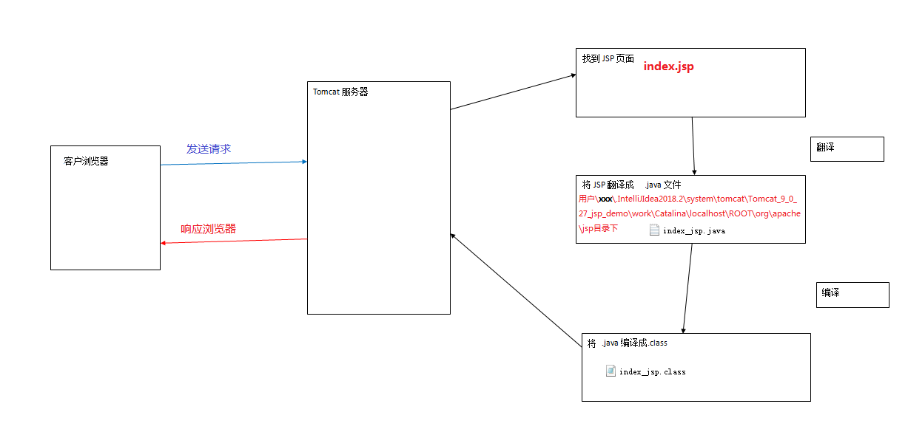

JSP的原理：

​           客户端提交请求

​				——Tomcat服务器解析请求地址

​						——找到JSP页面

​								——Tomcat将JSP页面翻译成Servlet的java文件

​										——将翻译好的.java文件编译成.class文件

​												——返回到客户浏览器上。


## 1.2、JSP的脚本

- JSP的脚本就是JSP定义Java代码的方式
-  JSP 作为java技术的一种应用，它拥有一些自己扩充的语法，但是Java所有语法都支持！

### 1.2.1、java脚本段

1. **第一种：java脚本段，可以定义局部变量、编写语句**
   - 格式：`<% %>`

```java
<%-- jsp脚本片段 --%>
<%
int sum = 0;
for (int i = 1; i <=100 ; i++) {
  sum+=i;
}
out.println("<h1>Sum="+sum+"</h1>");
%>
```

### 1.2.2、jsp声明

2. **第二种：jsp声明，可以定义全局变量、方法、类**
   - 格式：`<%! %>`

```java
<%!
static {
  System.out.println("Loading Servlet!");
}

private int Var = 0;

public void kuang(){
  System.out.println("进入了方法Kuang！");
}
%>
```

### 1.2.3、jsp表达式

3. 第三种：jsp表达式，用来将程序的输出，输出到客户端(浏览器)
   - 格式：`<%= 变量或者表达式 %>`

```java
<%= new java.util.Date()%>
```

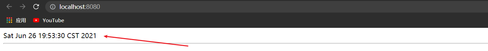


## 1.3、JSP指令

使用包含操作，可以将一些重复的代码包含进来继续使用，从正常的页面组成来看，有时可能分为几个区域。而其中的一些区域可能是一直不需要改变的， 改变的就其中的一个具体内容区域。现在有两种方法可以实现上述功能。

- 方法一:在每个JSP页面(HTML)都包含工具栏、头部信息、尾部信息、具体内容
- 方法二:将工具栏、头部信息、尾部信息都分成各个独立的文件,使用的时候直接导入

- 很明显，第二种方法比第一种更好，第一种会存在很多重复的代码，并且修改很不方便
- 在JSP中如果要想实现包含的操作，有两种做法:**静态包含、动态包含**，静态包含使用**include指令**即可，动态包含则需要使用**include动作标签**。

### 1.3.1、include静态包含

格式：

```jsp
<%@ include file="要包含的文件路径"%>
```

- 静态包含就是将内容进行了直接的替换,就好比程序中定义的变量一样，是在 servlet 引擎转译时，就把此文件内容包含了进去,所以只生成了一个 servlet，**所以两个页面不能有同名的变量**。

```jsp
<%--@include会将两个页面合二为一--%>
<%@include file="common/header.jsp"%>
<h1>网页主体</h1>
<%@include file="common/footer.jsp"%>
```

在使用include动态包含的时候我们可以传递参数,例如：

> jsptag.jsp

我们在此jsp中放入参数，这样我们访问：`http://localhost:8080/jsptag.jsp` 就相当于`http://localhost:8080/jsptag.jsp?name=kuangshen&age=12`

```jsp
<%@ page contentType="text/html;charset=UTF-8" language="java" %>
<html>
<head>
    <title>Title</title>
</head>
<body>
<h1>1</h1>
<%-- http://localhost:8080/jsptag.jsp?name=kuangshen&age=12 --%>
<jsp:forward page="/jsptag2.jsp">
    <jsp:param name="name" value="kuangshen"/>
    <jsp:param name="age" value="12"/>
</jsp:forward>>

</body>
</html>
```

> jsptag2.jsp

我们在另一个页面获取参数

```jsp
<%@ page contentType="text/html;charset=UTF-8" language="java" %>
<html>
<head>
    <title>Title</title>
</head>
<body>
<h1>2</h1>
<%--取出参数--%>

名字:<%=request.getParameter("name")%>
年龄:<%=request.getParameter("age")%>


</body>
</html>
```

- 访问测试

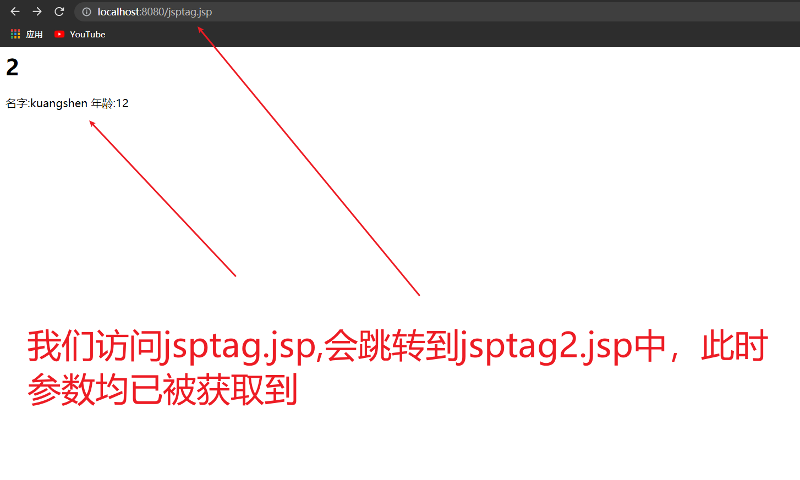


### 1.3.2、include动态包含

格式：

```jsp
<jsp:include page="要包含的文件路径" />
```

动态包含在代码的编译阶段，包含和被包含部分是两个独立的部分，只有当运行时，才会动态包含进来，好比方法的调用。

```jsp
<%--jsp:include：拼接页面，本质还是三个--%>
<jsp:include page="/common/header.jsp" />
<h1>网页主体</h1>
<jsp:include page="/common/footer.jsp" />
```


## 1.4、JSP注释

在JSP中支持两种注释的语法操作

- 一种是显示注释，这种注释是允许客户端(浏览器)看见的；
  - 显示注释语法：从HTML风格继承而来
- 另一种是隐式注释，此种注释是客户端无法看见的
  - 隐式注释语法：从JAVA风格继承，JSP自己的注释

```jsp
1. html注释：
		<!-- -->:只能注释html代码片段
2. jsp注释：推荐使用
		<%-- --%>:可以注释所有
```


## 1.5、定制错误页面

我们可以自己定制错误页面，并在web.xml中进行配置，例如

> jsp2.jsp

```jsp
<%@ page contentType="text/html;charset=UTF-8" language="java" %>
<html>
<head>
    <title>Title</title>
</head>
<body>
<%
  <%-- 手动制造错误 --%>  
  int x = 1/0;
%>
</body>
</html>
```

- 测试启动


- 此时弹出500的错误页面，我们可以自己写错误页面，让其发生错误时跳转到一个更美观的错误页面
- 我们新建一个error包,新建500.jsp

> 500.jsp

```jsp
<%@ page contentType="text/html;charset=UTF-8" language="java" %>
<html>
<head>
    <title>自定义500错误的界面</title>
</head>
<body>
<h1>自定义500错误的界面</h1>

</body>
</html>
```

- 我们在web.xml中进行错误页面的配置

```xml
<error-page>
    <error-code>500</error-code>
    <location>/error/500.jsp</location>
</error-page>
```

- 访问测试


- 此时发生错误就会跳转到我们自己写的500.jsp页面了


## 1.6、定制404页面

- 同理，我们也可以自己定制404页面，只需要在web.xml中再次配置404页面路径即可

> 404.jsp

```jsp
<%@ page contentType="text/html;charset=UTF-8" language="java" %>
<html>
<head>
    <title>404</title>
</head>
<body>
    
</body>
</html>
```

- web.xml中配置

```xml
<error-page>
    <error-code>404</error-code>
    <location>/error/404.jsp</location>
</error-page>
```

- 测试访问

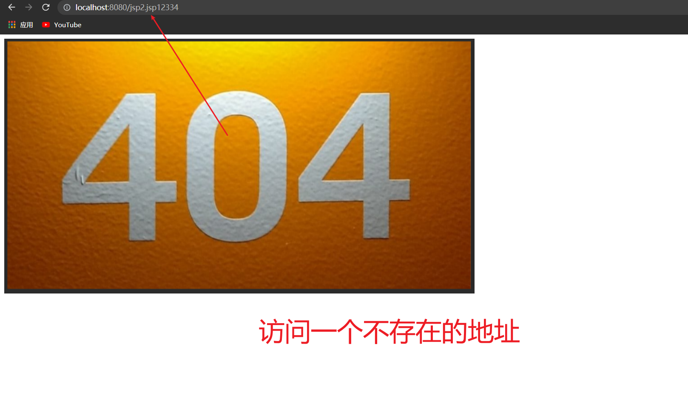


## 1.7、九大内置对象

内置对象：在jsp页面中不需要创建，直接使用的对象(由jsp自动创建的对象，可以直接使用)

| 变量名      | 真实类型                       | 作用                                         |
| ----------- | ------------------------------ | -------------------------------------------- |
| pageContext | PageContext(**存东西**)        | 当前页面共享数据，还可以获取其他八个内置对象 |
| request     | HttpServletRequest(**存东西**) | 一次请求访问的多个资源(转发)                 |
| session     | HttpSession(**存东西**)        | 一次会话的多个请求间                         |
| application | ServletContext(**存东西**)     | 所有用户间共享数据                           |
| response    | HttpServletResponse            | 响应对象                                     |
| page        | Object                         | 当前页面(Servlet)的对象  this                |
| out         | JspWriter                      | 输出对象，数据输出到页面上                   |
| config      | ServletConfig                  | Servlet的配置对象                            |
| exception   | Throwable                      | 异常对象                                     |

## 1.8、PageContext对象

- **简介**

它是JSP独有的对象，Servlet中没有这个对象。本身也是一个域（作用范围）对象，但是它可以操作其他3个域对象中的属性。而且还可以获取其他8个隐式对象。

PageContext 用来代表整个 JSP 页面，是当前页面的作用域对象，一旦跳转则失效

- **生命周期**

它是一个局部变量，所以它的生命周期随着JSP的创建而诞生，随着JSP的结束而消失。每个JSP页面都有一个独立的PageContext。

- **PageContext对象操作其他作用域存储和获取**

通过`pageContext.setAttribute("name",value)` 存储值

通过`pageContext.getAttribute("name")` 获取值

- **PageContext获取其他内置对象**

```java
pageContext.getRequest();	//返回request内置对象
pageContext.getResponse();	//返回response内置对象
pageContext.getServletConfig();	//返回config内置对象
pageContext.getException();	//返回exception内置对象
pageContext.getPage();	//返回page内置对象
pageContext.getOut();	//返回out内置对象
pageContext.getServletContext();	//返回application内置对象
pageContext.getSession();	//返回session内置对象
```


---

需求：我们在 pageContextDemo01.jsp 存入四个数据，我们去其他jsp页面去取

> pageContextDemo01.jsp

```jsp
<%@ page contentType="text/html;charset=UTF-8" language="java" %>
<html>
<head>
    <title>Title</title>
</head>
<body>
<%--内置对象--%>
<%
    pageContext.setAttribute("name1","1号"); 
    request.setAttribute("name2","2号");     
    session.setAttribute("name3","3号");    
    application.setAttribute("name4","4号");
%>
```


> pageDemo02.jsp

```jsp
<%@ page contentType="text/html;charset=UTF-8" language="java" %>
<html>
<head>
    <title>Title</title>
</head>
<body>
<%
  // 从pageContext取出,通过寻找的方式来
  // 从底层到高层(作用域):page->request->session->application
  String name1 = (String) pageContext.findAttribute("name1");
  String name2 = (String) pageContext.findAttribute("name2");
  String name3 = (String) pageContext.findAttribute("name3");
  String name4 = (String) pageContext.findAttribute("name4");
  String name5 = (String) pageContext.findAttribute("name5");

%>
<%--使用EL表达式输出 ${} --%>
<h1>取出的值为:</h1>
<h3>${name1}</h3>
<h3>${name2}</h3>
<h3>${name3}</h3>
<h3>${name4}</h3>
<%--使用jsp表达式输出--%>    
<h3><%=name5%></h3>
<%--使用EL表达式输出--%>
<h3>${name5}</h3>
</body>
</html>
```

- 注意此时的**name5**数据不存在，但是我们用`jsp表达式`和`EL表达式`分别去取，会发生什么呢？
- 我们先访问`/pageContextDemo01.jsp`去存入数据，再访问`/pageDemo02.jsp`去取数据

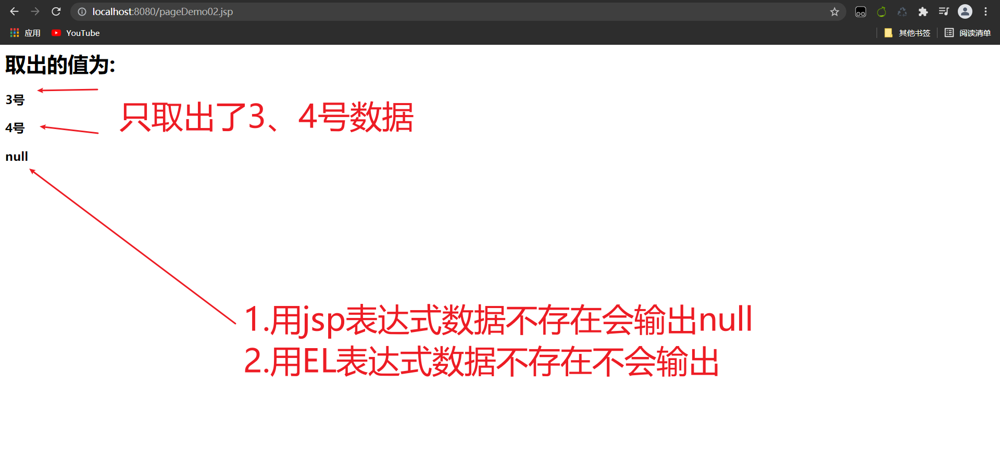


- 只取到了3、4号数据，那么这就是域对象的问题了

| 对象                     | 作用域                                                 |
| ------------------------ | ------------------------------------------------------ |
| pageContext.setAttribute | 保存的数据只在一个页面中有效                           |
| request.setAttribute     | 保存的数据只在一次请求中有效，请求转发会携带这个数据   |
| session.setAttribute     | 保存的数据只在一次会话中有效，从打开浏览器到关闭浏览器 |
| application.setAttribute | 保存的数据只在服务器中有效，从打开服务器到关闭服务器   |

```java
pageContext.setAttribute("name1","1号"); //保存的数据只在一个页面中有效
request.setAttribute("name2","2号");     //保存的数据只在一次请求中有效，请求转发会携带这个数据
session.setAttribute("name3","3号");     //保存的数据只在一次会话中有效，从打开浏览器到关闭浏览器
application.setAttribute("name4","4号"); // 保存的数据只在服务器中有效，从打开服务器到关闭服务器
```

- 所以一般这几个对象都会有如下使用场景
  - `request`：客户端向服务器发送请求，产生的数据，用户看完就没用了，比如：新闻，用户看完没用的！
  - `session`：客户端向服务器发送请求，产生的数据，用户用完一会还有用，比如：购物车；
  - `application`：客户端向服务器发送请求，产生的数据，一个用户用完了，其他用户还可能使用，比如：聊天数据；

## 1.9、四大域对象

| 域对象名称     | 范围     | 级别                     | 备注                                     |
| -------------- | -------- | ------------------------ | ---------------------------------------- |
| PageContext    | 页面范围 | 最小，只能在当前页面用   | 因范围太小，开发中用的很少               |
| ServletRequest | 请求范围 | 一次请求或当期请求转发用 | 当请求转发之后，再次转发时请求域丢失     |
| HttpSession    | 会话范围 | 多次请求数据共享时使用   | 多次请求共享数据，但不同的客户端不能共享 |
| ServletContext | 应用范围 | 最大，整个应用都可以使用 | 尽量少用，如果对数据有修改需要做同步处理 |

# 2、JavaBean

JavaBean就是实体类。是特殊的 Java 类，使用 Java 语言书写，并且遵守 JavaBean API 规范。

JavaBean有特定的写法：

- 必须要有一个无参构造
- 属性必须私有化
- 必须有对应的get/set方法

JavaBean一般用来和数据库的字段做映射

- 数据库中的表对应java中的类
- 表中的字段对应java类中的属性
- 表中的行记录对应java创建的对象

例如：这是数据库的一张**people表**

| id   | name    | age  | address |
| ---- | ------- | ---- | ------- |
| 1    | 秦疆1号 | 3    | 西安    |
| 2    | 秦疆2号 | 18   | 西安    |
| 3    | 秦疆3号 | 100  | 西安    |

```java
class People{
    private int id;
    private String name;
    private int id;
    private String address;
}

class A{
    new People(1,"秦疆1号",3，"西安");
    new People(2,"秦疆2号",3，"西安");
    new People(3,"秦疆3号",3，"西安");
}
```


## 2.1、实体类的包名

对于JavaBean实体类的包名，我们有以下建立的方式：

1. com.XXX.pojo
2. com.XXX.entity
3. com.XXX.dto
4. com.XXX.vo


## 2.2、实体类

JavaBean实体类一般用来和数据库的字段做映射，例如，我们创建一个People类

```java
public class People {
    private int id;
    private int age;
    private String address;
    // 无参构造
    public People() {
    }
    // 有参构造
    public People(int id, int age, String address) {
        this.id = id;
        this.age = age;
        this.address = address;
    }
    // get/set方法
    public int getId() {
        return id;
    }

    public void setId(int id) {
        this.id = id;
    }

    public int getAge() {
        return age;
    }

    public void setAge(int age) {
        this.age = age;
    }

    public String getAddress() {
        return address;
    }

    public void setAddress(String address) {
        this.address = address;
    }
    // 重写 toString 方法
    @Override
    public String toString() {
        return "People{" +
                "id=" + id +
                ", age=" + age +
                ", address='" + address + '\'' +
                '}';
    }
}
```

- 如果我们只是单纯的创建一个类，那么这只能称之为一个People类，不能称为实体类。那如何才能称为实体类呢？

- 我们需要在数据库中建立对应的People表
- 实体类一般都是和数据库中的表结构一一对应

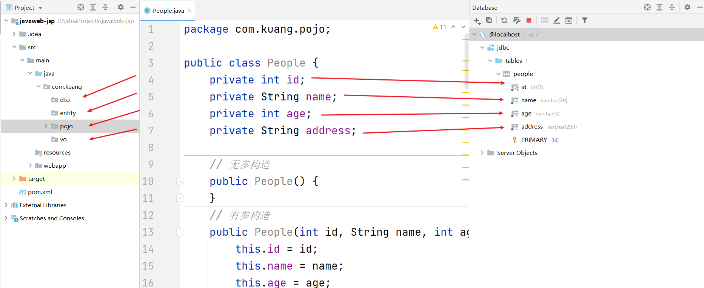


> javabean.jsp

```jsp
<%@ page contentType="text/html;charset=UTF-8" language="java" %>
<html>
<head>
    <title>Title</title>
</head>
<body>
<%
//  People people = new People();

//  people.setId();
//  people.setName();
//  people.setAge();
//  people.setAddress();

//  people.getId();
//  people.getName();
//  people.getAge();
//  people.getAddress();
%>

<jsp:useBean id="people" class="com.kuang.pojo.People" scope="page" />

<jsp:setProperty name="people" property="id" value="1" />
<jsp:setProperty name="people" property="name" value="李沁" />
<jsp:setProperty name="people" property="age" value="3" />
<jsp:setProperty name="people" property="address" value="西安" />

id<jsp:getProperty name="people" property="id"/>
姓名<jsp:getProperty name="people" property="name"/>
年龄<jsp:getProperty name="people" property="age"/>
地址<jsp:getProperty name="people" property="address"/>

</body>
</html>
```

这段代码的意思就是注释的代码的意思

- `jsp:userBean` 相当于`new People`
- `jsp:setProperty` 相当于 `people.setXXX`
- `jsp:getProperty` 相当于 `people.getXXX`

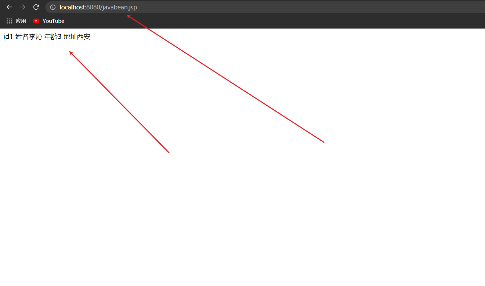


# 3、MVC三层架构

1. **什么是MVC?**

   Model、View、Controller 

   模型、视图、控制器

   模型：JavaBean实体类和数据库表中对应的字段

   视图：jsp页面

   控制器：servlet，负责跳转页面

**Model**：

- 业务处理：完成具体的业务操作（Service）
- 数据持久层：数据库的增删改查（Dao）

**View**：

- 展示页面。动态展示用jsp页面，静态数据展示用html。
- 提供链接发起Servlet请求

**Controller**：（Servlet）

- 接受用户的请求 ，拿到用户的请求参数
- 交给业务层处理对应的代码
- 控制视图的跳转

流程如下：

登录--->接收用户的登录请求--->处理用户的请求（获取用户登录的参数，username，password）---->交给业务层处理登录业务（判断用户名密码是否正确）--->Dao层查询用户名和密码是否正确-->数据库

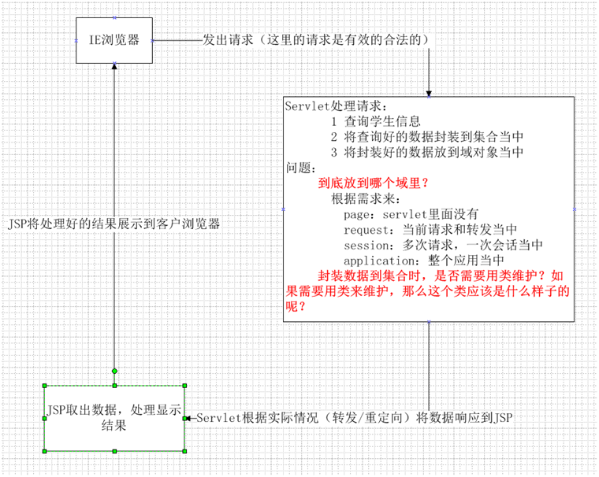


# 4、EL表达式

- 概念：Expression Language 表达式语言

- 作用：替换和简化jsp页面中java代码的编写

- 语法：`${表达式}`
- 使用之前要进行配置依赖

```xml
<!-- JSTL表达式的依赖 -->
<dependency>
    <groupId>javax.servlet.jsp.jstl</groupId>
    <artifactId>jstl-api</artifactId>
    <version>1.2</version>
</dependency>
<!-- standard标签库 -->
<dependency>
    <groupId>taglibs</groupId>
    <artifactId>standard</artifactId>
    <version>1.1.2</version>
</dependency>
```

## 4.1、基本语法

EL表达式的语法格式非常简单，写为 <b><font color='red' size='5'>${表达式内容}</font></b>

EL表达式就是把内容输出到页面上

例如：在浏览器中输出请求域中名称为message的内容。

假定，我们在请求域中存入了一个名称为message的数据（`request.setAttribute("message","EL");`），此时在jsp中获取的方式，如下表显示：

| Java代码块                                                   | JSP表达式                            | EL表达式                              |
| :----------------------------------------------------------- | :----------------------------------- | :------------------------------------ |
| <% String message = (String)request.getAttribute("message"); out.write(message);%> | <%=request.getAttribute("message")%> | <font color='red'>`${message}`</font> |

通过上面我们可以看出，都可以从请求域中获取数据，但是EL表达式写起来是最简单的方式。这也是以后我们在实际开发中，当使用JSP作为视图时，绝大多数都会采用的方式。

在 JSP 页面中编写代码

```jsp
<%@ page contentType="text/html;charset=UTF-8" language="java" %>
<html>
  <head>
    <title>EL表达式入门案例</title>
  </head>
  <body>
    <%--使用java代码在请求域中存入一个名称为message的数据--%>
    <% request.setAttribute("message","Expression Language");%>

    Java代码块获取：<% out.print(request.getAttribute("message"));%>
    <br/>
    JSP表达式获取：<%=request.getAttribute("message")%>
    <br/>
    EL表达式获取：${message}
  </body>
</html>
```

## 4.2、获取四大域中的数据

EL表达式的作用，它就是用于获取数据的，它只能从四大域中获取数据，调用的就是`findAttribute(name,value);`方法，根据名称由小到大逐个域中查找，找到就返回，找不到就什么都不显示。

## 4.3、EL表达式的注意事项

在使用EL表达式时，它帮我们做了一些处理，使我们在使用时可以避免一些错误。它没有空指针异常，没有数组下标越界，没有字符串拼接。

```jsp
<%@ page contentType="text/html;charset=UTF-8" language="java" %>
<html>
  <head>
    <title>EL表达式的注意事项</title>
  </head>
  <body>
    <%--EL表达式的三个没有--%>
    第一个：没有空指针异常<br/>
    <% String str = null;
       request.setAttribute("testNull",str);
    %>
    ${testNull}
    <hr/>
    第二个：没有数组下标越界<br/>
    <% String[] strs = new String[]{"a","b","c"};
       request.setAttribute("strs",strs);
    %>
    取第一个元素：${strs[0]}
    取第六个元素：${strs[5]}
    <hr/>
    第三个：没有字符串拼接<br/>
    <%--${strs[0]+strs[1]}--%>
    ${strs[0]}+${strs[1]}
  </body>
</html>
```


## 4.4、EL表达式的运算符

EL表达式中运算符如下图所示，它们都是一目了然的：


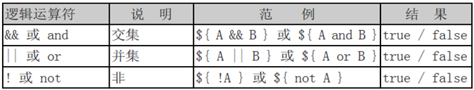

但是有两个特殊的运算符，使用方式的代码如下

### 4.4.1、empty

empty运算符：判断对象是否为null，字符串是否为空字符串，集合中元素是否是0个。若为空或者 null，返回空字符串、空数组，否则返回 false。

### 4.4.2、三元运算符

`条件？真:假`

```jsp
<%@ page language="java" import="java.util.*" pageEncoding="UTF-8"%>
<%@ page import="com.itheima.domain.User" %>
<!DOCTYPE HTML PUBLIC "-//W3C//DTD HTML 4.01 Transitional//EN">
<html>
	<head>
		<title>EL两个特殊的运算符</title>
	</head>
	<body>
		<%--empty运算符：
			它会判断：对象是否为null，字符串是否为空字符串，集合中元素是否是0个
		--%>
		<% String str = null;
		  String str1 = "";
		  List<String> slist = new ArrayList<String>();
		  pageContext.setAttribute("str", str);
		  pageContext.setAttribute("str1", str1);
		  pageContext.setAttribute("slist", slist);
		%>
		${empty str}============当对象为null返回true<br/>
		${empty str1 }==========当字符串为空字符串是返回true(注意：它不会调用trim()方法)<br>
		${empty slist}==========当集合中的元素是0个时，是true
		<hr/>
		<%--三元运算符 
			 条件?真:假
		--%>
		<% request.setAttribute("gender", "female"); %>
		<input type="radio" name="gender" value="male" ${gender eq "male"?"checked":""} >男
		<input type="radio" name="gender" value="female" ${gender eq "female"?"checked":""}>女
	</body>
</html>
```


# 5、JSTL表达式

JSTL标签库的使用就是为了弥补HTML标签的不足，它自定义许多标签，可以供我们使用，标签的功能和java代码是一样的，我们只需看核心标签库里面的几个常用标签即可！

## 5.1、使用要求

要想使用JSTL标签库，在javaweb工程中需要导入坐标。

```xml
<!-- https://mvnrepository.com/artifact/javax.servlet/jstl -->
<dependency>
    <groupId>javax.servlet</groupId>
    <artifactId>jstl</artifactId>
    <version>1.1.2</version>
</dependency>
<!-- https://mvnrepository.com/artifact/taglibs/standard -->
<dependency>
    <groupId>taglibs</groupId>
    <artifactId>standard</artifactId>
    <version>1.1.2</version>
</dependency>

```

## 5.2、核心标签库

我们经常可能用到的标签列在此处

| 标签名称                             | 功能分类 | 分类       | 作用             |
| ------------------------------------ | -------- | ---------- | ---------------- |
| `<c:if>`                             | 流程控制 | 核心标签库 | 用于判断         |
| `<c:choose> ,<c:when>,<c:otherwise>` | 流程控制 | 核心标签库 | 用于多个条件判断 |
| `<c:foreache>`                       | 迭代操作 | 核心标签库 | 用于循环遍历     |


## 5.3、JSTL使用

### 5.3.1、if

- **if：相当于java代码的if语句**

属性：

- test 为必须属性，接受boolean表达式
- 如果表达式为true，则显示if标签体内容，如果为false，则不显示标签体内容
- 一般情况下，test属性值会结合el表达式一起使用

**注意**：

- c:if标签没有else情况，想要else情况，则可以在定义一个c:if标签


### 5.3.2、c:out

用于在JSP中显示数据，就像`<%= >`

> coreis.jsp

```jsp
<%@ page contentType="text/html;charset=UTF-8" language="java" %>
<%--引入JSTL核心标签库，这样我们才能使用JSTL标签--%>
<%@taglib prefix="c" uri="http://java.sun.com/jsp/jstl/core" %>
<html>
<head>
    <title>Title</title>
</head>
<body>
<h4>if测试</h4>
<hr>
<form action="coreif.jsp" method="get">
<%--
    EL表达式获取表单中的数据
    ${param.参数名}
--%>
    <input type="text" name="username" value="${param.username}">
    <input type="submit" value="登录">
</form>
    
    
<%--提交到本页面,我们进行获取判断如果提交的用户名是管理员，则登录成功--%>
<c:if test="${param.username=='admin'}" var="isAdmin">
    <c:out value="管理员欢迎你！" />
</c:if>
<c:out value="${isAdmin}" />

</body>
</html>
```

1. form表单提交到本页面
2. 如果表单中输入的值为`admin`，则返回true，并将true赋给`isAdmin`，如果表单中输入的值不是`admin`，则返回false，并将false赋给`isAdmin`
3. 如果表单中输入的值为`admin`，则在网页中打印：`管理员欢迎你！`
4. 否则在网页中打印`isAdmin`的值，也就是`false`

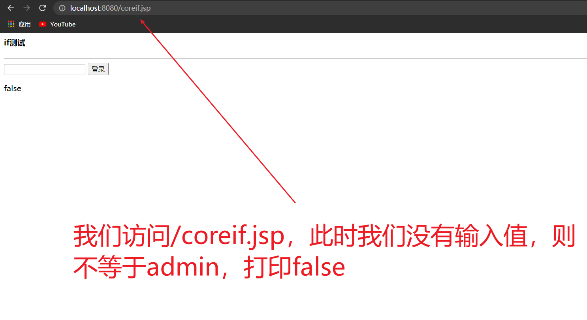


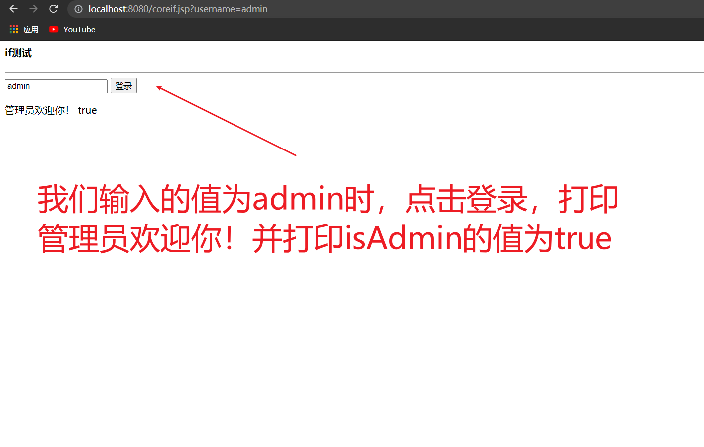


### 5.3.3、c:choose

- **choose:相当于java代码的switch语句**
  - 使用choose标签声明         			相当于switch声明
  - 使用when标签做判断         			相当于case
  - 使用otherwise标签做其他情况的声明    	相当于default

### 5.3.4、c:set

用于保存数据

```jsp
<%@ page contentType="text/html;charset=UTF-8" language="java" %>
<%@taglib prefix="c" uri="http://java.sun.com/jsp/jstl/core" %>
<html>
<head>
    <title>Title</title>
</head>
<body>
<%--定义一个变量score,值为85--%>
<c:set var="score" value="85" />
<c:choose>
    <c:when test="${score>=90}">
        你的成绩为优秀
    </c:when>
    <c:when test="${score>=80}">
        你的成绩为一般
    </c:when>
    <c:when test="${score>=70}">
        你的成绩为良好
    </c:when>
    <c:when test="${score>=60}">
        你的成绩为不好
    </c:when>
</c:choose>
</body>
</html>
```

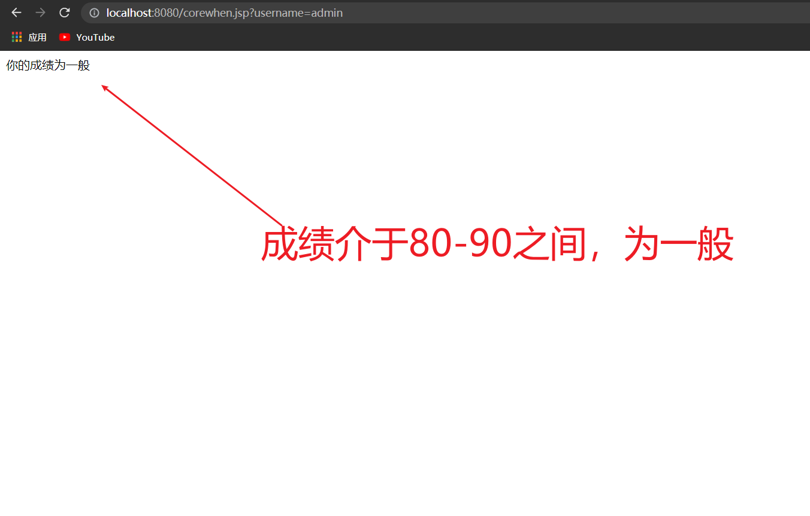

### 5.3.5、foreach

* **foreach:相当于java代码的for语句**

> coreforeach.jsp

```jsp
<html>
<head>
    <title>Title</title>
</head>
<body>
<%
  ArrayList<String> people = new ArrayList<>();
  people.add(0,"张三");
  people.add(1,"李四");
  people.add(2,"王五");
  people.add(3,"赵六");
  people.add(4,"田六");
  request.setAttribute("list",people);

%>
<%--
var ,每一次遍历出来的变量
items,要遍历的对象
begin 哪里开始
end 哪里结束
step 步长
--%>
<c:forEach var="people" items="${list}">
  <c:out value="${people}" /> <br>
</c:forEach>
<hr>

<c:forEach var="people" items="${list}" begin="1" end="3" step="1">
  <c:out value="${people}" />
</c:forEach>
</body>
</html>
```

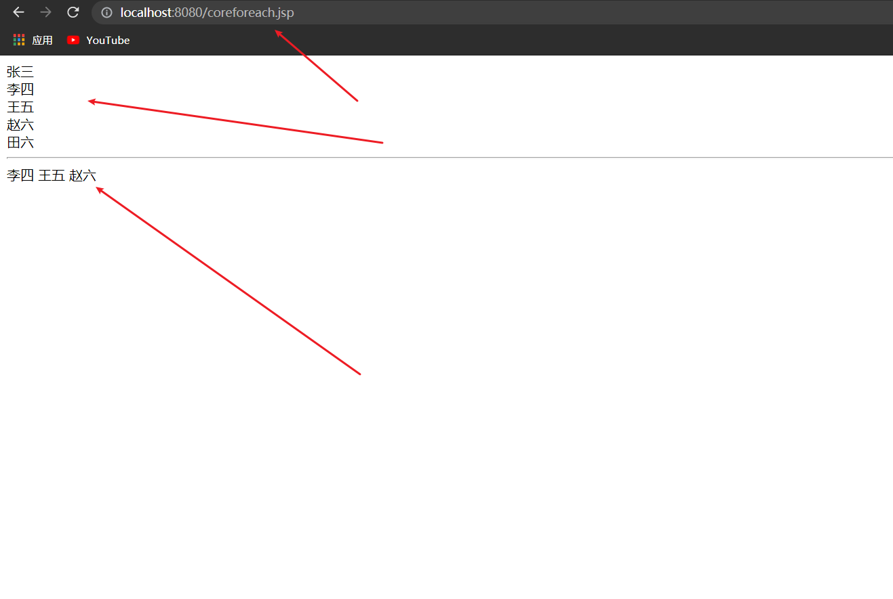


# 6、在IDEA中修改jsp模板

可以在IDEA中修改jsp模板

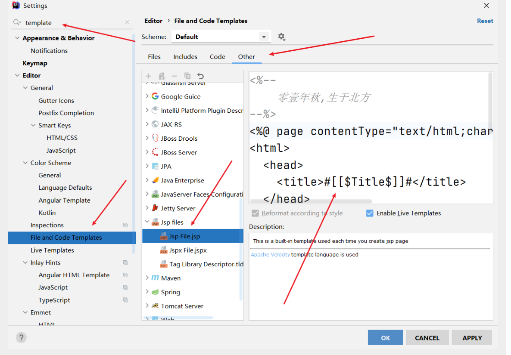

