# 1、Maven概述

## 1.1、Maven是什么

1. 在Javaweb开发中，需要使用大量的jar包，我们手动去导入；
2. 如何能够让一个东西自动帮我导入和配置这个jar包。由此，Maven诞生了！


**Maven的本质是一个项目管理工具，将项目开发和管理过程抽象成一个项目对象模型（POM）**

Maven是用Java语言编写的。他管理的东西统统以面向对象的形式进行设计，最终它把一个项目看成一个对象，而这个对象叫做**POM**(project  object model)，即项目对象模型。

我们说一个项目就是一个对象，作为对象的行为、对象的属性都有哪些呢？

Maven说我们需要编写一个pom.xml文件，Maven通过加载这个配置文件就可以知道我们项目的相关信息了！到这里我们知道了Maven离不开一个叫pom.xml的文件。因为这个文件代表就一个项目。

>提个问题大家思考，如果我们做8个项目，对应的是1个文件，还是8个文件？肯定是8个！

那Maven是如何帮我们进行项目资源管理的呢？这就需要用到Maven中的第二个东西：**依赖管理**。这也是它的第二个核心！

所谓依赖管理就是maven对项目所有依赖资源的一种管理，它和项目之间是一种双向关系，即当我们做项目的时候maven的依赖管理可以帮助你去管理你所需要的其他资源，当其他的项目需要依赖我们项目的时候，maven也会把我们的项目当作一种资源去进行管理，这就是一种双向关系。

那maven的依赖管理它管理的这些资源存在哪儿呢？主要有三个位置：**本地仓库，私服，中央仓库**

本地仓库顾名思义就是存储在本地的一种资源仓库，如果本地仓库中没有相关资源，可以去私服上获取，私服也是一个资源仓库，只不过不在本地，是一种远程仓库，如果私服上也没有相关资源，可以去中央仓库去获取，中央仓库也是一种远程仓库。

Maven除了帮我们管理项目资源之外还能帮助我们对项目进行构建，管理项目的整个生命周期，当然它的这些功能需要使用一些相关的插件来完成，当然整个生命周期过程中插件是需要配合使用的，单独一个无法完成完整的生命周期。

## 1.2、Maven的作用

Maven的作用我们可以分成三类：

（1）项目构建：提供标准的，跨平台的自动化构建项目的方式

（2）依赖管理：方便快捷的管理项目依赖的资源（jar包），避免资源间的版本冲突等问题

（3）统一开发结构：提供标准的，统一的项目开发结构，如下图所示：

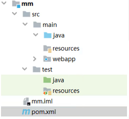


各目录存放资源类型说明：

**src/main/java**：项目java源码

**src/main/resources**：项目的相关配置文件（比如mybatis配置，xml映射配置，自定义配置文件等）

**src/main/webapp**：web资源（比如html，css，js等）

src/test/java：测试代码

src/test/resources：测试相关配置文件

src/pom.xml：项目pom文件

# 2、下载安装Maven

## 2.1、新版下载

官网;https://maven.apache.org/

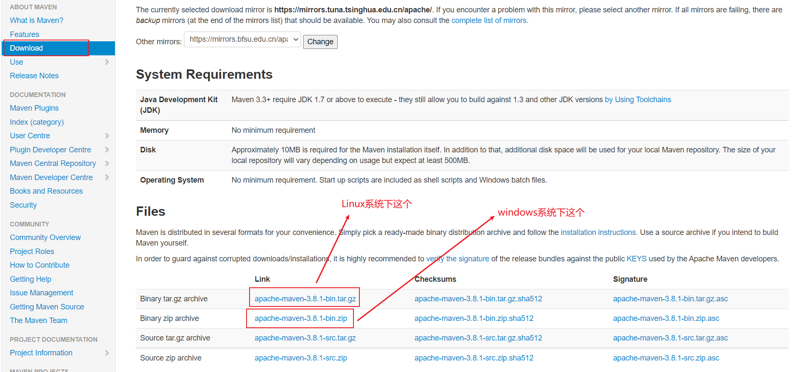

## 2.2、旧版下载

旧版本下载步骤：我们以3.6.1版本为例

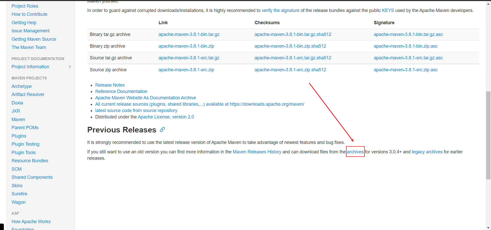


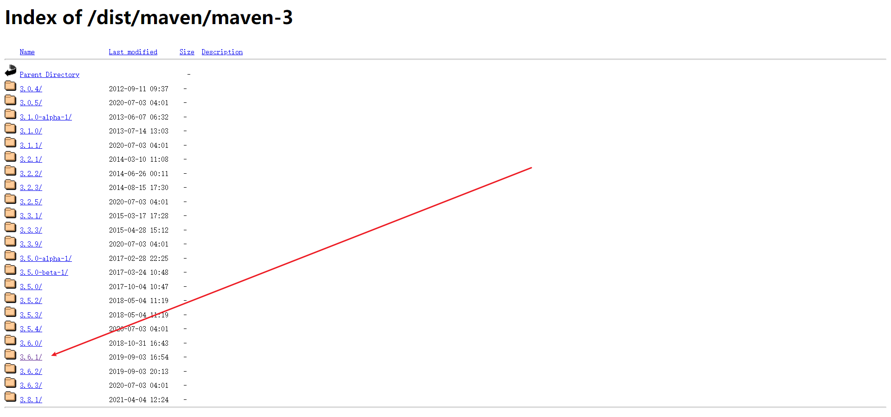

点击 sources

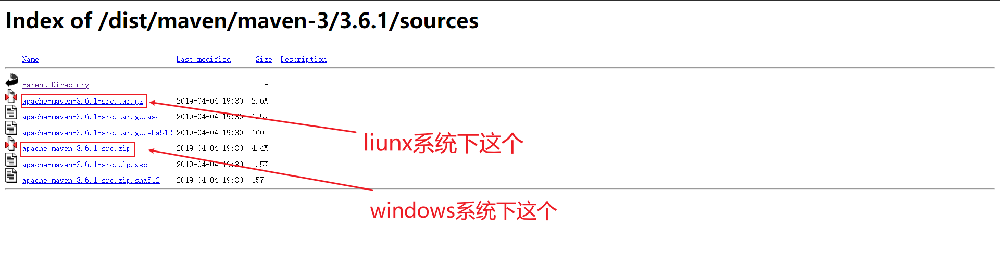


## 2.3、安装

maven是一个绿色软件，解压即安装，非常容易，

我们将下载好的`apache-maven-3.6.1-bin.zip`直接解压到D盘根目录下即可

解压完成后我们可以查看一下maven自己的一个目录结构如下


各目录结构说明：

bin：可执行程序目录，

boot：maven自身的启动加载器

conf：maven配置文件的存放目录

lib：maven运行所需库的存放目录


## 2.4、配置环境变量

`我的电脑`-------->`属性`--------->`高级系统设置`---------->`新建系统变量MAVEN_HOME`，

在我们的系统环境变量中

配置如下配置：

- M2_HOME     maven目录下的bin目录
- MAVEN_HOME      maven的目录
- 在系统的path中配置  `%MAVEN_HOME%\bin`
- 之后在命令行窗口中输入`mvn -version`
- 测试Maven是否安装成功，保证必须配置完毕！


---

环境变量配置好之后需要测试环境配置结果，我们需要在DOS命令窗口下输入以下命令查看输出

```bash
mvn -v
```

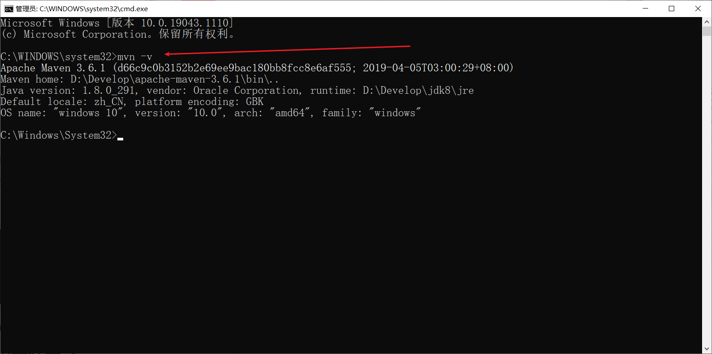

如果能够看到输出的maven的版本信息代表配置成功

## 2.5、配置阿里云镜像

- 国内建议使用阿里云的镜像(可以百度搜 `maven 阿里云镜像`,也可以打开下方链接)
- https://maven.aliyun.com/mvn/guide

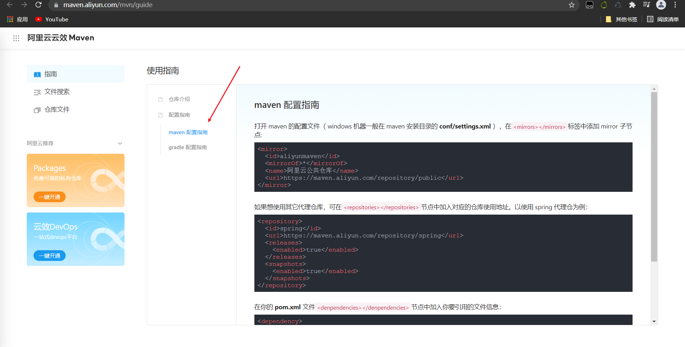


- 在`settings.xml`里面的`mirrors`标签里面导入

```xml
<mirror>
  <id>aliyunmaven</id>
  <mirrorOf>*</mirrorOf>
  <name>阿里云公共仓库</name>
  <url>https://maven.aliyun.com/repository/public</url>
</mirror>
```


## 2.6、配置本地仓库

在Maven -bin 的同级目录下建立一个文件夹 `maven-repo`

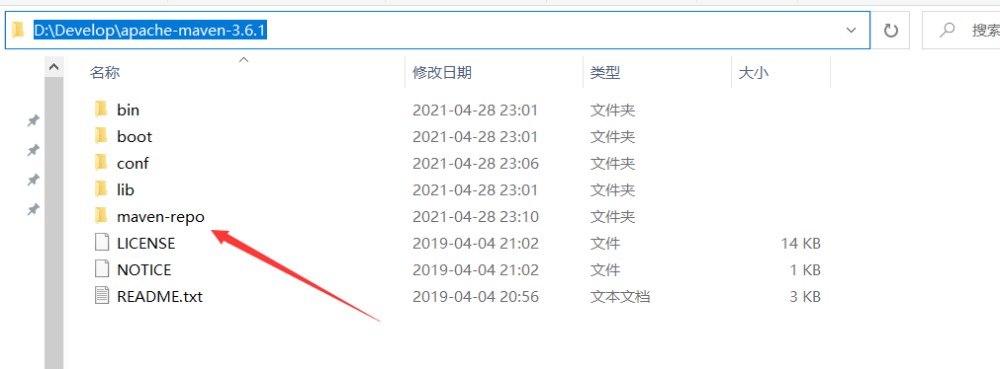


**建立一个本地仓库：**localRepository

- 在`settings.xml`里面的localRepository下导入

```xml
<localRepository>D:\Develop\apache-maven-3.6.1\maven-repo</localRepository>
```


# 3、Maveb基础概念

## 3.1、仓库

仓库：用于存储资源，主要是各种jar包

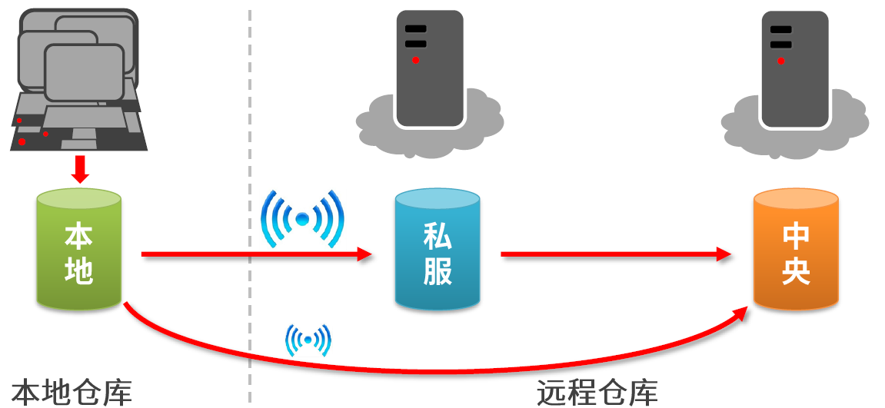

关于仓库，我们前面讲到了有三种：本地仓库，私服，中央仓库，其中私服和中央仓库都属于远程仓库

**中央仓库**：maven团队自身维护的仓库，属于开源的

**私服**：各公司/部门等小范围内存储资源的仓库，私服也可以从中央仓库获取资源

**本地仓库**：开发者自己电脑上存储资源的仓库，也可从远程仓库获取资源

**私服的作用：**

（1）保存具有版权的资源，包含购买或自主研发的jar

（2）一定范围内共享资源，能做到仅对内不对外开放

## 3.2、坐标

我们说maven的仓库里存储了各种各样的资源（jar包），那这些资源我们如何找到它们呢？我们需要知道它们具体的一个位置才能知道如何找到它们，这个就叫坐标

**坐标**：maven中的坐标用于描述仓库中资源的位置

maven坐标的主要组成如下：

- **groupId**：定义当前资源隶属组织名称（通常是域名反写，如：org.mybatis；com.itheima）
- **artifactId**：定义当前资源的名称（通常是项目或模块名称，如：crm，sms）
- **version**：定义当前资源的版本号

- **packaging**：定义资源的打包方式，取值一般有如下三种
  - jar：该资源打成jar包，默认是jar		 java工程打包为jar
  - war：该资源打成war包     web工程打包为war
  - pom：该资源是一个父资源（表明使用maven分模块管理），打包时只生成一个pom.xml不生成jar或其他包结构

```xml
<?xml version="1.0" encoding="UTF-8"?>
<project xmlns="http://maven.apache.org/POM/4.0.0"
         xmlns:xsi="http://www.w3.org/2001/XMLSchema-instance"
         xsi:schemaLocation="http://maven.apache.org/POM/4.0.0 http://maven.apache.org/xsd/maven-4.0.0.xsd">
    <!--指定pom的模型版本-->
    <modelVersion>4.0.0</modelVersion>
    <!--打包方式 web工程打包为war java工程打包为jar-->
    <packaging>war</packaging>
    
    <!--组织id-->
    <groupId>com.itheima</groupId>
    <!--项目id-->
    <artifactId>web01</artifactId>
    <!--组织id  release代表完成版,SNAPSHOT代表开发版-->
    <version>1.0-SNAPSHOT</version>
    
    <!--设置当前工程的所有依赖-->
    <dependencies>
        <!--具体的依赖-->
        <dependency>
        </dependency>
    </dependencies>
</project>
```

# 4、创建一个MavenWeb项目

1. 启动IDEA

2. 创建一个`MavenWeb`项目

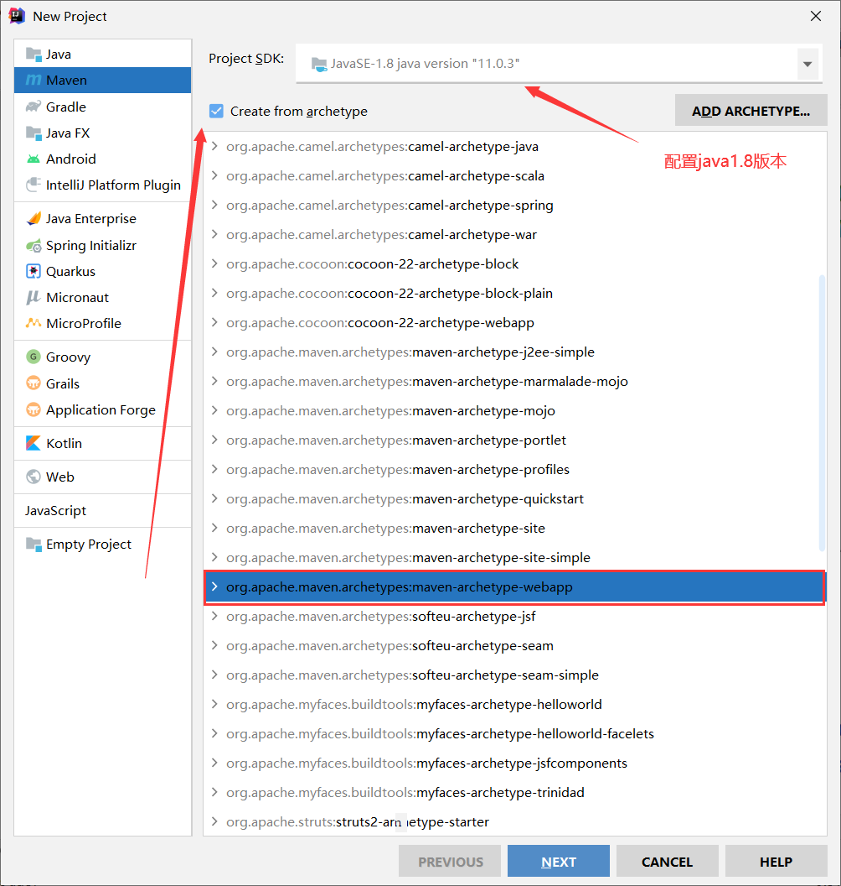


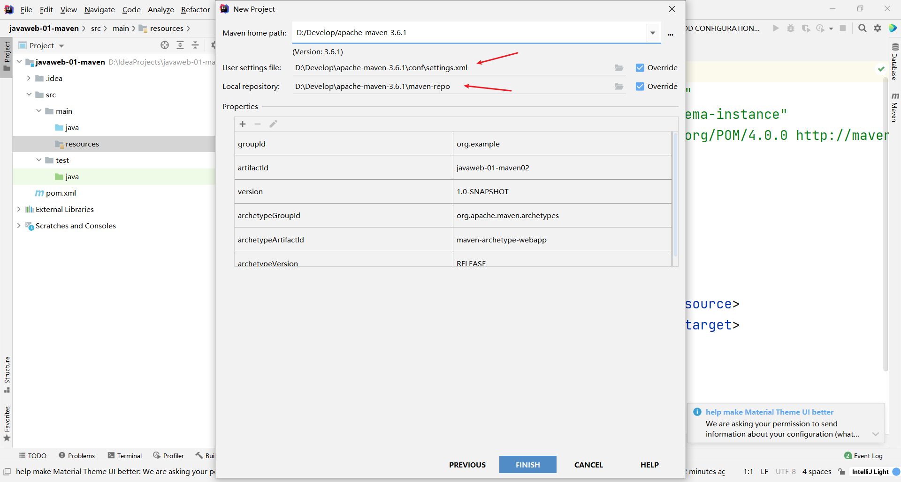


3. 创建完成等待项目初始化完成


4. 观察maven仓库中多了什么东西？
5. 注意：IDEA项目创建成功后，看一眼Maven的配置

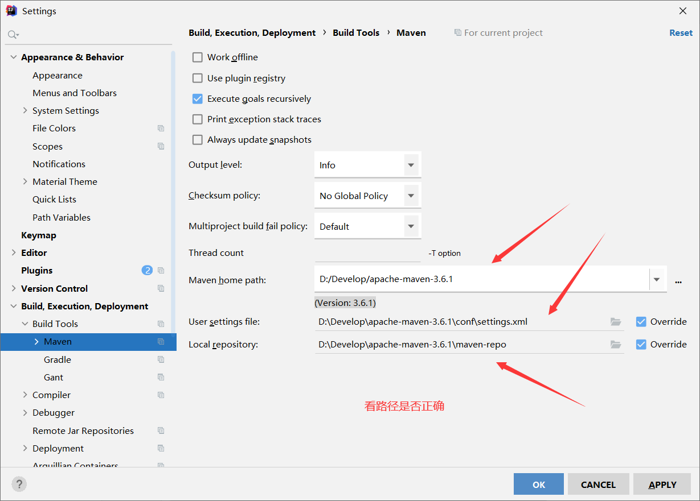


到这里，Maven在IDEA中的配置和使用就OK了!

## 4.1、标记文件夹功能

我们在创建的`MavenWeb` 项目的 main 目录下创建 java，resources 

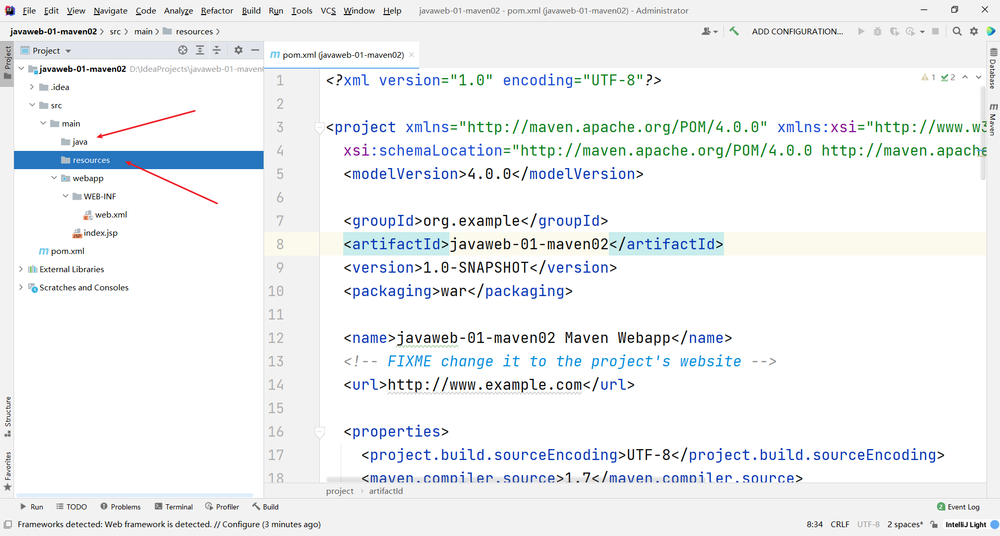

2. 鼠标悬停在java文件夹，右键

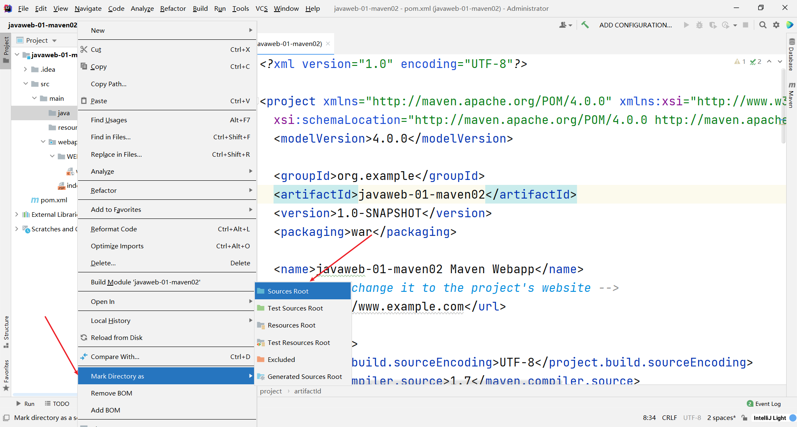


3. resources 也同样标记

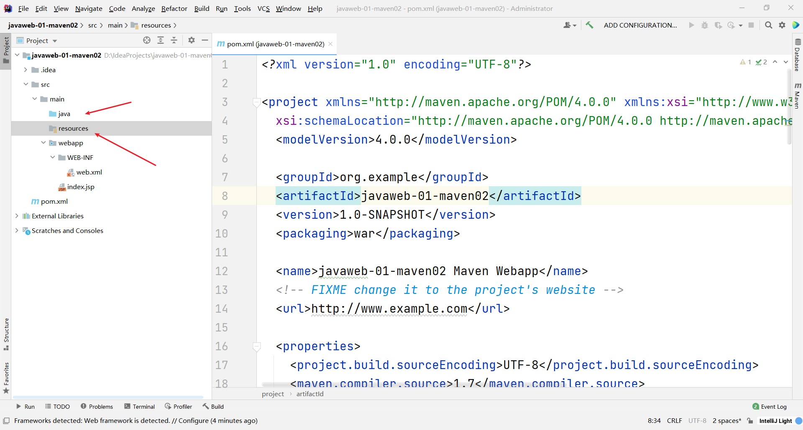

创建`MavenWeb` 项目**我们需要手动去补全目录，并且要对补全的目录进行标记，切记**

# 5、创建一个普通的Maven项目

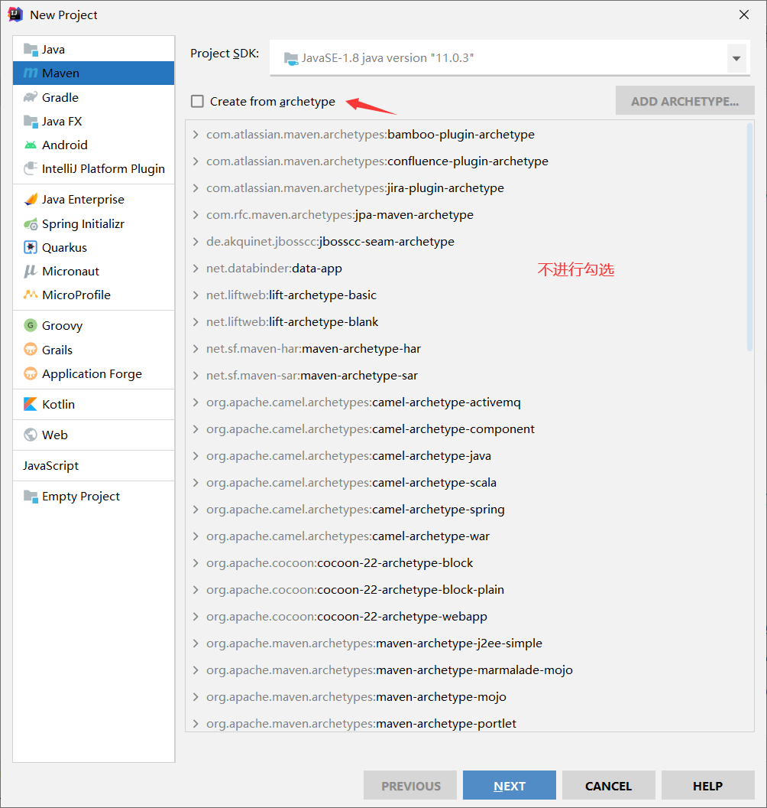


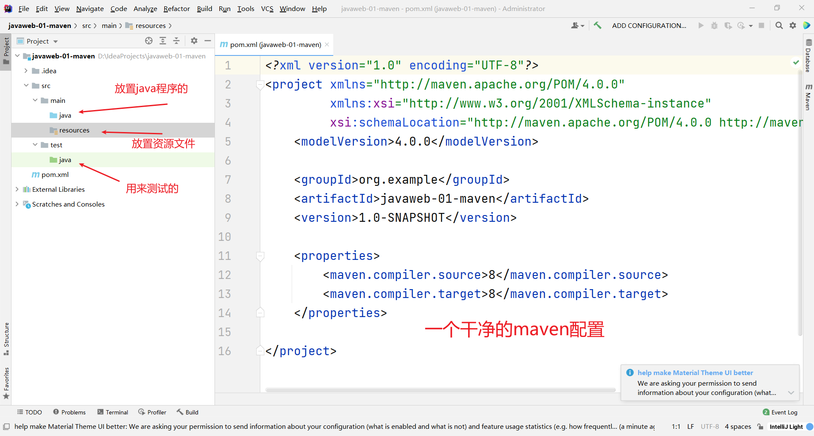


## 5.1、IDEA配置Tomcat

[IDEA配置Tomcat](https://blog.csdn.net/Augenstern_QXL/article/details/116568777)

我们也可以不配置Tomcat，而是在 `pom.xml` 中配置 tomcat 插件来运行项目

- 在Maven仓库中搜索 tomcat Maven

- 找到 org.apache.tomcat.maven

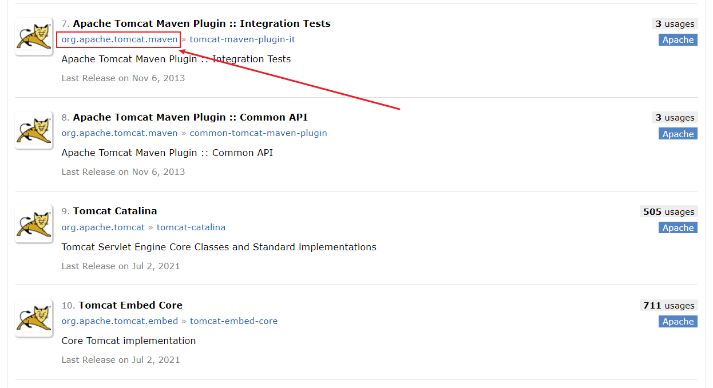

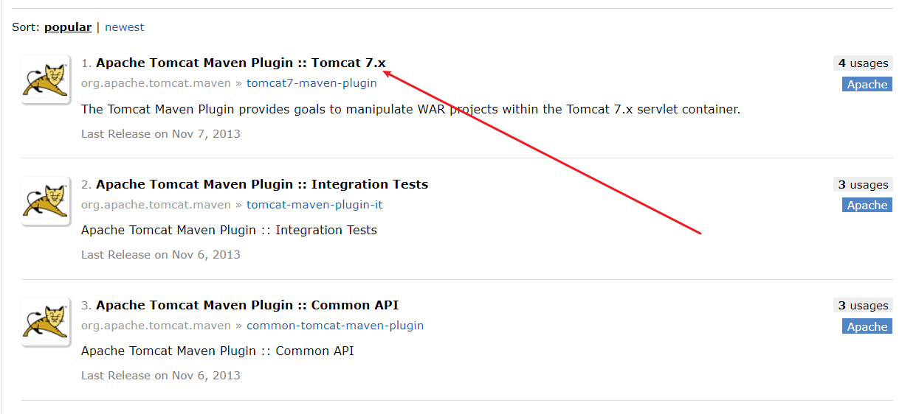

我们使用2.1版本的，相对来说稳定一些

```xml
<!--构建-->
<build>
    <!--设置插件-->
    <plugins>
        <!--具体的插件配置-->
        <groupId>org.apache.tomcat.maven</groupId>
        <artifactId>tomcat7-maven-plugin</artifactId>
        <version>2.1</version>
        <!--配置端口-->
        <configuration>
            <port>80</port>
            <!--虚拟路径-->
            <path>/</path>
        </configuration>
    </plugins>
</build>
```

插件配置好后，在IDEA右侧`maven-project`操作面板上可以看到该插件，并且可以利用该插件启动项目


运行后该插件会给我们一个可运行地址：


## 5.2、pom文件

pom.xml 是Maven的核心配置文件

```xml
<?xml version="1.0" encoding="UTF-8"?>

<!--Maven版本和头文件-->
<project xmlns="http://maven.apache.org/POM/4.0.0" xmlns:xsi="http://www.w3.org/2001/XMLSchema-instance"
  xsi:schemaLocation="http://maven.apache.org/POM/4.0.0 http://maven.apache.org/xsd/maven-4.0.0.xsd">
  <modelVersion>4.0.0</modelVersion>


  <groupId>com.kuang</groupId>
  <artifactId>javaweb-01-maven</artifactId>
  <version>1.0-SNAPSHOT</version>
  <!--Package：项目的打包方式
  jar：java应用
  war：JavaWeb应用
  -->
  <packaging>war</packaging>


  <!--配置-->
  <properties>
    <!--项目的默认构建编码-->
    <project.build.sourceEncoding>UTF-8</project.build.sourceEncoding>
    <!--编码版本-->
    <maven.compiler.source>1.8</maven.compiler.source>
    <maven.compiler.target>1.8</maven.compiler.target>
  </properties>

  <!--项目依赖-->
  <dependencies>
    <!--具体依赖的jar包配置文件-->
    <dependency>
      <groupId>junit</groupId>
      <artifactId>junit</artifactId>
      <version>4.11</version>
    </dependency>
  </dependencies>

  <!--项目构建用的东西-->
  <build>
    <finalName>javaweb-01-maven</finalName>
    <pluginManagement>
      <plugins>
        <plugin>
          <artifactId>maven-clean-plugin</artifactId>
          <version>3.1.0</version>
        </plugin>
        <plugin>
          <artifactId>maven-resources-plugin</artifactId>
          <version>3.0.2</version>
        </plugin>
        <plugin>
          <artifactId>maven-compiler-plugin</artifactId>
          <version>3.8.0</version>
        </plugin>
        <plugin>
          <artifactId>maven-surefire-plugin</artifactId>
          <version>2.22.1</version>
        </plugin>
        <plugin>
          <artifactId>maven-war-plugin</artifactId>
          <version>3.2.2</version>
        </plugin>
        <plugin>
          <artifactId>maven-install-plugin</artifactId>
          <version>2.5.2</version>
        </plugin>
        <plugin>
          <artifactId>maven-deploy-plugin</artifactId>
          <version>2.8.2</version>
        </plugin>
      </plugins>
    </pluginManagement>
  </build>
</project>
```


# 6、Maven依赖管理

## 6.1、依赖配置与依赖传递

依赖是指在当前项目中运行所需的jar，依赖配置的格式如下：

```xml
<!--设置当前项目所依赖的所有jar-->
<dependencies>
    <!--设置具体的依赖-->
    <dependency>
        <!--依赖所属群组id-->
        <groupId>Junit</groupId>
        <!--依赖所属项目id-->
        <artifactId>Junit</artifactId>
        <!--依赖版本号-->
        <version>4.12</version>
    </dependency>
</dependencies>
```

**依赖传递：**

依赖具有传递性，分两种

（1）直接依赖：在当前项目中通过依赖配置建立的依赖关系

（2）间接依赖：被依赖的资源如果依赖其他资源，则表明当前项目间接依赖其他资源

### 6.1.1、依赖传递冲突

**依赖传递的冲突问题：**

在依赖传递过程中产生了冲突，我们有三种优先法则

（1）路径优先：当依赖中出现相同资源时，层级越深，优先级越低，反之则越高

（2）声明优先：当资源在相同层级被依赖时，配置顺序靠前的覆盖靠后的

（3）特殊优先：当同级配置了相同资源的不同版本时，后配置的覆盖先配置的


以一个项目为根，直接依赖称为1度资源，直接依赖的直接依赖称为2度资源，直接依赖的直接依赖的直接依赖称为3度资源。

当然依赖冲突在这里我们并不需要记，后面会有如何解决此问题的办法。

### 6.1.2、可选依赖

可选依赖指的是对外隐藏当前所依赖的资源➡不透明

- 加一个`<optional> ` 标签

```xml
<dependencies>
    <dependency>
        <groupId>Junit</groupId>
        <artifactId>Junit</artifactId>
        <version>4.12</version>
        <optional>true</optional>
    </dependency>
</dependencies>
```

### 6.1.3、排除依赖

排除依赖指主动断开依赖的资源，被排除的资源无需指定版本

```xml
<dependencies>
    <dependency>
        <groupId>Junit</groupId>
        <artifactId>Junit</artifactId>
        <version>4.12</version>
        <exclusions>
            <exclusion>
                <groupId>log4j</groupId>
                <artifactId>log4j</artifactId>
            </exclusion>
    </dependency>
</dependencies>
```

## 6.1、依赖范围

依赖的jar默认情况可以在任何地方可用，可以通过`scope`标签设定其作用范围

这里的范围主要是指以下三种范围

（1）主程序范围有效（src/main目录范围内）

（2）测试程序范围内有效（src/test目录范围内）

（3）是否参与打包（package指令范围内）

此外：`scope`标签的取值有四种：`compile,test,provided,runtime`

这四种取值与范围的对应情况如下：


# 7、Maven生命周期与插件

Maven对项目构建的生命周期划分为3套

- clear：清理工作
- default：核心工作，例如编译、测试、打包、部署等
- site：产生报告、发布站点等

## 7.1、clear生命周期

clean：清理工作

- pre-clean：执行一些在clean之前的工作

- clean：移除上一次构建产生的所有文件

- post-clean：执行一些在clean之后立刻完成的工作


## 7.2、default生命周期

default：核心工作，例如编译，测试，打包，部署等

这里面的事件非常的多，如下图


**对于default生命周期，每个事件在执行之前都会将之前的所有事件依次执行一遍**

## 7.3、site生命周期

site：产生报告，发布站点等

- pre-site：执行一些在生成站点文档之前的工作

- site：生成项目的站点文档

- post-site：执行一些在生成站点文档之后完成的工作，为部署做准备

- site-deploy：将生成的站点文档部署到特定的服务器上


## 7.4、插件

**插件：**

- 插件与生命周期内的阶段绑定，在执行到对应生命周期时执行对应的插件
- maven默认在各个生命周期上都绑定了预先设定的插件来完成相应功能
- 插件还可以完成一些自定义功能

插件的配置方式如下：我们以打包源码为例

```xml
<build>
    <plugins>
        <plugin>
            <groupId>org.apache.maven.plugins</groupId>
            <artifactId>maven-source-plugin</artifactId>
            <version>2.2.1</version>
            <executions>
                <excution>
                    <goals>
                        <!--当goal属性的值为test-jar时，是对测试代码打包-->
                        <goal>jar</goal>
                    </goals>
                    <phase>generate-test-resources</phase>
                </excution>
            </executions>
        </plugin>
    </plugins>
</build>
```

在IDEA右侧`maven-project`操作面板上可以看到

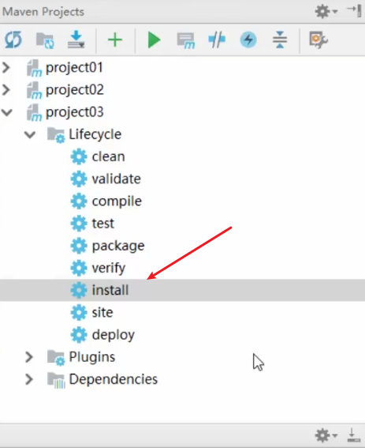

这样在IDEA左侧 target目录下就会有我们的源码包


# 8、解决Maven中遇到的问题

1. **每次创建Maven项目都要配置Maven版本的解决办法**


进行maven全局配置

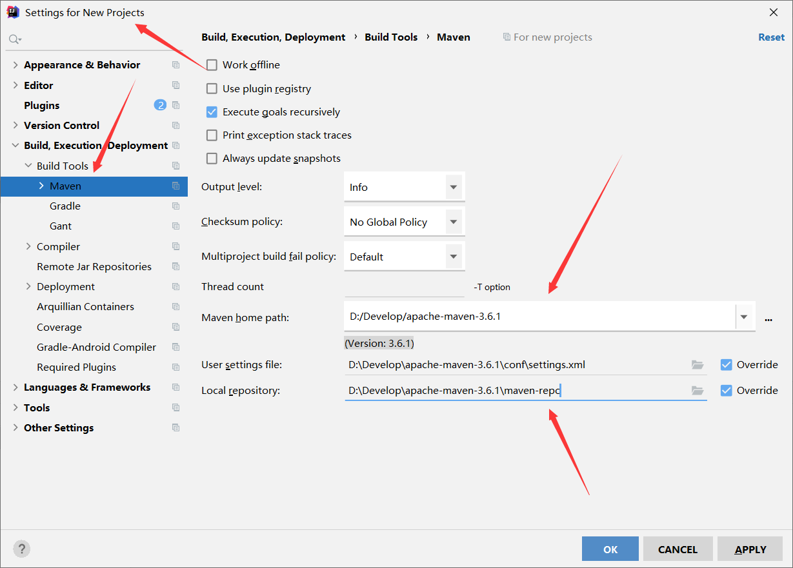

2. **maven默认web项目中的web.xml版本问题**

解决办法：替换为webapp4.0版本和tomcat一致，在我们配置的tomcat目录下可找到新web.xml代码

- tomcat - webapps - root - WEB-INF- web.xml

```xml
<web-app xmlns="http://xmlns.jcp.org/xml/ns/javaee"
  xmlns:xsi="http://www.w3.org/2001/XMLSchema-instance"
  xsi:schemaLocation="http://xmlns.jcp.org/xml/ns/javaee
                      http://xmlns.jcp.org/xml/ns/javaee/web-app_4_0.xsd"
  version="4.0"
  metadata-complete="true">
</web-app>
```

3. **约定大于配置**

maven由于它的约定大于配置，我们之后可能遇到我们写的配置文件，无法被导出或者生效的问题

什么意思？

---

- 在java目录下新建properties
- 在resources目录下新建properties

- 启动tomcat

- 我们发现java和resources都被打包到了同一个路径下：classes，我们俗称这个路径为classpath
- java目录下的properties并没有被打包，resources目录下的properties被打包了，这就是我们说的我们写的配置文件，无法被导出或者生效


解决方案：

```xml
<!--在build中配置resources,来防止我们资源导出失败的问题-->
<!--resources下的properties、xml都可以导出-->
<!--java下的properties、xml都可以导出-->
<build>
    <resources>
        <resource>
        <directory>src/main/resources</directory>
        <includes>
            <include>**/*.properties</include>
            <include>**/*.xml</include>
        </includes>
        <filtering>true</filtering>
        </resource>
        <resource>
        <directory>src/main/java</directory>
        <includes>
            <include>**/*.properties</include>
            <include>**/*.xml</include>
        </includes>
        <filtering>true</filtering>
        </resource>
    </resources>
</build>
```

4. 清理 Maven 仓库脚本

   有时候因为网络问题，我们使用 Maven 加载依赖失败，会在仓库中残留 .lastUpdated 的文件

   创建一个bat文件，然后复制上述脚本进去，修改其中maven本地仓库的地址，保存后双击执行即可。

```
@echo off
rem create by NettQun
rem 这里写你的仓库路径
set REPOSITORY_PATH=E:\Develop\maven_rep
rem 正在搜索...
for /f "delims=" %%i in ('dir /b /s "%REPOSITORY_PATH%\*lastUpdated*"') do (
echo %%i
del /s /q "%%i"
)
rem 搜索完毕
pause
```


