# 1.Servlet

## 1.1、Servlet简介

- Servlet就是sun公司开发动态web的一门技术

- Sun在API中提供了一个接口：`Servlet` ，如果逆向开发一个Servlet程序，只需要==完成两个小步骤==
  - 编写一个类，实现`Servlet`接口
  - 把开发好的Java类部署到web服务器中
- **把实现了`Servlet`接口的Java程序叫做`Servlet`**

## 1.2、HelloServlet

1. 构建一个普通的`Maven`项目

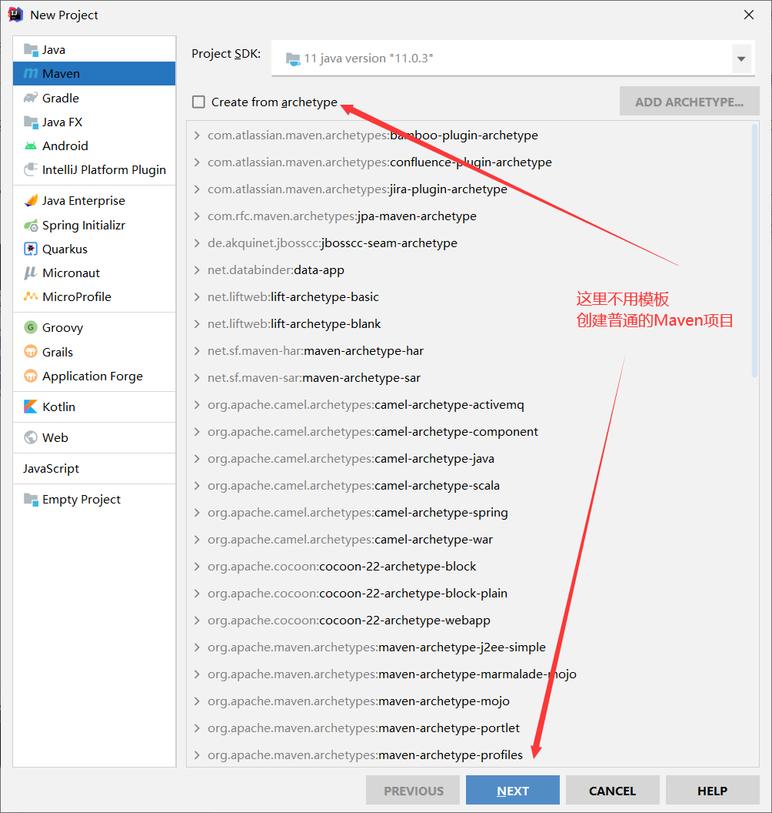


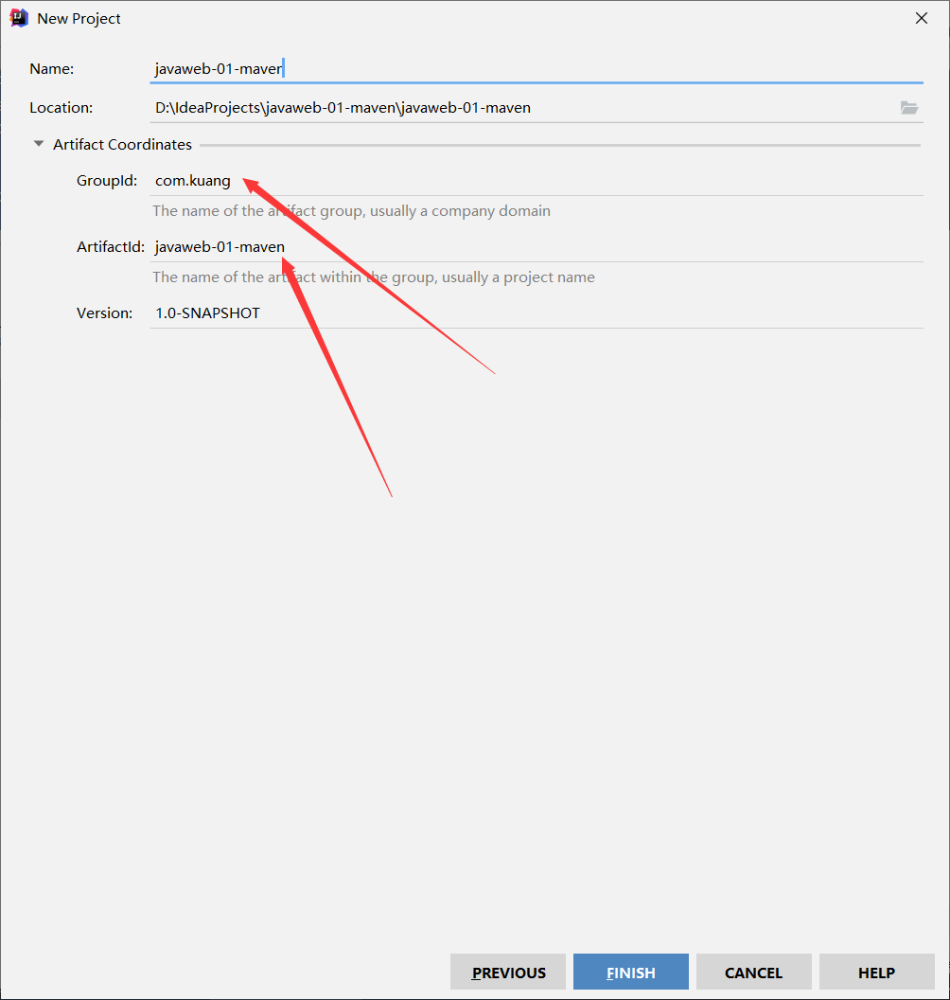


1. 删掉里面的`Src`目录，这个空的工程就是Maven主工程

2. 在 `pom.xml` 里面添加 servlet，jsp 依赖

   - 去 `Maven Repository`仓库里面搜索 javax-servlet-api      和     javax.servlet.jsp-api
   - 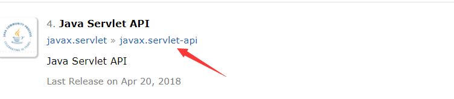

   ```java
   <dependencies>
           
   <!-- https://mvnrepository.com/artifact/javax.servlet/javax.servlet-api -->
   <dependency>
       <groupId>javax.servlet</groupId>
       <artifactId>javax.servlet-api</artifactId>
       <version>4.0.1</version>
   </dependency>
   
   
   <!-- https://mvnrepository.com/artifact/javax.servlet.jsp/javax.servlet.jsp-api -->
   <dependency>
       <groupId>javax.servlet.jsp</groupId>
       <artifactId>javax.servlet.jsp-api</artifactId>
       <version>2.3.3</version>
   </dependency>
   
       
   </dependencies> 
   ```
   
3. **Load Maven changes**

   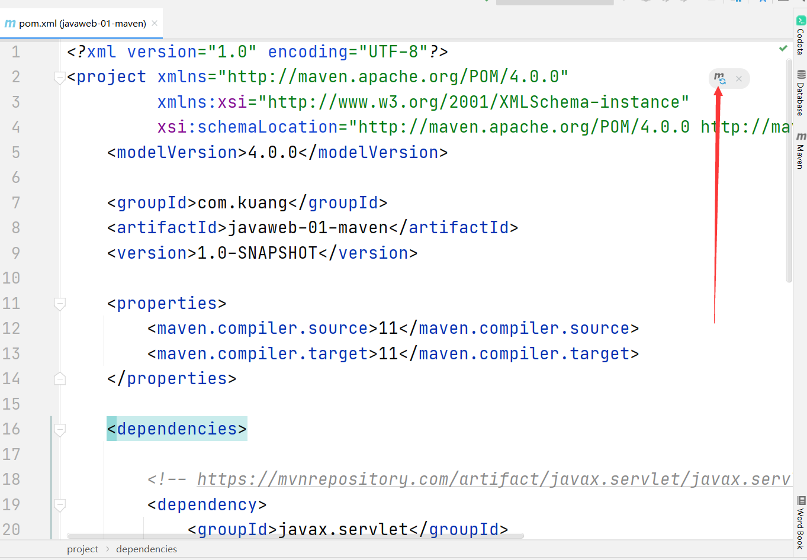


4. 新建Module

   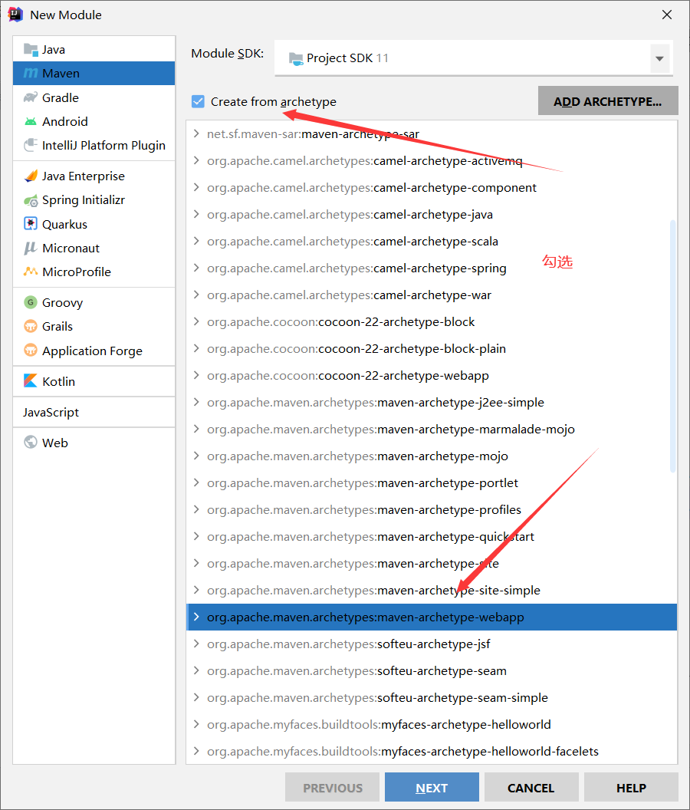


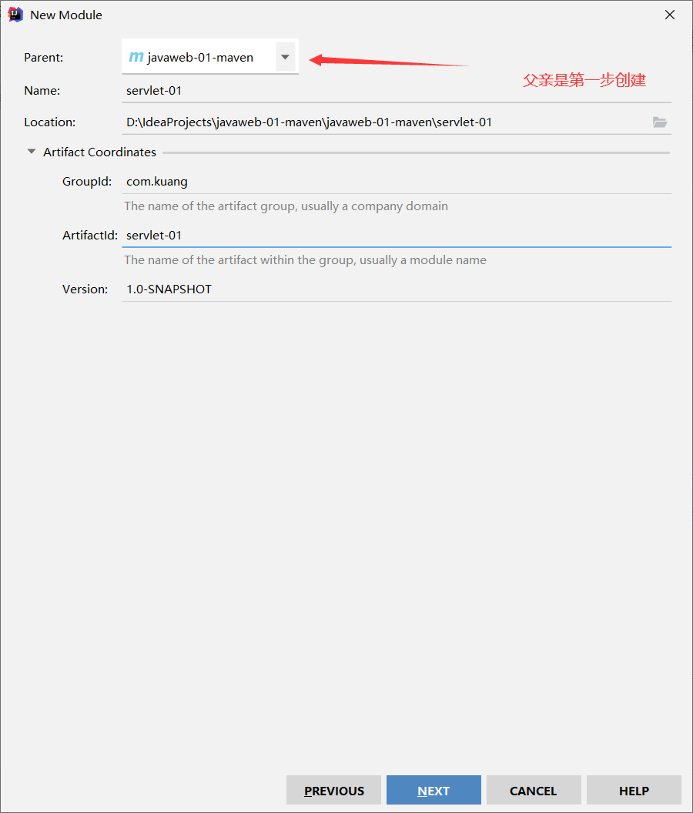


5. 父项目的pom.xml文件有

```java
<modules>
        <module>servlet-01</module>
</modules>
```

6. 子项目的pom.xml文件有

```java
<parent>
        <artifactId>javaweb-02-maven</artifactId>
        <groupId>com.kuang</groupId>
        <version>1.0-SNAPSHOT</version>
</parent>
```

父项目中的java子项目可以直接使用，意思其实就是子项目可以不用再次导入jar包，直接可以使用父项目导入的jar包

7.在 main 目录下新建Directory `java`，`resources`

​	并且右键-Mark Directory as ，分别转换为java目录和资源目录

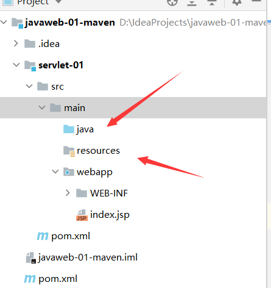


8. Maven环境优化

   - 修改web.xml为最新的

     ```xml
     <?xml version="1.0" encoding="UTF-8"?>
     <web-app xmlns="http://xmlns.jcp.org/xml/ns/javaee"
             xmlns:xsi="http://www.w3.org/2001/XMLSchema-instance"
             xsi:schemaLocation="http://xmlns.jcp.org/xml/ns/javaee
             http://xmlns.jcp.org/xml/ns/javaee/web-app_4_0.xsd"
             version="4.0"
             metadata-complete="true">
     </web-app>
     ```


上面这一大串我们是从哪里来的呢？其实我们是在`tomcat\webapps\ROOT\WEB-INF\web.xml` 中与tomcat相对应的版本

9. 新建包，新建类

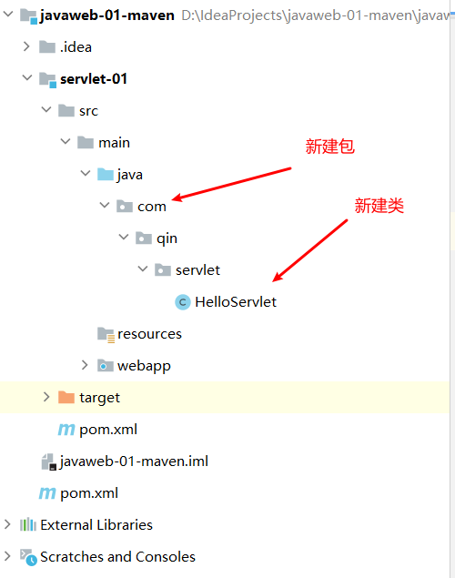

10. 写一个Servlet程序，Serlvet接口Sun公司有两个默认的实现类：HttpServlet，GenericServlet

- 编写一个普通类
- 实现Servlet接口，这里我们直接继承HttpServlet
- 重写doGet、doPost方法
- 编写Servlet的映射

> 为什么需要映射？

- 我们写的是JAVA程序，但是要通过浏览器访问，而浏览器需要连接web服务器，所以我们需要再web服务中注册我们写的Servlet，还需给他一个浏览器能够访问的路径

==2.继承HttpServlet==

```java
public class HelloServlet extends HttpServlet {
    // get或者post只是请求实现的不同方式，可以互相调用，业务逻辑都一样
    @Override
    protected void doGet(HttpServletRequest req, HttpServletResponse resp) throws ServletException, IOException {
        System.out.println("进入doGet方法");
        // 在这边重写完方法之后就去web.xml里面编写Servlet的映射
    }

    @Override
    protected void doPost(HttpServletRequest req, HttpServletResponse resp) throws ServletException, IOException {
        super.doPost(req, resp);
    }
}
```

==3.编写Servlet的映射==

```xml
<!--    1.注册servlet-->
<servlet>
    <servlet-name>hello</servlet-name>
    <servlet-class>com.kuang.servlet.HelloServlet</servlet-class>
</servlet>
<!--    servlet的请求路径-->
<servlet-mapping>
    <servlet-name>hello</servlet-name>
    <url-pattern>/hello</url-pattern>
</servlet-mapping>
```

11. 配置并启动tomcat

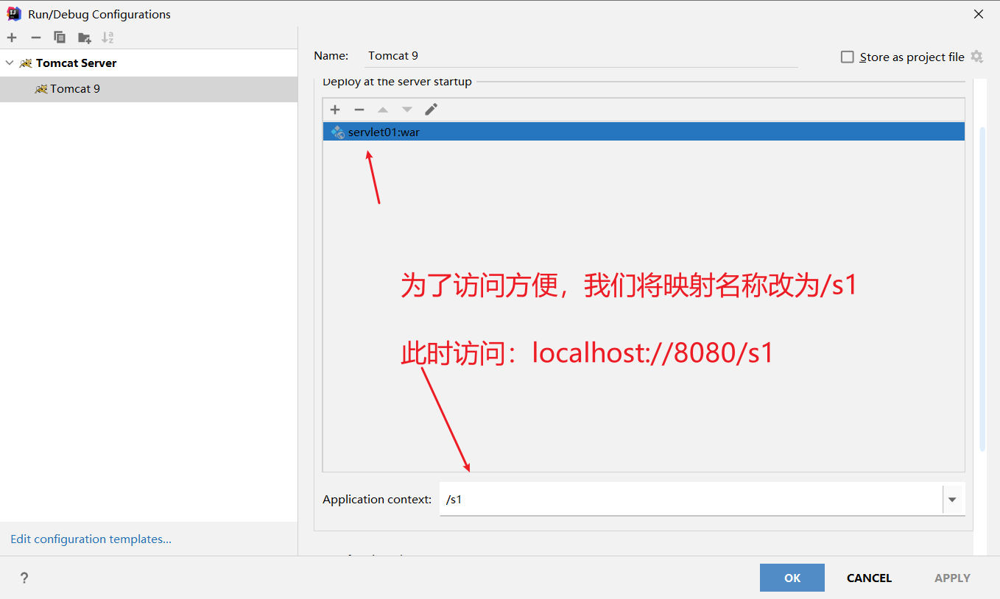

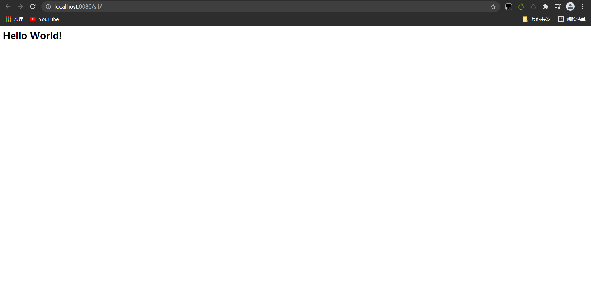


12. 请求我们自己映射的`/hello`

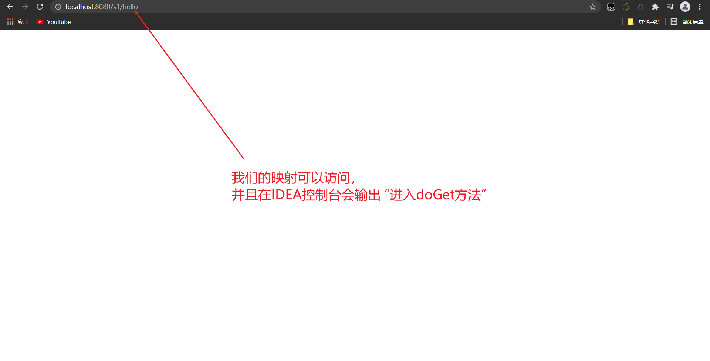


## 1.3、Mapping问题

1. **一个Servlet可以指定一个映射路径**

```xml
<!--当我们这样配置映射路径的时候，我们访问的名称为：localhost:8080/s1/hello-->
<servlet-mapping>
        <servlet-name>hello</servlet-name>
        <url-pattern>/hello</url-pattern>
</servlet-mapping>
```

2. **一个Servlet可以指定多个映射路径**

```xml
<!--当我们这样配置映射路径的时候，我们访问的名称为：localhost:8080/s1/hello-->
<servlet-mapping>
    <servlet-name>hello</servlet-name>
    <url-pattern>/hello</url-pattern>
</servlet-mapping>
<!--当我们这样配置映射路径的时候，我们访问的名称为：localhost:8080/s1/hello2-->
<servlet-mapping>
    <servlet-name>hello</servlet-name>
    <url-pattern>/hello2</url-pattern>
</servlet-mapping>
<!--当我们这样配置映射路径的时候，我们访问的名称为：localhost:8080/s1/hello3-->
<servlet-mapping>
    <servlet-name>hello</servlet-name>
    <url-pattern>/hello3</url-pattern>
</servlet-mapping>
<!--当我们这样配置映射路径的时候，我们访问的名称为：localhost:8080/s1/hello4-->
<servlet-mapping>
    <servlet-name>hello</servlet-name>
    <url-pattern>/hello4</url-pattern>
</servlet-mapping>
<!--当我们这样配置映射路径的时候，我们访问的名称为：localhost:8080/s1/hello5-->
<servlet-mapping>
    <servlet-name>hello</servlet-name>
    <url-pattern>/hello5</url-pattern>
</servlet-mapping>
```


3. **一个Servlet可以指定通用映射路径**

```xml
<!--当我们这样配置映射路径的时候，我们访问的名称为:localhost:8080/s1/hello/****-->
<!--	****代表任何字母数字均可	-->
<servlet-mapping>
    <servlet-name>hello</servlet-name>
    <url-pattern>/hello/*</url-pattern>
</servlet-mapping>
```


4. **默认请求路径**

```xml
<!--默认请求路径-->
<!--当我们这样配置映射路径的时候，我们访问的名称为:localhost:8080/s1/****-->
<!--	****代表任何字母数字均可	-->
<servlet-mapping>
    <servlet-name>hello</servlet-name>
    <url-pattern>/*</url-pattern>
</servlet-mapping>
```


5. **指定一些后缀或者前缀等等….**

```xml
<!--可以自定义后缀实现请求映射-->
<!--注意点，*前面不能加项目映射的路径-->
<!--当我们这样配置映射路径的时候，我们访问的名称为:localhost:8080/s1/hello/****.qinjiang-->
<!--  例如:localhost:8080/s1/hello/sajdlkajda.qinjiang	-->
<servlet-mapping>
    <servlet-name>hello</servlet-name>
    <url-pattern>*.qinjiang</url-pattern>
</servlet-mapping>
```

6. ==优先级问题==

```xml
<servlet-mapping>
        <servlet-name>hello</servlet-name>
        <url-pattern>/hello</url-pattern>
</servlet-mapping>

<!--404-->
<servlet>
    <servlet-name>error</servlet-name>
    <servlet-class>com.kuang.servlet.Error</servlet-class>
</servlet>
<servlet-mapping>
    <servlet-name>error</servlet-name>
    <url-pattern>/*</url-pattern>
</servlet-mapping>
```

例如当我们配置上方映射时候，我们访问：localhost:8080/s1/hello ，思考此时是访问`/*`还是访问`/hello`呢？

- 答案是访问`/hello`
- ==指定了固有的映射路径优先级最高，如果找不到就会走默认的处理请求==
- ==带有通配符的映射方式，有斜杠/的比没斜杠/的优先级高==
  - 例3比例5的优先级高


## 1.4、Servlet生命周期

对象的生命周期，就是对象从生到死的过程，即：出生——活着——死亡。用更偏向 于开发的官方说法就是对象创建到销毁的过程。

出生：请求第一次到达Servlet时，对象就创建出来，并且初始化成功。只出生一次，就放到内存中。

活着：服务器提供服务的整个过程中，该对象一直存在，每次只是执行service方法。

死亡：当服务停止时，或者服务器宕机时，对象消亡。

通过分析Servlet的生命周期我们发现，它的实例化和初始化只会在请求第一次到达Servlet时执行，而销毁只会在Tomcat服务器停止时执行，由此我们得出一个结论，**Servlet对象只会创建一次，销毁一次。所以，Servlet对象只有一个实例。如果一个对象实例在应用中是唯一的存在，那么我们就说它是单实例的，即运用了单例模式。**


### 1.4.1、启动时创建Servlet

我们前面讲解了Servlet的生命周期，Servlet的创建默认情况下是请求第一次到达Servlet时创建的。但是我们都知道，Servlet是单例的，也就是说在应用中只有唯一的一个实例，所以在Tomcat启动加载应用的时候就创建也是一个很好的选择。那么两者有什么区别呢？

- 第一种：应用加载时创建Servlet，它的优势是在服务器启动时，就把需要的对象都创建完成了，从而在使用的时候减少了创建对象的时间，提高了首次执行的效率。它的弊端也同样明显，因为在应用加载时就创建了Servlet对象，因此，导致内存中充斥着大量用不上的Servlet对象，造成了内存的浪费。
- 第二种：请求第一次访问时创建Servlet，它的优势就是减少了对服务器内存的浪费，因为那些一直没有被访问过的Servlet对象都没有创建，因此也提高了服务器的启动时间。而它的弊端就是，如果有一些要在应用加载时就做的初始化操作，它都没法完成，从而要考虑其他技术实现。

- 通过上面的描述，相信我们都能分析得出何时采用第一种方式，何时采用第二种方式。
  - 就是当需要在应用加载就要完成一些工作时，就需要选择第一种方式。
  - 当有很多Servlet的使用时机并不确定时，就选择第二种方式。

在web.xml中是支持对Servlet的创建时机进行配置的，配置的方式如下：我们就以ServletDemo3为例。

- 配置标签：`<load-on-startup> 1 </load-on-startup>`

- **配置项的取值只能是正整数（包括0），数值越小，表明创建的优先级越高**

```xml
<!--配置ServletDemo3-->
<servlet>
    <servlet-name>servletDemo3</servlet-name>
    <servlet-class>com.itheima.web.servlet.ServletDemo3</servlet-class>
    <!--配置Servlet的创建顺序，当配置此标签时，Servlet就会改为应用加载时创建
        配置项的取值只能是正整数（包括0），数值越小，表明创建的优先级越高
    -->
    <load-on-startup>1</load-on-startup>
</servlet>
<servlet-mapping>
    <servlet-name>servletDemo3</servlet-name>
    <url-pattern>/servletDemo3</url-pattern>
</servlet-mapping>
```

### 1.4.2、默认Servlet

默认Servlet是由服务器提供的一个Servlet，它配置在Tomcat的conf目录下的web.xml中

```xml
<servlet>
    <servlet-name>default</servlet-name>
    <servlet-class>org.apache.catalina.servlets.DefaultServlet</servlet-class>
    <init-param>
        <param-name>debug</param-name>
        <param-value>0</param-value>
    </init-param>
    <init-param>
        <param-name>listings</param-name>
        <param-value>false</param-value>
    </init-param>
    <load-on-startup>1</load-on-startup>
</servlet>
```

它的映射路径是`<url-pattern>/<url-pattern>`，我们在发送请求时，首先会在我们应用中的web.xml中查找映射配置，找到就执行，这块没有问题。但是当找不到对应的Servlet路径时，就去找默认的Servlet，由默认Servlet处理。所以，一切都是Servlet。


## 1.5、Servlet线程安全

由于Servlet运用了单例模式，即整个应用中只有一个实例对象，所以我们需要分析这个唯一的实例中的类成员是否线程安全。

在Servlet中定义了类成员之后，多个浏览器都会共享类成员的数据。其实每一个浏览器端发送请求，就代表是一个线程，那么多个浏览器就是多个线程，所以说明了多个线程会共享Servlet类成员中的数据，其中任何一个线程修改了数据，都会影响其他线程。因此，我们可以认为Servlet它不是线程安全的。

分析产生这个问题的根本原因，其实就是因为Servlet是单例，单例对象的类成员只会随类实例化时初始化一次，之后的操作都是改变，而不会重新初始化。

解决这个问题也非常简单，就是在Servlet中定义类成员要慎重。如果类成员是共用的，并且只会在初始化时赋值，其余时间都是获取的话，那么是没问题。如果类成员并非共用，或者每次使用都有可能对其赋值，那么就要考虑线程安全问题了，把它定义到doGet或者doPost方法里面去就可以了。


## 1.6、Servlet原理

Servlet是由Web服务器调用，web服务器在收到浏览器请求之后，会：

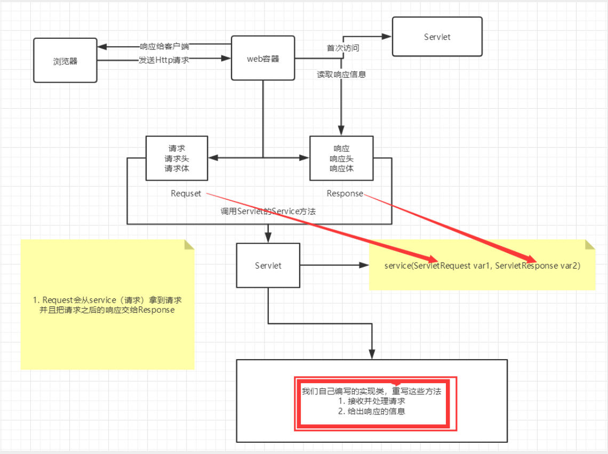


# 2.ServletContext

## 2.1、基本介绍

- ServletContext对象，它是应用上下文对象
- web容器在启动的时候，它会为每个web程序都创建一个对应的ServletContext对象，它代表了当前的web应用
- 它可以实现让应用中所有Servlet间的数据共享。 

## 2.2、生命周期

出生——活着——死亡

出生： 应用一加载，该对象就被创建出来了。一个应用只有一个实例对象。(Servlet和ServletContext都是单例的)

活着：只要应用一直提供服务，该对象就一直存在。

死亡：应用被卸载（或者服务器挂了），该对象消亡。

## 2.3、域对象

在Servlet规范中，一共有4个域对象。ServletContext就是其中一个。它也是我们接触的第一个域对象。它是web应用中最大的作用域，叫application域。每个应用只有一个application域。它可以实现整个应用间的数据共享功能。


## 2.4、共享数据

- 我们在这个Servlet中保存的数据，可以在另外一个servlet中拿到
- 但是都是通过同一个`ServletContext`对象拿到的
  - `context.setAttribute(String name,Object value)`
  - `context.getAttribute(String name)`

> HelloServlet.java

```java
public class HelloServlet extends HttpServlet {
    @Override
    protected void doGet(HttpServletRequest req, HttpServletResponse resp) throws ServletException, IOException {
        ServletContext context = this.getServletContext();
        //数据
        String username = "秦疆"; 
         //将一个数据保存在了ServletContext中，名字为：username 。值 username
        context.setAttribute("username",username);

    }
}
```

- 编写mapper映射

```xml
<!--    存放username数据	-->
<servlet>
    <servlet-name>hello</servlet-name>
    <servlet-class>com.kuang.servlet.HelloServlet</servlet-class>
</servlet>
<servlet-mapping>
    <servlet-name>hello</servlet-name>
    <url-pattern>/hello</url-pattern>
</servlet-mapping>
```

> GetServlet.java

```java
public class GetServlet extends HttpServlet {
    @Override
    protected void doGet(HttpServletRequest req, HttpServletResponse resp) throws ServletException, IOException {
        ServletContext context = this.getServletContext();
        String username = (String) 			context.getAttribute("username");

        resp.setContentType("text/html");
        resp.setCharacterEncoding("utf-8");
         // 将获取到的数据显示在网页中
        resp.getWriter().print("名字"+username);

    }

    @Override
    protected void doPost(HttpServletRequest req, HttpServletResponse resp) throws ServletException, IOException {
        doGet(req, resp);
    }
}
```

- 编写mapper映射

```xml
<!--    获取username数据-->
<servlet>
    <servlet-name>getc</servlet-name>
    <servlet-class>com.kuang.servlet.GetServlet</servlet-class>
</servlet>
<servlet-mapping>
    <servlet-name>getc</servlet-name>
    <url-pattern>/getc</url-pattern>
</servlet-mapping>
```

测试访问结果；

- 先输入 ： http://localhost:8080/s2/hello  访问`/hello`会存放数据
- 再输入：http://localhost:8080/s2/getc     访问`/getc`会取出数据

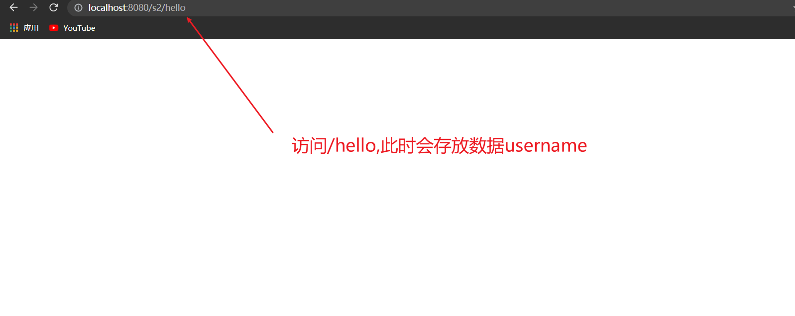

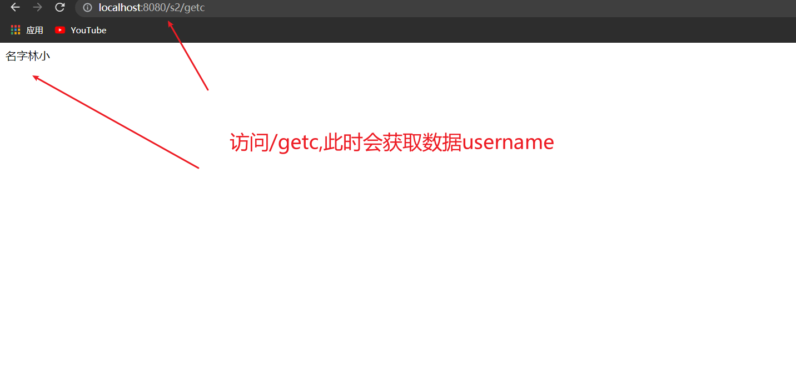


## 2.5、获取初始化参数

- 获取初始化参数：`context.getInitParameter("参数名")`

ServletContext既然被称之为应用上下文对象，所以它的配置是针对整个应用的配置，而非某个特定Servlet的配置。它的配置被称为应用的初始化参数配置。

我们可以在`web.xml`中配置一些web应用初始化参数，在`ServletContext`对象中可以拿到它

配置的方式，需要在`<web-app>`标签中使用`<context-param>`来配置初始化参数。具体代码如下：

> GetInitParameter.java

```java
/**
 * 获取初始化参数
 */
public class GetInitParameter extends HttpServlet {
    @Override
    protected void doGet(HttpServletRequest req, HttpServletResponse resp) throws ServletException, IOException {
        ServletContext context = this.getServletContext();
        String url = context.getInitParameter("url");
        // 将获取到的url打印到网页上
        resp.getWriter().print(url);
    }

    @Override
    protected void doPost(HttpServletRequest req, HttpServletResponse resp) throws ServletException, IOException {
        super.doPost(req, resp);
    }
}
```

> 在web.xml中配置初始化参数和注册servlet映射为 /gp

```xml
<!--配置初始化参数 参数为url,值为 jdbc:mysql://localhost:3306/mybatis  -->
<context-param>
    <!--用于获取初始化参数的key-->
    <param-name>url</param-name>
    <!--初始化参数的值-->
    <param-value>jdbc:mysql://localhost:3306/mybatis</param-value>
</context-param>
<!--每个应用初始化参数都需要用到context-param标签-->
<context-param>
    <param-name>globalEncoding</param-name>
    <param-value>UTF-8</param-value>
</context-param>

<!--注册servlet映射 -->
    <servlet>
        <servlet-name>gp</servlet-name>
        <servlet-class>com.kuang.servlet.GetInitParameter</servlet-class>
    </servlet>
    <servlet-mapping>
        <servlet-name>gp</servlet-name>
        <url-pattern>/gp</url-pattern>
    </servlet-mapping>
</web-app>
```

- 我们访问测试

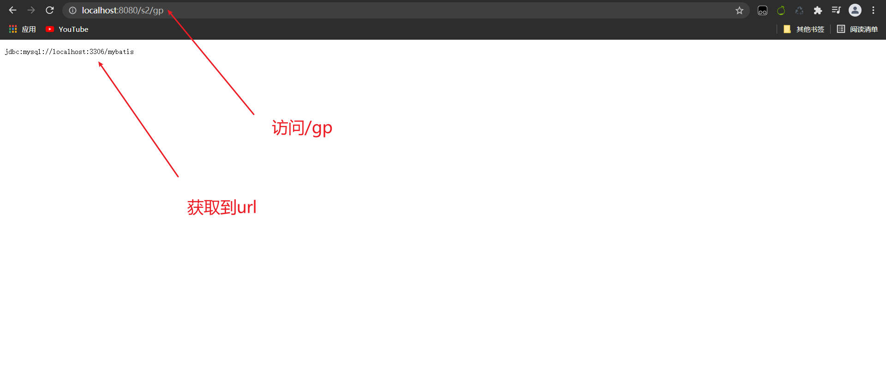


## 2.6、请求转发

- 请求转发：`context.getRequestDispatcher("转发的请求路径").forward(req,resp)`

> GetRequestDispatcher.java

```java
/**
 * 请求转发
 */
public class GetRequestDispatcher extends HttpServlet {
    @Override
    protected void doGet(HttpServletRequest req, HttpServletResponse resp) throws ServletException, IOException {
        System.out.println("进入了GetRequestDispatcher");
        ServletContext context = this.getServletContext();
        //RequestDispatcher requestDispatcher = context.getRequestDispatcher("/gp"); 转发的请求路径
        //requestDispatcher.forward(req,resp); 调用forward实现请求转发；
        context.getRequestDispatcher("/gp").forward(req,resp);

    }

    @Override
    protected void doPost(HttpServletRequest req, HttpServletResponse resp) throws ServletException, IOException {
        super.doPost(req, resp);
    }
}
```

> 在web.xml中配置servlet映射为 /gr

```xml
<!--    请求转发    -->
<servlet>
    <servlet-name>gr</servlet-name>
    <servlet-class>com.kuang.servlet.GetRequestDispatcher</servlet-class>
</servlet>
<servlet-mapping>
    <servlet-name>gr</servlet-name>
    <url-pattern>/gr</url-pattern>
</servlet-mapping>
```

- 测试访问

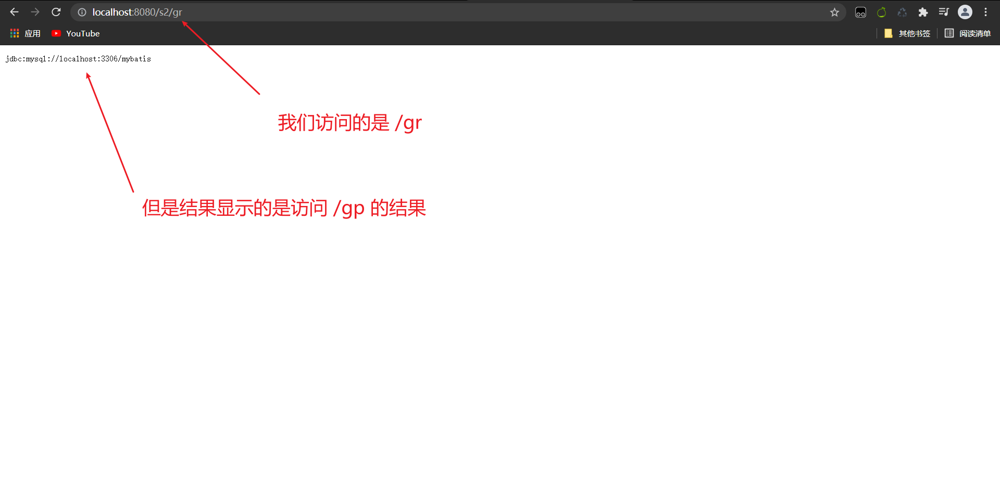

原因：我们请求`/gr`，但是`/gr`通过`getRequestDispatcher`转发到另外一个页面，但是我们访问的路径不变，依旧是`localhost:8080/s2/gr`

### 2.6.1、请求转发的特点

==请求转发的特点：==

1. 浏览器地址栏路径不发生变化
2. 只能转发到当前服务器内部资源中
3. 转发是一次请求

## 2.7、读取资源文件

- 在resources目录下新建db.properties

> db.properties

```properties
username=root12312
password=zxczxczxc
```

> PropertiesServlet.java

```java
/**
 * 读取资源文件properties
 */
public class PropertiesServlet extends HttpServlet {
    @Override
    protected void doGet(HttpServletRequest req, HttpServletResponse resp) throws ServletException, IOException {
        ServletContext context = this.getServletContext();
        // 思路:需要一个文件流
        // 这里的路径:
        InputStream is = context.getResourceAsStream("/WEB-INF/classes/db.properties");
        Properties prop = new Properties();
        prop.load(is);

        String username = prop.getProperty("username");
        String password = prop.getProperty("password");
        resp.getWriter().print(username +":"+password );

    }

    @Override
    protected void doPost(HttpServletRequest req, HttpServletResponse resp) throws ServletException, IOException {
        super.doPost(req, resp);
    }
}

```

- 这里的路径示意图
- 因为java目录和resources目录均被打包至classes目录

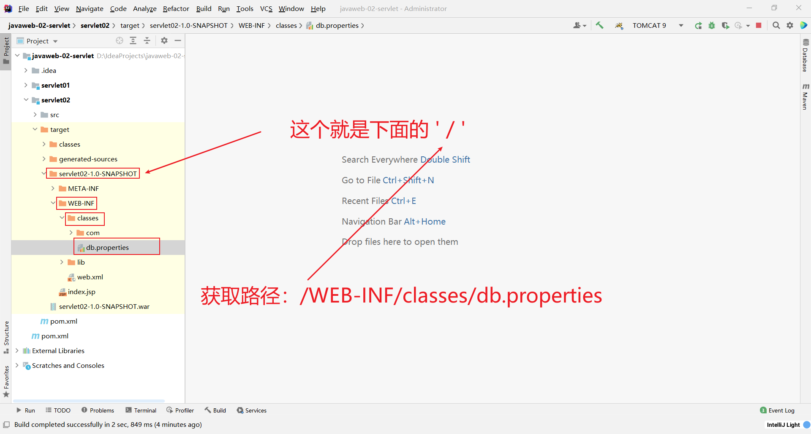


- 去web.xml中配置servlet映射

```xml
<!--    获取资源文件properties    -->
<servlet>
    <servlet-name>pr</servlet-name>
    <servlet-class>com.kuang.servlet.PropertiesServlet</servlet-class>
</servlet>
<servlet-mapping>
    <servlet-name>pr</servlet-name>
    <url-pattern>/pr</url-pattern>
</servlet-mapping>
```

- 测试启动

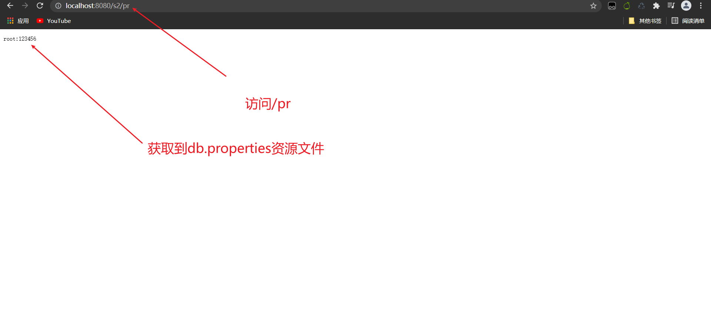


## 2.8、ServletContext常用方法

```java
public class ServletContextDemo extends HttpServlet {
    @Override
    protected void doGet(HttpServletRequest req, HttpServletResponse resp) throws ServletException, IOException {
        //获取ServletContext对象
        ServletContext context = this.getServletContext();

        //获取全局配置的globalEncoding
        String value = context.getInitParameter("globalEncoding");
        System.out.println(value);

        //获取应用的访问虚拟目录
        String contextPath = context.getContextPath();
        System.out.println(contextPath);

        //根据虚拟目录获取应用部署的磁盘绝对路径
        //获取b.txt文件的绝对路径
        String b = context.getRealPath("/b.txt");
        System.out.println(b);

        //获取c.txt文件的绝对路径
        String c = context.getRealPath("/WEB-INF/c.txt");
        System.out.println(c);

        //获取a.txt文件的绝对路径
        String a = context.getRealPath("/WEB-INF/classes/a.txt");
        System.out.println(a);


        //向域对象中存储数据
        context.setAttribute("username","zhangsan");

        //移除域对象中username的数据
        context.removeAttribute("username");
    }

    @Override
    protected void doPost(HttpServletRequest req, HttpServletResponse resp) throws ServletException, IOException {
        doGet(req,resp);
    }
}
```


# 3、HttpServletResponse

web服务器接收到客户端的http请求，针对这个请求，分别创建一个==代表请求== `HttpServletRequest`==对象==，==代表响应==的一个`HttpServletResponse`对象

- 如果要获取客户端**请求**过来的参数：找`HttpServletRequest`
- 如果要给客户端**响应**一些信息：找`HttpServletResponse`

**HttpServletrequest对象和HttpServleresponse对象的原理**

1. request和response对象是由服务器创建的。我们来使用它们
2. request对象是来**获取请求消息**，response对象是来**设置响应消息**

## 3.1、关于响应

响应，它表示了服务器端收到请求，同时也已经处理完成，把处理的结果告知用户。简单来说，指的就是服务器把请求的处理结果告知客户端。在B/S架构中，响应就是把结果带回浏览器。

响应对象，顾名思义就是用于在JavaWeb工程中实现上述功能的对象。

## 3.2、常用方法介绍

在HttpServletResponse接口中提供了很多方法，接下来我们通过API文档，来了解一下这些方法。


## 3.3、常用状态码

| 状态码 |                            说明                            |
| :----: | :--------------------------------------------------------: |
|  200   |                          执行成功                          |
|  302   | 它和307一样，都是用于重定向的状态码。只是307目前已不再使用 |
|  304   |                 请求资源未改变，使用缓存。                 |
|  400   |            请求错误。最常见的就是请求参数有问题            |
|  404   |                       请求资源未找到                       |
|  405   |                      请求方式不被支持                      |
|  500   |                     服务器运行内部错误                     |

## 3.4、状态码首位含义

| 状态码 |    说明    |
| :----: | :--------: |
|  1xx   |    消息    |
|  2xx   |    成功    |
|  3xx   |   重定向   |
|  4xx   | 客户端错误 |
|  5xx   | 服务器错误 |

## 3.5、中文乱码问题

- `resp.setContentType("text/html;charset=UTF-8");`

​		在响应中，如果我们响应的内容中含有中文，则有可能出现乱码，这是因为服务器响应的数据也会经过网络传输，服务器有一种编码方式，在客户端也存在一种编码方式。当两端使用的编码方式不同时则会出现乱码。

​		要解决该种乱码只能在服务器端**告知服务器**使用一种能够支持中文的编码格式，比如我们通常使用的"UTF-8"

```java
// 指定服务器编码
resp.setCharacterEncoding("UTF-8");	
// 指定客户端编码
resp.setHeader("Content-type","text/html;charset=UTF-8");
```

- **以上两端编码的指定也可以使用一句代替，同时指定服务器和客户端(推荐)**

```java
resp.setContentType("text/html;charset=UTF-8");
```

示例：

```java
public void doGet(HttpServletRequest req, HttpServletResponse resp) throws ServletException, IOException {
    resp.setContentType("text/html;charset=UTF-8");
    // 得到字符输出流
    PrintWriter out = resp.getWriter();
    out.write("<h2>你好</h2>");
}
public void doPost(HttpServletRequest req, HttpServletResponse resp)
            throws ServletException, IOException {
        doGet(request, response);
}
```

访问测试：

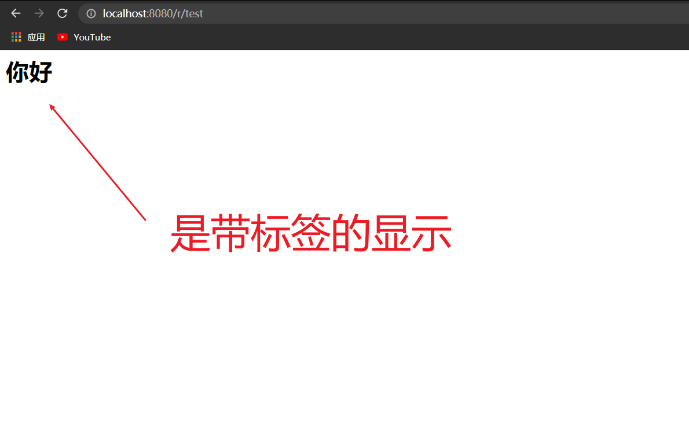


## 3.6、响应数据

接收到客户端的请求后，可以通过 HttpServletResponse 对象直接进行响应，响应时需要获取输出流，服务器输出字符数据到浏览器有两种方法：

步骤：

1. 获取字符输出流
2. 输出数据

> 两种形式

- `resp.getWriter()`:获取字符流(只能响应回字符)
- `resp.getOutputStream()`:获取字节流(能响应一切数据)

==注意：两者不能同时使用==

### 3.6.1、字符输出流

```java
public void doGet(HttpServletRequest req, HttpServletResponse resp) throws ServletException, IOException {

    // 字符输出流(输出字符串)
    PrintWriter writer = resp.getWriter();
    writer.write("hello");
    writer.write("<h2>Hello</h2>");
}
```

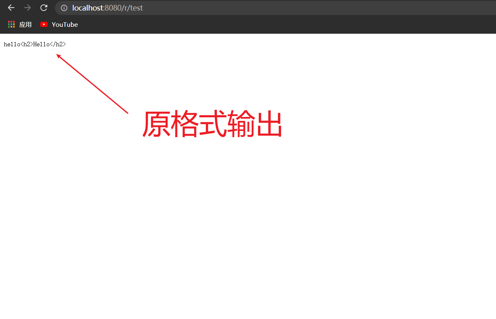

### 3.6.2、字节输出流

```java
public void doGet(HttpServletRequest req, HttpServletResponse resp) throws ServletException, IOException {
    // 字节输出流(输出一切数据)
    ServletOutputStream out = resp.getOutputStream();
    out.write("hello".getBytes());
    out.write("<h2>Hello</h2>".getBytes());
}
```


---

为什么不能带标签式的输出呢？是因为我们没有指定编码，要使服务器输出字符数据到浏览器，必须指定编码，否则就按字符串格式显示在浏览器上

```java
public void doGet(HttpServletRequest req, HttpServletResponse resp) throws ServletException, IOException {
    //中文乱码问题
    resp.setContentType("text/html;charset=UTF-8");
    //字节输出流(输出一切数据)
    PrintWriter writer = resp.getWriter();
    writer.write("hello");
    writer.write("<h1>hello</h1>");
}
```

我们加上指定编码，再次访问此时：

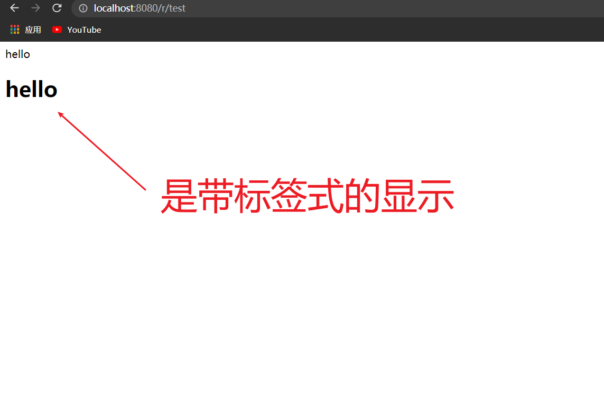


## 3.7、重定向

- 重定向`resp.sendRedirect("请求路径")`
- 请求转发：A想要拿到C中的资源，但是A没法与C连接，A只能与B连接，于是A对B说，B你去C里面给我拿，B就与C建立连接，C把资源给B，B再把资源给A

- 重定向：A连接B说想要拿到C中的资源，B对A说，你去连接C然后拿资源

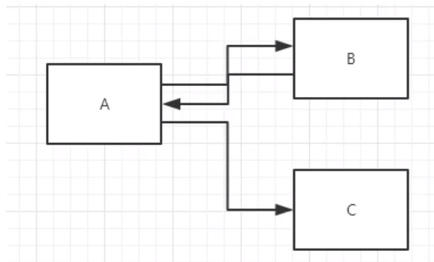


一个web资源B收到客户端A的请求后，它B会通知A客户端去访问另一个web资源C，这个过程叫重定向

常见场景：

- 用户登录

```java
void sendRedirect(String var1);
```

> RedirectServlet.java

```java
/**
 * 实现重定向
 */
public class RedirectServlet extends HttpServlet {
    @Override
    protected void doGet(HttpServletRequest req, HttpServletResponse resp) throws ServletException, IOException {
         /* 重定向的原理
         1.设置响应状态码
        resp.setStatus(302);
         2.设置响应消息头Location
        resp.setHeader("Location","/r/img");
         */
        resp.sendRedirect("/r/img");
    }

    @Override
    protected void doPost(HttpServletRequest req, HttpServletResponse resp) throws ServletException, IOException {
        super.doPost(req, resp);
    }
}
```

- 在web.xml中映射

```xml
<!--    重定向redirect注册映射     '/red'-->
<servlet>
    <servlet-name>redirect</servlet-name>
    <servlet-class>com.kuang.servlet.RedirectServlet</servlet-class>
</servlet>
<servlet-mapping>
    <servlet-name>redirect</servlet-name>
    <url-pattern>/red</url-pattern>
</servlet-mapping>
```

- 测试启动

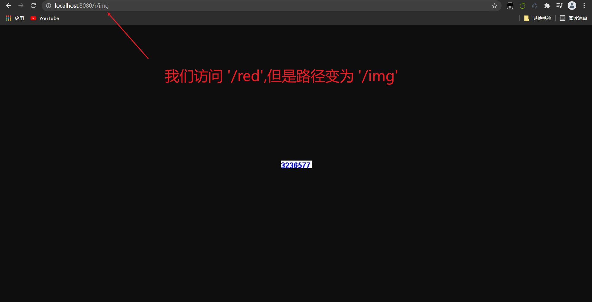


### 3.7.1、重定向的原理

```java
//1.设置响应状态码
response.setStatus(302);
//2.定向到哪里去: 其实就是设置响应消息头，Location
response.setHeader("Location", "/r/img");

//使用重定向方法
response.sendRedirect("/r/img");//此行做了什么事，请看上面
```


## 3.8、设置响应消息头

设置响应消息头控制缓存：`resp.setDateHeader()`

使用缓存的一般都是静态资源
 *  动态资源一般不能缓存。
 *  我们现在目前只掌握了Servlet，所以用Servlet做演示

```java
public class ResponseDemo4 extends HttpServlet {

    public void doGet(HttpServletRequest request, HttpServletResponse response)
            throws ServletException, IOException {
        String str = "设置缓存时间";
        /*
         * 设置缓存时间，其实就是设置响应消息头：Expires 但是值是一个毫秒数。
         * 使用的是
         * 	response.setDateHeader();
         *
         * 缓存1小时，是在当前时间的毫秒数上加上1小时之后的毫秒值
         */
        response.setDateHeader("Expires",System.currentTimeMillis()+1*60*60*1000);
        response.setContentType("text/html;charset=UTF-8");
        response.getOutputStream().write(str.getBytes());
    }

    public void doPost(HttpServletRequest request, HttpServletResponse response)
            throws ServletException, IOException {
        doGet(request, response);
    }

}
```


## 3.9、设置响应消息头定时刷新

设置响应消息头：通过定时刷新演示添加消息头

```java
public class ResponseDemo5 extends HttpServlet {

    public void doGet(HttpServletRequest request, HttpServletResponse response)
            throws ServletException, IOException {
        String str = "用户名和密码不匹配，2秒后转向登录页面...";
        response.setContentType("text/html;charset=UTF-8");
        PrintWriter out = response.getWriter();
        out.write(str);
        //定时刷新，其实就是设置一个响应消息头
        response.setHeader("Refresh", "2;URL=/login.html");//Refresh设置的时间单位是秒，如果刷新到其他地址，需要在时间后面拼接上地址
    }

    public void doPost(HttpServletRequest request, HttpServletResponse response)
            throws ServletException, IOException {
        doGet(request, response);
    }

}
```

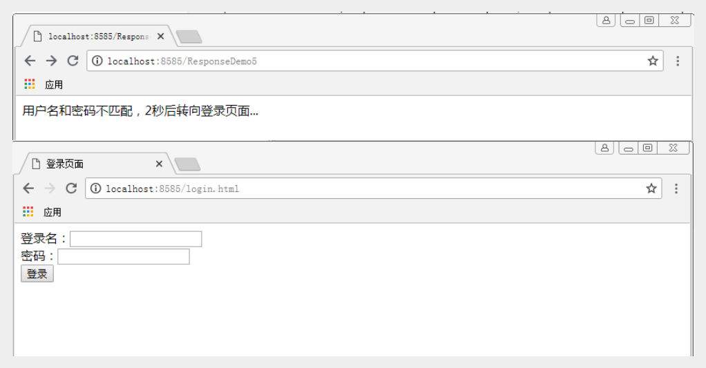


## 3.8、文件下载

首先，在工程的webapp目录下新建一个目录uploads，并且拷贝一张图片（1.jpg）到目录中

文件下载的Servlet代码如下：

```java
public class ResponseDemo8 extends HttpServlet {

    public void doGet(HttpServletRequest request, HttpServletResponse response)
            throws ServletException, IOException {
        /*
         * 文件下载的思路：
         * 		1.获取文件路径
         * 		2.把文件读到字节输入流中
         * 		3.告知浏览器，以下载的方式打开（告知浏览器下载文件的MIME类型）
         * 		4.使用响应对象的字节输出流输出到浏览器上
         */
        //1.获取文件路径（绝对路径）
        ServletContext context = this.getServletContext();
        String filePath = context.getRealPath("/uploads/1.jpg");//通过文件的虚拟路径，获取文件的绝对路径
        //2.通过文件路径构建一个字节输入流
        InputStream in  = new FileInputStream(filePath);
        //3.设置响应消息头
        response.setHeader("Content-Type", "application/octet-stream");//注意下载的时候，设置响应正文的MIME类型，用application/octet-stream
        response.setHeader("Content-Disposition", "attachment;filename=1.jpg");//告知浏览器以下载的方式打开
        //4.使用响应对象的字节输出流输出
        OutputStream out = response.getOutputStream();
        int len = 0;
        byte[] by = new byte[1024];
        while((len = in.read(by)) != -1){
            out.write(by, 0, len);
        }
        in.close();
    }

    public void doPost(HttpServletRequest request, HttpServletResponse response)
            throws ServletException, IOException {
        doGet(request, response);
    }

}
```

## 3.9、生成验证码

响应-生成验证码

```java
public class ResponseDemo3 extends HttpServlet {

    /**
     * 输出图片
     * @param request
     * @param response
     * @throws ServletException
     * @throws IOException
     */
    public void doGet(HttpServletRequest request, HttpServletResponse response)
            throws ServletException, IOException {
        int width = 200;
        int height = 35;
        /**
         * 实现步骤:
         * 	1.创建图像内存对象
         *  2.拿到画笔
         *  3.设置颜色，画矩形边框
         *  4.设置颜色，填充矩形
         *  5.设置颜色，画干扰线
         *  6.设置颜色，画验证码
         *  7.把内存图像输出到浏览器上
         */
        //创建内存图像
        BufferedImage image = new BufferedImage(width,height,BufferedImage.TYPE_INT_RGB);//参数：宽度，高度 （指的都是像素），使用的格式（RGB）
        Graphics g = image.getGraphics();//画笔就一根

        //设置颜色
        g.setColor(Color.BLUE);
        //画边框
        g.drawRect(0, 0, width, height);

        //设置颜色
        g.setColor(Color.GRAY);
        //填充矩形
        g.fillRect(1, 1, width-2, height-2);

        //设置颜色
        g.setColor(Color.WHITE);
        //拿随机数对象
        Random r = new Random();
        //画干扰线 10条
        for(int i=0;i<10;i++){
            g.drawLine(r.nextInt(width), r.nextInt(height),r.nextInt(width), r.nextInt(height));
        }

        //设置颜色
        g.setColor(Color.RED);
        //改变字体大小
        Font font = new Font("宋体", Font.BOLD,30);//参数：1字体名称。2.字体样式 3.字体大小
        g.setFont(font);//设置字体
        //画验证码	4个
        int x = 35;//第一个数的横坐标是35像素
        for(int i=0;i<4;i++){
            //r.nextInt(10)+""这种写法效率是十分低的
            g.drawString(String.valueOf(r.nextInt(10)), x, 25);
            x+=35;
        }

        //输出到浏览器上
        //参数： 1.内存对象。2.输出的图片格式。3.使用的输出流
        ImageIO.write(image, "jpg", response.getOutputStream());
    }

    public void doPost(HttpServletRequest request, HttpServletResponse response)
            throws ServletException, IOException {
        doGet(request, response);
    }

}
```

## 3.10、面试题

| 请求转发(req.getRequestDispatcher().forward()) | 重定向(resp.sendRedirect()) |
| ---------------------------------------------- | --------------------------- |

- 请求转发的地址栏不会发送改变，重定向的地址栏会发送改变

- 请求转发只有一次请求，重定向有两次请求

- 请求转发 request 对象可共享，重定向时 request 对象不共享

- 请求转发是服务器行为，重定向是客户端行为

- 请求转发时的地址只能是当前站点(当前项目)的资源，重定向时可以是任何地址


两者都可进行跳转，根据实际需求选取即可

- 重定向的原理

```java
resp.setHeader("Location","/r/img");
resp.setStatus(302);
```


## 3.11、Response登录案例

> index.jsp

```jsp
<html>
<body>
<h2>Hello World!</h2>
<%--这里提交的路径，需要寻找到项目的路径--%>
<%--${pageContext.request.contextPath}代表当前的web项目--%>
<form action="${pageContext.request.contextPath}/login" method="get">
    用户名:<input type="text" name="username"><br>
    密码:<input type="password" name="password"><br>
    <input type="submit">
</form>
</body>
</html>
```

> RequestTest.java

```java
/**
 * 简单的登录小案例
 */
public class RequestTest extends HttpServlet {
    @Override
    protected void doGet(HttpServletRequest req, HttpServletResponse resp) throws ServletException, IOException {
        // 设置utf-8编码,网站不乱码
        resp.setCharacterEncoding("utf-8");
        // 获取index.jsp中的参数
        String username = req.getParameter("username");
        String password = req.getParameter("password");
        System.out.println(username + ":" + password);
        // 重定向,注意路径问题,否则会404
        resp.sendRedirect("/r/success.jsp");
       
    }
    @Override
    protected void doPost(HttpServletRequest req, HttpServletResponse resp) throws ServletException, IOException {
        super.doPost(req, resp);
    }
}
```

- 在web.xml中注册servlet映射

```xml
<servlet>
    <servlet-name>request</servlet-name>
    <servlet-class>com.kuang.servlet.RequestTest</servlet-class>
</servlet>
<servlet-mapping>
    <servlet-name>request</servlet-name>
    <url-pattern>/login</url-pattern>
</servlet-mapping>
```

- 访问测试

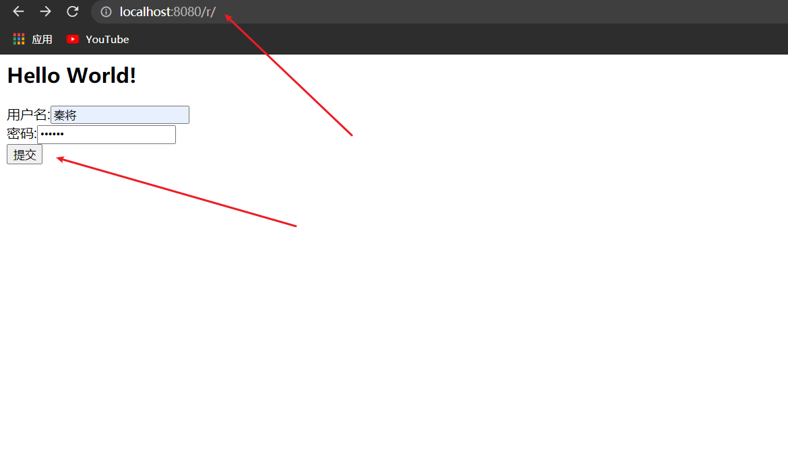

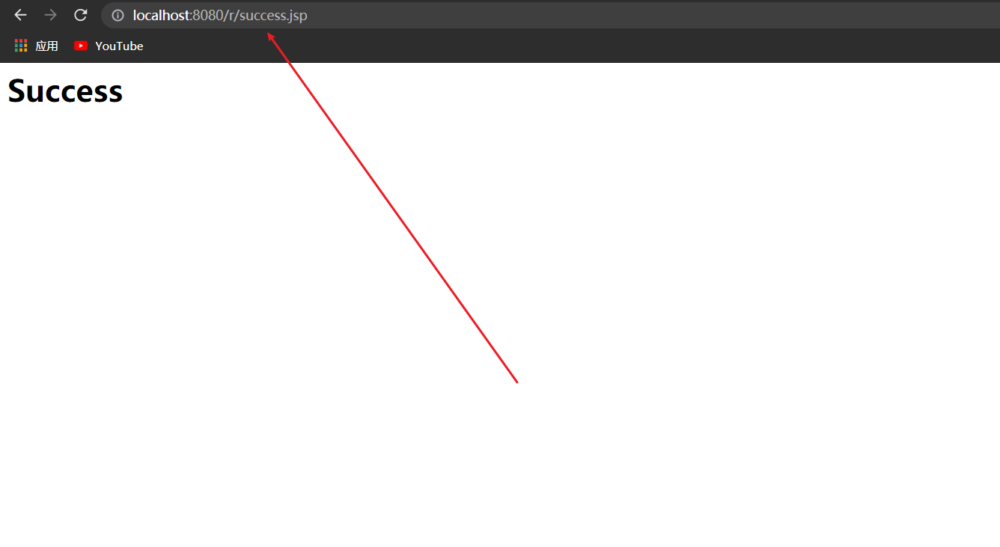

控制台输出用户名和密码


# 4、HttpServletRequest

HttpServletRequest代表客户端的请求，用户通过Http协议访问服务器，HTTP请求中的所有信息会被封装到HttpServletRequest中

HttpServletRequest对象：==主要作用是用来接收客户端发送过来的请求信息==

例如：请求的参数，发送的头信息等都属于客户端发来的信息


## 4.1、常用方法介绍


## 4.2、获取各种路径

```java
/**
 * 请求对象的各种信息获取
 * @author 黑马程序员
 * @Company http://www.itheima.com
 */
public class RequestDemo1 extends HttpServlet {

    public void doGet(HttpServletRequest request, HttpServletResponse response)
            throws ServletException, IOException {

        //本机地址：服务器地址
        String localAddr = request.getLocalAddr();
        //本机名称：服务器名称
        String localName = request.getLocalName();
        //本机端口：服务器端口
        int localPort = request.getLocalPort();
        //来访者ip
        String remoteAddr = request.getRemoteAddr();
        //来访者主机
        String remoteHost = request.getRemoteHost();
        //来访者端口
        int remotePort = request.getRemotePort();
        //统一资源标识符
        String URI = request.getRequestURI();
        //统一资源定位符
        String URL = request.getRequestURL().toString();
        //获取查询字符串
        String queryString = request.getQueryString();
        //获取Servlet映射路径
        String servletPath = request.getServletPath();

        //输出内容
		System.out.println("getLocalAddr() is :"+localAddr);
		System.out.println("getLocalName() is :"+localName);
		System.out.println("getLocalPort() is :"+localPort);
		System.out.println("getRemoteAddr() is :"+remoteAddr);
		System.out.println("getRemoteHost() is :"+remoteHost);
		System.out.println("getRemotePort() is :"+remotePort);
		System.out.println("getRequestURI() is :"+URI);
		System.out.println("getRequestURL() is :"+URL);
        System.out.println("getQueryString() is :"+queryString);
        System.out.println("getServletPath() is :"+servletPath);
    }

    public void doPost(HttpServletRequest request, HttpServletResponse response)
            throws ServletException, IOException {
        doGet(request, response);
    }
}
```


## 4.1、获取请求行数据

- 获取虚拟目录：也就是tomcat中的虚拟目录，例如/r   
  - `String getContextPath()`
- 获取Servlet路径:  就是在web.xml中注册的servlet映射，例如/hello
  - `String getServletPath()`
- 获取请求URI：/s1/hello   
  - `String getRequestURI():`    /s1/hello
  - `StringBuffer getRequestURL()`   http://localhost/s1/hello

## 4.1、获取请求参数

- `req.getParameter(String name)`:根据参数名称获取参数值    

- `req.getParameterValues(String name)`:根据参数名称获取参数值的数组  

## 4.3、中文乱码问题

- `req.setCharacterEncoding("utf-8")`

- get方式：tomcat 8 已经将get方式乱码问题解决了
- post方式：会乱码
  - 解决在获取参数前，设置req的编码`req.setCharacterEncoding("utf-8")`

```java
req.setCharacterEncoding("utf-8");
```

## 4.4、请求转发

​		请求转发，是一种==服务器的行为==，当客户端请求到达后，服务器进行转发，此时会将请求对象进行保存，地址栏中的==URL地址不会变==，得到相应后，服务器再将响应发送给客户端，==从始至终只有一个请求发出,request数据可以共享==

步骤：

- 通过request对象获取请求转发器对象：` getRequestDispatcher(String path)`
- 使用RequestDispatcher对象来进行转发：`forward(ServletRequest request, ServletResponse response) `

```java
req.getRequestDispatcher("/gp").forward(req,resp);
```


> index.jsp

```jsp
<%@ page contentType="text/html;charset=UTF-8" language="java" %>
<html>
<head>
    <title>登录</title>
</head>
<body>
<h1>登录</h1>
<div style="text-align: center">
<%--    这里表单表示的意思：以post方式提交表单，提交到我们的login请求--%>
<%--    ${pageContext.request.contextPath}代表我们的web项目--%>
    <form action="${pageContext.request.contextPath}/login" method="post">
            用户名:<input type="text" name="username"><br>
            密码:<input type="password" name="password"><br>
            爱好:
            <input type="checkbox" name="hobbies" value="女孩">女孩
            <input type="checkbox" name="hobbies" value="代码">代码
            <input type="checkbox" name="hobbies" value="唱歌">唱歌
            <input type="checkbox" name="hobbies" value="电影">电影
            <br>
            <input type="submit">
    </form>
</div>
</body>
</html>
```

> LoginServlet.java

```java
public class LoginServlet extends HttpServlet {
    @Override
    protected void doGet(HttpServletRequest req, HttpServletResponse resp) throws ServletException, IOException {
        req.setCharacterEncoding("utf-8");
        resp.setCharacterEncoding("utf-8");

        String username = req.getParameter("username");
        String password = req.getParameter("password");
        String[] hobbies = req.getParameterValues("hobbies");
        System.out.println("----------------");
        System.out.println(username);
        System.out.println(password);
        System.out.println(Arrays.toString(hobbies));
        System.out.println("----------------");


        // 通过请求转发
        // 这里的 / 代表当前的web应用
        req.getRequestDispatcher("/success.jsp").forward(req,resp);

    }

    @Override
    protected void doPost(HttpServletRequest req, HttpServletResponse resp) throws ServletException, IOException {
        doGet(req, resp);
    }
}
```


