# 1.Tomcat

## 1.1、安装Tomcat

- tomcat官网：http://tomcat.apache.org/

- 建议下载Tomcat9

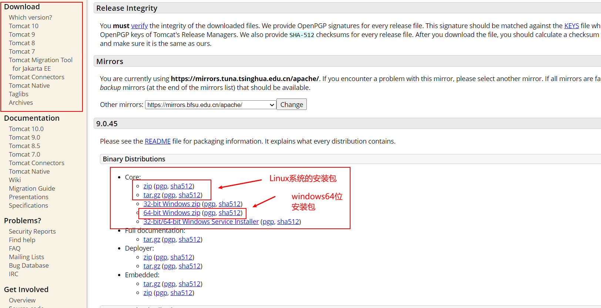


2. **下载解压**


## 1.2、Tomcat启动

- 文件夹作用：

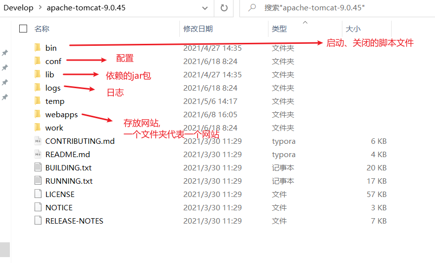

- 打开bin文件夹
- **启动startup.bat**

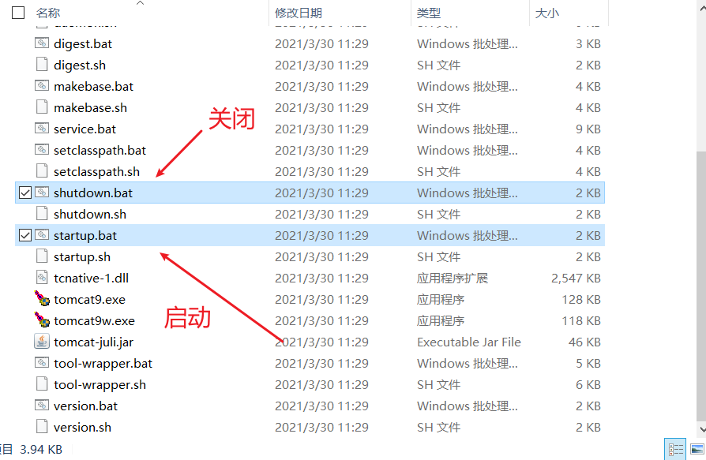

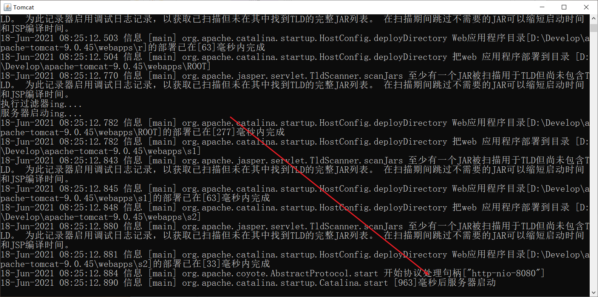

- 如图，启动成功

- 访问测试：http://localhost:8080/
- **关闭tomcat服务器shutdown.bat**


## 1.3、Tomcat配置

- Tomcat可以进行配置,一般不进行配置，用默认的配置即可

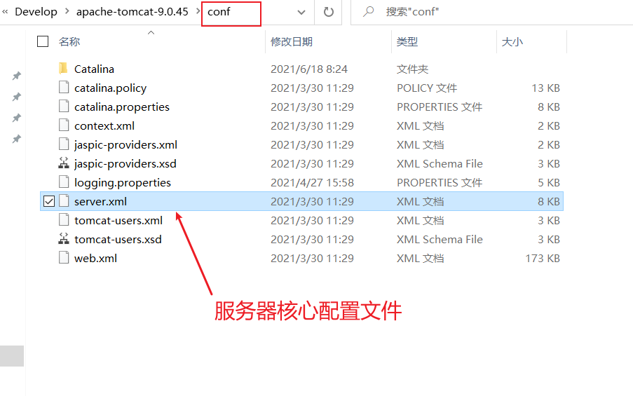

- 我们可以打开服务器核心配置文件`server.xml`，里面有这么几行代码值得注意

```xml
<Connector port="8080" protocol="HTTP/1.1"
               connectionTimeout="20000"
               redirectPort="8443" />
...
...
...
<Host name="localhost"  appBase="webapps"
            unpackWARs="true" autoDeploy="true">
```

**可以配置启动的端口号**：

- tomcat的默认端口号为：8080
- mysql的默认端口号为：3306
- http的默认端口号为：80
- https的默认端口号为：443

**可以配置主机的名称**：

- 默认的主机名为：`localhost`也就是`127.0.0.1`
- 默认网站应用存放的位置为：`webapps`
- 我们上面测试的http://localhost:8080/，其网站内容就在我们`webapps/ROOT`目录下


## 1.4、测试修改端口

1. 我们将tomcat的端口号改为8081

```xml
<Connector port="8081" protocol="HTTP/1.1"
               connectionTimeout="20000"
               redirectPort="8443" />
```

2. **启动startup.bat**
3. 访问：http://localhost:8080/，发现找不到网页
4. 访问：http://localhost:8081/，发现可以进去此网页

5. **关闭tomcat服务器shutdown.bat**
6. 将tomcat的端口号改回8080


## 1.5、测试修改主机

1. 我们将主机 `localhost` 改为 `www.qxl.com`

```xml
<Host name="www.qxl.com"  appBase="webapps"
            unpackWARs="true" autoDeploy="true">
```

2. **启动startup.bat**
3. 访问：http://www.qxl.com:8080/, 发现找不到网页？？？？？？？那为什么我们输入www.baidu.com 就可以访问，难道是因为我们没有买域名吗？真的是这样的？

4. 我们打开==C:\Windows\System32\drivers\etc\hosts==文件

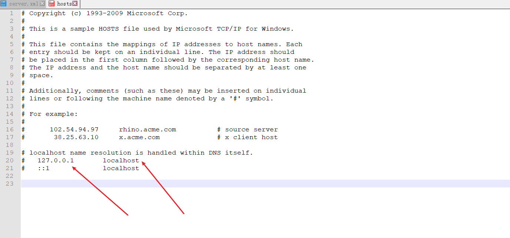

可以看到，我们将 127.0.0.1 映射到 localhost，这就是为什么我们访问 http://localhost:8080/ 和访问 http://127.0.0.1:8080/ 显示的界面是一样的

5. 我们修改127.0.0.1映射，修改为`www.qxl.com`
6. **启动startup.bat**
7. 我们访问：http://www.qxl.com:8080/，此时发现可以显示网页

8. **我们将一切改为原样，关闭tomcat服务器shutdown.bat**


思考：==我们买域名了吗？没有！那我们可以自己访问自己创建的域名吗？可以！！！！==


## 1.6、阿里四面题

> 高难度面试题

==请你谈谈网站是如何进行访问的！==

1. 输入一个域名；回车
2. 检查本机的 C:\Windows\System32\drivers\etc\hosts配置文件下有没有这个域名映射；
   - 有：直接返回对应的ip地址，这个地址中，有我们需要访问的web程序，可以直接访问
   - 没有：去DNS服务器找，找到的话就返回，找不到就返回找不到；


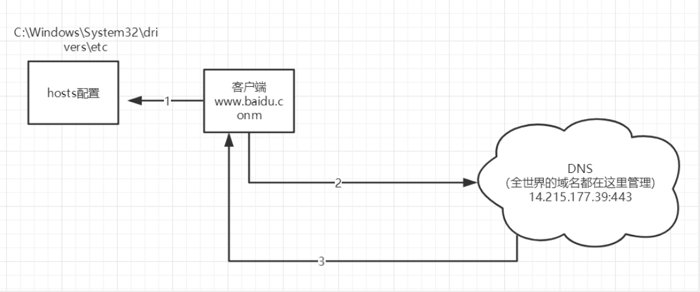


## 1.7、发布一个web网站

1. 那既然我们有了上述知识原理，我们想要自己发布一个web网站该如何做呢？
2. 模仿！！！！
3. 我们打开`webapps`,这里面每一个文件夹就是一个网页，我们复制粘贴`ROOT`文件夹，重命名为`qxl`
4. `qxl`里面的东西能不能删？直接删，但是要记得`WEB-INF`里面的`web.xml`不能删
5. 我们新建`index.html`,放入如下代码

```html
<!DOCTYPE html>
<html lang="en">

<head>
    <meta charset="UTF-8">
    <meta http-equiv="X-UA-Compatible" content="IE=edge">
    <meta name="viewport" content="width=device-width, initial-scale=1.0">
    <title>Document</title>
</head>

<body>
    <h1>Hello World</h1>
</body>

</html>
```

6. 我们启动Tomcat服务器
7. 访问：http://localhost:8080/index.html，访问成功


## 1.8、网站应有的目录结构

- webapps：Tomcat服务器的web目录
  - ROOT
  - qxl：网站的目录名
    - WEB-INF
      - classes：java程序
      - lib：web应用所依赖的jar包
      - web.xml
    - index.html 默认的首页
    - static
      - css	
      - js
      - img
    - ...


## 1.9、IDEA集成Tomcat

- IDEA右上角锤子符号右边 Edit Configurations

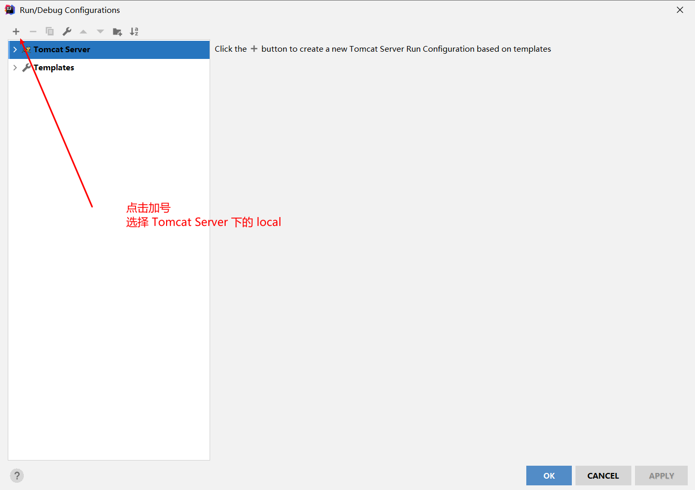


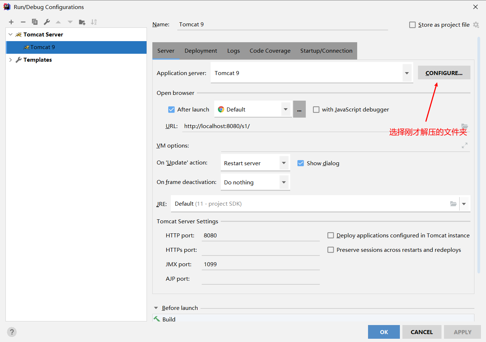


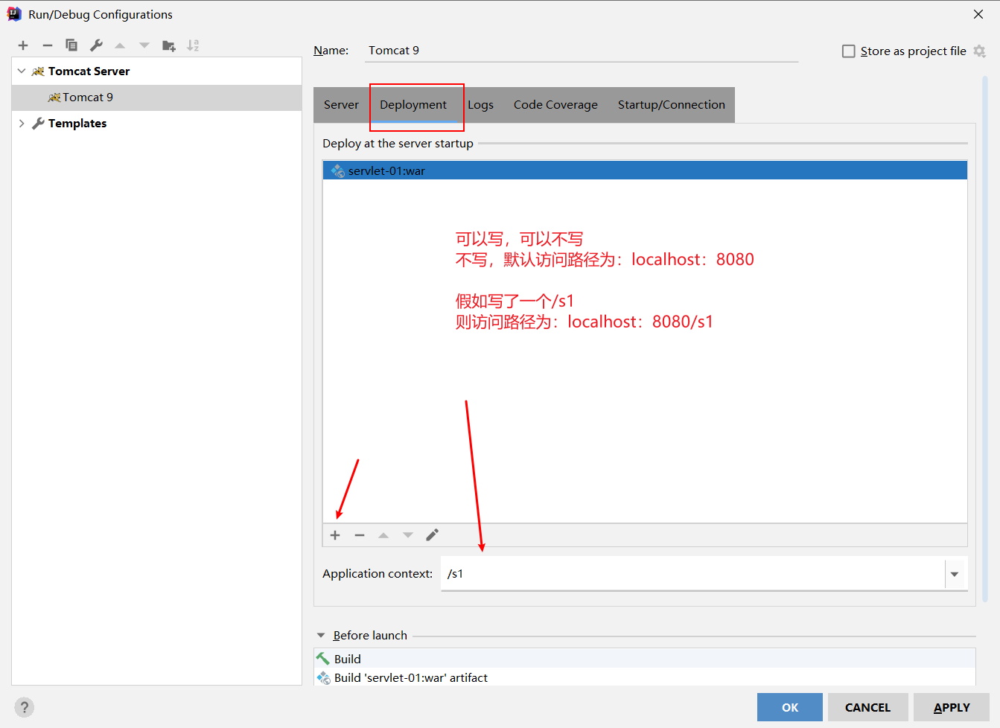


确定，配置完成


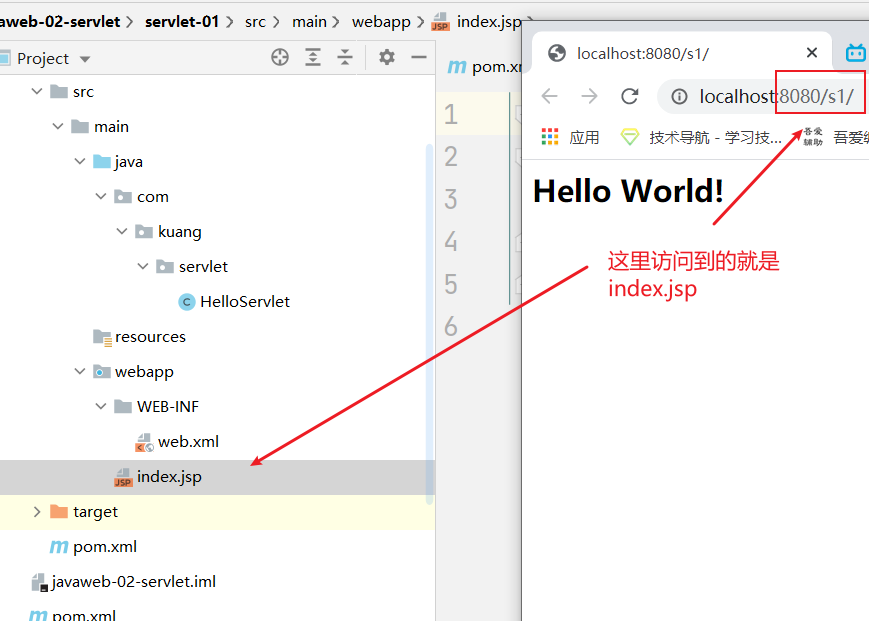


## 1.10、Tomcat可能出现的问题

> Tomcat启动乱码

- conf/logging.xml 

- 设置

- ```xml
  java.util.logging.ConsoleHandler.encoding = GBK
  ```


> Tomcat启动黑窗口一闪而过

- 原因：没有正确配置JAVA_HOME环境变量
- 解决方案：正确配置JAVA_HOME环境变量
- bin/startup.bat   右键记事本打开
- **把倒数第二句的start换成run**
- **在最后面加入pause，这个单词是防止黑窗口自动关闭的，黑窗口开启遇到意外就会停止**
- **然后双击startup.bat运行，这个时候黑窗口会暂停下来**，可以查看报错提示原因


