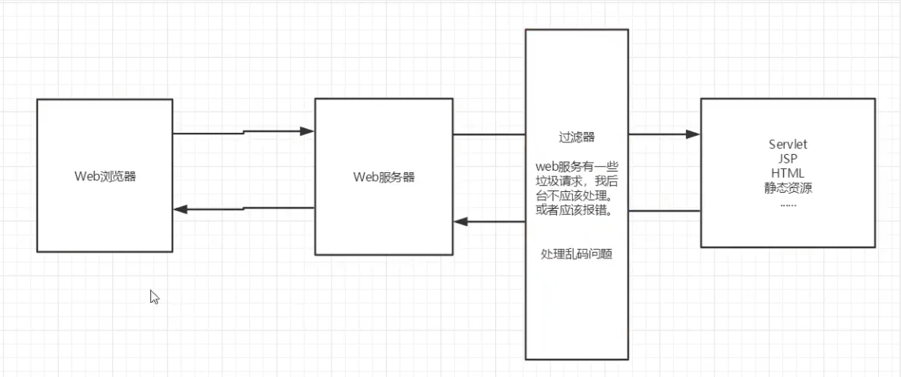
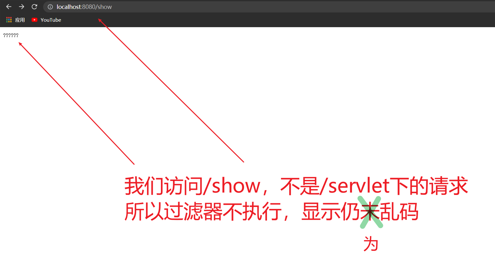
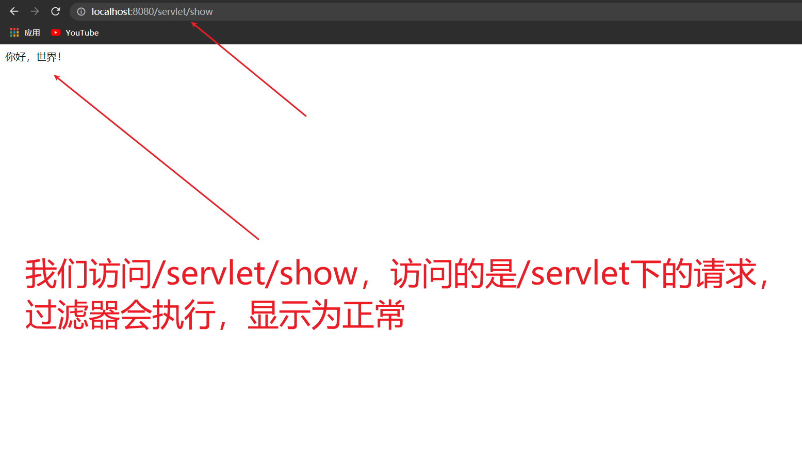
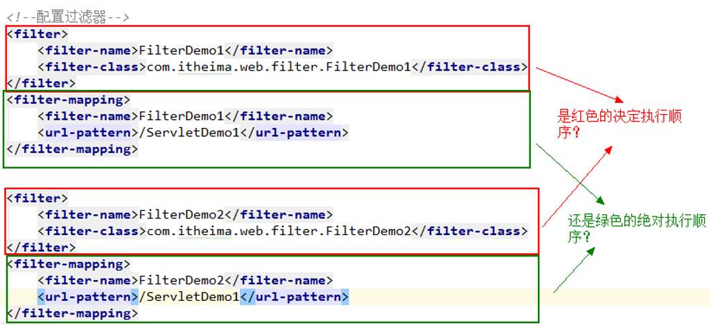

# 1、过滤器Filter

## 1.1、过滤器概念及作用

- 过滤器——Filter，它是JavaWeb三大组件之一。另外两个是Servlet和Listener。

- 它是在2000年发布的Servlet2.3规范中加入的一个接口。是Servlet规范中非常实用的技术。

- 它可以对web应用中的所有资源进行拦截，并且在拦截之后进行一些特殊的操作。

- 常见应用场景：登录验证；过滤敏感词汇；中文乱码问题等等。




## 1.2、步骤

1. 导包
   - javax.servlet.jsp-api
   - servlet-api
   - jstl-api
   - standard

```xml
  <dependencies>
        <dependency>
            <groupId>javax.servlet</groupId>
            <artifactId>servlet-api</artifactId>
            <version>2.5</version>
        </dependency>
        <dependency>
            <groupId>javax.servlet.jsp</groupId>
            <artifactId>javax.servlet.jsp-api</artifactId>
            <version>2.3.3</version>
        </dependency>
        <dependency>
            <groupId>javax.servlet.jsp.jstl</groupId>
            <artifactId>jstl-api</artifactId>
            <version>1.2</version>
        </dependency>
        <dependency>
            <groupId>taglibs</groupId>
            <artifactId>standard</artifactId>
            <version>1.1.2</version>
        </dependency>
```

2. 定义一个类，实现接口`Filter`

3. 复写方法
4. 在web.xml中配置拦截路径


## 1.3、字符编码过滤器

编写一个字符编码过滤器，我们想要通过过滤器来解决中文乱码问题

先编写一个没有配置编码的 Servlet

> ShowServlet.java

```java
public class ShowServlet extends HttpServlet {
    @Override
    protected void doGet(HttpServletRequest req, HttpServletResponse resp) throws ServletException, IOException {
        // 这里没有配置编码,打印在网站上会乱码
        resp.getWriter().write("你好，世界！");
    }

    @Override
    protected void doPost(HttpServletRequest req, HttpServletResponse resp) throws ServletException, IOException {
        doGet(req, resp);
    }
}
```

- 在web.xml中注册servlet映射
  - **一个Servlet可以指定多个映射路径**

```xml
<servlet>
    <servlet-name>ShowServlet</servlet-name>
    <servlet-class>com.kuang.servlet.ShowServlet</servlet-class>
</servlet>
<servlet-mapping>
    <servlet-name>ShowServlet</servlet-name>
    <url-pattern>/servlet/show</url-pattern>
</servlet-mapping>
<servlet-mapping>
    <servlet-name>ShowServlet</servlet-name>
    <url-pattern>/show</url-pattern>
</servlet-mapping>
```

好了，Demo写好之后我们就可以编写字符编码过滤器了

1. 定义一个类，实现接口`Filter`，复写方法

> CharacterEncodingFilter.java

```java
// 字符编码过滤器
public class CharacterEncodingFilter implements Filter {
    // 初始:web服务器启动，就已经初始化了，随时等待过滤对象出现！
    @Override
    public void init(FilterConfig filterConfig) throws ServletException {
        System.out.println("CharacterEncodingFilter初始化！");
    }

    @Override
    public void doFilter(ServletRequest servletRequest, ServletResponse servletResponse, FilterChain filterChain) throws IOException, ServletException {
        // Chain:链
        // 1.过滤器中的所有代码，在过滤特定请求的时候都会执行
        // 2.必须要让所有过滤器继续同行 filterChain.doFilter(servletRequest,servletResponse)

        servletRequest.setCharacterEncoding("utf-8");
        servletResponse.setCharacterEncoding("utf-8");
        servletResponse.setContentType("text/html;charset=UTF-8");
        
        System.out.println("CharacterEncodingFilter执行前");
        filterChain.doFilter(servletRequest,servletResponse); // 让我们的请求继续走，如果不写，程序到这里就被拦截了
        System.out.println("CharacterEncodingFilter执行后");

    }

    // 销毁
    @Override
    public void destroy() {
        System.out.println("CharacterEncodingFilter销毁");
    }
}
```

2. 在web.xml中配置拦截路径
   - 只要是/servlet下面的任何请求,都会经过这个过滤器

```xml
<filter>
    <filter-name>CharacterEncodingFilter</filter-name>
    <filter-class>com.kuang.filter.CharacterEncodingFilter</filter-class>
</filter>
<filter-mapping>
    <filter-name>CharacterEncodingFilter</filter-name>
<!--        只要是/servlet下面的任何请求,都会经过这个过滤器    -->
    <url-pattern>/servlet/*</url-pattern>

</filter-mapping>
```








## 1.4、过滤器生命周期方法

- `init`:在服务器启动后，会创建Filter对象，然后调用init方法。只执行一次。用于加载资源
- `doFilter`:每一次请求被拦截资源时，会执行。执行多次
- `destroy`:在服务器关闭后，Filter对象被销毁。如果服务器是正常关闭，则会执行destroy方法。只执行一次。用于释放资源


## 1.5、过滤器配置详解

**拦截路径配置**：

- 具体资源路径： /index.jsp   只有访问index.jsp资源时，过滤器才会被执行
- 拦截目录： /user/*	访问/user下的所有资源时，过滤器都会被执行
- 后缀名拦截： *.jsp		访问所有后缀名为jsp资源时，过滤器都会被执行
- 拦截所有资源：/*		访问所有资源时，过滤器都会被执行


## 1.6、多个过滤器的执行顺序



在过滤器的配置中，有过滤器的声明和过滤器的映射两部分，到底是声明决定顺序，还是映射决定顺序呢？

- <font color='red'><b>`<filter-mapping>`的配置前后顺序决定过滤器的调用顺序，也就是由映射配置顺序决定。</b></font>


## 1.7、过滤器的五种拦截行为

我们的过滤器目前拦截的是请求，但是在实际开发中，我们还有请求转发和请求包含，以及由服务器触发调用的全局错误页面。默认情况下过滤器是不参与过滤的，要想使用，需要我们配置。配置的方式如下：

```xml
<!--配置过滤器-->
<filter>
    <filter-name>FilterDemo1</filter-name>
    <filter-class>com.itheima.web.filter.FilterDemo1</filter-class>
    <!--配置开启异步支持，当dispatcher配置ASYNC时，需要配置此行-->
    <async-supported>true</async-supported>
</filter>
<filter-mapping>
    <filter-name>FilterDemo1</filter-name>
    <url-pattern>/ServletDemo1</url-pattern>
    <!--过滤请求：默认值。-->
    <dispatcher>REQUEST</dispatcher>
    <!--过滤全局错误页面：当由服务器调用全局错误页面时，过滤器工作-->
    <dispatcher>ERROR</dispatcher>
    <!--过滤请求转发：当请求转发时，过滤器工作。-->
    <dispatcher>FORWARD</dispatcher>
    <!--过滤请求包含：当请求包含时，过滤器工作。它只能过滤动态包含，jsp的include指令是静态包含-->
    <dispatcher>INCLUDE</dispatcher>
    <!--过滤异步类型，它要求我们在filter标签中配置开启异步支持-->
    <dispatcher>ASYNC</dispatcher>
</filter-mapping>
```


## 1.8、过滤器与Servlet的区别

| 方法/类型                                          | Servlet                                                      | Filter                                                       | 备注                                                         |
| -------------------------------------------------- | ------------------------------------------------------------ | ------------------------------------------------------------ | ------------------------------------------------------------ |
| 初始化                                        方法 | `void   init(ServletConfig);   `                             | `void init(FilterConfig);   `                                | 几乎一样，都是在web.xml中配置参数，用该对象的方法可以获取到。 |
| 提供服务方法                                       | `void   service(request,response);                                               ` | `void   dofilter(request,response,FilterChain);                                   ` | Filter比Servlet多了一个FilterChain，它不仅能完成Servlet的功能，而且还可以决定程序是否能继续执行。所以过滤器比Servlet更为强大。   在Struts2中，核心控制器就是一个过滤器。 |
| 销毁方法                                           | `void destroy();`                                            | `void destroy();`                                            |                                                              |

# 2、监听器Listener

## 2.1、ServletContextListener

ServletContextListener：监听 ServletContext 对象的创建和销毁

## 2.2、步骤

1. 定义一个类，实现 ServletContextListener 接口，复写方法

```java
public class ContextLoaderListener implements ServletContextListener {
    /**
     * 监听 ServletContext 对象创建。ServletContext 对象服务器启动后自动创建
     * 在服务器启动后自动调用
     * @param servletContextEvent
     */
    @Override
    public void contextInitialized(ServletContextEvent servletContextEvent) {
        System.out.println("ServletContext 对象被创建了...");
    }

    /**
     * 服务器关闭后,ServletContext 对象被销毁。当服务器正常关闭后该方法被调用
     * @param servletContextEvent
     */
    @Override
    public void contextDestroyed(ServletContextEvent servletContextEvent) {
        System.out.println("ServletContext 对象被销毁了...");
    }
}

```

2. 在 web.xml 中配置

```xml
<!--    配置监听器  -->
<listener>
    <listener-class>com.kuang.listener2.ContextLoaderListener</listener-class>
</listener>
```


## 2.3、加载资源文件

我们一般很少用 监听器，一般在监听器中加载资源文件

```java
public class ContextLoaderListener implements ServletContextListener {
    /**
     * 监听 ServletContext 对象创建。ServletContext 对象服务器启动后自动创建
     * 在服务器启动后自动调用
     * @param servletContextEvent
     */
    @Override
    public void contextInitialized(ServletContextEvent servletContextEvent) {
        // 加载资源文件
        // 1.获取ServletContext对象
        ServletContext servletContext = servletContextEvent.getServletContext();
        // 2.加载资源文件
        String contextConfigLocation = servletContext.getInitParameter("contextConfigLocation");
        // 3.获取真实路径
        String realPath = servletContext.getRealPath(contextConfigLocation);

        // 4.加载进内存
        try {
            FileInputStream is = new FileInputStream(realPath);
            System.out.println(is);
        } catch (Exception e) {
            e.printStackTrace();
        }
        System.out.println("ServletContext 对象被创建了...");
    }

    /**
     * 服务器关闭后,ServletContext 对象被销毁。当服务器正常关闭后该方法被调用
     * @param servletContextEvent
     */
    @Override
    public void contextDestroyed(ServletContextEvent servletContextEvent) {
        System.out.println("ServletContext 对象被销毁了...");
    }
}
```

在 web.xml 中配置初始化参数

```xml
<!--    指定初始化参数  -->
<context-param>
    <param-name>contextConfigLocation</param-name>
    <param-value>/WEB-INF/classes/applicationContext.xml</param-value>
</context-param>
```


