# 0、JavaBean

JavaBean就是实体类。是特殊的 Java 类，使用 Java 语言书写，并且遵守 JavaBean API 规范。

JavaBean有特定的写法：

- 必须要有一个无参构造
- 属性必须私有化
- 必须有对应的get/set方法

JavaBean一般用来和数据库的字段做映射

- 数据库中的表对应java中的类
- 表中的字段对应java类中的属性
- 表中的行记录对应java创建的对象

例如：这是数据库的一张**people表**

| id   | name    | age  | address |
| ---- | ------- | ---- | ------- |
| 1    | 秦疆1号 | 3    | 西安    |
| 2    | 秦疆2号 | 18   | 西安    |
| 3    | 秦疆3号 | 100  | 西安    |

```java
class People{
    private int id;
    private String name;
    private int id;
    private String address;
}

class A{
    new People(1,"秦疆1号",3，"西安");
    new People(2,"秦疆2号",3，"西安");
    new People(3,"秦疆3号",3，"西安");
}
```


## 1.1、实体类的包名

对于JavaBean实体类的包名，我们有以下建立的方式：

1. com.XXX.pojo
2. com.XXX.entity
3. com.XXX.dto
4. com.XXX.vo


## 1.2、实体类

JavaBean实体类一般用来和数据库的字段做映射，例如，我们创建一个People类

```java
public class People {
    private int id;
    private int age;
    private String address;
    // 无参构造
    public People() {
    }
    // 有参构造
    public People(int id, int age, String address) {
        this.id = id;
        this.age = age;
        this.address = address;
    }
    // get/set方法
    public int getId() {
        return id;
    }

    public void setId(int id) {
        this.id = id;
    }

    public int getAge() {
        return age;
    }

    public void setAge(int age) {
        this.age = age;
    }

    public String getAddress() {
        return address;
    }

    public void setAddress(String address) {
        this.address = address;
    }
    // 重写 toString 方法
    @Override
    public String toString() {
        return "People{" +
                "id=" + id +
                ", age=" + age +
                ", address='" + address + '\'' +
                '}';
    }
}
```

- 如果我们只是单纯的创建一个类，那么这只能称之为一个People类，不能称为实体类。那如何才能称为实体类呢？

- 我们需要在数据库中建立对应的People表
- 实体类一般都是和数据库中的表结构一一对应

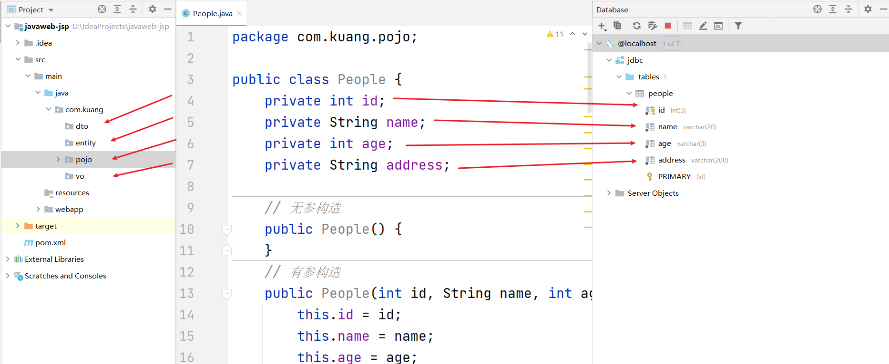


# 1.JDBC

## 1.1、数据库驱动

这里的驱动的概念和平时听到的那种驱动的概念是一样的，比如平时购买的声卡，网卡直接插到计算机上面是不能用的，必须要安装相应的驱动程序之后才能够使用声卡和网卡，同样道理，我们安装好数据库之后，我们的应用程序也是不能直接使用数据库的，必须要通过相应的数据库驱动程序，通过驱动程序去和数据库打交道，如下所示：

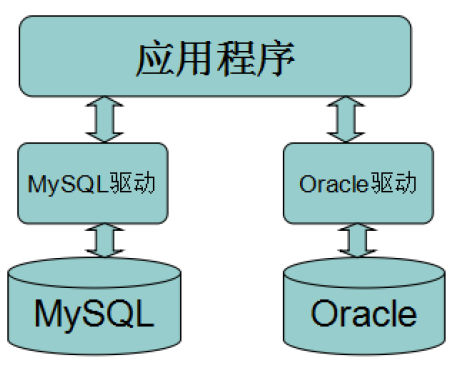


## 1.2、JDBC介绍

- JDBC全称为：Java Data Base Connectivity（java数据库连接）

- SUN公司为了简化、统一对数据库的操作，定义了一套Java操作数据库的规范（接口），称之为JDBC。
- 这套接口由数据库厂商去实现，这样，开发人员只需要学习jdbc接口，并通过jdbc加载具体的驱动，就可以操作数据库

---


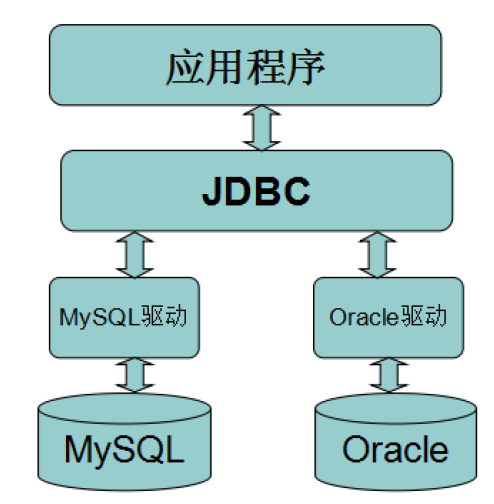

---

## 1.3、开始准备

组成JDBC的两个jar包：

- java.sql
- javax.sql
- 还需要导入一个数据库驱动包 `mysql-connector-java`

---

数据库驱动包我们一般去`maven仓库`下载

- 在`maven仓库`搜索`mysql-connector-java`，[maven仓库地址直达](https://mvnrepository.com/)

- 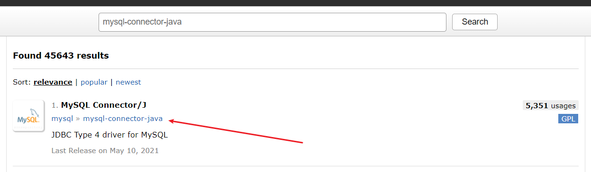
- 点击进去选择自己安装的对应的mysql版本
- 我的mysql版本是5.1.47，所以下载`mysql-connector-java-5.1.47`

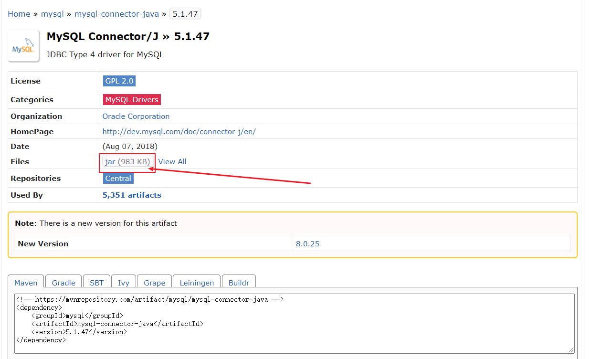


## 1.4、第一个JDBC程序

> 创建测试数据库

1. 首先在sqlyog里面创建一个`jdbcStudy`  表

```sql
CREATE DATABASE jdbcStudy CHARACTER SET utf8 COLLATE utf8_general_ci;

USE jdbcStudy;

CREATE TABLE `users`(
	id INT PRIMARY KEY,
	NAME VARCHAR(40),
	PASSWORD VARCHAR(40),
	email VARCHAR(60),
	birthday DATE
);

INSERT INTO `users`(id,NAME,PASSWORD,email,birthday)
VALUES(1,'zhansan','123456','zs@sina.com','1980-12-04'),
(2,'lisi','123456','lisi@sina.com','1981-12-04'),
(3,'wangwu','123456','wangwu@sina.com','1979-12-04');
```

2. 创建一个普通项目

3. **导入数据库驱动**
   - 在model下创建一个director，命名为lib
   - 将 mysql-connection-java 包复制粘贴进来
   - 右键- Add as Library

---

下面来开始我们的第一个JDBC程序,编写程序从user表中读取数据，并打印在命令行窗口中

```java
public class JDBC_Demo01 {
    public static void main(String[] args) throws ClassNotFoundException, SQLException {
        // 1.加载驱动
        Class.forName("com.java.mysql.Driver"); //固定写法，加载驱动
        // 2.用户信息和url
        // useUnicode=true&characterEncoding=utf8&&SSL=true
        // 第一个支持中文编码，第二个设置中文字符集为utf-8,第三个使用安全的连接
        String url = "jdbc:mysql://localhost:3306/jdbcstudy?useUnicode=true&characterEncoding=utf8&useSSL=true";
        String username = "root";
        String password = "123456";
        // 3.连接成功，会返回数据库对象 connection代表数据库
        Connection connection = DriverManager.getConnection(url, username, password);
        // 4.Statement执行sql对象
        Statement statement = connection.createStatement();
        // 5.执行sql的对象去执行sql，可能存在结果，查看返回信息
        String sql = "SELECT * FROM users";
        // resultSet 返回的结果集，结果集中封装了我们全部的查询出来的结果
        ResultSet resultSet = statement.executeQuery(sql);
        while(resultSet.next()){
            System.out.println("id="+resultSet.getObject("id"));
            System.out.println("NAME="+resultSet.getObject("NAME"));
            System.out.println("PASSWORD="+resultSet.getObject("PASSWORD"));
            System.out.println("email="+resultSet.getObject("email"));
            System.out.println("birthday="+resultSet.getObject("birthday"));
        }
        // 6.释放连接
            resultSet.close();
            statement.close();
            connection.close();
    }
}
```

步骤总结：

1. 加载驱动
2. 连接数据库 DriverManager
3. 获得执行sql的对象 Statement
4. 获得返回的结果集
5. 释放连接


# 2.对象说明

## 2.1、DriverManager

- **Jdbc程序中的DriverManager用于加载驱动，并创建与数据库的连接**

```java
// connection 代表数据库
Connection connection = DriverManager.getConnection(url, username, password);

// 事务提交
connection.commit();
// 事务回滚
connection.rollback();
// 设置事务自动提交
connection.setAutoCommit(true);
// 设置事务不自动提交
connection.setAutoCommit(false);
```


## 2.2、URL

URL用于标识数据库的位置，通过URL地址告诉JDBC程序连接哪个数据库，URL的写法为：

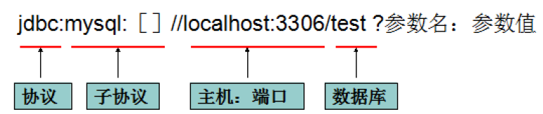

```java
//jdbc:mysql://主机地址:端口号/数据库名?参数1&参数2&参数3

String url = "jdbc:mysql://localhost:3306/jdbcstudy?useUnicode=true&characterEncoding=utf8&SSL=true";
```

- `useUnicode=true`支持中文编码
- `characterEncoding=utf8` 设置中文字符集为utf-8
- `SSL=true` 使用安全的连接

常用数据库URL地址的写法：

- Oracle写法：jdbc:oracle:thin:@localhost:1521:sid
- SqlServer写法：jdbc:microsoft:sqlserver://localhost:1433; DatabaseName=sid
- MySql写法：jdbc:mysql://localhost:3306/sid

## 2.3、Statement

Jdbc程序中的Statement对象用于向数据库发送SQL语句， Statement对象常用方法：

- `executeQuery(String sql) `：用于向数据发送查询语句。
- `executeUpdate(String sql)`：用于向数据库发送insert、update或delete语句
- `execute(String sql)`：用于向数据库发送任意sql语句

```java
// 4.Statement是执行sql的对象,   PrepareStatement也是执行sql的对象,之后会使用
Statement statement = connection.createStatement();

statement.executeQuery(sql);   // 查询操作返回ResultSet
statement.execute(sql);  		  //执行任何sql
statement.executeUpdate();     // 更新,插入,删除都是用这个,返回一个受影响的行数
```


## 2.4、ResltSet

Jdbc程序中的`ResultSet`用于代表Sql语句的执行结果，ResultSet是用于封装执行结果的，所以该对象提供的都是用于获取数据的get方法：

> ResultSet 查询的结果集，封装了所有的结果集

```java
// resultSet 返回的结果集，结果集中封装了我们全部的查询出来的结果
ResultSet resultSet = statement.executeQuery(sql);

resultSet.getObject(); //在不知道数据库表列类型的情况下使用
// 如果知道数据库表列的类型就使用指定的类型
resultSet.getString();
resultSet.getInt();
resultSet.getFloat();
resultSet.getDate();
```

- 遍历

```java
resultSet.next(); // 移动到下一个数据
```


## 2.5、释放资源

```java
resultSet.close();
statement.close();
connection.close();
```


# 3.statement对象详解

==jdbc中statement对象==：

- 用于向数据库发送SQL语句
- 想完成对数据库的增删改查，只需要通过这个对象向数据库发送增删改查语句即可
- Statement 对象的 executeUpdate 方法,用于向数据库发送增删改查的sql语句
- executeUpdate 执行完后，将会返回一个整数(即增删改查语句导致了数据库几行数据发生变化)
- ==Statement.executeQuery方法用于向数据库发送查询语句==
- ==executeQuery方法返回代表查询结果的ResultSet对象==

## 3.1、create操作

使用`executeUpdate(String sql)`方法完成数据添加操作，示例操作

```java
Statement st = conn.createStatement();
String sql = "insert into user(….) values(…..) ";
int num = st.executeUpdate(sql);
if(num>0){
	System.out.println("插入成功！！！");
}
```


## 3.2、update操作

使用`executeUpdate(String sql)`方法完成数据修改操作，示例操作：

```C++
Statement st = conn.createStatement();
String sql = "update user set name='' where name=''";
int num = st.executeUpdate(sql);
if(num>0){
	System.out.println("修改成功！！！");
}
```


## 3.3、read操作

使用`executeQuery(String sql)`方法完成数据查询操作，示例操作：

```java
Statement st = conn.createStatement();
String sql = "select * from user where id=1";
ResultSet rs = st.executeUpdate(sql);
while(rs.next()){
	//根据获取列的数据类型，分别调用rs的相应方法映射到java对象中
}
```


# 4.JdbcUtils工具类封装

1. 在src目录下创建一个`db.properties`文件,代码如下(可根据自己的数据库名账户密码修改)

```java
driver=com.mysql.jdbc.Driver
url=jdbc:mysql://localhost:3306/jdbcStudy?useUnicode=true&characterEncoding=utf8&useSSL=true
username=root
password=123456
```

2. 新建 utils 包,新建一个类`JdbcUtils`,代码如下

```java
import java.io.InputStream;
import java.sql.*;
import java.util.Properties;

public class JdbcUtils {
    private  static String driver = null;
    private  static String url = null;
    private  static String username = null;
    private  static String password = null;

    static {
        try{
            InputStream in =JdbcUtils.class.getClassLoader().getResourceAsStream("db.properties");
            Properties properties = new Properties();
            properties.load(in);

            driver = properties.getProperty("driver");
            url = properties.getProperty("url");
            username = properties.getProperty("username");
            password = properties.getProperty("password");
            // 1.驱动只用加载一次
            Class.forName(driver);
        }catch(Exception e){
            e.printStackTrace();
        }
    }

    // 获取连接
    public static Connection getConnection() throws Exception {
        return DriverManager.getConnection(url,username,password);
    }


    // 释放连接资源
    public static void release(Connection conn, Statement st, ResultSet rs){
        if(rs != null){
            try{
                rs.close();
            }catch (Exception e){
                e.printStackTrace();
            }
        }

        if(st != null){
            try{
                st.close();
            }catch (Exception e){
                e.printStackTrace();
            }
        }

        if(conn != null){
            try{
                conn.close();
            }catch (Exception e){
                e.printStackTrace();
            }
        }
    }
}
```

- 使用`JdbcUtils`工具类进行增删改查操作

## 4.1、插入数据

```java
public class TestInsert {
    public static void main(String[] args) {
        Connection conn = null;
        Statement st = null;
        ResultSet rs = null;

        try {
            conn = JdbcUtils.getConnection();   //获取数据库连接
            st = conn.createStatement();        //获取SQL的执行对象
            String sql = "INSERT INTO users(id,`NAME`,`PASSWORD`,`email`,`birthday`)" +
                    "VALUES(5,'kuangshen','123456','123456@qq.com','2020-01-01')";

            int i = st.executeUpdate(sql);
            if(i>0){
                System.out.println("插入成功");
            }
        } catch (Exception e) {
            e.printStackTrace();
        }finally {
            JdbcUtils.release(conn,st,rs);
        }
    }
}
```


## 4.2、删除数据

```java
public class TestDelete {
    public static void main(String[] args) {
        Connection conn = null;
        Statement st = null;
        ResultSet rs = null;

        try {
            conn = JdbcUtils.getConnection();   //获取数据库连接
            st = conn.createStatement();        //获取SQL的执行对象
            String sql = "delete from users where id=4";

            int i = st.executeUpdate(sql);
            if(i>0){
                System.out.println("删除成功");
            }
        } catch (Exception e) {
            e.printStackTrace();
        }finally {
            JdbcUtils.release(conn,st,rs);
        }
    }
}
```


## 4.3、更新数据

```java
public class TestUpdate {
    public static void main(String[] args) {
        Connection conn = null;
        Statement st = null;
        ResultSet rs = null;

        try {
            conn = JdbcUtils.getConnection();   //获取数据库连接
            st = conn.createStatement();        //获取SQL的执行对象
            String sql = "update users set
name='kuangshen',email='24736743@qq.com' where id=3";

            int i = st.executeUpdate(sql);
            if(i>0){
                System.out.println("更新成功");
            }
        } catch (Exception e) {
            e.printStackTrace();
        }finally {
            JdbcUtils.release(conn,st,rs);
        }
    }
}
```


## 4.4、查找数据

- 查询用的是`excuteQuery(sql)`，并且返回的结果集是`ResultSet`

```java
public class TestSelect {
    public static void main(String[] args) {
        Connection conn = null;
        Statement st = null;
        ResultSet rs = null;


        try {
            conn = JdbcUtils.getConnection();
            st = conn.createStatement();
            String sql = "select * from users where id = 3";
            // 注意查询返回的是结果集对象,不是整型对象,这里只查询了一条数据
            rs = st.executeQuery(sql);
            while(rs.next()){
                System.out.println(rs.getString("name"));
            }
        } catch (Exception e) {
            e.printStackTrace();
        }finally {
            JdbcUtils.release(conn,st,rs);
        }
    }
}
```


# 5.SQL注入

- 通过巧妙的技巧来拼接字符串，造成SQL短路，从而获取数据库数据
- 大白话：SQL存在漏洞，会被攻击导致数据泄露

```java
public class TestSQL注入 {
    public static void main(String[] args) {
        // 正常登录
        login("kuangshen","123456");
        // SQL注入登录
        // login("'or'1=1","123456");

    }
    // 登录业务
    public static void login(String username,String password){
        Connection conn = null;
        Statement st = null;
        ResultSet rs = null;

        try {
            conn = JdbcUtils.getConnection();   //获取数据库连接
            st = conn.createStatement();        //获取SQL的执行对象
            // select * from users where `name` = 'kuangshen' and `password` = '123456'
            String sql = "select * from users where `name` = '"+username+"' and `password` = '"+password+"'";

            rs= st.executeQuery(sql);
            while(rs.next()){
                System.out.println(rs.getString("name"));
            }
        } catch (Exception e) {
            e.printStackTrace();
        }finally {
            JdbcUtils.release(conn,st,rs);
        }
    }

}
```


# 6.PreparedStatement 对象

- 可以防止SQL注入,并且效率更高
- `PreparedStatement` 是`Statement`的子类
  - `Connection.createStament()` 方法获得Statement对象
  - `Connection.preparedStatement(sql)` 方法获得preparedStatement对象
- Statement会使数据库频繁编译SQL，可能造成数据库缓冲区溢出
- **PreparedStatement可对SQL进行预编译，从而提高数据库的执行效率。并且PreperedStatement对于sql中的参数，允许使用占位符的形式进行替换，简化sql语句的编写。**

## 6.1、插入数据

- 注意是先编译sql,之后再执行sql

```java
public class JDBC_Insert {
    public static void main(String[] args) {
        Connection conn = null;
        PreparedStatement st = null;
        ResultSet rs = null;

        try {
            conn = JdbcUtils.getConnection();
            // 区别
            // 使用 ? 占位符代替参数
            String sql = "INSERT INTO users(id,`NAME`,`PASSWORD`,`email`,`birthday`) values(?,?,?,?,?)";
            st = conn.prepareStatement(sql); //预编译SQL,先写sql,然后不执行
            // 手动给参数赋值
            st.setInt(1,6);
            st.setString(2,"qinxiao");
            st.setString(3,"1232112");
            st.setString(4,"110123@qq.com");
            // 注意点: sql.Date    数据库用的    java.sql.Date()
            //        util.Date   java中的     new Date().getTime() 获得时间戳
            st.setDate(5,new java.sql.Date(new Date().getTime()));


            // 执行
            int i = st.executeUpdate();
            if(i > 0){
                System.out.println("插入成功!");
            }


        } catch (Exception e) {
            e.printStackTrace();
        }finally {
            JdbcUtils.release(conn,st,null);
        }
    }
}
```


## 6.2、删除数据

```java
/**
 * PreparedStatement 对象
 */
public class JDBC_Delete {
    public static void main(String[] args) {
        Connection conn = null;
        PreparedStatement st = null;
        ResultSet rs = null;

        try {
            conn = JdbcUtils.getConnection();
            // 区别
            // 使用 ? 占位符代替参数
            String sql = "delete from users where id=?";
            st = conn.prepareStatement(sql);
            // 手动给参数赋值
            st.setInt(1,4);


            // 执行
            int i = st.executeUpdate();
            if(i > 0){
                System.out.println("删除成功!");
            }


        } catch (Exception e) {
            e.printStackTrace();
        }finally {
            JdbcUtils.release(conn,st,null);
        }
    }
}
```


## 6.3、更新数据

```java
public class JDBC_Update {
    public static void main(String[] args) {
        Connection conn = null;
        PreparedStatement st = null;
        ResultSet rs = null;

        try {
            conn = JdbcUtils.getConnection();
            // 区别
            // 使用 ? 占位符代替参数
            String sql = "update users set `name`=? where id=?";
            st = conn.prepareStatement(sql);
            // 手动给参数赋值
            st.setString(1,"晓琳");
            st.setInt(2,1);


            // 执行
            int i = st.executeUpdate();
            if(i > 0){
                System.out.println("修改成功!");
            }


        } catch (Exception e) {
            e.printStackTrace();
        }finally {
            JdbcUtils.release(conn,st,null);
        }
    }
}
```


## 6.4、查找数据

```java
public class JDBC_Select {
    public static void main(String[] args) {
        Connection conn = null;
        PreparedStatement st = null;
        ResultSet rs = null;

        try {
            conn = JdbcUtils.getConnection();
            // 区别
            // 使用 ? 占位符代替参数
            String sql = "select * from users where id = ?";
            st = conn.prepareStatement(sql);
            // 手动给参数赋值
            st.setInt(1,1);
            // 执行
            rs = st.executeQuery();

            while(rs.next()){
                System.out.println(rs.getString("NAME"));
                System.out.println(rs.getString("PASSWORD"));
                System.out.println("=================");
            }


        } catch (Exception e) {
            e.printStackTrace();
        }finally {
            JdbcUtils.release(conn,st,rs);
        }
    }
}
```


## 6.5、避免SQL注入

```java
public class JDBC_避免SQL注入 {
    public static void main(String[] args) {

        login("zhangsan","123456"); // 正常登陆
        login("'or '1=1","123456"); // SQL 注入
    }
    public static void login(String username,String password){
        Connection conn = null;
        PreparedStatement st = null;
        ResultSet rs = null;

        try {
            conn = JdbcUtils.getConnection();
            String sql = "select * from users where name=? and password=?";

            st = conn.prepareStatement(sql);
            st.setString(1,username);
            st.setString(2,password);
            rs = st.executeQuery();
            while(rs.next()){
                System.out.println(rs.getString("name"));
                System.out.println(rs.getString("password"));
                System.out.println("==============");
            }
        } catch (Exception e) {
            e.printStackTrace();
        }finally {
            JdbcUtils.release(conn,st,rs);
        }
    }
}
```

- `prepareStatement` 防止SQL注入的本质,把传递进来的参数当做字符
- 假设其中存在转义字符，就直接忽略,比如说引号会被直接转义


# 7.IDEA连接数据库

0. 在用IDEA连接数据库之前，要确保`mysql-connection-java.jar`包导入，过程请参照==目录1.3==

1. 打开IDEA
2. 点击右侧的Database

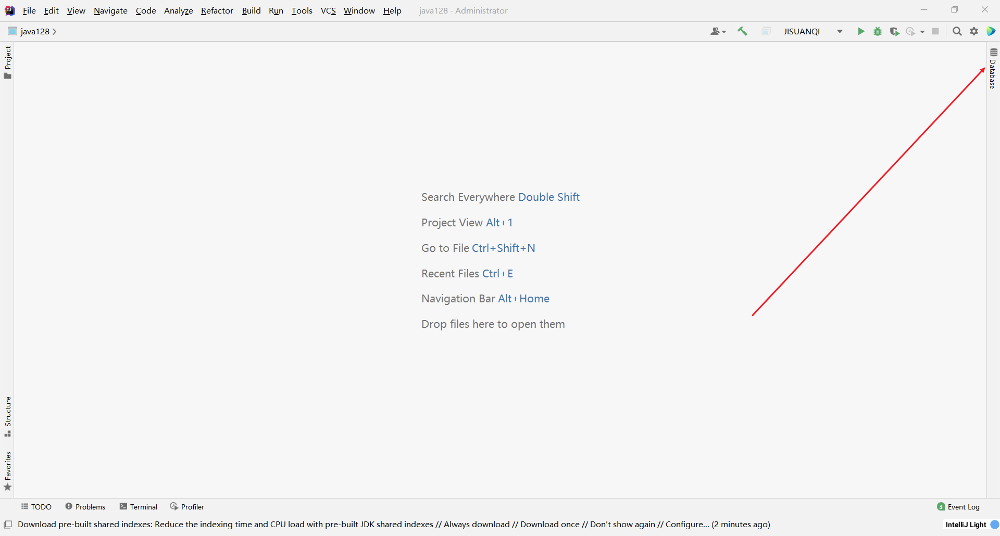


3. 如果你的右侧没有Database，点击左下角小框框就会出来

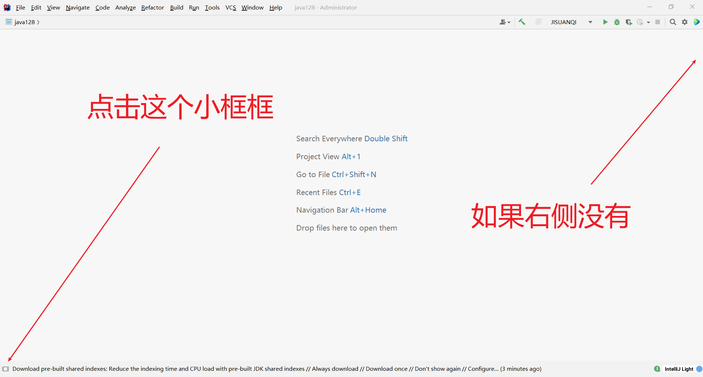


4. 点击Database


5. 输入数据库用户名密码测试连接

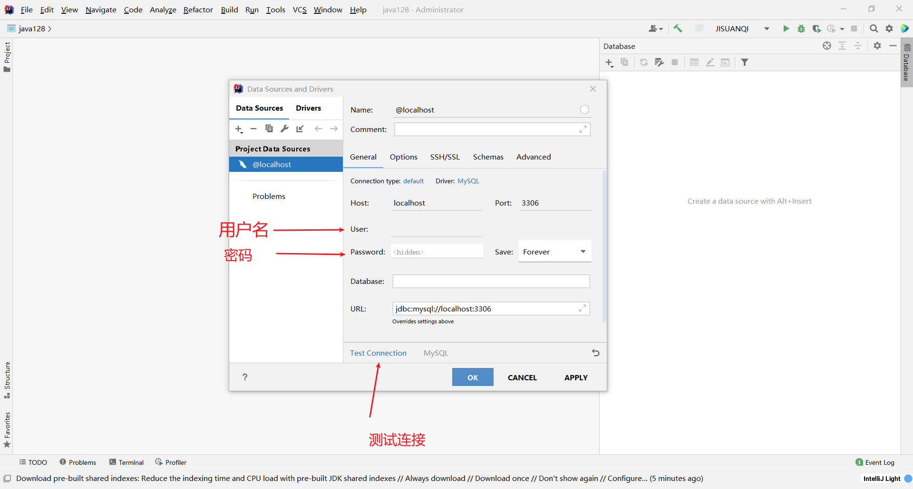

6. 连接成功后可以修改连接的数据库

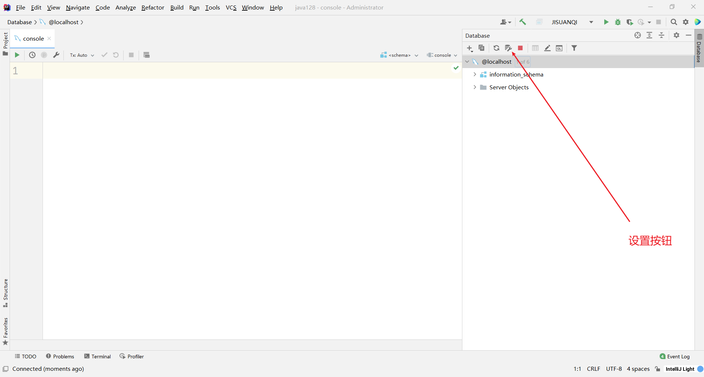

7. 点击Schemas,可以勾选自己想连接的数据库即可

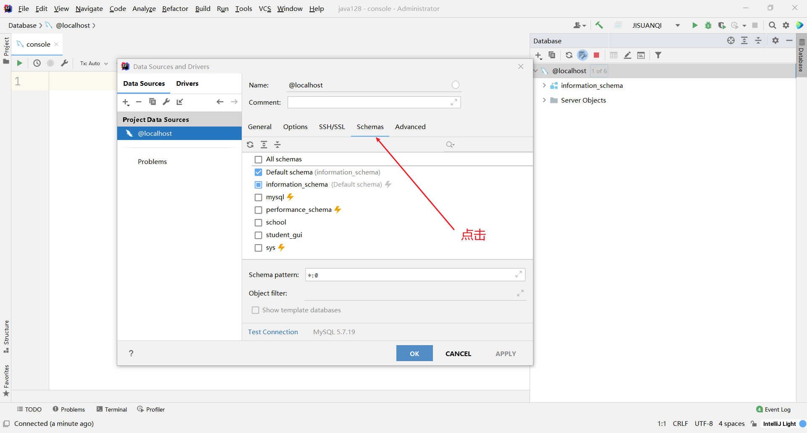

8. 双击表即可打开表中数据

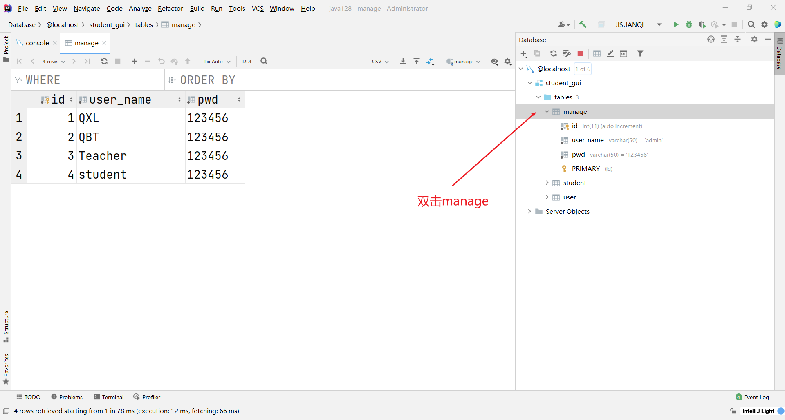

9. 在表中可以直接修改，**但是修改完要进行提交**

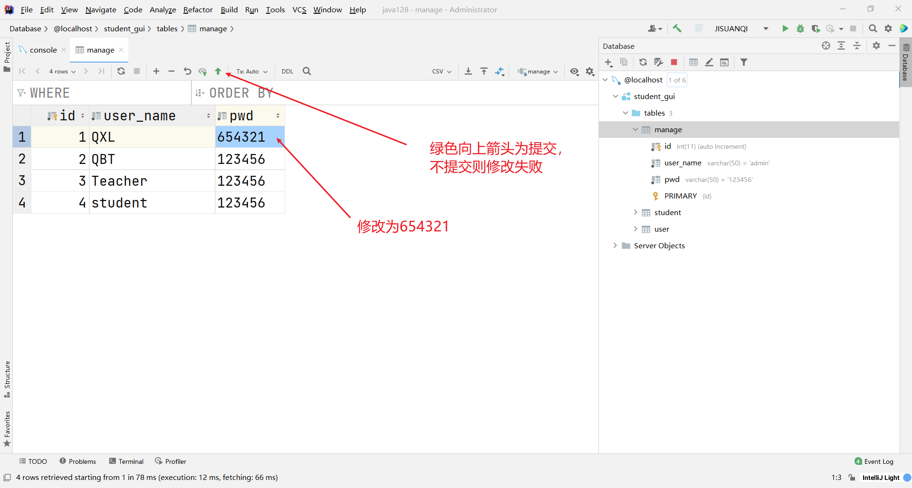


# 8.JDBC操作事务

步骤：

1. 开启事务：`conn.setAutoCommit(false);`

   - 这里的 fasle 是因为关闭数据库自动提交,事务会自动开启

   - 在sql中需要两步，但是在java中只需要一步

     - ```sql
       SET autocommit = 0; /*关闭自动提交*/
       start transaction;	/*开始一个事务*/
       ```

2. 一组业务执行完毕,提交事务

3. 可以在 catch 语句中显式的定义回滚语句

```java
public class TransactionDemo01 {
    public static void main(String[] args) {
        Connection conn = null;
        PreparedStatement st = null;
        ResultSet rs = null;


        try{
            conn = JdbcUtils.getConnection();
            // 关闭数据库的自动提交,自动会开启事务
            conn.setAutoCommit(false); // 开启事务

            String sql1 = "update account set money = money-100 where name ='A";
            st = conn.prepareStatement(sql1);
            st.executeUpdate();

            String sql2 = "update account set money = money+100 where name ='B";
            st = conn.prepareStatement(sql2);
            st.executeUpdate();

            int x = 1/0;    // 手动制造异常
            // 业务完毕，提交事务
            conn.commit();
            System.out.println("成功");


        }catch (Exception e){

            try {
                conn.rollback();  //如果失败则回滚事务
            } catch (SQLException throwables) {
                throwables.printStackTrace();
            }
            e.printStackTrace();
        }
    }
}
```


# 9.数据库连接池

数据库连接➡执行完毕 ➡ 释放资源，在连接 ➡ 释放这个过程中，十分浪费资源，因此池化技术就出现了。

- **池化技术：准备一些预先的资源，过来就连接预先准备好的**

- 最小连接数：10

- 最大连接数：15

- 超过最大连接数则后面的需要排队等待

- 等待超时：100ms

## 9.1、步骤

编写连接池，实现一个接口 `DataSource`

> 开源数据源实现(拿来即用)

- DBCP

- C3P0

- Druid：阿里巴巴

使用了这些数据库连接池之后，我们在项目开发中就不需要编写连接数据库的代码了

## 9.2、DBCP

需要用到的jar 包

- commons-dbcp-1.4  

- commons-pool-1.6 

在Maven官网下载即可：

- Maven官网： https://mvnrepository.com/

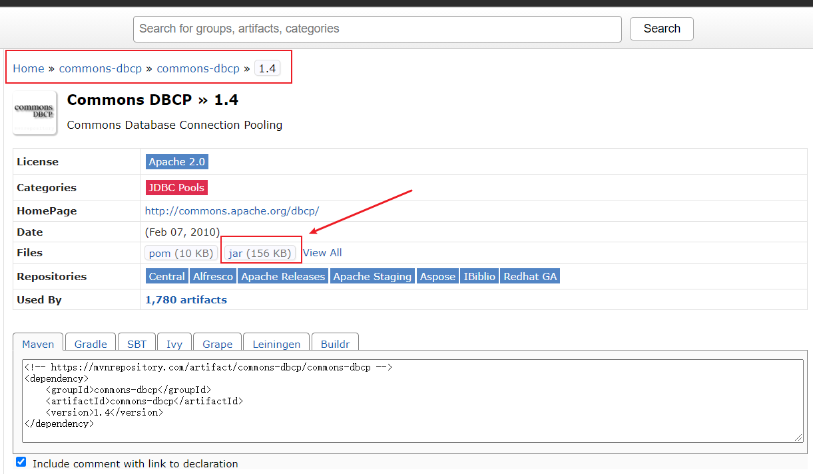

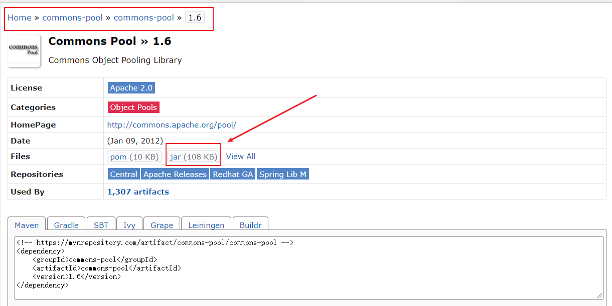


1. 在src目录下新建`dbcpconfig.properties`

```properties
#连接设置
driverClassName=com.mysql.jdbc.Driver
url=jdbc:mysql://localhost:3306/jdbcstudy?useUnicode=true&characterEncoding=utf8&useSSL=true
username=root
password=123456

#!-- 初始化连接 --
initialSize=10

#最大连接数量
maxActive=50

#!-- 最大空闲连接 --
maxIdle=20

#!-- 最小空闲连接 --
minIdle=5

#!-- 超时等待时间以毫秒为单位 6000毫秒/1000等于60秒 --
maxWait=60000
#JDBC驱动建立连接时附带的连接属性属性的格式必须为这样：【属性名=property;】
#注意：user 与 password 两个属性会被明确地传递，因此这里不需要包含他们。
connectionProperties=useUnicode=true;characterEncoding=UTF8

#指定由连接池所创建的连接的自动提交（auto-commit）状态。
defaultAutoCommit=true

#driver default 指定由连接池所创建的连接的只读（read-only）状态。
#如果没有设置该值，则“setReadOnly”方法将不被调用。（某些驱动并不支持只读模式，如：Informix）
defaultReadOnly=

#driver default 指定由连接池所创建的连接的事务级别（TransactionIsolation）。
#可用值为下列之一：（详情可见javadoc。）NONE,READ_UNCOMMITTED, READ_COMMITTED, REPEATABLE_READ, SERIALIZABLE
defaultTransactionIsolation=READ_UNCOMMITTED
```

2. 创建DBCP的工具类

> JdbcUtils_DBCP.java

```java
public class JdbcUtils_DBCP {
   private  static DataSource dataSource = null;

    static {
        try{
            InputStream in =JdbcUtils_DBCP.class.getClassLoader().getResourceAsStream("db.properties");
            Properties properties = new Properties();
            properties.load(in);

            // 创建数据源   工厂模式 --> 创建
            dataSource = BasicDataSourceFactory.createDataSource(properties);


        }catch(Exception e){
            e.printStackTrace();
        }
    }

    // 获取连接
    public static Connection getConnection() throws Exception {
        return dataSource.getConnection();   // 从数据源中获取连接
    }


    // 释放连接资源
    public static void release(Connection conn, Statement st, ResultSet rs){
        if(rs != null){
            try{
                rs.close();
            }catch (Exception e){
                e.printStackTrace();
            }
        }

        if(st != null){
            try{
                st.close();
            }catch (Exception e){
                e.printStackTrace();
            }
        }

        if(conn != null){
            try{
                conn.close();
            }catch (Exception e){
                e.printStackTrace();
            }
        }
    }
}
```

3. 进行测试

> TestDBCP.java

```java
public class TestDBCP {
    public static void main(String[] args) {
        Connection conn = null;
        PreparedStatement st = null;
        ResultSet rs = null;

        try {
            conn = JdbcUtils_DBCP.getConnection();
            String sql = "INSERT INTO users(id,`NAME`,`PASSWORD`,`email`,`birthday`) values(?,?,?,?,?)";
            st = conn.prepareStatement(sql);
            // 手动给参数赋值
            st.setInt(1,7);
            st.setString(2,"qinxiao");
            st.setString(3,"1232112");
            st.setString(4,"110123@qq.com");
            st.setDate(5,new java.sql.Date(new Date().getTime()));


            // 执行
            int i = st.executeUpdate();
            if(i > 0){
                System.out.println("插入成功!");
            }


        } catch (Exception e) {
            e.printStackTrace();
        }finally {
            JdbcUtils_DBCP.release(conn,st,null);
        }
    }
}

```

## 9.3、C3P0

需要用到的jar包

- c3p0-0.9.5.5

- mchange-commons-java-0.2.19

- 在maven官网里面下载即可

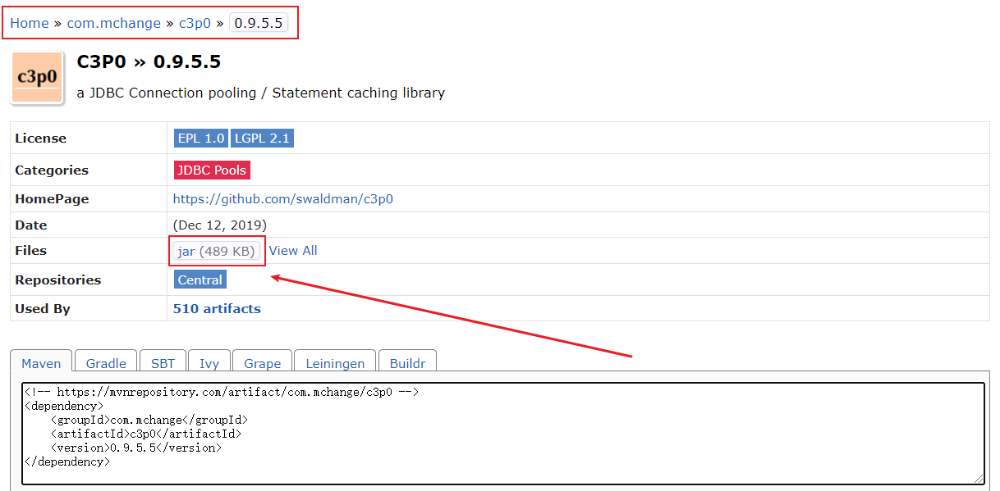


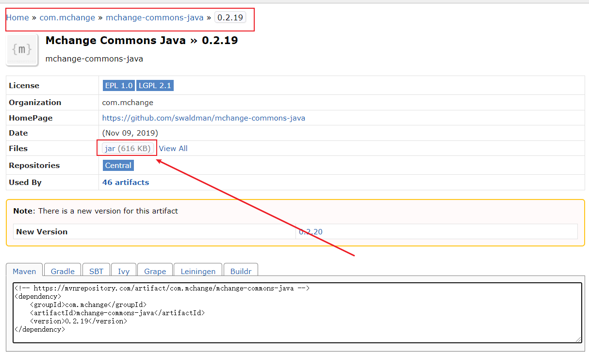


1. 在src下新建`c3p0-config.xml`

```xml
<?xml version="1.0" encoding="UTF-8"?>
<c3p0-config>
        <!--
        c3p0的缺省（默认）配置
        如果在代码中ComboPooledDataSource ds=new ComboPooledDataSource();这样写就表示使用的是c3p0的缺省（默认）
        -->
        <default-config>
        <property name="driverClass">com.mysql.jdbc.Driver</property>
        <property name="jdbcUrl">jdbc:mysql://localhost:3306/jdbcstudy?useUnicode=true&amp;characterEncoding=utf8&amp;uesSSL=true&amp;serverTimezone=UTC/property</property>
        <property name="user">root</property>
        <property name="password">123456</property>

        <property name="acquireIncrement">5</property>
        <property name="initialPoolSize">10</property>
        <property name="minPoolSize">5</property>
        <property name="maxPoolSize">20</property>
        </default-config>

        <!--
        c3p0的命名配置
        如果在代码中ComboPooledDataSource ds=new ComboPooledDataSource("MySQL");这样写就表示使用的是c3p0的缺省（默认）
        -->
        <named-config name="MySQL">
            <property name="driverClass">com.mysql.jdbc.Driver</property>
            <property name="jdbcUrl">jdbc:mysql://localhost:3306/jdbcstudy?useUnicode=true&amp;characterEncoding=utf8&amp;uesSSL=true</property>
            <property name="user">root</property>
            <property name="password">123456</property>

            <property name="acquireIncrement">5</property>
            <property name="initialPoolSize">10</property>
            <property name="minPoolSize">5</property>
            <property name="maxPoolSize">20</property>

        </named-config>>
</c3p0-config>
```

2. 编写c3p0工具类

> JdbcUtils_C3P0.java

- xml文件不需要读，直接用就行了

```java
public class JdbcUtils_C3P0 {
   private  static ComboPooledDataSource dataSource = null;

    static {
        try{
            // 创建数据源   工厂模式 --> 创建
            // 推荐配置文件写法
           dataSource =  new ComboPooledDataSource("MySQL");  
        }catch(Exception e){
            e.printStackTrace();
        }
    }

    // 获取连接
    public static Connection getConnection() throws Exception {
        return dataSource.getConnection();   // 从数据源中获取连接
    }


    // 释放连接资源
    public static void release(Connection conn, Statement st, ResultSet rs){
        if(rs != null){
            try{
                rs.close();
            }catch (Exception e){
                e.printStackTrace();
            }
        }

        if(st != null){
            try{
                st.close();
            }catch (Exception e){
                e.printStackTrace();
            }
        }

        if(conn != null){
            try{
                conn.close();
            }catch (Exception e){
                e.printStackTrace();
            }
        }
    }
}
```

3. 测试

```java
public class TestC3P0 {
    public static void main(String[] args) {
        Connection conn = null;
        PreparedStatement st = null;
        ResultSet rs = null;

        try {
            conn = JdbcUtils_C3P0.getConnection();   
            // 原来是自己实现的，现在用别人实现的
            String sql = "INSERT INTO users(id,`NAME`,`PASSWORD`,`email`,`birthday`) values(?,?,?,?,?)";
            st = conn.prepareStatement(sql);
            // 手动给参数赋值
            st.setInt(1,8);
            st.setString(2,"qinxiao");
            st.setString(3,"1232112");
            st.setString(4,"110123@qq.com");
            // 把上面的java.sql.Date 改为 java.util.Date
            // 注意点: sql.Date  数据库    java.sql.Date()
            //        util.Date java     new Date().getTime() 获得时间戳
            st.setDate(5,new java.sql.Date(new Date().getTime()));


            // 执行
            int i = st.executeUpdate();
            if(i > 0){
                System.out.println("插入成功!");
            }


        } catch (Exception e) {
            e.printStackTrace();
        }finally {
            JdbcUtils_C3P0.release(conn,st,null);
        }
    }
}

```

> 结论

无论使用什么数据源，本质还是一样的

DataSource接口不会变，方法就不会变


