# 1、ES6新特性

## 1.1、let 关键字

let关键字用来声明变量，使用 let声明的变量有几个特点：
1) 不允许重复声明

```js
//1. 变量不能重复声明
let star = '大林';
let star = '小林';  		// 报错
```

2. 块级作用域(包括 if、else、while、for所形成的括号)

```js
//2. 块儿级作用域
{
    let girl = '秦xx';
}
console.log(gril);		// 报错
```

3. 不存在变量提升

```js
//3. 不存在变量提升
console.log(song);		// 报错
let song = '恋爱达人';
```

4. 不影响作用域链

```js
//4. 不影响作用域链
{
    let school = '尚硅谷';
    function fn(){
        console.log(school);
    }
    fn();	// 尚硅谷
}
```

应用场景：==以后声明变量使用 let 就对了==


## 1.2、const关键字

const 关键字用来声明==常量==， const声明有以下特点
1) 声明必须赋初始值

```js
//1. 一定要赋初始值
const A;		// 报错
```

2. 标识符一般为大写

```js
//2. 一般常量使用大写(潜规则)
const A = 100;
```

3. 不允许重复声明

```js
const SCHOOL = '尚硅谷';
const SCHOOL = 'ZZU';		// 报错
```

4. 值不允许修改

```js
//声明常量
const SCHOOL = '尚硅谷';
//3. 常量的值不能修改
SCHOOL = 'ATGUIGU';			// 报错
```

5. 块儿级作用域

```js
//4. 块儿级作用域
{
   const PLAYER = 'UZI';
}
console.log(PLAYER);		// 报错！
```

6. 对于数组和对象的元素修改，不算作对常量的修改，不会报错

```js
const TEAM = ['UZI','MXLG','Ming','Letme'];
TEAM.push('Meiko');				// 不报错
```

注意: 对象属性修改和数组元素变化不会触发 const错误

应用场景：==声明对象类型使用const，非对象类型声明选择 let==

## 1.3、变量的解构赋值

ES6 允许按照一定模式，从数组和对象中提取值，对变量进行赋值，这被称为解构赋值。

### 1.3.1、数组的解构赋值

- 语法：数据的解构使用方括号 `[]`

```js
//1. 数组的结构
const F4 = ['小沈阳','刘能','赵四','宋小宝'];
let [xiao, liu, zhao, song] = F4;
console.log(xiao);	//小沈阳
console.log(liu);	//刘能
console.log(zhao);	//赵四
console.log(song);	//宋小宝
```


### 1.3.2、对象的解构赋值

- 语法：对象的解构使用大括号 `{}`

```js
//2. 对象的解构
const zhao = {
    name: '赵本山',
    age: '不详',
    xiaopin: function(){
        console.log("我可以演小品");
    }
};

let {name, age, xiaopin} = zhao;
console.log(name); // 赵本山
console.log(age); // 不详
console.log(xiaopin); // [Function: xiaopin]
xiaopin(); // 我可以演小品


// 复杂解构
let wangfei = {
    name: "王菲",
    age: 18,
    songs: ['红豆','流年','暧昧','传奇'],
    history: [
        {
            name : '窦唯'
        },
        {
            name: '李亚鹏'
        },
        {
            name: '谢霆锋'
        }
    ]
};

let {songs: [one,two,three], history: [first,second,third]} = wangfei;

console.log(one);   // 红豆
console.log(two);   // 流年
console.log(three); // 暧昧
console.log(first); // { name: '窦唯' }
console.log(second); // { name: '李亚鹏' }
console.log(third); // { name: '谢霆锋' }
```

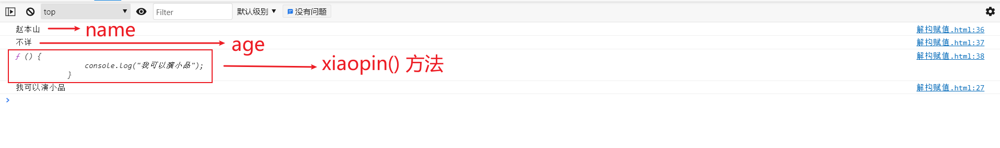

- ==我们一般解构对象中的属性比较少，更多的是解构对象中的方法==，使用如下：

```js
let {xiaopin} = zhao;
xiaopin();
```

> 注意：频繁使用对象方法、数组元素，就可以使用解构赋值形式


## 1.4、模板字符串

模板字符串是增强版的字符串，用==反引号 ` 标识==，特点：

1. 字符串中可以出现换行符

```js
//1. 声明
let str1 = `我也是一个字符串哦!`;
console.log(str1, typeof str1);
// 我也是一个字符串哦! string

//2. 内容中可以直接出现换行符
let str2 = `<ul>
            <li>沈腾</li>
            <li>玛丽</li>
            <li>魏翔</li>
            <li>艾伦</li>
            </ul>`;
console.log(str2);
```

2. 可以使用 `${xxx}` 形式输出变量

```js
//3. 变量拼接
let lovest = '魏翔';
let out = `${lovest}是我心目中最搞笑的演员!!`;
console.log(out);
// 魏翔是我心目中最搞笑的演员!!
```

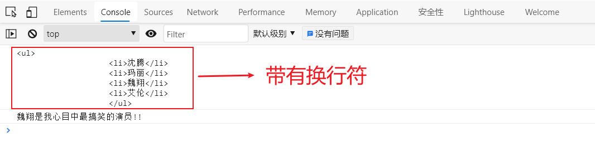

注意：==遇到字符串与变量拼接的情况使用模板字符串==

## 1.5、简化对象写法

**ES6 允许在大括号里面，直接写入变量和函数，作为对象的属性和方法。**这样的书写更加简洁

```js
let name = '尚硅谷';
let age = 20;

// 原始写法
const school1 = {
    name: name,
    age: age,
    change: function() {
        console.log('我们可以改变你!!');
    },
    improve: function() {
        console.log('我们可以提高你!!');
    }
}

// ES6 写法
const school2 = {
    name,
    age,
    change() {
        console.log('我们可以改变你!!');
    },
    improve() {
        console.log("我们可以提高你的技能");
    }
}
```

注意：==对象简写形式简化了代码，所以以后用简写就对了==


## 1.6、箭头函数

ES6 允许使用 ==箭头 =>== 定义函数

```js
// 声明一个函数原始写法
let fn = function(){

}
// 声明函数箭头函数写法
let fn = (a,b) => {
    return a + b;
}

// 调用函数
let result = fn(1, 2);
console.log(result);
```

**箭头函数的注意点**：

1. 如果形参只有一个，则小括号可以省略

```js
let add = (n) => {
    return n + n;
}
console.log(add(9));

// 省略小括号
let add = n => {
    return n + n;
}
```


2. 函数体如果只有一条语句，则花括号可以省略(==省略花括号, return 语句也必须要省略==)，函数的返回值为该条语句的执行结果

```js
// 函数体如果只有一条语句，则省略花括号和return语句
let pow1 = (n) => {
    return n * n;
}
console.log(pow1(9));

// 省略花括号
let pow2 = n => n * n;

console.log(pow2(9));
```


3. 箭头函数 this 指向声明时所在的作用域下 this 的值

```js
//1. this 是静态的. this 始终指向函数声明时所在作用域下的 this 的值
function getName() {
    console.log(this.name);
}
let getName2 = () => {
    console.log(this.name);
}

//设置 window 对象的 name 属性
window.name = '尚硅谷';
const school = {
    name: "ATGUIGU"
}

//直接调用
getName();
getName2();

//call 方法调用
getName.call(school);
getName2.call(school);
```

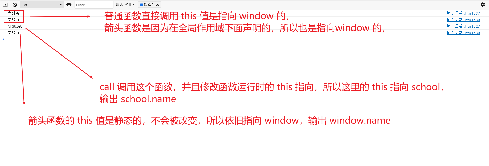

4. 箭头函数不能作为构造函数实例化

```js
//4. 箭头函数不能作为构造实例化对象
let Person = (name, age) => {
    this.name = name;
    this.age = age;
}
let me = new Person('xiao',30);
console.log(me);	 // Person is not a constructor
```

5. 不能使用 arguments

```js
//5. 不能使用 arguments 变量
let fn = () => {
    console.log(arguments);
}
fn(1,2,3);	// arguments is not defined
```

注意：==箭头函数不会更改 this 指向，用来指定回调函数会非常合适==。


## 1.7、函数参数默认值

ES6允许给函数参数赋值初始值

1. 形参初始值，具有默认值的参数，一般位置要靠后(潜规则)

```js
// 1. 形参初始值 具有默认值的参数, 一般位置要靠后(潜规则)
function add(a,c=10,b) {
    return a + b + c;
}
let result = add(1,2);
console.log(result);
```

2. 与解构赋值结合

```js
//原始写法
function connect (options){
    let host = options.host;
    let username = options.username;
    let password = options.password;
    let port = options.password;
}

// 调用 connect 方法,向里面传个对象
connect({
    host: 'atguigu.com',
    username: 'root',
    password: 'root',
    port: 3306
})
```

```js
// 与解构赋值结合写法
function connect({host="127.0.0.1", username,password, port}){
    console.log(host)
    console.log(username)
    console.log(password)
    console.log(port)
}

// 调用 connect 方法,向里面传个对象
connect({
    username: 'root',
    password: 'root',
    port: 3306
})
```


## 1.8、rest参数

ES6 引入 rest 参数，用于获取函数的实参，用来代替 arguments

1. rest 作用与 arguments 相似

```js
function add(...args){
    console.log(args);
}
add(1,2,3,4,5);
```

2. rest 参数必须是最后一个形参

```js
function minus(a,b,...args){
    console.log(a,b,...args);
}
minus(100,1,2,3,4,5,19);
```

注意：==rest参数非常适合不定个数参数函数的场景==


## 1.9、spread扩展运算符

没有扩展运算符的时候，只能组合使用 push，splice，concat 等方法，将已有数组元素变成新数组的一部分。 有了扩展运算符, 构造新数组会变得更简单、更优雅。扩展运算符也是三个点(...)。 它好比 rest 参数的逆运算，将一个数组转为用逗号分隔的参数序列，对数组进行解包。

```js
// 展开数组
console.log(...[1,2,3]);
// 1 2 3
console.log(1,...[2,3,4],5)
// 1 2 3 4 5
console.log([1,...[2,3,4],5])
// [1, 2, 3, 4, 5]
```


### 1.9.1、数组合并

```js
//1. 数组的合并
const kuaizi = ['王太利', '肖央'];
const fenghuang = ['曾毅', '玲花'];

// ES5数组合并写法
const zuixuanxiaopingguo1 = kuaizi.concat(fenghuang);
console.log(zuixuanxiaopingguo1);
// [ '王太利', '肖央', '曾毅', '玲花' ]

// ES6扩展运算符数组合并
const zuixuanxiaopingguo2 = [...kuaizi, ...fenghuang];
console.log(zuixuanxiaopingguo2);
// [ '王太利', '肖央', '曾毅', '玲花' ]
```

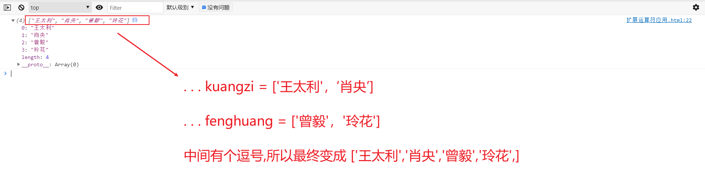


### 1.9.2、数组的克隆

```js
let arr = [1, 2, 3];
let arr2 = [...arr]; // [1, 2, 3]
arr2.push(4);
console.log(arr2); // [1, 2, 3, 4]

// 数组含空位
let arr3 = [1, , 3],
    arr4 = [...arr3];
console.log(arr4); // [1, undefined, 3]
```

- 这里是浅拷贝

### 1.9.3、将伪数组转为真正的数组


```js
<body>
    <div></div>
    <div></div>
    <div></div>
    <script>

        //3. 将伪数组转为真正的数组
        const divs = document.querySelectorAll('div'); //获取到的是一个伪数组
        console.log(divs);
        const divArr = [...divs];
        console.log(divArr);

    </script>
</body>
```

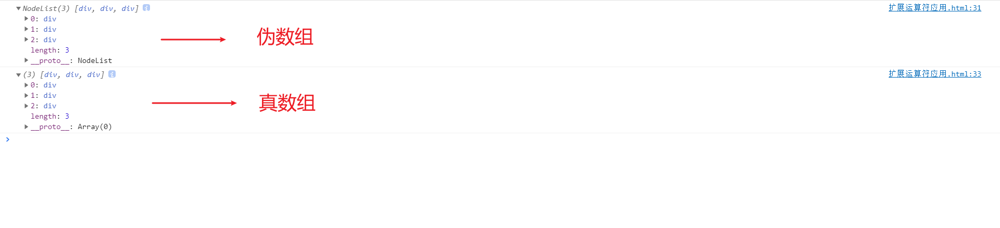


### 1.9.4、对象合并

```java
let age = {age: 15};
let name = {name: "Amy"};
let person = {...age, ...name};
console.log(person);  // {age: 15, name: "Amy"}
```


## 1.9.5、对象的克隆

```javascript
var obj1 = { foo: 'bar', x: 42 };
var clonedObj = { ...obj1 };
console.log(clonedObj); // { foo: "bar", x: 42 } 
```


# 2、Symbol

ES6 引入了一种新的原始数据类型 Symbol，表示独一无二的值，它是 JavaScript 语言的第七种数据类型，是一种类似于字符串的数据类型。

1. Symbol 的值是唯一的，用来解决命名冲突的问题
2. Symbol 值不能与其他数据进行运算
3. Symbol 定义的对象属性不能使用 for...in 循环遍历，但是可以使用 `Reflect.ownKeys` 来获取对象的所有键名


## 2.1、Symbol的创建

- Symbol()
  - Symbol 前面不能加`new`关键字，直接调用即可创建一个独一无二的 symbol 类型的值。


```js
let s = Symbol();
console.log(s,typeof s);
// Symbol() symbol
```

- Stmbol('字符串')  
  - ==这里的字符串只是一个描述，对于返回的结果也不是固定的==(有两个张三，但是两个张三的编号是不一样的)

```js
// 创建 Symbol 的时候，可以添加一个描述
const sym = Symbol('foo');
// sym.description 可以直接返回 Symbol 的描述
console.log(sym.description); // foo


let s2 = Symbol('张三');
let s3 = Symbol('张三');
// 没有两个 Symbol 的值是相等的
console.log( s2 === s3);	//false
```

- Symbol.for('字符串')
  - ==通过这样的方式创建 Symbol，可以通过字符串返回一个固定的 Symbol 值==

```js
let s4 = Symbol.for('尚硅谷');
let s5 = Symbol.for('尚硅谷');

console.log(s4 === s5);	// true
```

## 2.2、不能与其他数据进行运算

```js
//不能与其他数据进行运算
//    let result = s + 100;
//    let result = s > 100;
//    let result = s + s;
```

## 2.3、7种数据类型记忆

口诀：USONB  == you are so niubiility

U == undefined

S == string symbol

o == object

n == null number

b == boolean


## 2.4、Symbol的应用

### 2.4.1、Symbol作为属性名

在 ES6 中，对象的属性名支持表达式，所以你可以使用一个变量作为属性名，这对于一些代码的简化很有用处，但是**表达式必须放到方括号内**：

```javascript
let prop = "name";
const obj = {
  // 使用表达式作为属性名,需要加方括号
  [prop]: "liao"
};
console.log(obj.name); // 'liao'
```

了解了这个新特性后，我们接着学习。symbol 值可以作为属性名，因为 symbol 值是独一无二的，所以当它作为属性名时，不会和其他任何属性名重复：

```javascript
let name = Symbol();
let obj = {
  [name]: "liao"
};
console.log(obj); // { Symbol(): 'liao' }
```

打印出来的对象有一个属性名是 symbol 值。如果我们想访问这个属性值，不能使用 `.` 点的方式，而是必须使用方括号的形式：

```javascript
console.log(obj[name]); // 'liao'
console.log(obj.name); // undefined
```

> - Symbol 作为属性名的时候，需要把 Symbol 使用 `[]` 包裹


### 2.4.2、Symbol属性名的遍历

使用 Symbol 类型值作为属性名，这个属性不会被`for…in`遍历到，也不会被`Object.keys()`、`Object.getOwnPropertyNames()`、`JSON.stringify()`获取到

- `Object.keys()` ：获取所有的属性名 key
- `Object.getOwnPropertyNames()` ：获取所有的属性名 key
- `JSON.stringify()` ：获取所有的属性名key和属性值value

```javascript
const obj1 = {
    name: "林晓",
    age: 18,
    salary: 30000,
};

for (const key in obj1) {
    // 遍历属性名 key
    console.log(key);
    /**
     *   name
         age
         salary
     */
}

// 获取所有的属性名 key
console.log(Object.keys(obj1));
// [ 'name', 'age', 'salary' ]

// 获取所有的属性名 key
console.log(Object.getOwnPropertyNames(obj1));
// [ 'name', 'age', 'salary' ]

// 获取所有的属性名key和属性值value
console.log(JSON.stringify(obj1));
// {"name":"林晓","age":18,"salary":30000}
```

- 我们可以使用下面两个方法获取对象的所有symbol类型的属性名
  - `Reflect.ownKeys` 新的API
  - `Object.getOwnPropertySymbols` ：

```javascript
/**
 * 但是如果是 Symbol 属性名
 */
const salary = Symbol("salary");
const name = Symbol("name");
const obj = {
    [name]: "林晓",
    age: 18,
    [salary]: 30000,
};


// age 只能拿到 key,拿不到Symbol类型的 name 属性名
for (const key in obj) {
    console.log(key);
}

// 获取到obj对象里面的所有 Symbol 属性名
const SymbolPropNames = Object.getOwnPropertySymbols(obj);
console.log(SymbolPropNames); // [ Symbol(name), Symbol(salary) ]
// 获取第一个 Symbol 类型的属性值
console.log(obj[SymbolPropNames[0]]); // 林晓
// 获取第二个 Symbol 类型的属性值
console.log(obj[SymbolPropNames[1]]); // 30000


// 新的api: Reflect.ownKeys()
console.log(Reflect.ownKeys(obj)); // [ 'age', Symbol(name), Symbol(salary) ]
```


### 2.4.3、Symbol.for() 和 Symbol.keyFor()

Symbol 包含两个静态方法，`for` 和 `keyFor`。

```javascript
const s1 = Symbol("liao");
const s2 = Symbol("liao");
const s3 = Symbol.for("liao");
const s4 = Symbol.for("liao");
console.log(s1 === s3); // false
console.log(s3 === s4); // true
```

- 直接使用 Symbol 方法，即便传入的字符串是一样的，创建的 symbol 值也是互不相等的
- **而使用 `Symbol.for`方法传入字符串，会先检查有没有使用该字符串调用 Symbol.for 方法创建的 symbol 值，如果有，返回该值，如果没有，则使用该字符串新创建一个。**

```javascript
// Symbol.keyFor() 方法传入一个 symbol 值,返回该值在全局注册的键名
const sym = Symbol.for("liao");
console.log(Symbol.keyFor(sym)); // 'liao'
```

## 2.5、Symbol 内置值

除了定义自己使用的 Symbol 值以外，ES6 还提供了 11 个内置的 Symbol 值，指向语言内部使用的方法。可以称这些方法为魔术方法，因为它们会在特定的场景下自动执行。

| Symbol.hasInstance        | 当其他对象使用 instanceof 运算符，判断是否为该对象的实例时，会调用这个方法 |
| ------------------------- | ------------------------------------------------------------ |
| Symbol.isConcatSpreadable | 对象的 Symbol.isConcatSpreadable属性 等于的是一个布尔值，表示该对象用于 Array.prototype.concat()时，是否可以展开。 |
| Symbol.species            | 创建衍生对象时，会使用该属性                                 |
| Symbol.match              | 当执行 str.match(myObject)  时，如果该属性存在，会调用它，返回该方法的返回值。 |
| Symbol.replace            | 当该对象被 str.replace(myObject) 方法调用时，会返回该方法的返回值。 |
| Symbol.search             | 当该对象被 str. search (myObject) 方法调用时，会返回该方法的返回值。 |
| Symbol.split              | 当该对象被 str. split (myObject) 方法调用时，会返回该方法的返回值。 |
| Symbol.iterator           | 对象进行 for...of 循环时，会调用 Symbol.iterator方法，返回该对象的默认遍历器 |
| Symbol.toPrimitive        | 该对象被转为原始类型的值时，会调用这个方法，返回该对象对应的原始类型值。 |
| Symbol. toStringTag       | 在该对象上面调用 toString 方法时 ，返回该方法的返回值        |
| Symbol. unscopables       | 该对象指定了使用 with 关键字时，哪些属性会被 with环境排除。  |


# 3、迭代器

迭代器(Iterator) 就是一种机制。它是一种接口，为各种不同的数据结构提供统一的访问机制。任何数据结构只要部署 Iterator 接口，就可以完成遍历操作。

1. ES6 创造了一种新的遍历命令 for...of 循环，Iterator 接口主要供 for...of 消费
2. 原生具备 iterator 接口的数据(可用 for of 遍历)
   - Array
   - Arguments
   - Set
   - Map
   - String
   - TypedArray
   - NodeList


## 3.0、数组的常用方法

这里先简单介绍下数组的常用方法：

1. 改变原数组的方法：

```javascript
// 1、push() : 数组末尾添加数据,返回数组的长度
var arr = [10, 20, 30, 40]
res = arr.push(20)
console.log(arr);//[10,20,30,40,20]
console.log(res);//5

// 2、pop():数组末尾弹出数据
var arr = [10, 20, 30, 40]
res =arr.pop()
console.log(arr);//[10,20,30]
console.log(res);//40

// 3、unshift(): 数组头部添加数据,返回数组的长度
var arr = [10, 20, 30, 40]
res=arr.unshift(99)
console.log(arr);//[99,10,20,30,40]
console.log(res);//5


// 4、shift():数组头部删除数据,返回删除的那个数据
var arr = [10, 20, 30, 40]
res=arr.shift()
console.log(arr);[20,30,40] // [ 20, 30, 40 ]
console.log(res);// 10


// 5、reverse():翻转数组,返回翻转的数据
var arr = [10, 20, 30, 40]
res=arr.reverse()
console.log(arr);//[40,30,20,10]
console.log(res);//[40,30,20,10]

// 6、sort(): 排序
var arr = [1,3,5,7,9,10]
console.log(arr.sort()); // 默认排序顺序为按字母升序,所以通常不准确
// 正序排列
arr.sort(function(a,b){return(a-b)})
console.log(arr); // [1,3,5,7,9,10]
// 倒序排列
arr.sort(function(a,b){return(b-a)})
console.log(arr);// [ 10, 9, 7, 5, 3, 1 ]

// 7、splice(开始的索引,截取几个): 截取数组,返回截取出来的数据
var arr = [1,3,5,7,9,10]
res = arr.splice(1,2) // 从索引1开始,截取2个数据
console.log(arr); // [ 1, 7, 9, 10 ]
console.log(res); // [ 3, 5 ]

//splice(开始的索引,截取几个,你要插入的数据) : 删除并插入数据
var arr = [1,3,5,7,9,10]
res = arr.splice(1,1,999,888) // 从索引1开始,截取1个数据删除,并插入999,888
console.log(arr);  // [1, 999, 888, 5,7,9,10]
console.log(res);  // [ 3 ]
```

2. 不改变原数组的方法

```javascript
// 1、concat(): 合并数据
var arr = [10, 20, 10, 30, 40, 50, 60]
res = arr.concat(20,"小敏",50)
console.log(arr) // [10, 20, 10, 30, 40, 50, 60,20,"小敏",50]
console.log(res);// [10, 20, 10, 30, 40, 50, 60,20,"小敏",50]

//2、join(): 数组转字符串
var arr = [10, 20, 10, 30, 40, 50, 60]
res = arr.join("+")
console.log(arr) // 数组不改变 [10, 20, 10, 30, 40, 50, 60]
console.log(res); // 10+20+10+30+40+50+60
console.log(typeof res); //string

//3、slice(开始索引,结束索引): 截取数组的一部分数据,返回截取的数据,前闭后开 [ ),
var arr = [10, 20, 10, 30, 40, 50, 60]
res = arr.slice(1,4)
console.log(arr) // 数组不改变 [10, 20, 10, 30,40, 50, 60]
console.log(res);// [ 20, 10, 30 ]

//4、indexOf(数值):从左边开始检查数组中有没有这个数值,如果有就返回该数据第一次出现的索引
var arr = [10, 20, 10, 30, 40, 50, 60]
res = arr.indexOf(10)
console.log(arr) // 数组不改变 [10, 20, 10, 30,40, 50, 60]
console.log(res); // 返回第一次出现的索引 0

//indexOf(数值,开始的索引)
var arr = [10, 20, 10, 30, 40, 50, 60]
res = arr.indexOf(10,1)
console.log(arr) // 数组不改变 [10, 20, 10, 30,40, 50, 60]
console.log(res); // 2

//5、lastIndexOf(数值):从右边开始检查数组中有没有这个数值,如果有就返回该数据第一次出现的索引
```

3. ES6新增的数组方法

```javascript
//1、forEach(): 循环遍历数组
var arr = ['盖伦','德玛','大风车']
arr.forEach((item,index) => {
    // index 是数组下标,item是数组值
    console.log(index);
    console.log(item);
});

// 2、map 加工数组
var arr = ['盖伦','德玛','大风车'];
var newArr = arr.map((item,index) => {
    console.log(index);
    console.log(item);
    return item + '111'
});
console.log(newArr); // [ '盖伦111', '德玛111', '大风车111' ]

// 3、filter() 过滤数组
var arr = [1,2,3,4,5];
var newArr = arr.filter((item,index) => {
    return item > 2;
});
console.log(newArr); // [ 3, 4, 5 ]

// 4、every() 判断数组是不是满足所有条件
var arr = [1, 2, 3, 4, 5]
var res = arr.every((item,index) => {
    return item > 0;
})
console.log(res);//打印结果  true

// 6、find() 用来获取数组中满足条件的第一个数据
var arr = [1, 2, 3, 4, 5]
var res = arr.find((item,index) => {
    return item > 3;
})
console.log(res);//打印结果  4
```


## 3.1、数组的遍历

我们先看一下数组的遍历方式：

```js
//声明一个数组
const xiyou = ['唐僧', '孙悟空', '猪八戒', '沙僧'];

//使用 for...in 遍历数组
for (let i in xiyou) {
    // i 是数组的下标
    console.log(i);
    console.log(xiyou[i]);
}

//使用 for...of 遍历数组
for (let v of xiyou) {
    console.log(v);
    /**
     *   唐僧
         孙悟空
         猪八戒
         沙僧
     */
}


//forEach(): 循环遍历数组
var arr = ['盖伦','德玛','大风车']
arr.forEach((index,item) => {
    // index 是数组下标,item是数组值
    console.log(index);
    console.log(item);
});
```

## 3.2、对象的遍历

```javascript
//对象
var test = {
    name : "zs",
    age: "18"
}

// 遍历属性名和属性值
for(let key in test) {
    // key 是属性名
    console.log(key);
    console.log(test[key]);
}

// 获取所有的属性名
console.log(Object.keys(test)); // [ 'name', 'age' ]


// 获取所有的属性值
console.log(Object.values(test)); // [ 'zs', '18' ]
```


## 3.3、数组和对象之间的转换

- 数组转换为对象

```javascript
// 数组转对象
// 方法一:使用 spread 扩展运算符
const arr1 = ['one','two','three'];
const obj1 = {...arr1};
console.log(obj1);    // { 0: 'one', 1: 'tow', 2: 'three' }

// 方法二:使用 foreach
const arr = [1,2,3,4,5];
let obj = {};


arr.forEach((item,index) => {
    // index 是下标, item 是数组元素
    obj[index] = item;
})

console.log(obj);     //{ 0: 1, 1: 2, 2: 3, 3: 4, 4: 5 }
```

- 对象转换为数组

```javascript
```


## 3.4、迭代器


为什么数据可以使用 for... of 遍历呢？因为数组具有一个属性 `Symbol.iterator`

```js
//声明一个数组
const xiyou = ['唐僧', '孙悟空', '猪八戒', '沙僧'];
console.log(xiyou);
```

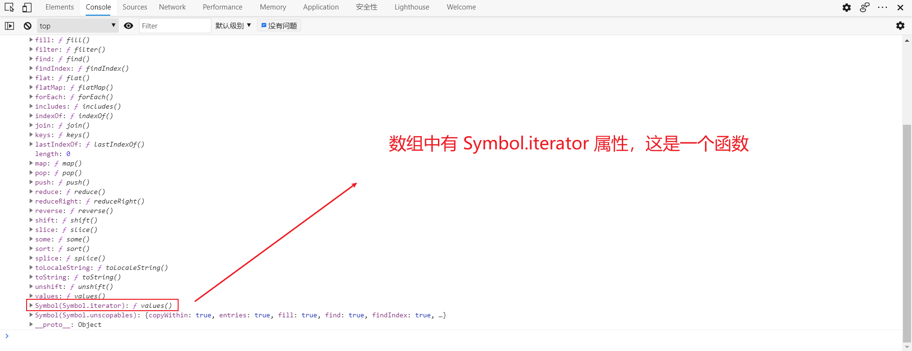


注意：==需要自定义遍历数据的时候，要想到迭代器==

```js
// 原理
//声明一个数组
const xiyou = ['唐僧', '孙悟空', '猪八戒', '沙僧'];

//创建数组的迭代器
let iterator = xiyou[Symbol.iterator]();
//调用对象的next方法
console.log(iterator.next());//{ value: '唐僧', done: false }
console.log(iterator.next());//{ value: '孙悟空', done: false }
console.log(iterator.next());//{ value: '猪八戒', done: false }
console.log(iterator.next());//{ value: '沙僧', done: false }
console.log(iterator.next());//{ value: undefined, done: true }
```

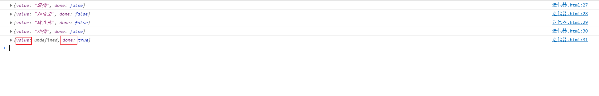


# 4、生成器函数

生成器函数是 ES6 提供的一种异步编程解决方案，语法行为和传统函数完全不同。

```js
/**
 * generator 生成器函数,可以通过 yield 关键字 , 将函数挂起
 * 和普通函数的区别
 * 1. function 后面,函数名之前有个星号 *
 * 2. 只能在函数内部使用 yield 表达式
 * 3. generator函数是分段执行的, yield 语句是赞同执行, next() 是恢复执行
 */
function* func(){
    yield 2; // 调用一次 next 会执行到这
    yield 3; // 调用二次 next 会执行到这
}

// 调用生成器函数,会返回一个迭代器对象,可以使用 next() 方法
let fn = func();
console.log(fn.next()); // { value: 2, done: false }
console.log(fn.next()); // { value: 3, done: false }
console.log(fn.next()); // { value: undefined, done: true }
```


代码说明：

- `*` 星号的位置没有限制
- 生成器函数返回的结果是迭代器对象，调用迭代器对象的 next 方法可以得到 yield 语句后的值
- yield 相当于函数的暂停标记，也可以认为是函数的分隔符，每调用一次 next 方法，执行一段代码
- next 方法可以传递实参，作为 yield 语句的返回值


# 5、Promise

Promise 是 ES6 引入的异步编程的新解决方案。语法上 Promise 是一个构造函数，用来**封装异步操作并可以获取其成功或失败的结果**。

```javascript
//实例化 Promise 对象
// 参数是一个函数,函数的形参是 resolve 和 reject,resolve 可以改变 Promise的状态为成功,reject 可以改变Promise的状态为失败
const p = new Promise(function(resolve, reject) {
    //异步操作定时器
    setTimeout(function() {
        let data = '数据库中的用户数据';
        resolve(data);
    }, 1000);
});

/**
 * 调用 promise 对象的 then 方法,then 方法接收两个参数,两个参数都是函数,成功的函数形参是value,失败函数的形参是reason
 * 上方 resolve 成功后,下面的 then 方法就是执行第一个函数的方法
 */

p.then(function(value) {
    console.log(value); // 数据库中的用户数据
}, function(reason) {
    console.error(reason);
})
```

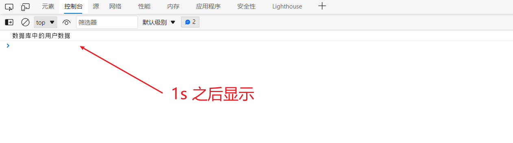

我们在异步操作定时器里面获得数据之后，就可以调用 resolve 函数来改变 Promise 对象的状态，使得Promise 对象的状态为成功，成功之后我们可以调用 Promise 对象的 then 方法，then 方法接收两个参数，都是函数类型，成功的形参我们叫做 value，失败的形参我们叫做 reason，检测到 Promise 对象状态为成功，则执行 then 方法里面的第一个方法。

```js
<script>
    //实例化 Promise 对象
    const p = new Promise(function(resolve, reject) {
        // 使用定期器来做一个异步任务的模拟
        setTimeout(function() {
            // let data = '数据库中的用户'
            // resolve(data)
            let err = '数据读取错误';
            reject(err);
        }, 1000);
    });

    //调用 promise 对象的 then 方法
    p.then(function(value) {
        console.log(value);
    }, function(reason) {
        console.error(reason);
    })
</script>
```

我们在异步操作定时器里面未能获得数据之后，调用 reject 函数来改变 Promise 对象的状态，使得 Promise 对象的状态为失败，失败之后我们可以调用 Promise 对象的 then 方法，检测到 Promise 对象状态为失败，则执行 then 方法里面的第二个方法。

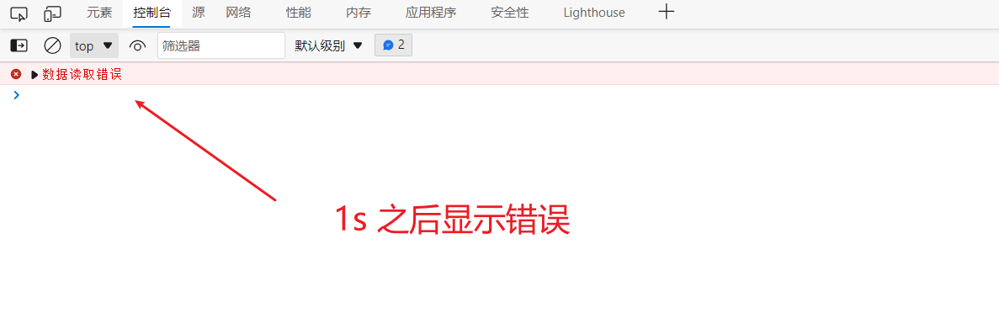

> 如果Promise对象获取数据成功，则执行第一个回调函数，输出 value
>
> 如果Promise对象获取数据失败，则执行第二个回调函数，输出 reason


## 5.1、Promise封装读取文件

```js
//1. 引入 fs 模块
const fs = require('fs');

//2. 调用方法读取文件
// fs.readFile('./resources/为学.md', (err, data)=>{
//     //如果失败, 则抛出错误
//     if(err) throw err;
//     //如果没有出错, 则输出内容
//     console.log(data.toString());
// });

//3. 使用 Promise 封装
const p = new Promise(function(resolve, reject){
    fs.readFile("./resources/为学.md", (err, data)=>{
        //判断如果失败
        if(err) reject(err);
        //如果成功
        resolve(data);
    });
});

p.then(function(value){
    console.log(value.toString());
}, function(reason){
    console.log("读取失败!!");
});
```


## 5.2、Promise封装Ajax

```html
<body>
    <script>
        // 接口地址: https://api.apiopen.top/getJoke
        const p = new Promise((resolve, reject) => {
            //1. 创建对象
            const xhr = new XMLHttpRequest();

            //2. 初始化
            xhr.open("GET", "https://api.apiopen.top/getJ");

            //3. 发送
            xhr.send();

            //4. 绑定事件, 处理响应结果
            xhr.onreadystatechange = function () {
                //判断
                if (xhr.readyState === 4) {
                    //判断响应状态码 200-299
                    if (xhr.status >= 200 && xhr.status < 300) {
                        //表示成功
                        resolve(xhr.response);
                    } else {
                        //如果失败
                        reject(xhr.status);
                    }
                }
            }
        })
        
        //指定回调
        p.then(function(value){
            console.log(value);
        }, function(reason){
            console.error(reason);
        });
    </script>
</body>
```


## 5.3、Promise.then方法

调用 then 方法，then 方法的返回结果是 Promise 对象，对象状态由回调函数的执行结果决定

1. 如果回调函数中的返回结果是非 Promise 类型的属性

```html
<body>

    <script>
        const p = new Promise((resolve, reject) => {
            setTimeout(() => {
                resolve("获取数据成功");

            }, 1000)
        });

        //调用 then 方法  then方法的返回结果是 Promise 对象, 对象状态由回调函数的执行结果决定
        //1. 如果回调函数中返回的结果是 非 promise 类型的属性, 状态为成功, 返回值为对象的成功的值
        const result = p.then(value => {
            console.log(value);
            return 123;
        }, reason => {
            console.warn(reason);
        })

        console.log(result);
    </script>
</body>
```

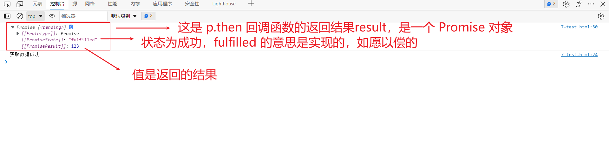

2. 如果回调函数中的返回结果是 Promise 类型的属性

```html
<body>

    <script>
        const p = new Promise((resolve, reject) => {
            setTimeout(() => {
                resolve("获取数据成功");

            }, 1000)
        });

        //调用 then 方法  then方法的返回结果是 Promise 对象, 对象状态由回调函数的执行结果决定
        //2. 如果回调函数中返回的结果是 promise 类型的属性,则then方法的返回状态由 promise 对象决定
        const result = p.then(value => {
            return new Promise((resolve, reject) => {
                resolve('ok');
            })

        }, reason => {
            console.warn(reason);
        })

        console.log(result);
    </script>
</body>
```

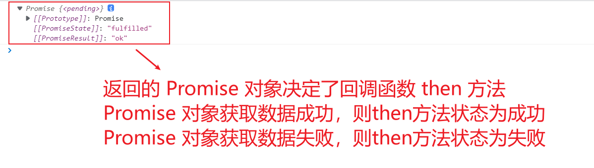

3. 抛出错误

```html
<body>

    <script>
        const p = new Promise((resolve, reject) => {
            setTimeout(() => {
                resolve("获取数据成功");

            }, 1000)
        });

        //调用 then 方法  then方法的返回结果是 Promise 对象, 对象状态由回调函数的执行结果决定
        //3.抛出错误
        const result = p.then(value => {
            //3. 抛出错误
            throw new Error('出错啦!');

        }, reason => {
            console.warn(reason);
        })

        console.log(result);
    </script>
</body>
```


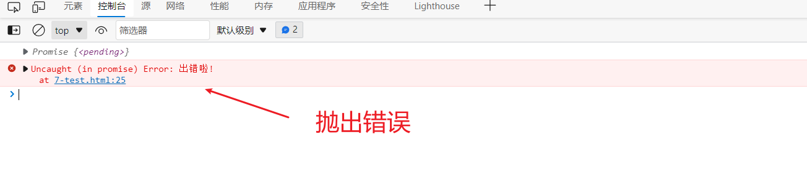


所以 Promise.then 方法是可以链式调用的

```js
p.then(value =>{},reason => {}).then(value =>{},reason => {})

// 常用写法如下
p.then(value=>{

}).then(value=>{

});
```

## 5.4、Promise.catch方法

```html
<body>
    <script>
        const p = new Promise((resolve, reject)=>{
            setTimeout(()=>{
                //设置 p 对象的状态为失败, 并设置失败的值
                reject("出错啦!");
            }, 1000)
        });

        // p.then(function(value){}, function(reason){
        //     console.error(reason);
        // });

        p.catch(function(reason){
            console.warn(reason);
        });
    </script>
</body>
```

`Promise.catch` 就是 `Promise.then` 缺少第一个函数参数的语法糖，用`then` 就可以。


# 6、Set

- Map的属性和方法

  - `size` 返回Set的元素个数

  - `add` 增加一个新元素，返回当前Set

  - `has` 检测Set中是否包含某个元素

  - `clear` 清空集合，返回 undefined

```javascript
//声明一个 set集合
let s = new Set();
let s2 = new Set(['大事儿','小事儿','好事儿','坏事儿','小事儿']);
console.log(s2);// { '大事儿', '小事儿', '好事儿', '坏事儿' }
// 注意Set集合会有去重功能,所以s2的元素个数其实是4个

// 元素个数
console.log(s2.size); // 4
// 添加新的元素
s2.add('喜事儿');
console.log(s2);  // { '大事儿', '小事儿', '好事儿', '坏事儿', '喜事儿' }
// 删除元素
s2.delete('坏事儿');
// 检测是否存在某个值
console.log(s2.has('糟心事')); // false
// 清空
s2.clear(); 
console.log(s2);// {}
```


## 6.1、Set集合实践

1. 数组去重

```js
let arr = [1,2,3,4,5,4,3,2,1];
//1. 数组去重
let result1 = new Set(arr); //此时result是一个集合,转化为数组只需要使用扩展运算符展开
console.log(result1); // { 1, 2, 3, 4, 5 }


let result2 = [...new Set(arr)];
console.log(result2); // [ 1, 2, 3, 4, 5 ]
```

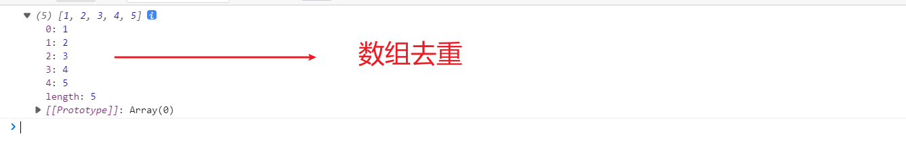

2. 两个集合求交集

```js
let arr = [1,2,3,4,5,4,3,2,1];
let arr2 = [4,5,6,5,6];
// 首先先对数组去重
let result = [...new Set(arr)];
let result2 = [...new Set(arr2)];


```


# 7、Map

- ES6 提供了 Map 数据结构。它类似于对象，也是键值对的集合。
- 数据结构。它类似于对象，也是键值对的集合。 但是“键”的范围不限于字符串，各种类型的值（包括对象）都可以当作键。
- Map也实现了iterator接口，所以可以使用 `扩展运算符` 和 `for…of…`进行遍历。

- Map的属性和方法
  - `size` 返回Map的元素个数
  - `set` 增加一个新元素，返回当前Map
  - `get` 返回键名对象的键值
  - `has` 检测Map中是否包含某个元素
  - `clear` 清空集合，返回 undefined

```javascript
//创建一个空Map
let m = new Map();
//创建一个非空Map
let m2 = new Map([
    ['name','林晓'],
    ['age','21']
]);
//添加元素
m2.set('salary','30000');
//添加方法
m2.set('fighting', function(){
    console.log("加油!!");
});
console.log(m2);

// 获取
console.log(m2.get('name'));
console.log(m2.get('age'));
console.log(m2.get('salary'));
console.log(m2.get('fighting'));

// 删除
m2.delete('age');

// 检查是否包含某元素
console.log(m2.has('age'));

// 清除
m2.clear();
```

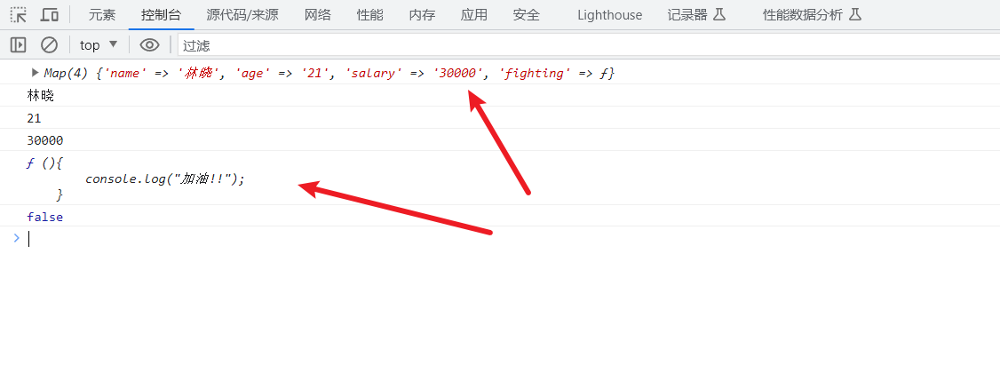


