# 1、LayUI

和 Bootstrap 有些相似，但该框架有个极大的好处就是定义了很多前后端交互的样式接口，如分页表格，只需在前端配置好接口，后端则按照定义好的接口规则返回数据，即可完成页面的展示，极大减少了后端人员的开发成本。

## 1.1、下载与使用

- 官网：https://www.layui.com/

- 点击==立即下载==即可
- 下载完成后解压，我们看以下其目录结构，并将其完整的拷贝到我们自己的项目下。

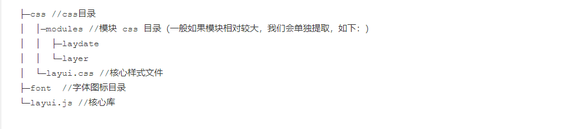

- 使用时我们只需引入下述两个文件即可使用

```html
<!-- LayUI的核心CSS文件 -->
<link rel="stylesheet" type="text/css" href="layui-v2.5.6/layui/css/layui.css"/>
<!-- LayUI的核心JS文件（采用模块化引入） --> 
<script src="layui-v2.5.6/layui/layui.js" type="text/javascript" charset="utf-8"></script>
```

- 这是一个基本的入门页面

```html
<!DOCTYPE html>
<html>
<head>
  <meta charset="utf-8">
  <meta name="viewport" content="width=device-width, initial-scale=1, maximum-scale=1">
  <title>开始使用 layui</title>
  <!-- LayUI的核心CSS文件 -->
  <link rel="stylesheet" href="./layui/css/layui.css">
</head>
<body>
 
<!-- 你的 HTML 代码 -->
<!-- LayUI的核心JS文件 -->
<script src="./layui/layui.js"></script>
<script>
    layui.use(['layer', 'form'], function(){
      var layer = layui.layer,
      	  form = layui.form;

      layer.msg('Hello World');
    });
</script> 
</body>
</html>
```


# 2、布局

## 2.1、布局容器

### 2.1.1、固定宽度

- 将栅格放入一个带有 `class="layui-container"` 的特定的容器中，以便在小屏幕以上的设备中固定宽度，让列可控。
- ==固定宽度的两侧有留白效果==

```html
<div class="layui-container" style="background-color: pink;height: 300px;">
        固定宽度（两侧有留白效果）
</div>
```

### 2.1.2、完整宽度

- 可以不固定容器宽度。将栅格或其它元素放入一个带有 `class="layui-fluid"`的容器中，那么宽度将不会固定，而是 100% 适应
- ==完整宽度占据屏幕宽度的100%==

```html
<div class="layui-fluid" style="background-color: cyan;height: 300px;">
		 完整宽度(占据屏幕宽度的100%)
</div>
```

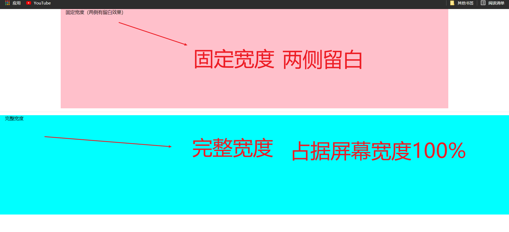


## 2.2、栅格系统

我们将容器进行了 12 等分，预设了 4*12 种 CSS 排列类，它们在移动设备、平板、桌面中/大尺寸四种不同的屏幕下发挥着各自的作用。

### 2.2.1、栅格布局规则

- 采用 `class="layui-row"` 来定义行，如：

```html
<div class="layui-row"></div>
```

- 采用类似 `layui-col-md*` 这样的预设类来定义一组列(column)，且放在行(row)中
  - 变量 `md` 代表的是不同屏幕下的标记
  - 变量 `*` 代表的是该列所占用的12等分数（如6/12），可选值为 1 - 12
  - 如果多个列的“等分数值”总和等于12，则刚好满行排列。如果大于12，多余的列将自动另起一行。
- 列可以同时出现最多四种不同的组合，分别是：*xs*（超小屏幕，如手机）、*sm*（小屏幕，如平板）、*md*（桌面中等屏幕）、*lg*（桌面大型屏幕），以呈现更加动态灵活的布局。
- 可对列追加类似 `layui-col-space5`、 `layui-col-md-offset3` 这样的预设类来定义列的间距和偏移。
- 可以在列（column）元素中放入你自己的任意元素填充内容，完成布局！

示例：

```html
<!-- 
    栅格系统
        列组合
            1. 定义行   .layui-row
            2. 定义列	.layui-col-md*
                md 表示不同屏幕的标识（xs、sm、md、lg）
                * 表示列的数量
            3. 每一行被均分为12列，列的总数不能超过12，否则会自动换行
 -->

<!-- 布局容器 -->
<div class="layui-container">
    <!-- 定义行 -->
    <div class="layui-row">
        <!-- 定义列  -->
        <div class="layui-col-md5" style="background-color: deepskyblue;">
            内容5/12
        </div>
        <div class="layui-col-md7" style="background-color: bisque;">
            内容7/12
        </div>
    </div>
    
    
    <!-- 定义行 -->
    <div class="layui-row">
        <!-- 定义列  -->
        <div class="layui-col-md4" style="background-color: powderblue;">
            内容4/12
        </div>
        <div class="layui-col-md4" style="background-color: mediumaquamarine;">
            内容4/12
        </div>
        <div class="layui-col-md6" style="background-color: grey;">
            内容6/12
        </div>
    </div>
</div>
```

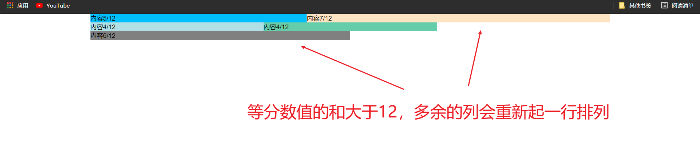


### 2.2.2、响应式规则

- 简单来说，就是会针对四类不同尺寸的屏幕，进行响应式适配处理。

```html
<!--
	            4. 响应式规则
                栅格会自动根据屏幕的分辨率选择对应的样式效果。
-->

<body>
    <h3>平板、桌面端的不同表现：</h3>
    <div class="layui-row">
        <!-- 小屏幕占6列，中屏幕占4列 -->
        <div class="layui-col-sm6 layui-col-md4" style="background-color: thistle">
            平板≥768px：6/12 | 桌面端≥992px：4/12
        </div>
    </div>

    <div class="layui-row">
        <!-- 小屏幕占4列，中屏幕占6列 -->
        <div class="layui-col-sm4 layui-col-md6" style="background-color: mediumaquamarine;">
            平板≥768px：4/12 | 桌面端≥992px：6/12
        </div>
    </div>

    <div class="layui-row">
        <!-- 小屏幕占12列，中屏幕占8列 -->
        <div class="layui-col-sm12 layui-col-md8" style="background-color: coral">
            平板≥768px：12/12 | 桌面端≥992px：8/12
        </div>
    </div>
</body>
```

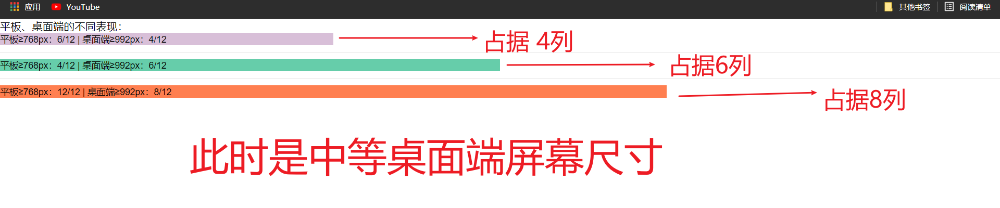

我们将屏幕尺寸切换为小屏幕平板尺寸

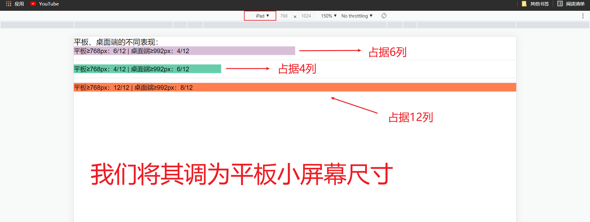


### 2.2.3、列间距

- 设定列之间的间距
- 且一行中最左的列不会出现左边距，最右的列不会出现右边距

- 列间距在保证排版美观的同时，还可以进一步保证分列的宽度精细程度。
- 给容器添加`class="layui-col-space*"`
  - `*` 支持1px-30px区间的所有双数间隔，以及 1px、5px、15px、25px 的单数间隔

```html
<!-- 列边距 .layui-col-space*  -->
<h3>列边距</h3>
<div class="layui-row layui-col-space20">
    <div class="layui-col-md4">
        <!-- 给具体的内容设置背景颜色 -->
        <div style="background-color: hotpink">4</div>
    </div>
    <div class="layui-col-md4">
        <div style="background-color: indianred">4</div>
    </div>
    <div class="layui-col-md4">
        <div style="background-color: powderblue">4</div>
    </div>
</div>
```

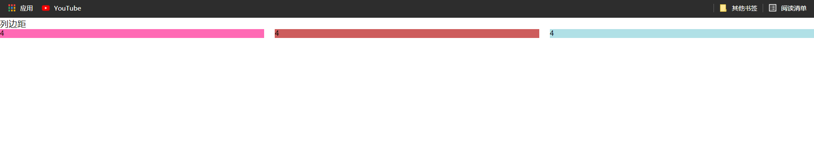

注意：

- `layui-col-space` 设置后不起作用主要是因为设置的是 padding，也就是说==向内缩==，所以设置背景色 padding 也是会添上颜色，看起来好像没有间距一样。可以在里面加一个 div 来达到目的

- 如果需要的间距高于30px（一般不常见），我们需要采用列偏移

### 2.2.4、列偏移

- 对列追加类似 `layui-col-md-offset*` 的预设类，从而让列向右偏移
  - 其中 `*`  号代表的是偏移占据的列数，可选中为 1 - 12 
  - 如 `layui-col-md-offset3` ，即代表在 中型桌面屏幕下，让该列向右偏移3个列宽度。

 ```html
 <body>
     <h3>列偏移</h3>
     <div class="layui-row">
         <div class="layui-col-md4">
             <div style="background-color: red">4</div>
         </div>
         
         <!--向右移动4列-->
         <div class="layui-col-md4 layui-col-md-offset4">
             <div style="background-color: skyblue">
                 向右移动4列
             </div>
         </div>
     </div>
 </body>
 ```


### 2.2.5、列嵌套

- 列之间可以无限嵌套列

```html
<div class="layui-row">
    <!-- 大的盒子占6列 -->
    <div class="layui-col-md6">
        <div style="background-color: red">
            <div class="layui-row">
                <!-- 嵌套列 -->
                <div class="layui-col-md3" style="background-color: burlywood;">
                    内部列
                </div>
                <div class="layui-col-md5" style="background-color: indianred;">
                    内部列
                </div>
                <div class="layui-col-md2" style="background-color: mediumaquamarine;">
                    内部列
                </div>
            </div>
        </div>
    </div>
</div>
```


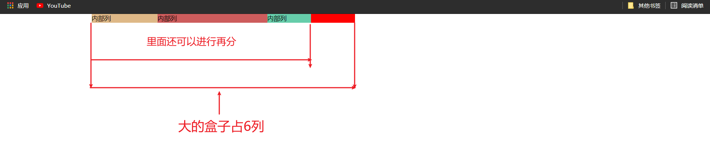


# 3、按钮

## 3.1、按钮风格

- 向任意 HTML 元素设定 `class="layui-btn"` ，建立一个基础按钮。
- 通过追加样式为 `class="layui-btn-{type}"` 来定义其他按钮风格

| 名称 | 组合                                   |
| ---- | -------------------------------------- |
| 原始 | `class="layui-btn layui-btn-primary"`  |
| 默认 | `class="layui-btn"`                    |
| 百搭 | `class="layui-btn layui-btn-normal"`   |
| 暖色 | `class="layui-btn layui-btn-warm"`     |
| 警告 | `class="layui-btn layui-btn-danger"`   |
| 禁用 | `class="layui-btn layui-btn-disabled"` |

```html
<body>
    <div class="layui-container">
        <!-- 基础按钮 -->
        <button type="button" class="layui-btn">一个标准的按钮</button>
        <a href="http://www.layui.com" class="layui-btn">一个可跳转的按钮</a>
        <div class="layui-btn">一个按钮</div>
        <hr>
        <!-- 不同主题的按钮 -->
        <button class="layui-btn">默认按钮</button>
        <button class="layui-btn layui-btn-primary">原始按钮</button>
        <button class="layui-btn layui-btn-normal">百搭按钮</button>
        <button class="layui-btn layui-btn-warm">暖色按钮</button>
        <button class="layui-btn layui-btn-danger">警告按钮</button>
        <button class="layui-btn layui-btn-disabled">禁用按钮</button>
    </div>
</body>
```

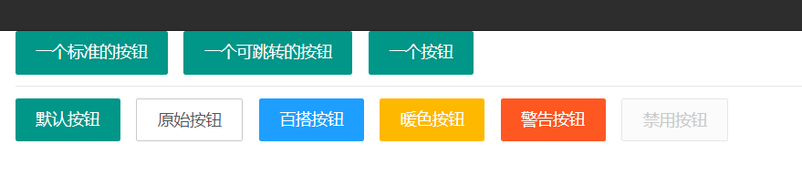


## 3.2、按钮尺寸

| 尺寸                 | 组合                                |
| -------------------- | ----------------------------------- |
| 大型                 | `class="layui-btn layui-btn-lg"`    |
| 默认                 | `class="layui-btn"`                 |
| 小型                 | `class="layui-btn layui-btn-sm"`    |
| 迷你                 | `class="layui-btn layui-btn-xs"`    |
| 流体按钮(最大化适应) | `class="layui-btn layui-btn-fluid"` |

```html
<body>
    <div class="layui-container">
        <!-- 不同尺寸的按钮 -->
        <button class="layui-btn layui-btn-primary layui-btn-lg">大型原始按钮</button>
        <button class="layui-btn">默认按钮</button>
        <button class="layui-btn layui-btn-sm layui-btn-danger">小型警告按钮</button>
        <button class="layui-btn layui-btn-xs">迷你按钮</button>
        <button type="button" class="layui-btn layui-btn-fluid">流体按钮（最大化适应）</button>
    </div>
</body>
```

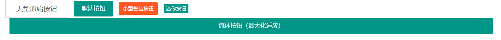


## 3.3、圆角按钮

| 主题 | 组合                                                    |
| ---- | ------------------------------------------------------- |
| 原始 | `class="layui-btn layui-btn-radius layui-btn-primary"s` |
| 默认 | `class="layui-btn layui-btn-radius"`                    |
| 百搭 | `class="layui-btn layui-btn-radius layui-btn-normal"`   |
| 暖色 | `class="layui-btn layui-btn-radius layui-btn-warm"`     |
| 警告 | `class="layui-btn layui-btn-radius layui-btn-danger"`   |
| 禁用 | `class="layui-btn layui-btn-radius layui-btn-disabled"` |

```html
<div class="layui-container">
    <!-- layui-btn-radius 圆角按钮 -->
    <button class="layui-btn layui-btn-radius">默认圆角按钮</button>
    <button class="layui-btn layui-btn-primary layui-btn-radius">原始圆角按钮</button>
    <button class="layui-btn layui-btn-normal layui-btn-radius">百搭圆角按钮</button>
    <button class="layui-btn layui-btn-warm layui-btn-radius">暖色圆角按钮</button>
    <button class="layui-btn layui-btn-danger layui-btn-radius">警告圆角按钮</button>
    <button class="layui-btn layui-btn-disabled layui-btn-radius">禁用圆角按钮</button>
</div>
```

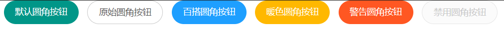


## 3.4、图标按钮

### 3.4.1、图标

- 对 i 标签 设定 `class="layui-icon"`
- 然后对元素加上图标对应的 `font-class`
- 内置图标一览表：https://www.layui.com/doc/element/icon.html

```html
<i class="layui-icon layui-icon-face-smile"></i> 
```


### 3.4.2、图标按钮

```html
<body>
    <div class="layui-container">
        <!-- 图标按钮 -->
        <button type="button" class="layui-btn">
			<i class="layui-icon">&#xe608;</i> 添加
		</button>

        <button type="button" class="layui-btn layui-btn-sm layui-btn-primary">
			<i class="layui-icon">&#x1002;</i> 刷新
		</button>

        <button type="button" class="layui-btn layui-btn-sm layui-btn-warm">
			<i class="layui-icon layui-icon-heart"></i> 关注
		</button>
    </div>
</body>
```

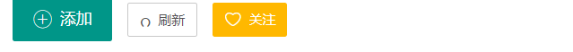


# 4、导航

- 导航一般应用于头部和侧边，是整个网页画龙点晴般的存在

- 依赖加载模块：`element`

实现步骤：

1. 引入的资源

```html
<link rel="stylesheet" type="text/css" href="layui-v2.5.6/layui/css/layui.css"/>
<script src="layui-v2.5.6/layui/layui.js" type="text/javascript" charset="utf-8"></script>
```

2. 依赖加载模块

```html
<script type="text/javascript">
    // 导航 依赖element模块,否则无法进行功能性操作
    layui.use('element',function(){
        var element = layui.element;
    });					

</script>
```

## 4.1、水平导航

- 给一个无序列表 ul 添加 `class="layui-nav"`
- 给 li 添加 `class="layui-nav-ithm"` 表示的是导航的子项
- 给 li 添加 `class="layui-this"` 表示当前被选中的项
- 给 li 里面容器添加 `class="layui-nav-child"` 表示的是二级菜单

```html
<body>
    <!-- 
		水平导航	layui-nav
					layui-nav-item 表示的是导航的子项
					layui-this 表示当前被选中的项
					layui-nav-child 表示的是二级菜单
	 -->
    <!-- 水平导航 layui-nav -->
    <ul class="layui-nav">
        <li class="layui-nav-item"><a href="">最新活动</a></li>
        <li class="layui-nav-item layui-this"><a href="">产品</a></li>
        <li class="layui-nav-item"><a href="">大数据</a></li>
        <li class="layui-nav-item">
            <a href="">解决方案</a>
            <!--二级菜单-->
            <dl class="layui-nav-child">
                <dd><a href="">移动模块</a></dd>
                <dd><a href="">后台模块</a></dd>
                <dd><a href="">电商平台</a></dd>
            </dl>
        </li>
    </ul>


    <script type="text/javascript">
        // 导航 依赖element模块
        layui.use('element', function() {
            var element = layui.element;
        });
    </script>
</body>
```

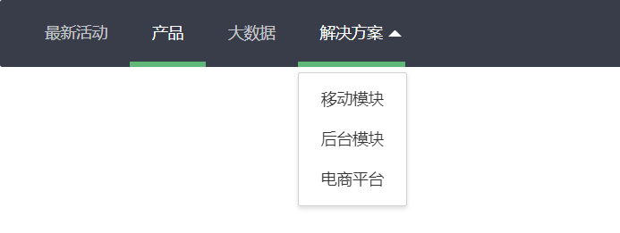

### 4.2.1、图片与徽章

除了一般的文字导航，我们还内置了图片和徽章的支持，如：

```html
<body>
    <!-- 
		水平导航	layui-nav
					layui-nav-item 表示的是导航的子项
					layui-this 表示当前被选中的项
					layui-nav-child 表示的是二级菜单
	 -->
    
    <!-- 水平导航 -->
    <ul class="layui-nav">
        <!-- 导航的子项 -->
        <li class="layui-nav-item">

            <a href="">控制台<span class="layui-badge">9</span></a>
        </li>
        <!-- 导航的子项 -->
        <li class="layui-nav-item">
            <a href="">个人中心<span class="layui-badge-dot"></span></a>
        </li>
        <!-- 导航的子项 -->
        <li class="layui-nav-item">
            <a href="">我</a>
            <dl class="layui-nav-child">
                <dd><a href="#">修改信息</a></dd>
                <dd><a href="#">安全管理</a></dd>
                <dd><a href="#">退出</a></dd>
            </dl>
        </li>
    </ul>


    <script type="text/javascript">
        // 导航 依赖element模块
        layui.use('element', function() {
            var element = layui.element;
        });
    </script>
</body>
```

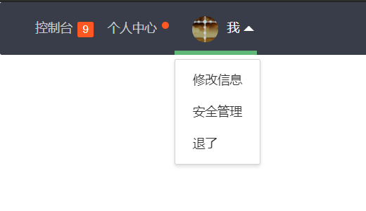


## 4.2、导航主题

通过对导航追加CSS背景类，让导航呈现不同的主题色

- 给无序列表 ul 添加 `class="layui-nav layui-bg-green"` 可设置墨绿色背景的导航
- 水平导航支持其他的背景主题有：`layui-bg-cyan`(藏青)、`layui-bg-molv`(墨绿)、`layui-bg-blue`(艳蓝)
- 垂直导航支持的其他背景颜色有：`layui-bg-cyan` (藏青)

```html
<body>
    <!-- 墨绿 -->
    <ul class="layui-nav layui-bg-green">
        <li class="layui-nav-item"><a href="">最新活动</a></li>
        <li class="layui-nav-item layui-this"><a href="">产品</a></li>
        <li class="layui-nav-item"><a href="">大数据</a></li>
        <li class="layui-nav-item">
            <a href="">解决方案</a>
            <!--二级菜单-->
            <dl class="layui-nav-child">
                <dd><a href="">移动模块</a></dd>
                <dd><a href="">后台模块</a></dd>
                <dd><a href="">电商平台</a></dd>
            </dl>
        </li>
    </ul>

    <hr>
    <!-- 藏青 -->
    <ul class="layui-nav layui-bg-cyan">
        <li class="layui-nav-item"><a href="">最新活动</a></li>
        <li class="layui-nav-item layui-this"><a href="">产品</a></li>
        <li class="layui-nav-item"><a href="">大数据</a></li>
        <li class="layui-nav-item">
            <a href="">解决方案</a>
            <!--二级菜单-->
            <dl class="layui-nav-child">
                <dd><a href="">移动模块</a></dd>
                <dd><a href="">后台模块</a></dd>
                <dd><a href="">电商平台</a></dd>
            </dl>
        </li>
    </ul>

    <!-- 艳蓝 -->
    <hr>
    <ul class="layui-nav layui-bg-blue">
        <li class="layui-nav-item"><a href="">最新活动</a></li>
        <li class="layui-nav-item layui-this"><a href="">产品</a></li>
        <li class="layui-nav-item"><a href="">大数据</a></li>
        <li class="layui-nav-item">
            <a href="">解决方案</a>
            <!--二级菜单-->
            <dl class="layui-nav-child">
                <dd><a href="">移动模块</a></dd>
                <dd><a href="">后台模块</a></dd>
                <dd><a href="">电商平台</a></dd>
            </dl>
        </li>
    </ul>


    <script type="text/javascript">
        // 导航 依赖element模块
        layui.use('element', function() {
            var element = layui.element;
        });
    </script>
</body>
```

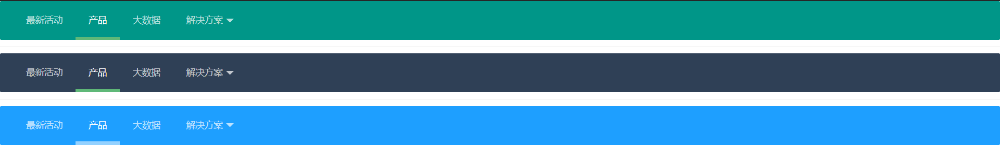


## 4.3、垂直导航

- 给无序列表 ul 添加 `class="layui-nav layui-nav-tree"`
- 给 li 添加 `class="layui-nav-item layui-nav-itemed"` 表示此子项目是默认展开的

```html
<!-- 垂直导航 layui-nav layui-nav-tree  -->
<ul class="layui-nav layui-nav-tree">
    <li class="layui-nav-item  layui-nav-itemed">
        <a href="#">默认展开</a>
        <dl class="layui-nav-child">
            <dd><a href="#">选项1</a></dd>
            <dd><a href="#">选项2</a></dd>
            <dd><a href="">跳转</a></dd>
        </dl>
    </li>
    <li class="layui-nav-item layui-nav-itemed">
        <a href="#">解决方案</a>
        <dl class="layui-nav-child">
            <dd><a href="">移动模块</a></dd>
            <dd><a href="">后台模版</a></dd>
            <dd><a href="">电商平台</a></dd>
        </dl>
    </li>
    <li class="layui-nav-item"><a href="">产品</a></li>
    <li class="layui-nav-item"><a href="">大数据</a></li>
</ul>
```

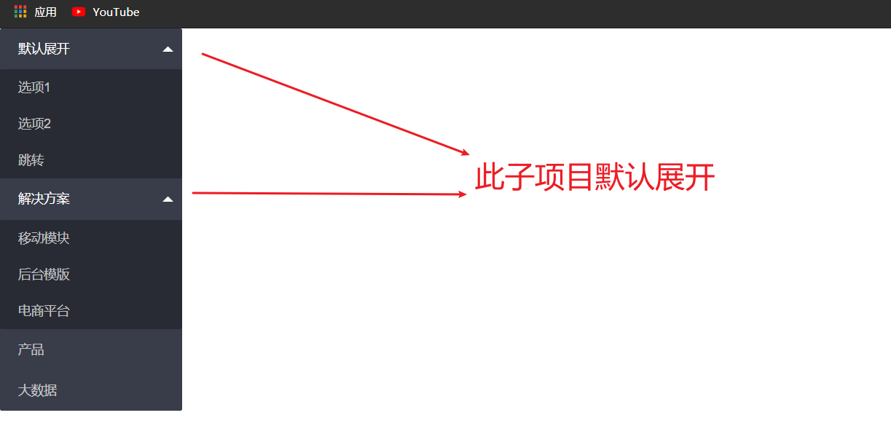


## 4.4、侧边导航

- 给无序列表 ul 添加 `class="layui-nav layui-nav-tree layui-nav-side"`

- 设定`layui-this`来指向当前页面分类。

```html
<!-- 侧边导航: <ul class="layui-nav layui-nav-tree layui-nav-side"> -->
<ul class="layui-nav layui-nav-tree layui-nav-side">
    <li class="layui-nav-item  layui-nav-itemed">
        <a href="#">默认展开</a>
        <dl class="layui-nav-child">
            <dd><a href="#">选项1</a></dd>
            <dd><a href="#">选项2</a></dd>
            <dd><a href="">跳转</a></dd>
        </dl>
    </li>
    <li class="layui-nav-item layui-nav-itemed">
        <a href="#">解决方案</a>
        <dl class="layui-nav-child">
            <dd><a href="">移动模块</a></dd>
            <dd><a href="">后台模版</a></dd>
            <dd><a href="">电商平台</a></dd>
        </dl>
    </li>
    <li class="layui-nav-item layui-this"><a href="">产品</a></li>
    <li class="layui-nav-item"><a href="">大数据</a></li>
</ul>
```

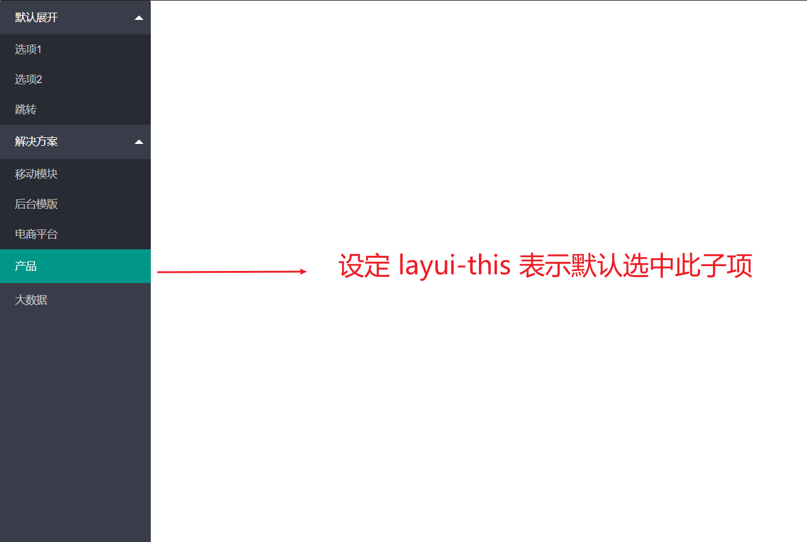

## 4.5、总结

水平、垂直、侧边三个导航的 HTML 结构是完全一样的，不同的是

> 水平导航：`class="layui-nav"`

> 垂直导航需要追加：`class="layui-nav-tree"`

> 侧边导航需要追加：`class="layui-nav-tree layui-nav-side"`

## 4.6、面包屑导航

- 给 span 标签 添加 `layui-breadcrumb`

```html
<span class="layui-breadcrumb">
  <a href="">首页</a>
  <a href="">国际新闻</a>
  <a href="">亚太地区</a>
  <a><cite>正文</cite></a>
</span>
```

- 我们还可以通过设置属性 `lay-separator="-"` 来自定义分隔符

```html
<div class="layui-container">
    <!-- 面包屑式导航 -->
    <span class="layui-breadcrumb">
        <a href="">首页</a>
        <a href="">国际新闻</a>
        <a href="">亚太地区</a>
        <a><cite>正文</cite></a>
      </span>
    <hr>
    <!-- 设置属性 lay-separator="" 来自定义分隔符 -->
    <span class="layui-breadcrumb" lay-separator="-">
        <a href="">首页</a>
        <a href="">国际新闻</a>
        <a href="">亚太地区</a>
        <a><cite>正文</cite></a>
      </span>
    <hr>
    <span class="layui-breadcrumb" lay-separator="|">
        <a href="">娱乐</a>
        <a href="">八卦</a>
        <a href="">体育</a>
        <a href="">搞笑</a>
        <a href="">视频</a>
        <a href="">游戏</a>
        <a href="">综艺</a>
      </span>
</div>
```

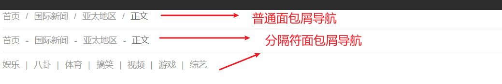


# 5、选项卡

- 导航菜单可应用于头部和侧边，Tab选项卡提供多套风格，支持响应式，支持删除选项卡等功能。

- 依赖加载模块：`element`

实现步骤：

1. 引入的资源

```html
<link rel="stylesheet" type="text/css" href="layui-v2.5.6/layui/css/layui.css"/>
<script src="layui-v2.5.6/layui/layui.js" type="text/javascript" charset="utf-8"></script>
```

2. 依赖加载模块

```html
<script type="text/javascript">
    // 注意：选项卡 依赖 element 模块，否则无法进行功能性操作
    layui.use('element', function(){
        var element = layui.element;

    });
</script>
```


## 5.1、选项卡风格

* 默认风格给容器添加 ：`class="layui-tab"`

- 简洁风格给容器追加：`class="layui-tab-brief"`
- 卡片风格给容器需要追加：`class=layui-tab-card`

```html
<body>
    <!-- 默认风格 .layui-tab-->
    <div class="layui-tab">
        <!-- 设置选项卡标题 .layui-tab-title -->
        <ul class="layui-tab-title">
            <li>网站设置</li>
            <li>用户管理</li>
            <li class="layui-this">权限分配</li>
            <li>商品管理</li>
            <li>订单管理</li>
        </ul>
        <!-- 设置选项卡的内容 .layui-tab-content -->
        <div class="layui-tab-content">
            <div class="layui-tab-item">内容1</div>
            <div class="layui-tab-item">内容2</div>
            <!-- 默认显示此内容 -->
            <div class="layui-tab-item layui-show">内容3</div>
            <div class="layui-tab-item">内容4</div>
            <div class="layui-tab-item">内容5</div>
        </div>
    </div>
    <hr>
    <!-- 简洁风格 -->
    <div class="layui-tab layui-tab-brief">
        <ul class="layui-tab-title">
            <li class="layui-this">网站设置</li>
            <li>用户管理</li>
            <li>权限分配</li>
            <li>商品管理</li>
            <li>订单管理</li>
        </ul>
        <div class="layui-tab-content">
            <div class="layui-tab-item layui-show">内容1</div>
            <div class="layui-tab-item">内容2</div>
            <div class="layui-tab-item">内容3</div>
            <div class="layui-tab-item">内容4</div>
            <div class="layui-tab-item">内容5</div>
        </div>
    </div>
    <hr>
    <!-- 卡片风格 -->
    <div class="layui-tab layui-tab-card">
        <ul class="layui-tab-title">
            <li class="layui-this">网站设置</li>
            <li>用户管理</li>
            <li>权限分配</li>
            <li>商品管理</li>
            <li>订单管理</li>
        </ul>
        <div class="layui-tab-content">
            <div class="layui-tab-item layui-show">内容1</div>
            <div class="layui-tab-item">内容2</div>
            <div class="layui-tab-item">内容3</div>
            <div class="layui-tab-item">内容4</div>
            <div class="layui-tab-item">内容5</div>
        </div>
    </div>


    <script type="text/javascript">
        // 导航 依赖element模块
        layui.use('element', function() {
            var element = layui.element;
        });
    </script>
</body>
```

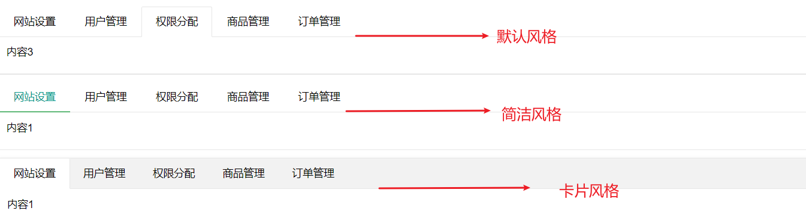

> 默认风格：`class="layui-tab"`

> 简洁风格需要追加：`class="layui-tab-brief"`

> 卡片风格需要追加：`class="layui-tab-card"`


# 6、表格

## 6.1、常规用法

1. 给 table 标签增加 `class="layui-table"`

2. 在`colgroup` 标签中定义表格列的宽度
   - `<col width="数值">` 表示相应列所占的宽度

3. `thead` 标签表示表格的头部区域
   - `tr` 标签用于定义表格中的行(行头)
     - `th` 标签用于定义表格中的表头(列头)

```html
<!-- 
    表格
        class="layui-table"
        常用属性
            lay-even 如果设置了该属性，则可以显示隔行换色的效果
            lay-skin 设置表格边框风格
                line （行边框风格）
                row （列边框风格）
                nob （无边框风格）
            lay-size 设置表格的尺寸
                sm （小尺寸）
                lg （大尺寸）
 -->

<!-- 基础表格 .layui-table -->
<table class="layui-table">
    <colgroup>
        <!-- 第一列宽 150px 第二列宽300px 第三列宽自适应100% -->
        <col width="150">
        <col width="300">
        <col>
    </colgroup>
    <!-- thead 标签表示表格的头部区域,其内部必须拥有 tr 标签, tr标签一般位于第一行 -->
    <thead>
        <!-- tr用于定义表格中的行,必须嵌套在 table 中 -->
        <tr>
            <!-- th 用于定义表格中的表头,必须嵌套在 tr 中 -->
            <th>昵称</th>
            <th>加入时间</th>
            <th>签名</th>
        </tr>
    </thead>

    <tbody>
        <tr>
            <td>贤心</td>
            <td>2016-11-29</td>
            <td>人生就像是一场修行</td>
        </tr>
        <tr>
            <td>许闲心</td>
            <td>2016-11-28</td>
            <td>于千万人之中遇见你所遇见的人，于千万年之中，时间的无涯的荒野里…</td>
        </tr>
    </tbody>
</table>
```

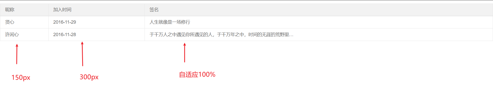


## 6.2、基础属性

静态表格支持以下基础属性，可定义不同风格/尺寸的表格样式：

| 属性名            | 属性值                                                     | 备注                                   |
| ----------------- | ---------------------------------------------------------- | -------------------------------------- |
| lay-even          | 无                                                         | 用于开启隔行背景，可与其他属性一起使用 |
| lay-skin="属性值" | line(行边框风格)<br />row(列边框风格)<br />nob(无边框风格) | 若使用默认风格不设置该属性即可         |
| lay-size="属性值" | sm(小尺寸)<br />lg(大尺寸)                                 | 若使用默认尺寸不设置该属性即可         |

将我们所需要的基础属性写在 `table` 标签上即可：如（一个带有隔行背景，且行边框风格的大尺寸表格）：

```html
<table lay-even lay-skin="line" lay-size="lg">
	
</table>
```


# 7、表单

- 依赖加载模块：`form`

实现步骤：

1. 引入的资源

```html
<link rel="stylesheet" type="text/css" href="layui-v2.5.6/layui/css/layui.css"/>
<script src="layui-v2.5.6/layui/layui.js" type="text/javascript" charset="utf-8"></script>
```

2. 依赖加载模块

```html
<!-- 加载模块 -->
<script type="text/javascript">
    // 加载form模块
    layui.use("form",function(){
        var form = layui.form;
    });		
</script>
```

3. 在一个容器中设定 `class="layui-form"` 来标识一个表单元素块

```html
<form class="layui-form" action="">

</form>
```

4. 基本的行区块结构，它提供了响应式的支持。
   - 给 div 添加 `class="layui-form-item"` 代表”行“
   - 给 label 添加 `class="layui-form-label"` 代表”区“
   - 给 div 添加 `class="layui-input-inline"` 代表”块“

```html
<body>
    <!-- 在一个容器中设定 class="layui-form" 来标识一个表单元素块 -->
    <form action="" class="layui-form">
        <!-- 基本的行区块结构，它提供了响应式的支持。-->
        <div class="layui-form-item">
            <label class="layui-form-label">标题区域</label>
            <div class="layui-input-inline">
                <!-- 输入框 -->
                <input type="text" name="title" required lay-verify="required" placeholder="请输入标题" autocomplete="off" class="layui-input" />
            </div>
        </div>

        <div class="layui-form-item">
            <label class="layui-form-label">密码框区域</label>
            <div class="layui-input-inline">
                <input type="password" name="password" required lay-verify="required" placeholder="请输入密码" autocomplete="off" class="layui-input">
    </form>


    <script type="text/javascript">
        // 表单 依赖form模块
        layui.use('form', function() {
            var form = layui.form;
        });
    </script>
</body>
```

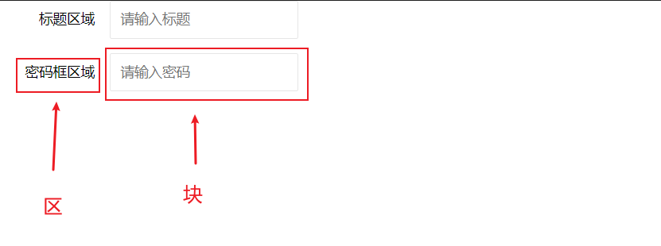


## 7.0、表单的常用属性

| 常用属性                     | 描述                                                         |
| ---------------------------- | ------------------------------------------------------------ |
| required                     | 浏览器固定的必填字段                                         |
| lay-verify                   | 需要验证的类型(值为 required 的话表示必填项)                 |
| `class="layui-input"`        | 提供的通用的样式                                             |
| `class="layui-input-block"`  | 占据全部宽度                                                 |
| `class="layui-input-inline"` | 占据部分宽度                                                 |
| placeholder                  | 当文本框为空时，默认显示的文本信息                           |
| autocomplete                 | 表单元素是否自动填充(当浏览器中缓存中存在相同name属性的值时，会填充) |


## 7.1、输入框

```html
<!-- 输入框 -->
<input type="text" name="title" required lay-verify="required" placeholder="请输入标题" autocomplete="off" class="layui-input" />
```

- required：注册浏览器所规定的必填字段
- `lay-verify="required"` ：注册 form 模块需要验证的类型
- `class="layui-input"`：layui.css 提供的通用 CSS 类


## 7.2、下拉选择框

- 通过 `selected` 属性设置默认选中项
- 通过 `disabled` 属性开启禁用，可以设置 select 和 option 标签(表示禁用下拉框和禁用下拉选项)
- 通过 `optgroup` 标签给 select 分组
- 通过设置 `lay-search` 属性开启搜索匹配功能

```html
<body>
    <div class="layui-container">
        <form action="" class="layui-form">
            <div class="layui-form-item">
                <label class="layui-form-label">城市</label>
                <div class="layui-input-inline">
                    <!-- 
                            下拉选择框
                                1. 通过selected属性设置默认选中项
                                2. 通过disabled属性开启禁用，可以设置select和option标签（禁用下拉框和禁用下拉选项）
                                3. 可以通过 optgroup 标签给select分组
                                4. 通过设置lay-search属性开启搜索匹配功能
                         -->
                    <select name="city" lay-verify="required">
                           <option value="">请选择一个城市</option>
                           <option value="010">北京</option>
                           <option value="021" selected>上海</option>
                           <option value="0571" disabled>杭州</option>
                    </select>
                </div>
            </div>
        </form>
    </div>

    <script type="text/javascript">
        // 表单,依赖 form 模块
        layui.use('form', function() {
            var form = layui.form;
        })
    </script>
</body>
```


### 7.2.1、分组

- 可以通过 `optgroup` 标签给select分组

```html
<body>
    <div class="layui-container">
        <form action="" class="layui-form">
            <div class="layui-form-item">
                <label class="layui-form-label">城市</label>
                <div class="layui-input-inline">
                    <!-- 
                            下拉选择框
                                1. 通过selected属性设置默认选中项
                                2. 通过disabled属性开启禁用，可以设置select和option标签（禁用下拉框和禁用下拉选项）
                                3. 可以通过 optgroup 标签给select分组
                                4. 通过设置lay-search属性开启搜索匹配功能
                         -->
                    <!-- 分组 -->
                    <select name="quiz">
                        <option value="">请选择</option>
                        <!-- 分组城市记忆 -->
                        <optgroup label="城市记忆">
                          <option value="你工作的第一个城市">你工作的第一个城市？</option>
                        </optgroup>
                        
                        <!-- 分组学生时代 -->
                        <optgroup label="学生时代">
                          <option value="你的工号">你的工号？</option>
                          <option value="你最喜欢的老师">你最喜欢的老师？</option>
                        </optgroup>
                    </select>
                </div>
            </div>
        </form>
    </div>

    <script type="text/javascript">
        // 表单,依赖 form 模块
        layui.use('form', function() {
            var form = layui.form;
        })
    </script>
</body>
```

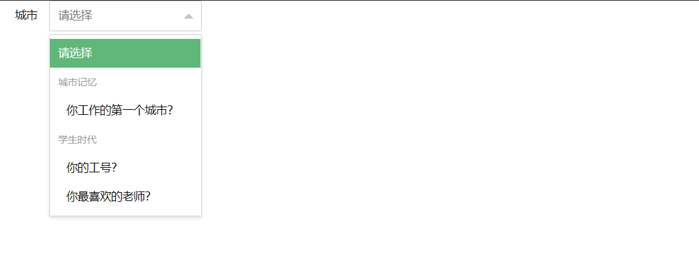


### 7.2.2、开启搜索匹配

- 通过设置 `lay-search` 属性开启搜索匹配功能

```html
<body>
    <div class="layui-container">
        <form action="" class="layui-form">
            <div class="layui-form-item">
                <label class="layui-form-label">城市</label>
                <div class="layui-input-inline">
                    <!-- 
                            下拉选择框
                                1. 通过selected属性设置默认选中项
                                2. 通过disabled属性开启禁用，可以设置select和option标签（禁用下拉框和禁用下拉选项）
                                3. 可以通过 optgroup 标签给select分组
                                4. 通过设置lay-search属性开启搜索匹配功能
                         -->
                    <!-- 开启搜索匹配 -->
                    <select name="city" lay-verify="" lay-search>
                        <option value ="">请选择</option>
                        <option value="010">layer</option>
                        <option value="021">form</option>
                        <option value="0571">layim</option>
                      </select>
                </div>
            </div>
        </form>
    </div>

    <script type="text/javascript">
        // 表单,依赖 form 模块
        layui.use('form', function() {
            var form = layui.form;
        })
    </script>
</body>
```

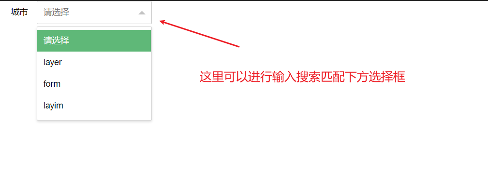


## 7.3、复选框

- 通过设置 `title` 属性设置自定义文本(如果不需要显示文本，则不设置 title 属性)
- 通过 `checked` 属性设置被选中的项
- 通过·`lay-skin` 属性设置复选框的样式效果(`lay-skin="primary"` 表示原始效果)
- 通过 `disabled` 属性禁用元素

```html
<form action="" class="layui-form">
    <div class="layui-form-item">
        <label class="layui-form-label">爱好</label>
        <div class="layui-input-block">
            <!--
                复选框 
                    1. 通过title属性设置自定义文本（如果不需要显示文本，则不设置title属性）
                    2. 通过checked属性设置被选中的项
                    3. 通过lay-skin属性设置复选框的样式效果（lay-skin="parmary"表示原始效果）
                    4. 通过disabled属性禁用元素
            -->
            <!-- 默认效果 -->
            <input type="checkbox" name="hobby" title="唱歌" checked value="sing" />
            <input type="checkbox" name="hobby" title="跳舞" value="dance" />
            <input type="checkbox" name="hobby" title="禁用" disabled />
            <br>
            <!-- 原始效果 -->
            <input type="checkbox" name="hobby" title="唱歌" lay-skin="primary" checked value="sing" />
            <input type="checkbox" name="hobby" title="跳舞" lay-skin="primary" value="dance" />
            <input type="checkbox" name="hobby" title="禁用" lay-skin="primary" disabled/>
        </div>
    </div>
</form>
```

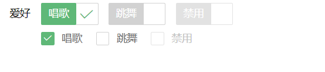


### 7.3.1、开关

- 将复选框，设置 `lay-skin="switch"` 形成开关风格
- 通过 `lay-text="打开的值|关闭的值"` 来设定开关的两种状态的文本，通过` | ` 分隔
- 通过 `checked` 属性设置默认打开状态
- 通过 `disabled` 属性禁用开关
- 通过 `value` 属性设置选中的值

```html
<form action="" class="layui-form">
    <div class="layui-form-item">
        <label class="layui-form-label">开关</label>
        <div class="layui-input-block">
            <!-- 	
                开关
                    将复选框，设置lay-skin="switch"形成开关风格
                    1. 通过lay-text="打开的值|关闭的值"来设定开关的两种状态的文本，通过"|"分隔
                    2. 通过checked设置默认打开状态
                    3. 通过disabled属性禁用开关
                    4. 通过value属性设置选中的值

             -->
            <input type="checkbox" name="aa" lay-skin="switch" />
            <input type="checkbox" name="bb" lay-skin="switch" checked />
            <input type="checkbox" name="cc" lay-skin="switch" checked lay-text="on|off" />
            <input type="checkbox" name="dd" lay-skin="switch" checked lay-text="打开|关闭" value="打开" />
            <input type="checkbox" name="ee" lay-skin="switch" lay-text="打开|关闭" disabled />
        </div>
    </div>
</form>
```


## 7.4、单选框

- 通过 `checked` 设置默认选中项
- 通过 `disabled` 属性禁用单选框
- 通过 `value` 属性设置选中的值

```html
<form action="" class="layui-form">
    <div class="layui-form-item">
        <label class="layui-form-label">性别</label>
        <div class="layui-input-block">
            <!-- 
                单选框
                    1. 通过checked设置默认选中项
                    2. 通过disabled属性禁用单选框
                    3. 通过value属性设置选中的值 
             -->
            <input type="radio" name="sex" value="nan" title="男">
            <input type="radio" name="sex" value="nv" title="女" checked>
            <input type="radio" name="sex" value="" title="中性" disabled>
        </div>
    </div>
</form>
```

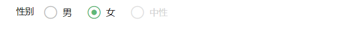

## 7.5、文本域

- 给 textarea 标签添加`class="layui-textarea"`

```html
<form action="" class="layui-form">
    <div class="layui-form-item">
        <label class="layui-form-label">简介</label>
        <div class="layui-input-inline">
            <!-- 
                文本域
                    class="layui-textarea"：layui.css提供的通用CSS类 
             -->
            <textarea name="" required lay-verify="required" placeholder="请输入" class="layui-textarea">

            </textarea>

        </div>
    </div>
</form>
```

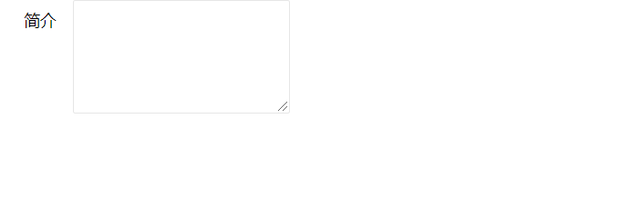


## 7.6、组装行内表单

行内表单：表单元素在一行显示（div 盒子也不会全部占完宽度）

- 给 div 设置 `class="layui-inline"` ： 定义外层行内
- 给 div 设置 `class="layui-input-inline"` ：定义内层行内

```html
<form action="" class="layui-form">
    <div class="layui-form-item">

        <!-- 定义外层行内 .layui-inline  -->
        <div class="layui-inline">
            <label class="layui-form-label">范围</label>
            <!-- 定义内层行内 .layui-input-inline -->
            <div class="layui-input-inline" style="width: 100px;">
                <input type="text" name="price_min" placeholder="￥" autocomplete="off" class="layui-input">
            </div>
            <div class="layui-form-mid">-</div>
            <div class="layui-input-inline" style="width: 100px;">
                <input type="text" name="price_max" placeholder="￥" autocomplete="off" class="layui-input">
            </div>
        </div>

        <!-- 定义外层行内 -->
        <div class="layui-inline">
            <label class="layui-form-label">密码</label>
            <!-- 定义内层行内 -->
            <div class="layui-input-inline" style="width: 100px;">
                <input type="password" name="" autocomplete="off" class="layui-input">
            </div>
        </div>

    </div>
</form>
```


## 7.7、表单方框风格

- 给 form 标签追加 `class="layui-form-pane "`，来设定表单的方框风格。
- 内部结构不变，值得注意的是：复选框/开关/单选框 这些组合在该风格下需要额外添加 `pane`属性

```html
<!-- 通过追加 layui-form-pane 的class，来设定表单的方框风格。 -->
<form class="layui-form  layui-form-pane" action="">
    <!-- 
      内部结构都一样，值得注意的是 复选框/开关/单选框 这些组合在该风格下需要额外添加 pane属性 
  	-->
    <div class="layui-form-item" pane>
        <label class="layui-form-label">单选框</label>
        <div class="layui-input-block">
            <input type="radio" name="sex" value="男" title="男">
            <input type="radio" name="sex" value="女" title="女" checked>
        </div>
    </div>
</form>
```


