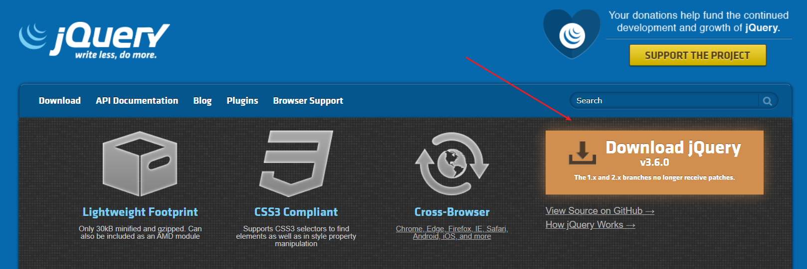
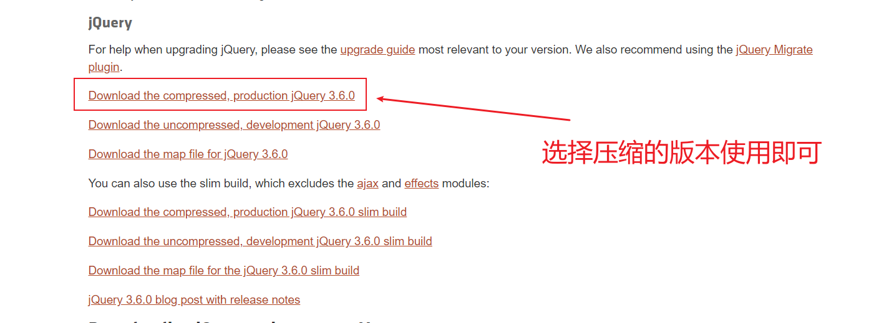
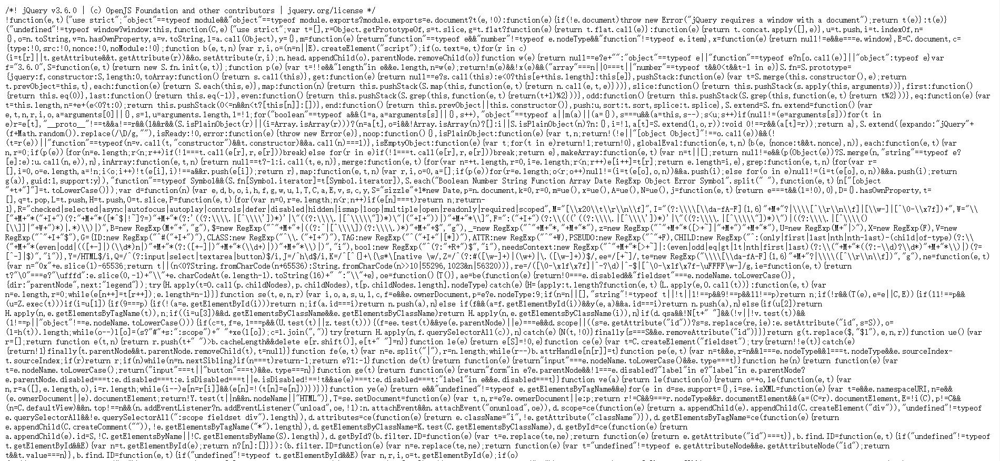
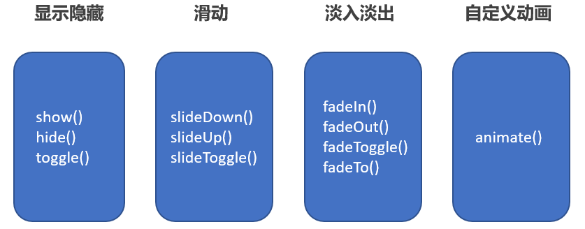

# 1、jQuery🔥

## 1.0、JavaScript库

- JavaScript 库：即 library，是一个==封装好==的特定的==集合==（方法和函数）。从封装一大堆函数的角度理解库，就是在这个库中，封装了很多预先定义好的函数在里面，比如动画animate、hide、show，比如获取元素等。

- 简单理解： 就是一个JS 文件，里面对我们原生js代码进行了封装，存放到里面。这样我们可以快速高效的使用这些封装好的功能了。

- 比如 jQuery，就是为了快速方便的操作DOM，里面基本都是函数（方法）。

- jQuery 是一个快速、简洁的 JavaScript 库，其设计的宗旨是“write Less，Do More”，即倡导写更少的代码，做更多的事情。
- j 就是 JavaScript；  Query 查询； 意思就是查询js，把js中的DOM操作做了封装，我们可以快速的查询使用里面的功能。
- jQuery 封装了 JavaScript 常用的功能代码，优化了 DOM 操作、事件处理、动画设计和 Ajax 交互。
- 学习jQuery本质： 就是学习调用这些函数（方法）。
- jQuery 出现的目的是加快前端人员的开发速度，我们可以非常方便的调用和使用它，从而提高开发效率。

## 1.1、jQuery下载🔥

- 官网:   https://jquery.com/
- 其余版本的下载：https://code.jquery.com/

  - 1x ：兼容 IE 678 等低版本浏览器， 官网不再更新
  - 2x ：不兼容 IE 678 等低版本浏览器， 官网不再更新
  - 3x ：不兼容 IE 678 等低版本浏览器， 是官方主要更新维护的版本

1. 我们在使用之前要先下载 ，步骤如下，首先打开官网



2. 打开官网，选择压缩的版本使用即可



3. 点击压缩版本进入：`ctrl+A` 全选， `ctrl+c` 复制



4. 在vs中新建`jquery.min.js` 文件（此处任何名称均可，只要是js文件即可）

5. 在html 文件进行引入即可

```html
<script src = "jquery.min.js"></script>
```

## 1.2、jQuery的入口函数🔥

```js
// 第一种方法 推荐

$(function(){
    ...   // 此处是页面DOM加载完成的入口 
})

// 第二种方法
$(document).ready(function(){
    ... //此处是页面DOM加载完成的入口
})
```

- ==等着 DOM 结构渲染完毕即可执行内部代码==，不必等到所有外部资源加载完毕，jQuery 帮我们完成了封装
- 相当于原生 js 中的 DOMContentLoaded
- 不同于原生 js 中的 load 事件是等页面文档、外部的 js 文件、css 文件、图片加载完毕才执行内部代码
- 更推荐使用第一种方式

## 1.3、jQuery的顶级对象$🔥

1. $ 是 jQuery 的别称，在代码中可以使用 jQuery 代替$
2. $ 是 jQuery 的顶级对象，相当于原生 JavaScript 中的 window。
3. **把元素利用$包装成jQuery对象**，就可以调用jQuery的方法。

```js
<body>
    <div></div>
    <script>
        // 1. $ 是jQuery的别称（另外的名字）
        // $(function() {
        //     alert(11)
        // });
        jQuery(function() {
            // alert(11)
            // $('div').hide();
            jQuery('div').hide();
        });
        // 2. $同时也是jQuery的 顶级对象
    </script>
</body>
```


## 1.4、jQuery对象和DOM对象🔥

1. **DOM对象**：用原生js获取过来的对象

2. **jQuery对象**: 用jQuery方式获取过来的对象是jQuery对象。

   ​						==本质：通过$把DOM元素进行了包装(伪数组形式存储)==

3. ==jQuery对象只能使用jQuery方法，DOM对象则使用原生的JavaScript的属性和方法==

```js
<body>
    <div></div>
    <span></span>
    <script>
        // 1. DOM 对象:  用原生js获取过来的对象就是DOM对象
        var myDiv = document.querySelector('div');   // myDiv 是DOM对象
        var mySpan = document.querySelector('span'); // mySpan 是DOM对象
        console.dir(myDiv);
        // 2. jQuery对象:用jquery方式获取过来的对象是jQuery对象。 
		//    本质:通过$把DOM元素进行了包装
        $('div'); 		// $('div')是一个jQuery 对象
        $('span'); 		// $('span')是一个jQuery 对象
        console.dir($('div'));
        // 3. jQuery 对象只能使用 jQuery 方法，DOM 对象则使用原生的 JavaScirpt 属性和方法
        // myDiv.style.display = 'none';
        // myDiv.hide(); myDiv是一个dom对象不能使用 jquery里面的hide方法
        // $('div').style.display = 'none'; 这个$('div')是一个jQuery对象不能使用原生js 的属性和方法
    </script>
</body>
```


## 1.5、jQuery对象和DOM对象转化🔥

- DOM 对象与 jQuery 对象之间是可以相互转换的。
- 因为原生js 比 jQuery 更大，原生的一些属性和方法 jQuery没有给我们封装. 要想使用这些属性和方法需要把jQuery对象转换为DOM对象才能使用。

### 1.5.1、DOM 对象转换为 jQuery 对象🔥

- 语法：`$(DOM对象)`

```js
$('div')
```

​	

### 1.5.2、jQuery 对象转换为 DOM 对象🔥

- 语法：

```js
// 第一种方法
$('div')[index]   index是索引号


// 第二种方法
$('div').get(index) index是索引号
```

```js
<body>
    <video src="mov.mp4" muted></video>
    <script>
        // 1. DOM对象转换为 jQuery对象
        // (1) 我们直接获取视频，得到就是jQuery对象
        // $('video');
        // (2) 我们已经使用原生js 获取过来就是DOM对象
        var myvideo = document.querySelector('video');
        // $(myvideo).play();  jquery里面没有play 这个方法


        // 2.  jQuery对象转换为DOM对象
        // myvideo.play();
        $('video')[0].play()
        $('video').get(0).play()
    </script>
</body>
```


# 2、jQuery常用API🔥

## 2.1、jQuery选择器🔥

### 2.1.0、jQuery基础选择器🔥

原生 JS 获取元素方式很多，很杂，而且兼容性情况不一致，因此 jQuery 给我们做了封装，使获取元素统一标准。

语法：`$("选择器")`  里面选择器直接写CSS选择器即可，但是要加引号

```js
$(".nav");
```

| 名称       | 用法              | 描述                     |
| ---------- | ----------------- | ------------------------ |
| ID选择器   | `$("#id")`        | 获取指定ID的元素         |
| 全选选择器 | `$('*')`          | 匹配所有元素             |
| 类选择器   | `$(".class")`     | 获取同一类class的元素    |
| 标签选择器 | `$(".div")`       | 获取同一类标签的所有元素 |
| 并集选择器 | `$("div,p,li")`   | 选取多个元素             |
| 交集选择器 | `$("li.current")` | 交集元素                 |

### 2.1.1、jQuery层级选择器🔥

| 名称       | 用法         | 描述                                                         |
| ---------- | ------------ | ------------------------------------------------------------ |
| 子代选择器 | `$("ul>li")` | 使用>号，获取亲儿子层级的选择器；注意，并不会获取孙子层级的元素 |
| 后代选择器 | `$("ul li")` | 使用空格，代表后代选择器，获取 ul 下的所有 li 元素，包括孙子等 |

```js
$("ul li");
```

```html
<body>
    <div>我是div</div>
    <div class="nav">我是nav div</div>
    <p>我是p</p>
    <ol>
        <li>我是ol 的</li>
        <li>我是ol 的</li>
        <li>我是ol 的</li>
        <li>我是ol 的</li>
    </ol>
    <ul>
        <li>我是ul 的</li>
        <li>我是ul 的</li>
        <li>我是ul 的</li>
        <li>我是ul 的</li>
    </ul>
    <script>
        $(function() {
            console.log($(".nav"));
            console.log($("ul li"));

        })
    </script>
</body>
```

### 2.1.2、知识铺垫

jQuery 设置样式

```js
$('div').css('属性','值')
```


### 2.1.3、jQuery隐式迭代🔥

- 遍历内部DOM元素(伪数组形式存储)的过程就叫做 **隐式迭代**

- 简单理解: 给匹配到的所有元素进行循环遍历，执行相应的方法，而不用我们再进行循环，简化我们的操作，方便我们调用

```html
<body>
    <div>惊喜不，意外不</div>
    <div>惊喜不，意外不</div>
    <div>惊喜不，意外不</div>
    <div>惊喜不，意外不</div>
    <ul>
        <li>相同的操作</li>
        <li>相同的操作</li>
        <li>相同的操作</li>
    </ul>
    <script>
        // 1. 获取四个div元素 
        console.log($("div"));

        // 2. 给四个div设置背景颜色为粉色 jquery对象不能使用style
        $("div").css("background", "pink");
        // 3. 隐式迭代就是把匹配的所有元素内部进行遍历循环，给每一个元素添加css这个方法
        $("ul li").css("color", "red");
    </script>
</body>
```


### 2.1.3、jQuery筛选选择器🔥

```js
// 选取 ul 里面的 第一个 li
$("ul li:first").css("color","red");
```

| 语法        | 用法            | 描述                                                      |
| ----------- | --------------- | --------------------------------------------------------- |
| : first     | `$('li:first')` | 获取第一个li元素                                          |
| : last      | `$('li:last')`  | 获取最后一个li元素                                        |
| : eq(index) | `$("li:eq(2)")` | 获取到的li元素中，选择索引号为2的元素，索引号index从0开始 |
| : odd       | `$("li:odd")`   | 获取到的li元素中，选择索引号为奇数的元素                  |
| : even      | `$("li:even")`  | 获取到的li元素中，选择索引号为偶数的元素                  |

```html
<body>
    <ul>
        <li>多个里面筛选几个</li>
        <li>多个里面筛选几个</li>
        <li>多个里面筛选几个</li>
        <li>多个里面筛选几个</li>
        <li>多个里面筛选几个</li>
        <li>多个里面筛选几个</li>
    </ul>
	<!-- 有序列表 -->
    <ol>
        <li>多个里面筛选几个</li>
        <li>多个里面筛选几个</li>
        <li>多个里面筛选几个</li>
        <li>多个里面筛选几个</li>
        <li>多个里面筛选几个</li>
        <li>多个里面筛选几个</li>
    </ol>
    <script>
        $(function() {
    		// 获取第一个li元素
            $("ul li:first").css("color", "red");
    		// 获取索引号为2的li
            $("ul li:eq(2)").css("color", "blue");
    		// 获取索引号为奇数的li
            $("ol li:odd").css("color", "skyblue");
    		// 获取索引号为偶数的li
            $("ol li:even").css("color", "pink");
        })
    </script>
</body>
```

### 2.1.4 jQuery筛选方法🔥

| 语法                | 用法                             | 说明                                                   |
| ------------------- | -------------------------------- | ------------------------------------------------------ |
| 🔥parent()           | `$("li").parent();`              | 查找父级，最近一级的父元素                             |
| 🔥children(selector) | `$("ul").children("li")`         | 相当于`$("ul>li")`,最近一级(亲儿子)                    |
| 🔥find(selector)     | `$("ul").find("li")`             | 相当于`$("ul li")` 后代选择器                          |
| 🔥siblings(selector) | `$(".first").siblings("li")`     | 查找兄弟节点，**不包括自己本身**                       |
| nextAll([expr])     | `$(".first").nextAll()`          | 查找当前元素**之后**所有的同辈元素                     |
| prevtAll([expr])    | `$(".last").prevAll()`           | 查找当前元素**之前**所有的同辈元素                     |
| hasClass(class)     | `$('div').hasClass("protected")` | 检查当前的元素是否含有某个特定的类，如果有，则返回true |
| 🔥eq(index)          | `$("li").eq(2);`                 | 相当于`$("li:eq(2),index")`index从0开始                |


```html
<body>
    <div class="yeye">
        <div class="father">
            <div class="son">儿子</div>
        </div>
    </div>

    <div class="nav">
        <p>我是屁</p>
        <div>
            <p>我是p</p>
        </div>
    </div>
    <script>
        // 注意一下都是方法 带括号
        $(function() {
            // 1. 父  parent()  返回的是 最近一级的父级元素 亲爸爸
            console.log($(".son").parent());
            // 2. 子
            // (1) 亲儿子 children()  类似子代选择器  ul>li
            // $(".nav").children("p").css("color", "red");
            // (2) 可以选里面所有的孩子 包括儿子和孙子  find() 类似于后代选择器
            $(".nav").find("p").css("color", "red");
            
        });
    </script>
</body>
```


### 2.1.5 jQuery排他思想🔥

- 想要多选一的效果，排他思想：==当前元素设置样式，其余的兄弟元素清除样式==。

```html
<body>
    <button>快速</button>
    <button>快速</button>
    <button>快速</button>
    <button>快速</button>
    <button>快速</button>
    <button>快速</button>
    <button>快速</button>
    <script>
        $(function() {
            // 1. 隐式迭代 给所有的按钮都绑定了点击事件
            $("button").click(function() {
                // 2. 当前的元素变化背景颜色
                $(this).css("background", "pink");
                // 3. 其余的兄弟去掉背景颜色 隐式迭代
                $(this).siblings("button").css("background", "");
            });
        })
    </script>
</body>
```


### 2.1.6 jQuerty链式编程🔥

链式编程是为了节省代码量，看起来更优雅。使用链式编程一定注意是哪个对象执行样式.

```js
$(this).css("color","red").siblings().css("color","");
```

```html
<body>
    <button>快速</button>
    <button>快速</button>
    <button>快速</button>
    <button>快速</button>
    <button>快速</button>
    <button>快速</button>
    <button>快速</button>
    <script>
        $(function() {
            // 1. 隐式迭代 给所有的按钮都绑定了点击事件
            $("button").click(function() {
                // 2. 让当前元素颜色变为红色(点击哪个哪个就变为红色)
                // $(this).css("color", "red");
                // 3. 让其余的兄弟元素不变色 
                // $(this).siblings().css("color", "");
                
                
                // 链式编程完成上述功能
                $(this).css("color", "red").siblings().css("color", "");


            });
        })
    </script>
</body>
```


## 2.2、jQuery样式操作🔥

### 2.2.1、jQuery修改样式css方法

jQuery 可以使用 css 方法来修改简单元素样式； 也可以操作类，修改多个样式

1. 参数只写属性名,则返回属性值

```js
$(this).css("color");
```

2. 参数是属性名,属性值,逗号分隔,是设定一组样式。==属性需要加引号,值是数字可不加单位和引号==

```js
$(this).css("color",300);
```

3. 参数可以是对象形式,方便设置多组样式。==属性名和属性值用冒号隔开,属性可以不用加引号==

```js
$(this).css({
    "color":"red",
    "width": 400,
    "height": 400,
    // 如果是复合属性则必须采取驼峰命名法，如果值不是数字，则需要加引号
    backgroundColor: "red"
    
})
```


### 2.2.2、jQuery设置类样式方法

作用等同于以前的 classList，可以操作类样式， ==注意操作类里面的参数不要加点==。

```js
// 1.添加类
$("div").addClass("current");

// 2.移除类
$("div").removeClass("current");

// 3.切换类
$("div").toggleClass("current");
```


```html
<head>
    <meta charset="UTF-8">
    <meta name="viewport" content="width=device-width, initial-scale=1.0">
    <meta http-equiv="X-UA-Compatible" content="ie=edge">
    <title>Document</title>
    <style>
        div {
            width: 150px;
            height: 150px;
            background-color: pink;
            margin: 100px auto;
            transition: all 0.5s;
        }
        
        .current {
            background-color: red;
            transform: rotate(360deg);
        }
    </style>
    <script src="jquery.min.js"></script>
</head>

<body>
    <div class="current"></div>
    <script>
        $(function() {
            // 1. 添加类 addClass()
            // $("div").click(function() {
            //     // $(this).addClass("current");
            // });
            // 2. 删除类 removeClass()
            // $("div").click(function() {
            //     $(this).removeClass("current");
            // });
            // 3. 切换类 toggleClass()
            $("div").click(function() {
                $(this).toggleClass("current");
            });
        })
    </script>
</body>
```


### 2.2.3、jQuery类操作和className区别

- 原生 JS 中的 className 会覆盖元素原先里面的类名
- jQuery里面类操作只是对指定类进行操作，不影响原先的类名

```html
<body>
    <div class="one two"></div>
    <script>
        // var one = document.querySelector(".one");
        // one.className = "two";
        // $(".one").addClass("two");  这个addClass相当于追加类名 不影响以前的类名
        $(".one").removeClass("two");
    </script>
</body>
```


## 2.3、jQuery效果🔥

### 2.3.1、jQuery显示与隐藏效果

jQuery 给我们封装了很多动画效果，最为常见的如下：



#### ①显示效果

语法：

```js
// 显示语法规范
show([speed,[easing],[fn]])       //中括号表示参数都可以省略
$("div").show();
```

参数：

- 参数都可以省略， 无动画直接显示。
- speed：三种预定速度之一的字符串(“slow”,“normal”, or “fast”)或表示动画时长的毫秒数值(如：1000)。
- easing：(Optional) 用来指定切换效果，默认是“swing”，可用参数“linear”。
- fn: 回调函数，在动画完成时执行的函数，每个元素执行一次。

#### ②隐藏效果

语法：

```js
// 隐藏语法规范
hide([speed,[easing],[fn]])
$("div").hide();
```

参数：

- 参数都可以省略， 无动画直接显示。
- speed：三种预定速度之一的字符串(“slow”,“normal”, or “fast”)或表示动画时长的毫秒数值(如：1000)。
- easing：(Optional) 用来指定切换效果，默认是“swing”，可用参数“linear”。
- fn: 回调函数，在动画完成时执行的函数，每个元素执行一次。

#### ③切换效果

语法：

```js
// 切换语法规范
toggle([speed,[easing],[fn]])
$("div").toggle();
```

参数：

- 参数都可以省略， 无动画直接显示。
- speed：三种预定速度之一的字符串(“slow”,“normal”, or “fast”)或表示动画时长的毫秒数值(如：1000)。
- easing：(Optional) 用来指定切换效果，默认是“swing”，可用参数“linear”。
- fn: 回调函数，在动画完成时执行的函数，每个元素执行一次。

 建议：==平时一般不带参数，直接显示隐藏即可==

```js
<body>
    <button>显示</button>
    <button>隐藏</button>
    <button>切换</button>
    <div></div>
    <script>
        $(function() {
            $("button").eq(0).click(function() {
                $("div").show(1000, function() {
                    alert(1);
                });
            })
            $("button").eq(1).click(function() {
                $("div").hide(1000, function() {
                    alert(1);
                });
            })
            $("button").eq(2).click(function() {
                    $("div").toggle(1000);
                })
                // 一般情况下，我们都不加参数直接显示隐藏就可以了
        });
    </script>
</body>
```

### 2.3.2、jQuery滑动效果与事件切换

#### ①下滑动

语法：

```js
// 下滑动
slideDown([speed,[easing],[fn]]) 
$("div").slideDown();
```

#### ②上滑动

语法：

```js
// 上滑动
slideUp([speed,[easing],[fn]]) 
$("div").slideUp();
```

#### ③滑动切换

语法：

```js
// 滑动切换效果
slideToggle([speed,[easing],[fn]]) 
$("div").slideToggle();
```


```html
<body>
    <button>下拉滑动</button>
    <button>上拉滑动</button>
    <button>切换滑动</button>
    <div></div>
    <script>
        $(function() {
            $("button").eq(0).click(function() {
                // 下滑动 slideDown()
                $("div").slideDown();
            })
            $("button").eq(1).click(function() {
                // 上滑动 slideUp()
                $("div").slideUp(500);


            })
            $("button").eq(2).click(function() {
                // 滑动切换 slideToggle()

                $("div").slideToggle(500);

            });

        });
    </script>
</body>
```


#### ④事件切换

语法：

```js
hover([over,]out)
```

- over: 鼠标移到元素上要触发的函数(相当于mouseenter)
- out:  鼠标移出元素要触发的函数(相当于mouseleave)
- 如果只写一个函数，则鼠标经过和离开都会触发它

```js
$("div").hover(function(){},function(){});
// 第一个function是鼠标经过的函数
// 第二个function是鼠标离开的函数
// 如果hover只写一个函数,那么鼠标经过和鼠标离开都会触发这个函数
$("div").hover(function(){
    $(this).slideToggle();
})
```


### 2.3.3、jQuery动画队列及其停止排队方法

动画或者效果一旦触发就会执行，如果多次触发，就造成多个动画或者效果排队执行

#### ①停止排队

语法：

```js
stop()
```

- stop()方法用于停止动画或者效果
- 注意: stop() 写到动画或者效果的前面，相当于停止结束上一次的动画

```js
$(".nav>li").hover(function(){
    // stop 方法必须写到动画的前面
    $(this).children("ul").stop().slideToggle();
})
```


### 2.3.4、jQuery淡入淡出以及突出效果

#### ①淡入淡出切换

语法：

```js
// 淡入
fadeIn([speed,[easing],[fn]])
$("div").fadeIn();

// 淡出
fadeOut([speed,[easing],[fn]])
$("div").fadeOut;

// 淡入淡出切换
fadeToggle([speed,[easing],[fn]])
```

#### ②渐进方式调整到指定的不透明度

语法：

```js
// 修改透明度   这个速度和透明度必须写
fadeTo(speed,opacity,[easing],[fn])
```

参数：

- opacity ：==透明度必须写，取值 0~1 之间==
- speed：三种预定速度之一的字符串(“slow”,“normal”, or “fast”)或表示动画时长的毫秒数值(如：1000)。==必须写==

```js
$("div").fadeTo(1000,0.5)
```


```html
<body>
    <button>淡入效果</button>
    <button>淡出效果</button>
    <button>淡入淡出切换</button>
    <button>修改透明度</button>
    <div></div>
    <script>
        $(function() {
            $("button").eq(0).click(function() {
                // 淡入 fadeIn()
                $("div").fadeIn(1000);
            })
            $("button").eq(1).click(function() {
                // 淡出 fadeOut()
                $("div").fadeOut(1000);

            })
            $("button").eq(2).click(function() {
                // 淡入淡出切换 fadeToggle()
                $("div").fadeToggle(1000);

            });
            $("button").eq(3).click(function() {
                //  修改透明度 fadeTo() 这个速度和透明度要必须写
                $("div").fadeTo(1000, 0.5);

            });
        });
    </script>
</body>
```


### 2.3.5、jQuery自定义动画animate方法

语法：

```js
animate(params,[speed],[easing],[fn])
```

参数：

- params: ==想要更改的样式属性，以对象形式传递，必须写。 属性名可以不用带引号， 如果是复合属性则需要采取驼峰命名法 borderLeft==。其余参数都可以省略。

```html
<head>
    <meta charset="UTF-8">
    <meta name="viewport" content="width=device-width, initial-scale=1.0">
    <meta http-equiv="X-UA-Compatible" content="ie=edge">
    <title>Document</title>
    <script src="jquery.min.js"></script>
    <style>
        div {
            position: absolute;
            width: 200px;
            height: 200px;
            background-color: pink;
        }
    </style>
</head>
<body>
    <button>动起来</button>
    <div></div>
    <script>
        $(function() {
            $("button").click(function() {
                $("div").animate({
                    left: 500,
                    top: 300,
                    opacity: .4,
                    width: 500
                }, 500);
            })
        })
    </script>
</body>
```

## 2.4、jQuery属性操作🔥

### 2.4.1、获取元素固有属性值prop()

所谓元素固有属性就是元素本身自带的属性，比如 `<a>` 元素里面的 href ，比如 `<input>` 元素里面的 type。 

语法：`prop("属性")`

```js
prop("属性")

$("a").prop("href");
```

### 2.4.2、设置元素固有属性值

语法：`prop("属性","属性值")`

```js
prop("属性","属性值")

$("a").prop("title","我们都挺好~");
```


### 2.4.3、获取元素自定义属性值

用户自己给元素添加的属性，我们称为自定义属性。 比如给 div 添加 index =“1”。 

语法：`attr("属性")  `

```js
attr("属性")   // 类似原生getAttribute()

$("div").attr("index");
```


### 2.4.4、设置元素自定义属性值

语法：`attr("属性","属性值") `

```js
attr("属性","属性值")  //类似原生setAttribute()

$("div").attr("index",4);
```


```js
<body>
    <a href="http://www.itcast.cn" title="都挺好">都挺好</a>
    <input type="checkbox" name="" id="" checked>
    <div index="1" data-index="2">我是div</div>
    <span>123</span>
    <script>
        $(function() {
            //1. element.prop("属性名") 获取元素固有的属性值
            console.log($("a").prop("href"));
            $("a").prop("title", "我们都挺好");
            $("input").change(function() {
                console.log($(this).prop("checked"));

            });
            // console.log($("div").prop("index"));
            // 2. 元素的自定义属性 我们通过 attr()
            console.log($("div").attr("index"));
            $("div").attr("index", 4);
            console.log($("div").attr("data-index"));
            // 3. 数据缓存 data() 这个里面的数据是存放在元素的内存里面
            $("span").data("uname", "andy");
            console.log($("span").data("uname"));
            // 这个方法获取data-index h5自定义属性 第一个 不用写data-  而且返回的是数字型
            console.log($("div").data("index"));

        })
    </script>
</body>
```


### 2.4.5、数据缓存data()

data() 方法可以在指定的元素上存取数据,并不会修改DOM元素结构，一旦页面刷新，之前存放的数据都将被移除。

#### ①附加数据语法

- 语法：`data("name","value")  `   向被选元素附加数据

```js
$("span").data("uname","andy");
```

#### ②获取数据语法

- 语法：`date("name")   `   向被选元素获取数据

```js
$("span").data("uname");
// 这个方法获取data-index h5自定义属性，不用写 data- 返回的是数字型(2)
$("div").data("index");
```

同时，还可以读取H5自定义属性 data-index,得到的是数字型

```html
<body>
    <span>123</span>
    <script>
        $(function() {
			// 3. 数据缓存 data() 这个里面的数据是存放在元素的内存里面
            $("span").data("uname", "andy");
            console.log($("span").data("uname"));
            // 这个方法获取data-index h5自定义属性 第一个 不用写data-  而且返回的是数字型
            console.log($("div").data("index"));
        })
    </script>
</body>
```

## 2.5、jQuery内容文本值🔥

主要针对元素的**内容**还有**表单的值**操作

### 2.5.1 普通元素内容html()

相当于原生**innerHTML**

语法：

- 获取元素的内容：`html()`
- 设置元素的内容：`html("内容")`

```js
$("div").html();

$("div").html("123");

// 获取过来的带的标签 <span>123</span>
```

### 2.5.2、普通元素文本内容text()

相当于原生**innerText**

语法：

- 获取元素的文本内容：`text()`
- 设置元素的文本内容：`text("文本内容")`

```js
$("div").text();

$("div").text("123");
// 123  
// 获取过来的不带标签 123
```

### 2.5.3、获取设置表单值 val()

语法：

- 获取表单的的值：`val()`
- 设置表单的值：`val("内容")`

```js
$("input").val();

$("input").val("请输入内容~~~");
```


```html
<body>
    <div>
        <span>我是内容</span>
    </div>
    <input type="text" value="请输入内容">
    <script>
        // 1. 获取设置元素内容 html()
        console.log($("div").html());
        // $("div").html("123");
        // 2. 获取设置元素文本内容 text()
        console.log($("div").text());
        $("div").text("123");

        // 3. 获取设置表单值 val()
        console.log($("input").val());
        $("input").val("123");
    </script>
</body>
```


## 2.6、jQuery元素操作🔥

主要是**遍历，创建，添加，删除元素**操作

### 2.6.1、遍历元素

jQuery隐式迭代是对同一类元素做了同样的操作，如果想要给同一类元素做不同操作，就需要用到遍历

#### ①语法一

- 语法一：

```JS
// 语法一
$("div").each(function(index,domEle){xxx;})
```

- each()方法遍历匹配的每一个元素。主要用DOM处理。each每一个
- 里面的回调函数有2个参数: index是每个元素的索引号,==demEle是每个DOM元素==，不是jQuery对象
- 所以想要使用jQuery方法，==需要给这个dom元素转换为jquery对象 $(domEle)==

#### ②语法二

- 语法二：

```js
// 语法二
$.each(Object,function(index,element){xxx;})
```

- $.each() 方法可用于遍历任何对象，主要用于数据处理,比如数组,对象
- 里面的函数有2个参数: index 是每个元素的索引号,element遍历内容

```js
<body>
    <div>1</div>
    <div>2</div>
    <div>3</div>
    <script>
        $(function() {
            // $("div").css("color", "red");
            // 如果针对于同一类元素做不同操作，需要用到遍历元素（类似for，但是比for强大）
            var sum = 0;
            // 1. each() 方法遍历元素 
            var arr = ["red", "green", "blue"];
            $("div").each(function(i, domEle) {
                // 回调函数第一个参数一定是索引号  可以自己指定索引号号名称
                // console.log(index);
                // console.log(i);
                // 回调函数第二个参数一定是 dom元素对象 也是自己命名
                // console.log(domEle);
                // domEle.css("color"); dom对象没有css方法
                $(domEle).css("color", arr[i]);
                sum += parseInt($(domEle).text());
            })
            console.log(sum);
            // 2. $.each() 方法遍历元素 主要用于遍历数据，处理数据
            // $.each($("div"), function(i, ele) {
            //     console.log(i);
            //     console.log(ele);

            // });
            // $.each(arr, function(i, ele) {
            //     console.log(i);
            //     console.log(ele);


            // })
            $.each({
                name: "andy",
                age: 18
            }, function(i, ele) {
                console.log(i); // 输出的是 name age 属性名
                console.log(ele); // 输出的是 andy  18 属性值


            })
        })
    </script>
</body>
```

### 2.6.2、创建元素

语法：

```js
$("<li></li>");
// 动态创建一个li标签
```

```js
var li = $("<li>我是后来创建的li</li>");
var div =$("<div>我是后来的div</div>")
```

### 2.6.3、添加元素

#### ①内部添加

语法：

- 把内容放入匹配元素内部最后面：`element.append("内容")`
- 把内容放入匹配元素内部最前面：`element.prepend("内容")`

```js
// 1.内部添加
element.append("内容")
$("ul").append(li);
// 把内容放入匹配元素内部最后面，类似原生appendChild

element.prepend("内容")
$("ul").prepend(li);
// 把内容放入匹配元素内部最前面
```

#### ②外部添加

语法：

- 外部添加把内容放到目标元素后面：`element.after("内容")`
- 外部添加把内容放到目标元素前面：`element.before("内容")`

```js
// 2.外部添加
element.after("内容");
$(".test").after(div);
// 把内容放入目标元素后面

element.before("内容");
// 把内容放入目标元素前面

```

- ==内部添加元素，生成之后，它们是父子关系==

- ==外部添加元素，生成之后，它们是兄弟关系==

### 2.6.4、删除元素

语法：

- 删除匹配的元素(本身)：`element.remove()`
- 删除匹配的元素集合中所有的子节点：`element.empty()`
- 清空匹配的元素内容：`element.html("")`

```js
1.element.remove()      //删除匹配的元素(本身)
$("ul").remove();

2.element.empty()       //删除匹配元素里面的子结点(孩子)
$("ul").empty();

3.element.html("")      //删除匹配元素里面的子结点(孩子)
```

- ==remove 删除元素本身==
- ==empt() 和 html("") 作用等价，都可以删除元素黎曼的内容，只不过 html 还可以设置内容。==


```html
<body>
    <ul>
        <li>原先的li</li>
    </ul>
    <div class="test">我是原先的div</div>
    <script>
        $(function() {
            // 1. 创建元素
            var li = $("<li>我是后来创建的li</li>");
            // 2. 添加元素

            // (1) 内部添加
            // $("ul").append(li);  内部添加并且放到内容的最后面 
            $("ul").prepend(li); // 内部添加并且放到内容的最前面

            // (2) 外部添加
            var div = $("<div>我是后妈生的</div>");
            // $(".test").after(div);
            $(".test").before(div);
            // 3. 删除元素
            // $("ul").remove(); 可以删除匹配的元素 自杀
            // $("ul").empty(); // 可以删除匹配的元素里面的子节点 孩子
            $("ul").html(""); // 可以删除匹配的元素里面的子节点 孩子

        })
    </script>
</body>
```


## 2.7 jQuery 尺寸🔥

| 语法                                 | 用法                                                  |
| ------------------------------------ | ----------------------------------------------------- |
| width() / height()                   | 取得匹配元素宽度和高度值，只算 width / height         |
| innerWidth() / innerHeight()         | 取得匹配元素宽度和高度值，包含padding                 |
| outerWidth() / outerHeight()         | 取得匹配元素宽度和高度值，包含padding、border         |
| outerWidth(true) / outerHeight(true) | 取得匹配元素宽度和高度值，包含padding、border、margin |

- 以上参数为空，则是获取相应值，返回的是数字型

- 如果参数为数字，则是修改相应值

- 参数可以不必写单位

```js
<body>
    <div></div>
    <script>
        $(function() {
            // 1. width() / height() 获取设置元素 width和height大小 
            console.log($("div").width());
            // $("div").width(300);

            // 2. innerWidth() / innerHeight()  获取设置元素 width和height + padding 大小 
            console.log($("div").innerWidth());

            // 3. outerWidth()  / outerHeight()  获取设置元素 width和height + padding + border 大小 
            console.log($("div").outerWidth());

            // 4. outerWidth(true) / outerHeight(true) 获取设置 width和height + padding + border + margin
            console.log($("div").outerWidth(true));


        })
    </script>
</body>
```


## 2.8、jQuery位置🔥

位置主要有三个： offset()、position()、scrollTop()/scrollLeft()

### 2.8.1、offset() 设置或获取元素偏移

1- offset() 方法设置或返回被选元素相对于**文档**的偏移坐标，**跟父级没有关系**

```js
$(".son").offset();
$(".son").offset().top;

$(".son").offset({
    top: 200,
    left: 200
});
```

- 该方法有两个属性 left、top. 
  - `offset().top `用于获取距离文档顶部的距离，
  - `offset().left`  用于获取距离文档左侧的距离
- ①可以设置元素的偏移：offset({ top: 10, left: 30 });

### 2.8.2、position()获取元素偏移

- position() 方法用于返回被选元素相对于**带有定位的父级**偏移坐标，如果父级都没有定位，则以文档为准
- 该方法有2个属性 left、top。
  - `position().top` 用于获取距离定位父级顶部的距离，
  - `position().left` 用于获取距离定位父级左侧的距离。
- 这个方法只能获取偏移，不能设置偏移

```js
$(".son").position();
// 这个方法只能获取偏移，不能设置偏移
```


```html
<body>
    <div class="father">
        <div class="son"></div>
    </div>
    <script>
        $(function() {
            // 1. 获取设置距离文档的位置（偏移） offset
            console.log($(".son").offset());
            console.log($(".son").offset().top);
            // $(".son").offset({
            //     top: 200,
            //     left: 200
            // });
            // 2. 获取距离带有定位父级位置（偏移） position   如果没有带有定位的父级，则以文档为准
            // 这个方法只能获取不能设置偏移
            console.log($(".son").position());
            // $(".son").position({
            //     top: 200,
            //     left: 200
            // });
        })
    </script>
</body>
```


### 2.8.3 scrollTop() / scrollLeft() 设置或获取元素被卷去的头部和左侧

- `scrollTop() `方法设置或返回被选元素被卷去的头部。
- 不跟参数是获取，参数为不带单位的数字则是设置被卷去的头部。

```js
// 页面滚动事件
$(window).scroll(function(){
    $(document).scrollTop();
})
```


```html
<head>
    <meta charset="UTF-8">
    <meta name="viewport" content="width=device-width, initial-scale=1.0">
    <meta http-equiv="X-UA-Compatible" content="ie=edge">
    <title>Document</title>
    <style>
        body {
            height: 2000px;
        }
        
        .back {
            position: fixed;
            width: 50px;
            height: 50px;
            background-color: pink;
            right: 30px;
            bottom: 100px;
            display: none;
        }
        
        .container {
            width: 900px;
            height: 500px;
            background-color: skyblue;
            margin: 400px auto;
        }
    </style>
    <script src="jquery.min.js"></script>
</head>

<body>
    <div class="back">返回顶部</div>
    <div class="container">
    </div>
    <script>
        $(function() {
            $(document).scrollTop(100);
            // 被卷去的头部 scrollTop()  / 被卷去的左侧 scrollLeft()
            // 页面滚动事件
            var boxTop = $(".container").offset().top;
            $(window).scroll(function() {
                // console.log(11);
                console.log($(document).scrollTop());
                if ($(document).scrollTop() >= boxTop) {
                    $(".back").fadeIn();
                } else {
                    $(".back").fadeOut();
                }
            });
            // 返回顶部
            $(".back").click(function() {
                // $(document).scrollTop(0);
                $("body, html").stop().animate({
                    scrollTop: 0
                });
                // $(document).stop().animate({
                //     scrollTop: 0
                // }); 不能是文档而是 html和body元素做动画
            })
        })
    </script>
</body>
```


