Ajax 技术需要运行在网站环境中才能生效，当前课程会使用Node创建的服务器作为网站服务器

# 1、Ajax运行原理

Ajax 相当于浏览器发送请求与接收响应的代理人，以实现在不影响用户浏览页面的情况下，局部更新页面数据，从而提高用户体验

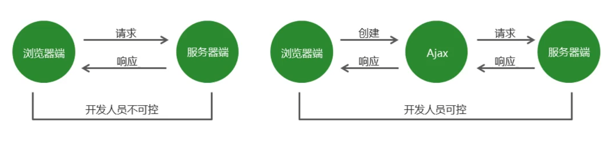

## 1.1、Ajax实现步骤

1. 创建Ajax对象


```js
var xhr = new XMLHttpRequest();
```

2. 告诉Ajax 请求地址以及请求方式

```js
xhr.open(method,url);
```

3. 发送请求

```js
xhr.send(body);				// get请求不传 body参数,只有 post 请求使用
```

4. 获取服务器端给客户端的响应数据

```js
xhr.onload = function() {
    // xhr.responseText 接收文本格式的响应数据
    // xhr.responseXML 接收 xml 格式的响应数据
    console.log(xhr.responseText);
}
```

## 1.2、快速入门

```html
<script>
    // 1.创建ajax对象
    var xhr = new XMLHttpRequest();
    // 2.告诉Ajax对象要向哪发送地址，以什么样的方式发送请求
    // (1)请求方式 (2)请求地址
    xhr.open('get','http://localhost:3000/first');
    // 3.发送请求
    xhr.send();
    // 4.获取服务器端响应到客户端的数据
    xhr.onload = function() {
        // xhr.responseText 
         console.log(xhr.responseText);
    }
</script>
```

在服务器端创建路由：

```js
// 引入express框架
const express = require('express');
// 创建web服务器
const app = express();

// 创建路由
app.get('/first',(req,res) => {
    res.send('Hello,ajax');
});


// 监听端口
app.listen(3000,()=>{
    console.log('服务器启动成功');
});
```

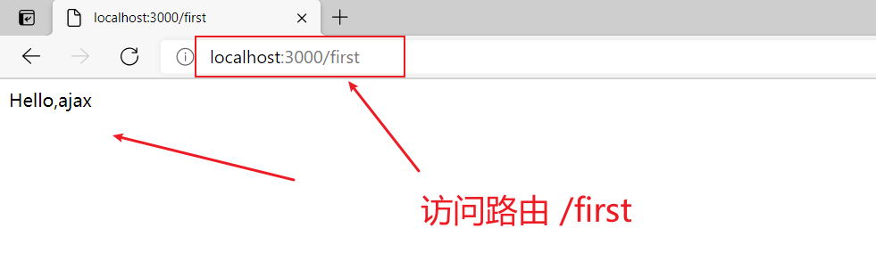


## 1.3、服务器端响应的数据格式

- 在真实的项目中，服务器端**大多数情况下会以 JSON 对象作为响应数据的格式**。

- 当客户端拿到响应数据时，要将 JSON 数据和 HTML 字符串进行拼接，然后将拼接的结果展示在页面中。

- 在 http 请求与响应的过程中，无论是请求参数还是响应内容，如果是对象类型，最终都会被转换为==对象字符串==进行传输。

```js
<script>
    // 1.创建ajax对象
    var xhr = new XMLHttpRequest();
    // 2.告诉Ajax对象要向哪发送地址，以什么样的方式发送请求
    // (1)请求方式 (2)请求地址
    xhr.open('get', 'http://localhost:3000/responseData');
    // 3.发送请求
    xhr.send();
    // 4.获取服务器端响应到客户端的数据
    xhr.onload = function() {
        console.log(xhr.responseText);
        console.log(typeof xhr.responseText)
    }
</script>
```

在 app.js 中设置路由

```js
// 引入express框架
const express = require('express');
// 路径处理模块
const path = require('path');
// 创建web服务器
const app = express();
// 静态资源访问服务功能
app.use(express.static(path.join(__dirname, 'public')));

// 创建路由
app.get('/responseData', (req, res) => {
    // 响应一个 json 对象
    res.send({ "name": "zhangsan" });
});


// 监听端口
app.listen(3000, () => {
    console.log('服务器启动成功');
});
```

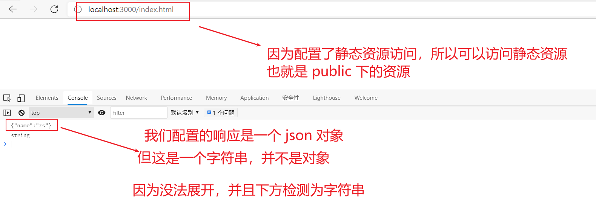

==我们需要将 json 字符串转换为 json 对象==

```js
JSON.parse()  //将 json 字符串转换为json对象
```

```js
<script>
    // 1.创建ajax对象
    var xhr = new XMLHttpRequest();
    // 2.告诉Ajax对象要向哪发送地址，以什么样的方式发送请求
    // (1)请求方式 (2)请求地址
    xhr.open('get', 'http://localhost:3000/responseData');
    // 3.发送请求
    xhr.send();
    // 4.获取服务器端响应到客户端的数据
    xhr.onload = function() {
        // 将JSON字符串转换为JSON对象
        var responseText = JSON.parse(xhr.responseText);
        // 测试:在控制台输出处理结果
        console.log(responseText)
        // 将数据和html字符串进行拼接
        var str = '<h2>' + responseText.name + '</h2>';
        // 将拼接的结果追加到页面中
        document.body.innerHTML = str;
    }
</script>
```

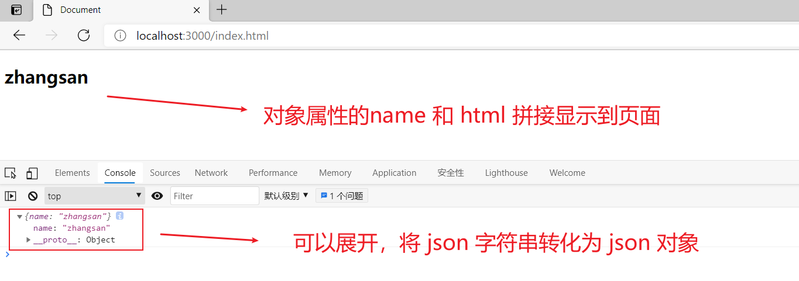


## 1.4、传递get请求参数

- 传统网站表单提交


```html
<form method="get" action="http://www.example.com">
 <input type="text" name="username"/>
 <input type="password" name="password">
</form>

<!– http://www.example.com?username=zhangsan&password=123456 -->
```

- GET请求方式


```js
xhr.open('get', 'http://www.example.com?name=zhangsan&age=20');
```


```html
<body>
    <input type="text" id="username"><br/>
    <input type="text" id="age"><br/>
    <input type="button" value="提交" id="btn">
    <script type="text/javascript">
        // 获取按钮元素
        var btn = document.getElementById('btn');
        // 获取姓名文本框
        var username = document.getElementById('username');
        // 获取年龄文本框
        var age = document.getElementById('age');
        // 为按钮添加点击事件
        btn.onclick = function() {
            // 创建ajax对象
            var xhr = new XMLHttpRequest();
            // 获取用户在文本框中输入的值
            var nameValue = username.value;
            var ageValue = age.value;
            // 拼接请求参数
            var params = 'username=' + nameValue + '&age=' + ageValue;
            // 配置ajax对象请求方式和请求地址
            xhr.open('get', 'http://localhost:3000/get?' + params);
            // 发送请求
            xhr.send();
            // 获取服务器端响应的数据
            xhr.onload = function() {
                console.log(xhr.responseText)
            }
        }
    </script>
</body>
```

在 app.js 中创建路由

```js
// 引入express框架
const express = require('express');
// 路径处理模块
const path = require('path');
// 创建web服务器
const app = express();
// 静态资源访问服务功能
app.use(express.static(path.join(__dirname, 'public')));

// 创建路由
app.get('/get', (req, res) => {
    // 获取 get 请求参数
    res.send(req.query);
})

// 监听端口
app.listen(3000, () => {
    console.log('服务器启动成功');
});
```

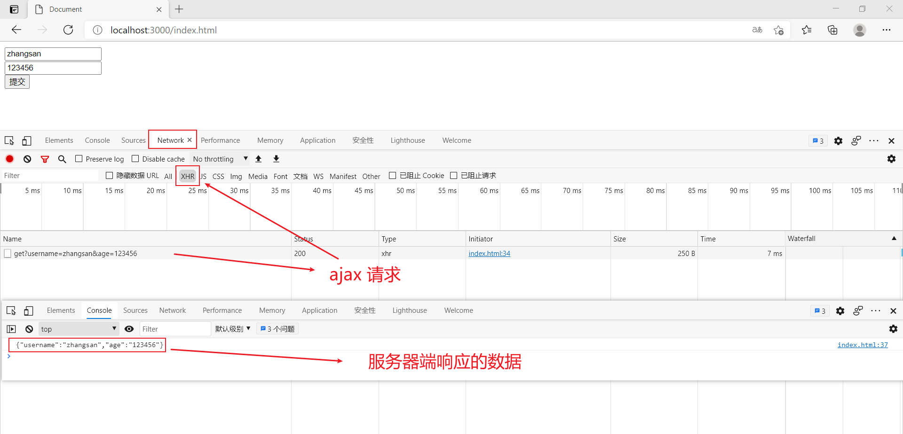


- 

  ```js
  
  ```

请求报文

在 HTTP 请求和响应的过程中传递的数据块就叫**报文**，包括要传送的数据和一些附加信息，这些数据和信息要遵守规定好的格式

## 1.5、传递POST请求参数

- POST请求方式

```js
// post请求必须要设置请求参数格式的类型
xhr.setRequestHeader('Content-Type', 'application/x-www-form-urlencoded') 
// 发送请求(POST请求要带参数)
xhr.send('name=zhangsan&age=20');
```


```html
<body>
    <input type="text" id="username"><br/>
    <input type="text" id="age"><br/>
    <input type="button" value="提交" id="btn">
    <script type="text/javascript">
        // 获取按钮元素
        var btn = document.getElementById('btn');
        // 获取姓名文本框
        var username = document.getElementById('username');
        // 获取年龄文本框
        var age = document.getElementById('age');
        // 为按钮添加点击事件
        btn.onclick = function() {
            // 创建ajax对象
            var xhr = new XMLHttpRequest();
            // 获取用户在文本框中输入的值
            var nameValue = username.value;
            var ageValue = age.value;
            // 拼接请求参数
            var params = 'username=' + nameValue + '&age=' + ageValue;
            // 配置ajax对象请求方式和请求地址
            xhr.open('post', 'http://localhost:3000/post');
            // 设置请求参数格式的类型(post请求必须要设置)
            xhr.setRequestHeader('Content-type', 'application/x-www-form-urlencoded');

            // 发送请求(POST请求要带参数)
            xhr.send(params);
            // 获取服务器端响应的数据
            xhr.onload = function() {
                console.log(xhr.responseText)
            }
        }
    </script>
</body>
```

在 app.js 中创建路由

```js
// 引入express框架
const express = require('express');
// 路径处理模块
const path = require('path');
// 第三方模块
const bodyParser = require('body-parser');
// parse application/x-www-form-urlencoded
app.use(express.urlencoded({ extended: false }))
// 创建web服务器
const app = express();
// 静态资源访问服务功能
app.use(express.static(path.join(__dirname, 'public')));


// 创建路由

app.post('/post', (req, res) => {
    // 获取 post 请求参数
    res.send(req.body);
})

// 监听端口
app.listen(3000, () => {
    console.log('服务器启动成功');
});
```

==注意：借助了第三方模块 body-parser==

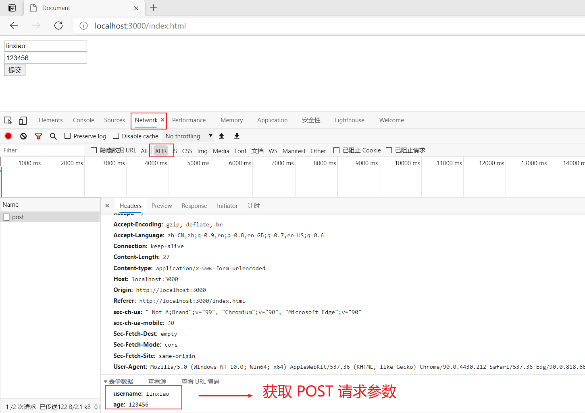


## 1.6、请求参数的格式

我们客户端在向服务器端发送请求参数有以下几种格式，不同的格式需要设置的请求头也是不一样的

1. 设置请求头为 `application/x-www-form-urlencoded` ,传递如下请求参数


```
name=zhangsan&age=20&sex=男
```

2. 设置请求头为 `application/json` ,传递如下请求参数，是 json 对象

```js
{name: 'zhangsan', age: '20', sex: '男'}
```

在请求头中指定 Content-Type 属性的值是 application/json，告诉服务器端当前请求参数的格式是 json，我们还需要将 json 对象转换为 json 字符串，因为==请求参数必须要以字符串格式传递==

```js
JSON.stringify() // 将json对象转换为json字符串
```


```html
<script type="text/javascript">
    // 1.创建ajax对象
    var xhr = new XMLHttpRequest();
    // 2.告诉Ajax对象要向哪发送请求，以什么方式发送请求
    // 1)请求方式 2)请求地址
    xhr.open('post', 'http://localhost:3000/json');
    // 通过请求头告诉服务器端客户端向服务器端传递的请求参数的格式是什么
    xhr.setRequestHeader('Content-Type', 'application/json');
    // JSON.stringify() 将json对象转换为json字符串
    // 3.发送请求
    xhr.send(JSON.stringify({name: 'lisi',age: 50}));
    // 4.获取服务器端响应到客户端的数据
    xhr.onload = function() {
        console.log(xhr.responseText)
    }
</script>
```

在app.js 中配置路由

```js
// 引入express框架
const express = require('express');
// 路径处理模块
const path = require('path');
// 第三方模块
const bodyParser = require('body-parser');
// 创建web服务器
const app = express();
// parse application/json
app.use(express.json())

// 静态资源访问服务功能
app.use(express.static(path.join(__dirname, 'public')));


// 创建路由
app.post('/json', (req, res) => {
    res.send(req.body);
});

// 监听端口
app.listen(3000, () => {
    console.log('服务器启动成功');
});
```

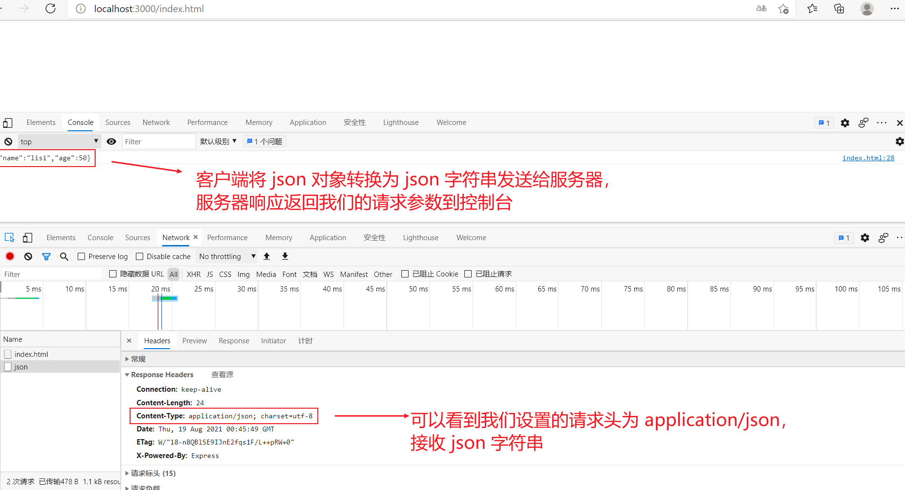

**注意：get 请求是不能提交 json 对象数据格式的，传统网站的表单提交也是不支持 json 对象数据格式的。**

## 1.7、获取服务器端的响应

### 1.7.1、Ajax状态码

在创建ajax对象，配置ajax对象，发送请求，以及接收完服务器端响应数据，这个过程中的每一个步骤都会对应一个数值，这个数值就是ajax状态码。

> 0：请求未初始化(还没有调用open())
> 1：请求已经建立，但是还没有发送(还没有调用send())
> 2：请求已经发送
> 3：请求正在处理中，通常响应中已经有部分数据可以用了
> 4：响应已经完成，可以获取并使用服务器的响应了


```js
xhr.readyState // 获取Ajax状态码
```


### 1.7.2、onreadystatechange事件

当 Ajax 状态码发生变化时将自动触发该事件。

在事件处理函数中可以获取 Ajax 状态码并对其进行判断，当状态码为 4 时就可以通过 xhr.responseText 获取服务器端的响应数据了

```js
<script type="text/javascript">
    var xhr = new XMLHttpRequest();
    // 0 已经创建了ajax对象 但是还没有对ajax对象进行配置
    console.log(xhr.readyState);
    xhr.open('get', 'http://localhost:3000/readystate');
    // 1 已经对ajax对象进行配置 但是还没有发送请求
    console.log(xhr.readyState);

    // 当ajax状态码发生变化的时候出发
    xhr.onreadystatechange = function() {
        // 2 请求已经发送了
        // 3 已经接收到服务器端的部分数据了
        // 4 服务器端的响应数据已经接收完成
        console.log(xhr.readyState);
        // 对ajax状态码进行判断 如果状态码的值为4就代表数据已经接收完成了
        if (xhr.readyState == 4) {
            console.log(xhr.responseText);
        }
    } 

    xhr.send();

</script>
```

在 app.js 中配置路由

```js
// 引入express框架
const express = require('express');
// 路径处理模块
const path = require('path');
// 第三方模块
const bodyParser = require('body-parser');
// 创建web服务器
const app = express();
// parse application/json
app.use(express.json())

// 静态资源访问服务功能
app.use(express.static(path.join(__dirname, 'public')));


// 创建路由
app.get('/readystate', (req, res) => {
    res.send('hello');
});

// 监听端口
app.listen(3000, () => {
    console.log('服务器启动成功');
});
```

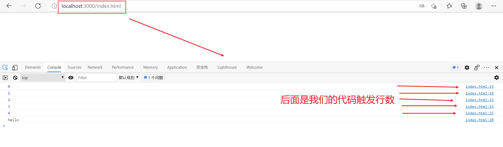


### 1.7.3、区别

两种获取服务器端响应方式的区别

| 区别描述               | onload事件 | onreadystatechange事件 |
| ---------------------- | ---------- | ---------------------- |
| 是否兼容IE低版本       | 不兼容     | 兼容                   |
| 是否需要判断Ajax状态码 | 不需要     | 需要                   |
| 被调用次数             | 一次       | 多次                   |


## 1.8、Ajax错误处理

- 网络畅通，服务器端能接收到请求，服务器端返回的结果不是预期结果。
- **我们可以判断服务器端返回的状态码，分别进行处理。`xhr.status` 获取http状态码**

```html
<body>
    <button id="btn">发送Ajax请求</button>
    <script type="text/javascript">
        var btn = document.getElementById('btn');

        btn.onclick = function() {
            // 1.创建ajax对象
            var xhr = new XMLHttpRequest();
            // 2.告诉Ajax对象要向哪发送请求，以什么方式发送请求
            // 1)请求方式 2)请求地址
            xhr.open('get', 'http://localhost:3000/error');
            // 3.发送请求
            xhr.send();
            // 4.获取服务器端响应到客户端的数据
            xhr.onload = function() {
                    // xhr.status 获取http状态码
                	console.log(xhr.status);
                    console.log(xhr.responseText);
                    if (xhr.status == 400) {
                        alert('请求出错');
                    }
                }
        	}
    </script>
</body>
```

在app.js 中设置路由

```js
// 引入express框架
const express = require('express');
// 路径处理模块
const path = require('path');
// 第三方模块
const bodyParser = require('body-parser');
// 创建web服务器
const app = express();
// parse application/json
app.use(express.json())

// 静态资源访问服务功能
app.use(express.static(path.join(__dirname, 'public')));


// 创建路由
app.get('/error', (req, res) => {
    // res.status 设置http状态码
    res.status(400).send('not ok');
})

// 监听端口
app.listen(3000, () => {
    console.log('服务器启动成功');
});
```


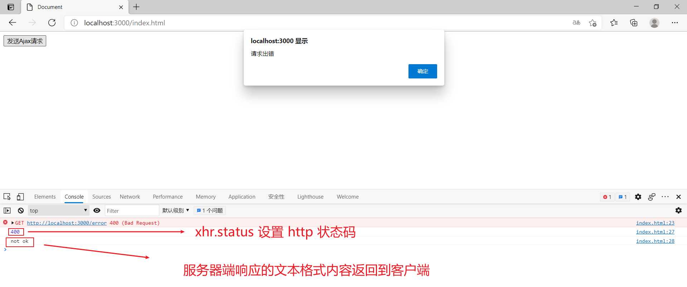

### 1.8.1、几种错误示例

Ajax 请求报错通常会出现以下几种情况，我们来进行查看并排查

1. 网络畅通，服务器端没有接收到请求，返回404状态码

   **检查请求地址是否错误。**


2. 网络畅通，服务器端能接收到请求，服务器端返回500状态码。

   **服务器端错误，找后端程序员进行沟通**

```js
app.get('/error', (req, res) => {
    // 打印一个未定义的变量,服务器端就会出现错误
    console.log(abc);
    res.send("hello")
})
```

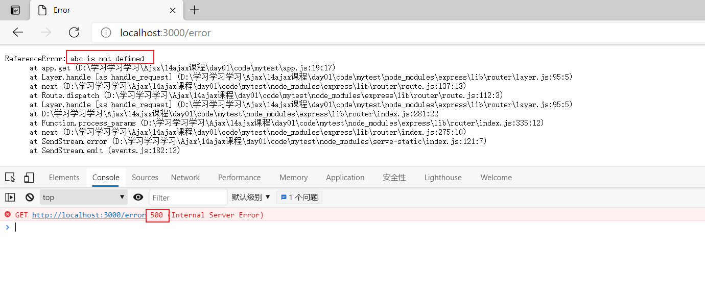

3. 网络中断，请求无法发送到服务器端。

   **会触发xhr对象下面的onerror事件，在onerror事件处理函数中对错误进行处理。**

```js
// 当网络中断时会触发onerrr事件
xhr.onerror = function() {
    alert('网络中断, 无法发送Ajax请求')
}
```

- Ajax状态码: 表示Ajax请求的过程状态 ajax对象返回的(0、1、2、3、4)
- Http状态码: 表示请求的处理结果 是服务器端返回的


## 1.9、低版本 IE 浏览器的缓存问题

**问题**：在低版本的 IE 浏览器中，Ajax 请求有严重的缓存问题，即在请求地址不发生变化的情况下，只有第一次请求会真正发送到服务器端，后续的请求都会从浏览器的缓存中获取结果。即使服务器端的数据更新了，客户端依然拿到的是缓存中的旧数据。

**解决方案**：在请求地址的后面加请求参数，保证每一次请求中的请求参数的值不相同

```js
xhr.open('get', 'http://www.example.com?t=' + Math.random());
```


# 2、Ajax异步编程

## 2.1、同步异步概述

**同步**

- 一个人同一时间只能做一件事情，只有一件事情做完，才能做另外一件事情
- 落实到代码上，就是上一行代码执行完成后，才能执行下一行代码，即代码逐行执行

```js
console.log("before");
console.log("after");
```

**异步**

- 一个人一件事情做了一半，转而去做其他事情，当其他事情做完以后，再回过头来继续做之前未完成的事情。
- 落实到代码上，就是异步代码虽然需要花费时间去执行，但程序不会等待异步代码执行完成后再继续执行后续代码，而是直接执行后续代码，当后续代码执行完成后再回头看异步代码是否返回结果，如果已有返回结果，再调用事先准备好的回调函数处理异步代码执行的结果。

```js
console.log('before');
 setTimeout(
    () => { console.log('last');
 }, 2000);
 console.log('after');
```


## 2.2、Ajax封装

问题: 发送一次请求代码过多，发送多次请求代码冗余且重复

解决方案：将请求代码封装到函数中，发请求时调用函数即可

Ajax 封装代码如下：

```js
function ajax (options) {
	// 默认值
	var defaults = {
		type: 'get',
		url: '',
		async: true,
		data: {},
		header: {
			'Content-Type': 'application/x-www-form-urlencoded'
		},
		success: function () {},
		error: function () {}
	}
	// 使用用户传递的参数替换默认值参数
	Object.assign(defaults, options);
	// 创建ajax对象
	var xhr = new XMLHttpRequest();
	// 参数拼接变量
	var params = '';
	// 循环参数
	for (var attr in defaults.data) {
		// 参数拼接
		params += attr + '=' + defaults.data[attr] + '&';
		// 去掉参数中最后一个&
		params = params.substr(0, params.length-1)
	}
	// 如果请求方式为get
	if (defaults.type == 'get') {
		// 将参数拼接在url地址的后面
		defaults.url += '?' + params;
	}

	// 配置ajax请求
	xhr.open(defaults.type, defaults.url, defaults.async);
	// 如果请求方式为post
	if (defaults.type == 'post') {
		// 设置请求头
		xhr.setRequestHeader('Content-Type', defaults.header['Content-Type']);
		// 如果想服务器端传递的参数类型为json
		if (defaults.header['Content-Type'] == 'application/json') {
			// 将json对象转换为json字符串
			xhr.send(JSON.stringify(defaults.data))
		}else {
			// 发送请求
			xhr.send(params);
		}
	} else {
		xhr.send();
	}
	// 请求加载完成
	xhr.onload = function () {
		// 获取服务器端返回数据的类型
		var contentType = xhr.getResponseHeader('content-type');
		// 获取服务器端返回的响应数据
		var responseText = xhr.responseText;
		// 如果服务器端返回的数据是json数据类型
		if (contentType.includes('application/json')) {
			// 将json字符串转换为json对象
			responseText = JSON.parse(responseText);
		}
		// 如果请求成功
		if (xhr.status == 200) {
			// 调用成功回调函数, 并且将服务器端返回的结果传递给成功回调函数
			defaults.success(responseText, xhr);
		} else {
			// 调用失败回调函数并且将xhr对象传递给回调函数
			defaults.error(responseText, xhr);
		} 
	}
	// 当网络中断时
	xhr.onerror = function () {
		// 调用失败回调函数并且将xhr对象传递给回调函数
		defaults.error(xhr);
	}
}
```

我们可以将上述代码抽离成一个 ajax.js 文件，这样我们的客户端只需要引入 ajax.js 文件，并传递相应的参数，这样就可以大大节省我们的代码量

```html
<body>
    <script type="text/javascript" src="/js/ajax.js"></script>
    <script type="text/javascript">
        ajax({
            url: '',
            type: '',
            success: function() {
                
            }
        })
    </script>
</body>
```


# 3、模板引擎

模板引擎概述

作用: 使用模板引擎提供的模板语法，可以将数据和 HTML 拼接起来

官方地址：https://aui.github.io/art-template/zh-cn/index.html

## 3.1 使用步骤

1. 下载 art-template 模板引擎库文件并在 HTML 页面中引入库文件

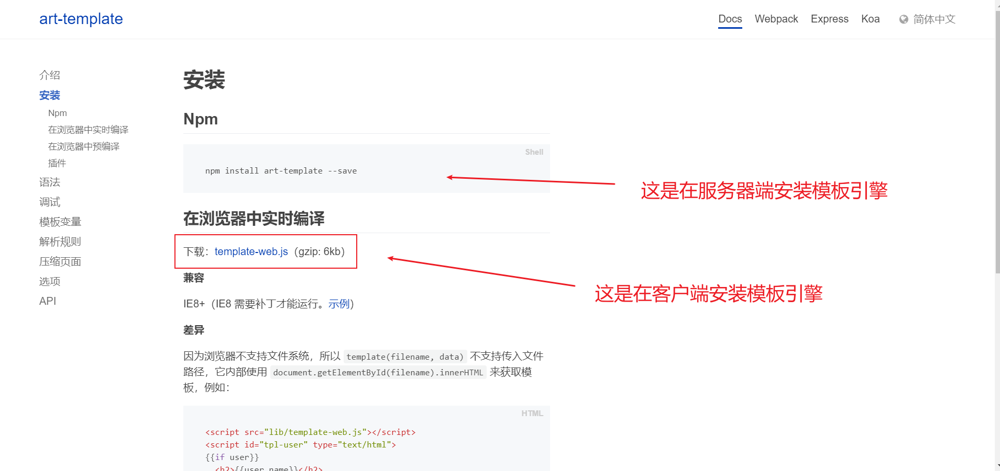

```js
<script src="./js/template-web.js"></script>
```

2. 准备 art-template 模板

```js
<script id="tpl" type="text/html">
 	<div class="box"></div>
</script>
```

3. 告诉模板引擎将哪一个模板和哪个数据进行拼接
   - 第一个参数是 模板ID
   - 第二个参数是 对象
   - 方法的返回值就是拼接好的 html 字符串

```js
var html = template('tpl', {username: 'zhangsan', age: '20'});
```

4. 将拼接好的html字符串添加到页面中

```js
document.getElementById('container').innerHTML = html;
```

5. 通过模板语法告诉模板引擎，数据和html字符串要如何拼接

```js
<script id="tpl" type="text/html">
     <div class="box"> {{ username }} </div>
 </script>
```


# 4、案例

## 4.、验证邮箱地址唯一性


## 4.2、搜索框内容自动提示


## 4.3、省市区三级联动


# 5、FormData

## 5.1、FormData对象的作用

1. 模拟HTML表单，相当于将HTML表单映射成表单对象，自动将表单对象中的数据拼接成请求参数的格式。

2. 异步上传二进制文件


## 5.2、FormData对象的使用

1. 准备HTML表单


```html
<form id="form">
     <input type="text" name="username" />
     <input type="password" name="password" />
     <input type="button"/>
</form>
```

2. 将 HTML 表单转化为 formData 对象

```js
var form = document.getElementById('form'); 
var formData = new FormData(form);
```

3. 提交表单对象

```js
xhr.send(formData);
```

---

例如客户端代码如下：

```html
<body>
    <!-- 创建普通的html表单 -->
    <form id="form">
        <input type="text" name="username">
        <input type="password" name="password">
        <input type="button" id="btn" value="提交">
    </form>
    <script type="text/javascript">
        // 获取按钮
        var btn = document.getElementById('btn');
        // 获取表单
        var form = document.getElementById('form');
        // 为按钮添加点击事件
        btn.onclick = function() {
            // 将普通的html表单转换为表单对象
            var formData = new FormData(form);
            // 创建ajax对象
            var xhr = new XMLHttpRequest();
            // 对ajax对象进行配置
            xhr.open('post', 'http://localhost:3000/formData');
            // 发送ajax请求
            xhr.send(formData);
            // 监听xhr对象下面的onload事件
            xhr.onload = function() {
                // 对象http状态码进行判断
                if (xhr.status == 200) {
                    console.log(xhr.responseText);
                }
            }
        }
    </script>
</body>
```

服务器端代码如下：

- 之前我们使用 body-parser 第三方模块处理客户端向服务器端提供的 POST 请求参数，但是 body-parser 不能处理客户端向服务器端提供的 formData 对象
- 这里要使用 formidable 第三方模块：https://www.npmjs.com/package/formidable

```js
// 引入express框架
const express = require('express');
// 路径处理模块
const path = require('path')
const formidable = require('formidable');
// 创建web服务器
const app = express();

// 静态资源访问服务功能
app.use(express.static(path.join(__dirname, 'public')));


app.post('/formData', (req, res) => {
    // 创建formidable表单解析对象
    const form = new formidable.IncomingForm();
    // 解析客户端传递过来的FormData对象
    form.parse(req, (err, fields, files) => {
        res.send(fields);
    });
});

// 监听端口
app.listen(3000);
```


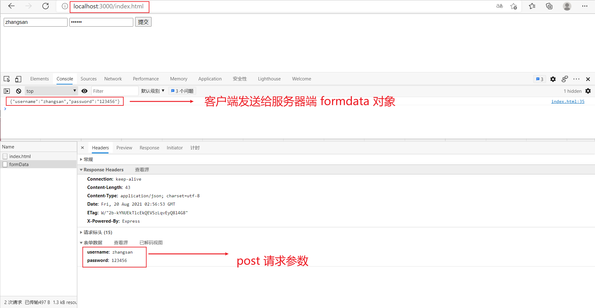


**注意**：

1. Formdata 对象不能用于 get 请求，因为对象需要被传递到 send 方法中，而 get 请求方式的请求参数只能放在请求地址的后面。
2. 服务器端 bodyParser 模块不能解析 formData 对象表单数据，我们需要使用 formidable 模块进行解析


## 5.3、FormData对象的实例方法

1. 获取表单对象中属性的值

```js
formData.get('key');
```

2. 设置表单对象中属性的值

```js
formData.set('key', 'value');
```

```html
<body>
    <!-- 创建普通的html表单 -->
    <form id="form">
        <input type="text" name="username">
        <input type="password" name="password">
        <input type="button" id="btn" value="提交">
    </form>
    <script type="text/javascript">
        // 获取按钮
        var btn = document.getElementById('btn');
        // 获取表单
        var form = document.getElementById('form');
        // 为按钮添加点击事件
        btn.onclick = function() {
            // 将普通的html表单转换为表单对象
            var formData = new FormData(form);

            /*
				get('key') 获取表单对象属性的值
				set('key', 'value') 设置表单对象属性的值
				delete('key') 删除表单对象属性中的值
			*/
            console.log(formData.get('username'));
            // 如果设置的表单属性存在 将会覆盖属性原有的值
            formData.set('username', 'itcast');
            
            // 如果设置的表单属性不存在 将会创建这个表单属性
            formData.set('age', 100);
            
            // 创建ajax对象
            var xhr = new XMLHttpRequest();
            // 对ajax对象进行配置
            xhr.open('post', 'http://localhost:3000/formData');
            // 发送ajax请求
            xhr.send(formData);
            // 监听xhr对象下面的onload事件
            xhr.onload = function() {
                // 对象http状态码进行判断
                if (xhr.status == 200) {
                    console.log(xhr.responseText);
                }
            }
        }
    </script>
</body>
```


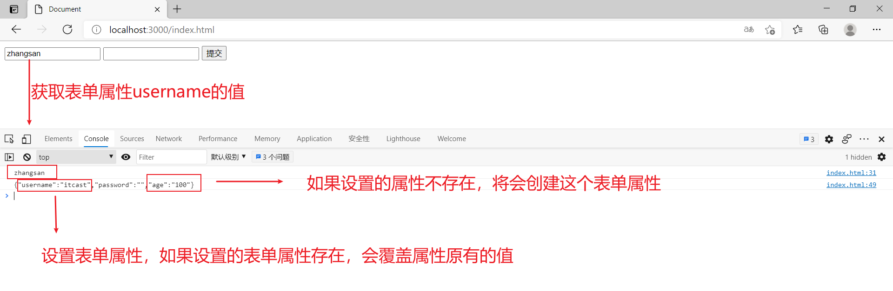


3. 删除表单对象中属性的值

```js
formData.delete('key');
```

4. 向表单对象中追加属性值

```js
formData.append('key', 'value');
```


```html
<body>
    <!-- 创建普通的html表单 -->
    <form id="form">
        <input type="text" name="username">
        <input type="password" name="password">
        <input type="button" id="btn" value="提交">
    </form>
    <script type="text/javascript">
        // 获取按钮
        var btn = document.getElementById('btn');
        // 获取表单
        var form = document.getElementById('form');
        // 为按钮添加点击事件
        btn.onclick = function() {
            // 将普通的html表单转换为表单对象
            var formData = new FormData(form);

            /*
				get('key') 获取表单对象属性的值
				set('key', 'value') 设置表单对象属性的值
				delete('key') 删除表单对象属性中的值
			*/
            console.log(formData.get('username'));
            // 如果设置的表单属性存在 将会覆盖属性原有的值
            formData.set('username', 'itcast');
            formData.append('username', 'itheima');
            // 如果设置的表单属性不存在 将会创建这个表单属性
            formData.set('age', 100);
            // 删除用户输入的密码
            formData.delete('password');
            // 创建ajax对象
            var xhr = new XMLHttpRequest();
            // 对ajax对象进行配置
            xhr.open('post', 'http://localhost:3000/formData');
            // 发送ajax请求
            xhr.send(formData);
            // 监听xhr对象下面的onload事件
            xhr.onload = function() {
                // 对象http状态码进行判断
                if (xhr.status == 200) {
                    console.log(xhr.responseText);
                }
            }
        }
    </script>
</body>
```


> 注意：set 方法与 append 方法的区别是，在属性名已存在的情况下，set 会覆盖已有键名的值，append会保留两个值。


## 5.4、FormData二进制文件上传

```js
<input type="file" id="file"/>
```

二进制文件上传客户端代码如下：

```js
var file = document.getElementById('file')

// 当用户选择文件的时候
 file.onchange = function () {
     // 创建空表单对象
     var formData = new FormData();
     // 将用户选择的二进制文件追加到表单对象中,files属性获取到的文件是一个集合,并且默认情况下input文件选择控件只能选择一个文件,索引就为0
     formData.append('attrName', this.files[0]);
     // 配置ajax对象，请求方式必须为post
     xhr.open('post', 'www.example.com');
     xhr.send(formData);
 }
```

### 5.4.1、示例

客户端代码如下：

```html
<body>
    <div class="container">
        <div class="form-group">
            <label>请选择文件</label>
            <input type="file" id="file">


        </div>
    </div>
    <script type="text/javascript">
        // 获取文件选择控件
        var file = document.getElementById('file');
        // 为文件选择控件添加onchanges事件
        // 在用户选择文件时触发
        file.onchange = function() {
            // 创建空的formData表单对象
            var formData = new FormData();
            // 将用户选择的文件追加到formData表单对象中
            formData.append('attrName', this.files[0]);
            // 创建ajax对象
            var xhr = new XMLHttpRequest();
            // 对ajax对象进行配置
            xhr.open('post', 'http://localhost:3000/upload');
            // 发送ajax请求
            xhr.send(formData);
            // 监听服务器端响应给客户端的数据
            xhr.onload = function() {
                // 如果服务器端返回的http状态码为200
                // 说明请求是成功的
                if (xhr.status == 200) {
                    // 将服务器端返回的数据显示在控制台中
                    console.log(xhr.responseText);
                }
            }

        }
    </script>
</body>
```

服务器端代码如下：

```js
// 引入express框架
const express = require('express');
// 路径处理模块
const path = require('path')
const formidable = require('formidable');
// 创建web服务器
const app = express();

// 静态资源访问服务功能
app.use(express.static(path.join(__dirname, 'public')));


// 实现文件上传的路由
app.post('/upload', (req, res) => {
    // 创建formidable表单解析对象
    const form = new formidable.IncomingForm();
    // 设置客户端上传文件的存储路径
    form.uploadDir = path.join(__dirname, 'public', 'uploads');
    // 保留上传文件的后缀名字
    form.keepExtensions = true;
    // 解析客户端传递过来的FormData对象
    form.parse(req, (err, fields, files) => {
        res.send('ok')
    });
});

// 监听端口
app.listen(3000);
```


## 5.5、FormData文件上传进度展示

```js
// 当用户选择文件的时候
 file.onchange = function () {
     // 文件上传过程中持续触发onprogress事件
     xhr.upload.onprogress = function (ev) {
         // 当前上传文件大小/文件总大小 再将结果转换为百分数
         // 将结果赋值给进度条的宽度属性 
         bar.style.width = (ev.loaded / ev.total) * 100 + '%';
     }
 }
```

## 5.6、FormData文件上传图片即时预览

在我们将图片上传到服务器端以后，服务器端通常都会将图片地址做为响应数据传递到客户端，客户端可以从响应数据中获取图片地址，然后将图片再显示在页面中

```js
xhr.onload = function () {
     var result = JSON.parse(xhr.responseText);
     var img = document.createElement('img');
     img.src = result.src;
     img.onload = function () {
         document.body.appendChild(this);
     }
 }
```


