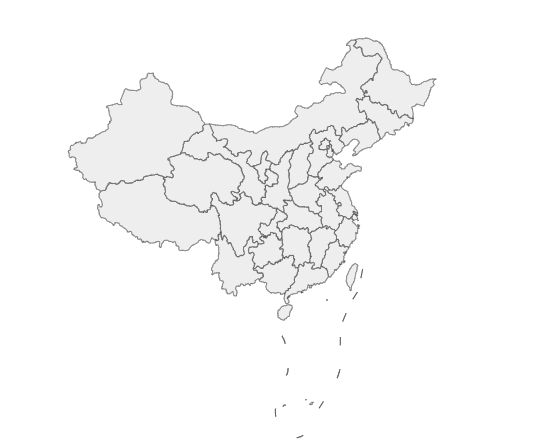

#  1、饼图

1. ECharts 最基本的代码结构
2. 准备数据 [{name: xxx,value:xxx},{...},{...},{...}]
3. 将 series 中的 type 的值设置为 pie

```html
<body>
    <!-- 1.准备一个具备大小的 DOM 容器 -->
    <div style="width: 600px;height: 400px"></div>

    <script>
        // 2.初始化echarts实例化对象
        var myChart = echarts.init(document.querySelector('div'));
        // 3.指定图表的配置项和数据
        // pieData就是需要设置给饼图的数据，是一个数组，数组中包含一个又一个对象，每一个对象中需要有 name 和 value
        var pieData = [{
            name: '淘宝',
            value: 11231,
        }, {
            name: '京东',
            value: 22673,
        }, {
            name: '唯品会',
            value: 6123,
        }, {
            name: '拼多多',
            value: 8989,
        }, {
            name: '苏宁易购',
            value: 6700,
        }]

        var option = {
            series: [{
                type: 'pie',
                data: pieData,
            }]
        }


        // 4.使用刚指定的配置项和数据显示图表。
        myChart.setOption(option);
    </script>
</body>
```


## 1.1、饼图的常见效果

### 1.1.1、显示数值

- 显示数值
- label.formatter

```html
<body>
    <!-- 1.准备一个具备大小的 DOM 容器 -->
    <div style="width: 600px;height: 400px"></div>

    <script>
        // 2.初始化echarts实例化对象
        var myChart = echarts.init(document.querySelector('div'));
        // 3.指定图表的配置项和数据
        // pieData就是需要设置给饼图的数据，是一个数组，数组中包含一个又一个对象，每一个对象中需要有 name 和 value
        var pieData = [{
            name: '淘宝',
            value: 11231,
        }, {
            name: '京东',
            value: 22673,
        }, {
            name: '唯品会',
            value: 6123,
        }, {
            name: '拼多多',
            value: 8989,
        }, {
            name: '苏宁易购',
            value: 6700,
        }]

        var option = {
            series: [{
                type: 'pie',
                data: pieData,
                // 饼图的文字的显示
                label: {
                    show: true,
                    // 决定文字显示的内容
                    formatter: function(arg) {
                        console.log(arg);
                        return arg.name + '平台' + arg.value + '元\n' + arg.percent + '%';
                    },
                }
            }]
        }


        // 4.使用刚指定的配置项和数据显示图表。
        myChart.setOption(option);
    </script>
</body>
```

.assets/1.png)

arg内容如下，是一个对象

.assets/2.png)


### 1.1.2、圆环

- 设置两个半径
- radius: ['50%','70%']

```html
<body>
    <!-- 1.准备一个具备大小的 DOM 容器 -->
    <div style="width: 600px;height: 400px"></div>

    <script>
        // 2.初始化echarts实例化对象
        var myChart = echarts.init(document.querySelector('div'));
        // 3.指定图表的配置项和数据
        // pieData就是需要设置给饼图的数据，是一个数组，数组中包含一个又一个对象，每一个对象中需要有 name 和 value
        var pieData = [{
            name: '淘宝',
            value: 11231,
        }, {
            name: '京东',
            value: 22673,
        }, {
            name: '唯品会',
            value: 6123,
        }, {
            name: '拼多多',
            value: 8989,
        }, {
            name: '苏宁易购',
            value: 6700,
        }]

        var option = {
            series: [{
                type: 'pie',
                data: pieData,
                // 饼图的文字的显示
                label: {
                    show: true,
                    // 决定文字显示的内容
                    formatter: function(arg) {
                        console.log(arg);
                        return arg.name + '平台' + arg.value + '元\n' + arg.percent + '%';
                    },  
                },
                //radius: 20,     //饼图的半径
                radius: '20%',      // 百分比参照的是宽度和高度中较小的那一部分的一半 × 百分比
                radius: ['50%','70%'], // 第 0 个元素代表的是内圆的半径,第 1 个元素是外圆的半径
            }]
        }


        // 4.使用刚指定的配置项和数据显示图表。
        myChart.setOption(option);
    </script>
</body>
```

.assets/3.png)


### 1.1.3、南丁格尔图

```html
<body>
    <!-- 1.准备一个具备大小的 DOM 容器 -->
    <div style="width: 600px;height: 400px"></div>

    <script>
        // 2.初始化echarts实例化对象
        var myChart = echarts.init(document.querySelector('div'));
        // 3.指定图表的配置项和数据
        // pieData就是需要设置给饼图的数据，是一个数组，数组中包含一个又一个对象，每一个对象中需要有 name 和 value
        var pieData = [{
            name: '淘宝',
            value: 11231,
        }, {
            name: '京东',
            value: 22673,
        }, {
            name: '唯品会',
            value: 6123,
        }, {
            name: '拼多多',
            value: 8989,
        }, {
            name: '苏宁易购',
            value: 6700,
        }]

        var option = {
            series: [{
                type: 'pie',
                data: pieData,
                // 饼图的文字的显示
                label: {
                    show: true,
                    // 决定文字显示的内容
                    formatter: function(arg) {
                        console.log(arg);
                        return arg.name + '平台' + arg.value + '元\n' + arg.percent + '%';
                    },  
                },
                // 南丁格尔图
                roseType: 'radius', // 饼图每一个区域半径不一样
            }]
        }


        // 4.使用刚指定的配置项和数据显示图表。
        myChart.setOption(option);
    </script>
</body>
```


### 1.1.4、选中效果

- 选中模式：selectedMode: single\multiple
- 选中偏移量：selectedOffset：30

```html
<body>
    <!-- 1.准备一个具备大小的 DOM 容器 -->
    <div style="width: 600px;height: 400px"></div>

    <script>
        // 2.初始化echarts实例化对象
        var myChart = echarts.init(document.querySelector('div'));
        // 3.指定图表的配置项和数据
        // pieData就是需要设置给饼图的数据，是一个数组，数组中包含一个又一个对象，每一个对象中需要有 name 和 value
        var pieData = [{
            name: '淘宝',
            value: 11231,
        }, {
            name: '京东',
            value: 22673,
        }, {
            name: '唯品会',
            value: 6123,
        }, {
            name: '拼多多',
            value: 8989,
        }, {
            name: '苏宁易购',
            value: 6700,
        }]

        var option = {
            series: [{
                type: 'pie',
                data: pieData,
                // 饼图的文字的显示
                label: {
                    show: true,
                    // 决定文字显示的内容
                    formatter: function(arg) {
                        console.log(arg);
                        return arg.name + '平台' + arg.value + '元\n' + arg.percent + '%';
                    },  
                },
                // 南丁格尔图
                roseType: 'radius', // 饼图每一个区域半径不一样
                // 选中效果
                selectedMode: 'single', // 选中的效果,能够将选中的区域偏离圆点一小段距离
                //selectedMode: 'multiple',
                selectedOffset: 30,
            }]
        }


        // 4.使用刚指定的配置项和数据显示图表。
        myChart.setOption(option);
    </script>
</body>
```

.assets/4.png)


# 2、地图

地图图表的使用方式

- 百度地图API -> 需要申请百度地图 ak

- 矢量地图->需要准备矢量地图数据

矢量地图的实现步骤：

1. ECharts 最基本的代码结构

2. 准备中国的矢量地图 json 文件，放到 json/map 的目录下

   china.json

3. 使用 Ajax 获取 China.json

```js
$.get('json/map/china.json',function(chinaJson){ })
```

4. 在回调函数中往 echarts 全局对象注册地图的 json 数据

```
echarts.registerMap('chinaMap',chinaJson)
```

5. 在 geo 下设置

   type: 'map'

   map: 'chinaMap'

```html
<!DOCTYPE html>
<html lang="en">

<head>
    <meta charset="UTF-8">
    <meta http-equiv="X-UA-Compatible" content="IE=edge">
    <meta name="viewport" content="width=device-width, initial-scale=1.0">
    <script src="../js/echarts.min.js"></script>
    <title>Document</title>
    <script src="js/echarts.min.js"></script>
    <script src="js/jquery.min.js"></script>
</head>

<body>
    <!-- 1.准备一个具备大小的 DOM 容器 -->
    <div style="width: 600px;height: 400px;"></div>

    <script>
        // 2.初始化echarts实例化对象
        var myChart = echarts.init(document.querySelector("div"));
        $.get('json/map/china.json', function(ret) {
            // ret 就是中国各个省份的矢量地图数据
            // console.log(ret);
            echarts.registerMap('chinaMap', ret);
            // 3.指定图表的配置项和数据
            var option = {
                geo: {
                    type: 'map',
                    map: 'chinaMap' // map 要和 registerMap 中的第一个参数保持一致
                }
            }
            // 4.使用刚指定的配置项和数据显示图表。
            myChart.setOption(option);
        })
    </script>
</body>

</html>
```



## 2.1、省份json获取

省份json数据获取方式如下：

网址：http://datav.aliyun.com/tools/atlas/index.html

1. 首先打开上述网址

.assets/11.png)

2. 打开json格式网址：https://www.bejson.com/

.assets/12.png)

3. 复制后新建 china.json 文件，将json代码粘贴进去即可。

## 2.2、常用设置

- 缩放拖动、名称显示、初始缩放比例

- roam、label、zoom、center

```html
<!DOCTYPE html>
<html lang="en">

<head>
    <meta charset="UTF-8">
    <meta http-equiv="X-UA-Compatible" content="IE=edge">
    <meta name="viewport" content="width=device-width, initial-scale=1.0">
    <script src="../js/echarts.min.js"></script>
    <title>Document</title>
    <script src="js/echarts.min.js"></script>
    <script src="js/jquery.min.js"></script>
</head>

<body>
    <!-- 1.准备一个具备大小的 DOM 容器 -->
    <div style="width: 600px;height: 600px;border:1px solid "></div>

    <script>
        // 2.初始化echarts实例化对象
        var myChart = echarts.init(document.querySelector("div"));
        $.get('json/map/china.json', function(ret) {
            // ret 就是中国各个省份的矢量地图数据
            // console.log(ret);
            echarts.registerMap('chinaMap', ret);
            // 3.指定图表的配置项和数据
            var option = {
                geo: {
                    type: 'map',
                    map: 'chinaMap', // map 要和 registerMap 中的第一个参数保持一致
                    roam: true, // 设置鼠标滚轮缩放和地图拖动的效果
                    label: {
                        show: true // 展示标签
                    },
                    zoom: 1, // 设置初始化缩放比例
                    center: [87.617733, 43.792818], // 中心点
                }
            }
            // 4.使用刚指定的配置项和数据显示图表。
            myChart.setOption(option);
        })
    </script>
</body>

</html>
```

.assets/13.png)


## 2.3、常见效果

### 2.3.1、显示某个区域

1. 加载该区域的矢量地图数据
2. 通过 registerMap 注册到echarts全局对象中
3. 指明 geo 配置下的 type 和 map 属性
4. 通过 zoom 放大该区域
5. 通过 center 定位中心点

```html
<body>
    <!-- 1.准备一个具备大小的 DOM 容器 -->
    <div style="width: 600px;height: 600px;border:1px solid "></div>

    <script>
        // 2.初始化echarts实例化对象
        var myChart = echarts.init(document.querySelector("div"));
        $.get('json/map/anhui.json', function(ret) {
            // ret 就是中国各个省份的矢量地图数据
            console.log(ret);
            echarts.registerMap('anhuiMap', ret);
            // 3.指定图表的配置项和数据
            var option = {
                    geo: {
                        type: 'map',
                        map: 'anhuiMap', // map 要和 registerMap 中的第一个参数保持一致
                        roam: true, // 设置鼠标滚轮缩放和地图拖动的效果
                        label: {
                            show: true // 展示标签
                        },
                        center: [116.507676, 31.752889],
                    }
                }
                // 4.使用刚指定的配置项和数据显示图表。
            myChart.setOption(option);
        })
    </script>
</body>
```


.assets/14.png)


### 2.3.2、不同城市颜色不同

1. 显示基本的中国地图

2. 城市的空气质量数据设置给 series

3. 将 series 下的数据和 geo 关联起来

   geoIndex:0、type: 'map'

4. 结合 visualMap 配合使用

   min、max、inRange、calculable

```html
<!DOCTYPE html>
<html lang="en">

<head>
    <meta charset="UTF-8">
    <meta http-equiv="X-UA-Compatible" content="IE=edge">
    <meta name="viewport" content="width=device-width, initial-scale=1.0">
    <script src="../js/echarts.min.js"></script>
    <title>Document</title>
    <script src="js/echarts.min.js"></script>
    <script src="js/jquery.min.js"></script>
</head>

<body>
    <!-- 1.准备一个具备大小的 DOM 容器 -->
    <div style="width: 600px;height: 600px;border:1px solid "></div>

    <script>
        //1. 显示基本的中国地图
        //2. 将空气质量的数据设置给series下的对象
        //3. 将series下的数据和geo关联起来
        //4. 配置visualMap
        var airData = [
            { name: '北京', value: 39.92 },
            { name: '天津', value: 39.13 },
            { name: '上海', value: 31.22 },
            { name: '重庆', value: 66 },
            { name: '河北', value: 147 },
            { name: '河南', value: 113 },
            { name: '云南', value: 25.04 },
            { name: '辽宁', value: 50 },
            { name: '黑龙江', value: 114 },
            { name: '湖南', value: 175 },
            { name: '安徽', value: 117 },
            { name: '山东', value: 92 },
            { name: '新疆', value: 84 },
            { name: '江苏', value: 67 },
            { name: '浙江', value: 84 },
            { name: '江西', value: 96 },
            { name: '湖北', value: 273 },
            { name: '广西', value: 59 },
            { name: '甘肃', value: 99 },
            { name: '山西', value: 39 },
            { name: '内蒙古', value: 58 },
            { name: '陕西', value: 61 },
            { name: '吉林', value: 51 },
            { name: '福建', value: 29 },
            { name: '贵州', value: 71 },
            { name: '广东', value: 38 },
            { name: '青海', value: 57 },
            { name: '西藏', value: 24 },
            { name: '四川', value: 58 },
            { name: '宁夏', value: 52 },
            { name: '海南', value: 54 },
            { name: '台湾', value: 88 },
            { name: '香港', value: 66 },
            { name: '澳门', value: 77 },
            { name: '南海诸岛', value: 55 }
        ]
        var mCharts = echarts.init(document.querySelector("div"))
        $.get('json/map/china.json', function (ret) {
          // ret 就是中国的各个省份的矢量地图数据
          console.log(ret)
          echarts.registerMap('chinaMap', ret)
          var option = {
            geo: {
              type: 'map',
              map: 'chinaMap', // chinaMap需要和registerMap中的第一个参数保持一致
              roam: true, // 设置允许缩放以及拖动的效果
              label: {
                show: true // 展示标签
              }
            },
            series: [
              {
                data: airData,
                geoIndex: 0, // 将空气质量的数据和第0个geo配置关联在一起
                type: 'map'
              }
            ],
            visualMap: {
              min: 0,
              max: 300,
              inRange: {
                color: ['white', 'red'] // 控制颜色渐变的范围
              },
              calculable: true // 出现滑块
            }
          }
          mCharts.setOption(option)
        })
    
      </script>
</body>

</html>
```

.assets/15.png)


### 2.3.3、地图结合散点图

1. 给 series 下增加新的对象

2. 准备好散点数据，设置给新对象的 data

3. 配置新对象的 type

   type: effectScatter

4. 让散点图使用地图坐标系统

   coordinatesSystem：'geo'

5. 让涟漪的效果更加明显

   ```
   rippleEffect: {
   	scale: 10
   }
   ```

   

```html
<!DOCTYPE html>
<html lang="en">

<head>
    <meta charset="UTF-8">
    <meta http-equiv="X-UA-Compatible" content="IE=edge">
    <meta name="viewport" content="width=device-width, initial-scale=1.0">
    <script src="../js/echarts.min.js"></script>
    <title>Document</title>
    <script src="js/echarts.min.js"></script>
    <script src="js/jquery.min.js"></script>
</head>

<body>
    <!-- 1.准备一个具备大小的 DOM 容器 -->
    <div style="width: 600px;height: 600px;border:1px solid "></div>

    <script>
        //1. 给series下增加一个新的对象
        //2. 准备数据散点数据  , 配置给series下的另外一个对象
        //3. 配置series下的新对象的type值为effectScatter
        //4. 指明散点图的坐标系统为geo
        //5. 调整涟漪动画效果
        var airData = [
          { name: '北京', value: 39.92 },
          { name: '天津', value: 39.13 },
          { name: '上海', value: 31.22 },
          { name: '重庆', value: 66 },
          { name: '河北', value: 147 },
          { name: '河南', value: 113 },
          { name: '云南', value: 25.04 },
          { name: '辽宁', value: 50 },
          { name: '黑龙江', value: 114 },
          { name: '湖南', value: 175 },
          { name: '安徽', value: 117 },
          { name: '山东', value: 92 },
          { name: '新疆', value: 84 },
          { name: '江苏', value: 67 },
          { name: '浙江', value: 84 },
          { name: '江西', value: 96 },
          { name: '湖北', value: 273 },
          { name: '广西', value: 59 },
          { name: '甘肃', value: 99 },
          { name: '山西', value: 39 },
          { name: '内蒙古', value: 58 },
          { name: '陕西', value: 61 },
          { name: '吉林', value: 51 },
          { name: '福建', value: 29 },
          { name: '贵州', value: 71 },
          { name: '广东', value: 38 },
          { name: '青海', value: 57 },
          { name: '西藏', value: 24 },
          { name: '四川', value: 58 },
          { name: '宁夏', value: 52 },
          { name: '海南', value: 54 },
          { name: '台湾', value: 88 },
          { name: '香港', value: 66 },
          { name: '澳门', value: 77 },
          { name: '南海诸岛', value: 55 }
        ]
        var scatterData = [
          {
            value: [117.283042, 31.86119]
          }
        ]
        var mCharts = echarts.init(document.querySelector("div"))
        $.get('json/map/china.json', function (ret) {
          // ret 就是中国的各个省份的矢量地图数据
          console.log(ret)
          echarts.registerMap('chinaMap', ret)
          var option = {
            geo: {
              type: 'map',
              map: 'chinaMap', // chinaMap需要和registerMap中的第一个参数保持一致
              roam: true, // 设置允许缩放以及拖动的效果
              label: {
                show: true // 展示标签
              }
            },
            series: [
              {
                data: airData,
                geoIndex: 0, // 将空气质量的数据和第0个geo配置关联在一起
                type: 'map'
              },
              {
                data: scatterData, // 配置散点的坐标数据
                type: 'effectScatter',
                coordinateSystem: 'geo', // 指明散点使用的坐标系统  geo的坐标系统
                rippleEffect: {
                  scale: 10 // 设置涟漪动画的缩放比例
                }
              }
            ],
            visualMap: {
              min: 0,
              max: 300,
              inRange: {
                color: ['white', 'red'] // 控制颜色渐变的范围
              },
              calculable: true // 出现滑块
            }
          }
          mCharts.setOption(option)
        })
    
      </script>
</body>

</html>
```


.assets/16.png)


# 3、雷达图

1. ECharts 最基本的代码结构
2. 定义各个维度的最大值
   - indicator: [{name: '易用性',max: 100},......]
3. 准备具体产品的数据
   - data：[{name:'华为手机1',value:[80,90,80,82,90]},......]
4. 图标类型
   - 在 series 下设置 type：radar


```html
<body>
    <!-- 1.准备一个具备大小的 DOM 容器 -->
    <div style="width: 600px;height: 400px"></div>

    <script>
        // 2.初始化echarts实例化对象
        var myChart = echarts.init(document.querySelector('div'));
        // 3.指定图表的配置项和数据
        // dataMax是各个维度，是一个数组，数组中包含一个又一个对象，每一个对象中需要有 name 和 max
        var dataMax = [{
            name: '易用性',
            max: 100,
        }, {
            name: '功能',
            max: 100,
        }, {
            name: '拍照',
            max: 100,
        }, {
            name: '跑分',
            max: 100,
        }, {
            name: '续航',
            max: 100,
        }]

        var option = {
            radar: {
                indicator: dataMax,
            },
            series: [
                {
                    type: 'radar',
                    data: [
                        {name: '华为手机1',value:[80,90,80,82,90]},
                        {name: '中兴手机1',value:[70,82,75,70,78]},
                    ]
                }
            ],
        }


        // 4.使用刚指定的配置项和数据显示图表。
        myChart.setOption(option);
    </script>
</body>
```

.assets/5.png)


## 3.1、雷达图常用效果

### 3.1.1、显示数值

- 显示数值
- label

### 3.1.2、区域面积

- 区域面积
- areaStyle

### 3.1.3、绘制类型

- 绘制类型
- shape


```html
<body>
    <!-- 1.准备一个具备大小的 DOM 容器 -->
    <div style="width: 600px;height: 400px"></div>

    <script>
        // 2.初始化echarts实例化对象
        var myChart = echarts.init(document.querySelector('div'));
        // 3.指定图表的配置项和数据
        // dataMax是各个维度的最大值，是一个数组，数组中包含一个又一个对象，每一个对象中需要有 name 和 max
        var dataMax = [{
            name: '易用性',
            max: 100,
        }, {
            name: '功能',
            max: 100,
        }, {
            name: '拍照',
            max: 100,
        }, {
            name: '跑分',
            max: 100,
        }, {
            name: '续航',
            max: 100,
        }]

        var option = {
            radar: {
                indicator: dataMax,
                shape: 'circle', // 配置雷达图最外层的图形 circle 圆形    polygon 多边形
            },
            series: [{
                type: 'radar',
                // 设置标签的样式
                label: {
                    show: true, // 显示数值
                },
                areaStyle: {}, // 将每一个产品的雷达图形成阴影的面积

                data: [{
                    name: '华为手机1',
                    value: [80, 90, 80, 82, 90]
                }, {
                    name: '中兴手机1',
                    value: [70, 82, 75, 70, 78]
                }, ]
            }],
        }


        // 4.使用刚指定的配置项和数据显示图表。
        myChart.setOption(option);
    </script>
</body>

```

.assets/6.png)


# 4、仪表盘

1. ECharts 最基本的代码结构
2. 准备数据，设置给 series 下的 data
   - data：[{value:97}]\
3. 图表类型：在 series 下设置 type: gauge

```html
<body>
    <!-- 1.准备一个具备大小的 DOM 容器 -->
    <div style="width: 600px;height: 400px"></div>

    <script>
        // 2.初始化echarts实例化对象
        var myChart = echarts.init(document.querySelector('div'));
        // 3.指定图表的配置项和数据
        var option = {
            series: [
                {
                    type: 'gauge',
                    data: [
                        {value: 97},
                    ]
                }
            ]
        }


        // 4.使用刚指定的配置项和数据显示图表。
        myChart.setOption(option);
    </script>
</body>
```

.assets/7.png)


## 4.1、仪表盘效果

### 4.1.1、数值范围

- 数值范围
- max 、min

### 4.1.2、多个指针

- 增加 data 中的数组元素

### 4.1.3、多个指针颜色差异

- itemStyle

```html
<body>
    <!-- 1.准备一个具备大小的 DOM 容器 -->
    <div style="width: 600px;height: 400px"></div>

    <script>
        // 2.初始化echarts实例化对象
        var myChart = echarts.init(document.querySelector('div'));
        // 3.指定图表的配置项和数据
        var option = {
            series: [{
                type: 'gauge',
                data: [{
                        value: 97,
                        // 指针样式
                        itemStyle: {
                            color: 'pink'
                        }
                    },
                    //每一个对象就代表一个指针
                    {
                        value: 85,
                        itemStyle: {
                            color: 'green'
                        }
                    },
                ],
                min: 50, // min max 控制仪表盘数值范围

            }]
        }


        // 4.使用刚指定的配置项和数据显示图表。
        myChart.setOption(option);
    </script>
</body>
```


.assets/8.png)


# 5、七个图表小结

## 5.1、各个图表的英文单词

- bar →柱状图
- line →折线图
- scatter / effectScatter → 散点图 / 涟漪动画的散点图
- pie → 饼图
- map → 地图
- rader → 雷达图
- guage → 仪表盘

## 5.2、使用场景

.assets/9.png)


