# 1、ECharts

## 1.1、ECharts下载

### 1.1.1、Github下载

1. 下载并引入echarts.js文件(图标依赖这个 js 库)

中文官网：https://echarts.apache.org/zh/index.html

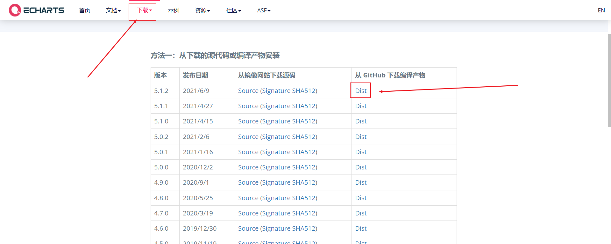

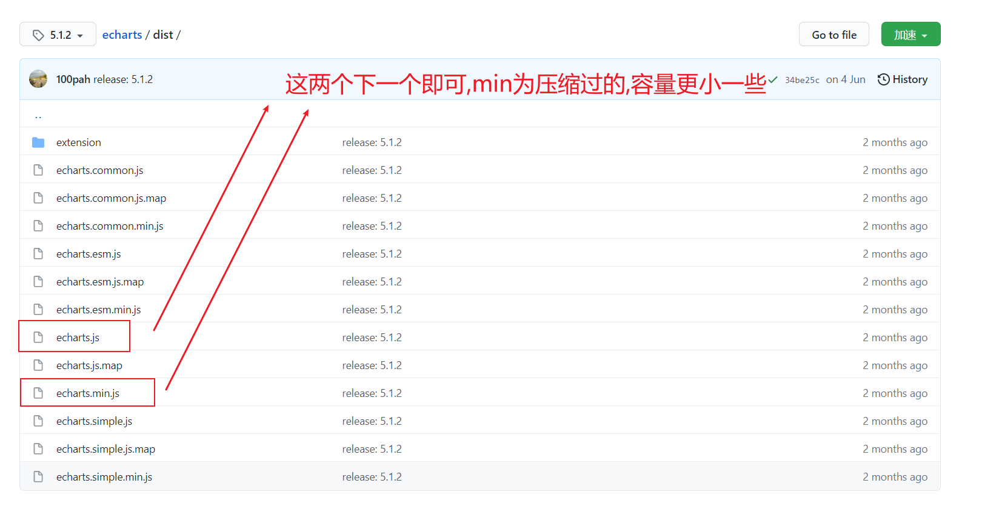

### 1.1.2、Gitee下载

- 如果Github进不去,我们也可以去 gitee 下载:https://gitee.com/echarts

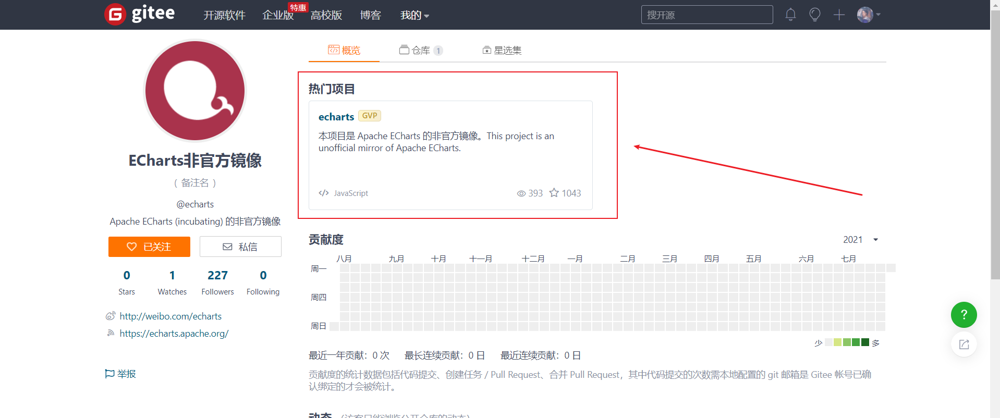


- 我这里以5.0.1版本为例

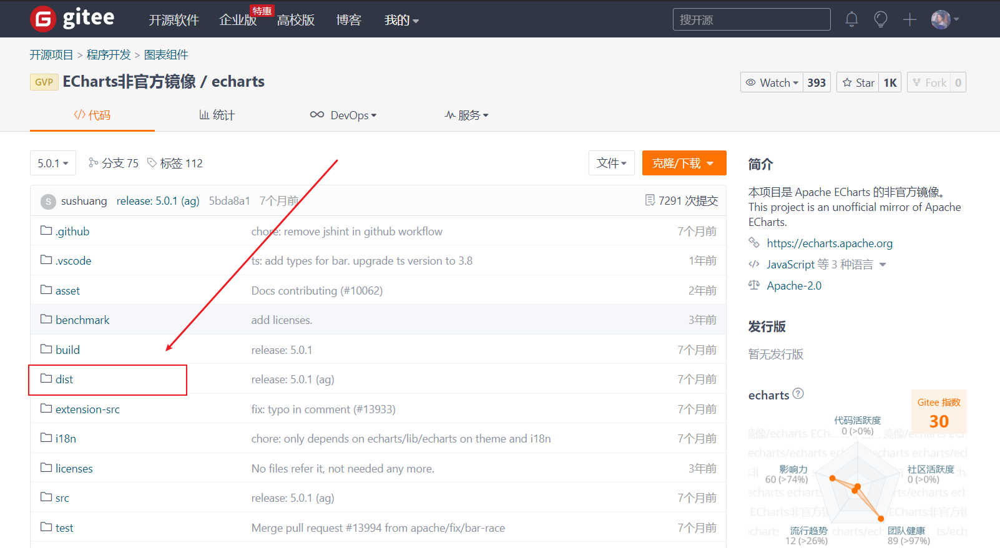


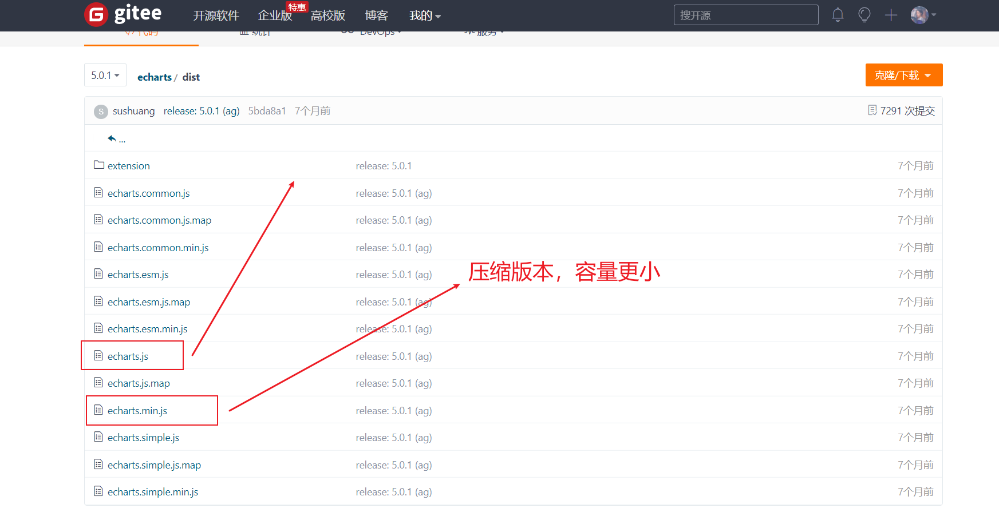


- 我们点击克隆/下载，下载 zip 即可

- 下载完成解压，在 dist 文件夹下 找到 `echarts.min.js` 拷贝到我们自己的项目结构下
- 之后用 script 标签引入即可


## 1.2、ECharts使用

1. 准备一个具备大小的 DOM 容器(生成的图标会放入这个容器内)
2. 初始化 echarts 实例对象(实例化 echarts 对象)
3. 指定配合项和数据(option) 
4. 将配置项设置给 echarts 实例对象

```html
<!DOCTYPE html>
<html lang="en">

<head>
    <meta charset="UTF-8">
    <meta http-equiv="X-UA-Compatible" content="IE=edge">
    <meta name="viewport" content="width=device-width, initial-scale=1.0">
    <script src="../js/echarts.min.js"></script>
    <title>Document</title>
    <style>
        .box {
            width: 400px;
            height: 400px;
            background-color: pink;
        }
    </style>
</head>

<body>
    <!-- 1.准备一个具备大小的 DOM 容器 -->
    <div class="box"></div>

    <script>
        // 2.初始化echarts实例化对象
        var myChart = echarts.init(document.querySelector('.box'));
        // 3.指定图表的配置项和数据
        var option = {
            title: {
                text: 'ECharts 入门示例'
            },
            tooltip: {},
            legend: {
                data: ['销量']
            },
            xAxis: {
                data: ["衬衫", "羊毛衫", "雪纺衫", "裤子", "高跟鞋", "袜子"]
            },
            yAxis: {},
            series: [{
                name: '销量',
                type: 'bar',
                data: [5, 20, 36, 10, 10, 20]
            }]
        };

        // 4.使用刚指定的配置项和数据显示图表。
        myChart.setOption(option);
    </script>
</body>

</html>
```

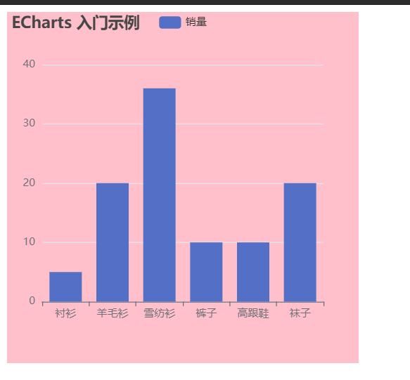

这样我们第一个示例就做好了


## 1.3、选择不同图表

- 我们除了柱形图还可以选择其他不同的图表，唯一不同的步骤就在于步骤三指定图表的配置项和数据
- ==官网 - 示例==。里面有很多的图表，我们点进去只需要将代码替换我们步骤三的代码即可。

# 2、ECharts通用配置

- ==官网 - 文档 - 配置项手册，可以查看我们的所有配置==

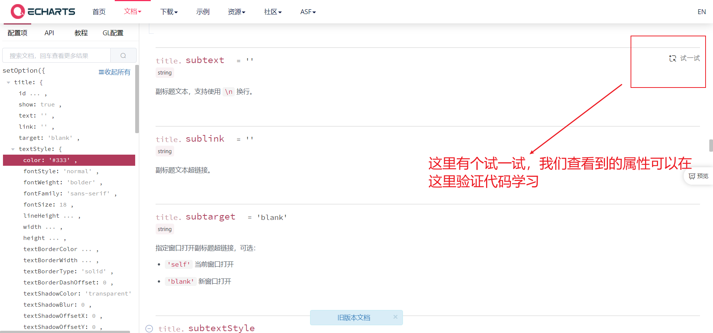

- 并且可以进行修改代码学习,我们可以进入示例中的任意一个图表中修改

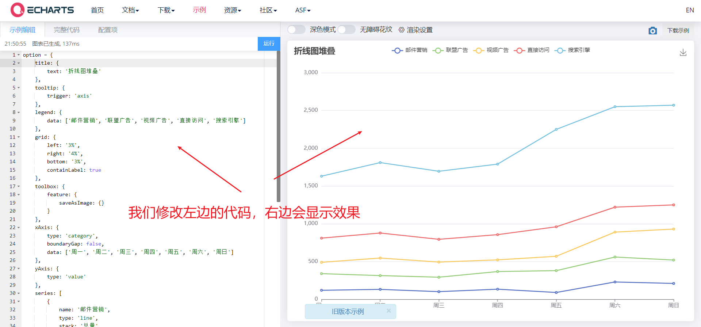

- 统一说明代码位置

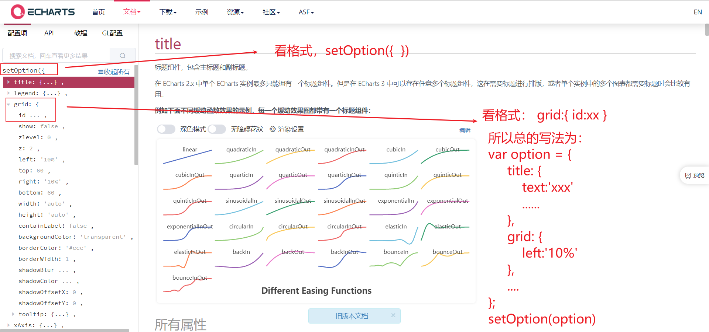

## 2.1、title标题组件

- 标题组件，包含主标题和副标题
- 常用属性：
  - `text`  ：String类型，主标题文本，支持使用`\n` 换行
  - `textStyle` ：Object类型，文字样式
  - 标题边框
    - `borderWidth` ： number类型，标题的边框线宽
    - `borderRadius` ：number/Array，圆角半径
    - `borderColor`：标题的边框颜色
  - 标题位置
    - left、top、right、bottom

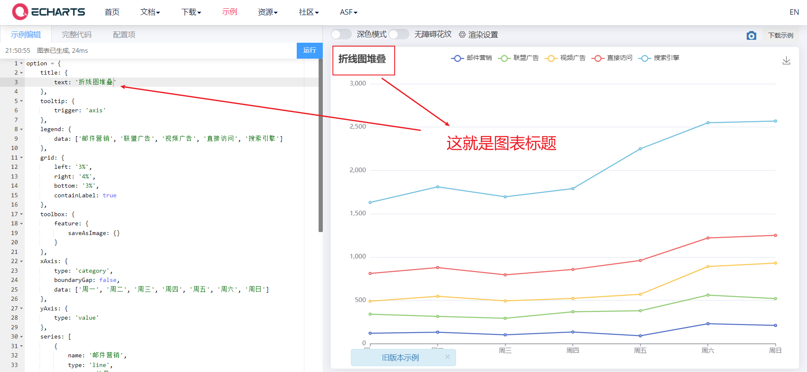

## 2.2、tooltip提示框

- 提示框组件，用于配置鼠标滑过或点击图表时的显示框
- 常用属性：
  - `trigger`：触发类型，类型String，值有以下三种可选
    - `item`：==数据项图形触发==，主要在散点图，饼图等无类目轴的图表中使用。
    - `axis`：==坐标轴触发==，主要在柱状图，折线图等会使用类目轴的图表中使用。
    - `none`：什么都不触发。
  - `triggerOn` ：触发时机,类型 String，
    - `mousemove` ：鼠标移动时触发
    - `click` ：鼠标点击时触发
    - `mousemove|click` ：鼠标移动和点击时触发
  - `formatter` ：提示框浮层内容格式器，支持字符串模板和回调函数两种形式。
    - 官方文档：https://echarts.apache.org/zh/option.html#tooltip.formatter

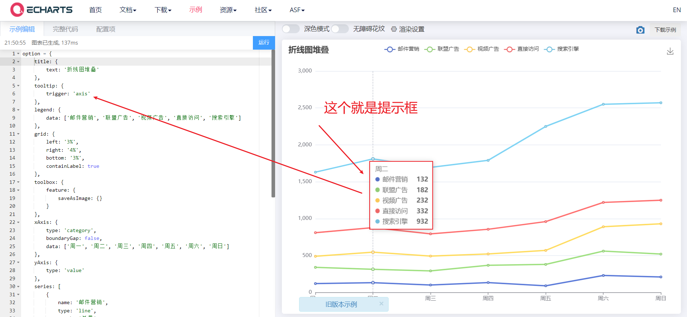


## 2.3、toolbox工具栏

- 工具栏。内置有[导出图片](https://echarts.apache.org/zh/option.html#toolbox.feature.saveAsImage)，[数据视图](https://echarts.apache.org/zh/option.html#toolbox.feature.dataView)，[动态类型切换](https://echarts.apache.org/zh/option.html#toolbox.feature.magicType)，[数据区域缩放](https://echarts.apache.org/zh/option.html#toolbox.feature.dataZoom)，[重置](https://echarts.apache.org/zh/option.html#toolbox.feature.reset)五个工具。
- 常用属性如下：
  - feature，里面的对象有以下几种可选
    - `saveAsImage {}` ：保存为图片
    - `restore {}`：配置项还原
    - `dataView{}` ：数据视图工具，可以展现当前图表所用的数据，编辑后可以动态更新。
    - `dataZoom {}`：数据区域缩放。目前只支持直角坐标系的缩放。
    - `magicType {}`：动态类型切换


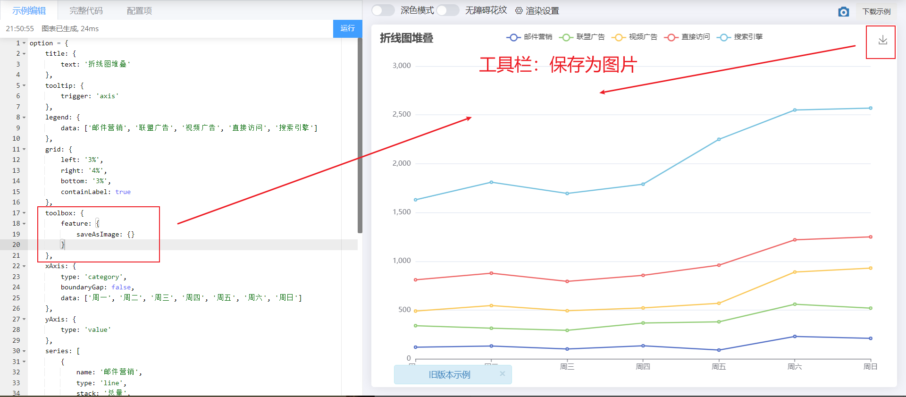


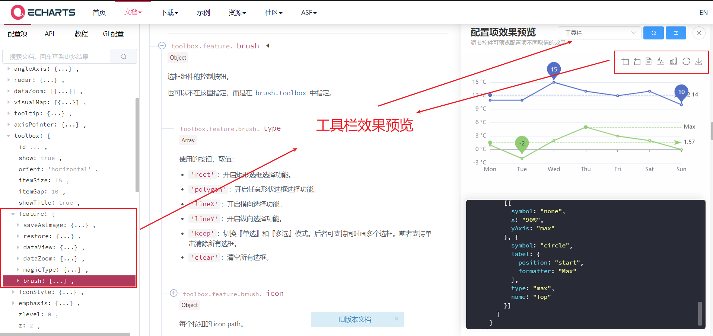


## 2.4、legend图例组件

- 图例组件，用于筛选系列，需要和 series 配合使用
- 常用属性：
  - data：图例的数据数组，是一个数组。
  - **legend 中的 data 的值需要和 series 数组中某组数据的 name 值一致**。

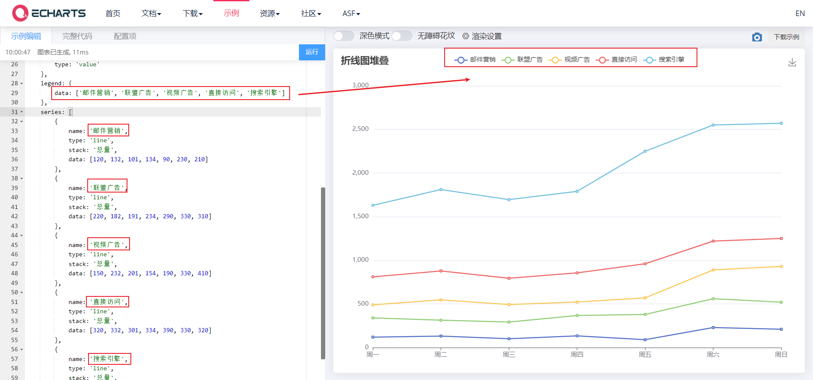


## 2.5、grip直角坐标系内绘图网格

- 直角坐标系内绘图网格，单个 grid 内最多可以放置上下两个 X 轴，左右两个 Y 轴。可以在网格上绘制 折线图、柱状图、散点图

- 常用属性：https://echarts.apache.org/zh/option.html#grid


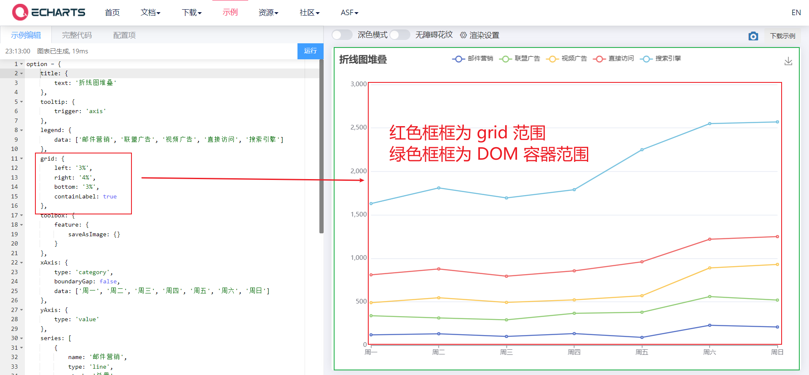


### 2.5.1、xAxis和yAxis

- 官方文档：https://echarts.apache.org/zh/option.html#xAxis

- xAxis 是直角坐标系 grid 中的 x 轴， yAxis 是直角坐标系 grid 中的y轴
- 其常用属性如下：
  - type ：类型String，表示坐标轴类型，可选值有以下：
    - `value` ：数值轴，适用于连续数据
    - `category` ：类目轴，适用于离散的类目数据。为该类型时类目数据可自动从 [series.data](https://echarts.apache.org/zh/option.html#series.data)  或 [dataset.source](https://echarts.apache.org/zh/option.html#dataset.source) 中取，或者可通过 [yAxis.data](https://echarts.apache.org/zh/option.html#yAxis.data) 设置类目数据。
    - `time` ：时间轴，适用于连续的时序数据
    - `log` ：对数轴，适用于对数数据
  - name：类型String，坐标轴的名称

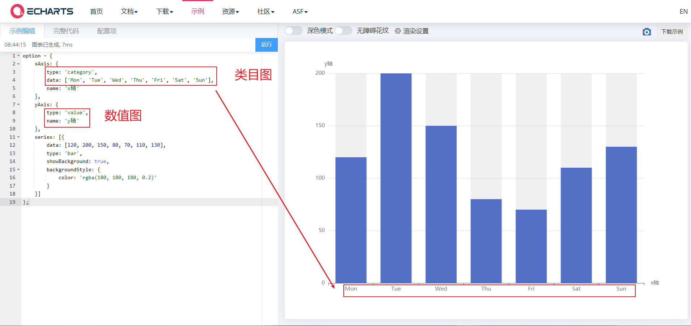


### 2.5.2、series

- 官方文档：https://echarts.apache.org/zh/option.html#series

- 系列列表，每个系列通过 type 决定自己的图表类型，并且可以给 y 轴提供数据
- 其常用属性如下：
  - data：https://echarts.apache.org/zh/option.html#series-line.data
  - type：通过 type 决定自己的图表类型

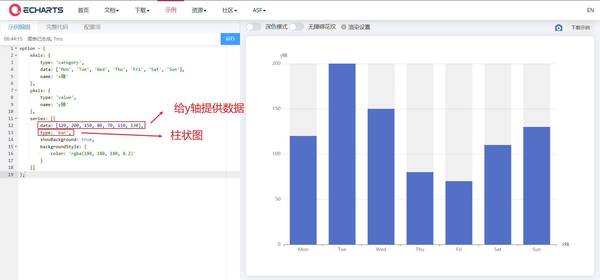


# 3、柱状图

```html
<body>
    <!-- 1.准备一个具备大小的 DOM 容器 -->
    <div style="width: 600px;height: 400px"></div>

    <script>
        // 2.初始化echarts实例化对象
        var myChart = echarts.init(document.querySelector('div'));
        // 3.指定图表的配置项和数据
        
        var xDataArr = ['张三','李四','王五','闰土','小明','茅台','蘑菇头','王炸',];
        var yDataArr = [88,92,63,77,94,80,72,86];
        var option = {
          xAxis: {
              type: 'category',
              data: xDataArr,
          },
          yAxis: {
              type: 'value',
          },
          series: [
            {
                name: '语文',
                type: 'bar',
                data: yDataArr,
            }
        ],
        };

        // 4.使用刚指定的配置项和数据显示图表。
        myChart.setOption(option);
    </script>
</body>
```


## 3.1、柱状图常见效果


### 3.1.1、标记

- 标记：最大值、最小值、平均值
- markPoint、markLine、


```html
<body>
    <!-- 1.准备一个具备大小的 DOM 容器 -->
    <div style="width: 600px;height: 400px"></div>

    <script>
        // 2.初始化echarts实例化对象
        var myChart = echarts.init(document.querySelector('div'));
        // 3.指定图表的配置项和数据
        
        var xDataArr = ['张三','李四','王五','闰土','小明','茅台','蘑菇头','王炸',];
        var yDataArr = [88,92,63,77,94,80,72,86];
        var option = {
          xAxis: {
              type: 'category',
              data: xDataArr,
          },
          yAxis: {
              type: 'value',
          },
          series: [
            {
                name: '语文',
                type: 'bar',
                markPoint: {
                    data: [{type: 'max',name: '最大值'},{type: 'min',name: '最小值'}]
                },
                markLine : {
                    data: [{type: 'average',name: '平均值'}]
                },
                data: yDataArr,
            }
        ],
        };

        // 4.使用刚指定的配置项和数据显示图表。
        myChart.setOption(option);
    </script>
</body>
```

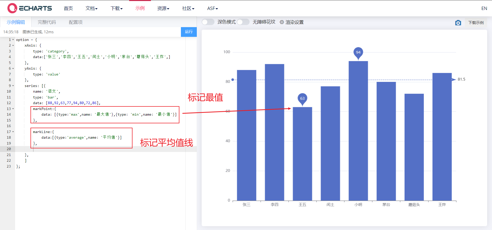


### 3.1.2、显示

- 显示：数值显示、柱宽度、横向柱状图
- label、barWidth、更改 x轴和 y轴的角色

```html
<body>
    <!-- 1.准备一个具备大小的 DOM 容器 -->
    <div style="width: 600px;height: 400px"></div>

    <script>
        // 2.初始化echarts实例化对象
        var myChart = echarts.init(document.querySelector('div'));
        // 3.指定图表的配置项和数据
        
        var xDataArr = ['张三','李四','王五','闰土','小明','茅台','蘑菇头','王炸',];
        var yDataArr = [88,92,63,77,94,80,72,86];
        // 横向柱状图
        var option = {
          xAxis: {
              type: 'value',

          },
          yAxis: {
              type: 'category',
              data: xDataArr,
          },
          series: [
            {
                name: '语文',
                type: 'bar',
                markPoint: {
                    data: [{type: 'max',name: '最大值'},{type: 'min',name: '最小值'}]
                },
                markLine : {
                    data: [{type: 'average',name: '平均值'}]
                },
                // 数值显示
                label: {
                    show: true,
                    rotate: 60,     //旋转60°
                    position: 'inside',
                },
                // 柱宽度
                barWidth: '30%',

                data: yDataArr,
            }
        ],
        };

        // 4.使用刚指定的配置项和数据显示图表。
        myChart.setOption(option);
    </script>
</body>
```

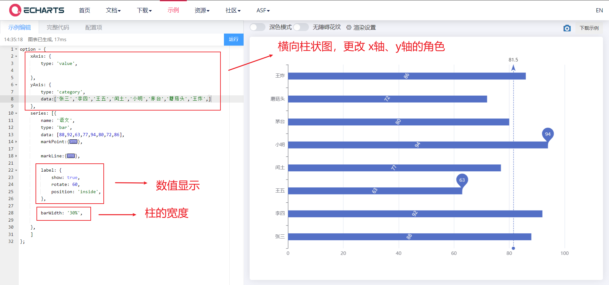


# 4、折线图

```html
<body>
    <!-- 1.准备一个具备大小的 DOM 容器 -->
    <div style="width: 600px;height: 400px"></div>

    <script>
        // 2.初始化echarts实例化对象
        var myChart = echarts.init(document.querySelector('div'));
        // 3.指定图表的配置项和数据
        var xDataArr = ['1月', '2月', '3月', '4月', '5月', '6月', '7月', '8月', '9月', '10月', '11月', '12月'];
        var yDataArr = [3000, 2800, 900, 1000, 800, 700, 1400, 1300, 900, 1000, 800, 600];
        var option = {
            xAxis: {
                type: 'category',
                data: xDataArr
            },
            yAxis: {
                type: 'value'
            },
            series: [{
                name: '康师傅',
                data: yDataArr,
                type: 'line'
            }]
        };

        // 4.使用刚指定的配置项和数据显示图表。
        myChart.setOption(option);
    </script>
</body>
```

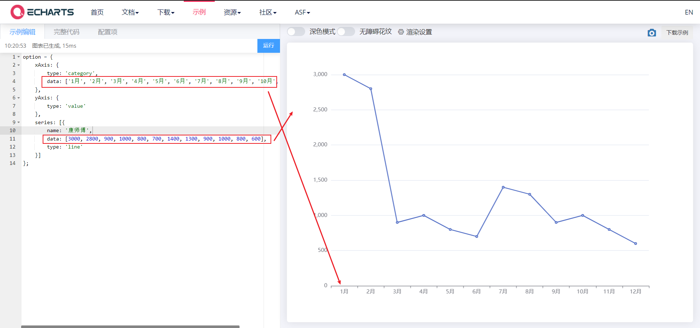


## 4.1、折线图常见效果

### 4.1.1、标记

- 标记最大值、最小值、平均值、标注区间
- markPoint、markLine、markArea

```html
<body>
    <!-- 1.准备一个具备大小的 DOM 容器 -->
    <div style="width: 600px;height: 400px"></div>

    <script>
        // 2.初始化echarts实例化对象
        var myChart = echarts.init(document.querySelector('div'));
        // 3.指定图表的配置项和数据
        var xDataArr = ['1月', '2月', '3月', '4月', '5月', '6月', '7月', '8月', '9月', '10月', '11月', '12月'];
        var yDataArr = [3000, 2800, 900, 1000, 800, 700, 1400, 1300, 900, 1000, 800, 600];
        var option = {
            xAxis: {
                type: 'category',
                data: xDataArr
            },
            yAxis: {
                type: 'value'
            },
            series: [{
                name: '康师傅',
                data: yDataArr,
                type: 'line',
                // 标记最值
                markPoint: {
                    data: [{
                        type: 'max'
                    }, {
                        type: 'min'
                    }]
                },
                // 标记平均值线
                markLine: {
                    data: [{
                        type: 'average'
                    }]
                },
                // 标记区间
                markArea:{
                    data:[
                        [{xAxis: '1月'},{xAxis: '2月'}],
                        [{xAxis: '7月'},{xAxis: '8月'}]
                    ]
                },
                
            }]
        };

        // 4.使用刚指定的配置项和数据显示图表。
        myChart.setOption(option);
    </script>
</body>
```

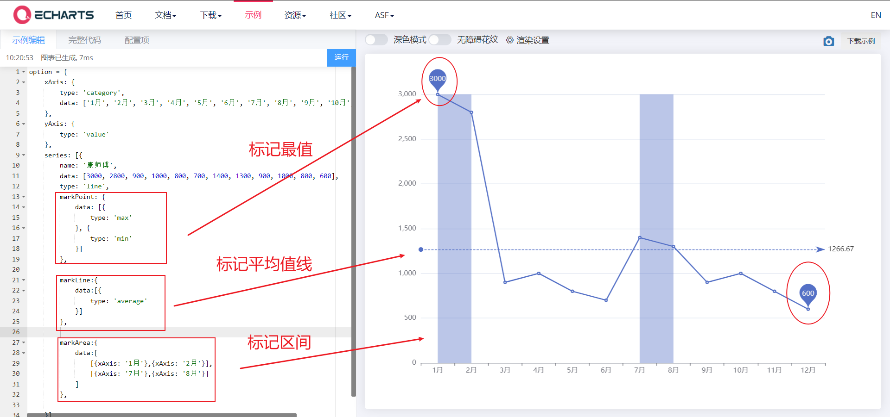


### 4.1.2、线条控制

- 线条控制：平滑 风格
- smooth、lineStyle


```html
<body>
    <!-- 1.准备一个具备大小的 DOM 容器 -->
    <div style="width: 600px;height: 400px"></div>

    <script>
        // 2.初始化echarts实例化对象
        var myChart = echarts.init(document.querySelector('div'));
        // 3.指定图表的配置项和数据
        var xDataArr = ['1月', '2月', '3月', '4月', '5月', '6月', '7月', '8月', '9月', '10月', '11月', '12月'];
        var yDataArr = [3000, 2800, 900, 1000, 800, 700, 1400, 1300, 900, 1000, 800, 600];
        var option = {
            xAxis: {
                type: 'category',
                data: xDataArr
            },
            yAxis: {
                type: 'value'
            },
            series: [{
                name: '康师傅',
                data: yDataArr,
                type: 'line',
                markPoint: {
                    data: [{
                        type: 'max'
                    }, {
                        type: 'min'
                    }]
                },
                markLine: {
                    data: [{
                        type: 'average'
                    }]
                },
                markArea:{
                    data:[
                        [{xAxis: '1月'},{xAxis: '2月'}],
                        [{xAxis: '7月'},{xAxis: '8月'}]
                    ]
                },
                // 线条平滑
                smooth: true,
                // 线条风格
                lineStyle: {
                    color: 'red',
                    type: 'dashed', // dashed 虚线 dotted 电线 solid 实线
                }
            }
        ]
        };

        // 4.使用刚指定的配置项和数据显示图表。
        myChart.setOption(option);
    </script>
</body>
```

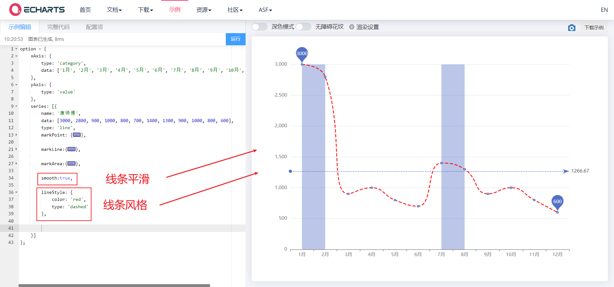


### 4.1.3、填充风格

- 填充风格
- areaStyle

```html
<body>
    <!-- 1.准备一个具备大小的 DOM 容器 -->
    <div style="width: 600px;height: 400px"></div>

    <script>
        // 2.初始化echarts实例化对象
        var myChart = echarts.init(document.querySelector('div'));
        // 3.指定图表的配置项和数据
        var xDataArr = ['1月', '2月', '3月', '4月', '5月', '6月', '7月', '8月', '9月', '10月', '11月', '12月'];
        var yDataArr = [3000, 2800, 900, 1000, 800, 700, 1400, 1300, 900, 1000, 800, 600];
        var option = {
            xAxis: {
                type: 'category',
                data: xDataArr
            },
            yAxis: {
                type: 'value'
            },
            series: [{
                name: '康师傅',
                data: yDataArr,
                type: 'line',
                markPoint: {
                    data: [{
                        type: 'max'
                    }, {
                        type: 'min'
                    }]
                },
                markLine: {
                    data: [{
                        type: 'average'
                    }]
                },
                markArea:{
                    data:[
                        [{xAxis: '1月'},{xAxis: '2月'}],
                        [{xAxis: '7月'},{xAxis: '8月'}]
                    ]
                },
                smooth: true,
                lineStyle: {
                    color: 'red',
                    type: 'dashed', // dashed 虚线 dotted 电线 solid 实线
                },
                
                areaStyle: {
                    color: 'blue'
                },
            }
        ]
        };

        // 4.使用刚指定的配置项和数据显示图表。
        myChart.setOption(option);
    </script>
</body>
```

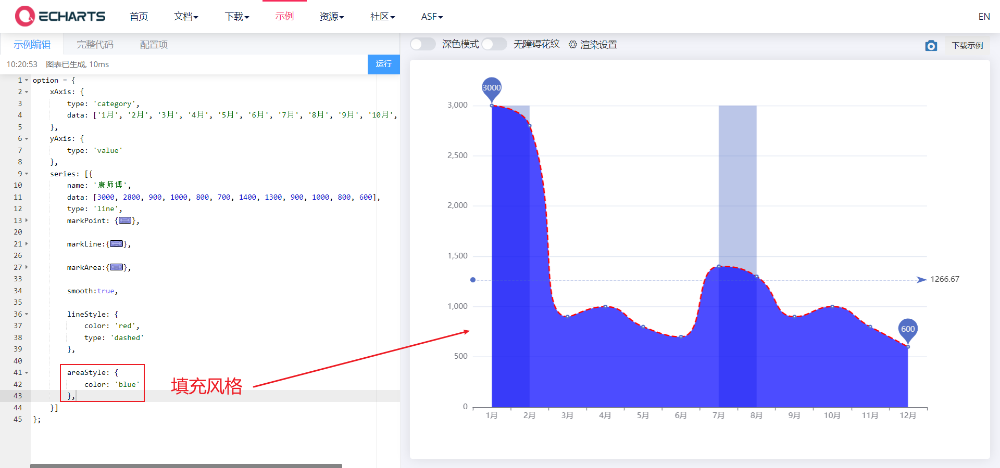


### 4.1.4、紧挨边缘

- 紧挨边缘、缩放(脱离0值比例，也就是不让x、y轴从0开始)
- boundaryGap、scale
  - 使得折线图紧贴左侧 y轴 开始绘制
  - 如果我们的x、y轴一直都是从0开始，那么对于一列数组中元素相差很小，那么折线图就近乎是一条直线了

```html
<body>
    <!-- 1.准备一个具备大小的 DOM 容器 -->
    <div style="width: 600px;height: 400px"></div>

    <script>
        // 2.初始化echarts实例化对象
        var myChart = echarts.init(document.querySelector('div'));
        // 3.指定图表的配置项和数据
        var xDataArr = ['1月', '2月', '3月', '4月', '5月', '6月', '7月', '8月', '9月', '10月', '11月', '12月'];
        //var yDataArr = [3000, 2800, 900, 1000, 800, 700, 1400, 1300, 900, 1000, 800, 600];
        var yDataArr = [3005, 3003, 3001, 3002, 3009, 3007, 3003, 3001, 3005, 3004, 3001, 3009];
        
        var option = {
            xAxis: {
                type: 'category',
                data: xDataArr,
                // 紧挨边缘
                boundaryGap: false,
            },
            yAxis: {
                type: 'value',
                // 缩放
                scale: true,
            },
            series: [{
                name: '康师傅',
                data: yDataArr,
                type: 'line',
                
            }
        ]
        };

        // 4.使用刚指定的配置项和数据显示图表。
        myChart.setOption(option);
    </script>
</body>
```

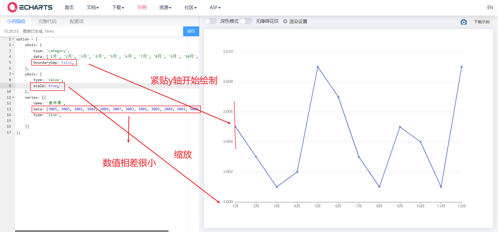


### 4.1.5、堆叠图

- 堆叠图
- stack

```html
<body>
    <!-- 1.准备一个具备大小的 DOM 容器 -->
    <div style="width: 600px;height: 400px"></div>

    <script>
        // 2.初始化echarts实例化对象
        var myChart = echarts.init(document.querySelector('div'));
        // 3.指定图表的配置项和数据
        var xDataArr = ['1月', '2月', '3月', '4月', '5月', '6月', '7月', '8月', '9月', '10月', '11月', '12月'];
        var yDataArr = [3000, 2800, 900, 1000, 800, 700, 1400, 1300, 900, 1000, 800, 600];
        var yDataArr2 = [2000,3800,1900,500,900,1700,2400,300,1900,1500,1800,200];

        
        var option = {
            xAxis: {
                type: 'category',
                data: xDataArr,
            },
            yAxis: {
                type: 'value',
            },
            
            series: [{
                data: yDataArr,
                type: 'line', 
                stack: 'all', 
                areaStyle: {},
            },
            {
                data: yDataArr2,
                type: 'line',
                stack: 'all', 
                areaStyle: {},
            }
           

        ]
        };

        // 4.使用刚指定的配置项和数据显示图表。
        myChart.setOption(option);
    </script>
</body>
```

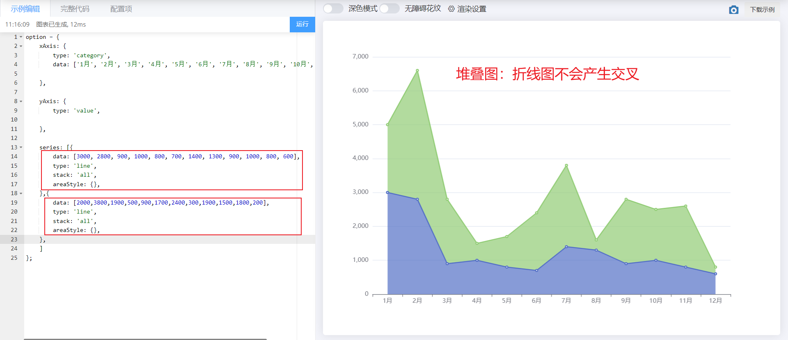


# 5、散点图

- X 轴数据和 Y轴数据：二维数组
- 在 series 下设置 `type:scatter` xAxis 和 yAxis 的 type都要设置为 value
- 调整：将坐标轴都设置为 脱离 0值比例，scale

```html
<body>
    <!-- 1.准备一个具备大小的 DOM 容器 -->
    <div style="width: 600px;height: 400px"></div>

    <script>
        // 2.初始化echarts实例化对象
        var myChart = echarts.init(document.querySelector('div'));
        // 3.指定图表的配置项和数据
        var axisData = [
            [10.0, 8.04],
            [8.07, 6.95],
            [13.0, 7.58],
            [9.05, 8.81],
            [11.0, 8.33],
            [14.0, 7.66],
            [13.4, 6.81],
            [10.0, 6.33],
            [14.0, 8.96],
            [12.5, 6.82],
            [9.15, 7.20],
            [11.5, 7.20],
            [3.03, 4.23],
            [12.2, 7.83],
            [2.02, 4.47],
            [1.05, 3.33],
            [4.05, 4.96],
            [6.03, 7.24],
            [12.0, 6.26],
            [12.0, 8.84],
            [7.08, 5.82],
            [5.02, 5.68]
        ];

        var option = {
            xAxis: {
                type: 'value',
                scale: true,
            },
            yAxis: {
                type: 'value',
                scale: true,
            },
            series: [{
                type: 'scatter',
                data: axisData,
            }]

        }

        // 4.使用刚指定的配置项和数据显示图表。
        myChart.setOption(option);
    </script>
</body>
```

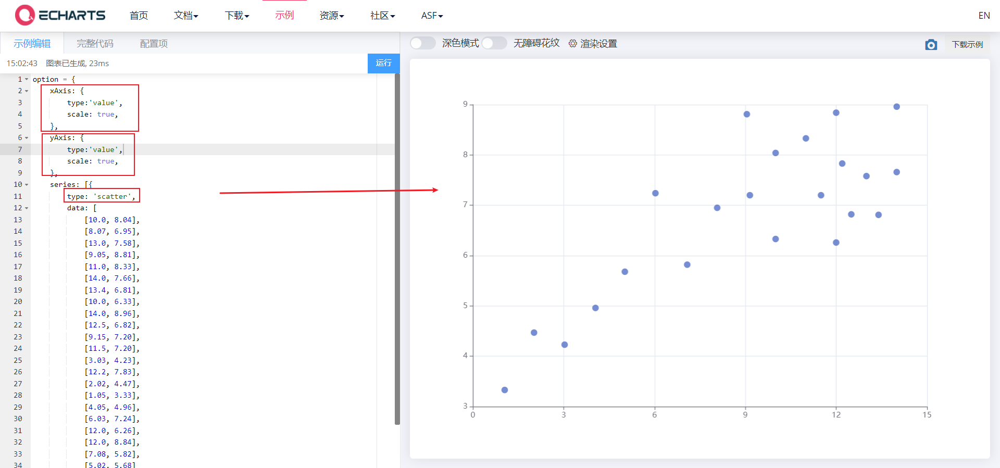


## 5.1、散点图常见效果

### 5.1.1、气泡图效果

- 散点的大小不同、散点的颜色不同
- symbolSize 、itemStyle.color


#### ①散点大小不同

```html
<body>
    <!-- 1.准备一个具备大小的 DOM 容器 -->
    <div style="width: 600px;height: 400px"></div>

    <script>
        // 2.初始化echarts实例化对象
        var myChart = echarts.init(document.querySelector('div'));
        // 3.指定图表的配置项和数据
        var axisData = [
            [161.2, 51.6],
            [167.5, 59.0],
            [159.5, 49.2],
            [157.0, 63.0],
            [155.8, 53.6],
            [170.0, 59.0],
            [159.1, 47.6],
            [166.0, 69.8],
            [176.2, 66.8],
            [160.2, 75.2],
            [172.5, 55.2],
            [170.9, 54.2],
            [172.9, 62.5],
            [153.4, 42.0],
            [160.0, 50.0],
            [147.2, 49.8],
            [168.2, 49.2],
            [175.0, 73.2],
            [157.0, 47.8],
            [167.6, 68.8],
            [159.5, 50.6]
        ];

        var option = {
            xAxis: {
                type: 'value',
                scale: true,
            },
            yAxis: {
                type: 'value',
                scale: true,
            },
            series: [{
                type: 'scatter',
                data: axisData,
                // symbolSize: 20
                symbolSize: function(arg) {
                    //console.log(arg);
                    var height = arg[0] / 100;
                    var weight = arg[1];
                    // bmi = 体重kg / (身高m * 身高)   bmi大于 28 代表肥胖
                    var bmi = weight / (height * height)
                    if (bmi > 28) {
                        return 20;
                    } else {
                        return 5;
                    }

                },
            }]

        }

        // 4.使用刚指定的配置项和数据显示图表。
        myChart.setOption(option);
    </script>
</body>
```

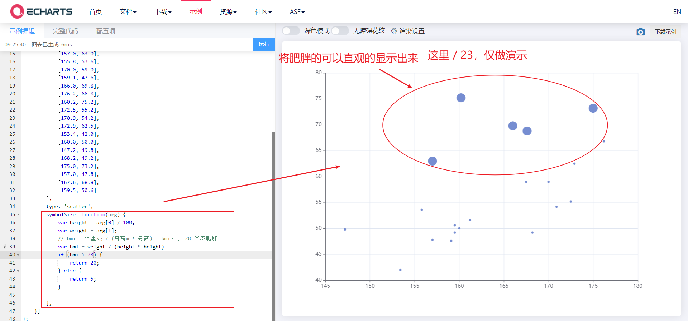

arg如下：

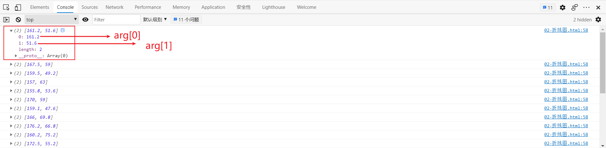


#### ②散点的颜色不同

```html
<body>
    <!-- 1.准备一个具备大小的 DOM 容器 -->
    <div style="width: 600px;height: 400px"></div>

    <script>
        // 2.初始化echarts实例化对象
        var myChart = echarts.init(document.querySelector('div'));
        // 3.指定图表的配置项和数据
        var axisData = [
            [161.2, 51.6],
            [167.5, 59.0],
            [159.5, 49.2],
            [157.0, 63.0],
            [155.8, 53.6],
            [170.0, 59.0],
            [159.1, 47.6],
            [166.0, 69.8],
            [176.2, 66.8],
            [160.2, 75.2],
            [172.5, 55.2],
            [170.9, 54.2],
            [172.9, 62.5],
            [153.4, 42.0],
            [160.0, 50.0],
            [147.2, 49.8],
            [168.2, 49.2],
            [175.0, 73.2],
            [157.0, 47.8],
            [167.6, 68.8],
            [159.5, 50.6]
        ];

        var option = {
            xAxis: {
                type: 'value',
                scale: true,
            },
            yAxis: {
                type: 'value',
                scale: true,
            },
            series: [{
                type: 'scatter',
                data: axisData,
                // 散点大小
                // symbolSize: 20
                symbolSize: function(arg) {
                    var height = arg[0] / 100;
                    var weight = arg[1];
                    // bmi = 体重kg / (身高m * 身高)   bmi大于 28 代表肥胖
                    var bmi = weight / (height * height)
                    if (bmi > 28) {
                        return 20;
                    } else {
                        return 5;
                    }
                },
                // 散点颜色
                itemStyle: {
                    color: function(arg) {
                        var height = arg.data[0] / 100;
                        var weight = arg.data[1];
                        // bmi = 体重kg / (身高m * 身高)   bmi大于 28 代表肥胖
                        var bmi = weight / (height * height)
                        if (bmi > 23) {
                            return 'red';
                        } else {
                            return 'green';
                        }
                    }
                }
            }]
        }

        // 4.使用刚指定的配置项和数据显示图表。
        myChart.setOption(option);
    </script>
</body>
```

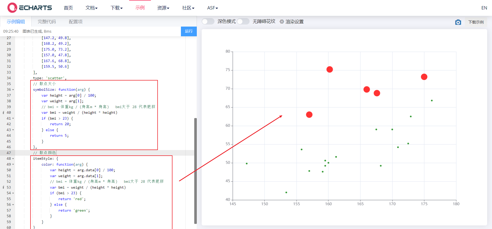


arg如下，是一个对象：

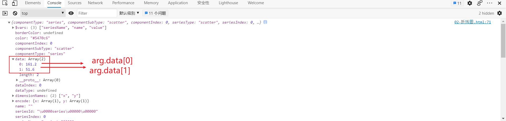


### 5.1.2、涟漪动画效果

- type ：effectScatter		开启涟漪动画效果
- showEffectOn：'emphasis'  控制鼠标移动到某一个散点时启动涟漪效果
- rippleEffect：{ }   控制涟漪动画范围

```html
<body>
    <!-- 1.准备一个具备大小的 DOM 容器 -->
    <div style="width: 600px;height: 400px"></div>

    <script>
        // 2.初始化echarts实例化对象
        var myChart = echarts.init(document.querySelector('div'));
        // 3.指定图表的配置项和数据
        var axisData = [
            [161.2, 51.6],
            [167.5, 59.0],
            [159.5, 49.2],
            [157.0, 63.0],
            [155.8, 53.6],
            [170.0, 59.0],
            [159.1, 47.6],
            [166.0, 69.8],
            [176.2, 66.8],
            [160.2, 75.2],
            [172.5, 55.2],
            [170.9, 54.2],
            [172.9, 62.5],
            [153.4, 42.0],
            [160.0, 50.0],
            [147.2, 49.8],
            [168.2, 49.2],
            [175.0, 73.2],
            [157.0, 47.8],
            [167.6, 68.8],
            [159.5, 50.6]
        ];

        var option = {
            xAxis: {
                type: 'value',
                scale: true,
            },
            yAxis: {
                type: 'value',
                scale: true,
            },
            series: [{
                //type: 'scatter',      // 散点
                type: 'effectScatter',  // 涟漪动画
                showEffectOn: 'emphasis',// render emphasis
                rippleEffect: {
                    scale: 5,
                },

                data: axisData,
                // symbolSize: 20
                symbolSize: function(arg) {

                    var height = arg[0] / 100;
                    var weight = arg[1];
                    // bmi = 体重kg / (身高m * 身高)   bmi大于 28 代表肥胖
                    var bmi = weight / (height * height)
                    if (bmi > 28) {
                        return 20;
                    } else {
                        return 5;
                    }
                },
                itemStyle: {
                    color: function(arg) {
                        var height = arg.data[0] / 100;
                        var weight = arg.data[1];
                        // bmi = 体重kg / (身高m * 身高)   bmi大于 28 代表肥胖
                        var bmi = weight / (height * height)
                        if (bmi > 23) {
                            return 'red';
                        } else {
                            return 'green';
                        }
                    }
                }
            }]
        }

        // 4.使用刚指定的配置项和数据显示图表。
        myChart.setOption(option);
    </script>
</body>
```

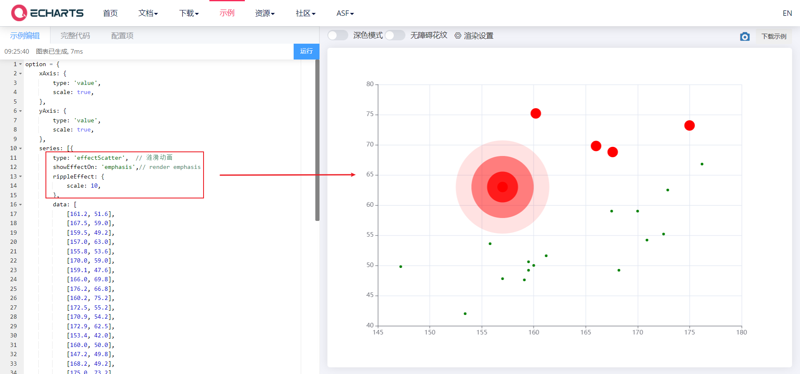


# 6、直角坐标系

- 直角坐标系图表：**柱状图、折线图、散点图**

## 6.1、直角坐标系的常用配置

常用配置有三种

- 网格 grid
- 坐标轴 axis
- 区域缩放 dataZoom

### 6.1.1、网格 grid

- grid 是用来控制直角坐标系的布局和大小，x 轴 和 y 轴就是在 grid 的基础上进行绘制的

- 显示 grid、

  show

- grid 的边框

  borderWidth、borderColor

- grid 的位置和大小

  left、top、right、bottom | width、height


```html
<body>
    <!-- 1.准备一个具备大小的 DOM 容器 -->
    <div style="width: 600px;height: 400px"></div>

    <script>
        // 2.初始化echarts实例化对象
        var myChart = echarts.init(document.querySelector('div'));
        // 3.指定图表的配置项和数据

        var xDataArr = ['张三', '李四', '王五', '闰土', '小明', '茅台', '蘑菇头', '王炸', ];
        var yDataArr = [88, 92, 63, 77, 94, 80, 72, 86];

        var option = {
         grid: {
            show: true,             // 网格显示
            borderWith: 10,         // 网格边框大小
            borderColor: 'red',     // 网格颜色
            left: 120,              // 网格向左移动
            top: 120,               // 网格向上移动
            width: 300,             // 网格宽
            height: 150,            // 网格高
       		},
            
            xAxis: {
                type: 'category',
                data: xDataArr,
            },
            yAxis: {
                type: 'value',

            },
            series: [{
                name: '语文',
                type: 'bar',
                data: yDataArr,
                markPoint: {
                    data: [{
                        type: 'max',
                        name: '最大值'
                    }, {
                        type: 'min',
                        name: '最小值'
                    }]
                },
                markLine: {
                    data: [{
                        type: 'average',
                        name: '平均值'
                    }]
                },
                // 数值显示
                label: {
                    show: true,
                    rotate: 60, //旋转60°
                    position: 'inside',
                },
                // 柱宽度
                barWidth: '30%',


            }],
        };

        // 4.使用刚指定的配置项和数据显示图表。
        myChart.setOption(option);
    </script>
</body>
```

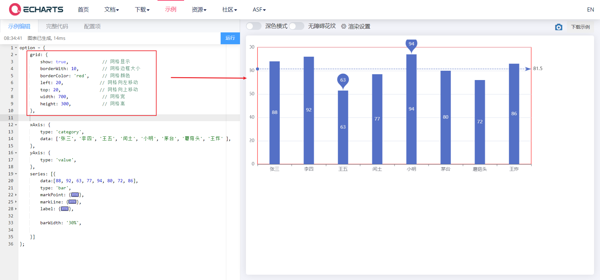


### 6.1.2、坐标轴 axis

坐标轴分为 x 轴和 y轴， 一个 grid 中最多有两种位置的 x 轴 和 y轴

- 坐标轴类型 type
  - value ： 数值轴，会自动从 series.data 中读取数据
  - category ：类目轴，该类型必须通过 data 设置类目数据
- 显示位置 position
  - xAxis ：可取值为 top 或者 bottom
  - yAxis ：可取值为 left 或者 right

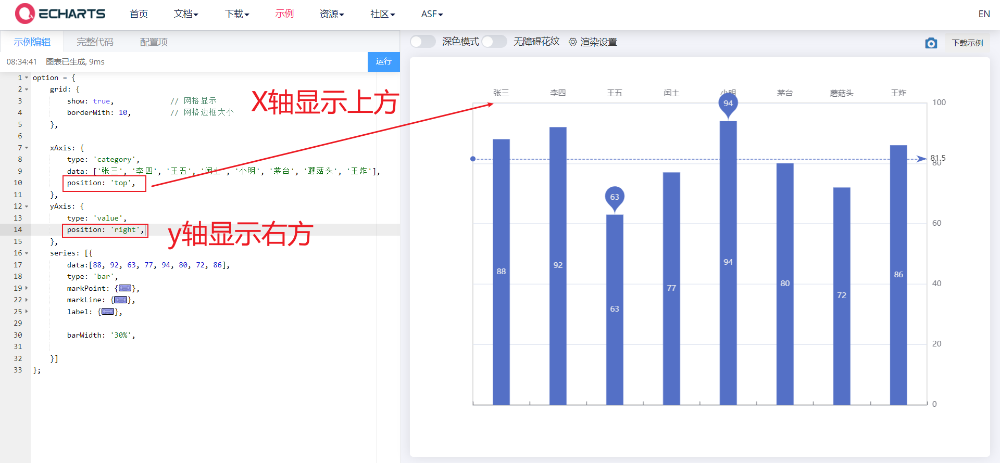


### 6.1.3、区域缩放dataZoom

dataZoom 用于区域缩放，对数据范围过滤，x 轴 和 y 轴都可以拥有

dataZoom 是一个数组，意味着可以配置多个区域缩放器

-  类型 type
  - slider ： 滑块
  - inside：内置，依靠鼠标滚轮或者双指缩放
- 指明产生作用的轴
  - xAxisIndex ：设置缩放组件控制的是哪个 x 轴，一般写 0 即可
  - yAxisIndex：设置缩放组件控制的是哪个 y 轴，一般写 0 即可
- 指明初始状态的缩放情况
  - start ：数据窗口范围的起始百分比
  - end ：数据窗口范围的结束百分比

```html
<body>
    <!-- 1.准备一个具备大小的 DOM 容器 -->
    <div style="width: 600px;height: 400px"></div>

    <script>
        // 2.初始化echarts实例化对象
        var myChart = echarts.init(document.querySelector('div'));
        // 3.指定图表的配置项和数据

        var xDataArr = ['张三', '李四', '王五', '闰土', '小明', '茅台', '蘑菇头', '王炸', ];
        var yDataArr = [88, 92, 63, 77, 94, 80, 72, 86];

        var option = {
            dataZoom: [
                {
                    // type: 'slider',  // 滑块缩放
                    type: 'inside',     // 鼠标滚轮缩放
                    xAxisIndex: 0,      // 作用于第 0 个 x轴
                },
                {
                    type: 'inside',
                    yAxisIndex: 0,      // 作用于第 0 个 y轴
                    start: 0,
                    end: 60,
                }
            ],
            toolbox: {
                feature: {
                    // 内置的区域缩放器,再自定义区域缩放器前需打开
                    dataZoom: {},
                }
            },
            grid: {
                show: true,             // 网格显示
                borderWith: 10,         // 网格边框大小
            },
            xAxis: {
                type: 'category',
                data: xDataArr,
                position: 'top',
            },
            yAxis: {
                type: 'value',
                position: 'right',
            },
            series: [{
                name: '语文',
                type: 'bar',
                data: yDataArr,
                markPoint: {
                    data: [{
                        type: 'max',
                        name: '最大值'
                    }, {
                        type: 'min',
                        name: '最小值'
                    }]
                },
                markLine: {
                    data: [{
                        type: 'average',
                        name: '平均值'
                    }]
                },
                // 数值显示
                label: {
                    show: true,
                    rotate: 60, //旋转60°
                    position: 'inside',
                },
                // 柱宽度
                barWidth: '30%',


            }],
        };

        // 4.使用刚指定的配置项和数据显示图表。
        myChart.setOption(option);
    </script>
</body>
```

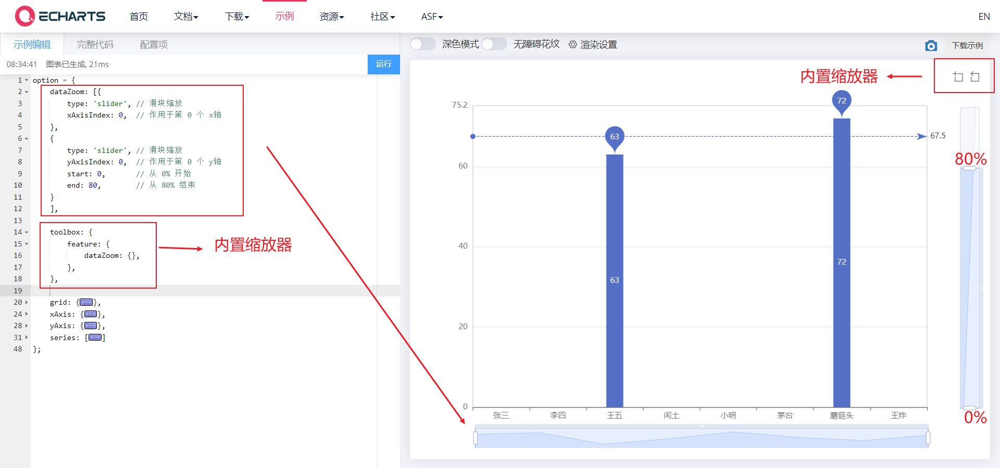


