# 1、Node安装


1. 官网：https://nodejs.org/en/

- > 若要下载历史版本： https://nodejs.org/dist/

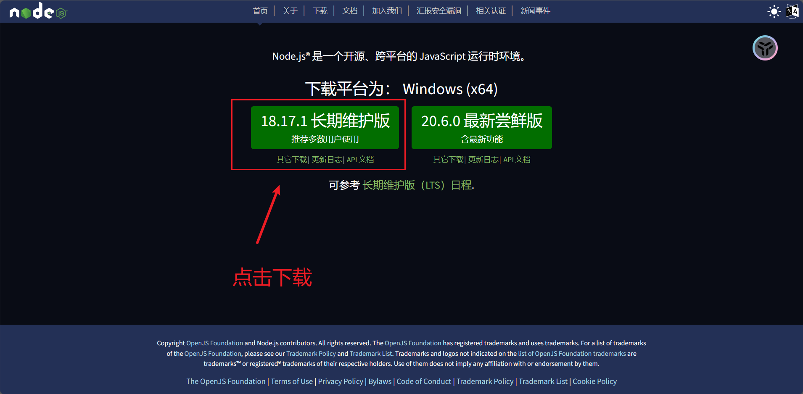


2. 下载完成后安装，一直 `next`，注意下方不要勾选

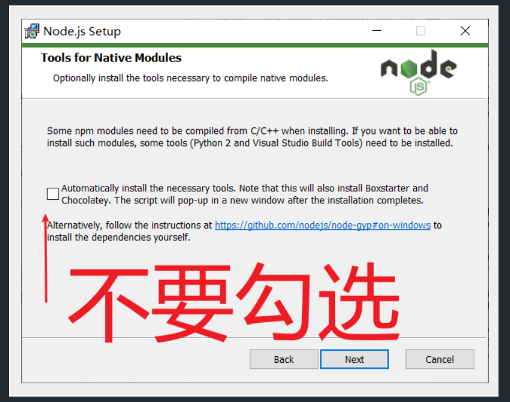


3. 在命令行窗口输入 `node -v`，出现下图表示安装成功

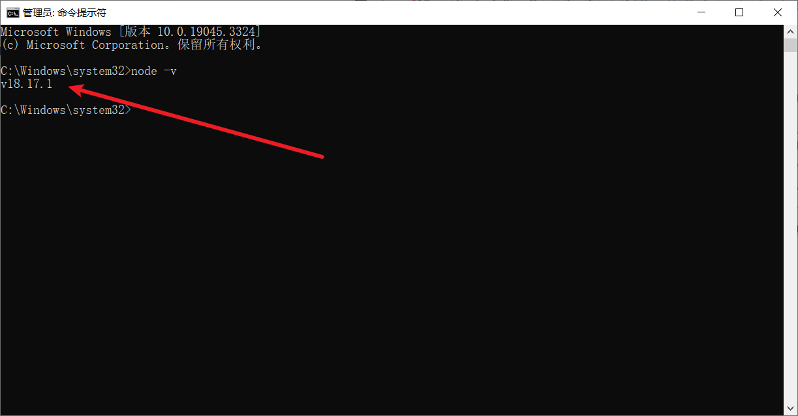


4. 在 WebStrom 中配置 Node

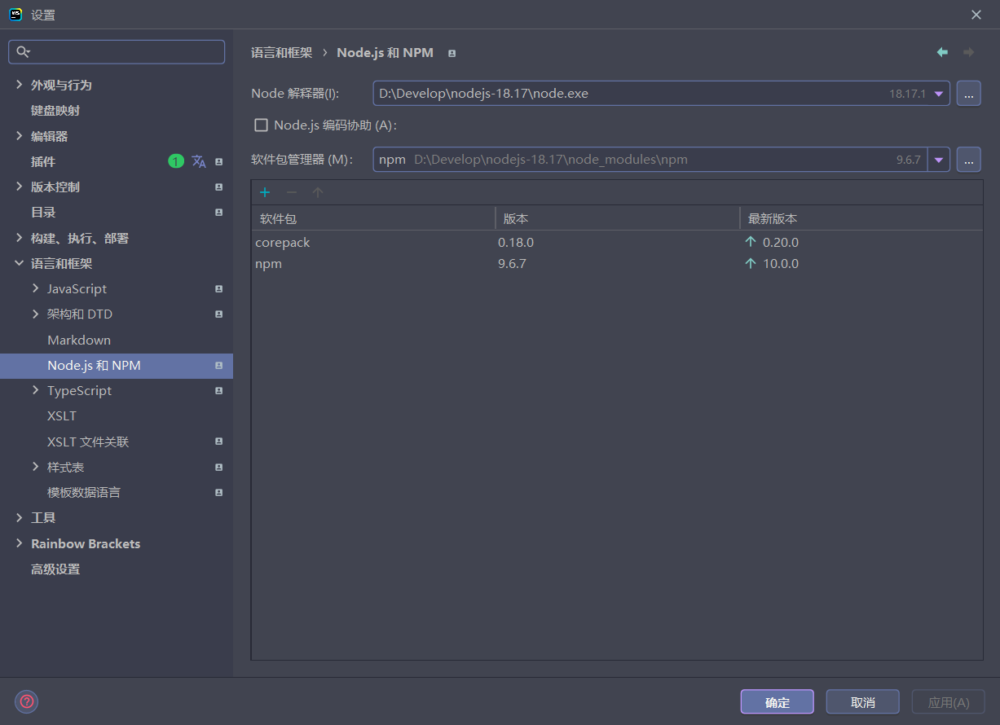


5. 更换淘宝镜像源：[NPM镜像_NPM下载地址_NPM安装教程-阿里巴巴开源镜像站 (aliyun.com)](https://developer.aliyun.com/mirror/NPM?spm=a2c6h.13651102.0.0.c1e11b112S7yRI)

```bash
npm config set registry http://registry.npmmirror.com
```

使用如下命令检验是否成功：

```bash
npm config get registry
```

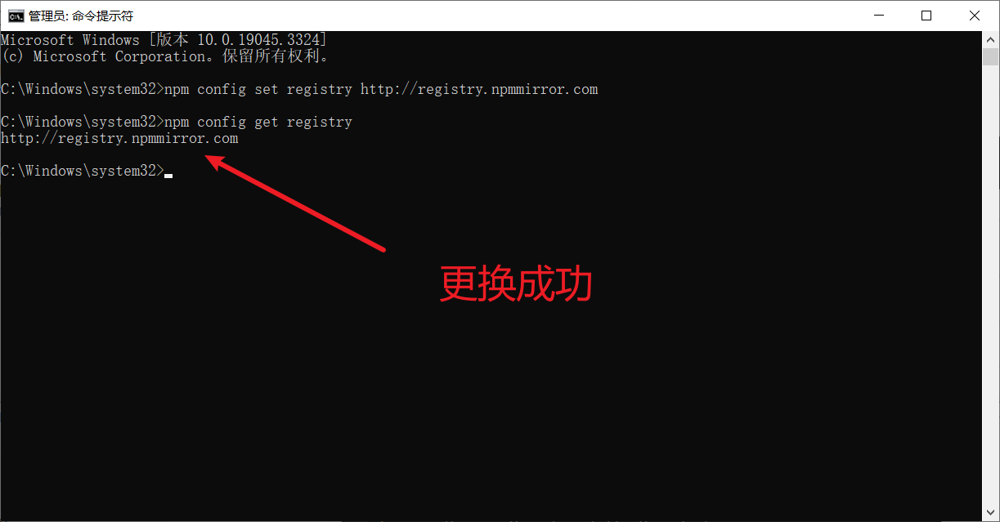


# 2、Buffer

## 2.1、概念

Buffer 是一个类似于数组的`对象`，用于表示固定长度的字节序列，Buffer 本质是一段内存空间，专门用来处理 `二进制数据`


## 2.2、特点

1. Buffer 大小固定且无法调整
2. Buffer 性能较好，可以直接对计算机内存进行操作
3. 每个元素的大小为 1 字节（byte）


## 2.3、使用

### 2.3.1、创建Buffer


Node.js 中创建 Buffer 的方式主要如下几种：

1. `Buffer.alloc` ： alloc 的意思是分配

```javascript
//创建了一个长度为 10 字节的 Buffer，相当于申请了 10 字节的内存空间，每个字节的值为 0
let buffer1 = Buffer.alloc(10);
// <Buffer 00 00 00 00 00 00 00 00 00 00>
console.log(buffer1);
```

2. `Buffer.allocUnsafe`

```javascript
//创建了一个长度为 10 字节的 Buffer，buffer 中可能存在旧的数据, 可能会影响执行结果，所以叫unsafe
let buffer2 = Buffer.allocUnsafe(10);
```

3. `Buffer.from`

```javascript
// 通过字符串创建 Buffer
let buffer3 = Buffer.from('hello');
// <Buffer 68 65 6c 6c 6f>  是 hello 每个字符在 unicode 中对应的数字所对应的二进制
console.log(buffer3);

// 通过数组创建 Buffer(数组里面的每个数字都可以转为二进制存入Buffer中)
let buffer4 = Buffer.from([105, 108, 111, 118, 101, 121, 111, 117]);
console.log(buffer4);
```

### 2.3.2、Buffer与字符串的转化

我们可以借助 `toString` 方法将 Buffer 转为字符串

```javascript
// Buffer 与字符串的转化
let buffer1 = Buffer.from([105, 108, 111, 118, 101, 121, 111, 117]);
// iloveyou
console.log(buffer1.toString())
```

> toString 默认是按照 utf-8 编码方式进行转换的。

### 2.3.3、Buffer的读写

Buffer 可以直接通过 `[ ]` 的方式对数据进行处理。

```javascript
// Buffer 与字符串的转化
let buffer1 = Buffer.from([105, 108, 111, 118, 101, 121, 111, 117]);
// iloveyou
console.log(buffer1.toString())


// 读取
// 108
console.log(buffer1[1]);

// 修改
buffer1[1] = 97;
```


# 3、fs模块

fs 全称为 `file system` ，称之为`文件系统`，是 Node.js 中的**内置模块**，可以对计算机中的磁盘进行操作。

## 3.1、文件写入

文件写入就是将**数据**保存到**文件**中，我们可以使用如下几个方法来实现该效果

| 方法                      | 说明     |
| ------------------------- | -------- |
| writeFile                 | 异步写入 |
| writeFileSync             | 同步写入 |
| appendFile/appendFileSync | 追加写入 |
| createWriteStream         | 流式写入 |

### 3.1.1、writeFile 异步写入

- 语法：`fs.writeFile(file,data[,options],callback)`

- 参数说明：
  - file 文件名
  - data 待写入的数据
  - options 选项设置 **(可选)**
  - callback 写入回调
- 返回值： `undefined`

```javascript
// require 是 Node.js 环境中的'全局'变量，用来导入模块
const fs = require('fs');

// 文件如果不存在,会自动帮我们创建文件
fs.writeFile('./1.txt','秦晓林真帅',err => {
    //如果写入失败,则回调函数调用时,会传入错误对象,如写入成功, err 就是 null
    if(err){
        // 如果 err 是一个错误对象
        console.log('写入失败');
    }else{
        console.log('写入成功');
    }

})
```


### 3.1.2、writeFileSync 同步写入

- 语法： `fs.writeFileSync(file,data[,options])`
- 参数说明：没有 callback 参数
  - file 文件名
  - data 待写入的数据
  - options 选项设置 **(可选)**


```javascript
// require 是 Node.js 环境中的'全局'变量，用来导入模块
const fs = require('fs');

// 文件如果不存在,会自动帮我们创建文件
fs.writeFileSync('./1.txt','秦晓林你真帅')
```

> Node.js 中的此然操作是由其他线程完成的，结果的处理有两种模式
>
> - 同步处理 JS 主线程 ==会等待== 其他线程的执行结果，然后再继续执行主线程的代码，==效率较低==
> - 异步处理  JS 主线程 ==不会等待== 其他线程的执行结果，然后再继续执行主线程的代码，==效率较高==


### 3.1.3、appendFile/appendFileSync

appendFile 作用是在文件尾部追加内容，appendFile 语法与 writeFile 语法完全相同

- 语法：
  -  `fs.appendFile(file,data[,options],callback)`
  - `fs.appendFileSync(file, data[, options])`

- 返回值： 二者都为 undefined

```javascript
const fs = require('fs');

// 文件如果不存在,会自动帮我们创建文件
fs.appendFile('1.txt','帅帅帅帅帅',err => {
    //如果追加失败,则回调函数调用时,会传入错误对象,如追加成功, err 就是 null
    if(err){
        // 如果 err 是一个错误对象
        console.log('追加失败');
    }else{
        console.log('追加成功')
    }
})
```


### 3.1.4、createWriteStream 流式写入

- 语法：`fs.createWriteStream(path[, options])`

- 参数说明：
  - path 文件路径
  - options 选项配置**（ 可选）**

- 返回值： `Object`


```javascript
// 1.导入fs
const fs = require('fs');

// 2.创建写入流对象
let ws = fs.createWriteStream('11.txt');

// 3.write 写入数据
ws.write('hello world1 \r\n');
ws.write('hello world2 \r\n');

// 4.关闭流
ws.end;
```

> - 程序打开一个文件是需要消耗资源的，流式写入可以减少打开关闭文件的次数。
> - 流式写入方式适用于==大文件写入或者频繁写入==的场景, writeFile 适合于==写入频率较低==的场景


## 3.2、文件读取

文件读取：从文件中取出数据，方式有如下几种：

| 方法             | 说明     |
| ---------------- | -------- |
| readFile         | 异步读取 |
| readFileSync     | 同步读取 |
| createReadStream | 流式读取 |

### 3.2.1、readFile 异步读取

- 语法：`fs.readFile(path[, options], callback)`

- 参数说明：
  - path 文件路径
  - options 选项配置
  - callback 回调函数
- 返回值：`undefined`


```javascript
// 1.导入fs
const fs = require('fs');

// 2.异步读取
fs.readFile('1.txt',(err,data) => {
    if(err){
        console.log('err 是一个错误对象,读取失败');
    }else{
        console.log('读取成功');
        // 打印读取到的文件内容
        console.log(data);
        // 读取到的内容是一个 Buffer, 我们可以转成字符串
        console.log(data.toString());
    }
})
```


### 3.2.2、readFileSync 同步读取

- 语法：`fs.readFileSync(path[, options])`
- 参数说明：
  - path 文件路径
  - options 选项配置
- 返回值： `string | Buffer`

```javascript
// 同步读取
let data1 = fs.readFileSync('1.txt');
let data2 = fs.readFileSync('1.txt','utf-8');
console.log(data1)
```


### 3.2.3、createReadStream 流式读取

流式读取是每次读文件的一块，读完一块再读一块。上面的 readFile 是一次性把文件读取到内存当中。

- 语法：`fs.createReadStream(path[, options])`

- 参数说明：
  - path 文件路径
  - options 选项配置 (**可选**)

- 返回值： `Object`

```javascript
// 1.导入fs
const fs = require('fs');

// 2.创建读取流对象
const rs = fs.createReadStream('1.txt');

// 3.每次取出 64kb 数据后执行一次 data 回调
rs.on('data', data => {
    // 读取到的 data 是 Buffer 对象
    console.log(data.toString());
    console.log(data.length);
})

// 4.读取完毕后,执行end回调
rs.on('end',() => {
    console.log('读取完成');
})
```


## 3.3、文件移动与重命名

在 Node.js 中，我们可以使用 `rename` 或 `renameSync` 来移动或重命名文件或文件夹

- 语法：
  - `fs.rename(oldPath, newPath, callback)`
  - `fs.renameSync(oldPath, newPath)`

- 参数说明：
  - oldPath 文件当前的路径
  - newPath 文件新的路径
  - callback 操作后的回调

```javascript
// 1.导入fs
const fs = require('fs');

// 2.将 1.txt 改为 11.txt
fs.rename = ('1.txt', '11.txt', err => {
    if(err){
        console.log('重命名失败');
    }else{
        console.log('重命名成功')
    }
})


// 将 1.txt 改为 移动到 txt.1.txt
fs.rename = ('1.txt', '../txt/1.txt', err => {
    if(err){
        console.log('移动失败');
    }else{
        console.log('移动成功')
    }
})
```


## 3.4、文件删除

在 Node.js 中，我们可以使用 `unlink` 或 `unlinkSync` 来删除文件

- 语法：
  - `fs.unlink(path, callback)`
  - `fs.unlinkSync(path)`

- 参数说明：
  - path 文件路径
  - callback 操作后的回调

```javascript
// 1.导入fs
const fs = require('fs');

fs.unlink('1.txt',err => {
    if(err){
        console.log('删除失败');
    }else{
        console.log('删除成功');
    }
})

fs.unlinkSync('1.txt');
```


## 3.5、文件夹操作

借助 Node.js 的能力，我们可以对文件夹进行**创建 、读取、 删除**等操作

| 方法                | 说明       |
| ------------------- | ---------- |
| mkdir/mkdirSync     | 创建文件夹 |
| readdir/readdirSync | 读取文件夹 |
| rmdir/rmdirSync     | 删除文件夹 |

### 3.5.1、创建文件夹

在 Node.js 中，我们可以使用 `mkdir` 或 `mkdirSync` 来创建文件夹

- 语法：
  - `fs.mkdir(path[, options], callback)`
  - `fs.mkdirSync(path[, options])`

- 参数说明
  - path 文件夹路径
  - options 选项配置 (**可选**)
  - callback 操作后的回调

```javascript

// 1.导入fs
const fs = require('fs');

// 创建html文件夹
fs.mkdir('html',err => {
    if(err){
        console.log('新建失败');
    }else{
        console.log('新建成功');
    }
})

// 递归创建 a/b/c 文件夹,需要加配置: recursive - 递归
fs.mkdir('a/b/c',{recursive: true},err => {
    if(err){
        console.log('新建失败');
    }else{
        console.log('新建成功');
    }
})
```


### 3.5.2、readdir 读取文件夹

在 Node.js 中，我们可以使用 `readdir` 或 `readdirSync` 来读取文件夹

- 语法：
  - `fs.readdir(path[, options], callback)`
  - `fs.readdirSync(path[, options])`

- 参数说明：
  - path 文件夹路径
  - options 选项配置 (**可选**)
  - callback 操作后的回调


```javascript
// 1.导入fs
const fs = require('fs');

// 异步读取文件夹txt
fs.readdir('/txt',(err,data) => {
    if(err){
        console.log('读取失败');
    }else{
        console.log('读取成功');
    }
})

// 同步读取
let data = fs.readdirSync('/txt');
console.log(data);
```


### 3.5.3、rmdir 删除文件夹

在 Node.js 中，我们可以使用 `rmdir` 或 `rmdirSync` 来删除文件夹

- 语法：
  - `fs.rmdir(path[, options], callback)`
  - `fs.rmdirSync(path[, options])`

- 参数说明：
  - path 文件夹路径
  - options 选项配置 (**可选**)
  - callback 操作后的回调

```javascript
// 删除文件夹
fs.rmdir('/txt',(err,data) => {
    if(err){
        console.log('删除失败');
    }else{
        console.log('删除成功');
    }
})

// 递归删除文件夹
fs.rmdir('/a/b/c',{recursive: true},(err,data) => {
    if(err){
        console.log('递归删除失败');
    }else{
        console.log('递归删除成功');
    }
})
```


## 3.6、查看资源状态

在 Node.js 中，我们可以使用 `stat` 或 `statSync` 来查看资源的详细信息

- 语法：
  - `fs.stat(path[, options], callback)`
  - `fs.statSync(path[, options])`

- 参数说明：
  - path 文件夹路径
  - options 选项配置 (**可选**)
  - callback 操作后的回调

```javascript
// 1.导入fs
const fs = require('fs');

fs.stat('1.txt', (err,data) => {
    if(err){
        console.log('操作失败');
    }else{
        console.log('操作成功');
        console.log(data);
    }
})
```

结果值对象结构：

```json
Stats {
  dev: 177919585,
  mode: 33206,
  nlink: 1,
  uid: 0,
  gid: 0,
  rdev: 0,
  blksize: 4096,
  ino: 6473924464353945,
  size: 48,
  blocks: 0,
  atimeMs: 1694011150653.459,
  mtimeMs: 1694009369275.4377,
  ctimeMs: 1694009369275.4377,
  birthtimeMs: 1693991825175.2554,
  atime: 2023-09-06T14:39:10.653Z,
  mtime: 2023-09-06T14:09:29.275Z,
  ctime: 2023-09-06T14:09:29.275Z,
  birthtime: 2023-09-06T09:17:05.175Z
}
```


## 3.7、相对路径问题

相对路径：

- `./座右铭.txt` 当前目录下的座右铭.txt

- `座右铭.txt` 等效于上面的写法
- `../座右铭.txt` 当前目录的上一级目录中的座右铭.txt

绝对路径：

- `D:/Program Files` windows 系统下的绝对路径
- `/usr/bin` Linux 系统下的绝对路径


## 3.8、`____dirname`

- `__dirname` 与 `require` 类似，都是 Node.js 环境中的 '全局' 变量
- `__dirname` 保存着 `当前文件所在目录的绝对路径` ，可以使用 `__dirname` 与文件名拼接成绝对路径

```javascript
// E:\Code\WebStorm\KuangStudy_Nodejs\03_fs
console.log(__dirname);
let data = fs.readFileSync(__dirname + '/data.txt');
console.log(data);
```

> 使用 fs 模块的时候，尽量使用 `__dirname` 将路径转化为绝对路径


# 4、path模块

path 模块提供了==操作路径==的功能，我们将介绍如下几个较为常用的几个 API：

| API           | 说明                        |
| ------------- | --------------------------- |
| path.resolve  | 拼接规范的绝对路径 **常用** |
| path.sep      | 获取操作系统的路径分隔符    |
| path.parse    | 解析路径并返回对象          |
| path.basename | 获取路径的基础名称          |
| path.dirname  | 获取路径的目录名            |
| path.extname  | 获得路径的扩展名            |


```javascript
//导入fs
const fs = require('fs');
const path = require('path');

// 两种写法
console.log(path.resolve(__dirname, './index.html'));
// E:\Code\WebStorm\KuangStudy_Nodejs\04_path\index.html
console.log(path.resolve(__dirname, 'index.html')); 
// E:\Code\WebStorm\KuangStudy_Nodejs\04_path\index.html
```


# 5、HTTP协议


超文本传输协议，是一种基于TCP/IP的应用层通信协议，这个协议详细规定了**浏览器**和万维网**服务器**之间互相通信的规则。协议中主要规定了两个方面的内容

- 客户端：用来向服务器发送数据，可以被称之为**请求报文**
- 服务端：向客户端返回数据，可以被称之为**响应报文**


## 5.1、fiddler 汉化和中文版

> 贴上链接：[fiddler汉化和中文版（小伙伴点赞和分享） - 知乎 (zhihu.com)](https://zhuanlan.zhihu.com/p/465463269)

### 5.1.1、fiddler 配置

fiddler 默认只能抓 HTTP 协议包，我们要进行配置使得其能抓 HTTPS 协议包

1. 点击 Tools - Options ： 工具 - 选项


2. HTTPS - 打勾

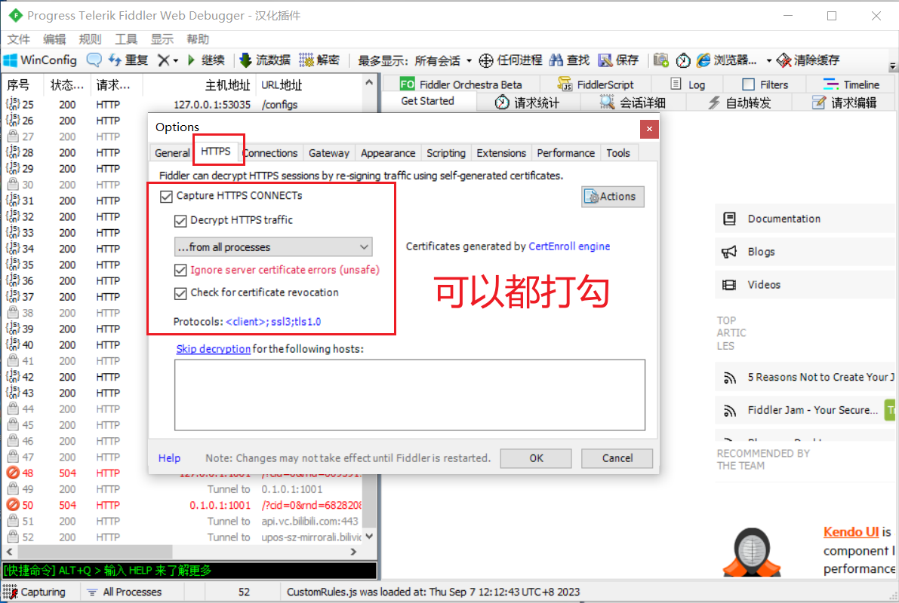


3. 重启 fiddler

4. 将 All process 更改为 Web Browsers


5. 我们在浏览器访问百度

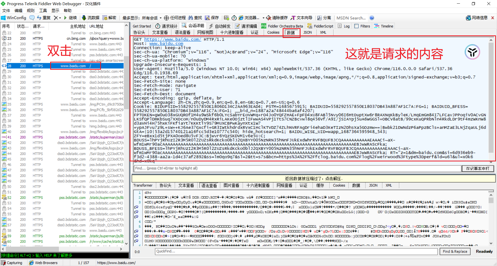


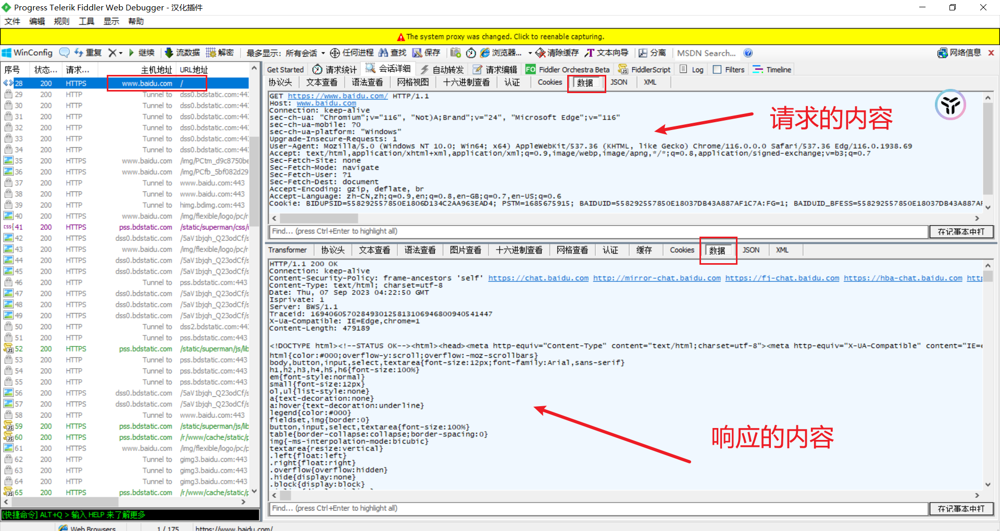


## 5.2、请求报文的组成

请求报文包括：

- 请求行
- 请求头
- 请求体

### 5.2.1、请求行

请求行包括：请求方法、URL、版本号


- 请求方法

| 方法   | 作用             |
| ------ | ---------------- |
| GET    | 主要用于获取数据 |
| POST   | 主要用于新增数据 |
| PUT    | 主要用于更新数据 |
| DELETE | 主要用于删除数据 |

- URL ：`http://www.baidu.com:80/index.html?a=100&b=200#logo`
  - http 协议(https、ftp、ssh等)
  - www.baidu.com 域名
  - 80 端口
  - /index.html 路径
  - a=100&b=200 查询字符串
  - #logo 哈希(锚点链接)


### 5.2.2、请求头

请求头的格式： ==头名：头值==

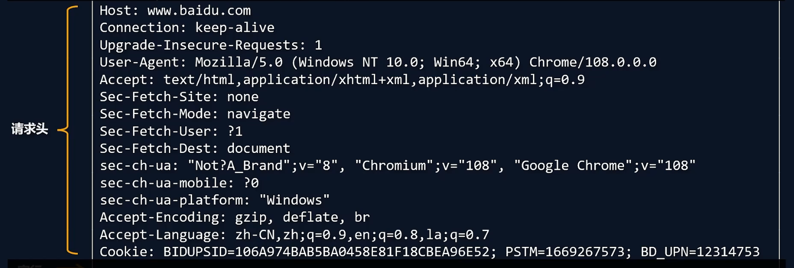

常见的请求头有：

| 请求头          | 解释                                                         |
| --------------- | ------------------------------------------------------------ |
| Host            | 主机名                                                       |
| Connection      | 连接的设置<br> 1. keep-alive：保持连接<br> 2. close ： 关闭连接 |
| Cache-Control   | 缓存控制<br>max-age = 0：没有缓存                            |
| User-Agent      | 用户代理，**客户端字符串标识**<br>服务器可以通过这个标识来识别这个请求来自哪个客户端 ，一般在PC端和手机端的区分 |
| Accept          | 设置浏览器接收的数据类型                                     |
| Accept-Encoding | 设置接收的亚索方式                                           |
| Accept-Language | 设置接收的语言<br>q=0.7 为喜好系数，满分为1                  |
| Cookie          |                                                              |


### 5.2.3、请求体

请求体内容的格式是非常灵活的：

- 可以是空 ： GET请求
- 也可以是字符串、还可以是 JSON

例如：

- 字符串： name=林晓&price=400000
- JSON：{"name":"林晓", "price": 2000}


## 5.3、响应报文的组成

响应报文包括：

- 响应行
- 响应头
- 响应体

### 5.3.1、响应行

```bash
HTTP/1.1 200 OK
```

- HTTP/1.1 : HTTP协议版本号
- 200：响应状态码
- OK：响应码描述

> 彩蛋：[HTTP 响应状态码 - HTTP | MDN (mozilla.org)](https://developer.mozilla.org/zh-CN/docs/Web/HTTP/Status)

### 5.3.2、响应头

```bash
# 缓存控制 private 私有的，只允许客户端缓存数据
Cache-Control:private

# 连接设置
Connection: keep-alive

# 设置响应体的数据类型以及字符集,响应体为html，字符集
Content-Type:text/html;charset=utf-8 
# 响应体的长度，单位为字节
Content-Length:
```


### 5.3.3、响应体

响应体内容的类型是非常灵活的，常见的类型有 HTML、CSS、JS、图片、JSON

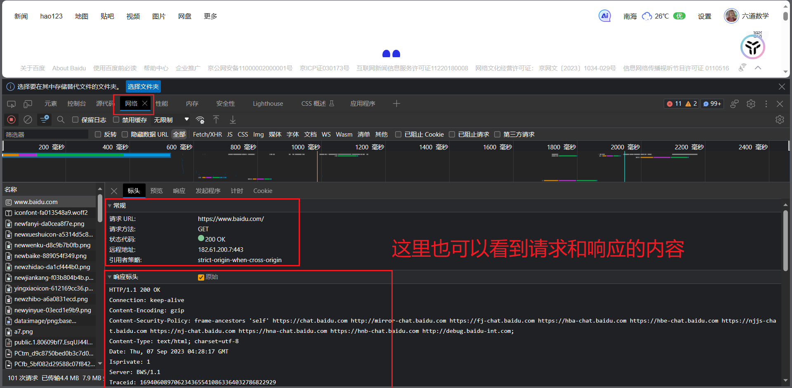


## 5.4、创建HTTP服务

使用 nodejs 创建 HTTP 服务：

```javascript
//1. 导入 http 模块
const http = require('http');


//2. 创建服务对象 create 创建 server 服务
// request 意为请求. 是对请求报文的封装对象, 浏览器将请求报文放入 request,通过 request 对象可以获得请求报文的数据
// response 意为响应. 是对响应报文的封装对象, 服务端为浏览器返回响应报文,通过 response 对象可以设置响应报文,
const server = http.createServer((request,response) => {
    // 设置响应体并结束响应
    response.end("Hello Http Server");
});

// 3. 监听端口, 启动服务
// 监听端口9000,第二个参数只有服务启动成功之后才会执行
server.listen(9000,() => {
    console.log("服务已经启动, 端口 9000 监听中");
})
```

> http.createServer 里的回调函数的执行时机： **当接收到 HTTP 请求的时候，就会执行**

例如我们启动上述 http 服务，然后在浏览器请求：`http://127.0.0.1:9000`

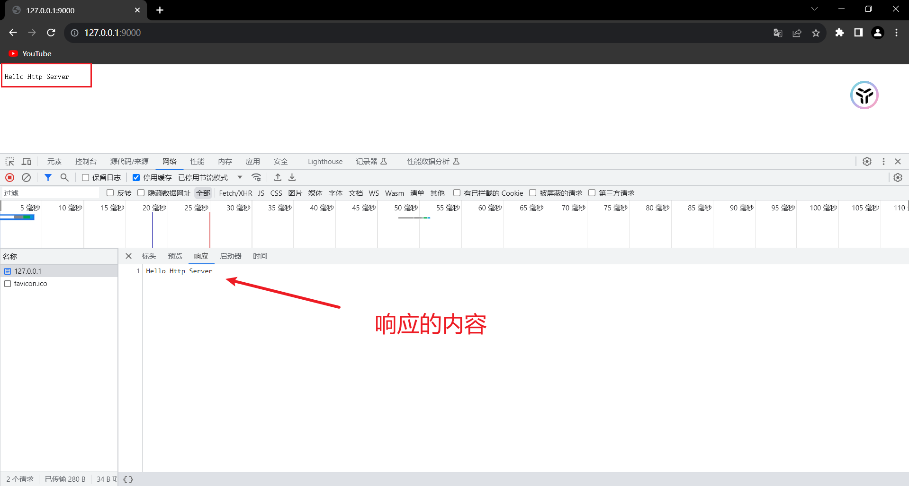


### 5.4.1、注意事项

1. 命令行 `ctrl + c` 停止服务

2. 当服务启动后，更新代码**必须重启服务才能生效**

3. 响应内容中文乱码的解决办法

   ```javascript
   const server = http.createServer((request,response) => {
       // 设置响应体并结束响应
       response.end("您好");
       // 解决乱码
       response.setHeader('content-type','text/html;charset=utf-8');
   });
   ```

4. 端口被占用：

   ```bash
   Error: listen EADDRINUSE: address already in use :::9000
   ```

   - 关闭当前正在运行监听端口的服务 （ **使用较多**）
   - 如果端口被其他程序占用，可以使用**资源监视器**找到占用端口的程序，然后使用**任务管理器**关闭对应的程序


记住上方的PID 16412，然后打开任务管理器根据 PID 找到并右键结束任务。

> HTTP 协议默认端口是 80 。HTTPS 协议的默认端口是 443, HTTP 服务开发常用端口有 3000，8080，8090，9000 等

### 5.4.2、浏览器查看HTTP报文

- 查看请求行与请求头

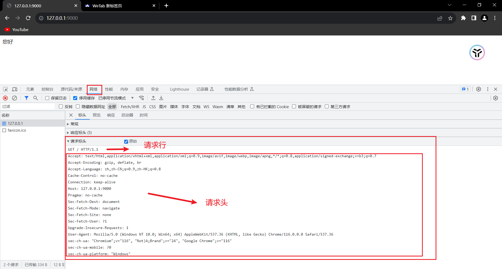


- 查看请求体

因为GET请求的请求体大多为空，所以这里模拟 POST 请求

```html
<!DOCTYPE html>
<html lang="en">
<head>
    <meta charset="UTF-8">
    <title>Title</title>
</head>
<body>
    <!-- 发送给9000端口 -->
    <form action="http://127.0.0.1:9000" method="post">
        <input type="text" name="username">
        <input type="text" name="password">
        <input type="submit" value="提交">
    </form>
</body>
</html>
```

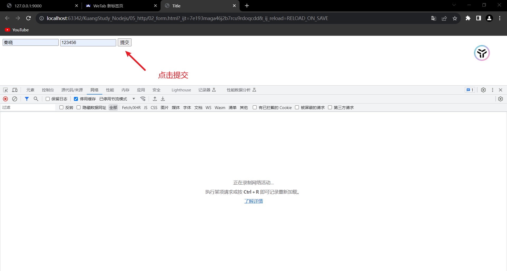


- 查看URL查询字符串

同时若我们访问 `http://127.0.0.1:9000/search?keyword=5&num=1`，也是可以查询到URL字符串的。

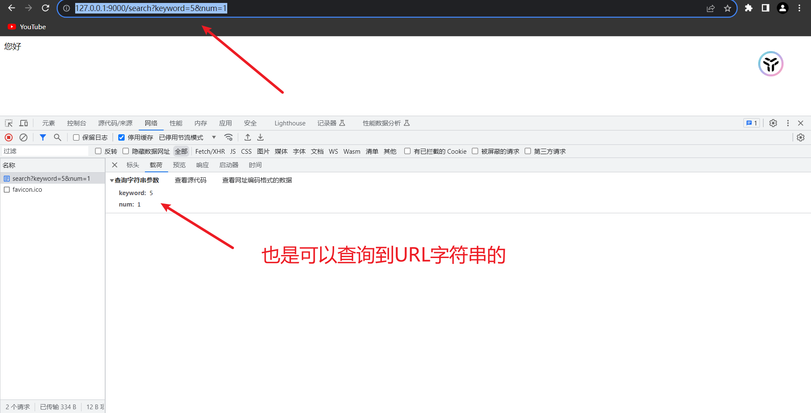


- 查看响应行和响应头

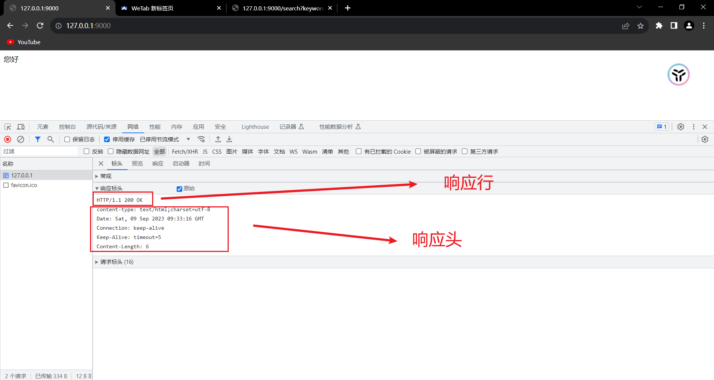


- 查看响应体

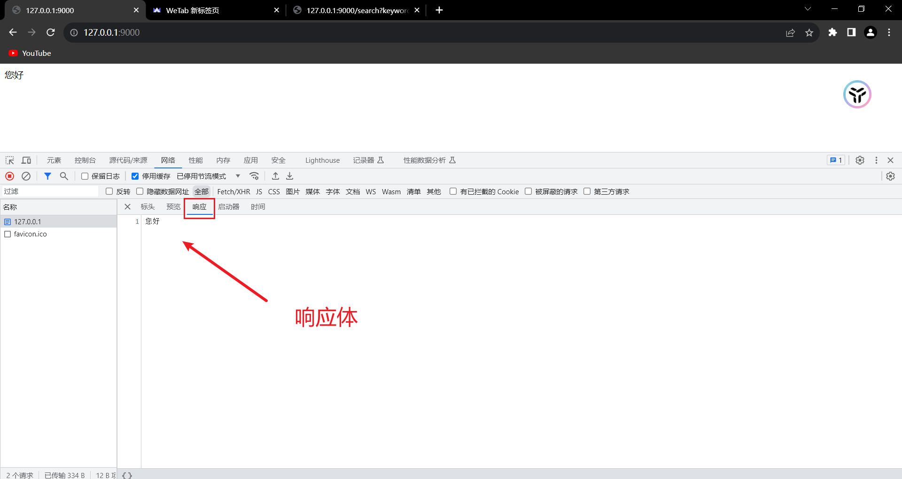


## 5.5、获取HTTP请求报文

想要获取请求的数据，需要通过 `request` 对象

| 含义          | 语法                                                         | 重点掌握 |
| ------------- | ------------------------------------------------------------ | -------- |
| 请求方法      | request.method                                               | *        |
| 请求版本      | request.httpVersion                                          |          |
| 请求路径      | request.url                                                  | *        |
| URL路径       | require('url').parse(request.url).pathname                   | *        |
| URL查询字符串 | require('url').parse(request.url, true).query                | *        |
| 请求头        | request.headers                                              | *        |
| 请求体        | request.on('data', function(data){})<br/>request.on('end', function(){}); |          |


```javascript
//1. 导入 http 模块
const http = require('http');


//2. 创建服务对象 create 创建 server 服务
const server = http.createServer((request,response) => {
    // 解决乱码
    response.setHeader('content-type','text/html;charset=utf-8');

    // 获取请求的方法
    console.log(request.method);
    // 获取请求的url:只包含 url 中的路径与查询字符串
    console.log(request.url);
    // 获取 HTTP 协议的版本号
    console.log(request.httpVersion);
    // 获取 HTTP 的请求头
    console.log(request.headers);


    // 设置响应体并结束响应
    response.end("您好");

});

// 3. 监听端口, 启动服务
// 监听端口9000,第二个参数只有服务启动成功之后才会执行
server.listen(9000,() => {
    console.log("服务已经启动, 端口 9000 监听中");
})
```

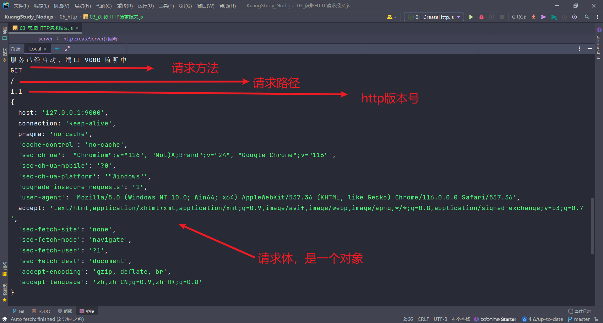


注意事项：

- `request.url` 只能获取路径以及查询字符串，无法获取 URL 中的域名以及协议的内容
- `request.headers` 将请求信息转化成一个对象，并将属性名都转化成了『小写』
- 关于路径：如果访问网站的时候，只填写了 IP 地址或者是域名信息，此时请求的路径为`/` 
- 关于 favicon.ico：这个请求是属于浏览器自动发送的请求

**我们现在探究一下请求体的内容如何解析出来：**

1. 方法一：不常用，了解

```javascript
//1. 导入 http 模块
const http = require('http');


//2. 创建服务对象 create 创建 server 服务
const server = http.createServer((request,response) => {

    // 声明一个变量
    let body = '';
    // 绑定事件(data事件是一点点把请求体的内容取出)
    request.on('data', data =>{
        // 把取出来的请求体存入body当中
        body += data;
    })
    // 绑定end事件(end事件是当把请求体取完之后触发的事件)
    request.on('end',() => {
        console.log(body);
    })

    // 解决乱码
    response.setHeader('content-type','text/html;charset=utf-8');
    // 设置响应体并结束响应
    response.end("您好");

});

// 3. 监听端口, 启动服务
// 监听端口9000,第二个参数只有服务启动成功之后才会执行
server.listen(9000,() => {
    console.log("服务已经启动, 端口 9000 监听中");
})

```

这里要发 POST 请求才会有请求体，可以使用我们上方的 form 表单发送请求到 `http://127.0.0.1:9000/` ，点击提交后控制台会输出

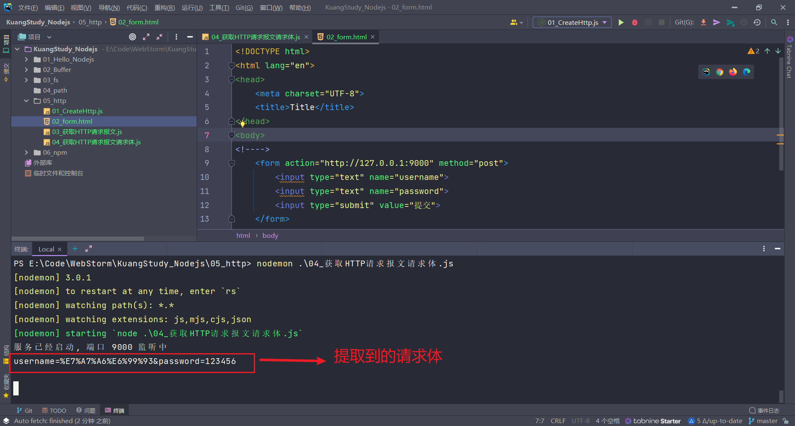


2. 方法二：这种方法比较常用

   例如我们浏览器输入 `127.0.0.1:9000/search?username=admin&password=123456`

```javascript
//导入 http 模块
const http = require('http');
//导入 url 模块
const url = require('url');


//创建服务对象 create 创建 server 服务
const server = http.createServer((request,response) => {

    console.log("request.url",request.url);
    // /username=admin&password=123456

    // url.parse 对url进行解析,若第二个参数为true,则会将URL查询字符串转换为对象,这样方便操作
    let res = url.parse(request.url,true);
    console.log("res",res);
    /**
     *  Url {
          protocol: null,
          slashes: null,
          auth: null,
          host: null,
          port: null,
          hostname: null,
          hash: null,
          search: '?username=admin&password=123456',
          query: [Object: null prototype] { username: 'admin', password: '123456' },
          pathname: '/search',
          path: '/search?username=admin&password=123456',
          href: '/search?username=admin&password=123456'
        }
     */
    // 获取URL路径
    console.log("res.pathname",res.pathname); // /search
    // 获取URL查询字符串
    console.log(res.query.username); //admin
    console.log(res.query.password); //123456


    // 解决乱码
    response.setHeader('content-type','text/html;charset=utf-8');
    // 设置响应体并结束响应
    response.end("您好");

});

// 监听端口9000,第二个参数只有服务启动成功之后才会执行
server.listen(9000,() => {
    console.log("服务已经启动, 端口 9000 监听中");
})
```

3. 方法三：新版Nodejs方法，需要重点掌握

访问路径为：`127.0.0.1:9000/search?username=admin&password=123456`

```javascript
//导入 http 模块
const http = require('http');


//创建服务对象 create 创建 server 服务
const server = http.createServer((request,response) => {

    // 实例化 URL 对象,这样的 url 是一个对象
    let url = new URL(request.url,'http://127.0.0.1');
    // 输出
    console.log(url);
    /**
     * URL {
          href: 'http://127.0.0.1/search?username=admin&password=123456',
          origin: 'http://127.0.0.1',
          protocol: 'http:',
          username: '',
          password: '',
          host: '127.0.0.1',
          hostname: '127.0.0.1',
          port: '',
          pathname: '/search',
          search: '?username=admin&password=123456',
          searchParams: URLSearchParams { 'username' => 'admin', 'password' => '123456' },
          hash: ''
        }
     */

    // 因为 URL 是一个对象,这样取得路径就很方便
    console.log(url.pathname); // /search
    // 获得URL查询字符串
    console.log(url.searchParams.get('username')); //admin
    console.log(url.searchParams.get('password')); //123456


    // 解决乱码
    response.setHeader('content-type','text/html;charset=utf-8');
    // 设置响应体并结束响应
    response.end("您好");

});

// 监听端口9000,第二个参数只有服务启动成功之后才会执行
server.listen(9000,() => {
    console.log("服务已经启动, 端口 9000 监听中"
```


## 5.6、设置HTTP响应报文

| 作用             | 语法                                         |
| ---------------- | -------------------------------------------- |
| 设置响应状态码   | response.statusCode                          |
| 设置响应状态描述 | response.statusMessage （ 用的非常少）       |
| 设置响应头信息   | response.setHeader('头名', '头值')           |
| 设置响应体       | response.write('xx')<br/>response.end('xxx') |


```javascript
//导入 http 模块
const http = require('http');


//创建服务对象 create 创建 server 服务
const server = http.createServer((request,response) => {


    // 设置响应码
    response.statusCode = 203;
    // 设置响应状态的描述
    response.statusMessage = '专属响应码';
    // 设置响应头(解决乱码)
    response.setHeader('content-type','text/html;charset=utf-8');

    // 设置响应体
    response.write('I');
    response.write('LOVE');
    response.write('YOU');
    
    // 设置响应体并结束响应
    response.end();

});

// 监听端口9000,第二个参数只有服务启动成功之后才会执行
server.listen(9000,() => {
    console.log("服务已经启动, 端口 9000 监听中");
})

```

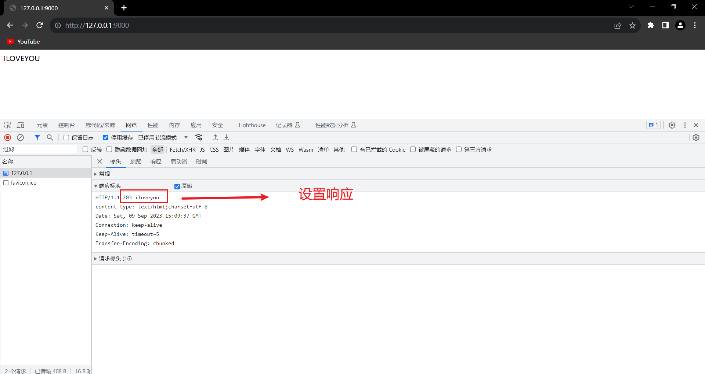


## 5.7、网页资源的基本加载过程

网页资源的加载都是循序渐进的，首先获取 HTML 的内容， 然后解析 HTML 在发送其他资源的请求，


## 5.8、静态资源服务

- 静态资源是指**内容长时间不发生改变的资源**，例如图片，视频，CSS 文件，JS文件，HTML文件，字体文件等
- 动态资源是指**内容经常更新的资源**，例如百度首页，网易首页，京东搜索列表页面等


### 5.8.1、网站根目录或静态资源目录

HTTP 服务在哪个文件夹中寻找静态资源，那个文件夹就是**静态资源目录**，也称之为**网站根目录**


### 5.8.2、网页中的URL

网页中的 URL 主要分为两大类：相对路径与绝对路径

- 绝对路径可靠性强，而且相对容易理解，在项目中运用较多

| 形式                   | 特点                                                         |
| ---------------------- | ------------------------------------------------------------ |
| http://atguigu.com/web | 直接向目标资源发送请求，容易理解。网站的外链会用到此形式     |
| //atguigu.com/web      | 与页面 URL 的协议拼接形成完整 URL 再发送请求。大型网站用的比较多 |
| /web                   | 与页面 URL 的协议、主机名、端口拼接形成完整 URL 再发送请求。中小型网站（用的比较多） |

- 相对路径在发送请求时，需要与当前页面 URL 路径进行计算，得到完整 URL 后，再发送请求，学习阶段用的较多

例如当前网页 url 为 http://www.atguigu.com/course/h5.html

| 形式               | 最终的url                                 |
| ------------------ | ----------------------------------------- |
| ./css/app.css      | http://www.atguigu.com/course/css/app.css |
| js/app.js          | http://www.atguigu.com/course/js/app.js   |
| ../img/logo.png    | http://www.atguigu.com/img/logo.png       |
| ../../mp4/show.mp4 | http://www.atguigu.com/mp4/show.mp4       |

解释第一个 `./css/app.css` ，表示请求的 URL 为当前文件夹下的 `./css/app.css` ，而当前文件夹为 course，所以最终的拼接结果为`http://www.atguigu.com/course/css/app.css`


## 5.9、设置资源类型(mime类型)

媒体类型）是一种标准，用来表示文档、文件或字节流的性质和格式。

```javascript
// mime 类型结构： [type]/[subType]
text/html
text/css
image/jpeg
image/png
application/json
```

HTTP 服务可以设置响应头 Content-Type 来表明响应体的 MIME 类型，浏览器会根据该类型决定如何处理资源，下面是常见文件对应的 mime 类型

```javascript
html: 'text/html',
css: 'text/css',
js: 'text/javascript',
png: 'image/png',
jpg: 'image/jpeg',
gif: 'image/gif',
mp4: 'video/mp4',
mp3: 'audio/mpeg',
json: 'application/json'
```

对于未知的资源类型，可以选择 `application/octet-stream` 类型，浏览器在遇到该类型的响应时，会对响应体内容进行独立存储，也就是我们常见的**下载**效果


## 5.10、GET和POST请求场景

GET请求的情况：

- 在地址栏直接输入 url 访问
- 点击 a 链接
- link 标签引入 css
- script 标签引入 js
- img 标签引入图片
- form 标签中的 method 为 get （不区分大小写）
- ajax 中的 get 请求

POST请求的情况：

- form 标签中的 method 为 post（不区分大小写）
- ajax 中的 post请求


## 5.11、GET和POST请求的区别

GET 和 POST 是 HTTP 协议请求的两种方式。

- GET 主要用来获取数据，POST 主要用来提交数据
- GET 带参数请求是将参数缀到 URL 之后，在地址栏中输入 url 访问网站就是 GET 请求，POST 带参数请求是将参数放到请求体中
- POST 请求相对 GET 安全一些，因为在浏览器中参数会暴露在地址栏
- GET 请求大小有限制，一般为 2K，而 POST 请求则没有大小限制


