# 1、Node.js模块化

## 1.1、模块暴露数据

1. 创建 `me.js`

```javascript
//声明函数
function tiemo(){
console.log('贴膜....');
}
//暴露数据
module.exports = tiemo;
```

2. 创建 `index.js`

```javascript
//导入模块
const tiemo = require('./me.js');

//调用函数
tiemo();
```

模块暴露数据的方式有两种：

1. `module.exports = value`
2. `exports.name = value`

> 使用时有几点注意：
>
> - `module.exports` 可以暴露**任意**数据
> - 


## 1.2、引入模块

在模块中使用 require 传入**文件路径**即可引入文件

```javascript
//导入模块
const tiemo = require('./me.js');
```

require 使用的一些注意事项：

1. 对于自己创建的模块，导入时路径建议写**相对路径**，且不能省略`./` 和`../`

2. 导入 node.js 内置模块时，直接 require 模块的名字即可，无需加 `./` 和`../`

3. `js` 和 `json` 文件导入时可以不用写后缀

4. 如果导入其他类型的文件，会以 `js`文件进行处理

5. 如果导入的路径是个文件夹，则会**首先**检测该文件夹下 `package.json` 文件中 `main` 属性对应的文件，如果存在则导入，反之如果文件不存在会报错。如果 main 属性不存在，或者 package.json 不存在，则会尝试导入文件夹下的 `index.js` 和 `index.json`，如果还是没找到，就会报错

   


# 2、包管理工具


下面列举了前端常用的包管理工具：

- npm
- yarn
- cnpm

## 2.1、npm

npm 全称 `Node Package Manager` ，翻译为中文意思是 **Node 的包管理工具**


## 2.2、npm的安装


node.js 在安装时会自动安装 npm ，所以如果你已经安装了 node.js，可以直接使用 npm，可以通过 `npm -v` 查看版本号测试，如果显示版本号说明安装成功，反之安装失败

> 查看版本时与nodejs版本号不一样是正常的


## 2.3、npm基本使用

创建一个空目录，然后以此目录作为工作目录**启动命令行工具**，执行 `npm init`

- `npm init` 命令的作用是将文件夹初始化为一个包，**交互式创建 package.json 文件**
- `package.json` 是包的配置文件，每个包都必须要有
- `package.json` 内容示例：

```json
{
    "name": "01_npm",
    "version": "1.0.0",
    "description": "",
    "main": "index.js",
    "scripts": {
    	"test": "echo \"Error: no test specified\" && exit 1"
	},
    "author": "",
    "license": "ISC"
}
```

翻译：

```json
{
    "name": "1-npm",   #包的名字
    "version": "1.0.0", #包的版本
    "description": "", #包的描述
    "main": "index.js", #包的入口文件
    "scripts": { #脚本配置
    	"test": "echo \"Error: no test specified\" && exit 1"
	},
    "author": "", #作者
    "license": "ISC" #开源证书
}
```

初始化的过程中还有一些注意事项：

> 1. `package name` ( **包名**) 不能使用中文、大写，默认值是文件夹的名称，所以文件夹名称也不能使用中文和大写
> 2. `version` ( **版本号**)要求 x.x.x 的形式定义， x 必须是数字，默认值是 `1.0.0`
> 3. `package.json` 可以手动创建与修改
> 4. 使用 `npm init -y` 或者 `npm init --yes` 极速创建 `package.json`

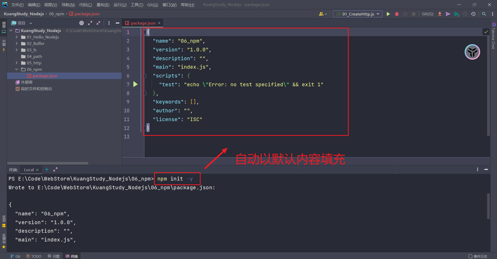


## 2.4、搜索包

网址搜索：https://www.npmjs.com/


## 2.5、下载安装包

我们可以通过 `npm install` 和 `npm i` 命令安装包，例如我们要使用 unqi 包

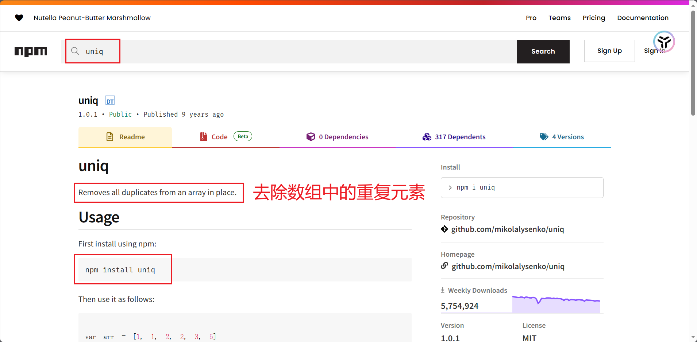

```bash
# 格式
npm install <包名>
npm i <包名>

# 示例
npm install uniq
npm i uniq
```

步骤如下：

1. 首先要执行 `npm init -y` 初始化包
2. `npm i uniq` 安装uniq包

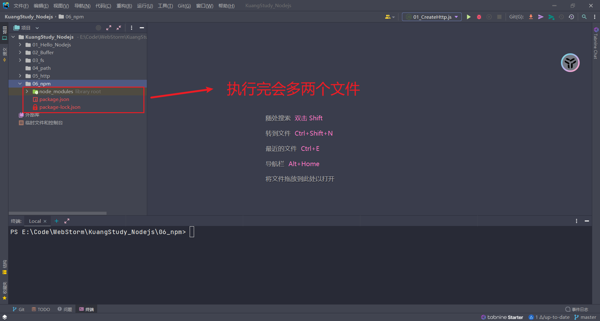

可以参照 npm 的 uniq 官网使用说明进行使用：

```javascript
// 1.导入 uniq 包
const uniq = require('uniq');

// 2.使用函数
let arr = [1,2,3,4,5,4,3,2,1];

// [ 1, 2, 3, 4, 5 ]
console.log(uniq(arr));
```


> 这里说一下注意点：
>
> - 注意更换淘宝源码
> - `npm cache clean --force` 可以清楚npm缓存

运行之后文件夹下会增加两个资源：

- `node_modules 文件夹` :存放下载的包
- `package-lock.json 包的锁文件` : 用来锁定包的版本

> 安装 uniq 之后， uniq 就是当前这个包的一个**依赖包**，有时会简称为**依赖**

思考：require 到底导入的是什么？require的工作流程如下：

1. 在当前文件夹下 node_modules 中寻找同名的文件夹
2. 在上级目录中下的 node_modules 中寻找同名的文件夹，直至找到磁盘根目录


## 2.6、生产环境与开发环境

- 开发环境是程序员专门用来写代码的环境，一般是指**程序员的电脑**，开发环境的项目一般只能程序员自己访问
- 生产环境是项目代码正式运行的环境，一般是指正式的**服务器电脑**，生产环境的项目一般每个客户都可以访问


## 2.7、生产依赖与开发依赖

我们可以在安装时设置选项来区分**依赖的类型**，目前分为两类：

| 类型     | 命令                                   | 补充                                                         |
| -------- | -------------------------------------- | ------------------------------------------------------------ |
| 生产依赖 | npm i --save uniq<br>npm i -S uniq     | -S 等效于 --save， -S 是默认选项<br>包信息保存在 package.json 中 `dependencies` 属性 |
| 开发依赖 | npm i --save-dev less<br>npm i -D less | -D 等效于 --save-dev<br>包信息保存在 package.json 中 `devDependencies` 属性 |

> 所以**开发依赖**是只在开发阶段使用的依赖包，而**生产依赖**是开发阶段和最终上线运行阶段都用到的依赖包

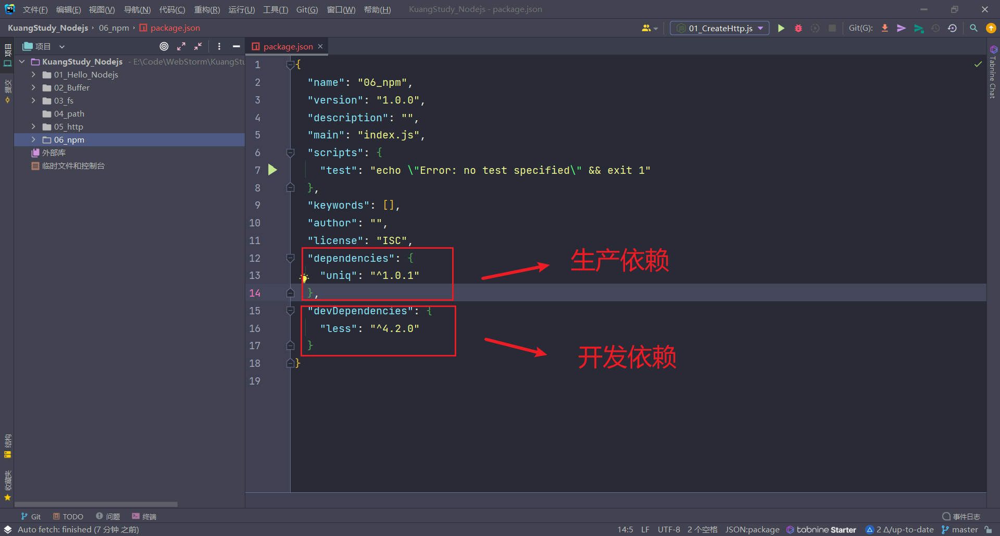

> 因为 uniq 和 less 包都是局部安装，并不是全局安装，所以只能在 06_npm 文件夹下使用

## 2.8、全局安装

我们可以执行安装选项 `-g` 进行全局安装

```bash
npm i -g nodemon
```

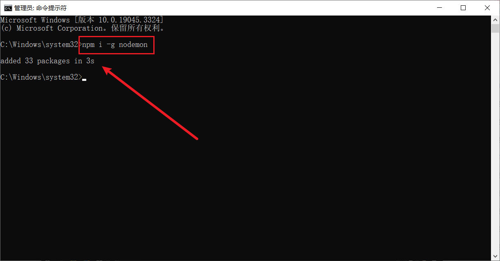

全局安装完成之后就可以在命令行的任何位置运行 `nodemon` 命令，该命令的作用是 **自动重启 node 应用程序**

> 说明：
>
> - 全局安装的命令不受工作目录位置影响
> - 可以通过 `npm root -g` 可以查看全局安装包的位置
> - **不是所有的包都适合全局安装**， 只有全局类的工具才适合，可以通过查看包的官方文档来确定安装方式

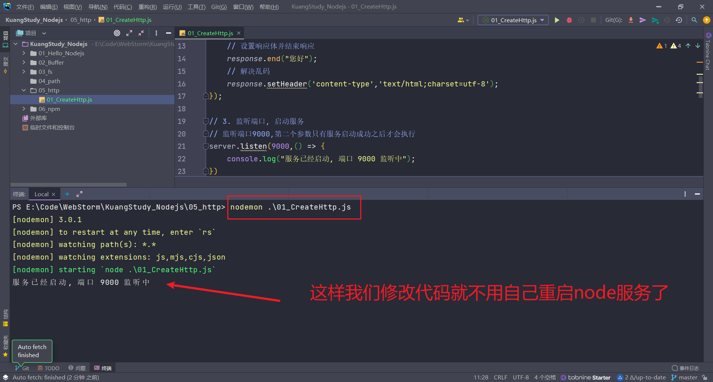

> Tips：可能碰到如下问题的解决方案
>
> - [nodemon : 无法加载文件 C:\Users\User\AppData\Roaming\npm\nodemon.ps1，因为在此系统上禁止运行脚本。_nodemon : 无法加载文件 c:\users\x\appdata\roaming\npm\no_薛定谔的猫87的博客-CSDN博客](https://blog.csdn.net/tory886/article/details/119670783)
> - 下方 2.9 也就是解决办法

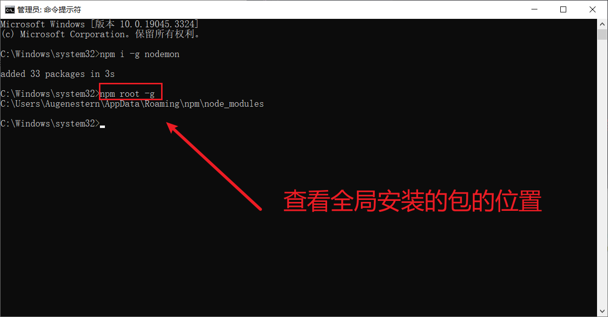


## 2.9、修改windows执行策略

windows 默认不允许 npm 全局命令执行脚本文件，所以需要修改执行策略

1. 以**管理员身份**打开 `powershell` 命令行
2. 键入命令 `set-ExecutionPolicy remoteSigned`
3. 键入 `A` 然后**敲回车**
4. 如果不生效，可以尝试重启 vscode/webstrom


## 2.10、安装包依赖

在项目协作中有一个常用的命令就是 `npm i` ，通过该命令可以依据 `package.json` 和 `packagelock.json` 的依赖声明安装项目依赖

```bash
npm i

npm install
```

> node_modules 文件夹大多数情况都不会存入版本库


## 2.11、安装指定版本的包

项目中可能会遇到版本不匹配的情况，有时就需要安装指定版本的包，可以使用下面的命令：

```bash
## 格式
npm i <包名@版本号>

## 示例
npm i jquery@1.11.2
```


## 2.12、删除依赖

项目中可能需要删除某些不需要的包，可以使用下面的命令：

```bash
## 局部删除
npm remove uniq
npm r uniq

## 全局删除
npm remove -g nodemon
```


## 2.13、配置命令别名

通过配置命令别名可以更简单的执行命令：配置 `package.json` 中的 `scripts` 属性

```json
{
    "scripts": {
        "server": "node server.js",
        "start": "node index.js",
    }
}
```

配置完成之后，可以使用别名执行命令:

```bash
npm run server

npm run start
```

> 不过 start 别名比较特别，使用时可以省略run ： `npm start`
>
> - `npm start` 是项目中常用的一个命令，一般用来启动项目
> - `npm run` 有自动向上级目录查找的特性，跟 `require` 函数一样
> - 对于陌生的项目，我们可以通过查看 `scripts` 属性来参考项目的一些操作


# 3、cnpm


cnpm 是一个淘宝构建的 `npmjs.com` 的完整镜像，也称为 淘宝镜像，网址：https://npmmirror.com/

- cnpm 服务部署在国内阿里云服务器上， 可以提高包的下载速度
- 官方也提供了一个全局工具包 cnpm ，操作命令与 npm 大体相同


## 3.1、安装cnpm

我们可以通过 npm 来安装 cnpm 工具

```bash
npm install -g cnpm --registry=https://registry.npmmirror.com
```


## 3.2、操作命令

| 功能         | 命令                                                         |
| ------------ | ------------------------------------------------------------ |
| 初始化       | cnpm init                                                    |
| 安装包       | cnpm i uniq<br>cnpm i -S uniq<br>cnpm i -D uniq<br>cnpm i -g nodemon |
| 安装项目依赖 | cnpm i                                                       |
| 删除uniq依赖 | cnpm r uniq                                                  |


## 3.2、npm配置淘宝镜像

用 npm 也可以使用淘宝镜像，配置的方式有两种：

- 直接配置
- 工具配置

### 3.2.1、直接配置

执行如下命令即可完成配置：

```bash
npm config set registry https://registry.npmmirror.com/
```


### 3.2.2、工具配置

使用 `nrm` 配置 npm 的镜像地址 `npm registry manager`

1. 安装 nrm

```bash
npm i -g nrm		
```

2. 修改镜像

```bash
# 查看所有的镜像
nrm ls 

# 选择淘宝镜像
nrm use taobao

# 切换到官方地址
nrm use npm
```

3. 检查是否配置成功

```bash
npm config list
```

检查 registry 地址是否为 https://registry.npmmirror.com/ , 如果是则表明成功

> 1. 建议使用第二种方式进行镜像配置，因为后续修改起来会比较方便
> 2. 虽然 cnpm 可以提高速度，但是 npm 也可以通过淘宝镜像进行加速，所以npm 的使用率还是高于 cnpm


# 4、yarn

yarn 是由 Facebook 在 2016 年推出的新的 Javascript 包管理工具，官方网址： https://yarnpkg.com/

## 4.1、yarn安装

我们可以使用 npm 安装 yarn

```bash
npm i -g yarn
```


## 4.2、yarn常用命令


| 功能         | 命令                                                         |
| ------------ | ------------------------------------------------------------ |
| 初始化       | yarn init / yarn init -y                                     |
| 安装包       | yarn add uniq 生产依赖<br>yarn add less --dev 开发依赖<br>yarn global add nodemon 全局安装 |
| 删除包       | yarn remove uniq 删除项目依赖包<br>yarn global remove nodemon 全局删除包 |
| 安装项目依赖 | yarn                                                         |
| 运行命令别   | yarn <别名> # 不需要添加 run                                 |


## 4.3、yarn配置淘宝镜像

可以通过如下命令配置淘宝镜像：

```bash
yarn config set registry https://registry.npmmirror.com/
```

可以通过 `yarn config list` 查看 yarn 的配置项


## 4.4、npm 和 yarn 选择

大家可以根据不同的场景进行选择：如果是公司要根据项目代码来选择，可以通过锁文件判断项目的包管理工具

- npm 的锁文件为 `package-lock.json`
- yarn 的锁文件为 `yarn.lock`


# 5、nvm

nvm 全称 `Node Version Manager` 顾名思义它是用来管理 node 版本的工具，方便切换不同版本的Node.js


## 5.1、下载安装

1. 进入下载地址：https://github.com/coreybutler/nvm-windows/releases
2. 选择 `nvm-setup.exe` 下载

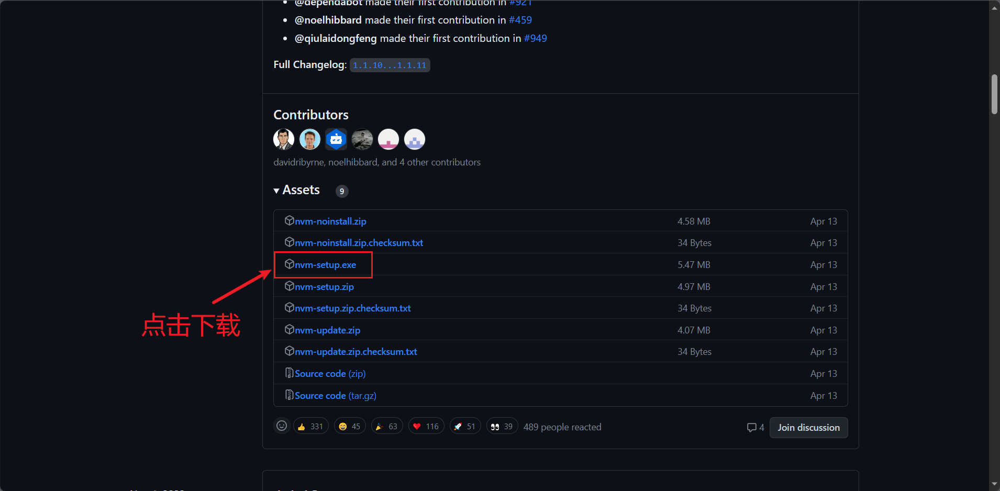

## 5.2、常用命令


| 命令                  | 说明                            |
| --------------------- | ------------------------------- |
| nvm list available    | 显示所有可以下载的 Node.js 版本 |
| nvm list              | 显示已安装的版本                |
| nvm install 18.17.1   | 安装 18.12.1 版本的 Node.js     |
| nvm install latest    | 安装最新版的 Node.js            |
| nvm uninstall 18.17.1 | 删除某个版本的 Node.js          |
| nvm use 18.17.1       | 切换 18.12.1 的 Node.js         |

> Tips： 很鬼扯，安装了 nvm 后 `node -v` 提示报错，并且 `nvm list` 提示没有已安装的node版本，安装 nvm 时没有给我提示要管理已安装的 node 版本的指示，所以这里我是将 node 卸载后，先装 nvm ，之后通过 nvm 装 node 18.17.1


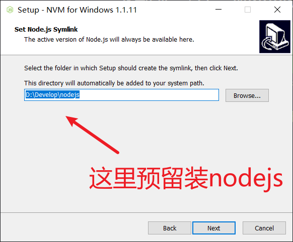


1. 安装完成后找到 nvm的安装路径 - 找到 `settings.txt` 文件 - 配置下载源

```json
root: D:\Develop\nvm
path: D:\Develop\nodejs


node_mirror: https://npm.taobao.org/mirrors/node/
npm_mirror: https://npm.taobao.org/mirrors/npm/
```

3. 然后打开命令行窗口

```bash
# 显示所有可以下载的 Node.js 版本
nvm list available

# 安装 18.12.1 版本的 Node.js
nvm install 18.17.1
```

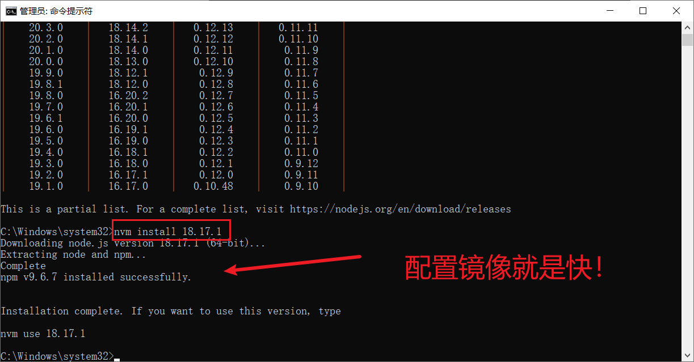

4. 使用这个版本的 node

```bash
nvm use 18.17.1

# 查看node版本
node -v

# 查看 npm 版本
npm -v

# 全局安装 nrm
npm i -g nrm

# 查看所有的镜像
nrm ls 

# 选择淘宝镜像
nrm use taobao

# 全局安装nodemon
npm i -g nodemon
```


# 6、Express框架


express 是一个基于 Node.js 平台的极简、灵活的 WEB 应用开发框架，官方网址：[Express - 基于 Node.js 平台的 web 应用开发框架 - Express 中文文档 | Express 中文网 (expressjs.com.cn)](https://www.expressjs.com.cn/)

- 简单来说，express 是一个封装好的工具包，封装了很多功能，便于我们开发 WEB 应用（HTTP 服务）


## 6.1、下载使用

1. 通过 npm 安装

```bash
# 先对一个空文件夹进行初始化
npm init -y
# 安装express包
npm i express 
# 查看express版本
npm list express
```

2. 创建 JS 文件

```javascript
// 1.导入 express
const express = require('express');

//2. 创建应用对象
const app = express();

//3. 创建路由规则
app.get('/home', (req, res) => {
  res.end('hello express server');
});

//4. 监听端口 启动服务
app.listen(3000, () =>{
  console.log('服务已经启动, 端口监听为 3000...');
});
```

3. 命令行下执行该脚本

```bash
node <文件名>
# 或者
nodemon <文件名>
```

4. 然后在浏览器就可以访问 http://127.0.0.1:3000/home


## 6.2、express路由

**路由确定了应用程序如何响应客户端对特定端点的请求**，一个路由的组成有**请求方法**， **路径**和**回调函数**组成，使用格式如下：

```bash
app.<method>(path，callback)
```

示例：

```javascript
// 1.导入 express
const express = require('express');

//2. 创建应用对象
const app = express();

//3. 创建get路由
app.get('/', (req,res) => {
  res.send('首页路由');
});

app.get('/home', (req, res) => {
  res.end('home页路由');
});

//创建 post 路由
app.post('/login', (req, res) => {
  res.send('登录成功');
});

//匹配所有的请求方法(请求方法无所谓,只要路径是 /test)
app.all('/search', (req, res) => {
  res.send('1 秒钟为您找到相关结果约 100,000,000 个');
});

//自定义 404 路由
app.all("*", (req, res) => {
  res.send('<h1>404 Not Found</h1>')
});


//4. 监听端口 启动服务
app.listen(3000, () =>{
  console.log('服务已经启动, 端口监听为 3000...');
});
```

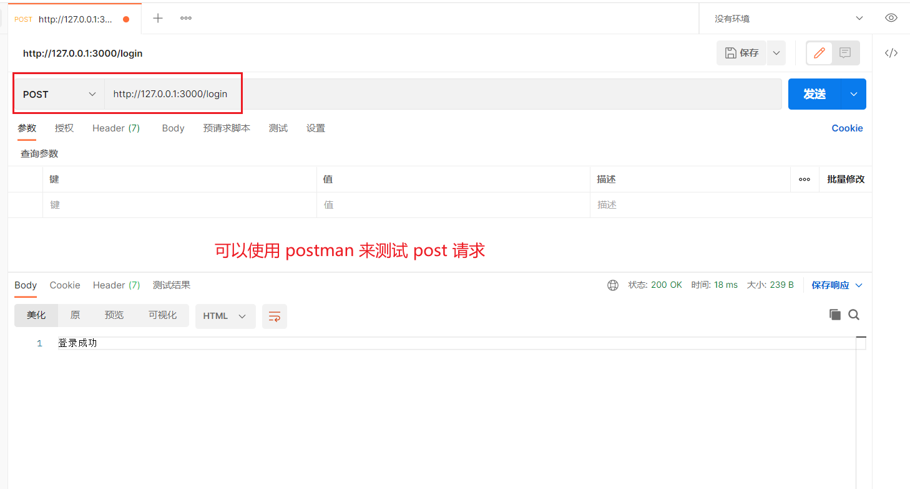


## 6.3、获取请求参数

express 框架封装了一些 API 来方便获取请求报文中的数据，并且兼容原生 HTTP 模块的获取方式:

- 访问： `http://127.0.0.1:3000/request?usernmae=qinxiaolin&age=21` ，如下注释即为获取的请求参数

```javascript
// 1.导入 express
const express = require('express');

//2. 创建应用对象
const app = express();

//3. 获取请求的路由规则
app.get('/request', (req,res) => {
      //1. 获取报文的方式与原生 HTTP 获取方式是兼容的
      console.log(req.method); // get
      console.log(req.url); // /request
      console.log(req.httpVersion); // 1.1
      console.log(req.headers);

      //2. express 独有的获取报文的方式
      //获取查询字符串
      console.log(req.query); // 『相对重要』 { usernmae: 'qinxiaolin', age: '21' }
      // 获取指定的请求头
      console.log(req.get('host')); // 127.0.0.1:3000
  res.send('请求报文的获取');
});


//自定义 404 路由
app.all("*", (req, res) => {
  res.send('<h1>404 Not Found</h1>')
});


//4. 监听端口 启动服务
app.listen(3000, () =>{
  console.log('服务已经启动, 端口监听为 3000...');
});
```


## 6.4、获取路由参数

路由参数指的是 **URL 路径中的参数**

```javascript
// 1.导入 express
const express = require('express');

//2. 创建应用对象
const app = express();

// 获取路由参数
app.get('/:id.html', (req, res) => {
  console.log(req.params.id); // 123
  res.send('商品详情' );
});

//4. 监听端口 启动服务
app.listen(3000, () =>{
  console.log('服务已经启动, 端口监听为 3000...');
});
```

我们访问：

- `http://127.0.0.1:3000/123.html`，`req.params.id` 为 123
- `http://127.0.0.1:3000/456.html` ，`req.params.id` 为 456


​			

## 6.5、express响应设置

express 框架封装了一些 API 来方便给客户端响应数据，并且兼容原生 HTTP 模块的获取方式

```javascript
// 1.导入 express
const express = require('express');

//2. 创建应用对象
const app = express();

// 获取路由参数
app.get('/response', (req, res) => {
  //1. express 中设置响应的方式兼容 HTTP 模块的方式
  res.statusCode = 404;
  res.statusMessage = 'xxx';
  res.setHeader('abc','xyz');
  res.write('响应体');
  res.end('xxx');

  //2. express 的响应方法
  res.status(500); //设置响应状态码
  res.set('xxx','yyy');//设置响应头
  res.send('中文响应不乱码');//设置响应体
  //连贯操作
  res.status(404).set('xxx','yyy').send('你好朋友')

});

//4. 监听端口 启动服务
app.listen(3000, () =>{
  console.log('服务已经启动, 端口监听为 3000...');
});
```

express的其他响应方法：

```javascript
// 1.导入 express
const express = require('express');

//2. 创建应用对象
const app = express();

// 获取路由参数
app.get('/other', (req, res) => {

  //跳转响应
  //res.redirect('http://atguigu.com')//重定向
  ////下载响应
  //res.download(__dirname + './package.json');
  //JSON响应
  //res.json({
  //  username : "秦晓",
  //  age: 21
  //});
  ////响应文件内容,把 home.html 响应
  res.sendFile(__dirname + '/home.html')


});

//4. 监听端口 启动服务
app.listen(3000, () =>{
  console.log('服务已经启动, 端口监听为 3000...');
});
```

- `res.redirect('http://atguigu.com')` 跳转响应，若访问 `http://127.0.0.1:3000/response` 则会跳转到 http://atguigu.com
- `res.download(__dirname + './package.json')` 下载响应，若访问 `http://127.0.0.1:3000/response` 则会下载 项目工程的package.json 文件
- json 响应到浏览器

- 将`home.html`网页响应到浏览器

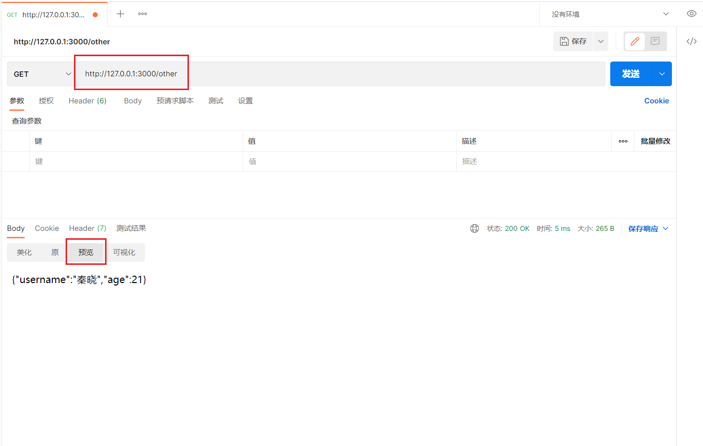

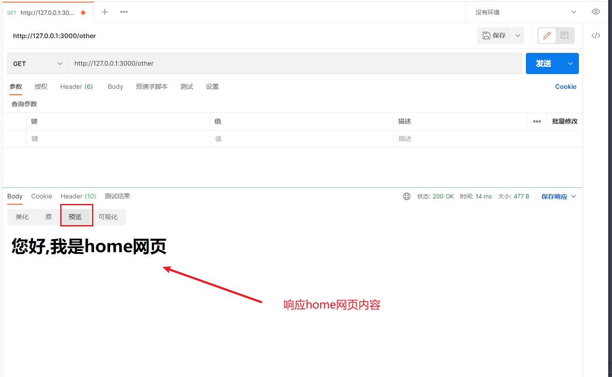


## 6.6、express中间件

中间件（Middleware）本质是一个回调函数，中间件函数可以像路由回调一样访问`请求对象（request）` ， `响应对象（response）`

- `中间件`的作用就是`使用函数封装公共操作，简化代码`

- 中间件的类型
  - 全局中间件
  - 路由中间件

### 6.6.1、定义全局中间件

**每一个请求到达服务端之后都会执行全局中间件函数**

> 全局中间件就相当于 **进站口**，而路由中间件就相当于 **检票口**
>
> 先进 **进站口**，再进 **检票口**

例如我们下面的代码是访问任何路由时我们都对url和id作记录，并写入 access.log 文件中：

```javascript
// 1.导入 express
const express = require('express');
const fs = require('fs');
const path = require('path');

//2. 创建应用对象
const app = express();

// 声明中间件函数(函数名随便写)
// req是请求报文的对象,res是响应报文的对象
function recordMiddleware(req,res,next){
  // 获取url 和 id
  let {url,ip} = req;
  // 将信息保存在文件的 access.log
  // path.resolve() 第一个参数是文件的绝对路径,第二个参数是写入文件的内容
  fs.appendFileSync(path.resolve(__dirname,'./access.log'),`${url} ${ip}\r\n`);
  //调用next(当如果希望执行完中间件函数之后，仍然继续执行路由中的回调函数，必须调用next)
  next();
}

//使用中间件函数
app.use(recordMiddleware);

//3. 创建路由规则
app.get('/home', (req, res) => {
  res.send('前台首页');
});

app.get('/admin', (req, res) => {
  res.send('后台首页');
});

app.all('*', (req, res) => {
  res.send('<h1>404</h1>>');
});


//4. 监听端口 启动服务
app.listen(3000, () =>{
  console.log('服务已经启动, 端口监听为 3000...');
});
```

- 依次访问：
  - `http://127.0.0.1:3000/home`
  - `http://127.0.0.1:3000/admin`
  - ``http://127.0.0.1:3000/1234`

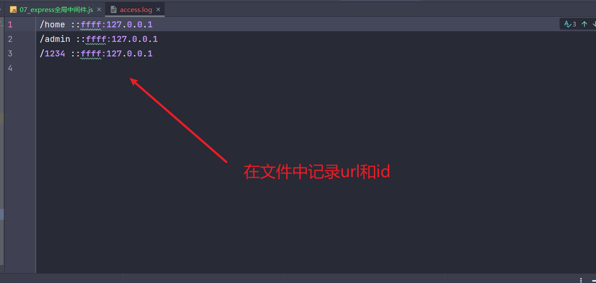


所以定义全局中间件的步骤如下：

1. 声明中间件函数

```javascript
function recordMiddleware(req,res,next){
    // 实现功能的代码
    ...
    // 执行next函数
    next();
}
```

2. 应用中间件

```javascript
app.use(recordMiddleware);

// 或者如下写法
app.use(function recordMiddleware(req,res,next){
    // 实现功能的代码
    ...
    // 执行next函数
    next();
})
```


### 6.6.2、定义路由中间件

如果**只需要对某一些路由进行功能封装**，则就需要路由中间件,调用格式如下：

```javascript
app.get('/路径',中间件函数1,中间件函数2,(request,response) => {
    
})
```

例如：

```javascript
// 1.导入 express
const express = require('express');


//2. 创建应用对象
const app = express();

// 声明中间件函数
let recordMiddleware = (req,res,next) => {
  // 判断url中是否code参数等于521,若满足条件,则进行路由回调
  if(req.query.code === '521'){
    next();
  }else{
    res.send('暗号错误')
  }
}

//使用中间件函数
app.use(recordMiddleware);

//3. 创建路由规则
app.get('/home',recordMiddleware, (req, res) => {
  res.send('前台首页');
});

app.get('/admin',recordMiddleware, (req, res) => {
  res.send('后台首页');
});


//4. 监听端口 启动服务
app.listen(3000, () =>{
  console.log('服务已经启动, 端口监听为 3000...');
});
```

### 6.6.3、静态资源中间件

express 内置处理静态资源的中间件

```javascript
// 1.导入 express
const express = require('express');


//2. 创建应用对象
const app = express();

// 静态资源中间件的设置，将当前文件夹下的public目录作为网站的根目录
app.use(express.static(__dirname + './public'));


//3. 创建路由规则
app.get('/index.html', (req, res) => {
  res.send('前台首页');
});


//4. 监听端口 启动服务
app.listen(3000, () =>{
  console.log('服务已经启动, 端口监听为 3000...');
});
```

这样我们就可以访问 public 下的资源文件了

- `http://127.0.0.1:3000/css/app.css`
- `http://127.0.0.1:3000/index.html`

> 注意事项：
>
> 1. `index.html` 文件为默认打开的资源
>    - 访问`public/index.html`，既可以`http://127.0.0.1:3000/index.html` ，也可以 `http://127.0.0.1:3000`
> 2. 如果静态资源与路由规则同时匹配，谁先匹配谁就响应
>    - 如果路径规则是一个 `/` , 则路由规则和静态资源都可以匹配
> 3. 路由响应动态资源，静态资源中间件响应静态资源


## 6.7、获取请求体

express 可以使用 `body-parser` 包处理请求体

1. 安装

```bash
npm i body-parser
```

2. 导入包

```javascript
const bodyParser = require('body-parser');
```

3. 获取中间件函数
   - 一个是解析 querystring 格式请求体的中间件
   - 另一个是解析 JSON 格式请求体的中间件
   - 需要使用哪个就用哪个中间件

```javascript
//解析 querystring 格式请求体的中间件
let urlParser = bodyParser.urlencoded({extended:false}));
//解析 JSON 格式请求体的中间件
let jsonParser = bodyParser.json();
```

4. 设置路由中间件，然后使用 `request.body` 来获取请求体数据

```javascript
// 1.导入 express
const express = require('express');
const bodyParser = require('body-parser');


//2. 创建应用对象
const app = express();

// 声明中间件函数
//解析 querystring 格式请求体的中间件
let urlParser = bodyParser.urlencoded({extended:false});
//解析 JSON 格式请求体的中间件
let jsonParser = bodyParser.json();


//3. 创建路由规则
// 使用解析 querystring 格式请求体的中间件
app.post('/login',urlParser,(request,response) => {
  // 获取请求体数据
  console.log(request.body);
  // 用户名
  console.log(request.body.username);
  // 密码
  console.log(request.body.password);
  response.send('获取请求体数据');
})


//4. 监听端口 启动服务
app.listen(3000, () =>{
  console.log('服务已经启动, 端口监听为 3000...');
});
```


## 6.8、Router

express 中的 Router 是一个完整的中间件和路由系统，可以看做是一个小型的 app 对象。Router的作用是对路由进行模块化，更好的管理路由。


1. 创建独立的Js文件：`homeRouter.js`

```javascript
//1. 导入 express
const express = require('express');

//2. 创建路由器对象
const router = express.Router();

//3. 在 router 对象身上添加路由
router.get('/', (req, res) => {
  res.send('首页');
})
router.get('/cart', (req, res) => {
  res.send('购物车');
});

//4. 暴露
module.exports = router;
```

2. 在其他文件引用

```javascript
const express = require('express');
const app = express();
//引入子路由文件
const homeRouter = require('../router/homeRouter');
//设置和使用中间件
app.use(homeRouter);
app.listen(3000,()=>{
  console.log('3000 端口启动....');
})
```

这样依然可以像之前访问一样

- `http://127.0.0.1:3000/cart`


## 6.9、模板引擎EJS

- 中文站：[EJS -- 嵌入式 JavaScript 模板引擎 | EJS 中文文档 (bootcss.com)](https://ejs.bootcss.com/#install)
- 官网：[EJS -- Embedded JavaScript templates](https://ejs.co/)

1. 下载安装EJS

```bash
npm i ejs --save
```

2. 引入包

```javascript
// 导入ejs
const ejs = require('ejs');

// 字符串
let china = '中国';
let str = '我爱你 <%= china%>'
// 使用ejs渲染
let result = ejs.render(str,{china: china});
console.log(result); // 我爱你 中国
```


### 6.9.1、分离用法

```javascript
// 导入ejs
const ejs = require('ejs');
const fs = require('fs');

// 字符串
let china = '中国';

let str = fs.readFileSync('./00_ejs.html').toString();
// 使用ejs渲染
let result = ejs.render(str,{china: china});
console.log(result); // 我爱你 中国
```

我们的`00_ejs.html` 的内容如下：

```html
<!DOCTYPE html>
<html lang="en">
<head>
  <meta charset="UTF-8">
  <title>Title</title>
</head>
<body>
<h2> <%= china%> </h2>
</body>
</html>
```

这样运行 js ，就会渲染


> 以此来达到 html 和 js 进行分离


## 6.10、express-generator

- 官网：[Express 应用程序生成器 - Express中文文档 | Express中文网 (expressjs.com.cn)](https://www.expressjs.com.cn/starter/generator.html)

1. 下载 Express 应用程序生成器

```bash
npx express-generator
```

2. 生成代码骨架后安装依赖

```bash
npm i
```

3. 运行项目

```bash
npm start
```

4. 浏览器访问：`http://127.0.0.1:3000/`

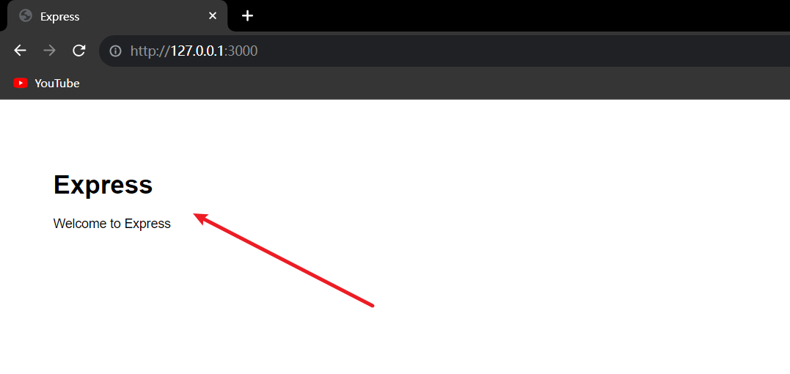


### 6.10.1、补充知识

- `app.use()` 也可以设置路由前缀

```javascript
// 设置路由前缀
app.use('/users', users.js);

// users.js 如下
router.get('/test', function(req, res, next) {
  res.send('用户测试');
});
```

如上代码，由于加了 `/users` 前缀，所以访问url就变成了 `http://127.0.0.1:3000/users/test`


