# 1、MongoDB7.x的安装

MongoDB 是一个基于分布式文件存储的数据库，官方地址 https://www.mongodb.com/

Mongodb 中有三个重要概念需要掌握：

- 数据库（database） 数据库是一个数据仓库，数据库服务下可以创建很多数据库，数据库中可以存放很多集合
- 集合（collection） 集合类似于 JS 中的数组，在集合中可以存放很多文档
- 文档（document） 文档是数据库中的最小单位，类似于 JS 中的对象

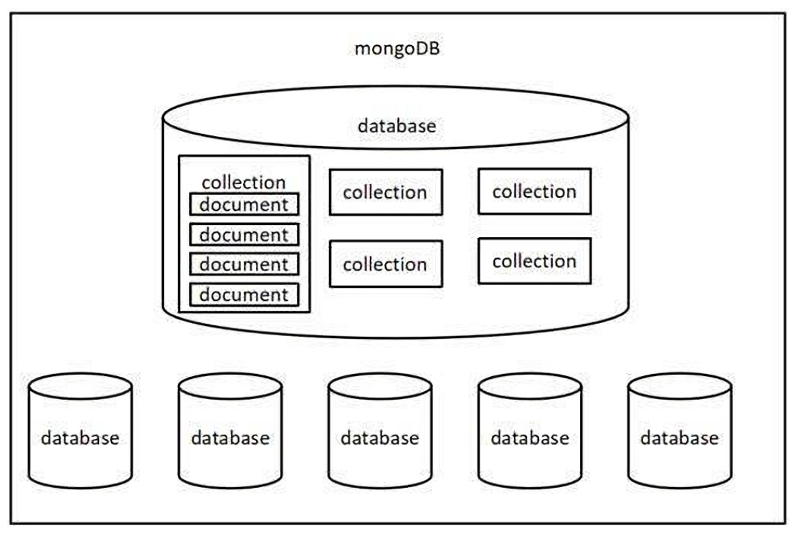

## 1.1、下载安装与启动

本文主要介绍 MongoDB 最新版本 7.x 在Windows 的安装方式，和过去的 4.X、5.X 不同。

- 下载地址：[Download MongoDB Community Server | MongoDB](https://www.mongodb.com/try/download/community)，进入官网下载 Mongodb 安装包，网站会自动检测当前操作系统提供最新的版本，和适合此平台的安装包

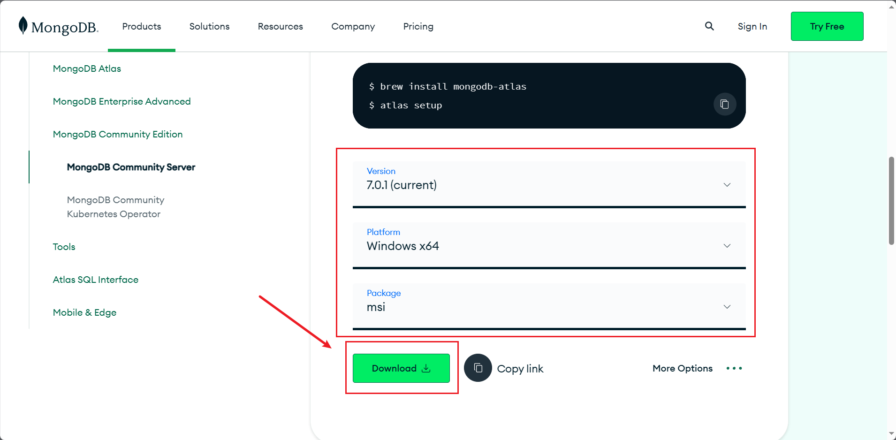

- 下载好后如下所示

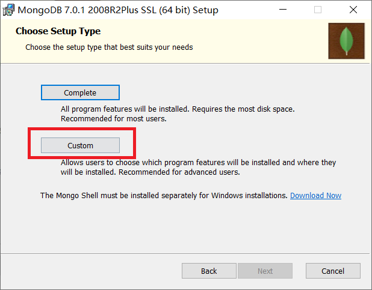


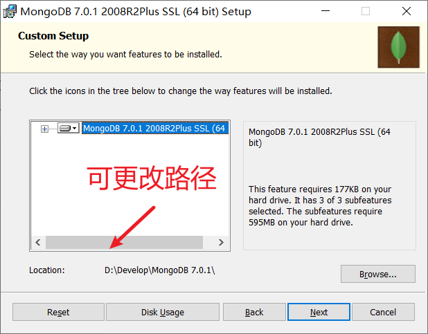


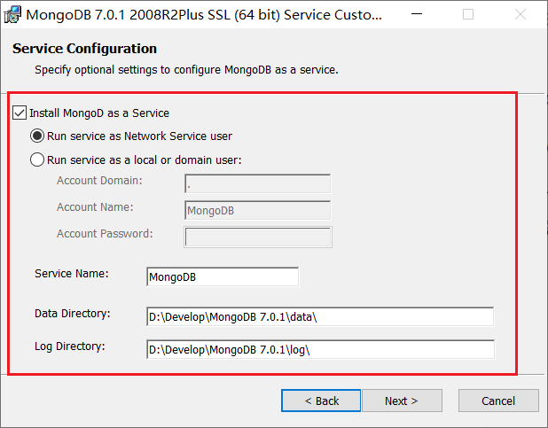


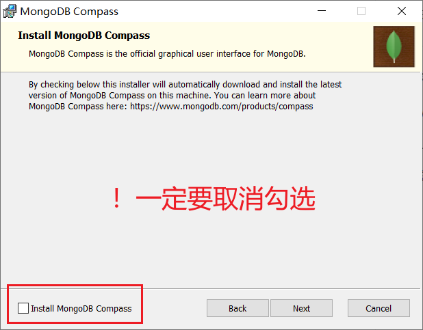

安装完成后进入任务管理器

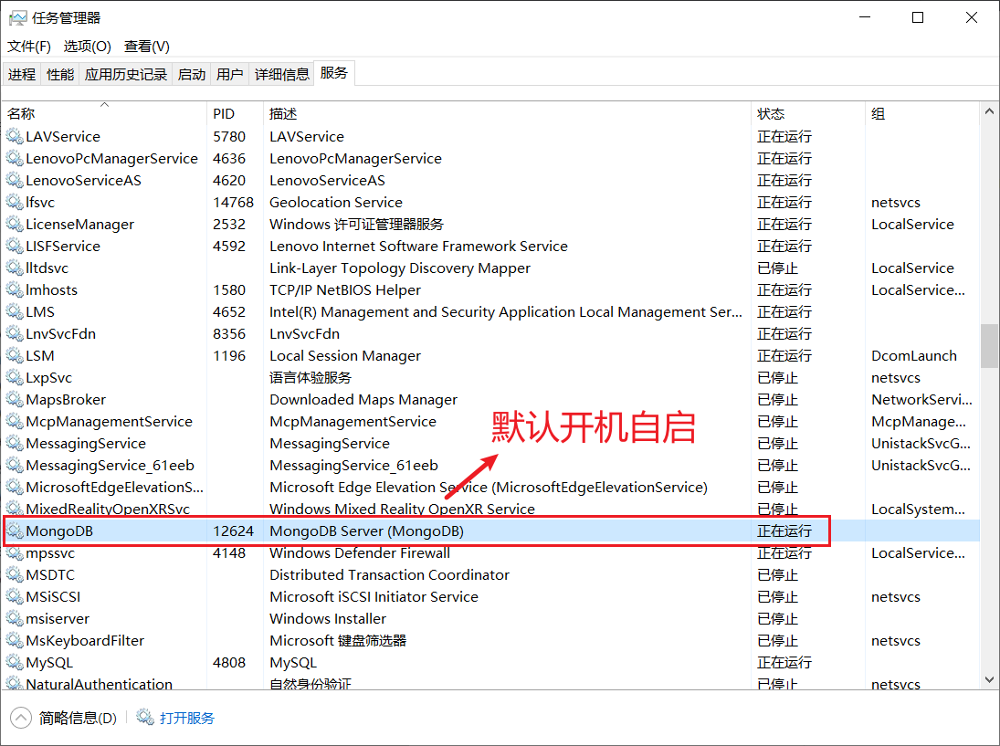


## 1.2、MongoDB目录

来到 MongoDB 的安装目录，我的是`D:\Develop\MongoDB 7.0.1`

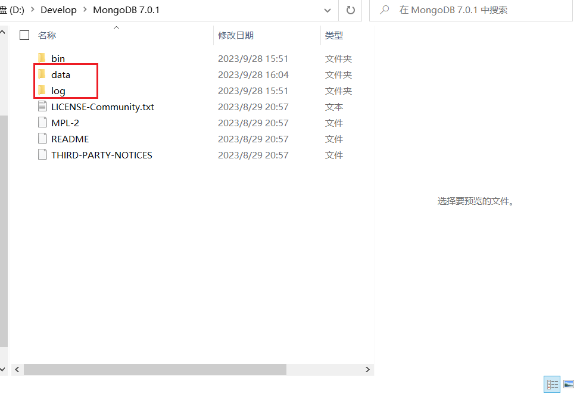


其中，bin 是 MongoDB 提供的可执行程序的目录，data 是数据存储的目录，log 是日志存储的目录。**后两者在过去都需要开发者手动创建。现在安装程序会自动创建**。

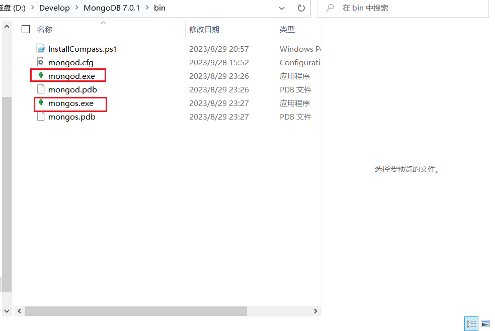

看下 bin 目录下的可执行程序， `mongod.exe` 用来启动 MongoDB 服务，`mongos.exe` 用来管理分片集群。

在 MongDB 6 以前，这个目录下会有很多可执行程序，比如最常用的 `mongo.exe`，它用来连接到 MongoDB 服务，是一个 shell 环境的客户端工具。但是现在需要单独进行安装。


## 1.3、安装MongoDB Shell

- 下载地址：[MongoDB Shell Download | MongoDB](https://www.mongodb.com/try/download/shell)

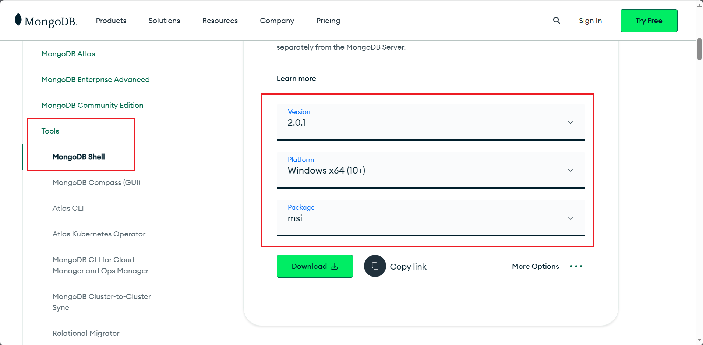


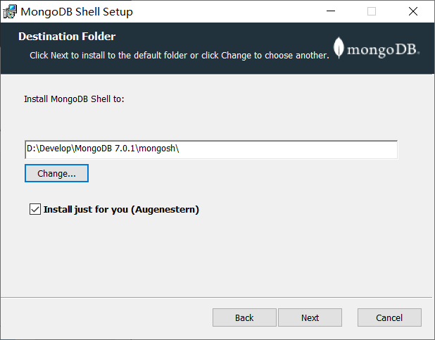


## 1.4、设置环境变量

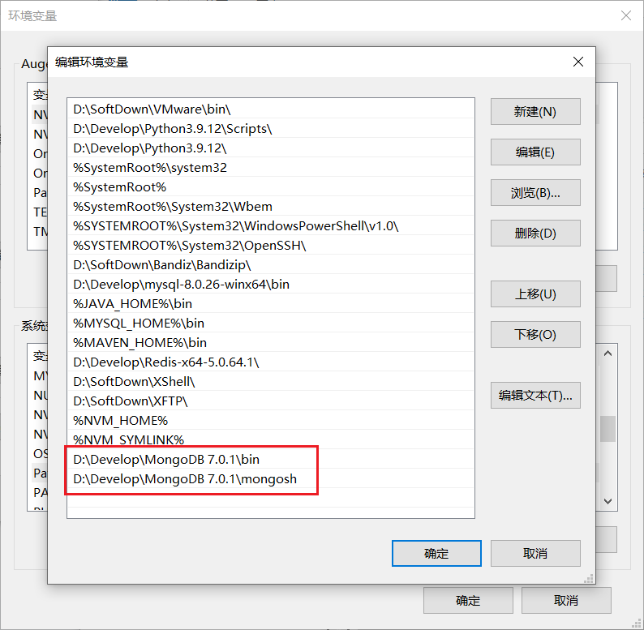

```bash
D:\Develop\MongoDB 7.0.1\bin

D:\Develop\MongoDB 7.0.1\mongosh
```

之后就可以在任意路径下使用 `mongosh`、`mongod` 等命令了

## 1.5、使用MongoDB

1. 打开 `cmd` 命令行窗口，输入 `mongosh.exe`
   - 默认会连接 `mongodb://localhost:27017` 的 MongoDB 服务

```bash
mongosh.exe
```

这是一个 shell 环境，支持 JavaScript 语法，还有一些扩展的操作数据库语法，比如查看所有的数据库：

```bash
show dbs
```

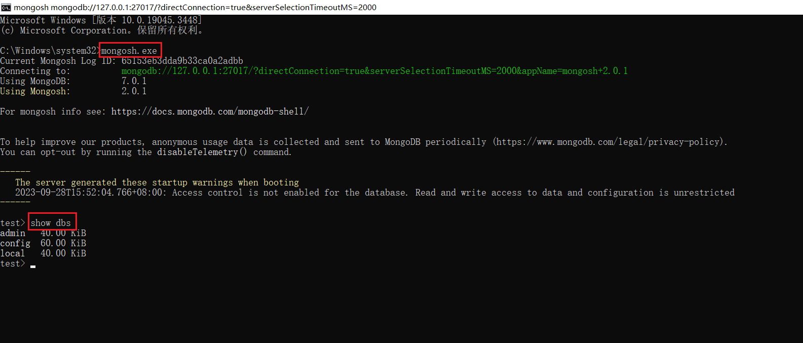


> 参考文章：[MongoDB 6.x 在 Windows 和 Linux 下的安装教程（详细） -阿里云开发者社区 (aliyun.com)](https://developer.aliyun.com/article/1073999)


# 2、命令行交互

命令行交互一般是学习数据库的第一步，不过这些命令在后续用的比较少，所以大家了解即可。

## 2.1、数据库命令

1. 显示所有的数据库

```mysql
show dbs
```

2. 切换到指定的数据库，如果数据库不存在会自动创建数据库

```mysql
use 数据库名
```

3. 显示当前所在的数据库

```mysql
db
```

4. 删除当前数据库

```mysql
use 库名

db.dropDatabase()
```

## 2.2、集合命令

1. 创建集合

```mysql
db.createCollection('集合名称')
```

2. 显示当前数据库中的所有集合

```mysql
show collections
```

3. 删除某个集合

```mysql
db.集合名.drop()
```

4. 重命名集合

```mysql
db.集合名.renameCollection('newName')
```

## 2.3、文档命令

1. 插入文档

```mysql
db.集合名.insert(文档对象);
```

2. 查询文档

```mysql
db.集合名.find(查询条件)
```

> _id 是 mongodb 自动生成的唯一编号，用来唯一标识文档


3. 更新文档

```mysql
db.集合名.update(查询条件,新的文档)

db.集合名.update({name:'张三'},{$set:{age:19}})
```

4. 删除文档

```mysql
db.集合名.remove(查询条件)
```


# 3、Mongoose

- Mongoose 是一个对象文档模型库，官网 ：[Mongoose.js中文网 (mongoosejs.net)](http://www.mongoosejs.net/)

- 作用：方便使用代码操作 mongodb 数据库

## 3.1、连接数据库

1. 在空目录下打开终端，执行

```bash
npm init -y
```

2. 下载Mongoose

```bash
npm i mongoose
```

3. 导入 mongoose

```javascript
//1. 下载 mongoose
//2. 导入 mongoose
const mongoose = require('mongoose');

//3. 连接数据库,如果数据库不存在,则会自动创建 bilibili 这个数据库
mongoose.connect('mongodb://127.0.0.1:27017/bilibili');

//4.设置回调
//连接成功的回调
mongoose.connection.once('open',() => {
  console.log('连接成功');
});


// 连接错误的回调
mongoose.connection.on('error',() => {
  console.log('连接出错');
});

//连接关闭的回调
mongoose.connection.on('close',() => {
  console.log('连接关闭');
});                    
```


## 3.2、创建新文档


```javascript
//连接成功的回调
mongoose.connection.once('open',() => {
  console.log('连接成功');
  //5.创建文档结构对象
  //设置集合中文档的属性以及属性值的类型
  let BookSchema = new mongoose.Schema({
    title: String,
    author: String,
    price: Number
  });
  //6.创建文档模型对象
  //第一个参数是集合名称,第二个参数是结构对象
  //mongoose会使用集合的复数来创建集合,也就是集合名称是books  
  let BookModel = mongoose.model('book',BookSchema);

  //7.插入文档
  BookModel.create({
    title: '西游记',
    author: '吴承恩',
    price: 19.9
  }).then((data) => {
    console.log(data);
  });
  
});
```

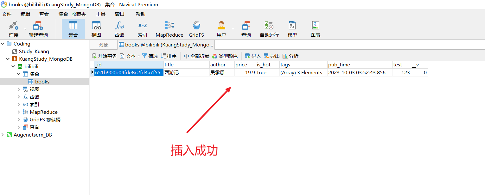


## 3.3、字段类型

文档结构可选的常用字段类型列表：

| 类型       | 描述                                                         |
| ---------- | ------------------------------------------------------------ |
| String     | 字符串                                                       |
| Number     | 数字                                                         |
| Boolean    | 布尔值                                                       |
| Array      | 数组，也可以用`[]` 来标识                                    |
| Date       | 日期                                                         |
| Buffer     | Buffer 对象                                                  |
| Mixed      | 任意类型，需要使用 `mongoose.Schema.Types.Mixed` 指定        |
| ObjectId   | 对象 ID，需要使用 `mongoose.Schema.Types.ObjectId` 指定      |
| Decimal128 | 高精度数字，需要使用 `mongoose.Schema.Types.Decimal128` 指定 |


```javascript
//连接成功的回调
mongoose.connection.once('open',() => {
  console.log('连接成功');
  //5.创建文档结构对象
  //设置集合中文档的属性以及属性值的类型
  let BookSchema = new mongoose.Schema({
    title: String,
    author: String,
    price: Number,
    is_hot: Boolean,
    tags: [],
    pub_time: Date,
    test: mongoose.Schema.Types.Mixed
  });
  //6.创建文档模型对象
  //第一个参数是集合名称,第二个参数是结构对象
  let BookModel = mongoose.model('books',BookSchema);

  //7.插入文档
  BookModel.create({
    title: '西游记',
    author: '吴承恩',
    price: 19.9,
    is_hot: true,
    tags: ['鬼怪','励志','生活'],
    pub_time: new Date(),
    test: 123 //任意类型
  }).then((data) => {
    console.log(data);
  });
});
```


## 3.4、字段值验证

Mongoose 有一些内建验证器，可以对字段值进行验证：如果检测字段值正确，则放到数据库，如果检测字段值不合法，则禁止放入数据库。

### 3.4.1、必填项

```javascript
title: {
    type: String,
    required: true // 设置必填项
},
```

### 3.4.2、默认值

```javascript
author: {
    type: String,
    default: '匿名' //默认值
},
```


### 3.4.3、枚举值

```javascript
gender: {
    type: String,
    enum: ['男','女'] //设置的值必须是数组中的
},
```

### 3.4.4、唯一值

```javascript
username: {
    type: String,
    unique: true
},
```

> - 唯一值指的是插入的 `username` 是独一无二的


## 3.5、CRUD

数据库的基本操作包括四个，增加（create），删除（delete），修改（update），查找（read）

### 3.5.1、删除文档

```javascript
//连接成功的回调
mongoose.connection.once('open',() => {
  console.log('连接成功');
  //5.创建文档结构对象
  //设置集合中文档的属性以及属性值的类型
  let BookSchema = new mongoose.Schema({
    title: {
      type: String,
      required: true,
    },
    author: String,
    price: Number
  });
  //6.创建文档模型对象
  //第一个参数是集合名称,第二个参数是结构对象
  let BookModel = mongoose.model('books',BookSchema);


  //7.删除一条
  //参数是条件
  BookModel.deleteOne({_id: '651b900b04fde8c2fd4a7f55'}).then(data => {
    console.log(data);
  }).catch(err => {
    console.log('删除失败');
    console.log(err);
  })
});
```

> 批量删除

```javascript
//批量删除
BookModel.deleteMany({author:'Jay'}).then(data => {
    console.log(data);
}).catch(err => {
    console.log('删除失败');
    console.log(err);
})
```


### 3.5.2、插入文档


```javascript
// 插入一条
BookModel.create({
    title: '西游记',
    author: '吴承恩',
    price: 19.9
}).then((data) => {
    console.log(data);
});
```

> 批量插入

```javascript
//批量插入
BookModel.insertMany([{
    title: '西游记',
    author: '吴承恩',
    price: 19.9
},{
    title: '红楼梦',
    author: '曹雪芹',
    price: 19.9
}]).then(data => {
    console.log(data);
}).catch(err => {
    console.log(err);
})
```


### 3.5.3、更新文档

```javascript
BookModel.updateOne({author: '吴承恩'}).then((data) => {
    console.log(data);
});
```

> 批量更新

```javascript
BookModel.update({author: '吴承恩'}).then((data) => {
    console.log(data);
});
```


### 3.5.4、查询文档

```javascript
BookModel.findeOne({author: '吴承恩'}).then((data) => {
    console.log(data);
});

// 根据id查询数据
BookModel.findeOne({_id: '651b900b04fde8c2fd4a7f55'}).then((data) => {
    console.log(data);
});
```

> 批量查询数据

```javascript
//批量查询
BookModel.finde({author: '吴承恩'}).then((data) => {
    console.log(data);
});
```


## 3.6、条件控制

### 3.6.1、运算符

在 mongodb 不能 `> < >= <= !==` 等运算符，需要使用替代符号

- `>` 使用 `$gt`
- `<` 使用 `$lt`
- `>=` 使用 `$gte`

- `<=` 使用 `$lte`
- `!==` 使用 `$ne`

```bash
db.students.find({id:{$gt:3}}); # id号比3大的所有的记录
```

### 3.6.2、逻辑运算

- `$or ` 逻辑或的情况
- `$and` 逻辑与的情况

```bash
# 查找年龄为18或24 
db.students.find({$or:[{age:18},{age:24}]});
# 查找年龄大于15小于20
db.students.find({$and: [{age: {$lt:20}}, {age: {$gt: 15}}]});
```

### 3.6.3、正则匹配

条件中可以直接使用 JS 的正则语法，通过正则可以进行模糊查询

```bash
db.students.find({name:/imissyou/});
```


### 3.6.4、个性化读取

1. 字段筛选

   > 只读取文档的某些属性，其他的属性不要

```javascript
// 只查找 title
BookModel.find().select({
    _id: 0,
    title: 1
}).then(data => {
    console.log(data);
})
```

2. 数据排序

```javascript
// 根据价格进行排序
// 1升序、2降序
BookModel.find().sort({
   	price: 1
}).then(data => {
    console.log(data);
})
```

3. 数据截取

```javascript
//skip 跳过 limit 限定
//跳过第一个,限制2条数据
BookModel.find().skip(1).limit(2).then((data) => {
    console.log(data);
});
```


