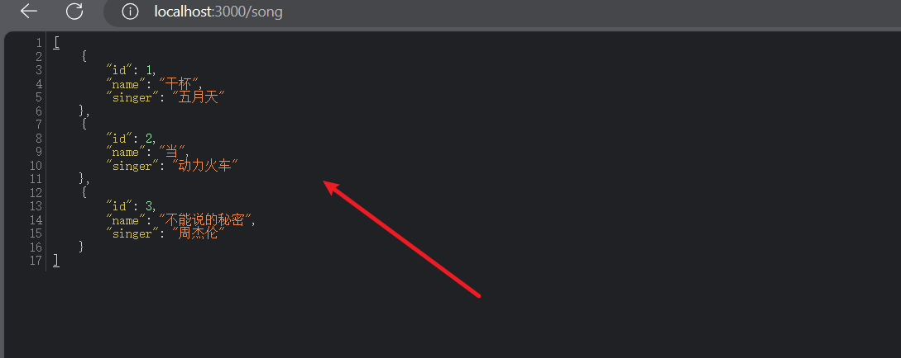
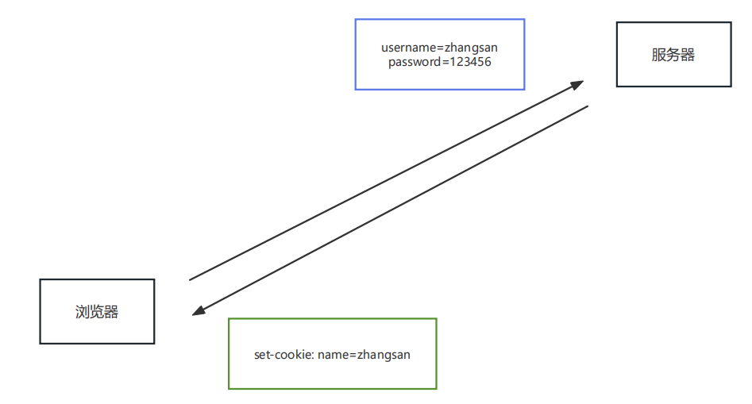
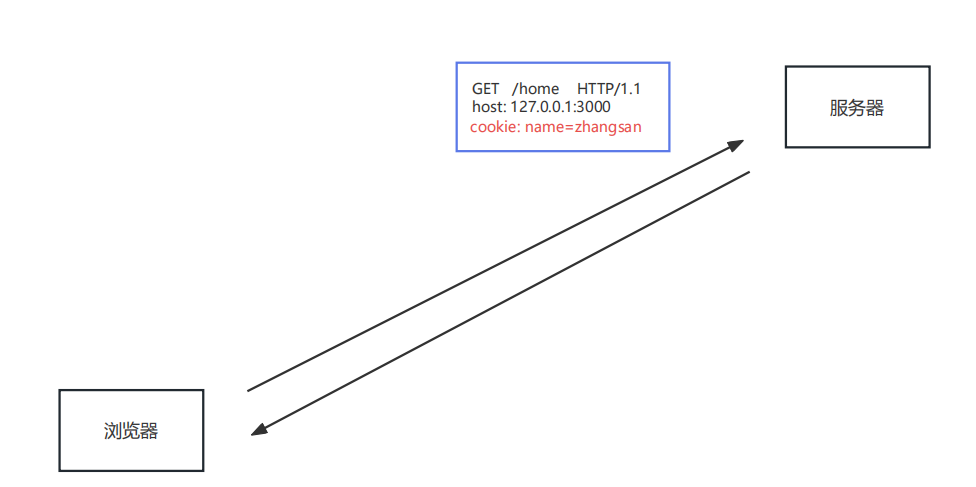
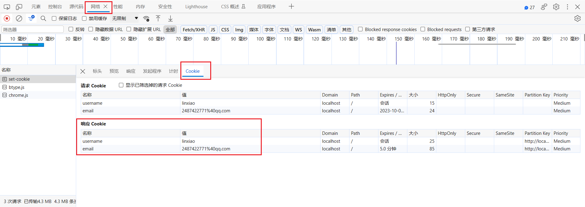
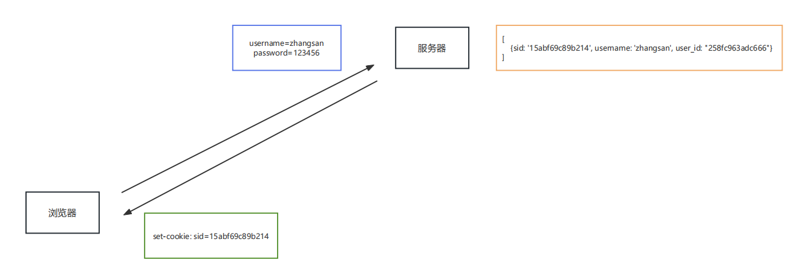
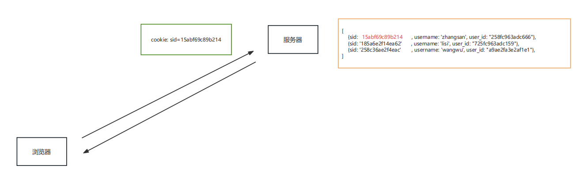
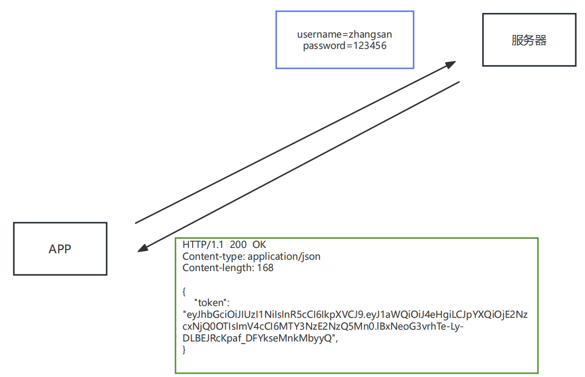
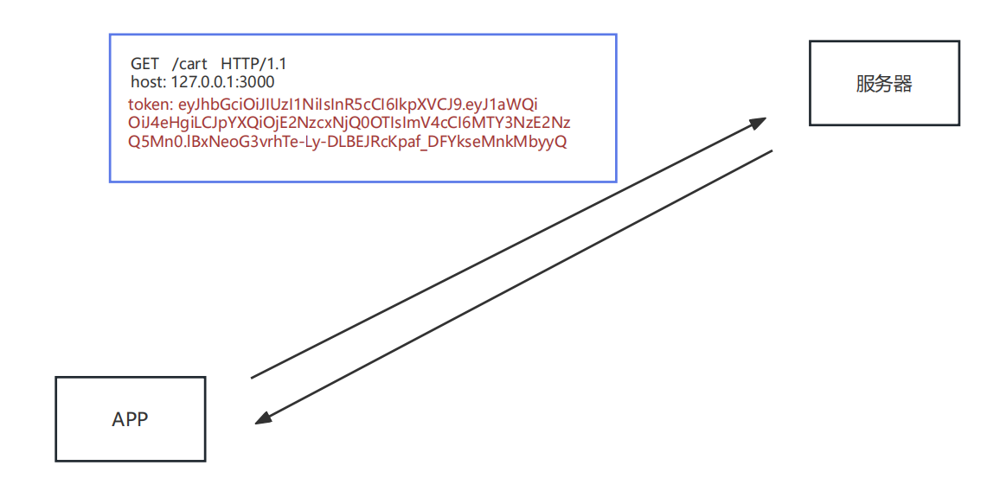
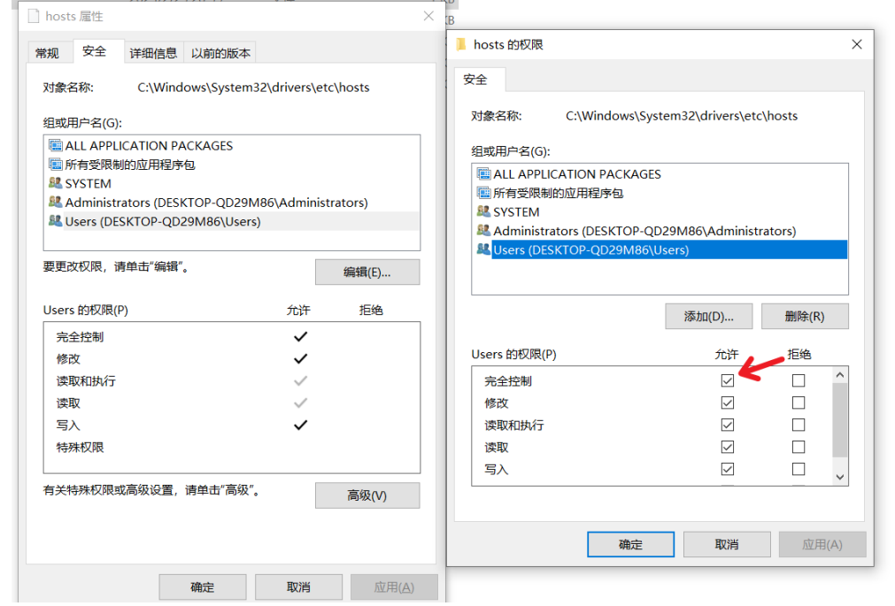
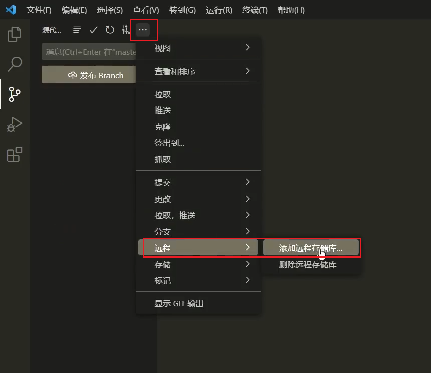

# 1、接口

接口是**前后端通信的桥梁**，接口的作用是实现**前后端通信**

- 大多数接口都是由 **后端工程师** 开发的， 开发语言不限
- 一般情况下接口都是由 **前端工程师** 调用的，但有时 **后端工程师也会调用接口** ，比如短信接口，支付接口等

> 这里的接口指的是『数据接口』， 与编程语言（Java，Go 等）中的接口语法不同

## 1.1、接口的组成

一个接口一般由如下几个部分组成：

- 请求方法
- 接口地址（URL）
- 请求参数
- 响应结果

> 接口示例：[身份证查询-免费API,收集所有免费的API (free-api.com)](https://www.free-api.com/doc/325)


## 1.2、RESTful API

RESTful API 是一种特殊风格的接口，主要特点有如下几个：

- URL 中的路径表示 **资源** ，路径中不能有 **动词** ，例如 `create` , `delete` , `update` 等这些都不能有
- 操作资源要与 **HTTP 请求方法** 对应
- 操作结果要与 **HTTP 响应状态码** 对应

规则示例：

| 操作           | 请求类型 | URL      | 返回                 |
| -------------- | -------- | -------- | -------------------- |
| 新增歌曲       | post     | /song    | 返回新生成的歌曲信息 |
| 删除歌曲       | delete   | /song/10 | 返回一个空文档       |
| 修改歌曲       | put      | /song/10 | 返回更新后的歌曲信息 |
| 获取所有的歌曲 | get      | /song    | 返回歌曲列表数组     |
| 获取单个歌曲   | get      | /song/10 | 返回单个歌曲信息     |

> 扩展阅读：[RESTful API 设计指南 - 阮一峰的网络日志 (ruanyifeng.com)](https://www.ruanyifeng.com/blog/2014/05/restful_api.html)

## 1.3、json-server

json-server 本身是一个 JS 编写的**工具包**，可以快速搭建 RESTful API 服务

- 官网地址：[typicode/json-server: Get a full fake REST API with zero coding in less than 30 seconds (seriously) (github.com)](https://github.com/typicode/json-server)

操作步骤：

1. 全局安装`json-server`

```bash
npm i -g json-server
```

2. 创建 JSON 文件，编写基本结构

```json
{
  "song": [
    { "id": 1, "name": "干杯", "singer": "五月天" },
    { "id": 2, "name": "当", "singer": "动力火车" },
    { "id": 3, "name": "不能说的秘密", "singer": "周杰伦" }
  ]
}
```

3. **以 JSON 文件所在文件夹作为工作目录** ，执行如下命令

```bash
json-server --watch db.json
```

4. 访问 `localhost:3000/song`




若想访问id为1的：`localhost:3000/song/1`


## 1.4、接口测试工具

### 1.4.1、apipost

- 官网：[Apipost-API 文档、设计、调试、自动化测试一体化协作平台](https://www.apipost.cn/)

和Postman使用类似，只是 apipost 是中文免费的。


### 1.4.2、apifox


### 1.4.3、postman


# 2、会话

所谓会话控制就是对**会话进行控制**，HTTP 是一种无状态的协议，它没有办法区分多次的请求是否来自于同一个客户端， **无法区分用户**。而产品中又大量存在的这样的需求，所以我们需要通过 会话控制 来解决该问题。

常见的会话控制技术有三种：

- cookie
- session
- token


## 2.1、cookie

cookie 是 HTTP **服务器发送到用户浏览器**并保存在本地的一小块数据

- ==cookie 是保存在浏览器端的一小块数据==
- ==cookie 是按照域名划分保存的==

### 2.1.1、特点

浏览器向服务器发送请求时，会自动将 **当前域名下** 可用的 cookie 设置在请求头中，然后传递给服务器

- 这个请求头的名字也叫 `cookie` ，所以将 cookie 理解为一个 HTTP 的**请求头**也是可以的


### 2.1.2、cookie的运行流程

填写账号和密码校验身份，校验通过后下发 cookie：




有了 cookie 之后，后续向服务器发送请求时，就会自动携带 cookie



> 不同浏览器中的 cookie 是相互独立的，不共享


### 2.1.3、cookie的代码操作

express 中可以使用 `cookie-parser` 进行处理

1. 下载`cookie-parser`

```bash
npm i cookie-parser
```

2. 引入 `cookie-parser` 包

```javascript
const cookieParser = require('cookie-parser');
```

3. 设置cookie

```javascript
//设置cookie
app.get('/set-cookie', (req, res) => {
  //不带时效性:关闭浏览器cookie就失效
  res.cookie('username','linxiao');
  //带时效性,单位是毫秒, 60×1000 是一分钟
  res.cookie('email','2487422771@qq.com',{maxAge:5*60*1000});
  //响应
  res.send('Cookie的设置');
});
```

4. 读取cookie

```javascript
// 读取cookie
app.get('/get-cookie',(req,res) => {
  //读取cookie
  console.log(req.cookies);
  res.send('Cookie的读取');
})
```

5. 删除cookie

```javascript
// 删除cookie
app.get('/delete-cookie',(req,res) => {
  //删除
  res.clearCookie('username');
  res.send('Cookie的清除');
})
```





## 2.2、session

- session 是保存在 **服务器端的一块儿数据** ，保存当前访问用户的相关信息。
- 作用：实现会话控制，可以识别用户的身份，快速获取当前用户的相关信息

### 2.2.1、session的运行流程

填写账号和密码校验身份，校验通过后创建 `session` 信息 ，然后将 `session_id` 的值通过响应头返回给浏览器




有了 cookie，下次发送请求时会自动携带 cookie，服务器通过 `cookie` 中的 `session_id` 的值确定用户的身份




### 2.2.2、session的代码操作

express 中可以使用 `express-session` 对 session 进行操作

1. 下载 `express-session 、 connect-mongo ` 包

```bash
npm i express-session connect-mongo
```

2. 引入 `express-session 、 connect-mongo`
   - express-session 是把数据存在了内存里面，不利于演示，所以下载了 `connect-mongo` 包

```javascript
const session = require("express-session");
const MongoStore = require('connect-mongo');
```

3. 设置`session`的中间件

```javascript
// 设置session的中间件
app.use(session({
  name: 'sid', // 设置响应cookie的name,默认值是: connect.sid
  secret: 'Augenestern', // 设置加密字符串,加盐,又称签名
  saveUninitialized: false, // 是否为每次请求都设置一个 cookie 用来存储 session 的id
  resave: true, // 是否在每次请求时重新保存session
  store: MongoStore.create({
    mongoUrl: 'mongodb://127.0.0.1:27017/bilibili' //数据库的连接配置
  }),
  cookie: {
    httpOnly: true,// 开启后前端无法通过 JS 操作cookie,例如document.cookie
    maxAge: 1000*300, // 是控制 sessionID 的过期时间的,300s
  }
}));
```

4. 创建session

```javascript
// 创建session
app.get('/login',(req,res) => {
  //设置session
  req.session.username = 'zhangsan';
  req.session.email = 'zhangsan@qq.com';
  res.send('登录成功');
});
```

5. 销毁session

```javascript
// 销毁session
app.get('/logout',(req,res) => {
  req.session.destroy(() => {
    res.send('成功退出');
  });
})
```


## 2.2、cookie和session的区别

cookie 和 session 的区别主要有如下几点：

1. 存在的位置
   - cookie：浏览器端
   - session：服务器端
2. 安全性
   - cookie 是以明文的方式存放在浏览器端的，安全性低
   - session存放于服务器端，安全性==相对==较好
3. 网络传输量
   - cookie 设置内容过多会增大报文体积， 会影响传输效率
   - session 数据存储在服务器，只是通过 cookie 传递 id，所以不影响传输效率
4. 存储限制
   - 浏览器限制单个 cookie 保存的数据不能超过 **4K** ，且单个域名下的存储数量也有限制
   - session 数据存储在服务器中，所以没有这些限制


## 2.3、token

- `token` 是**服务端生成并返回给 HTTP 客户端的一串加密字符串**， token 中保存着 用户信息
- 作用：实现会话控制，可以识别用户的身份，主要用于移动端 APP

### 2.3.1、token的运行流程

填写账号和密码校验身份，校验通过后响应 token，**token 一般是在响应体中返回给客户端的**




后续发送请求时，需要手动将 token 添加在请求报文中，一般是放在请求头中




### 2.3.2、token的特点

- 服务端压力更小
  - 数据存储在浏览器端
- 相对更安全
  - 数据加密
  - 可以避免CSRF跨站请求伪造
- 扩展性更强
  - 服务间可以共享
  - 增加服务节点更简单


### 2.3.3、JWT

`JWT（JSON Web Token）`是目前最流行的跨域认证解决方案，可用于基于 `token` 的身份验证

- **JWT 使 token 的生成与校验更规范**
- 我们可以使用 `jsonwebtoken` 包 来操作 token

---

1. 下载`jsonwebtoken` 包

```bash
npm i jsonwebtoken
```

2. 导入

```javascript
//导入 jsonwebtokan
const jwt = require('jsonwebtoken');
```

3. 创建token

```javascript
//创建 token
// jwt.sign(数据, 加密字符串, 配置对象)
let token = jwt.sign({
  username: 'zhangsan'
},'Augenetsern',{
  expiresIn: 60 // 单位是秒
});

console.log(token);
```

4. 解析token

```javascript
// 解析token
jwt.verify(token,'Augenestern',(err,data) => {
  if (err){
    console.log('校验失败');
    return;
  }
  console.log(data);
})
```


> 扩展阅读：[JSON Web Token 入门教程 - 阮一峰的网络日志 (ruanyifeng.com)](https://www.ruanyifeng.com/blog/2018/07/json_web_token-tutorial.html)


# 3、本地域名

所谓本地域名就是 **只能在本机使用的域名** ，一般在开发阶段使用

## 3.1、操作流程

1. 编辑文件 `C:\Windows\System32\drivers\etc\hosts` ，添加如下代码

```bash
127.0.0.1 www.baidu.com
```

如果修改失败， **可以修改该文件的权限**




这样我们访问项目的 `127.0.0.1` 的部分就可以直接替换为 `www.baidu.com`


## 3.2、原理

在地址栏输入域名之后，浏览器会先进行 DNS（Domain Name System） 查询，获取该域名对应的 IP 地址

- 请求会发送到 DNS 服务器，可以 根据域名返回 IP 地址
- 可以通过 `ipconfig /all` 查看本机的 DNS 服务器

- hosts 文件也可以设置域名与 IP 的映射关系，在发送请求前，可以通过该文件获取域名的 IP 地址


# 4、代码上传仓库

1. 打开VScode - 源代码管理 - **初始化仓库**
2. 创建`.gitignore` ，忽略 node_modules

```.gitignore
node_modules
/public/upload
```

3. 点击提交，这样**本地仓库**就建立好了
4. 在Gitee上新建仓库，复制**仓库地址**，如下操作




5. 粘贴URL地址，填写名字 origin
6. 继续填写Gitee的账号密码
7. 再点击`发布Branch`


