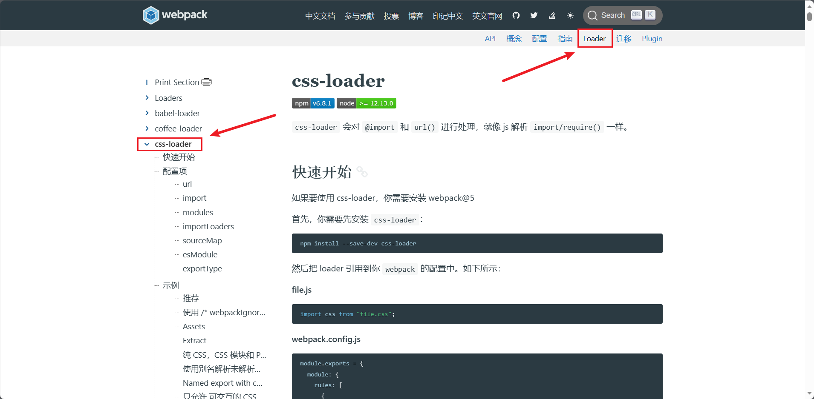
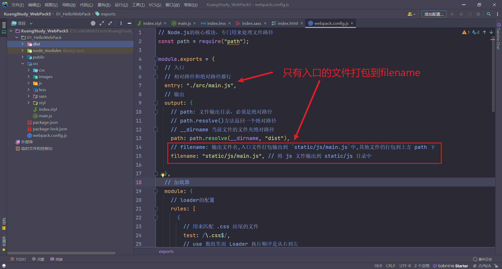
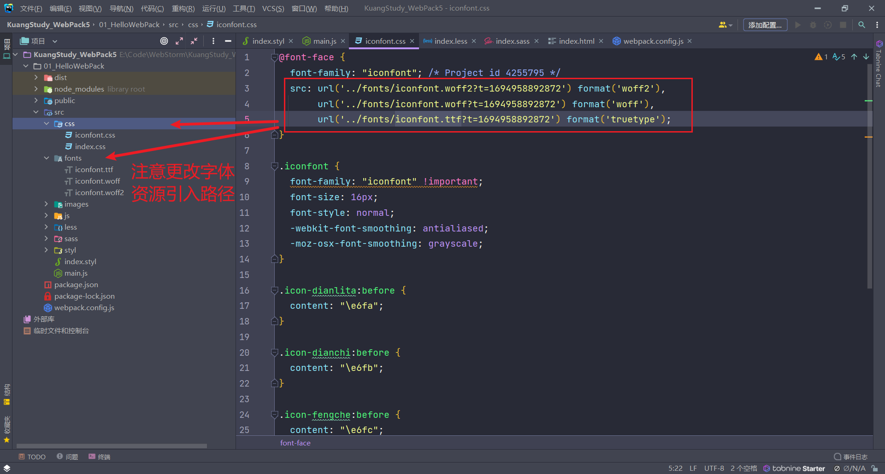
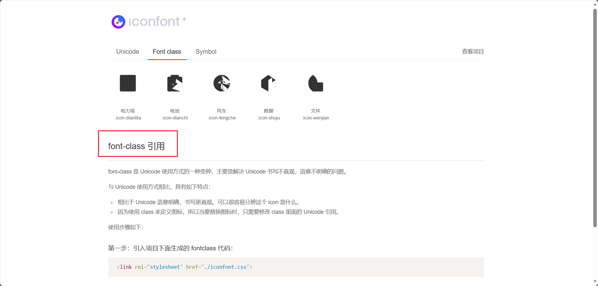

# 1、WebPack

**`Webpack` 是一个静态资源打包工具。**

- 它会以一个或多个文件作为打包的入口，将我们整个项目所有文件编译组合成一个或多个文件输出出去。
- 输出的文件就是编译好的文件，就可以在浏览器段运行了。
- 我们将 `Webpack` 输出的文件叫做 `bundle`。

Webpack 本身功能是有限的:

- 开发模式：仅能编译 JS 中的 `ES Module` 语法
- 生产模式：能编译 JS 中的 `ES Module` 语法，还能压缩 JS 代码

## 1.1、开始使用

1. 资源目录如下

```bash
01_HelloWebpack # 项目根目录（所有指令必须在这个目录运行）
    └── src # 项目源码目录
        ├── js # js文件目录
        │   ├── count.js
        │   └── sum.js
        └── main.js # 项目主文件
```

2. js中文件内容如下

- `count.js`

```javascript
export default function count(x, y) {
  return x - y;
}
```

- `sum.js`

```javascript
export default function sum(...args) {
  return args.reduce((p, c) => p + c, 0);
}
```

- `main.js`

```javascript
import count from "./js/count";
import sum from "./js/sum";

console.log(count(2, 1));
console.log(sum(1, 2, 3, 4));
```

3. 打开终端，来到项目根目录。运行以下指令：

```bash
# 初始化 package.json
npm init -y
```

此时会生成一个基础的 `package.json` 文件。需要注意的是 `package.json` 中 `name` 字段不能叫做 `webpack`, 否则下一步会报错

4. 下载 WebPack-cli 到开发依赖中

```bash
npm i webpack webpack-cli -D
```

5. 启用webpack

```bash
# 开发模式
npx webpack ./src/main.js --mode=development

# 生产模式
npx webpack ./src/main.js --mode=production
```

- `npm` 是用来下载包的，`npx` 会将 node_modules 中的 bin 目录临时添加为环境变量，这样就可以访问环境变量的应用程序，例如 webpack
  - `npx webpack`: 是用来运行本地安装 `Webpack` 包的
- webpack会以一个文件或多个文件作为入口
  - `./src/main.js`: 指定 `Webpack` 从 `main.js` 文件开始打包，不但会打包 `main.js`，还会将其依赖也一起打包进来。
- `--mode=xxx`：指定模式（环境）


6. 观察输出文件

默认 `Webpack` 会将文件打包输出到 `dist` 目录下，我们查看 `dist` 目录下文件情况就好了


> 注意：
>
> - `Webpack` 本身功能比较少，只能处理 `js` 资源，一旦遇到 `css` 等其他资源就会报错
> - 所以我们学习 `Webpack`，就是主要学习如何处理其他资源


## 1.2、基本配置

先熟悉WebPack五大核心概念：

1. `entry`：入口
   - 指示 Webpack 从哪个文件开始打包
2. `output` ：输出
   - 指示 Webpack 打包完的文件输出到哪里去，如何命名等
3. `loader` ： 加载器
   - webpack 本身只能处理 js、json 等资源，其他资源需要借助 loader
4. `plugins`：插件
   - 扩展 Webpack 的功能
5. `mode` : 模式
   - 开发模式：development
   - 生产模式：production

我们在项目根目录下新建 `webpack.config.js` 文件，如下：

```javascript
// Node.js的核心模块，专门用来处理文件路径
const path = require("path");

module.exports = {
  // 入口
  // 相对路径和绝对路径都行
  entry: "./src/main.js",
  // 输出
  output: {
    // path: 文件输出目录，必须是绝对路径
    // path.resolve()方法返回一个绝对路径
    // __dirname 当前文件的文件夹绝对路径
    path: path.resolve(__dirname, "dist"),
    // filename: 输出文件名
    filename: "main.js",
  },
  // 加载器
  module: {
    // loader的配置
    rules: [],
  },
  // 插件
  plugins: [],
  // 模式
  mode: "development", // 开发模式
};
```

此时因为配置了 webpack，所以这个时候运行打包webpack只需要：

```bash
npx webpack
```

> Webpack 将来都通过 `webpack.config.js` 文件进行配置，来增强 Webpack 的功能


# 2、处理样式资源

- Webpack 本身是不能识别样式资源的，所以我们需要借助 Loader 来帮助 Webpack 解析样式资源。

- 本章节我们学习使用 Webpack 如何处理 Css、Less、Sass、Scss、Styl 样式资源
- 我们找 Loader 都应该去官方文档中找到对应的 Loader，然后使用，官方文档找不到的话，可以从社区 Github 中搜索查询

> [Loaders | webpack 中文文档 (docschina.org)](https://webpack.docschina.org/loaders/)


## 2.1、处理Css资源




1. 首先安装 `css-loader` 和 `style-loader` 

```bash
# 把 css-loader、style-loader 加入开发依赖
npm i css-loader style-loader -D
```

> - `css-loader`：负责将 Css 文件编译成 Webpack 能识别的模块
> - `style-loader`：会动态创建一个 Style 标签，里面放置 Webpack 中 Css 模块内容

此时样式就会以 Style 标签的形式在页面上生效

2. 配置 `webpack.config.js`

```javascript
const path = require("path");

module.exports = {
  entry: "./src/main.js",
  output: {
    path: path.resolve(__dirname, "dist"),
    filename: "main.js",
  },
  module: {
    rules: [
      {
        // 用来匹配 .css 结尾的文件
        test: /\.css$/,
        // use 数组里面 Loader 执行顺序是从右到左
        use: ["style-loader", "css-loader"],
      },
    ],
  },
  plugins: [],
  mode: "development",
};

```

3. 添加`src/css/index.css`

```css
.box1 {
  width: 100px;
  height: 100px;
  background-color: pink;
}
```

修改`src/main.js`

```css
import count from "./js/count";
import sum from "./js/sum";
// 引入 Css 资源，Webpack才会对其打包
import "./css/index.css";

console.log(count(2, 1));
console.log(sum(1, 2, 3, 4));
```

添加`public/index.html`

```html
<!DOCTYPE html>
<html lang="en">
  <head>
    <meta charset="UTF-8" />
    <meta http-equiv="X-UA-Compatible" content="IE=edge" />
    <meta name="viewport" content="width=device-width, initial-scale=1.0" />
    <title>webpack5</title>
  </head>
  <body>
    <h1>Hello Webpack5</h1>
    <!-- 准备一个使用样式的 DOM 容器 -->
    <div class="box1"></div>
    <!-- 引入打包后的js文件，才能看到效果 -->
    <script src="../dist/main.js"></script>
  </body>
</html>
```

4. 运行指令，然后打开 `index.html` 页面查看效果

```bash
npx webpack
```


## 2.2、处理Less资源

1. 安装包

```bash
# 将 less 和 less-loader 下载到开发环境
npm install less less-loader --save-dev
```

> - `less-loader`：负责将 Less 文件编译成 Css 文件

2. 将该 loader 添加到 `webpack.config.js` 中

```javascript
// Node.js的核心模块，专门用来处理文件路径
const path = require("path");

module.exports = {
  // 入口
  // 相对路径和绝对路径都行
  entry: "./src/main.js",
  // 输出
  output: {
    // path: 文件输出目录，必须是绝对路径
    // path.resolve()方法返回一个绝对路径
    // __dirname 当前文件的文件夹绝对路径
    path: path.resolve(__dirname, "dist"),
    // filename: 输出文件名
    filename: "main.js",
  },
  // 加载器
  module: {
    // loader的配置
    rules: [
      {
        // 用来匹配 .css 结尾的文件
        test: /\.css$/,
        // use 数组里面 Loader 执行顺序是从右到左
        use: ["style-loader", "css-loader"],
      },
      {
        test: /\.less$/,
        use: ["style-loader", "css-loader", "less-loader"],
      },
    ],
  },
  // 插件
  plugins: [],
  // 模式
  mode: "development", // 开发模式
};

```

3. 添加文件 `src/less/index.less`

```less
.box2 {
  width: 100px;
  height: 100px;
  background-color: deeppink;
}
```

修改文件 `main.js`

```javascript
import count from "./js/count";
import sum from "./js/sum";
// 引入 Css 资源，Webpack才会对其打包
import "./css/index.css";
// 引入 Less 资源，Webpack才会对其打包
import "./less/index.less";

console.log(count(2, 1));
console.log(sum(1, 2, 3, 4));
```

修改`public/index.html`

```html
<!DOCTYPE html>
<html lang="en">
<head>
  <meta charset="UTF-8" />
  <meta http-equiv="X-UA-Compatible" content="IE=edge" />
  <meta name="viewport" content="width=device-width, initial-scale=1.0" />
  <title>webpack5</title>
</head>
<body>
<h1>Hello Webpack5</h1>
<!-- 准备一个使用样式的 DOM 容器 -->
<div class="box1"></div>
<div class="box2"></div>
<!-- 引入打包后的js文件，才能看到效果 -->
<script src="../dist/main.js"></script>
</body>
</html>
```


## 2.3、处理Sass和Scss资源

1. 安装包

```bash
# 将 sass sass-loader 下载到开发环境
npm i sass-loader sass -D
```

> - `sass-loader`：负责将 Sass 文件编译成 css 文件
> - `sass`：`sass-loader` 依赖 `sass` 进行编译

2. 将该 loader 添加到 `webpack.config.js` 中

```javascript
// Node.js的核心模块，专门用来处理文件路径
const path = require("path");

module.exports = {
  // 入口
  // 相对路径和绝对路径都行
  entry: "./src/main.js",
  // 输出
  output: {
    // path: 文件输出目录，必须是绝对路径
    // path.resolve()方法返回一个绝对路径
    // __dirname 当前文件的文件夹绝对路径
    path: path.resolve(__dirname, "dist"),
    // filename: 输出文件名
    filename: "main.js",
  },
  // 加载器
  module: {
    // loader的配置
    rules: [
      {
        // 用来匹配 .css 结尾的文件
        test: /\.css$/,
        // use 数组里面 Loader 执行顺序是从右到左
        use: ["style-loader", "css-loader"],
      },
      {
        test: /\.less$/,
        use: ["style-loader", "css-loader", "less-loader"],
      },
      {
        test: /\.s[ac]ss$/,
        use: ["style-loader", "css-loader", "sass-loader"],
      },
    ],
  },
  // 插件
  plugins: [],
  // 模式
  mode: "development", // 开发模式
};
```

3. 添加文件 `src/sass/index.sass`

```css
/* 可以省略大括号和分号 */
.box3
  width: 100px
  height: 100px
  background-color: hotpink
```

添加文件`src/sass/index.scss`

```css
.box4 {
  width: 100px;
  height: 100px;
  background-color: lightpink;
}
```

修改文件`main.js`

```javascript
import count from "./js/count";
import sum from "./js/sum";
// 引入资源，Webpack才会对其打包
import "./css/index.css";
import "./less/index.less";
import "./sass/index.sass";
import "./sass/index.scss";

console.log(count(2, 1));
console.log(sum(1, 2, 3, 4));
```

修改`public/index.html`

```html
<!DOCTYPE html>
<html lang="en">
<head>
  <meta charset="UTF-8" />
  <meta http-equiv="X-UA-Compatible" content="IE=edge" />
  <meta name="viewport" content="width=device-width, initial-scale=1.0" />
  <title>webpack5</title>
</head>
<body>
<h1>Hello Webpack5</h1>
<!-- 准备一个使用样式的 DOM 容器 -->
<div class="box1"></div>
<div class="box2"></div>
<div class="box3"></div>
<div class="box4"></div>
<!-- 引入打包后的js文件，才能看到效果 -->
<script src="../dist/main.js"></script>
</body>
</html>
```

4. 运行指令,打开 `index.html` 页面查看效果

```bash
npx webpack
```


## 2.4、处理Styl资源

1. 下载包

```bash
# 把stylus stylus-loader放到开发环境中
npm install stylus stylus-loader --save-dev
```

> `stylus-loader`：负责将 Styl 文件编译成 Css 文

2. 将该 loader 添加到 `webpack.config.js` 中

```javascript
// Node.js的核心模块，专门用来处理文件路径
const path = require("path");

module.exports = {
  // 入口
  // 相对路径和绝对路径都行
  entry: "./src/main.js",
  // 输出
  output: {
    // path: 文件输出目录，必须是绝对路径
    // path.resolve()方法返回一个绝对路径
    // __dirname 当前文件的文件夹绝对路径
    path: path.resolve(__dirname, "dist"),
    // filename: 输出文件名
    filename: "main.js",
  },
  // 加载器
  module: {
    // loader的配置
    rules: [
      {
        // 用来匹配 .css 结尾的文件
        test: /\.css$/,
        // use 数组里面 Loader 执行顺序是从右到左
        use: ["style-loader", "css-loader"],
      },
      {
        test: /\.less$/,
        use: ["style-loader", "css-loader", "less-loader"],
      },
      {
        test: /\.s[ac]ss$/,
        use: ["style-loader", "css-loader", "sass-loader"],
      },
      {
        test: /\.styl$/,
        use: ["style-loader", "css-loader", "stylus-loader"],
      },
    ],
  },
  // 插件
  plugins: [],
  // 模式
  mode: "development", // 开发模式
};

```

3. 添加文件 `src/styl/index.styl`

```css
/* 可以省略大括号、分号、冒号 */
.box 
  width 100px 
  height 100px 
  background-color pink
```

修改 `src/main.js`

```javascript
import count from "./js/count";
import sum from "./js/sum";
// 引入 Css 资源，Webpack才会对其打包
import "./css/index.css";
// 引入 Less 资源，Webpack才会对其打包
import "./less/index.less";
import "./sass/index.sass";
import "./sass/index.scss";
import "./styl/index.styl";

console.log(count(2, 1));
console.log(sum(1, 2, 3, 4));
```

修改`public/index.html`

```html
<!DOCTYPE html>
<html lang="en">
<head>
  <meta charset="UTF-8" />
  <meta http-equiv="X-UA-Compatible" content="IE=edge" />
  <meta name="viewport" content="width=device-width, initial-scale=1.0" />
  <title>webpack5</title>
</head>
<body>
<h1>Hello Webpack5</h1>
<!-- 准备一个使用样式的 DOM 容器 -->
<div class="box1"></div>
<div class="box2"></div>
<div class="box3"></div>
<div class="box4"></div>
<div class="box5"></div>
<!-- 引入打包后的js文件，才能看到效果 -->
<script src="../dist/main.js"></script>
</body>
</html>
```

4. 运行指令

```bash
npx webpack
```


# 3、处理图片资源


- 过去在 Webpack4 时，我们处理图片资源通过 `file-loader` 和 `url-loader` 进行处理
- 现在 Webpack5 已经将两个 Loader 功能内置到 Webpack 里了，我们只需要简单配置即可处理图片资源

```javascript
// Node.js的核心模块，专门用来处理文件路径
const path = require("path");

module.exports = {
  // 入口
  // 相对路径和绝对路径都行
  entry: "./src/main.js",
  // 输出
  output: {
    // path: 文件输出目录，必须是绝对路径
    // path.resolve()方法返回一个绝对路径
    // __dirname 当前文件的文件夹绝对路径
    path: path.resolve(__dirname, "dist"),
    // filename: 输出文件名
    filename: "main.js",
  },
  // 加载器
  module: {
    // loader的配置
    rules: [
      {
        // 用来匹配 .css 结尾的文件
        test: /\.css$/,
        // use 数组里面 Loader 执行顺序是从右到左
        use: ["style-loader", "css-loader"],
      },
      {
        test: /\.less$/,
        use: ["style-loader", "css-loader", "less-loader"],
      },
      {
        test: /\.s[ac]ss$/,
        use: ["style-loader", "css-loader", "sass-loader"],
      },
      {
        test: /\.styl$/,
        use: ["style-loader", "css-loader", "stylus-loader"],
      },
      {
        test: /\.(png|jpe?g|gif|webp)$/,
        type: "asset",
      },
    ],
  },
  // 插件
  plugins: [],
  // 模式
  mode: "development", // 开发模式
};
```

2. 添加图片资源

   - `src/images/1.jpeg`

   - `src/images/2.png`

3. 使用图片资源

   - `src/less/index.less`

     ```less
     .box2 {
       width: 100px;
       height: 100px;
       //background-color: deeppink;
     
       background-image: url("../images/1.jpeg");
       // 保证图片的原宽高比
       background-size: cover;
     
     }
     ```

   - `src/sass/index.sass`

     ```css
     /* 可以省略大括号和分号 */
     .box3
       width: 100px
       height: 100px
       //background-color: hotpink
       background-image: url("../images/2.png")
       background-size: cover
     ```

     

4. 运行指令

   ```bash
   npx webpack
   ```

   打开 index.html 页面查看效果


## 3.1、输出资源情况

此时如果查看 dist 目录的话，会发现多了三张图片资源，因为 Webpack 会将所有打包好的资源输出到 dist 目录下。

> - 为什么样式资源没有呢？
>   - 因为经过 `style-loader` 的处理，样式资源打包到 main.js 里面去了，所以没有额外输出出来


## 3.2、对图片资源进行优化

将小于某个大小的图片转化成 data URI 形式（Base64 格式）

```javascript
// Node.js的核心模块，专门用来处理文件路径
const path = require("path");

module.exports = {
  // 入口
  // 相对路径和绝对路径都行
  entry: "./src/main.js",
  // 输出
  output: {
    // path: 文件输出目录，必须是绝对路径
    // path.resolve()方法返回一个绝对路径
    // __dirname 当前文件的文件夹绝对路径
    path: path.resolve(__dirname, "dist"),
    // filename: 输出文件名
    filename: "main.js",
  },
  // 加载器
  module: {
    // loader的配置
    rules: [
      {
        // 用来匹配 .css 结尾的文件
        test: /\.css$/,
        // use 数组里面 Loader 执行顺序是从右到左
        use: ["style-loader", "css-loader"],
      },
      {
        test: /\.less$/,
        use: ["style-loader", "css-loader", "less-loader"],
      },
      {
        test: /\.s[ac]ss$/,
        use: ["style-loader", "css-loader", "sass-loader"],
      },
      {
        test: /\.styl$/,
        use: ["style-loader", "css-loader", "stylus-loader"],
      },
      {
        test: /\.(png|jpe?g|gif|webp)$/,
        type: "asset",
        parser: {
          dataUrlCondition: {
            maxSize: 10 * 1024 // 小于10kb的图片会被base64处理
          }
        }
      },
    ],
  },
  // 插件
  plugins: [],
  // 模式
  mode: "development", // 开发模式
};
```

之后再运行

```bash
npx webpack
```

这样 `dist` 目录就只会有大于10Kb的图片了，因为小于10kb的图片会被 base64 处理

> base64：将图片转换成一串序列
>
> - 优点：减少请求数量
> - 缺点：转换后体积变得更大


# 4、修改输出资源的名称和路径

从上方我们可以发现，打包的资源都集中在了 `dist` 目录，这会很乱，我们想让图片打包到图片文件夹下，js 打包到 js 文件夹下该怎么做呢？

在 `webpack.config.js` 中进行修改：

```javascript
// Node.js的核心模块，专门用来处理文件路径
const path = require("path");

module.exports = {
  // 入口
  // 相对路径和绝对路径都行
  entry: "./src/main.js",
  // 输出
  output: {
    // path: 文件输出目录，必须是绝对路径
    // path.resolve()方法返回一个绝对路径
    // __dirname 当前文件的文件夹绝对路径
    path: path.resolve(__dirname, "dist"),
    // filename: 输出文件名,入口文件打包输出到 `static/js/main.js`中,其他文件仍打包到上方 path 下
    filename: "static/js/main.js", // 将 js 文件输出到 static/js 目录中

  },
  // 加载器
  module: {
    // loader的配置
    rules: [
      {
        // 用来匹配 .css 结尾的文件
        test: /\.css$/,
        // use 数组里面 Loader 执行顺序是从右到左
        use: ["style-loader", "css-loader"],
      },
      {
        test: /\.less$/,
        use: ["style-loader", "css-loader", "less-loader"],
      },
      {
        test: /\.s[ac]ss$/,
        use: ["style-loader", "css-loader", "sass-loader"],
      },
      {
        test: /\.styl$/,
        use: ["style-loader", "css-loader", "stylus-loader"],
      },
      {
        test: /\.(png|jpe?g|gif|webp)$/,
        type: "asset",
        parser: {
          dataUrlCondition: {
            maxSize: 10 * 1024 // 小于10kb的图片会被base64处理
          }
        },
        generator: {
          // 将图片文件输出到 static/imgs 目录中
          // 将图片文件命名 [hash:8][ext][query]
          // [hash:8]: hash值取8位
          // [ext]: 使用之前的文件扩展名
          // [query]: 添加之前的query参数
          filename: "static/imgs/[hash:8][ext][query]",
        },
      },
    ],
  },
  // 插件
  plugins: [],
  // 模式
  mode: "development", // 开发模式
};
```




之后清空打包的文件夹`dist` ，也就是删除 `dist` 文件夹，然后执行如下命令

```bash
npx webpack
```

这样js打包的文件夹就变成了 `dist/static/js`，图片打包的文件夹就变成了 `static/imgs`

修改 `public/index.html`

```html
<!DOCTYPE html>
<html lang="en">
<head>
  <meta charset="UTF-8" />
  <meta http-equiv="X-UA-Compatible" content="IE=edge" />
  <meta name="viewport" content="width=device-width, initial-scale=1.0" />
  <title>webpack5</title>
</head>
<body>
<h1>Hello Webpack5</h1>
<!-- 准备一个使用样式的 DOM 容器 -->
<div class="box1"></div>
<div class="box2"></div>
<div class="box3"></div>
<div class="box4"></div>
<div class="box5"></div>
<!-- 修改 js 资源路径 -->
<script src="../dist/static/js/main.js"></script>
</body>
</html>
```


## 4.1、自动清空上次打包资源

手动清空打包资源比较麻烦，我们配置一下：`clean: true`

```javascript
// Node.js的核心模块，专门用来处理文件路径
const path = require("path");

module.exports = {
  // 入口
  // 相对路径和绝对路径都行
  entry: "./src/main.js",
  // 输出
  output: {
    // path: 文件输出目录，必须是绝对路径
    // path.resolve()方法返回一个绝对路径
    // __dirname 当前文件的文件夹绝对路径
    path: path.resolve(__dirname, "dist"),
    // filename: 输出文件名,入口文件打包输出到 `static/js/main.js`中,其他文件仍打包到上方 path 下
    filename: "static/js/main.js", // 将 js 文件输出到 static/js 目录中
    clean: true, // 自动将上次打包目录资源清空
    
  },
  // 加载器
  module: {
    // loader的配置
    rules: [
      {
        // 用来匹配 .css 结尾的文件
        test: /\.css$/,
        // use 数组里面 Loader 执行顺序是从右到左
        use: ["style-loader", "css-loader"],
      },
      {
        test: /\.less$/,
        use: ["style-loader", "css-loader", "less-loader"],
      },
      {
        test: /\.s[ac]ss$/,
        use: ["style-loader", "css-loader", "sass-loader"],
      },
      {
        test: /\.styl$/,
        use: ["style-loader", "css-loader", "stylus-loader"],
      },
      {
        test: /\.(png|jpe?g|gif|webp)$/,
        type: "asset",
        parser: {
          dataUrlCondition: {
            maxSize: 10 * 1024 // 小于10kb的图片会被base64处理
          }
        },
        generator: {
          // 将图片文件输出到 static/imgs 目录中
          // 将图片文件命名 [hash:8][ext][query]
          // [hash:8]: hash值取8位
          // [ext]: 使用之前的文件扩展名
          // [query]: 添加之前的query参数
          filename: "static/imgs/[hash:8][ext][query]",
        },
      },
    ],
  },
  // 插件
  plugins: [],
  // 模式
  mode: "development", // 开发模式
};
```


# 5、处理字体图标资源

1. 打开[阿里巴巴矢量图标库](https://www.iconfont.cn/)
2. 挑选自己喜欢的图标，加入到购物车，在右上角购物车里面选择 - 添加到项目 - 下载到本地
3. 解压
4. 将 `.ttf、.woff、.woff2` 后缀的文件复制进 `src/fonts` 下
5. 将 `iconfont.css` 复制进 `src/css` 下
   - 注意字体文件路径需要修改




6. 在`src/main.js` 中引用资源

```javascript
import count from "./js/count";
import sum from "./js/sum";
// 引入 Css 资源，Webpack才会对其打包
import "./css/index.css";
// 引入 Less 资源，Webpack才会对其打包
import "./less/index.less";
import "./sass/index.sass";
import "./sass/index.scss";
import "./styl/index.styl";
import "./css/iconfont.css";

console.log(count(2, 1));
console.log(sum(1, 2, 3, 4));
```

7. 在 `public/index.html` 中使用字体图标

```html
<!DOCTYPE html>
<html lang="en">
<head>
  <meta charset="UTF-8" />
  <meta http-equiv="X-UA-Compatible" content="IE=edge" />
  <meta name="viewport" content="width=device-width, initial-scale=1.0" />
  <title>webpack5</title>
</head>
<body>
<h1>Hello Webpack5</h1>
<!-- 准备一个使用样式的 DOM 容器 -->
<div class="box1"></div>
<div class="box2"></div>
<div class="box3"></div>
<div class="box4"></div>
<div class="box5"></div>
<!-- 使用字体图标 -->
<i class="iconfont icon-dianlita"></i>
<i class="iconfont icon-dianchi"></i>
<i class="iconfont icon-fengche"></i>
<i class="iconfont icon-shuju"></i>
<i class="iconfont icon-wenjian"></i>
<!-- 修改 js 资源路径 -->
<script src="../dist/static/js/main.js"></script>
</body>
</html>
```

> 这里使用字体图标文件怎么使用呢，可以在下载的解压包里面的`demo_index.html` 查看用法，我这里用的是 Font Css 用法




8. 在 `webpack.config.js` 中配置打包目录

```javascript
{
    	// 开发中可能还存在一些其他资源，如音视频等，我们也一起处理了
        test: /\.(ttf|woff2?|map4|map3|avi)$/,
        type: "asset/resource",
            generator: {
                filename: "static/media/[hash:8][ext][query]",
            },
},
```

`type: "asset/resource"`和`type: "asset"`的区别：

- `type: "asset/resource"` 相当于`file-loader`, 将文件转化成 Webpack 能识别的资源，其他不做处理
- `type: "asset"` 相当于`url-loader`, 将文件转化成 Webpack 能识别的资源，同时小于某个大小的资源会处理成 data URI 形式

9. 运行指令

```bash
npx webpack
```

打开 index.html 页面查看效果


# 


