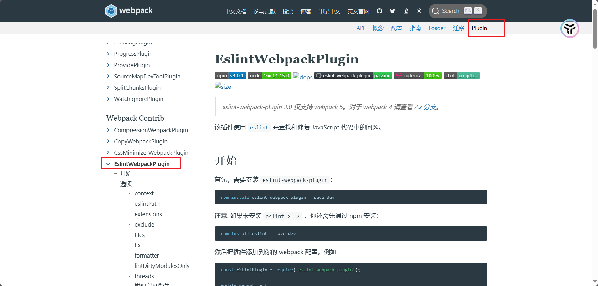
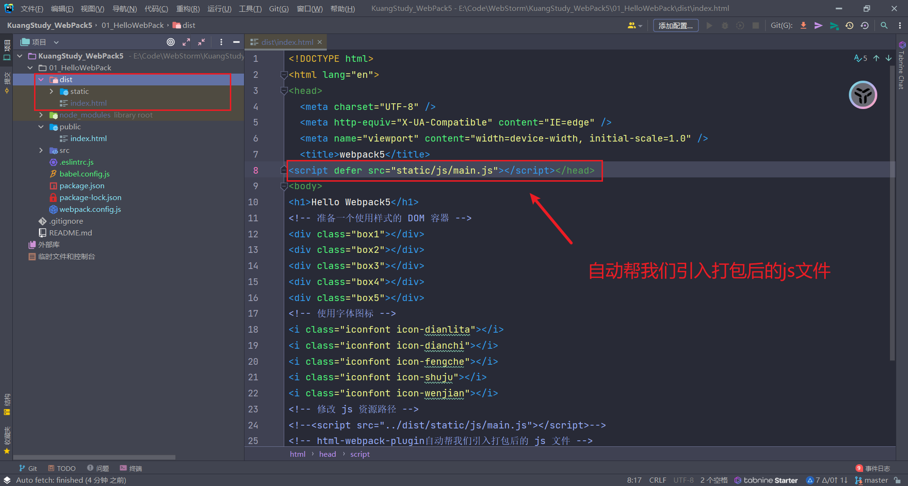

# 1、处理js资源

Webpack 对 js 处理是有限的，只能编译 js 中 ES 模块化语法，不能编译其他语法，导致 js 不能在 IE 等浏览器运行，所以我们希望做一些兼容性处理。

- 针对 js 兼容性处理，我们使用 Babel 来完成
- 针对代码格式，我们使用 Eslint 来完成

我们先完成 Eslint，检测代码格式无误后，在由 Babel 做代码兼容性处理


## 1.1、Eslint

我们使用 Eslint，关键是写 Eslint 配置文件，里面写上各种 rules 规则，将来运行 Eslint 时就会以写的规则对代码进行检查


配置文件有很多种写法：

- `.eslintrc.*`：新建文件，位于项目根目录
  - `.eslintrc`
  - `.eslintrc.js`
  - `.eslintrc.json`
  - 区别在于配置格式不一样
- `package.json` 中 `eslintConfig`：不需要创建文件，在原有文件基础上写

ESLint 会查找和自动读取它们，所以以上配置文件只需要存在一个即可，我们以 `.eslintrc.js` 配置文件为例，先简单看下部分配置：

```javascript
module.exports = {
  // 解析选项
  parserOptions: {},
  // 具体检查规则
  rules: {},
  // 继承其他规则
  extends: [],
  // ...
  // 其他规则详见：https://eslint.bootcss.com/docs/user-guide/configuring
};
```

`parserOptions` 解析选项

```javascript
parserOptions: {
  ecmaVersion: 6, // ES 语法版本
  sourceType: "module", // ES 模块化
  ecmaFeatures: { // ES 其他特性
    jsx: true // 如果是 React 项目，就需要开启 jsx 语法
  }
}
```

`rules` 具体规则

- `"off"` 或 `0` - 关闭规则
- `"warn"` 或 `1` - 开启规则，使用警告级别的错误：`warn` (不会导致程序退出)
- `"error"` 或 `2` - 开启规则，使用错误级别的错误：`error` (当被触发的时候，程序会退出)

```javascript
rules: {
  semi: "error", // 禁止使用分号
  'array-callback-return': 'warn', // 强制数组方法的回调函数中有 return 语句，否则警告
  'default-case': [
    'warn', // 要求 switch 语句中有 default 分支，否则警告
    { commentPattern: '^no default$' } // 允许在最后注释 no default, 就不会有警告了
  ],
  eqeqeq: [
    'warn', // 强制使用 === 和 !==，否则警告
    'smart' // https://eslint.bootcss.com/docs/rules/eqeqeq#smart 除了少数情况下不会有警告
  ],
}
```

`extends` 继承：开发中一点点写 rules 规则太费劲了，所以有更好的办法，继承现有的规则，现有以下较为有名的规则：

- [Eslint 官方的规则open in new window](https://eslint.bootcss.com/docs/rules/)：`eslint:recommended`
- [Vue Cli 官方的规则open in new window](https://github.com/vuejs/vue-cli/tree/dev/packages/@vue/cli-plugin-eslint)：`plugin:vue/essential`
- [React Cli 官方的规则open in new window](https://github.com/facebook/create-react-app/tree/main/packages/eslint-config-react-app)：`react-app`

```javascript
// 例如在React项目中，我们可以这样写配置
module.exports = {
  extends: ["react-app"],
  rules: {
    // 我们的规则会覆盖掉react-app的规则
    // 所以想要修改规则直接改就是了
    eqeqeq: ["warn", "smart"],
  },
};
```


## 1.2、在webpack中使用Eslint



1. 下载包`eslint-webpack-plugin、eslint`

```bash
npm i eslint-webpack-plugin eslint -D
```

2. 在项目根目录创建 `.eslintrc.js` 文件

```javascript
module.exports = {
  // 继承 Eslint 规则
  extends: ["eslint:recommended"],
  env: {
    node: true, // 启用node中全局变量
    browser: true, // 启用浏览器中全局变量
  },
  parserOptions: {
    ecmaVersion: 6, // es6
    sourceType: "module", // es6 模块化
  },
  rules: {
    "no-var": 2, // 不能使用 var 定义变量
  },
};
```

3. 在 `webpack.config.js` 中引入插件

```javascript
const ESLintWebpackPlugin = require("eslint-webpack-plugin");
```

3. 在 `webpack.config.js` 中配置

```javascript
// 插件
plugins: [
    new ESLintWebpackPlugin({
        // 指定检查文件的根目录(这里检查 src 文件夹,因为src 是我们写代码的地方)
        context: path.resolve(__dirname, "src"),
    }),
],
```

> VsCode `Eslint`插件
>
> - 打开 VSCode，下载 Eslint 插件，就可以在写代码的时候检查编码错误
>
> - 但是此时就会对项目所有文件默认进行 Eslint 检查了，我们 dist 目录下的打包后文件就会报错。但是我们只需要检查 src 下面的文件，不需要检查 dist 下面的文件。
>
> - 所以可以使用 Eslint 忽略文件解决。在项目根目录新建· `.eslintignore`
>
>   ```
>   # 忽略dist目录下所有文件
>   dist
>   ```


## 1.3、Babel

JavaScript 编译器：主要用于将 ES6 语法编写的代码转换为向后兼容的 JavaScript 语法，以便能够运行在当前和旧版本的浏览器或其他环境中

Babel的配置文件有很多种写法：

- `babel.config.*` ：新建文件，位于项目根目录
  - `babel.config.js`
  - `babel.config.json`
- `.babelrc.*` ： 新建文件，位于项目根目录
  - `.babelrc`
  - `.babelrc.js`
  - `.babelrc.json`
- `package.json` 中的`babel`： 不需要新建文件，在原有文件基础上写

Babel 会查找和自动读取它们，所以以上配置文件只需要存在一个即可，我们以 `babel.config.js` 配置文件为例：

```javascript
module.exports = {
  // 预设
  presets: [],
};
```

`presets` 预设：就是一组 Babel 插件, 扩展 Babel 功能

- `@babel/preset-env`: 一个智能预设，允许您使用最新的 JavaScript。
- `@babel/preset-react`：一个用来编译 React jsx 语法的预设
- `@babel/preset-typescript`：一个用来编译 TypeScript 语法的预设

## 1.4、在webpack中使用

1. 下载包

```bash
npm i babel-loader @babel/core @babel/preset-env -D
```

2. 在项目根目录下创建`babel.config.js`

```javascript
module.exports = {
  // 智能预设:能编译ES6的语法
  presets: ["@babel/preset-env"],
};
```

3. 在 `webpack.config.js` 中配置

```javascript
{
    test: /\.js$/,
        exclude: /node_modules/, // 排除node_modules代码不编译
            use: {
                loader: "babel-loader",
            }
},
```

# 2、处理HTML资源


1. 下载包

```bash
npm i html-webpack-plugin -D
```

2. 在 `webpack.config.js` 中引入

```javascript
const HtmlWebpackPlugin = require("html-webpack-plugin");
```

3. 在 `webpack.config.js` 中进行配置

```javascript
plugins: [
    new ESLintWebpackPlugin({
      // 指定检查文件的根目录
      context: path.resolve(__dirname, "src"),
    }),
    new HtmlWebpackPlugin({
      // 以 public/index.html 为模板创建文件
      // 新的html文件有两个特点：1. 内容和源文件一致 2. 自动引入打包生成的js等资源
      template: path.resolve(__dirname, "public/index.html"),
    }),
  ],
```

4. 运行指令

```bash
npx webpack
```

在 `dist` 下会自动生成 `index.html` 文件，里面自动引入打包后的 js 文件




# 3、开发服务器&自动化

每次写完代码都需要手动输入指令才能编译代码，太麻烦了，我们希望一切自动化。

1. 下载包

```bash
npm i webpack-dev-server -D
```

2. 在 `webpack.config.js` 中进行配置

```javascript
  // 开发服务器 devServer 和 mode 在同一级别
  devServer: {
    host: "localhost", // 启动服务器域名
    port: "3000", // 启动服务器端口号
    open: true, // 是否自动打开浏览器
  },
  mode: "development",
```

3. 运行指令

```bash
npx webpack serve
```

> **注意运行指令发生了变化**

并且当你使用开发服务器时，所有代码都会在内存中编译打包，并不会输出到 dist 目录下。开发时我们只关心代码能运行，有效果即可，至于代码被编译成什么样子，我们并不需要知道


# 4、生产模式介绍

生产模式是开发完成代码后，我们需要得到代码将来部署上线。这个模式下我们主要对代码进行优化，让其运行性能更好。优化主要从两个角度出发:

1. 优化代码运行性能
2. 优化代码打包速度

我们需要准备两个配置文件来放不同的配置，在项目根目录下新建：

- `config/webpack.dev.js` : 开发环境
- `config/webpack.prod.js` ：生产环境

修改 `webpack.dev.js` ，因为文件目录变了，所以**所有绝对路径需要回退一层目录才能找到对应的文件，相对路径不用变**

```javascript
// Node.js的核心模块，专门用来处理文件路径
const path = require("path");
const ESLintWebpackPlugin = require("eslint-webpack-plugin");
const HtmlWebpackPlugin = require("html-webpack-plugin");


module.exports = {
  // 入口
  // 相对路径和绝对路径都行
  entry: "./src/main.js",
  // 输出
  output: {
    // path: 文件输出目录，必须是绝对路径
    path: undefined, // 开发模式没有输出,不需要指定输出路径
    // filename: 输出文件名,入口文件打包输出到 `static/js/main.js`中,其他文件仍打包到上方 path 下
    filename: "static/js/main.js", // 将 js 文件输出到 static/js 目录中
    //clean: true, // 开发模式没有输出,不需要清空输出结果

  },
  // 加载器
  module: {
    // loader的配置
    rules: [
      {
        // 用来匹配 .css 结尾的文件
        test: /\.css$/,
        // use 数组里面 Loader 执行顺序是从右到左
        use: ["style-loader", "css-loader"],
      },
      {
        test: /\.less$/,
        use: ["style-loader", "css-loader", "less-loader"],
      },
      {
        test: /\.s[ac]ss$/,
        use: ["style-loader", "css-loader", "sass-loader"],
      },
      {
        test: /\.styl$/,
        use: ["style-loader", "css-loader", "stylus-loader"],
      },
      {
        test: /\.(png|jpe?g|gif|webp)$/,
        type: "asset",
        parser: {
          dataUrlCondition: {
            maxSize: 10 * 1024 // 小于10kb的图片会被base64处理
          }
        },
        generator: {
          // 将图片文件输出到 static/imgs 目录中
          // 将图片文件命名 [hash:8][ext][query]
          // [hash:8]: hash值取8位
          // [ext]: 使用之前的文件扩展名
          // [query]: 添加之前的query参数
          filename: "static/imgs/[hash:8][ext][query]",
        },
      },
      {
        // 开发中可能还存在一些其他资源，如音视频等，我们也一起处理了
        test: /\.(ttf|woff2?|map4|map3|avi)$/,
        type: "asset/resource",
        generator: {
          filename: "static/media/[hash:8][ext][query]",
        },
      },
      {
        test: /\.js$/,
        exclude: /node_modules/, // 排除node_modules代码不编译
        use: {
          loader: "babel-loader",
        }
      },
    ],
  },
  // 插件
  plugins: [
    new ESLintWebpackPlugin({
      // 指定检查文件的根目录(这里检查 src 文件夹)
      context: path.resolve(__dirname, "../src"),
    }),
    new HtmlWebpackPlugin({
      // 以 public/index.html 为模板创建文件
      // 新的html文件有两个特点：1. 内容和源文件一致 2. 自动引入打包生成的js等资源
      template: path.resolve(__dirname, "../public/index.html"),
    }),
  ],
  // 开发服务器
  devServer: {
    host: "localhost", // 启动服务器域名
    port: "3000", // 启动服务器端口号
    open: true, // 是否自动打开浏览器
  },
  // 模式
  mode: "development", // 开发模式
};
```

`webpack.prod.js` 生产模式内容如下：

```javascript
// Node.js的核心模块，专门用来处理文件路径
const path = require("path");
const ESLintWebpackPlugin = require("eslint-webpack-plugin");
const HtmlWebpackPlugin = require("html-webpack-plugin");


module.exports = {
  // 入口
  // 相对路径和绝对路径都行
  entry: "./src/main.js",
  // 输出
  output: {
    // path: 文件输出目录，必须是绝对路径
    // path.resolve()方法返回一个绝对路径
    // __dirname 当前文件的文件夹绝对路径
    path: path.resolve(__dirname, "../dist"),   // 生产模式需要输出
    // filename: 输出文件名,入口文件打包输出到 `static/js/main.js`中,其他文件仍打包到上方 path 下
    filename: "static/js/main.js", // 将 js 文件输出到 static/js 目录中
    clean: true, // 自动将上次打包目录资源清空

  },
  // 加载器
  module: {
    // loader的配置
    rules: [
      {
        // 用来匹配 .css 结尾的文件
        test: /\.css$/,
        // use 数组里面 Loader 执行顺序是从右到左
        use: ["style-loader", "css-loader"],
      },
      {
        test: /\.less$/,
        use: ["style-loader", "css-loader", "less-loader"],
      },
      {
        test: /\.s[ac]ss$/,
        use: ["style-loader", "css-loader", "sass-loader"],
      },
      {
        test: /\.styl$/,
        use: ["style-loader", "css-loader", "stylus-loader"],
      },
      {
        test: /\.(png|jpe?g|gif|webp)$/,
        type: "asset",
        parser: {
          dataUrlCondition: {
            maxSize: 10 * 1024 // 小于10kb的图片会被base64处理
          }
        },
        generator: {
          // 将图片文件输出到 static/imgs 目录中
          // 将图片文件命名 [hash:8][ext][query]
          // [hash:8]: hash值取8位
          // [ext]: 使用之前的文件扩展名
          // [query]: 添加之前的query参数
          filename: "static/imgs/[hash:8][ext][query]",
        },
      },
      {
        // 开发中可能还存在一些其他资源，如音视频等，我们也一起处理了
        test: /\.(ttf|woff2?|map4|map3|avi)$/,
        type: "asset/resource",
        generator: {
          filename: "static/media/[hash:8][ext][query]",
        },
      },
      {
        test: /\.js$/,
        exclude: /node_modules/, // 排除node_modules代码不编译
        use: {
          loader: "babel-loader",
        }
      },
    ],
  },
  // 插件
  plugins: [
    new ESLintWebpackPlugin({
      // 指定检查文件的根目录(这里检查 src 文件夹)
      context: path.resolve(__dirname, "../src"),
    }),
    new HtmlWebpackPlugin({
      // 以 public/index.html 为模板创建文件
      // 新的html文件有两个特点：1. 内容和源文件一致 2. 自动引入打包生成的js等资源
      template: path.resolve(__dirname, "../public/index.html"),
    }),
  ],
  // 开发服务器
  //devServer: {
  //  host: "localhost", // 启动服务器域名
  //  port: "3000", // 启动服务器端口号
  //  open: true, // 是否自动打开浏览器
  //},
  // 模式
  mode: "production", // 生产模式
};
```

这样我们运行开发模式和生产模式的指令分别为：

```bash
# 开发模式
npx webpack --config ./config/webpack.dev.js

# 生产模式
npx webpack --config ./config/webpack.prod.js
```

为了方便运行不同模式的指令，我们将指令定义在 package.json 中 scripts 里面：

```json
"scripts": {
    "start": "npm run dev",
    "dev": "npx webpack serve --config ./config/webpack.dev.js",
    "build": "npx webpack --config ./config/webpack.prod.js",
    "test": "echo \"Error: no test specified\" && exit 1",
},
```

这样以后启动指令就变成：

- 开发模式

```bash
npm start  
# 或
npm run dev
```

- 生产模式

```bash
npm run build
```


# 5、Css处理

Css 文件目前被打包到 js 文件中，当 js 文件加载时，会创建一个 style 标签来生成样式，这样对于网站来说，会出现闪屏现象，用户体验不好，我们应该是单独的 Css 文件，通过 link 标签加载性能才好

1. 下载包

```bash
npm i mini-css-extract-plugin -D
```

2. 在 `webpack.prod.js` 引入

```javascript
const MiniCssExtractPlugin = require("mini-css-extract-plugin");
```

3. 在 `webpack.prod.js` 中配置
   - 要将所有的 `"style-loader" ` 替换成 `MiniCssExtractPlugin.loader`
   - 同时需要提取css成单独文件

```javascript
// Node.js的核心模块，专门用来处理文件路径
const path = require("path");
const ESLintWebpackPlugin = require("eslint-webpack-plugin");
const HtmlWebpackPlugin = require("html-webpack-plugin");
const MiniCssExtractPlugin = require("mini-css-extract-plugin");


module.exports = {
  // 入口
  // 相对路径和绝对路径都行
  entry: "./src/main.js",
  // 输出
  output: {
    // path: 文件输出目录，必须是绝对路径
    // path.resolve()方法返回一个绝对路径
    // __dirname 当前文件的文件夹绝对路径
    path: path.resolve(__dirname, "../dist"),   // 生产模式需要输出
    // filename: 输出文件名,入口文件打包输出到 `static/js/main.js`中,其他文件仍打包到上方 path 下
    filename: "static/js/main.js", // 将 js 文件输出到 static/js 目录中
    clean: true, // 自动将上次打包目录资源清空

  },
  // 加载器
  module: {
    // loader的配置
    rules: [
      {
        // 用来匹配 .css 结尾的文件
        test: /\.css$/,
        // use 数组里面 Loader 执行顺序是从右到左
        use: [MiniCssExtractPlugin.loader, "css-loader"],
      },
      {
        test: /\.less$/,
        use: [MiniCssExtractPlugin.loader, "css-loader", "less-loader"],
      },
      {
        test: /\.s[ac]ss$/,
        use: [MiniCssExtractPlugin.loader, "css-loader", "sass-loader"],
      },
      {
        test: /\.styl$/,
        use: [MiniCssExtractPlugin.loader, "css-loader", "stylus-loader"],
      },
      {
        test: /\.(png|jpe?g|gif|webp)$/,
        type: "asset",
        parser: {
          dataUrlCondition: {
            maxSize: 10 * 1024 // 小于10kb的图片会被base64处理
          }
        },
        generator: {
          // 将图片文件输出到 static/imgs 目录中
          // 将图片文件命名 [hash:8][ext][query]
          // [hash:8]: hash值取8位
          // [ext]: 使用之前的文件扩展名
          // [query]: 添加之前的query参数
          filename: "static/imgs/[hash:8][ext][query]",
        },
      },
      {
        // 开发中可能还存在一些其他资源，如音视频等，我们也一起处理了
        test: /\.(ttf|woff2?|map4|map3|avi)$/,
        type: "asset/resource",
        generator: {
          filename: "static/media/[hash:8][ext][query]",
        },
      },
      {
        test: /\.js$/,
        exclude: /node_modules/, // 排除node_modules代码不编译
        use: {
          loader: "babel-loader",
        }
      },
    ],
  },
  // 插件
  plugins: [
    new ESLintWebpackPlugin({
      // 指定检查文件的根目录(这里检查 src 文件夹)
      context: path.resolve(__dirname, "../src"),
    }),
    new HtmlWebpackPlugin({
      // 以 public/index.html 为模板创建文件
      // 新的html文件有两个特点：1. 内容和源文件一致 2. 自动引入打包生成的js等资源
      template: path.resolve(__dirname, "../public/index.html"),
    }),
    // 提取css成单独文件
    new MiniCssExtractPlugin({
      // 定义输出文件名和目录
      filename: "static/css/main.css",
    }),
  ],
  // 开发服务器
  //devServer: {
  //  host: "localhost", // 启动服务器域名
  //  port: "3000", // 启动服务器端口号
  //  open: true, // 是否自动打开浏览器
  //},
  // 模式
  mode: "production", // 生产模式
};

```

4. 运行命令

```bash
# 启动生产模式
npm run build
```

## 5.1、Css兼容性处理

1. 下载包

```bash
npm i postcss-loader postcss postcss-preset-env -D
```

2. 在 `webpack.prod.js` 中进行配置
   - 在 `"css-loader"` 后 和 `"less-loader"` 前配置

```javascript
// Node.js的核心模块，专门用来处理文件路径
const path = require("path");
const ESLintWebpackPlugin = require("eslint-webpack-plugin");
const HtmlWebpackPlugin = require("html-webpack-plugin");
const MiniCssExtractPlugin = require("mini-css-extract-plugin");


module.exports = {
  // 入口
  // 相对路径和绝对路径都行
  entry: "./src/main.js",
  // 输出
  output: {
    // path: 文件输出目录，必须是绝对路径
    // path.resolve()方法返回一个绝对路径
    // __dirname 当前文件的文件夹绝对路径
    path: path.resolve(__dirname, "../dist"),   // 生产模式需要输出
    // filename: 输出文件名,入口文件打包输出到 `static/js/main.js`中,其他文件仍打包到上方 path 下
    filename: "static/js/main.js", // 将 js 文件输出到 static/js 目录中
    clean: true, // 自动将上次打包目录资源清空

  },
  // 加载器
  module: {
    // loader的配置
    rules: [
      {
        // 用来匹配 .css 结尾的文件
        test: /\.css$/,
        // use 数组里面 Loader 执行顺序是从右到左
        use: [MiniCssExtractPlugin.loader, "css-loader",
          {
            loader: "postcss-loader",
            options: {
              postcssOptions: {
                plugins: [
                  "postcss-preset-env", // 能解决大多数样式兼容性问题
                ],
              },
            },
          },],
      },
      {
        test: /\.less$/,
        use: [MiniCssExtractPlugin.loader, "css-loader", {
          loader: "postcss-loader",
          options: {
            postcssOptions: {
              plugins: [
                "postcss-preset-env", // 能解决大多数样式兼容性问题
              ],
            },
          },
        },"less-loader"],
      },
      {
        test: /\.s[ac]ss$/,
        use: [MiniCssExtractPlugin.loader, "css-loader", {
          loader: "postcss-loader",
          options: {
            postcssOptions: {
              plugins: [
                "postcss-preset-env", // 能解决大多数样式兼容性问题
              ],
            },
          },
        },"sass-loader"],
      },
      {
        test: /\.styl$/,
        use: [MiniCssExtractPlugin.loader, "css-loader", {
          loader: "postcss-loader",
          options: {
            postcssOptions: {
              plugins: [
                "postcss-preset-env", // 能解决大多数样式兼容性问题
              ],
            },
          },
        },"stylus-loader"],
      },
      {
        test: /\.(png|jpe?g|gif|webp)$/,
        type: "asset",
        parser: {
          dataUrlCondition: {
            maxSize: 10 * 1024 // 小于10kb的图片会被base64处理
          }
        },
        generator: {
          // 将图片文件输出到 static/imgs 目录中
          // 将图片文件命名 [hash:8][ext][query]
          // [hash:8]: hash值取8位
          // [ext]: 使用之前的文件扩展名
          // [query]: 添加之前的query参数
          filename: "static/imgs/[hash:8][ext][query]",
        },
      },
      {
        // 开发中可能还存在一些其他资源，如音视频等，我们也一起处理了
        test: /\.(ttf|woff2?|map4|map3|avi)$/,
        type: "asset/resource",
        generator: {
          filename: "static/media/[hash:8][ext][query]",
        },
      },
      {
        test: /\.js$/,
        exclude: /node_modules/, // 排除node_modules代码不编译
        use: {
          loader: "babel-loader",
        }
      },
    ],
  },
  // 插件
  plugins: [
    new ESLintWebpackPlugin({
      // 指定检查文件的根目录(这里检查 src 文件夹)
      context: path.resolve(__dirname, "../src"),
    }),
    new HtmlWebpackPlugin({
      // 以 public/index.html 为模板创建文件
      // 新的html文件有两个特点：1. 内容和源文件一致 2. 自动引入打包生成的js等资源
      template: path.resolve(__dirname, "../public/index.html"),
    }),
    // 提取css成单独文件
    new MiniCssExtractPlugin({
      // 定义输出文件名和目录
      filename: "static/css/main.css",
    }),
  ],
  // 开发服务器
  //devServer: {
  //  host: "localhost", // 启动服务器域名
  //  port: "3000", // 启动服务器端口号
  //  open: true, // 是否自动打开浏览器
  //},
  // 模式
  mode: "production", // 生产模式
};
```

3. 控制兼容性
   - 我们可以在 `package.json` 文件中添加 `browserslist` 来控制样式的兼容性做到什么程度

```json
{
  // 其他省略
  // last 2 version 无论什么浏览器,只兼容最近的两个版本
  // > 1%,覆盖99%的浏览器
  // not dead 不要已经死了的浏览器
  "browserslist": ["last 2 version", "> 1%", "not dead"]
}
```


## 5.2、合并配置

为了提高代码复用性，我们使用一个方法来处理我们的 loader，在 `webpack.prod.js` 中修改：

```javascript
// Node.js的核心模块，专门用来处理文件路径
const path = require("path");
const ESLintWebpackPlugin = require("eslint-webpack-plugin");
const HtmlWebpackPlugin = require("html-webpack-plugin");
const MiniCssExtractPlugin = require("mini-css-extract-plugin");


// 获取处理样式的Loaders
const getStyleLoaders = (preProcessor) => {
  return [
    MiniCssExtractPlugin.loader,
    "css-loader",
    {
      loader: "postcss-loader",
      options: {
        postcssOptions: {
          plugins: [
            "postcss-preset-env", // 能解决大多数样式兼容性问题
          ],
        },
      },
    },
    preProcessor,
  ].filter(Boolean);
};

module.exports = {
  // 入口
  // 相对路径和绝对路径都行
  entry: "./src/main.js",
  // 输出
  output: {
    // path: 文件输出目录，必须是绝对路径
    // path.resolve()方法返回一个绝对路径
    // __dirname 当前文件的文件夹绝对路径
    path: path.resolve(__dirname, "../dist"),   // 生产模式需要输出
    // filename: 输出文件名,入口文件打包输出到 `static/js/main.js`中,其他文件仍打包到上方 path 下
    filename: "static/js/main.js", // 将 js 文件输出到 static/js 目录中
    clean: true, // 自动将上次打包目录资源清空

  },
  // 加载器
  module: {
    // loader的配置
    rules: [
      {
        // 用来匹配 .css 结尾的文件
        test: /\.css$/,
        // use 数组里面 Loader 执行顺序是从右到左
        use: getStyleLoaders(),
      },
      {
        test: /\.less$/,
        use:getStyleLoaders("less-loader"),
      },
      {
        test: /\.s[ac]ss$/,
        use: getStyleLoaders("sass-loader"),
      },
      {
        test: /\.styl$/,
        use:getStyleLoaders("stylus-loader"),
      },
      {
        test: /\.(png|jpe?g|gif|webp)$/,
        type: "asset",
        parser: {
          dataUrlCondition: {
            maxSize: 10 * 1024 // 小于10kb的图片会被base64处理
          }
        },
        generator: {
          // 将图片文件输出到 static/imgs 目录中
          // 将图片文件命名 [hash:8][ext][query]
          // [hash:8]: hash值取8位
          // [ext]: 使用之前的文件扩展名
          // [query]: 添加之前的query参数
          filename: "static/imgs/[hash:8][ext][query]",
        },
      },
      {
        // 开发中可能还存在一些其他资源，如音视频等，我们也一起处理了
        test: /\.(ttf|woff2?|map4|map3|avi)$/,
        type: "asset/resource",
        generator: {
          filename: "static/media/[hash:8][ext][query]",
        },
      },
      {
        test: /\.js$/,
        exclude: /node_modules/, // 排除node_modules代码不编译
        use: {
          loader: "babel-loader",
        }
      },
    ],
  },
  // 插件
  plugins: [
    new ESLintWebpackPlugin({
      // 指定检查文件的根目录(这里检查 src 文件夹)
      context: path.resolve(__dirname, "../src"),
    }),
    new HtmlWebpackPlugin({
      // 以 public/index.html 为模板创建文件
      // 新的html文件有两个特点：1. 内容和源文件一致 2. 自动引入打包生成的js等资源
      template: path.resolve(__dirname, "../public/index.html"),
    }),
    // 提取css成单独文件
    new MiniCssExtractPlugin({
      // 定义输出文件名和目录
      filename: "static/css/main.css",
    }),
  ],
  // 开发服务器
  //devServer: {
  //  host: "localhost", // 启动服务器域名
  //  port: "3000", // 启动服务器端口号
  //  open: true, // 是否自动打开浏览器
  //},
  // 模式
  mode: "production", // 生产模式
};
```

## 5.3、Css压缩

1. 下载包

```bash
npm i css-minimizer-webpack-plugin -D
```

2. 在 `webpack.prod.js`中引入

```javascript
const CssMinimizerPlugin = require("css-minimizer-webpack-plugin");
```

3. 在 `webpack.prod.js`中配置

```javascript
// 插件
plugins: [
    new ESLintWebpackPlugin({
        // 指定检查文件的根目录(这里检查 src 文件夹)
        context: path.resolve(__dirname, "../src"),
    }),
    new HtmlWebpackPlugin({
        // 以 public/index.html 为模板创建文件
        // 新的html文件有两个特点：1. 内容和源文件一致 2. 自动引入打包生成的js等资源
        template: path.resolve(__dirname, "../public/index.html"),
    }),
    // 提取css成单独文件
    new MiniCssExtractPlugin({
        // 定义输出文件名和目录
        filename: "static/css/main.css",
    }),
    // css压缩
    new CssMinimizerPlugin(),
],
```

4. 运行指令

```bash
npm run build
```


