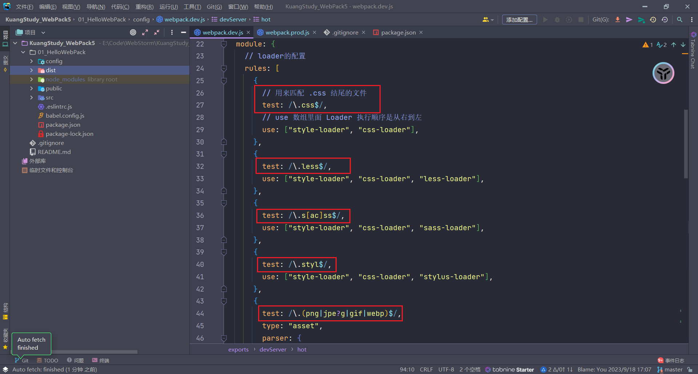

# 1、提升开发体检

## 1.1、SourceMap

开发时我们运行的代码是经过 webpack 编译后的，所有 css 和 js 合并成了一个文件，并且多了其他代码。此时如果代码运行出错那么提示代码错误位置我们是看不懂的。一旦将来开发代码文件很多，那么很难去发现错误出现在哪里。

**所以我们需要更加准确的错误提示，来帮助我们更好的开发代码**


- SourceMap（源代码映射）是一个用来生成源代码与构建后代码一一映射的文件的方案
- 它会生成一个 xxx.map 文件，里面包含源代码和构建后代码每一行、每一列的映射关系。当构建后代码出错了，会通过 xxx.map 文件，从构建后代码出错位置找到映射后源代码出错位置，从而让浏览器提示源代码文件出错位置，帮助我们更快的找到错误根源。


## 1.2、使用

通过查看[Webpack DevTool 文档open in new window](https://webpack.docschina.org/configuration/devtool/)可知，SourceMap 的值有很多种情况，但是实际开发中我们只需要关注两种情况即可：

- 开发模式：`cheap-module-source-map`
  - 优点：打包编译速度快，只包含行映射
  - 缺点：没有列映射

```javascript
module.exports = {
  // 其他省略
  mode: "development",
  devtool: "cheap-module-source-map",
};
```

- 生产模式：`source-map`
  - 优点：包含行/列映射
  - 缺点：打包编译速度更慢

```javascript
module.exports = {
  // 其他省略
  mode: "production",
  devtool: "source-map",
};
```


# 2、提升打包构建速度

开发时我们修改了其中一个模块代码，Webpack 默认会将所有模块全部重新打包编译，速度很慢。

所以我们需要做到修改某个模块代码，就只有这个模块代码需要重新打包编译，其他模块不变，这样打包速度就能很快。

## 2.1、HotModuleReplacement

- `HotModuleReplacement`（HMR/热模块替换）：在程序运行中，替换、添加或删除模块，而无需重新加载整个页面

在 `webpack.dev.js` 中进行配置

```javascript
// 开发服务器
devServer: {
    host: "localhost", // 启动服务器域名
        port: "3000", // 启动服务器端口号
            open: true, // 是否自动打开浏览器
                hot: true, // 开启HMR功能（只能用于开发环境，生产环境不需要了）
},
```

## 2.2、oneOf

打包时每个文件都会经过所有 loader 处理，虽然因为 `test` 正则原因实际没有处理上，但是都要过一遍。比较慢




`OneOf `顾名思义就是只能匹配上一个 loader, 剩下的就不匹配了。

在 `webpack.dev.js` 修改代码：就是把所有的 loader 放在 `oneOf:[]` 中

```javascript
 // 加载器
  module: {
    // loader的配置
    rules: [
      {
        oneOf: [
          {
            // 用来匹配 .css 结尾的文件
            test: /\.css$/,
            // use 数组里面 Loader 执行顺序是从右到左
            use: ["style-loader", "css-loader"],
          },
          {
            test: /\.less$/,
            use: ["style-loader", "css-loader", "less-loader"],
          },
          {
            test: /\.s[ac]ss$/,
            use: ["style-loader", "css-loader", "sass-loader"],
          },
          {
            test: /\.styl$/,
            use: ["style-loader", "css-loader", "stylus-loader"],
          },
          {
            test: /\.(png|jpe?g|gif|webp)$/,
            type: "asset",
            parser: {
              dataUrlCondition: {
                maxSize: 10 * 1024 // 小于10kb的图片会被base64处理
              }
            },
            generator: {
              // 将图片文件输出到 static/imgs 目录中
              // 将图片文件命名 [hash:8][ext][query]
              // [hash:8]: hash值取8位
              // [ext]: 使用之前的文件扩展名
              // [query]: 添加之前的query参数
              filename: "static/imgs/[hash:8][ext][query]",
            },
          },
          {
            // 开发中可能还存在一些其他资源，如音视频等，我们也一起处理了
            test: /\.(ttf|woff2?|map4|map3|avi)$/,
            type: "asset/resource",
            generator: {
              filename: "static/media/[hash:8][ext][query]",
            },
          },
          {
            test: /\.js$/,
            exclude: /node_modules/, // 排除node_modules代码不编译
            use: {
              loader: "babel-loader",
            }
          },
        ]
      }
    ],
  },
```

生产模式也是如此配置，我们执行如下运行命令，`dist/index.html` 有效果则说明成功

```bash
# 开发模式
npm run dev

# 生产模式
npm run build
```


## 2.3、Include/Exclude

开发时我们需要使用第三方的库或插件，所有文件都下载到 node_modules 中了。而这些文件是不需要编译可以直接使用的。所以我们在对 js 文件处理时，要排除 node_modules 下面的文件。

- `include` : 包含，只处理 xxx 文件
- `exclude` ： 排除，除了 xxx 文件以外其他文件都处理

在 `webpack.dev.js` 中做如下配置：

```java
// 加载器
  module: {
    // loader的配置
    rules: [
      {
        oneOf: [
          {
            // 用来匹配 .css 结尾的文件
            test: /\.css$/,
            // use 数组里面 Loader 执行顺序是从右到左
            use: ["style-loader", "css-loader"],
          },
          {
            test: /\.less$/,
            use: ["style-loader", "css-loader", "less-loader"],
          },
          {
            test: /\.s[ac]ss$/,
            use: ["style-loader", "css-loader", "sass-loader"],
          },
          {
            test: /\.styl$/,
            use: ["style-loader", "css-loader", "stylus-loader"],
          },
          {
            test: /\.(png|jpe?g|gif|webp)$/,
            type: "asset",
            parser: {
              dataUrlCondition: {
                maxSize: 10 * 1024 // 小于10kb的图片会被base64处理
              }
            },
            generator: {
              // 将图片文件输出到 static/imgs 目录中
              // 将图片文件命名 [hash:8][ext][query]
              // [hash:8]: hash值取8位
              // [ext]: 使用之前的文件扩展名
              // [query]: 添加之前的query参数
              filename: "static/imgs/[hash:8][ext][query]",
            },
          },
          {
            // 开发中可能还存在一些其他资源，如音视频等，我们也一起处理了
            test: /\.(ttf|woff2?|map4|map3|avi)$/,
            type: "asset/resource",
            generator: {
              filename: "static/media/[hash:8][ext][query]",
            },
          },
          {
            test: /\.js$/,
            // exclude: /node_modules/, // 排除node_modules代码不编译
            include: path.resolve(__dirname, "../src"), // 只包含 src 下的文件
            use: {
              loader: "babel-loader",
            }
          },
        ]
      }
    ],
  },
  // 插件
  plugins: [
    new ESLintWebpackPlugin({
      // 指定检查文件的根目录(这里检查 src 文件夹)
      context: path.resolve(__dirname, "../src"),
      exclude: "node_modules", // 默认值:排除 node_modules 文件夹
    }),
    new HtmlWebpackPlugin({
      // 以 public/index.html 为模板创建文件
      // 新的html文件有两个特点：1. 内容和源文件一致 2. 自动引入打包生成的js等资源
      template: path.resolve(__dirname, "../public/index.html"),
    }),
  ],
```

生产模式也是如此


## 2.4、Cache

每次打包时 js 文件都要经过 Eslint 检查 和 Babel 编译，速度比较慢。我们可以缓存之前的 Eslint 检查 和 Babel 编译结果，这样第二次打包时速度就会更快了。

Cache 可以对 Eslint 检查和 Babel 编译结果进行缓存。

```javascript
module: {
    // loader的配置
    rules: [
      {
        oneOf: [
          {
            // 用来匹配 .css 结尾的文件
            test: /\.css$/,
            // use 数组里面 Loader 执行顺序是从右到左
            use: getStyleLoaders(),
          },
          {
            test: /\.less$/,
            use:getStyleLoaders("less-loader"),
          },
          {
            test: /\.s[ac]ss$/,
            use: getStyleLoaders("sass-loader"),
          },
          {
            test: /\.styl$/,
            use:getStyleLoaders("stylus-loader"),
          },
          {
            test: /\.(png|jpe?g|gif|webp)$/,
            type: "asset",
            parser: {
              dataUrlCondition: {
                maxSize: 10 * 1024 // 小于10kb的图片会被base64处理
              }
            },
            generator: {
              // 将图片文件输出到 static/imgs 目录中
              // 将图片文件命名 [hash:8][ext][query]
              // [hash:8]: hash值取8位
              // [ext]: 使用之前的文件扩展名
              // [query]: 添加之前的query参数
              filename: "static/imgs/[hash:8][ext][query]",
            },
          },
          {
            // 开发中可能还存在一些其他资源，如音视频等，我们也一起处理了
            test: /\.(ttf|woff2?|map4|map3|avi)$/,
            type: "asset/resource",
            generator: {
              filename: "static/media/[hash:8][ext][query]",
            },
          },
          {
            test: /\.js$/,
            //exclude: /node_modules/, // 排除node_modules代码不编译
            include: path.resolve(__dirname, "../src"), // 只包含 src 下的文件
            use: {
              loader: "babel-loader",
            },
            options: {
              cacheDirectory: true, // 开启babel编译缓存
              cacheCompression: false, // 缓存文件不要压缩
            },
          },
        ]
      }
    ],
  },
  // 插件
  plugins: [
    new ESLintWebpackPlugin({
      // 指定检查文件的根目录(这里检查 src 文件夹)
      context: path.resolve(__dirname, "../src"),
      exclude: "node_modules", // 默认值:排除 node_modules 文件夹
      cache: true, // 开启缓存
      // 缓存目录
      cacheLocation: path.resolve(
          __dirname,
          "../node_modules/.cache/.eslintcache"
      ),
    }),
```


## 2.5、Thead

当项目越来越庞大时，打包速度越来越慢，甚至于需要一个下午才能打包出来代码。这个速度是比较慢的。我们想要继续提升打包速度，其实就是要提升 js 的打包速度，因为其他文件都比较少。

- 而对 js 文件处理主要就是 eslint 、babel、Terser 三个工具，所以我们要提升它们的运行速度。
- 我们可以开启多进程同时处理 js 文件，这样速度就比之前的单进程打包更快了。

我们启动进程的数量就是我们 CPU 的核数：

1. 如何获取 CPU 的核数，因为每个电脑都不一样

```javascript
// nodejs核心模块，直接使用
const os = require("os");
// cpu核数
const threads = os.cpus().length;
```

2. 下载包

```bash
npm i thread-loader -D
```

3. 在 `webpack.dev.js` 中引入 os 和 `terser-webpack-plugin`

```javascript
const os = require("os");

const TerserPlugin = require("terser-webpack-plugin");
```

4. 在`webpack.prod.js` 中使用

```javascript
// Node.js的核心模块，专门用来处理文件路径
const os = require("os");
const path = require("path");
const ESLintWebpackPlugin = require("eslint-webpack-plugin");
const HtmlWebpackPlugin = require("html-webpack-plugin");
const MiniCssExtractPlugin = require("mini-css-extract-plugin");
const CssMinimizerPlugin = require("css-minimizer-webpack-plugin");
const TerserPlugin = require("terser-webpack-plugin");


// cpu核数
const threads = os.cpus().length;
console.log(threads); // 8

// 获取处理样式的Loaders
const getStyleLoaders = (preProcessor) => {
  return [
    MiniCssExtractPlugin.loader,
    "css-loader",
    {
      loader: "postcss-loader",
      options: {
        postcssOptions: {
          plugins: [
            "postcss-preset-env", // 能解决大多数样式兼容性问题
          ],
        },
      },
    },
    preProcessor,
  ].filter(Boolean);
};

module.exports = {
  // 入口
  // 相对路径和绝对路径都行
  entry: "./src/main.js",
  // 输出
  output: {
    // path: 文件输出目录，必须是绝对路径
    // path.resolve()方法返回一个绝对路径
    // __dirname 当前文件的文件夹绝对路径
    path: path.resolve(__dirname, "../dist"),   // 生产模式需要输出
    // filename: 输出文件名,入口文件打包输出到 `static/js/main.js`中,其他文件仍打包到上方 path 下
    filename: "static/js/main.js", // 将 js 文件输出到 static/js 目录中
    clean: true, // 自动将上次打包目录资源清空

  },
  // 加载器
  module: {
    // loader的配置
    rules: [
      {
        oneOf: [
          {
            // 用来匹配 .css 结尾的文件
            test: /\.css$/,
            // use 数组里面 Loader 执行顺序是从右到左
            use: getStyleLoaders(),
          },
          {
            test: /\.less$/,
            use:getStyleLoaders("less-loader"),
          },
          {
            test: /\.s[ac]ss$/,
            use: getStyleLoaders("sass-loader"),
          },
          {
            test: /\.styl$/,
            use:getStyleLoaders("stylus-loader"),
          },
          {
            test: /\.(png|jpe?g|gif|webp)$/,
            type: "asset",
            parser: {
              dataUrlCondition: {
                maxSize: 10 * 1024 // 小于10kb的图片会被base64处理
              }
            },
            generator: {
              // 将图片文件输出到 static/imgs 目录中
              // 将图片文件命名 [hash:8][ext][query]
              // [hash:8]: hash值取8位
              // [ext]: 使用之前的文件扩展名
              // [query]: 添加之前的query参数
              filename: "static/imgs/[hash:8][ext][query]",
            },
          },
          {
            // 开发中可能还存在一些其他资源，如音视频等，我们也一起处理了
            test: /\.(ttf|woff2?|map4|map3|avi)$/,
            type: "asset/resource",
            generator: {
              filename: "static/media/[hash:8][ext][query]",
            },
          },
          {
            test: /\.js$/,
            //exclude: /node_modules/, // 排除node_modules代码不编译
            include: path.resolve(__dirname, "../src"), // 只包含 src 下的文件
            use: [
              {
                loader: "thread-loader", // 开启多进程
                options: {
                  workers: threads, // 数量
                },
              },
              {
                loader: "babel-loader",
                options: {
                  cacheDirectory: true, // 开启babel编译缓存
                },
              },
            ],
            options: {
              cacheDirectory: true, // 开启babel编译缓存
              cacheCompression: false, // 缓存文件不要压缩
            },
          },
        ]
      }
    ],
  },
  // 插件
  plugins: [
    new ESLintWebpackPlugin({
      // 指定检查文件的根目录(这里检查 src 文件夹)
      context: path.resolve(__dirname, "../src"),
      exclude: "node_modules", // 默认值:排除 node_modules 文件夹
      cache: true, // 开启缓存
      // 缓存目录
      cacheLocation: path.resolve(
          __dirname,
          "../node_modules/.cache/.eslintcache"
      ),
      // 开启多进程
      threads,
    }),
    new HtmlWebpackPlugin({
      // 以 public/index.html 为模板创建文件
      // 新的html文件有两个特点：1. 内容和源文件一致 2. 自动引入打包生成的js等资源
      template: path.resolve(__dirname, "../public/index.html"),
    }),
    // 提取css成单独文件
    new MiniCssExtractPlugin({
      // 定义输出文件名和目录
      filename: "static/css/main.css",
    }),
    // css压缩
    //new CssMinimizerPlugin(),
  ],
  // 优化
  optimization: {
    minimize: true,
    minimizer: [
      // css压缩也可以写到optimization.minimizer里面，效果一样的(webpack5的写法)
      new CssMinimizerPlugin(),
      // 当生产模式会默认开启TerserPlugin，但是我们需要进行其他配置，就要重新写了
      new TerserPlugin({
        parallel: threads // 开启多进程
      })
    ],
  },
  // 模式
  mode: "production", // 生产模式
  devtool: "source-map",
};
```

5. 运行指令

```bash
npm run build
```

> 生产模式也是这样，不同的是生产模式不需要 `optimization` 优化压缩


# 3、减少代码体积

开发时我们定义了一些工具函数库，或者引用第三方工具函数库或组件库。如果没有特殊处理的话我们打包时会引入整个库，但是实际上可能我们可能只用上极小部分的功能。这样将整个库都打包进来，体积就太大了

## 3.1、Tree Shaking

`Tree Shaking` 是一个术语，通常用于描述移除 JavaScript 中的没有使用上的代码。

> **注意：它依赖 `ES Module`。**
>
> - Webpack 已经默认开启了这个功能，无需其他配置。


## 3.2、Babel

- Babel 为编译的每个文件都插入了辅助代码，使代码体积过大！

- Babel 对一些公共方法使用了非常小的辅助代码，比如 `_extend`。默认情况下会被添加到每一个需要它的文件中。

- 你可以将这些辅助代码作为一个独立模块，来避免重复引入。

`@babel/plugin-transform-runtime`插件可以解决上述问题: 禁用了 Babel 自动对每个文件的 runtime 注入，而是引入 `@babel/plugin-transform-runtime` 并且使所有辅助代码从这里引用。

1. 下载包

```bash
npm i @babel/plugin-transform-runtime -D
```

2. 在`webpack.prod.js` 中配置：在 `babel-loader` 中配置插件即可

```javascript
{
    loader: "babel-loader",
        options: {
            cacheDirectory: true, // 开启babel编译缓存
            cacheCompression: false, // 缓存文件不要压缩
            plugins: ["@babel/plugin-transform-runtime"], // 减少代码体积
        },
},
```


## 3.3、Image Minimizer

开发如果项目中引用了较多图片，那么图片体积会比较大，将来请求速度比较慢。**我们可以对图片进行压缩，减少图片体积。**

> **注意：如果项目中图片都是在线链接，那么就不需要了。本地项目静态图片才需要进行压缩。**

1. 下载包

```bash
# image-minimizer-webpack-plugin 用来压缩图片的插件
npm i image-minimizer-webpack-plugin imagemin -D
```

还有剩下包需要下载，有两种模式：

- 无损压缩：图片质量不改变

```bash
npm install imagemin-gifsicle imagemin-jpegtran imagemin-optipng imagemin-svgo -D
```

- 有损压缩：图片质量降低

```bash
npm install imagemin-gifsicle imagemin-mozjpeg imagemin-pngquant imagemin-svgo -D
```

2. 以无损压缩配置为例，先引入插件

```javascript
const ImageMinimizerPlugin = require("image-minimizer-webpack-plugin");
```

3. 在`webpack.prod.js` 中配置

```javascript
// 优化
  optimization: {
    minimize: true,
    minimizer: [
      // css压缩也可以写到optimization.minimizer里面，效果一样的(webpack5的写法)
      new CssMinimizerPlugin(),
      // 当生产模式会默认开启TerserPlugin，但是我们需要进行其他配置，就要重新写了
      new TerserPlugin({
        parallel: threads // 开启多进程
      }),
      // 压缩图片
      new ImageMinimizerPlugin({
        minimizer: {
          implementation: ImageMinimizerPlugin.imageminGenerate,
          options: {
            plugins: [
              ["gifsicle", { interlaced: true }],
              ["jpegtran", { progressive: true }],
              ["optipng", { optimizationLevel: 5 }],
              [
                "svgo",
                {
                  plugins: [
                    "preset-default",
                    "prefixIds",
                    {
                      name: "sortAttrs",
                      params: {
                        xmlnsOrder: "alphabetical",
                      },
                    },
                  ],
                },
              ],
            ],
          },
        },
      }),
    ],
    
  },
```

# 4、优化代码运行性能

## 4.1、Code Split

- 打包代码时会将所有 js 文件打包到一个文件中，体积太大了。我们如果只要渲染首页，就应该只加载首页的 js 文件，其他文件不应该加载。
- 所以我们需要将打包生成的文件进行代码分割，生成多个 js 文件，渲染哪个页面就只加载某个 js 文件，这样加载的资源就少，速度就更快。

代码分割（Code Split）主要做了两件事：

1. 分割文件：将打包生成的文件进行分割，生成多个 js 文件
2. 按需加载：需要哪个文件就加载哪个文件

操作步骤：

1. 下载包

```bash
npm i webpack webpack-cli html-webpack-plugin -D
```

2. 按照如下目录新建文件

```
├── public
├── src
|   ├── app.js
|   └── main.js
├── package.json
└── webpack.config.js
```

3. 修改文件

`app.js`

```javascript
console.log("hello app");
```

`main.js`

```javascript
console.log("hello main");
```

`webpack.config.js`

```javascript
// webpack.config.js
const path = require("path");
const HtmlWebpackPlugin = require("html-webpack-plugin");

module.exports = {
  // 单入口
  // entry: './src/main.js',
  // 多入口
  entry: {
    main: "./src/main.js",
    app: "./src/app.js",
  },
  output: {
    path: path.resolve(__dirname, "./dist"),
    // [name]是webpack命名规则，使用chunk的name作为输出的文件名。
    // 什么是chunk？打包的资源就是chunk，输出出去叫bundle。
    // chunk的name是啥呢？ 比如： entry中xxx: "./src/xxx.js", name就是xxx。注意是前面的xxx，和文件名无关。
    // 为什么需要这样命名呢？如果还是之前写法main.js，那么打包生成两个js文件都会叫做main.js会发生覆盖。(实际上会直接报错的)
    filename: "static/js/[name].js",
    clean: true
  },
  plugins: [
    new HtmlWebpackPlugin({
      template: "./public/index.html",
    }),
  ],
  mode: "production",
};
```

运行指令

```bash
npx webpack
```

此时在 dist 目录我们能看到输出了两个 js 文件。

> 此时在 dist 目录我们能看到输出了两个 js 文件。

### 4.1.1、提取重复代码

如果多入口文件中都引用了同一份代码，我们不希望这份代码被打包到两个文件中，导致代码重复，体积更大。

我们需要提取多入口的重复代码，只打包生成一个 js 文件，其他文件引用它就好

- `app.js`

```javascript
import { sum } from "./math";

console.log("hello app");
console.log(sum(1, 2, 3, 4));
```

- `main.js`

```javascript
import { sum } from "./math";

console.log("hello main");
console.log(sum(1, 2, 3, 4, 5));
```

- `math.js`

```javascript
export const sum = (...args) => {
  return args.reduce((p, c) => p + c, 0);
};
```

- 修改配置文件

```javascript
// webpack.config.js
const path = require("path");
const HtmlWebpackPlugin = require("html-webpack-plugin");

module.exports = {
  // 单入口
  // entry: './src/main.js',
  // 多入口
  entry: {
    main: "./src/main.js",
    app: "./src/app.js",
  },
  output: {
    path: path.resolve(__dirname, "./dist"),
    // [name]是webpack命名规则，使用chunk的name作为输出的文件名。
    // 什么是chunk？打包的资源就是chunk，输出出去叫bundle。
    // chunk的name是啥呢？ 比如： entry中xxx: "./src/xxx.js", name就是xxx。注意是前面的xxx，和文件名无关。
    // 为什么需要这样命名呢？如果还是之前写法main.js，那么打包生成两个js文件都会叫做main.js会发生覆盖。(实际上会直接报错的)
    filename: "static/js/[name].js",
    clean: true
  },
  plugins: [
    new HtmlWebpackPlugin({
      template: "./public/index.html",
    }),
  ],
  mode: "production",
  optimization: {
    // 代码分割配置
    splitChunks: {
      chunks: "all", // 对所有模块都进行分割
      // 以下是默认值
      // minSize: 20000, // 分割代码最小的大小
      // minRemainingSize: 0, // 类似于minSize，最后确保提取的文件大小不能为0
      // minChunks: 1, // 至少被引用的次数，满足条件才会代码分割
      // maxAsyncRequests: 30, // 按需加载时并行加载的文件的最大数量
      // maxInitialRequests: 30, // 入口js文件最大并行请求数量
      // enforceSizeThreshold: 50000, // 超过50kb一定会单独打包（此时会忽略minRemainingSize、maxAsyncRequests、maxInitialRequests）
      // cacheGroups: { // 组，哪些模块要打包到一个组
      //   defaultVendors: { // 组名
      //     test: /[\\/]node_modules[\\/]/, // 需要打包到一起的模块
      //     priority: -10, // 权重（越大越高）
      //     reuseExistingChunk: true, // 如果当前 chunk 包含已从主 bundle 中拆分出的模块，则它将被重用，而不是生成新的模块
      //   },
      //   default: { // 其他没有写的配置会使用上面的默认值
      //     minChunks: 2, // 这里的minChunks权重更大
      //     priority: -20,
      //     reuseExistingChunk: true,
      //   },
      // },
      // 修改配置
      cacheGroups: {
        // 组，哪些模块要打包到一个组
        // defaultVendors: { // 组名
        //   test: /[\\/]node_modules[\\/]/, // 需要打包到一起的模块
        //   priority: -10, // 权重（越大越高）
        //   reuseExistingChunk: true, // 如果当前 chunk 包含已从主 bundle 中拆分出的模块，则它将被重用，而不是生成新的模块
        // },
        default: {
          // 其他没有写的配置会使用上面的默认值
          minSize: 0, // 我们定义的文件体积太小了，所以要改打包的最小文件体积
          minChunks: 2,
          priority: -20,
          reuseExistingChunk: true,
        },
      },
    },
  },
};
```

- 运行指令

```bash
npx webpack
```

此时我们会发现生成 3 个 js 文件，其中有一个就是提取的公共模块。

### 4.1.2、按需加载，动态导入

想要实现按需加载，动态导入模块。还需要额外配置：

- 修改`main.js`

```javascript
console.log("hello main");

document.getElementById("btn").onclick = function () {
  // eslint会对动态导入语法报错，需要修改eslint配置文件
  // webpackChunkName: "math"：这是webpack动态导入模块命名的方式
  // "math"将来就会作为[name]的值显示
  import("./math.js").then(({ sum }) => {
    // then 模块加载成功
    alert(sum(1, 2, 3, 4, 5));
  }).catch(() => {
    // catch 模块加载失败
    console.log("模块加载失败")
  });
};
```

- 修改`app.js`

```javascript
console.log("hello app");
```

- 修改`public/index.html`

```html
<!DOCTYPE html>
<html lang="en">
<head>
  <meta charset="UTF-8">
  <title>Title</title>
</head>
<body>
<h1>Hello WebPack5</h1>
<button id="btn">计算</button>
</body>
</html>
```

- 修改`.eslintrc.js`，添加 `plugins: ["import"]` 

```javascript
module.exports = {
  // 继承 Eslint 规则
  extends: ["eslint:recommended"],
  env: {
    node: true, // 启用node中全局变量
    browser: true, // 启用浏览器中全局变量
  },
  plugins: ["import"], // 解决动态导入import语法报错问题 --> 实际使用eslint-plugin-import的规则解决的
  parserOptions: {
    ecmaVersion: 6, // es6
    sourceType: "module", // es6 模块化
  },
  rules: {
    "no-var": 2, // 不能使用 var 定义变量
  },
};
```

- 运行指令

```bash
npx webpack
```

我们可以发现，一旦通过 import 动态导入语法导入模块，模块就被代码分割，同时也能按需加载了。


### 4.1.4、统一命名配置

我们给入口文件打包输出资源、动态导入输出资源、图片、字体等资源命名方式进行统一，==更新之前的配置文件==：

```javascript
// Node.js的核心模块，专门用来处理文件路径
const os = require("os");
const path = require("path");
const ESLintWebpackPlugin = require("eslint-webpack-plugin");
const HtmlWebpackPlugin = require("html-webpack-plugin");
const MiniCssExtractPlugin = require("mini-css-extract-plugin");
const CssMinimizerPlugin = require("css-minimizer-webpack-plugin");
const TerserPlugin = require("terser-webpack-plugin");

// cpu核数
const threads = os.cpus().length;
console.log(threads); // 8

// 获取处理样式的Loaders
const getStyleLoaders = (preProcessor) => {
  return [
    MiniCssExtractPlugin.loader,
    "css-loader",
    {
      loader: "postcss-loader",
      options: {
        postcssOptions: {
          plugins: [
            "postcss-preset-env", // 能解决大多数样式兼容性问题
          ],
        },
      },
    },
    preProcessor,
  ].filter(Boolean);
};

module.exports = {
  // 入口
  // 相对路径和绝对路径都行
  entry: "./src/main.js",
  // 输出
  output: {
    // path: 文件输出目录，必须是绝对路径
    // path.resolve()方法返回一个绝对路径
    // __dirname 当前文件的文件夹绝对路径
    path: path.resolve(__dirname, "../dist"),   // 生产模式需要输出
    // filename: 输出文件名,入口文件打包输出到 `static/js/[name].js`中,其他文件仍打包到上方 path 下
    filename: "static/js/[name].js", // 入口文件打包输出资源命名方式
    chunkFilename: "static/js/[name].chunk.js", // 动态导入输出资源命名方式
    assetModuleFilename: "static/media/[name].[hash][ext]", // 图片、字体等资源命名方式（注意用hash）
    clean: true, // 自动将上次打包目录资源清空

  },
  // 加载器
  module: {
    // loader的配置
    rules: [
      {
        oneOf: [
          {
            // 用来匹配 .css 结尾的文件
            test: /\.css$/,
            // use 数组里面 Loader 执行顺序是从右到左
            use: getStyleLoaders(),
          },
          {
            test: /\.less$/,
            use:getStyleLoaders("less-loader"),
          },
          {
            test: /\.s[ac]ss$/,
            use: getStyleLoaders("sass-loader"),
          },
          {
            test: /\.styl$/,
            use:getStyleLoaders("stylus-loader"),
          },
          {
            test: /\.(png|jpe?g|gif|webp)$/,
            type: "asset",
            parser: {
              dataUrlCondition: {
                maxSize: 10 * 1024 // 小于10kb的图片会被base64处理
              }
            },
            //generator: {
            //  // 将图片文件输出到 static/imgs 目录中
            //  // 将图片文件命名 [hash:8][ext][query]
            //  // [hash:8]: hash值取8位
            //  // [ext]: 使用之前的文件扩展名
            //  // [query]: 添加之前的query参数
            //  filename: "static/imgs/[hash:8][ext][query]",
            //},
          },
          {
            // 开发中可能还存在一些其他资源，如音视频等，我们也一起处理了
            test: /\.(ttf|woff2?|map4|map3|avi)$/,
            type: "asset/resource",
            //generator: {
            //  filename: "static/media/[hash:8][ext][query]",
            //},
          },
          {
            test: /\.js$/,
            //exclude: /node_modules/, // 排除node_modules代码不编译
            include: path.resolve(__dirname, "../src"), // 只包含 src 下的文件
            use: [
              {
                loader: "thread-loader", // 开启多进程
                options: {
                  workers: threads, // 数量
                },
              },
              {
                loader: "babel-loader",
                options: {
                  cacheDirectory: true, // 开启babel编译缓存
                  cacheCompression: false, // 缓存文件不要压缩
                  plugins: ["@babel/plugin-transform-runtime"], // 减少代码体积
                },
              },
            ],
          },
        ]
      }
    ],
  },
  // 插件
  plugins: [
    new ESLintWebpackPlugin({
      // 指定检查文件的根目录(这里检查 src 文件夹)
      context: path.resolve(__dirname, "../src"),
      exclude: "node_modules", // 默认值:排除 node_modules 文件夹
      cache: true, // 开启缓存
      // 缓存目录
      cacheLocation: path.resolve(
          __dirname,
          "../node_modules/.cache/.eslintcache"
      ),
      // 开启多进程
      threads,
    }),
    new HtmlWebpackPlugin({
      // 以 public/index.html 为模板创建文件
      // 新的html文件有两个特点：1. 内容和源文件一致 2. 自动引入打包生成的js等资源
      template: path.resolve(__dirname, "../public/index.html"),
    }),
    // 提取css成单独文件
    new MiniCssExtractPlugin({
      // 定义输出文件名和目录
      filename: "static/css/[name].css",
      chunkFilename: "static/css/[name].chunk.css",
    }),
    // css压缩
    //new CssMinimizerPlugin(),
  ],
  // 优化
  optimization: {
    minimize: true,
    minimizer: [
      // css压缩也可以写到optimization.minimizer里面，效果一样的(webpack5的写法)
      new CssMinimizerPlugin(),
      // 当生产模式会默认开启TerserPlugin，但是我们需要进行其他配置，就要重新写了
      new TerserPlugin({
        parallel: threads // 开启多进程
      }),

    ],
    // 代码分割
    splitChunks: {
      chunks: "all", // 对所有模块都进行分割
      // 其他的都用默认配置
    }
  },
  // 模式
  mode: "production", // 生产模式
  devtool: "source-map",
};
```


## 4.2、Preload/Prefetch

我们前面已经做了代码分割，同时会使用 import 动态导入语法来进行代码按需加载（我们也叫懒加载，比如路由懒加载就是这样实现的），但是加载速度还不够好，比如：是用户点击按钮时才加载这个资源的，如果资源体积很大，那么用户会感觉到明显卡顿效果。

- 我们想在浏览器空闲时间，加载后续需要使用的资源。我们就需要用上 `Preload` 或 `Prefetch` 技术

- `Preload`：告诉浏览器立即加载资源
- `Preload`：告诉浏览器立即加载资源

共同点：

- 都只会加载资源，并不执行
- 都有缓存

区别：

- `Preload`加载优先级高，`Prefetch`加载优先级低
- `Preload`只能加载当前页面需要使用的资源，`Prefetch`可以加载当前页面资源，也可以加载下一个页面需要使用的资源

总结：

- 当前页面优先级高的资源用 `Preload` 加载
- 下一个页面需要使用的资源用 `Prefetch` 加载


---

1. 下载包

```bash
npm i @vue/preload-webpack-plugin -D
```

2. 在 `webpack.prod.js ` 引入

```javascript
const PreloadWebpackPlugin = require("@vue/preload-webpack-plugin");
```

3. 配置

```javascript
new PreloadWebpackPlugin({
    rel: "preload", // preload兼容性更好
    as: "script",
    // rel: 'prefetch' // prefetch兼容性更差
}),
```


## 4.3、Network Cache

将来开发时我们对静态资源会使用缓存来优化，这样浏览器第二次请求资源就能读取缓存了，速度很快。

- 但是这样的话就会有一个问题, 因为前后输出的文件名是一样的，都叫 main.js，一旦将来发布新版本，因为文件名没有变化导致浏览器会直接读取缓存，不会加载新资源，项目也就没法更新了
- 所以我们从文件名入手，确保更新前后文件名不一样，这样就可以做缓存了

所以配置如下：

-  在路径上加入 `contenthash` ：根据文件内容生成 hash 值，只有文件内容变化了，hash 值才会变化
- 将 hash 值单独保管在一个 `runtime` 文件中

```javascript
// Node.js的核心模块，专门用来处理文件路径
const os = require("os");
const path = require("path");
const ESLintWebpackPlugin = require("eslint-webpack-plugin");
const HtmlWebpackPlugin = require("html-webpack-plugin");
const MiniCssExtractPlugin = require("mini-css-extract-plugin");
const CssMinimizerPlugin = require("css-minimizer-webpack-plugin");
const TerserPlugin = require("terser-webpack-plugin");
const PreloadWebpackPlugin = require("@vue/preload-webpack-plugin");

// cpu核数
const threads = os.cpus().length;
console.log(threads); // 8

// 获取处理样式的Loaders
const getStyleLoaders = (preProcessor) => {
  return [
    MiniCssExtractPlugin.loader,
    "css-loader",
    {
      loader: "postcss-loader",
      options: {
        postcssOptions: {
          plugins: [
            "postcss-preset-env", // 能解决大多数样式兼容性问题
          ],
        },
      },
    },
    preProcessor,
  ].filter(Boolean);
};

module.exports = {
  // 入口
  // 相对路径和绝对路径都行
  entry: "./src/main.js",
  // 输出
  output: {
    // path: 文件输出目录，必须是绝对路径
    // path.resolve()方法返回一个绝对路径
    // __dirname 当前文件的文件夹绝对路径
    path: path.resolve(__dirname, "../dist"),   // 生产模式需要输出
    // filename: 输出文件名,入口文件打包输出到 `static/js/[name].js`中,其他文件仍打包到上方 path 下
    // [contenthash:8]使用contenthash，取8位长度
    filename: "static/js/[name].[contenthash:8].js", // 入口文件打包输出资源命名方式
    chunkFilename: "static/js/[name].[contenthash:8].chunk.js", // 动态导入输出资源命名方式
    assetModuleFilename: "static/media/[name].[hash][ext]", // 图片、字体等资源命名方式（注意用hash）
    clean: true, // 自动将上次打包目录资源清空

  },
  // 加载器
  module: {
    // loader的配置
    rules: [
      {
        oneOf: [
          {
            // 用来匹配 .css 结尾的文件
            test: /\.css$/,
            // use 数组里面 Loader 执行顺序是从右到左
            use: getStyleLoaders(),
          },
          {
            test: /\.less$/,
            use:getStyleLoaders("less-loader"),
          },
          {
            test: /\.s[ac]ss$/,
            use: getStyleLoaders("sass-loader"),
          },
          {
            test: /\.styl$/,
            use:getStyleLoaders("stylus-loader"),
          },
          {
            test: /\.(png|jpe?g|gif|webp)$/,
            type: "asset",
            parser: {
              dataUrlCondition: {
                maxSize: 10 * 1024 // 小于10kb的图片会被base64处理
              }
            },
            //generator: {
            //  // 将图片文件输出到 static/imgs 目录中
            //  // 将图片文件命名 [hash:8][ext][query]
            //  // [hash:8]: hash值取8位
            //  // [ext]: 使用之前的文件扩展名
            //  // [query]: 添加之前的query参数
            //  filename: "static/imgs/[hash:8][ext][query]",
            //},
          },
          {
            // 开发中可能还存在一些其他资源，如音视频等，我们也一起处理了
            test: /\.(ttf|woff2?|map4|map3|avi)$/,
            type: "asset/resource",
            //generator: {
            //  filename: "static/media/[hash:8][ext][query]",
            //},
          },
          {
            test: /\.js$/,
            //exclude: /node_modules/, // 排除node_modules代码不编译
            include: path.resolve(__dirname, "../src"), // 只包含 src 下的文件
            use: [
              {
                loader: "thread-loader", // 开启多进程
                options: {
                  workers: threads, // 数量
                },
              },
              {
                loader: "babel-loader",
                options: {
                  cacheDirectory: true, // 开启babel编译缓存
                  cacheCompression: false, // 缓存文件不要压缩
                  plugins: ["@babel/plugin-transform-runtime"], // 减少代码体积
                },
              },
            ],
          },
        ]
      }
    ],
  },
  // 插件
  plugins: [
    new ESLintWebpackPlugin({
      // 指定检查文件的根目录(这里检查 src 文件夹)
      context: path.resolve(__dirname, "../src"),
      exclude: "node_modules", // 默认值:排除 node_modules 文件夹
      cache: true, // 开启缓存
      // 缓存目录
      cacheLocation: path.resolve(
          __dirname,
          "../node_modules/.cache/.eslintcache"
      ),
      // 开启多进程
      threads,
    }),
    new HtmlWebpackPlugin({
      // 以 public/index.html 为模板创建文件
      // 新的html文件有两个特点：1. 内容和源文件一致 2. 自动引入打包生成的js等资源
      template: path.resolve(__dirname, "../public/index.html"),
    }),
    // 提取css成单独文件
    new MiniCssExtractPlugin({
      // 定义输出文件名和目录
      filename: "static/css/[name].[contenthash:8].css",
      chunkFilename: "static/css/[name].[contenthash:8].chunk.css",
    }),
    // css压缩
    //new CssMinimizerPlugin(),
    new PreloadWebpackPlugin({
      rel: "preload", // preload兼容性更好
      as: "script",
      // rel: 'prefetch' // prefetch兼容性更差
    }),
  ],
  // 优化
  optimization: {
    minimize: true,
    minimizer: [
      // css压缩也可以写到optimization.minimizer里面，效果一样的(webpack5的写法)
      new CssMinimizerPlugin(),
      // 当生产模式会默认开启TerserPlugin，但是我们需要进行其他配置，就要重新写了
      new TerserPlugin({
        parallel: threads // 开启多进程
      }),

    ],
    // 代码分割
    splitChunks: {
      chunks: "all", // 对所有模块都进行分割
      // 其他的都用默认配置
    },
    // 提取runtime文件
    runtimeChunk: {
      name: (entrypoint) => `runtime~${entrypoint.name}`, // runtime文件命名规则
    },
  },
  // 模式
  mode: "production", // 生产模式
  devtool: "source-map",
};
```


## 4.4、Core-js

- 过去我们使用 babel 对 js 代码进行了兼容性处理，其中使用@babel/preset-env 智能预设来处理兼容性问题。
- 它能将 ES6 的一些语法进行编译转换，比如箭头函数、点点点运算符等。**但是如果是 async 函数、promise 对象、数组的一些方法（includes）等，它没办法处理**。
- 所以此时我们 js 代码仍然存在兼容性问题，一旦遇到低版本浏览器会直接报错。所以我们想要将 js 兼容性问题彻底解决
- `core-js` 是专门用来做 ES6 以及以上 API 的 `polyfill`
- `polyfill`翻译过来叫做垫片/补丁。就是用社区上提供的一段代码，让我们在不兼容某些新特性的浏览器上，使用该新特性

---

1. 下载包

```bash
npm i @babel/eslint-parser -D

# 下载 core-js
npm i core-js
```

2. 更改 `.eslintrc.js`
   - 添加 `parser: "@babel/eslint-parser"`

```javascript
module.exports = {
  // 继承 Eslint 规则
  extends: ["eslint:recommended"],
  parser: "@babel/eslint-parser", // 支持最新的最终 ECMAScript 标准
  env: {
    node: true, // 启用node中全局变量
    browser: true, // 启用浏览器中全局变量
  },
  plugins: ["import"], // 解决动态导入import语法报错问题 --> 实际使用eslint-plugin-import的规则解决的
  parserOptions: {
    ecmaVersion: 6, // es6
    sourceType: "module", // es6 模块化
  },
  rules: {
    "no-var": 2, // 不能使用 var 定义变量
  },
};
```

3. 更改`babel.config.js`

```javascript
module.exports = {
  // 智能预设：能够编译ES6语法
  presets: [
    [
      "@babel/preset-env",
      {
        // 按需加载自动引入
        useBuiltIns: "usage",
        corejs: {
          //corejs 版本为3
          version: "3", proposals: true
        }
      },
    ],
  ],
};
```


4. 修改`main.js`

```javascript
// 添加promise代码
const promise = Promise.resolve();
promise.then(() => {
  console.log("hello promise");
});
```

此时就会自动根据我们代码中使用的语法，来按需加载相应的 `polyfill` 了


## 4.5、PWA

开发 Web App 项目，项目一旦处于网络离线情况，就没法访问了。我们希望给项目提供离线体验。

1. 下载包

```bash
npm i workbox-webpack-plugin -D

npm i serve -g
```

2. 引入

```javascript
const WorkboxPlugin = require("workbox-webpack-plugin");
```

3. 配置

```javascript
new WorkboxPlugin.GenerateSW({
    // 这些选项帮助快速启用 ServiceWorkers
    // 不允许遗留任何“旧的” ServiceWorkers
    clientsClaim: true,
    skipWaiting: true,
}),
```

4. 修改`main.js`

```javascript
// 离线访问
if ("serviceWorker" in navigator) {
  window.addEventListener("load", () => {
    navigator.serviceWorker
        .register("/service-worker.js")
        .then((registration) => {
          console.log("SW registered: ", registration);
        })
        .catch((registrationError) => {
          console.log("SW registration failed: ", registrationError);
        });
  });
}
```

5. 运行指令

```bash
serve dist
```

此时通过 serve 启动的服务器我们 service-worker 就能注册成功了。


