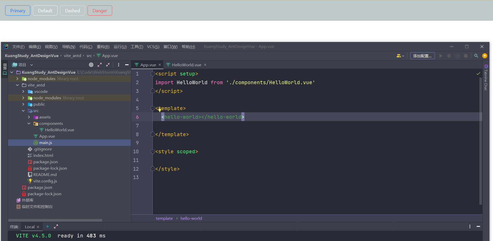

# 1、Ant Design Vue

- 官方文档：[快速上手 - Ant Design Vue (antdv.com)](https://www.antdv.com/docs/vue/getting-started-cn)
- 文档使用基于WebPack的VueCli脚手架创建Vue项目后再加入 Ant Design Vue 依赖，我使用 Vite 来创建 Vue项目，所以我的使用步骤如下(按官网也没问题)：

1. 使用`create-vue`创建项目

```bash
npm create vite@latest
```

2. 安装`Ant Design Vue`

```bash
npm i --save ant-design-vue@4.x
```

3. 在`main.js`全局完整注册

```javascript
//1.引入
import Antd from 'ant-design-vue';
//样式文件需要单独引入
import 'ant-design-vue/dist/reset.css';

//2.使用
app.use(Antd)
```


# 2、按钮

接下来就开始看组件的官方文档了，先来看按钮的部分：[按钮 Button - Ant Design Vue (antdv.com)](https://www.antdv.com/components/button-cn)


1. `HelloWorld.vue` 中写入如下代码

```html
<template>
  <div :style="{ background: 'rgb(190, 200, 200)', padding: '16px 16px' }">
    <a-space>
      <a-button type="primary" ghost>Primary</a-button>
      <a-button ghost>Default</a-button>
      <a-button type="dashed" ghost>Dashed</a-button>
      <a-button type="primary" danger ghost>Danger</a-button>
    </a-space>
  </div>
</template>

<script setup>

</script>


<style scoped>

</style>
```

2. 在`App.vue` 中调用 HelloWorld 组件

```html
<template>
  <hello-world></hello-world>
</template>

<script setup>
import HelloWorld from './components/HelloWorld.vue'
</script>

<style scoped>

</style>
```




> 大功告成！


