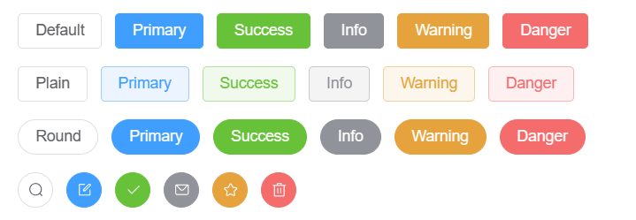
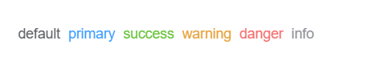
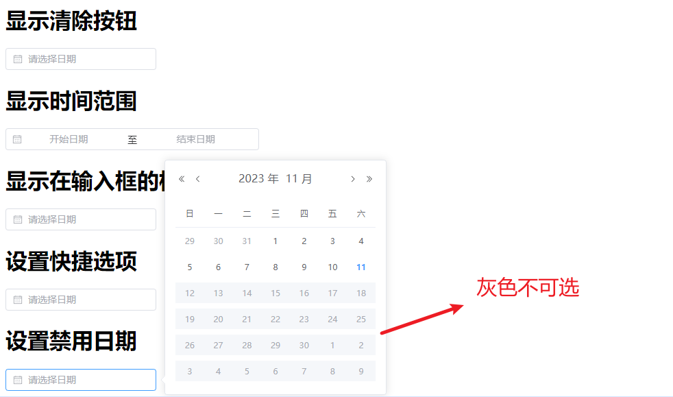
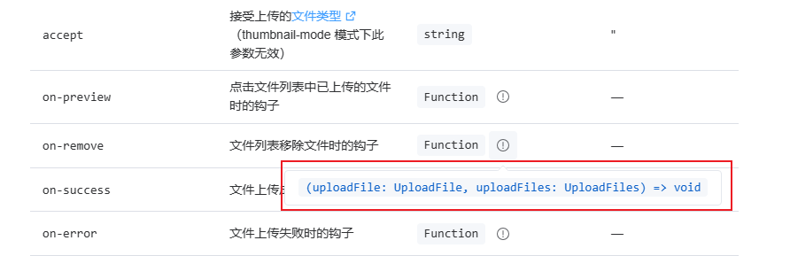

# 1、Element Plus

- 官网：[安装 | Element Plus (element-plus.org)](https://element-plus.org/zh-CN/guide/installation.html#使用包管理器)

- 官方定义：`网站快速成型工具`和`桌面端组件库`

Element Plus 就是基于 Vue 的一个 UI 框架，该框架基于 Vue 开发了很多相关组件，方便我们快速开发页面。是由饿了么前端团队开发并开源。

> Tips：为什么 Element 组件属性前面有的需要加冒号`:` ，有的不需要
>
> - **如果不加冒号或v-bind，那么赋的就是值**
> - **如果加了冒号或v-bind，赋的就是变量**
> - 参考文章：[【精选】为什么 Vue3.js / Element+ 组件属性前面有的需要添加冒号，有的不需要？_vue3 冒号-CSDN博客](https://blog.csdn.net/WLNMYR/article/details/123338084)

口诀：==带了冒号，则不带双引号;不带冒号，则带双引号==

```html
<el-radio :label="1" v-model="radio">Option A</el-radio>
<el-radio label="2" v-model="radio1">Option B</el-radio>


<script setup>
	const radio = ref(1)
	const radio1 = ref("2")
</script>
```

> 在Element Plus 文档中的默认值是 boolean 的属性使用一律加冒号`:`


## 1.1、安装

1. 通过脚手架Vite创建Vue项目

```bash
npm create vite@latest
```

2. 安装 `element-plus`

```bash
npm install element-plus --save
```

3. 在`main.js`完整引入依赖

```javascript
import { createApp } from 'vue'
import ElementPlus from 'element-plus'
import 'element-plus/dist/index.css'
import App from './App.vue'

const app = createApp(App)

app.use(ElementPlus)
app.mount('#app')
```

4. 在`App.vue`中使用

```html
<script setup>

</script>

<template>
    <div>
      <!--使用默认按钮-->
      <el-row class="mb-4">
        <el-button>Default</el-button>
        <el-button type="primary">Primary</el-button>
        <el-button type="success">Success</el-button>
        <el-button type="info">Info</el-button>
        <el-button type="warning">Warning</el-button>
        <el-button type="danger">Danger</el-button>
      </el-row>
    </div>
</template>

<style scoped>

</style>
```

5. 启动项目


# 2、Button



- 基础用法：`<el-button></el-button>`

- 默认按钮：`type="xxx"`

- 简洁按钮：`plain`

- 圆角按钮：`round`

- 图标按钮：`:icon="xxx"`

  

```html
  <el-row class="mb-4">
    <!--1.使用默认按钮-->
    <el-button type="primary">Primary</el-button>
    <!--2.使用简洁按钮:鼠标移动上去才会显示背景颜色-->
    <el-button type="primary" plain>Primary</el-button>
    <!--3.使用圆角按钮--> 
    <el-button type="primary" round>Primary</el-button>
    <!--4.使用图标按钮-->
    <el-button type="primary" :icon="Edit" circle />  
  </el-row>
```

> 在`Element plus` 中**所有组件的属性全都写在组件标签中**


# 3、Link链接




- 基础用法：`<el-link></el-link>`
- 禁用状态：`disabled`
- 下划线：`:underline`
- 图标链接：`:icon`

```html
<!--1.文字链接-->
<el-link type="primary" href="https://element-plus.org" target="_blank">primary</el-link>

<!--2.文字链接禁用-->
<el-link type="primary" disabled>primary</el-link>

<!--2.文字链接下划线-->
<el-link :underline="false">没有下划线</el-link>
<el-link>有下划线</el-link>

<!--2.图标链接-->
<el-link :icon="Edit">Edit</el-link>
```


# 4、Layout布局

通过基础的 24 分栏，迅速简便地创建布局。

- 行的属性写在 `<el-row> ` 标签里面，列的属性写在`<el-col>` 标签里面

- 基础布局：`:span="xx"`

  ```html
  <el-row>
  	<el-col :span="24"></el-col>
  </el-row>
  ```

- 列间距：`<el-row :gutter="20">`

  - **行**提供 `gutter` 属性来指定列之间的间距，其默认值为0。

  ```html
  <el-row :gutter="20">
    <el-col :span="6"><div class="col">占用四分之一6</div></el-col>
    <el-col :span="6"><div class="col">占用四分之一6</div></el-col>
    <el-col :span="6"><div class="col">占用四分之一6</div></el-col>
  </el-row>
  ```

- 列偏移：`<el-col :span="6" :offset="6"></el-col>`

  - **列**提供`offset`属性可以指定分栏偏移的栏数

  ```html
  <el-col :span="6" :offset="6"><div class="col">占用四分之一6</div></el-col>
  ```

  踩坑：

  - [element ui中el-row的gutter属性失效的问题_el-row gutter_叶卡捷琳堡的博客-CSDN博客](https://blog.csdn.net/weixin_46841376/article/details/118863406)

# 5、Container布局容器

- `<el-container>`：外层容器。
  -  当子元素中包含 `<el-header>` 或 `<el-footer>` 时，全部子元素会**垂直上下排列**， 否则会**水平左右排列**。
- `<el-header>`：顶栏容器
- `<el-aside>`：侧边栏容器
- `<el-main>`：主要区域容器
- `<el-footer>`：底栏容器

- 水平容器：`<el-container direction="horizontal"></el-container>`
- 垂直容器：`<el-container direction="vertical"></el-container>`

```html
<el-container direction="horizontal">
  <el-header>Header</el-header>
  <el-aside>Aside</el-aside>
  <el-main>Main</el-main>
  <el-footer>Footer</el-footer>
</el-container>
```


# 6、Radio单选框

- Radio 单选框需要 `v-model` 和 `label` 两个属性

```html
<template>
    <el-radio-group v-model="radio1">
      <el-radio label="男" size="large">男</el-radio>
      <el-radio label="女" size="large">女</el-radio>
    </el-radio-group>
</template>


<script setup>
import { ref } from 'vue'

const radio1 = ref('男')
</script>
```

## 6.1、单选框组

结合`el-radio-group`元素和子元素`el-radio`可以实现单选组：

1. 为 `el-radio-group` 绑定 `v-model`
2. 再为 每一个 `el-radio` 设置好 `label` 属性即可

```html
<template>
  <el-radio-group v-model="radio">
    <el-radio :label="3">Option A</el-radio>
    <el-radio :label="6">Option B</el-radio>
    <el-radio :label="9">Option C</el-radio>
  </el-radio-group>
</template>

<script setup>
import { ref } from 'vue'

const radio = ref(3)
</script>
```


## 6.2、事件

- **事件的使用也是和属性使用一致，都是直接写在对应的组件标签上**

```html
<el-radio label="1" size="large" border @change="A">Option A</el-radio>

<script setup>
const A = ()=>{
  alert('A')
}
</script>
```


# 7、Checkbox多选框

- 基本使用：`<el-checkbox></el-checkbox>`

```html
<el-checkbox v-model="checked">北京</el-checkbox>
<el-checkbox v-model="checked">上海</el-checkbox>
<el-checkbox v-model="checked">天津</el-checkbox>
```

- 禁用状态：标签加`disabled`

- 带有边框：标签加`border`

- 选中状态的值：`true-label='xx'`

```html
<template>
    <!-- 当选中时的值是北京 -->
	<el-checkbox v-model="checked1" true-label="北京">北京</el-checkbox>
    <el-checkbox v-model="checked1" true-label="上海">上海</el-checkbox>
</template>

<script>
	import { ref } from 'vue'
    const checked1 = ref('北京')
</script>
```


## 7.1、多选框组

适用于多个勾选框绑定到同一个数组的情景，通过是否勾选来表示这一组选项中选中的项。

- 基本用法：`<el-checkbox-group></el-checkbox-group>`

```html
<template>
  <el-checkbox-group v-model="checkList" @change="B">
    <el-checkbox label="北京" />
    <el-checkbox label="上海" />
    <el-checkbox label="西安" />
    <el-checkbox label="禁用" disabled />
    <el-checkbox label="郑州" disabled />
  </el-checkbox-group>
</template>

<script setup>
import { ref } from 'vue'
    
    
const checkList = ref(['北京', '郑州'])
const B = ()=> {
  console.log(checkList.value)
}

</script>    
```

- 属性 `label` 是选中状态的值：只有在`checkbox-group`或者绑定对象类型为`array`时有效


## 7.2、事件

- **事件的使用也是和属性使用一致，都是直接写在对应的组件标签上**

```html
<template>
	<el-checkbox v-model="checked2" @change="A">北京</el-checkbox>
</template>

<script setup>
	import { ref } from 'vue'
    const checked2 = ref(false)
    
    const A = ()=> {
  		console.log(checked2.value)
	}
</script>
```


# 8、Input输入框组件


- 基本使用：`<el-input v-model="input"></el-input>`

```html
<template>
  <h1>基础用法</h1>
  <el-input v-model="input" placeholder="请输入" />
</template>

<script setup>
import { ref } from 'vue'

const input = ref('')
</script>
```

- 禁用状态：标签加`disabled`

- 输入框加入清空按钮：标签加`clearable`
- 密码框：标签加`type=password show-password`
- 文本框输入限制：标签加`type=text maxlength="10" show-word-limit `

- 带图标输入框：标签加：`prefix-icon="User"  suffix-icon="xxx"` 


## 8.1、事件

- **事件的使用也是和属性使用一致，都是直接写在对应的组件标签上**

```html
<template>
	<el-input v-model="input" placeholder="请输入" @blur="A"/>
</template>

<script setup>
import { ref } from 'vue'

const input = ref('')

const A = ()=> {
  alert("失去焦点")
}
</script>
```

- 失去焦点：`@blur`
- 获得焦点：`@focux`
- 事件传值：
  - `change(value)` ： 当输入框市区焦点或者用户按下 Enter 时触发
  - `input(value)` ： 在 Input 值改变时触发

```html
<template>
  <el-input v-model="input" placeholder="请输入" @blur="A" />

  <el-input v-model="input3" placeholder="请输入" @change="B" />

  <el-input v-model="input4" placeholder="请输入" @input="C" />

</template>


	
<script setup>
import { ref } from 'vue'
    
const input = ref('')
const input3 = ref('')
const input4 = ref('')

const A = ()=> {
  console.log("失去焦点")
}

// 当失去焦点或者按下Enter时触发,只触发一次
const B = (value)=> {
  console.log("改变" + value)
}

// 当input值改变就触发,可触发多次
const C = (value)=> {
  console.log("改变" + value)
}

</script>
```

- `clear`：在点击由 `clearable` 属性生成的清空按钮时触发


## 8.2、方法

1. 给标签加`ref="xxx" ` 组件别名绑定数据
2. 通过`xxx.value.方法名` 调用方法

```html
<template>
    <el-input v-model="input5" ref="inputs"></el-input>
    <el-button @click="focusInput">点击</el-button>
</template>


<script setup>
import { ref } from 'vue'  
    
const input5 = ref('')

const inputs = ref()
const focusInput = ()=> {
  // 点击按钮则聚焦  
  inputs.value.focus()
}
</script>
```


# 9、Select选择器

- 基础用法
  - `:label="xx"` 要展示的下拉文字
  - `:value="xx"` 选择后所对应的值

```html
<template>
  <el-select v-model="username">
    <el-option 
       v-for="item in options" 
       :key="item.id" 
       :label="item.name" 
       :value="item.id" />
  </el-select>
</template>

<script setup>
import { ref } from 'vue'

// 当选中值时会赋给 username
const username = ref()

const options = [
  {id: 1, name: "张三"},
  {id: 2, name: "李四"},
  {id: 3, name: "王五"},
  {id: 4, name: "赵六"},
  {id: 5, name: "秦七"},
  {id: 6, name: "肥八"}
]
</script>
```

> 解释：el-option 选中的值会赋值给 el-select 的 username

- 有**禁用选项**：`el-option`标签加`:disabled="item.disabled"`，并且 options 禁用的对象也加`disabled: true`

````html
<template>
  <el-select v-model="username">
    <el-option 
       v-for="item in options" 
       :key="item.id" 
       :label="item.name"
       :value="item.id"             
       :disabled="item.disabled" />
  </el-select>
</template>

<script setup>
// 当选中值时会赋给 username
const username = ref()

const options = [
  {id: 1, name: "张三"},
  {id: 2, name: "李四"},
  {id: 3, name: "王五",disabled: true},
  {id: 4, name: "赵六"},
  {id: 5, name: "秦七"},
  {id: 6, name: "肥八"}
]
</script>
````

- 禁用整个选择器组件：给`el-select`标签加`disabled`

- 可清空单选：给`el-select`标签加`clearable`属性 （注：`clearable` 属性仅适用于单选)


## 9.1、基础多选

- 为 `el-select` 设置 `multiple` 属性即可启用多选

```html
<template>
  	<el-select  v-model="username" multiple>
      <el-option
          v-for="item in options"
          :key="item.id"
          :label="item.name"
          :value="item.id" />
    </el-select>
</template>

<script setup>
import { ref } from 'vue'

const username = ref()


const options = [
  {id: 1, name: "张三"},
  {id: 2, name: "李四"},
  {id: 3, name: "王五",disabled: true},
  {id: 4, name: "赵六"},
  {id: 5, name: "秦七"},
  {id: 6, name: "肥八"}
]
</script>
```


## 9.2、事件

- **事件的使用也是和属性使用一致，都是直接写在对应的组件标签上**

```html
<template>
    <el-select  v-model="username" multiple @change="A">
      <el-option
          v-for="item in options"
          :key="item.id"
          :label="item.name"
          :value="item.id" />
    </el-select>
</template>

<script setup>
import { ref } from 'vue'
    
const username = ref()

const options = [
  {id: 1, name: "张三"},
  {id: 2, name: "李四"},
  {id: 3, name: "王五",disabled: true},
  {id: 4, name: "赵六"},
  {id: 5, name: "秦七"},
  {id: 6, name: "肥八"}
]

// 选中的值
const A = (value)=> {
  console.log(value)
}
```


## 9.3、方法

1. 给标签加`ref="xxx" ` 组件别名绑定数据
2. 通过`xxx.value.方法名` 调用方法

```html
<template>
    <el-select  v-model="username" multiple ref="selects">
      <el-option
          v-for="item in options"
          :key="item.id"
          :label="item.name"
          :value="item.id" />
    </el-select>
    <el-button @click="selectFocus">点击聚焦</el-button>
</template>

<script setup>
import { ref } from 'vue'
    
const selects = ref('')
const selectFocus = ()=> {
  selects.value.focus()
}    
</script>
```


# 10、Switch开关

- 基础用法

```html
<template>
	<el-switch v-model="value1" />	
</template>

<script setup>
<script setup>

import { ref } from 'vue'
const value1 = ref(true)
</script>
```

- 禁用状态：给标签加 `disabled`
- 加载状态：给标签加 `loading`
- 添加图标：给标签加 `:active-action-icon="View" :inactive-action-icon="Hide" inline-prompt` 
- 文字描述：给标签加 `active-text="是" inactive-text="否" inline-prompt`

- 扩展的 value 类型：设置 `active-value` 和 `inactive-value` 属性， 它们接受 `Boolean`、`String` 或 `Number` 类型的值。

```html
<template>
    <!--开关打开值是100,开关关闭值是0-->
    <el-switch
        v-model="value4"
        style="--el-switch-on-color: #13ce66; --el-switch-off-color: #ff4949"
        active-value="100"
        inactive-value="0"
    />
</template>


<script setup>
import { ref } from 'vue'
const value4 = ref('100')  


</script>
```


## 10.1、事件

- **事件的使用也是和属性使用一致，都是直接写在对应的组件标签上**

```html
<template>
	<el-switch v-model="value1" @change="A"/>
</template>

<script setup>

    
const A = (value)=> {
  console.log(value)
}    
</script>
```


## 10.2、方法

1. 给标签加`ref="xxx" ` 组件别名绑定数据
2. 通过`xxx.value.方法名` 调用方法

```html
<template>
    <el-switch v-model="value1" ref="switchs"/>
    <el-button @click="switchFocus">点击</el-button>
</template>

<script setup>
import { ref } from 'vue'

const value1 = ref(true)    
    
const switchs = ref()
const switchFocus = ()=> {
  console.log("switch获得焦点")
  switchs.value.focus()
}   
</script>
```


# 11、DatePicker日期选择器

- 基础用法：

```html
<template>
    <el-date-picker
          v-model="value1"
          type="date"
          placeholder="请选择日期" />

</template>

<script setup>
import { ref } from 'vue'
const value1 = ref('')
    
</script>
```

- 只读：标签加`:readonly="true"`
- 禁用：标签加`:disabled="true"`
- 显示清除按钮：标签加`:clearable="true"`
- 显示时间范围：标签加`type="daterange"`

```html
<template>
    <el-date-picker
      v-model="value1"
      type="daterange"
      range-separator="至"
      start-placeholder="开始日期"
      end-placeholder="结束日期" />

</template>

<script setup>
import { ref } from 'vue'
const value1 = ref('')
    
</script>
```

- 输入框的格式：标签加`format="yyyy/MM/dd"`

- 设置快捷选项

```html
<template>
    <el-date-picker
      v-model="value3"
      type="date"
      placeholder="请选择日期"
      :shortcuts="shortcuts" />

</template>

<script setup>
import { ref } from 'vue'
const value3 = ref('')

// 从官网复制
const shortcuts = [
  {
    text: '今天',
    value: new Date(),
  },
  {
    text: '昨天',
    value: () => {
      const date = new Date()
      date.setTime(date.getTime() - 3600 * 1000 * 24)
      return date
    },
  },
  {
    text: '一周前',
    value: () => {
      const date = new Date()
      date.setTime(date.getTime() - 3600 * 1000 * 24 * 7)
      return date
    },
  },
]

</script>
```


- 设置禁用日期：标签加`:disabled-date="disabledDate"`

```html
<template>
    <el-date-picker
      v-model="value3"
      type="date"
      placeholder="请选择日期"
      :disabled-date="disabledDate" />

</template>

<script setup>
import { ref } from 'vue'
const value3 = ref('')
    

const disabledDate = (time) => {
  // 如果输入框选择的时间 > 当前的时间 ,则不可选,也就是只能选 当前时间之前的
  return time.getTime() > Date.now()
}
</script>
```




## 11.1、事件

- **事件的使用也是和属性使用一致，都是直接写在对应的组件标签上**

```html
<template>
    <el-date-picker
      v-model="value4"
      type="date"
      placeholder="请选择日期"
      @change="handleChange" />

</template>

<script setup>
import { ref } from 'vue'
const value4 = ref('')
    

const handleChange = (value) => {
  console.log(value)
}

</script>
```


## 11.2、方法

```html
<template>
     <el-date-picker
      v-model="value5"
      type="date"
      placeholder="请选择日期"
      @blur="handleBlur"
      ref="datePickers"
  />

</template>

<script setup>
import { ref } from 'vue'
const value5 = ref('')
    

const datePickers = ref()
const handleBlur = ()=> {
  console.log("获得焦点")
  datePickers.value.focus()
}

</script>
```


# 12、国际化

Element Plus 组件 **默认** 使用英语，如果你希望使用其他语言，可以进行全局配置：

```javascript
import ElementPlus from 'element-plus'
import zhCn from 'element-plus/dist/locale/zh-cn.mjs'

app.use(ElementPlus, {
  // 使用中文显示
  locale: zhCn,
})
```


# 13、Upload组件

- 基础用法：

```html
<template>
    <el-upload action="https://run.mocky.io/v3/9d059bf9-4660-45f2-925d-ce80ad6c4d15">
        <el-button type="primary">点击上传</el-button>
    </el-upload>
</template>
```

> `action` 属性是必须的，表示请求 URL

- 默认显示上传的文件列表：属性加 `:file-list="fileList"`

```html
<template>
    <el-upload
          :file-list="fileList"
          action="https://run.mocky.io/v3/9d059bf9-4660-45f2-925d-ce80ad6c4d15"
      >
        <el-button type="primary">点击上传</el-button>
      </el-upload>
</template>

<script setup>
import { ref } from 'vue'

const fileList = ref([
  {
    name: 'element-plus-logo.svg',
    url: 'https://element-plus.org/images/element-plus-logo.svg',
  },
  {
    name: 'element-plus-logo2.svg',
    url: 'https://element-plus.org/images/element-plus-logo.svg',
  }
])    

</script>
```

- 显示文本提示：插槽显示 `<template #tip></template>`

```html
<template>
    <el-upload
      :file-list="fileList"
      action="https://run.mocky.io/v3/9d059bf9-4660-45f2-925d-ce80ad6c4d15"
  >
    <el-button type="primary">点击上传</el-button>
    <template #tip>
      <div class="el-upload__tip">
        这里是上传文件的地方
      </div>
    </template>
  </el-upload>
</template>

<script setup>
import { ref } from 'vue'

const fileList = ref([
  {
    name: 'element-plus-logo.svg',
    url: 'https://element-plus.org/images/element-plus-logo.svg',
  },
  {
    name: 'element-plus-logo2.svg',
    url: 'https://element-plus.org/images/element-plus-logo.svg',
  }
])    

</script>
```

- 支持多选文件上传：标签加`multiple`

- 采用拖拽上传：标签加`drag`

```html
<template>
    <el-upload
      action="https://run.mocky.io/v3/9d059bf9-4660-45f2-925d-ce80ad6c4d15"
      drag
  >
    <i class="el-icon-upload"></i>
    <div class="el-upload__text">将文件拖到此处，或<em>点击上传</em></div>
  </el-upload>
</template>
```

- 上传文件附带额外参数：标签加：`:data="xxx"`

```html
<template>
    <el-upload
      action="https://run.mocky.io/v3/9d059bf9-4660-45f2-925d-ce80ad6c4d15"
      :data="information"
  >
    <el-button type="primary">点击上传</el-button>
  </el-upload>
</template>

<script setup>
import { ref } from 'vue'
    
const information = {
  // 每次上传时候不光上传文件,还附带上传额外参数token
  token: '123456'
}    
</script>
```

- 设置上传的文件名：标签加`name="xxxx"`
- 不展示已经上传的文件列表：标签加`:show-file-list="false"`
- 设置允许上传的文件类型：标签加`:accept=".txt, .png"`
- 钩子函数

```html
<template>
      <el-upload
      :file-list="fileList"
      action="https://run.mocky.io/v3/9d059bf9-4660-45f2-925d-ce80ad6c4d15"
      :on-preview="handlePreview"
      :on-remove="handleRemove"
      :on-success="handleSuccess"
      :on-error="handleError"
      :on-progress="handleProgress"
  >
    <el-button type="primary">点击上传</el-button>
  </el-upload>
</template>

<script setup>
import { ref } from 'vue'
    
const handlePreview = (UploadFile)=> {
  console.log("点击文件列表中已上传的文件时的钩子" + UploadFile.name)
}

const handleRemove = (UploadFile,uploadFiles)=> {
  console.log("文件列表移除文件时的钩子" + UploadFile.name + ",文件数" +uploadFiles.length)
}

const handleSuccess = (UploadFile,uploadFiles)=> {
  console.log("文件上传成功时的钩子" + UploadFile.name + "文件数" +uploadFiles.length)
}
const handleError = (Error,UploadFile,uploadFiles)=> {
  console.log("文件上传失败时的钩子" + UploadFile.name)
}


const handleProgress = (UploadFile)=> {
  console.log("文件上传时的钩子" + UploadFile.name)
} 
</script>
```




> 这里解释一下官方文档的意思：这个钩子函数接收两个参数，类型分别为 `uploadFile` 和 `uploadFiles` ，返回值是 void，也就是无返回值


## 13.1、方法

```html
<template>
    <el-upload
      ref="uploads"         
      action="https://run.mocky.io/v3/9d059bf9-4660-45f2-925d-ce80ad6c4d15"
  >
    <el-button type="primary">点击上传</el-button>
  </el-upload>
</template>

<script setup>
import { ref } from 'vue'
    
const uploads = ref()
const clearFiles = ()=> {
  uploads.value.clearFiles()
}  
</script>
```


# 14、Form表单

- 基本使用：`<el-form>` 里面包含 `<el-form-item>`

```html
<template>
  <el-form :model="form" label-width="120px">
    <el-form-item label="活动名称">
      <el-input v-model="form.name" />
    </el-form-item>

    <el-form-item label="活动区域">
      <el-select v-model="form.region" placeholder="选择你的区域">
        <el-option label="上海" value="shanghai" />
        <el-option label="北京" value="beijing" />
      </el-select>
    </el-form-item>

    <el-form-item label="活动时间">
      <el-col :span="11">
        <el-date-picker
            v-model="form.date1"
            type="date"
            placeholder="Pick a date"
            style="width: 100%"
        />
      </el-col>
      <el-col :span="2" class="text-center">
        <span class="text-gray-500">-</span>
      </el-col>
      <el-col :span="11">
        <el-time-picker
            v-model="form.date2"
            placeholder="Pick a time"
            style="width: 100%"
        />
      </el-col>
    </el-form-item>

    <el-form-item label="即时配送">
      <el-switch v-model="form.delivery" />
    </el-form-item>

    <el-form-item label="活动性质">
      <el-checkbox-group v-model="form.type">
        <el-checkbox label="线上活动" name="type" />
        <el-checkbox label="地摊活动" name="type" />
        <el-checkbox label="线下主题活动" name="type" />
        <el-checkbox label="单纯品牌曝光" name="type" />
      </el-checkbox-group>
    </el-form-item>

    <el-form-item label="特殊资源">
      <el-radio-group v-model="form.resource">
        <el-radio label="线上品牌商赞助" />
        <el-radio label="线下场地免费" />
      </el-radio-group>
    </el-form-item>

    <el-form-item label="活动形式">
      <el-input v-model="form.desc" type="textarea" />
    </el-form-item>

    <el-form-item>
      <el-button type="primary" @click="onSubmit">立即创建</el-button>
      <el-button>取消</el-button>
    </el-form-item>
  </el-form>
</template>

<script setup>
import { reactive } from 'vue'

// do not use same name with ref
const form = reactive({
  name: '',
  region: '',
  date1: '',
  date2: '',
  delivery: false,
  type: [],
  resource: '',
  desc: '',
})

const onSubmit = () => {
  console.log('submit!')
}


</script>

<style scoped>

</style>
```

- 表单项为一行：`el-form`标签加`:inline="true"`

- 对齐方式：通过 `label-position` 属性来改变表单标签的位置，可选值为`top`、`left`、`right`，需要配置`label-width="xxpx" 使用`

```html
<template>
	<el-form
    :label-position="left"
    label-width="100px"
    :model="form"
  >
</template>
```

- 表单标签后缀：标签加`label-suffix=":"` ，比方说一般加个冒号
- 


## 14.1、表单验证

Form 组件允许你验证用户的输入是否符合规范，来帮助你找到和纠正错误。

只需为 `rules` 属性传入约定的验证规则，并将 `form-Item` 的 `prop` 属性设置为需要验证的特殊键值即可。

1. 给`el-form` 标签添加 `:rule="xxx"`
1. 给`el-form-item` 标签加 `prop="xxx"`
1. 这里给 `el-form` 绑定了别名 `ruleForms`,这样我们不光可以在用户填写表单时进行验证,还可以在提交表单时进行二次验证

```html
<template>
   <el-form :model="form" label-width="120px" label-suffix=":" :rules="rules" ref="ruleForms">
    <el-form-item label="活动名称" prop="name">
      <el-input v-model="form.name" />
    </el-form-item>

    <el-form-item label="活动区域" prop="region">
      <el-select v-model="form.region" placeholder="选择你的区域">
        <el-option label="上海" value="shanghai" />
        <el-option label="北京" value="beijing" />
      </el-select>
    </el-form-item>

    <el-form-item label="活动时间" prop="data1">
      <el-col :span="11">
        <el-date-picker
            v-model="form.date1"
            type="date"
            placeholder="Pick a date"
            style="width: 100%"
        />
      </el-col>
      <el-col :span="2" class="text-center">
        <span class="text-gray-500">-</span>
      </el-col>
      <el-col :span="11">
        <el-time-picker
            v-model="form.date2"
            placeholder="Pick a time"
            style="width: 100%"
        />
      </el-col>
    </el-form-item>

    <el-form-item label="即时配送">
      <el-switch v-model="form.delivery" />
    </el-form-item>

    <el-form-item label="活动性质" prop="type">
      <el-checkbox-group v-model="form.type">
        <el-checkbox label="线上活动" name="type" />
        <el-checkbox label="地摊活动" name="type" />
        <el-checkbox label="线下主题活动" name="type" />
        <el-checkbox label="单纯品牌曝光" name="type" />
      </el-checkbox-group>
    </el-form-item>

    <el-form-item label="特殊资源" prop="resource">
      <el-radio-group v-model="form.resource">
        <el-radio label="线上品牌商赞助" />
        <el-radio label="线下场地免费" />
      </el-radio-group>
    </el-form-item>

    <el-form-item label="活动形式" prop="desc">
      <el-input v-model="form.desc" type="textarea" />
    </el-form-item>

    <el-form-item>
      <el-button type="primary" @click="onSubmit">立即创建</el-button>
      <el-button>取消</el-button>
    </el-form-item>
  </el-form>

</template>


<script setup>
import {reactive, ref} from 'vue'

// do not use same name with ref
const form = reactive({
  name: '',
  region: '',
  date1: '',
  date2: '',
  delivery: false,
  type: [],
  resource: '',
  desc: '',
})

const ruleForms = ref(null);

const rules = {
  name: [
    {
      required: true,
      message: '请输入活动名称',
      trigger: 'blur',
    },
    {
      min: 3,
      max: 5,
      message: '长度在 3 到 5 个字符',
      trigger: 'blur',
    }
  ],
  region: [
    {
      required: true,
      message: '请选择活动区域',
      trigger: 'change',
    }
  ],
  date1: [
    {
      type: 'date',
      required: true,
      message: '请选择一个日期',
      trigger: 'change',
    },
  ],
  type: [
    {
      type: 'array',
      required: true,
      message: '请至少选择一种活动类型',
      trigger: 'change',
    },
  ],
  resource: [
    {
      required: true,
      message: '请选择一个活动资源',
      trigger: 'change',
    },
  ],
  desc: [
    { required: true, message: '请输入活动形式', trigger: 'blur' },
  ],

}


const onSubmit = () => {
  console.log('submit!')
  //通过ref的值触发验证
  //validate 验证表单项的方法  
  ruleForms.value.validate((valid) => {
    if (valid) {
      console.log("通过");
      //触发成功验证表单，则调用接口，即发送异步请求到 SpringBoot 项目；
    } else {
      console.log("未通过");
    }
  });

}


</script>
```


# 15、Alert提示

- 基本使用: `<el-alert></el-alert>`

- `type` 属性:success、info、warning、error
- 主题:`effect="dark"`
- 自定义关闭按钮的文本:标签加`close-text="关闭"`
- 文字居中:标签加`center `

 ```html
 <template>
   <el-alert title="成功提示" type="success" effect="dark" />
   <el-alert title="信息提示" type="info" effect="dark" />
   <el-alert title="警告提示" type="warning" effect="dark" />
   <el-alert title="错误提示" type="error" effect="dark" />
 
   <h1>描述性文本呢</h1>
   <el-alert title="成功提示" type="success" effect="dark"  description="成功的辅助性文字"/>
 
   <h1>不可以关闭</h1>
   <el-alert title="成功提示" type="success" effect="dark"  description="成功的辅助性文字" :closable="false"/>
 
   <h1>文字居中</h1>
   <el-alert title="成功提示" type="success" effect="dark"  description="成功的辅助性文字" :closable="false" :center="true"/>
 
   <h1>自定义关闭按钮文本</h1>
   <el-alert title="成功提示" type="success" effect="dark"  description="成功的辅助性文字"   close-text="关闭"/>
 
   <h1>显示图标</h1>
   <el-alert title="成功提示" type="success" effect="dark" show-icon/>
   <el-alert title="信息提示" type="info" effect="dark" show-icon/>
   <el-alert title="警告提示" type="warning" effect="dark" show-icon/>
   <el-alert title="错误提示" type="error" effect="dark" show-icon/>
 
 </template>
 
 <script setup>
 
 
 </script>
 
 <style scoped>
 
 </style>
 ```


# 16、Message消息提示组件

> 注意:这个组件的创建无须在页面中写任何标签，他是一个 js 插件，在需要展示消息提示的位置直接调用提供的 js 插件方法即可

- 基本使用：

```html
<template>
	<el-button @click="open">普通消息提示</el-button>
</template>

<script setup>
import { ElMessage } from 'element-plus'
    
    
const open = () => {
  ElMessage({
    message: '这是一条普通消息提示',
    type: 'success',
    // 可以手动关闭  
    showClose: true,
    // 文字居中  
    center: true
  })

}    
</script>
```

- 如果我们要自定义消息提示文字

```html
<template>
	<el-button @click="openVn">自定义消息提示</el-button>
</template>

<script setup>
import { h } from 'vue'
import { ElMessage } from 'element-plus'
    
    
const openVn = () => {
  // 给 p 标签加了一个 span 标签,然后让字体倾斜
  ElMessage({
    message: h('p', null, [
      h('span', null, '自定义内容: '),
      h('i', { style: 'color: teal' }, '秦晓林真帅'),
    ]),
  })
}
</script>
```

## 16.1、方法

- 关闭提示框: `ElMessage.closeAll()`

```html
<template>
  <h1>普通消息提示</h1>
  <el-button @click="open">普通消息提示</el-button>
 
  <h1>手动关闭</h1>
  <el-button @click="close">关闭消息提示</el-button>
</template>

<script setup>

import { h } from 'vue'
import { ElMessage } from 'element-plus'

const open = () => {
  ElMessage({
    message: '这是一条普通消息提示',
    type: 'success',
    showClose: true,
    center: true
  })

}

const close = () => {
  ElMessage.closeAll()
}

</script>
```


