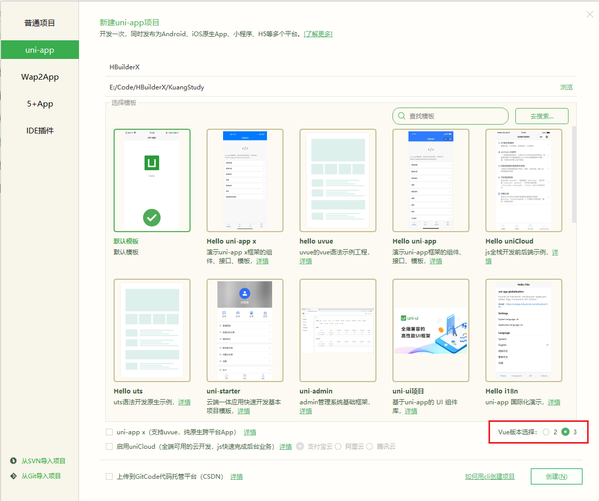
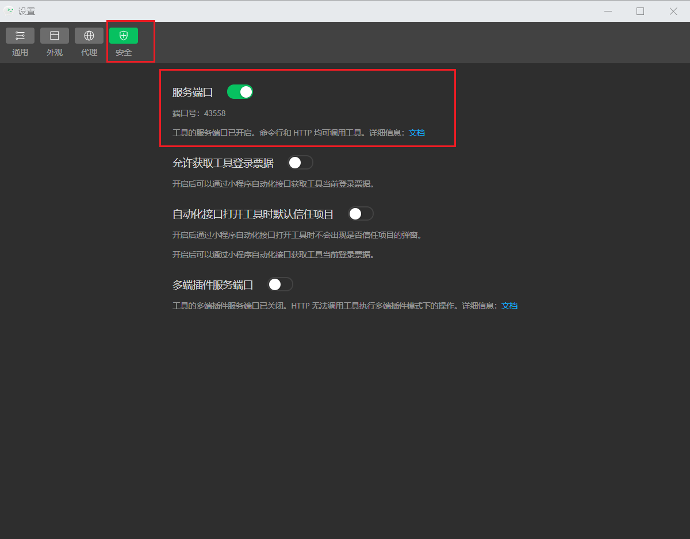
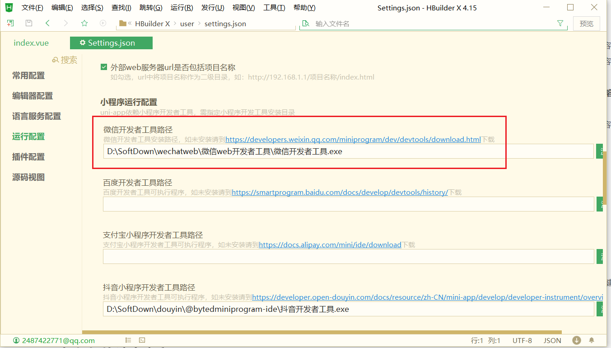
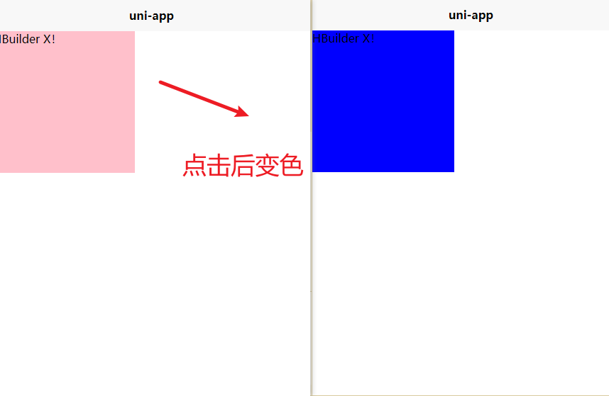

# 1、环境安装

## 1.1、HBuilderX

1. https://dcloud.io/hbuilderx.html  下载解压使用HBuilderX
2. 新建 - 项目 - 创建




## 1.2、工程简介

一个 uni-app 工程，就是一个 Vue 项目，默认包含如下目录及文件：

- pages：业务页面文件存放的目录
- static：存放应用引用的本地静态资源（如图片、视频等）的目录，注意：静态资源都应存放于此目录
- App.vue：应用配置，用来配置App全局样式以及监听
- main.js：Vue初始化入口文件
- manifest.json： 配置应用名称、appid、logo、版本等打包信息
- pages.json：配置页面路由、导航条、选项卡等页面类信息


## 1.3、运行

1. 下载安装微信开发者工具：https://developers.weixin.qq.com/miniprogram/dev/devtools/download.html
2. 下载安装抖音开发者工具：https://developer.open-douyin.com/docs/resource/zh-CN/mini-app/develop/developer-instrument/download/developer-instrument-update-and-download


### 1.3.1、微信开发者工具设置

1. 设置 - 安全 - 打开服务端口




2. HBuilderX 配置微信开发者工具路径




# 2、组件

## 2.1、视图容器view

视图容器。它类似于传统html中的div，用于包裹各种元素内容。

| 属性名                 | 类型    | 默认值 | 说明                                                         |
| ---------------------- | ------- | ------ | ------------------------------------------------------------ |
| hover-class            | String  | none   | 指定按下去的样式类。当 hover-class="none" 时，没有点击态效果 |
| hover-stop-propagation | Boolean | false  | 指定是否阻止本节点的祖先节点出现点击态，App、H5、支付宝小程序、百度小程序不支持（支付宝小程序、百度小程序文档中都有此属性，实测未支持） |
| hover-start-time       | Number  | 50     | 按住后多久出现点击态，单位毫秒                               |

示例：

```vue
<template>
	<!-- 点击后背景变色 -->
	<view class="box" hover-class="boxHover" hover-start-time="0">
		HBuilder X！
	</view>
</template>

<script setup>
	
</script>

<style lang="scss"> 
.box{
	width: 200px;
	height: 200px;
	background: pink;
}

.boxHover{
	background: blue;
}
</style>
```




